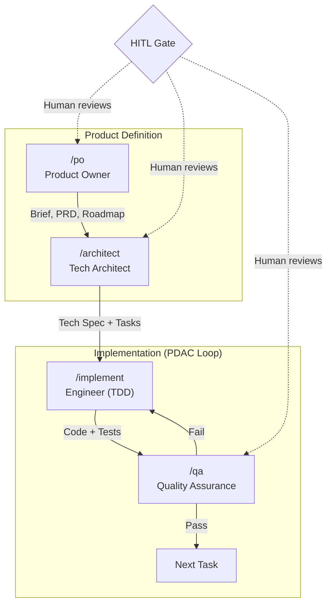
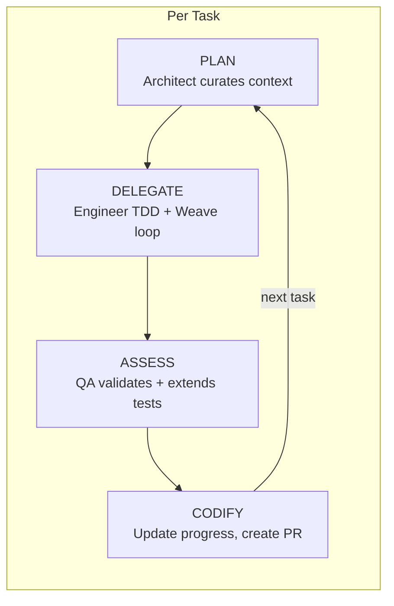

# /help

Display an interactive guide to Weave with diagrams and command reference.

## Instructions

When the user runs `/help`, display the overview then offer topic navigation via AskUserQuestion.

### Display Overview First

```
Weave: Spec-Driven SDLC Agent
```



### Then Offer Topics

Use AskUserQuestion with these options:
- **Commands** — full command reference
- **PDAC Loop** — how Plan-Delegate-Assess-Codify works
- **Agent Roles** — what each agent does
- **Spec Artifacts** — documents generated and why
- **Getting Started** — step-by-step first project

### Topic: Commands

Display the full command table:

| Command | Description | When to Use |
|---------|-------------|-------------|
| `/init` | Scaffold `.claude/` project structure | First time setup for any project |
| `/po` | Product Owner elicitation | Define or refine requirements |
| `/architect` | Tech spec + task decomposition | After PRD is approved |
| `/implement` | TDD implementation loop | After tasks are approved |
| `/qa` | Standalone quality check | Ad-hoc validation outside the loop |
| `/status` | Kanban progress dashboard | Anytime — check where things stand |
| `/spec-review` | Audit specs for completeness | Before scaffolding or anytime |
| `/help` | This guide | Learning the system |

### Topic: PDAC Loop

PDAC runs within each phase, between human-defined HITL gates:



- **Plan**: Architect reads the task brief, verifies DoR is satisfied, curates context
- **Delegate**: Engineer receives self-contained brief, writes failing tests first, implements, refactors. Weave loop iterates until DoD met.
- **Assess**: QA validates against AC, DoD, diagrams, design decisions. Extends tests for edge cases. Produces pass/fail report.
- **Codify**: Update progress.json, create PR, check if phase gate is reached.

### Topic: Agent Roles

| Agent | Invoked By | Input | Output | Key Constraint |
|-------|-----------|-------|--------|----------------|
| **Product Owner** | `/po` | Meeting notes, context docs, human dialogue | Brief, PRD, Roadmap, Epics | Never makes tech decisions |
| **Tech Architect** | `/architect` | Approved PRD + Roadmap | Tech Spec (C4, OpenAPI, ERD, etc.), Task Briefs, ADRs | Never writes implementation code |
| **Engineer** | `/implement` | Self-contained task brief | Implemented code + tests, conventional commits | Only reads the task brief — no other spec files |
| **QA** | `/implement` or `/qa` | Task brief + implemented code | Pass/fail report, extended edge case tests | Never modifies implementation code |

Each agent runs in its own worktree for isolation. Fresh context per task prevents context rot.

### Topic: Spec Artifacts

```
Brief (what + why)
  └── PRD (detailed requirements, user stories)
       └── Roadmap (phases, HITL gates, entry/exit criteria)
            └── Phase
                 ├── Tech Spec
                 │    ├── architecture.md     C4 diagrams (all 4 levels)
                 │    ├── openapi.yaml        API contracts
                 │    ├── data-model.md       ERD
                 │    ├── business-process.md  Flows, state machines, sequences
                 │    ├── class-diagram.md    Domain model
                 │    ├── ci-cd.md            Pipeline
                 │    ├── testing-strategy.md Framework config, coverage
                 │    ├── definition-of-ready.md
                 │    └── definition-of-done.md
                 ├── Epics → Tasks (rich self-contained briefs)
                 └── Decisions (ADRs)
```

Each task brief includes: user story, AC, pseudocode, API contracts, diagram refs, design decisions, DoR/DoD checklists, test requirements (named scenarios, type counts, AC mapping), and implementation hints.

### Topic: Getting Started

Step-by-step for your first Weave project:

1. **Load the plugin**: `claude --plugin-dir /path/to/weave`
2. **Create a project directory** and `cd` into it
3. **Run** `/init` — scaffolds `.claude/` structure
4. **Run** `/po` — the PO agent will guide you through requirements
   - Answer multiple-choice questions
   - Review each spec section (approve/amend/reject)
   - Brief → PRD → Roadmap → Epics
5. **Run** `/architect` — generates tech spec and task briefs
   - C4 diagrams, OpenAPI, data model, testing strategy
   - Task decomposition with rich briefs
6. **Run** `/implement` — the PDAC loop begins
   - First run: scaffolds project boilerplate (HITL gate after)
   - Then: TDD loop per task (Architect → Engineer → QA)
   - Phase gates for human review
7. **Check progress** with `/status` anytime
