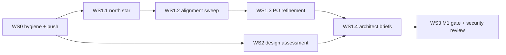

# Plan: v1 consolidation — spec refinement, design uplift, M1 close-out

**Date:** 2026-07-08 · **Status:** approved-shape, pending execution · **Owner:** Gareth + Fable orchestrator

This plan refines the four-task prompt (Task 0 spec refinement, Task 1 spec hardening, Task 2 design
assessment, Task 3 backlog completion, Task 4 phase gate) into three workstreams plus a step-0
hygiene pass. Tasks 0, 1 and 3 overlapped ~70% and are **merged into one spec workstream**
(user-confirmed via MCQ, 2026-07-08).

## Locked decisions (MCQ, 2026-07-08)

1. **Tasks 0 + 1 + 3 merge** into one spec workstream: north-star ELI5 → alignment sweep → PO →
   Architect.
2. **Push early, gate last.** Working tree tidied and main pushed as step 0; the full M1 gate +
   security review runs LAST so it covers all amendments made during this work.
3. **GitHub Actions unavailable until 2026-08-01** (credits exhausted). "Pushed green main" cannot
   be satisfied via CI — the gate substitutes **local verification** (test pyramid, mutation-strict,
   `ui_verify --full`, `/security-review`) with an explicit, user-approved waiver recorded in
   `PROGRAM-M1-SIGNOFF.md`. Fixing PR pipelines is deferred work, tracked in project memory through
   2026-08-01. This is a documented substitution, not a weakened gate.
4. **Working-tree tidy is step 0** — commit `contracts.md` (CE-METRICS-1), ADR-012/013; advisor
   consult + HITL for `stop.py` (enforcement core).
5. **Binding (memory `decision_tenancy-workspace-alignment`):** workspace ≡ company/tenant. No new
   feature may build on the intra-tenant multi-workspace model.
6. **Ground rule:** spec + task briefs only in the spec workstream — no application code built.
   Design workstream produces assessments, prototypes (scratchpad/tmp), and task requirements — its
   remediation lands as v1 tasks, not inline edits.

## Session split (recommended — see coaching note)

Each workstream runs in its **own session**, continuity carried by this plan + the shared notebook.
One giant session would exhaust context mid-sweep and mix HITL cadences (MCQ-heavy PO vs
screenshot-heavy design vs mechanical gate).

| # | Session | Contents | Mode |
|---|---|---|---|
| 0 | Hygiene & push | WS0 below (short, HITL-dense) | interactive |
| 1 | North star + alignment sweep | WS1 steps 1–2 | read-heavy, sonnet fan-out |
| 2 | PO refinement | WS1 step 3 (`/po`) | MCQ-heavy, fable |
| 3 | Design assessment | WS2 (can run parallel to session 2) | browser + council |
| 4 | Architect briefs | WS1 step 4 (`/architect`) — consumes session 2 + 3 outputs | volume, sonnet |
| 5 | M1 gate close-out | WS3 | mechanical + security review |

## Notebook

`/.thinking.md` at repo root (per CLAUDE.md working protocol — **never commit**). Sections:

- **Goal / north star** — current approved ELI5 statement.
- **Fine-grained task list** — checkbox list per workstream step, updated as work lands.
- **Findings ledger** — spec misalignments, tech debt, sequencing issues (ID'd F-001…), each tagged
  `m2/v1` or `post-v1` disposition.
- **Open MCQs** — questions queued for the user, answered inline.
- **Agent handoffs** — what each sub-agent was told / returned, so post-compaction sessions resume
  without re-reading.

## Model right-sizing

- **Fable:** orchestrator, PO/Architect judgement calls, design council synthesis, advisor consults,
  reviewing sonnet output.
- **Sonnet:** spec-sweep readers (one per engine), UI inspection/screenshot description, competitor
  research, draft generation, task-brief drafting.
- Sub-agents get scoped briefs + the notebook path; they return structured findings, not file dumps.

---

## WS0 — Hygiene & push (step 0, blocking)

1. Review each pending change with user: `contracts.md` diff (CE-METRICS-1 amendment — commit or
   fold), `ADR-012.md` / `ADR-013.md` (commit), `SCRATCHPAD.md` (elicitation inputs —
   keep uncommitted or commit as notes, user call).
2. `stop.py` (enforcement core): advisor consult → `ADV-NNN` record → HITL approval → commit with
   `Advisor-Consult:` trailer.
3. Push main (HITL confirm). CI will not run — noted, accepted per decision 3.
4. Save project memory: *GH Actions credits exhausted; PR-pipeline fixes + CI-dependent gates
   deferred until 2026-08-01; gates use local verification meanwhile.*

**Done when:** clean tree, main pushed, memory saved.

## WS1 — Spec workstream (merged Tasks 0 + 1 + 3)

### Step 1 — North star (ELI5)

State the project goal ELI5; describe how ontology/BPMO + documentation + project flow behave,
with a loose UI flow / user story for customer tasks and agent/system behaviours (diagrams,
flowcharts). User reviews and refines — this becomes the yardstick for every later scope decision.
Draft lives in the notebook; the approved version is folded into `weave-spec.md` by the PO pass.

### Step 2 — Alignment sweep

Sonnet fan-out, one reader per engine (weave-platform, constitution, build, events-actions,
graph-explorer, onboarding), each reading its `engines/<entity>.md` + `tech-spec/` + `m1/tasks` +
`m2/tasks` + `decisions/`, cross-checked against `contracts.md`, `dev-environment.md`,
`personas.md`, `weave-spec.md`, and the state ledgers (`qa-cross-task-findings.md`,
`qa-project-issues.md`, `spec-reviews/`, `escalations/`, `advisor-consults/`).

Hunting: misalignment with vision/north star, odd sequencing, out-of-date vs delivered work, tech
debt, contradictions with ADRs or advisor findings. Output: findings ledger + tech-debt register,
each item dispositioned `v1` / `post-v1` (MCQ where genuinely ambiguous).

Also produce: **per-epic ELI5 list** of functionality delivered in the upcoming (merged) milestone.

### Step 3 — PO refinement (`/po`, fable)

Scope decisions via MCQ (near-ELI5, with recommendations):

- **Merge M2 + v1 into one "v1" milestone** anchored on the **Hammerbarn worked example** (seeded
  Bunnings-like retailer: company graph, processes, systems, policies, people; every v1 feature
  demoed against it). User has stated intent twice — confirm formally + agree seed scope.
- **CE + GE spec merge** (single UI/nav area) — confirm.
- **Post-v1 push candidates** from the sweep — confirm per item.
- **Milestone directory naming** for the merged milestone (`v1/` vs keep `m2/`) — confirm.
- **Sequencing/Roadmap** we should be ruthless about what gets shipped in this phase, and some may be moved to post-v1, find relevant options

Elicitation inputs to fold in (confirm each via MCQ, don't assume):

- The nine session-discovered needs from 2026-07-08: tenancy realignment (biggest,
  milestone-level), manual CE authoring form (kind picker → SHACL-driven fields → CE-WRITE-1),
  billing pricing table, Build grounding on real CE-READ-1 content, service-to-service auth
  pattern, email notification channel (SES) + preferences, kind descriptions via `skos:definition`,
  per-tenant custom SHACL rules (extend existing compliance page), CE-READ-1 versions-shape
  contract truth-up.
- `SCRATCHPAD.md` raw notes.
- Design workstream findings (JTBD doc, IA/nav changes) once available.

Elicitation technique menu (use richer forms where MCQ is thin): Six Hats, Five Whys, start-at-the-
end / working-backwards, engines-and-anchors retro framing, Twenty Questions via `/elicit`.

### Step 4 — Architect (`/architect`)

Tech-spec deltas + task briefs under `docs/specs/weave/engines/<entity>/<milestone>/tasks/`.
Contract amendments (service-auth addition, CE-READ-1 truth-up, CE-METRICS-1 if not already
committed) via `arch-contracts` / ADRs. Design requirements from WS2 attached to relevant briefs.
Progress.json is NOT advanced past the M1 gate until WS3 completes (precondition honoured).

**Done when:** merged-milestone backlog complete, spec-review gate (`/spec-review`) passes, per-epic
ELI5 list approved.

## WS2 — Design assessment (Task 2, parallel session)

Persona: UI/UX/CX designer. Council review (5-persona **plus design/UX persona**).

1. MCQs to refine scope + approach.
2. Context review: `docs/design/poc-ia-proposal.md`, `docs/standards/design/`, prior
   `.claude/reports` competitor research, `.claude/state` session summaries.
3. Live inspection: Chrome tools against `localhost:3000` — screenshots, actually click through
   (nav, `/ce`, `/ce/query`, Build > Request, explorer, forms). Task-per-page lens: what job is the
   user doing here; how do best-in-class apps do it.
4. Competitor/pattern research (sonnet).
5. Council assessment → findings MCQs with user.
6. **2–3 visual treatment options** (quick HTML mocks) in the scratchpad dir → feedback MCQs.
   Focus: app layout, typography (font size up), header (padding), logo, sidebars, secondary nav,
   page layout, graph explorer, forms, `/ce/query` (graph-visual results), Build-request-in-project.
7. Remediation: findings become v1 task requirements (feed WS1 step 4) + updates to
   `docs/design/poc-ia-proposal.md` and `docs/standards/design/`. Deliverables also include a
   **JTBD document** and a **notifications role/types recommendation**.
8. **Design-agent proposal** (tangent): recommend a `.claude/agents/design.md` agent wired into
   spec creation (adds design requirements to task briefs) and epic/phase-gate QA (visual +
   usability verification, augmenting `quality-assurance.md` with checks sourced from
   `poc-ia-proposal.md` + `docs/standards/design/`). This is a **harness change** → advisor consult
   + HITL before anything lands.

**Done when:** user has picked a visual direction, findings are tasks/requirements, design-agent
recommendation delivered.

## WS3 — M1 gate close-out (last)

1. Confirm all WS1/WS2 commits are pushed.
2. Run locally: full test pyramid, mutation-strict, `ui_verify --full`.
3. `/security-review` over all accumulated changes since `ac0ad18` (the AMEND verdict).
4. Write `PROGRAM-M1-SIGNOFF.md` including the explicit CI-unavailability waiver (decision 3),
   user-approved.
5. Update `progress.json`; v1 execution is unblocked from here.

**Done when:** signoff file committed, progress spine reflects M1 complete.

## Sequencing

WS2 runs parallel to WS1.1–1.3; it must land before WS1.4 finishes so design requirements reach the
task briefs.

## HITL points

- WS0: every commit decision; stop.py advisor consult + approval; push.
- WS1: north-star approval; every scope MCQ; PO section approvals (po-strategy/po-epic HITL);
  architect artifact approvals; spec-review verdict.
- WS2: scope MCQs; findings MCQs; visual-direction pick; design-agent harness change approval.
- WS3: CI-waiver approval; signoff.

## Risks

- **Gate waiver optics:** substitution documented in signoff, never silent — weakening a gate is
  never a valid fix (git-safety rule).
- **Context exhaustion:** mitigated by session split + notebook; sub-agents return findings, not
  dumps.
- **Design/spec churn:** design findings enter as task requirements only, so specs don't thrash
  mid-PO.

## Open MCQ backlog (asked during execution, not now)

Milestone dir naming · CE+GE merge · Hammerbarn seed scope · post-v1 candidates per finding ·
notifications spec scope · SCRATCHPAD item-by-item disposition · design direction pick ·
design-agent wiring.
