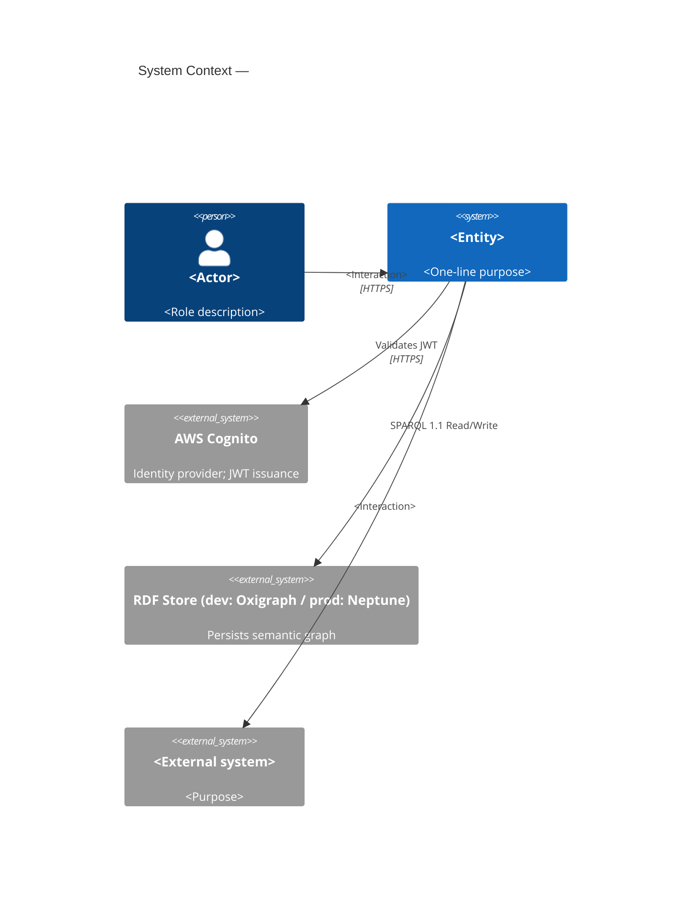
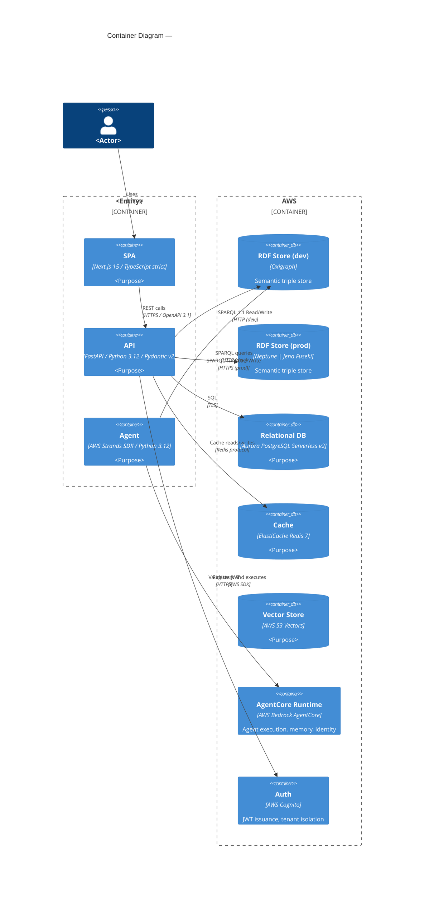
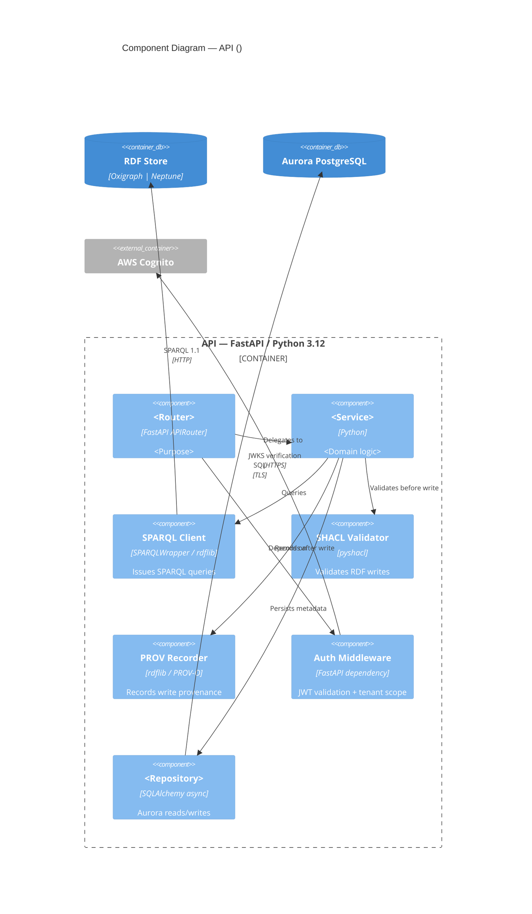

# arch-c4 Skill

Produce a C4 architecture document (`architecture.md`) for a Weave spec entity, one diagram
level at a time, with HITL review after each level. Invoked by the Architect agent when a
tech spec needs a formal C4 model — Level 1 through Level 3 — plus adversarially reviewed
design decisions and quality-attribute invariants.

## Model

- **Drafting phase:** claude-opus-4-8 (spatial reasoning, tradeoff analysis, adversarial critic)

Opus is required here: C4 diagrams demand accurate boundary reasoning, technology placement,
and the ability to hold the full system in context while running the adversarial-critic pass.
Sonnet is not sufficient for this level of architectural precision.

## Input

Before doing anything else, read:

1. `CLAUDE.md` — Weave product context, confirmed stack, Plugin Laws A-F, agent laws
2. `.claude/spec-templates/tech-spec/architecture.md` — section scaffold (use for diagram
   structure; never leave `{{}}` in output)
3. `.claude/spec-templates/architecture/architecture.md` — current-state template (reference
   for confidence-level metadata; do not copy its brownfield format)
4. `.claude/spec-templates/architecture/invariants.md` — invariants section shape
5. `.claude/specs/<entity>/02-prd/prd.md` — the parent PRD; use it to identify actors,
   external systems, and integration requirements
6. `.claude/specs/<entity>/03-roadmap/roadmap.md` — phase structure that shapes the diagram
   boundary (if present)
7. `.claude/specs/<entity>/04-arch/` — any existing ADRs or prior architecture drafts

Ask the user which entity this diagram is for (e.g. `constitution-engine`, `build-engine`,
`weave-platform`) if not supplied as an argument. Derive the output path as:

`.claude/specs/<entity>/04-arch/tech-spec/architecture.md`

## Instructions

### Step 0 — State the governing principle (never skip)

Write 2-3 sentences naming the principle that governs a C4 architecture document before
writing anything else.

Example: "A C4 diagram's job is to answer a single question at each zoom level: what exists,
how it communicates, and why the boundaries are where they are. If a stakeholder reading Level
2 still has to guess which process runs which container, the diagram has failed. Every
boundary decision must be justifiable as a deployment, security, or scaling unit."

Reference this principle when justifying boundary placement and technology choices during
the HITL loop.

### Step 1 — Context ingestion

1. Read all files listed in the Input section above.
2. Identify the entity's actors, external systems, containers, and known integration points
   from the PRD and roadmap.
3. Summarise what you know in 4 bullets before proceeding:
   - The entity's purpose and the primary actor(s) interacting with it
   - External systems and integration boundaries visible in the PRD
   - Weave stack components confirmed for this entity (from `CLAUDE.md`)
   - What is NOT yet decided (e.g. RDF store choice deferred to prod, agent runtime config)

Ask via AskUserQuestion:

- "What additional context do you have for this architecture?"
  Options: Meeting notes or transcript / Existing whiteboard / Existing draft to refine /
  Confirmed decisions not yet in CLAUDE.md / Start from context above

### Step 2 — Confirm entity scope and boundary

Before drawing any diagram, confirm the system boundary:

1. State the proposed boundary in plain English:
   - What is INSIDE the system boundary (Weave code you own)
   - What is OUTSIDE (AWS services, external SaaS, client systems)
   - Which Weave sub-systems are peer-systems vs. components of this entity

2. Ask via AskUserQuestion:
   - "Does this system boundary look right?"
     Options: Approved / Adjust boundary / Collapse sub-systems / Expand boundary

Only proceed to diagram production once the boundary is approved. Never draw before the
boundary is confirmed.

### Step 3 — Section-by-section production

Produce the architecture document in this exact order. For each section:

1. **Write** the section to the file
2. **Run the constitutional self-check** (see below) — stop and revise if any Law violated
3. **Present** the section to the user (display the written content including the mermaid block)
4. **Emit a confidence block** (see below) immediately before the HITL question
5. **Ask** via AskUserQuestion: Approve / Amend / Reject
6. If Amend: apply changes, show diff, re-present with updated confidence block
7. If Reject: regenerate with a cleaner approach, show the new version

**Sections in order:**

---

#### Section A — Overview and C4 Model Explanation

Write a brief orientation paragraph (3-5 sentences) that:

- Names the entity and its purpose in Weave's architecture
- Explains which C4 levels are covered in this document (1-3) and which are deferred (4)
- States the Weave stack components that appear at each level
- Notes the RDF store progression: Oxigraph (dev/test) → Neptune or Jena Fuseki (prod)
- Notes the AI layer boundary: AWS Strands SDK → AWS Bedrock AgentCore

Do NOT write a generic C4 tutorial. The paragraph assumes the reader knows C4 and focuses
on what is specific to this entity.

---

#### Section B — Level 1: System Context Diagram

**Diagram is MANDATORY.** Use C4Context mermaid notation exactly.

Constraints:
- Show the PRIMARY actor(s) — human users and/or machine clients
- Show the SYSTEM under design as a single box
- Show ALL external systems: AWS Cognito/Auth0, downstream Weave sub-systems that are
  peer-level, client data stores (Snowflake, Databricks, S3, Azure, Jira, ServiceNow)
- Show communication directions with labelled `Rel()`
- Do NOT show internal containers at this level

Template (adapt, do not copy verbatim):



After drafting, ask via AskUserQuestion before proceeding to Level 2:

- "Level 1 System Context — approve before I draw Level 2?"
  Options: Approved — proceed to Level 2 / Amend this diagram first / Reject and redraw

---

#### Section C — Level 2: Container Diagram

**Diagram is MANDATORY.** Use C4Container mermaid notation exactly.

Constraints:
- Show each deployable/runnable unit as a Container: SPA, API service, Lambda functions,
  agents, data stores, caches
- Use the confirmed Weave stack labels:
  - Frontend: `Next.js 15 App Router / TypeScript strict`
  - API: `FastAPI / Python 3.12 / Pydantic v2`
  - RDF store: `Oxigraph (dev) | Neptune (prod)` — show BOTH with a note
  - Vector store: `AWS S3 Vectors`
  - Relational: `Aurora PostgreSQL Serverless v2`
  - Cache: `ElastiCache Redis 7`
  - Agent: `AWS Strands SDK → AgentCore Runtime`
- Show the AWS boundary as a `Container_Boundary(aws, "AWS")`
- Show data-flow direction on every `Rel()` with protocol label
- Person and System_Ext from Level 1 appear at the edges (not expanded)

Template (adapt, do not copy verbatim):



After drafting, ask via AskUserQuestion before proceeding to Level 3:

- "Level 2 Container — approve before I draw Level 3?"
  Options: Approved — proceed to Level 3 / Amend this diagram first / Reject and redraw

---

#### Section D — Level 3: Component Diagram (key components only)

**Diagram is MANDATORY.** Use C4Component mermaid notation exactly. Cover the most
architecturally significant container only (typically the API or agent). Do not attempt
to draw all containers at L3 — choose one and note which was chosen and why.

Constraints:
- Focus on the container with the highest architectural complexity or risk
- Show internal components (route handlers, services, repositories, domain models)
- Show inbound calls from Level 2 peers
- Show outbound calls to stores/caches/external APIs
- Keep to ≤ 12 components in one diagram; split to a second diagram if needed
- Reference exact module/package names where known from the PRD or existing code
- Do NOT show class-level detail (that belongs in `arch-class`)

Template (adapt, do not copy verbatim):



After drafting, ask via AskUserQuestion before proceeding to Design Decisions:

- "Level 3 Component — approve before I run the adversarial-critic pass?"
  Options: Approved — run critic pass / Amend this diagram first / Reject and redraw /
  Draw a different container at L3 instead

---

#### Section E — Design Decisions (adversarial critic pass)

**Run an adversarial critic pass BEFORE writing this section.**

The critic pass asks: "What would a sceptical senior engineer ask after seeing these three
diagrams?" Generate at least 5 adversarial questions internally, then resolve each:

Mandatory critic questions (always run these):

1. "Why is the RDF store boundary drawn here and not inside the Weave SPA boundary?"
2. "What happens to in-flight SPARQL writes if the Lambda function cold-starts mid-request?"
3. "Where does multi-tenancy enforcement happen — is it the API layer, the RDF store, or both?"
4. "Does the agent container have a blast radius if it consumes unbounded tokens on AgentCore?"
5. "What is the fallback if Neptune is unavailable and only Oxigraph dev is running?"

Add entity-specific critic questions from the PRD's risk/constraint sections.

Format the output as a table:

| # | Decision | Rationale | Alternatives Rejected | Critic Challenge | Response |
|---|----------|-----------|----------------------|-----------------|---------|

Rules:
- Minimum 5 rows (the 5 mandatory critic questions above, resolved)
- Add entity-specific decisions surfaced during the diagram phases
- "Alternatives Rejected" must name at least one alternative, not just say "N/A"
- "Critic Challenge" is the adversarial question; "Response" is the resolution
- Reference ADRs if they exist (link to `.claude/specs/<entity>/04-arch/decisions/`)
- Reference the confirmed Weave stack for any technology-selection decisions

---

#### Section F — Invariants and Quality Attributes

Two sub-sections:

**Invariants** — constraints that must hold at all times in the system. Use EARS notation:

```
WHEN [trigger or steady state] THE SYSTEM SHALL [constraint]
```

Mandatory invariants to include (adapt to entity):

- Multi-tenancy: WHEN any API request is processed THE SYSTEM SHALL scope all RDF graph
  reads and writes to the authenticated tenant's named graph.
- SHACL validation: WHEN a triple is written to the RDF store THE SYSTEM SHALL validate it
  against the entity's SHACL shapes before persisting and reject invalid writes with HTTP 422.
- Provenance: WHEN any RDF write is committed THE SYSTEM SHALL record a PROV-O activity with
  actor IRI, timestamp, and changeset IRI.
- Auth: WHEN an unauthenticated request reaches any API endpoint THE SYSTEM SHALL return
  HTTP 401 and log the attempt to CloudWatch.
- Dev/prod parity: WHEN running in the test environment THE SYSTEM SHALL use LocalStack for
  all AWS services and Oxigraph for the RDF store — no real cloud calls in tests.

Add entity-specific invariants from the PRD's functional requirements and constraints.

**Quality Attributes** — table of non-functional requirements with measurable targets:

| Attribute | Target | Measurement | Risk if missed |
|-----------|--------|-------------|----------------|
| SPARQL read latency | p95 < 500ms under 50 concurrent users | Locust load test in CI | Graph explorer unusable |
| API write throughput | ≥ 100 triple-writes/sec sustained | Locust load test in CI | Build engine pipeline stall |
| Cold-start latency | Lambda p99 < 3s | CloudWatch Insights | Agent task timeout |
| Availability | 99.9% monthly uptime | CloudWatch alarms | SLA breach |
| Mutation test coverage | ≥ 70% | mutmut in CI | Silent regressions |

Adapt targets to entity specifics from the PRD. Do not copy these verbatim — replace
placeholders with entity-appropriate thresholds.

---

### After all sections approved

1. Update the document footer to:
   `*Generated by Weave arch-c4 skill. Review and approve before task decomposition.*`

2. Create the output directory if it does not exist:

```bash
mkdir -p .claude/specs/<entity>/04-arch/tech-spec/
```

3. Commit the architecture file:

```bash
git add .claude/specs/<entity>/04-arch/tech-spec/architecture.md
git commit -m "docs(<entity>): add C4 architecture (L1–L3 + design decisions)"
```

4. Tell the user:
   "architecture.md complete. Next steps:
   - `/arch-adr` — formalise key decisions as ADRs
   - `/arch-data-model` — draw the data model for the relational layer
   - `/arch-task-brief` — decompose into implementation tasks"

## Constitutional self-check (run before every section delivery)

Walk both Law layers. Write one line per Law, format exactly:

```
Plugin Law A (common-stack first):       complied | violated | N/A — <reason>
Plugin Law B (testable):                 complied | violated | N/A — <reason>
Plugin Law C (council quality):          complied | violated | N/A — <reason>
Plugin Law D (stacked PRs):              complied | violated | N/A — <reason>
Plugin Law E (complexity budget):        complied | violated | N/A — <reason>
Plugin Law F (no real cloud in tests):   complied | violated | N/A — <reason>
C4 Law 1 (mermaid mandatory):            complied | violated | N/A — <reason>
C4 Law 2 (boundary confirmed first):     complied | violated | N/A — <reason>
C4 Law 3 (HITL between levels):          complied | violated | N/A — <reason>
C4 Law 4 (adversarial critic ran):       complied | violated | N/A — <reason>
C4 Law 5 (EARS invariants):              complied | violated | N/A — <reason>
C4 Law 6 (dev/prod RDF both shown):      complied | violated | N/A — <reason>
C4 Law 7 (Strands→AgentCore boundary):   complied | violated | N/A — <reason>
```

**C4-specific laws:**

- **C4 Law 1** — Every diagram level (L1, L2, L3) MUST include a valid mermaid C4 block.
  A prose description without a mermaid block is a violation.
- **C4 Law 2** — The system boundary (inside vs. outside) MUST be confirmed by the user
  (Step 2) before any diagram is written.
- **C4 Law 3** — The user MUST approve each diagram level before the next level is produced.
  No multi-level dumps.
- **C4 Law 4** — The adversarial critic pass MUST run internally before Section E is written.
  The 5 mandatory questions must appear in the Design Decisions table.
- **C4 Law 5** — All invariants MUST use EARS notation (`WHEN … THE SYSTEM SHALL …`).
  No exceptions.
- **C4 Law 6** — The RDF store progression (Oxigraph dev → Neptune/Jena Fuseki prod) MUST
  appear in both the Level 2 container diagram and the Quality Attributes section.
- **C4 Law 7** — The AWS Strands → AgentCore boundary MUST be visible in the Level 2 diagram
  wherever an agent container is present in the entity scope.

If ANY line says "violated": STOP, revise the section, re-run the check.
Output the trace in chat (user sees it). Keeps Laws active across long sessions.

## Confidence block (emit before every HITL question)

Output this block immediately after presenting the section, before the AskUserQuestion call:

```
<section-confidence>
Confidence: high | medium | low
Weakest part: <name the specific diagram element, table row, or invariant>
Why: <1 sentence — what input was missing or what was assumed>
</section-confidence>
```

Rules:

- Always name the weakest part, even on high-confidence sections.
- "Why" must reference a specific input gap, not a generic hedge like "architecture is complex".
- The block lives in chat only — do not embed it in the file.

Low-confidence triggers: external system integrations not named in the PRD; agent container
scope not confirmed (what the agent does vs. what the API does); RDF named-graph strategy
not specified; quality-attribute thresholds not sourced from the PRD.

## Output

**File:** `.claude/specs/<entity>/04-arch/tech-spec/architecture.md`

Create the directory if it doesn't exist:

```bash
mkdir -p .claude/specs/<entity>/04-arch/tech-spec/
```

**Template:** `.claude/spec-templates/tech-spec/architecture.md`

Never leave `{{PLACEHOLDER}}` in the output. All template variables must be resolved before
presenting the section to the user.

**Frontmatter:**

```yaml
---
title: "Architecture: <Entity Display Name>"
status: Draft
created: <YYYY-MM-DD>
entity: <entity>
phase: <Phase N — Phase Name>
prd_ref: "../../02-prd/prd.md"
---
```

**Footer line:**

```
*Generated by Weave arch-c4 skill. Review and approve before task decomposition.*
```

## Evaluation Criteria

A well-produced architecture document:

- Has three mermaid C4 diagrams (L1 C4Context, L2 C4Container, L3 C4Component) — no
  level may be skipped or replaced with prose
- Shows the RDF store dev/prod progression (Oxigraph → Neptune | Jena Fuseki) in the
  Level 2 container diagram
- Shows the AWS Strands → AgentCore boundary in Level 2 wherever an agent is in scope
- Has a Design Decisions table with ≥ 5 rows including responses to all 5 mandatory
  adversarial-critic questions
- Has ≥ 5 EARS-notated invariants including multi-tenancy, SHACL validation, PROV-O
  provenance, auth, and dev/prod parity
- Has a Quality Attributes table with measurable, entity-specific targets (not the
  template defaults verbatim)
- Uses confirmed Weave stack labels in all diagram tech annotations
- Has no `{{PLACEHOLDER}}` text in the output file
- Was delivered section-by-section with HITL at every level before the next level was drawn
- System boundary was confirmed by the user (Step 2) before any diagram was written
- Constitutional self-check trace present in chat for every section
- Committed with a conventional commit message
  (`docs(<entity>): add C4 architecture (L1–L3 + design decisions)`)
