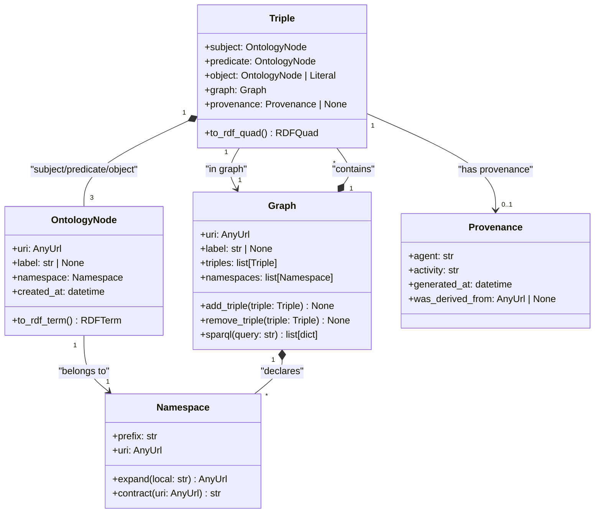
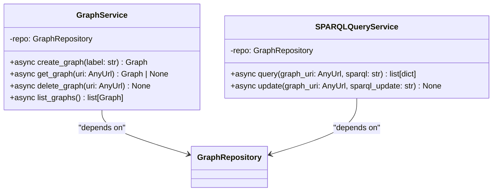
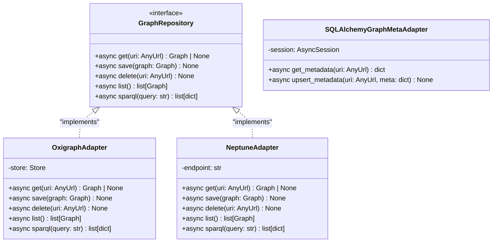

# Arch Class Skill

Produce a class diagram (`class-diagram.md`) for a Weave spec entity, mapping the domain
model as Mermaid `classDiagram` notation with full inheritance and composition. Invoked
during the architecture phase after the C4 container diagram has been approved.

## Model

- **Drafting phase:** claude-sonnet-5 (structured generation, precise relationships)
- **Reasoning tier:** generation — translates spec intent into typed domain model

## Input

Before doing anything else, read:

1. `CLAUDE.md` — Weave product context, confirmed stack, laws
2. `.claude/spec-templates/architecture/class.md` — section structure (scaffold; never leave
   `{{}}` in output)
3. `docs/specs/weave/engines/<entity>/tech-spec/architecture.md` if it exists — confirms Level 3
   (module) boundary before class-level work is trustworthy
4. `docs/specs/weave/engines/<entity>.md` if it exists — domain vocabulary and bounded
   contexts
5. Any existing draft (`docs/specs/weave/engines/<entity>/tech-spec/class-diagram.md`) to
   continue or refine

Ask the user which entity this diagram is for (e.g. `constitution-engine`, `build-engine`,
`weave-platform`) if not supplied. Output path is:

```
docs/specs/weave/engines/<entity>/tech-spec/class-diagram.md
```

## Instructions

### Step 0 — State the governing principle (never skip)

Write 2-3 sentences naming the principle that governs a class diagram before producing
anything else.

Example: "A class diagram's job is to make the domain model legible — not to document every
field in every object. If an architect reads it and still has to guess how the graph model
composes, the diagram has failed. Every class shown must carry its own weight; boilerplate
framework classes do not belong here."

Reference this principle when justifying decisions during the HITL loop.

### Step 1 — Context ingestion

1. Read the input files listed above.
2. Confirm the architecture.md Level 3 gate: if `architecture.md` is absent or DRAFT, emit
   a warning — the class diagram is also DRAFT until Level 3 is SME-confirmed.
3. Summarise what you know in 3 bullets before producing any diagram:
   - What bounded contexts / modules are in scope
   - What Weave core types are already known (OntologyNode, Triple, Graph, Namespace, etc.)
   - What is still unclear (relationships, cardinality, inheritance chains)

Ask via AskUserQuestion:
- "What context do you have?" Options: PRD / Architecture doc / Verbal description / Start
  from scratch

4. Before producing the diagram, offer structured elicitation via AskUserQuestion:
   "Run a structured elicitation first?" Options: Domain story walk-through / CRC cards /
   Event Storming / Skip

### Step 2 — Identify domain layers

Group all known domain objects into three layers before drawing any class:

| Layer | Description | Examples |
|---|---|---|
| Core domain | Primary domain entities with business identity | `OntologyNode`, `Triple`, `Graph`, `Namespace` |
| Service layer | Orchestration and use-case services (thin — no business logic) | `GraphService`, `SPARQLQueryService` |
| Repository / adapter | Port interfaces and concrete adapters to Oxigraph / Aurora / S3 | `GraphRepository`, `OxigraphAdapter` |

Present this table to the user as a scoping artefact. Ask via AskUserQuestion:
"Does this layer breakdown look right?" Options: Approve / Amend / Add more context

### Step 3 — Section-by-section production

Produce the diagram in this exact order. For each section:

1. **Write** the section to the file (never more than 8 classes per batch)
2. **Run the constitutional self-check** (see below) — stop and revise if any Law violated
3. **Present** the section to the user (display the written Mermaid block)
4. **Emit a confidence block** (see below) immediately before the HITL question
5. **Ask** via AskUserQuestion: Approve / Amend / Reject
6. If Amend: apply changes, show diff, re-present with updated confidence block
7. If Reject: regenerate with a cleaner approach, show the new version

**Sections in order:**

#### Section 1 — Overview narrative

Prose paragraph (4-6 sentences) describing the key domain objects and their relationships
at a conceptual level. No Mermaid yet. Must name:

- The root aggregate or central entity (e.g. `Graph` owns `Namespace` and `Triple`)
- The primary inheritance chains (e.g. all nodes extend `OntologyNode`)
- The key composition relationships (e.g. `Triple` is composed of three `OntologyNode`
  references: subject, predicate, object)
- Any polymorphic boundaries (e.g. `GraphRepository` is an interface; `OxigraphAdapter`
  and `AuroraAdapter` are concrete implementations)

#### Section 2 — Core domain classes (Pydantic models, batch 1: up to 5 classes)

Mermaid `classDiagram` block. Rules:

- Show Pydantic models as the primary data contracts (FastAPI/Python stack — Pydantic v2).
- Every class has at minimum: typed fields and method signatures (no bare class names).
- Show inheritance with `<|--` and composition with `*--`.
- Use `<<abstract>>` for base classes and `<<interface>>` for port interfaces.
- Show cardinality on associations where it is known (e.g. `1` to `*`).

Minimum required classes for Weave constitution-engine domain:



**HITL gate — do not proceed to batch 2 until this batch is approved.**

#### Section 3 — Core domain classes (batch 2: remaining domain classes, up to 5)

Any additional core domain classes not covered in batch 1. Common candidates:

- `SHACLShape` — validation shape bound to a node type
- `OntologyClass` — extends `OntologyNode`; represents an OWL class
- `OntologyProperty` — extends `OntologyNode`; represents an OWL property
- `SKOSConcept` — extends `OntologyNode`; represents a SKOS concept
- `Literal` — RDF literal with datatype and optional language tag

Apply the same Mermaid rules as Section 2. Show cross-batch relationships
(e.g. `OntologyClass <|-- OntologyNode`).

**HITL gate — do not proceed to service layer until this batch is approved.**

#### Section 4 — Service layer classes

Thin orchestration services — no business logic here; delegate to domain objects.
For Python/FastAPI: show these as regular classes with typed method signatures.
Mark any async methods explicitly (e.g. `+async query(sparql: str) list[dict]`).

Common Weave service classes:

- `GraphService` — CRUD on graphs; calls `GraphRepository`
- `SPARQLQueryService` — executes SPARQL queries; validates against `SHACLShape`
- `ProvenanceService` — writes `Provenance` records via PROV-O
- `OntologyImportService` — parses Turtle/OWL files into `Triple` objects

Show dependencies between services and the repository interface:



**HITL gate — do not proceed to repository layer until this batch is approved.**

#### Section 5 — Repository / adapter layer

Port interfaces and concrete adapters. Rules:

- Interfaces use `<<interface>>` stereotype (Python: `Protocol` or `ABC`).
- Concrete adapters use standard class notation with `implements` shown as `<|..`.
- Show only the methods relevant to the domain — no internal plumbing methods.

Standard Weave adapters:

- `GraphRepository` — interface (port)
- `OxigraphAdapter` — implements `GraphRepository`; dev/test store
- `NeptuneAdapter` — implements `GraphRepository`; prod store (stub until Neptune decision)
- `SQLAlchemyGraphMetaAdapter` — Aurora PostgreSQL adapter for graph metadata



**HITL gate — all sections must be approved before the commit step.**

### After all sections approved

Run `.claude/scripts/progress.sh` to update `.claude/state/progress.json` if present.

Commit the diagram:

```
git add docs/specs/weave/engines/<entity>/tech-spec/class-diagram.md
git commit -m "docs(<entity>): add class diagram"
```

Then tell the user: "Class diagram complete. Next step: `/arch-data-model` for the data
model, or `/arch-flows` for sequence diagrams."

## Constitutional self-check (run before every section delivery)

Walk both Law layers. Write one line per Law, format exactly:

```
Plugin Law A (common-stack first): complied | violated | N/A — <reason>
Plugin Law B (testable): complied | violated | N/A — <reason>
Plugin Law C (council quality): complied | violated | N/A — <reason>
Plugin Law D (stacked PRs): complied | violated | N/A — <reason>
Plugin Law E (complexity budget): complied | violated | N/A — <reason>
Plugin Law F (no real cloud in tests): complied | violated | N/A — <reason>
Class Law 1 (Mermaid mandatory): complied | violated | N/A — <reason>
Class Law 2 (domain-only, no boilerplate): complied | violated | N/A — <reason>
Class Law 3 (Pydantic as primary contract): complied | violated | N/A — <reason>
Class Law 4 (inheritance and composition explicit): complied | violated | N/A — <reason>
Class Law 5 (≤ 8 classes per batch): complied | violated | N/A — <reason>
Class Law 6 (HITL after every batch): complied | violated | N/A — <reason>
```

If ANY line says "violated": STOP, revise the section, re-run the check.
Output the trace in chat (user sees it). Keeps Laws active across long sessions.

## Confidence block (emit before every HITL question)

Output this block immediately after presenting the section, before the AskUserQuestion call:

```
<section-confidence>
Confidence: high | medium | low
Weakest part: <name the specific class, field, or relationship>
Why: <1 sentence — what input was missing or what you assumed>
</section-confidence>
```

Rules:

- Always name the weakest part, even on high-confidence sections.
- "Why" must reference a specific input gap. "The future is uncertain" is not acceptable.
- On architecture diagrams: name the specific relationship or cardinality that is assumed.
- The block lives in chat only — do not embed it in the file.

## Output

File: `docs/specs/weave/engines/<entity>/tech-spec/class-diagram.md`

Template: `.claude/spec-templates/architecture/class.md`

Create the directory if it doesn't exist. Never leave `{{PLACEHOLDER}}` in the output.

Frontmatter:

```yaml
---
type: Class Diagram Spec
title: "Class Diagram: <entity display name>"
description: "<one-line summary of the domain class model for this entity>"
tags: [<entity>, arch]
timestamp: <YYYY-MM-DDThh:mm:ssZ>
status: Draft
created: <YYYY-MM-DD>
entity: <entity>
layer: class
confirmed_by: ""
confirmed_on: null
---
```

Rendering note: every Mermaid block must be fenced with triple backticks and the `mermaid`
language tag. GitHub renders these natively; no separate rendering step is needed.

## Evaluation Criteria

A well-produced class diagram:

- Contains at least one `classDiagram` Mermaid block per module with typed fields and
  method signatures (no bare property names)
- Shows Pydantic v2 models as the primary data contracts for Python/FastAPI classes
- Shows inheritance (`<|--`) and composition (`*--`) explicitly — not implied by prose
- Shows the repository port interface and at least one concrete adapter
- Has no more than 8 classes per Mermaid block (readability law)
- Has no boilerplate framework classes (FastAPI `APIRouter`, SQLAlchemy `Base`, etc.)
- Reflects the Weave confirmed stack (Oxigraph adapter present; Neptune adapter stubbed)
- Was delivered section-by-section, in batches, with HITL at every batch
- Constitutional self-check trace present in chat for every section
- No `{{PLACEHOLDER}}` text in the committed file
