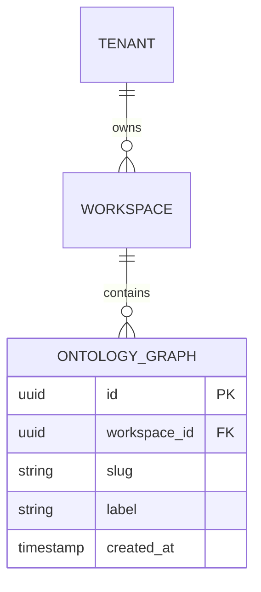
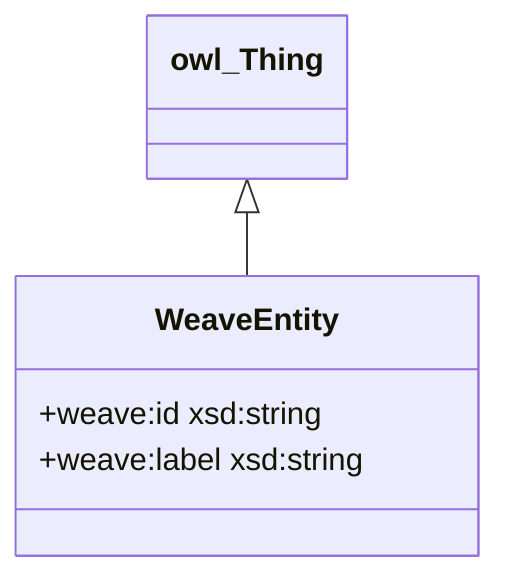

# arch-data-model Skill

Produce the `data-model.md` tech-spec artifact for a Weave entity — covering both the
relational layer (Aurora PostgreSQL via SQLAlchemy async) and the semantic web layer
(OWL 2 DL / Oxigraph), including SHACL shapes and migration notes. One section at a time,
with HITL review at every section. Invoked by `/arch-data-model` or from the architect skill.

## Model

- **All phases:** claude-sonnet-4-6 (precise structured output, code generation, schema drafting)

Rationale: data-model work is a generation and precision task, not open-ended reasoning.
Sonnet is the right tier. Escalate to claude-opus-4-8 only when the entity boundary is
genuinely ambiguous and needs strategic framing.

## Input

Before doing anything else, read:

1. `CLAUDE.md` — Weave product context, confirmed stack, laws
2. `.claude/spec-templates/architecture/data-model.md` — output scaffold
3. `.claude/spec-templates/few-shot/data/sqlalchemy-async.md` — SQLAlchemy async style reference
4. `docs/specs/<entity>/02-prd/prd.md` — domain entities, bounded context, acceptance criteria
5. `docs/specs/<entity>/04-arch/tech-spec/architecture.md` — if present, for layer overview
6. Any existing data model draft at `docs/specs/<entity>/04-arch/tech-spec/data-model.md`

Ask the user which entity this is for if not supplied. Confirm the output path before writing:

```
docs/specs/<entity>/04-arch/tech-spec/data-model.md
```

## Instructions

### Step 0 — State the governing principle (never skip)

Write 2-3 sentences naming the principle that governs a data model before writing anything
else.

Example: "A data model spec's job is to make the persistence contract explicit before any
code is written. If an engineer reads it and still has to guess what a field means, its
nullability, or which layer owns it, the spec has failed. Every section should eliminate
ambiguity — not add commentary."

Reference this principle when justifying decisions during the HITL loop.

### Step 1 — Context ingestion

1. Read all inputs listed above.
2. Identify which Weave sub-system this entity belongs to (Constitution Engine, Build Engine,
   Events & Actions, Graph Explorer, or cross-cutting).
3. Confirm the TWO data layers are relevant:
   - **Relational layer** (Aurora PostgreSQL via SQLAlchemy async) — operational data,
     multi-tenant rows, audit columns, migration-managed schema.
   - **Semantic web layer** (OWL 2 DL in Turtle, Oxigraph dev → Neptune prod) — the
     ontology graph; entities, properties, class hierarchies, and SHACL validation shapes.
   - Note: if the entity has NO semantic web presence, skip RDF/OWL and SHACL sections and
     state why. Do not silently omit them.
4. Summarise in 3 bullets before asking the first question:
   - Which entities will appear in the relational layer
   - Which classes/properties will appear in the RDF layer
   - What is still ambiguous (cardinalities, polymorphism, cross-entity references)

Ask via AskUserQuestion: "Which data layer(s) are in scope for this entity?"
Options: Both layers / Relational only / RDF/OWL only / I need help deciding

### Step 2 — Entity discovery

Before drafting the ER diagram, confirm the entity list with the user.

Present a draft entity list as a table:

| Proposed entity | Layer | Rationale |
|---|---|---|
| `<entity>` | relational / RDF / both | `<why>` |

Ask via AskUserQuestion: "Does this entity list look correct?"
Options: Approve and continue / Add missing entities / Remove entities / Amend

Only proceed once the entity list is approved.

### Step 3 — Section-by-section production

Produce each section in the order below. For every section:

1. **Write** the section to the output file (create directory if needed)
2. **Run the constitutional self-check** (see below) — stop and revise if any Law violated
3. **Present** the written section in chat
4. **Emit a confidence block** (see below) immediately before the HITL question
5. **Ask** via AskUserQuestion: Approve / Amend / Reject
6. If Amend: apply changes, show a minimal diff, re-present with updated confidence block
7. If Reject: regenerate with a cleaner approach, present the new version

#### Section 1 — Entity overview (Mermaid ER diagram — MANDATORY)

Produce a Mermaid `erDiagram` for the **relational layer**.

Rules:
- Include ALL tables confirmed in Step 2 (relational layer only)
- Show PKs, FKs, and cardinality (`||--o{`, `||--||`, `}o--o{`)
- Include the most important non-FK fields (3-5 per entity max — omit noise)
- Add a brief prose paragraph below the diagram (3-5 sentences) explaining the core
  relationships

If the entity has a semantic web layer, add a second Mermaid `classDiagram` showing the
OWL class hierarchy and key object/data properties. Label edges with property names.

Example relational ER skeleton (always expand for actual entities):



Example OWL class diagram skeleton:



#### Section 2 — Entity definitions (relational layer) — batched 3-5 per HITL

For each relational entity, produce a definition block:

**`<table_name>`**

Purpose: one sentence.

SQLAlchemy model (Python 3.12, SQLAlchemy 2.0 async style — follow the few-shot at
`.claude/spec-templates/few-shot/data/sqlalchemy-async.md`):

```python
# app/models/<module>/<table_name>.py
```

Field table:

| Column | Type | Constraints | Notes |
|---|---|---|---|
| `id` | `UUID` | PK, default uuid4 | surrogate key |
| `tenant_id` | `UUID` | FK → `tenants.id`, NOT NULL | row-level tenancy |
| ... | ... | ... | ... |

Indexes: list non-PK indexes with rationale.

Repository sketch (if the entity has non-trivial query patterns):

```python
# app/repositories/<module>/<table_name>_repository.py
```

Deliver entities in batches of 3-5. After each batch, ask via AskUserQuestion:
"Approve this batch / Amend / Add more entities to this batch"

#### Section 3 — RDF/OWL ontology model

Produce Turtle serialisation for the OWL 2 DL ontology fragment.

Rules:
- Namespace prefixes at top: `@prefix weave: <https://weave.io/ontology#> .` and any W3C
  prefixes used (owl, rdf, rdfs, xsd, skos, prov)
- Declare each class with `a owl:Class`, add `rdfs:label`, `rdfs:comment`, `rdfs:subClassOf`
  where applicable
- Declare object properties (`owl:ObjectProperty`) and data properties (`owl:DatatypeProperty`)
- Add domain/range restrictions where the ontology is definite
- Use `owl:FunctionalProperty` for single-valued properties
- Reference ArchiMate 3 notation in comments where the entity maps to an ArchiMate element

Example fragment (always replace with actual ontology):

```turtle
@prefix owl:   <http://www.w3.org/2002/07/owl#> .
@prefix rdf:   <http://www.w3.org/1999/02/22-rdf-syntax-ns#> .
@prefix rdfs:  <http://www.w3.org/2000/01/rdf-schema#> .
@prefix xsd:   <http://www.w3.org/2001/XMLSchema#> .
@prefix weave: <https://weave.io/ontology#> .
@prefix skos:  <http://www.w3.org/2004/02/skos/core#> .
@prefix prov:  <http://www.w3.org/ns/prov#> .

weave:OntologyGraph a owl:Class ;
    rdfs:label "Ontology Graph"@en ;
    rdfs:comment "A versioned RDF named graph containing a tenant's business ontology."@en ;
    rdfs:subClassOf prov:Entity .

weave:hasWorkspace a owl:ObjectProperty, owl:FunctionalProperty ;
    rdfs:domain weave:OntologyGraph ;
    rdfs:range  weave:Workspace ;
    rdfs:label  "has workspace"@en .
```

After writing, present the Turtle, run the self-check, emit confidence block, ask HITL.

Skip this section if the entity is relational-only (state why explicitly).

#### Section 4 — SHACL shapes

Produce SHACL shapes in Turtle for the key validation constraints on the RDF graph.

Rules:
- One `sh:NodeShape` per OWL class defined in Section 3
- Include: `sh:targetClass`, `sh:property` blocks for mandatory properties, datatype
  constraints (`sh:datatype`), cardinality (`sh:minCount`, `sh:maxCount`), and pattern
  constraints (`sh:pattern`) where relevant
- Use `sh:message` on every constraint
- Namespace: `@prefix sh: <http://www.w3.org/ns/shacl#> .`

Example skeleton (always replace with actual shapes):

```turtle
@prefix sh:    <http://www.w3.org/ns/shacl#> .
@prefix weave: <https://weave.io/ontology#> .
@prefix xsd:   <http://www.w3.org/2001/XMLSchema#> .

weave:OntologyGraphShape a sh:NodeShape ;
    sh:targetClass weave:OntologyGraph ;
    sh:property [
        sh:path      weave:hasWorkspace ;
        sh:minCount  1 ;
        sh:maxCount  1 ;
        sh:message   "An OntologyGraph must belong to exactly one Workspace." ;
    ] ;
    sh:property [
        sh:path      weave:graphLabel ;
        sh:datatype  xsd:string ;
        sh:minCount  1 ;
        sh:pattern   "^[a-zA-Z0-9_\\-]{1,128}$" ;
        sh:message   "graphLabel must be 1-128 alphanumeric characters, dashes, or underscores." ;
    ] .
```

After writing, present the shapes, run the self-check, emit confidence block, ask HITL.

Skip this section if the entity is relational-only (state why explicitly). Also skip if
Section 3 was skipped.

#### Section 5 — Migration and versioning notes

Cover:

1. **Alembic migration strategy** (relational layer):
   - Migration file naming convention: `YYYYMMDD_NNN_<slug>.py`
   - Zero-downtime rules: additive-only in a single deploy; breaking changes in two-phase
     (expand/contract pattern)
   - Multi-tenancy: confirm whether migrations run per-schema or once on shared tables
   - Rollback posture: specify which migrations are reversible (downgrade function present)
   - Seed data: if the migration includes seed/reference data, document it here

2. **Ontology versioning** (RDF/OWL layer, if applicable):
   - Version IRI convention: `<https://weave.io/ontology/<entity>/v{MAJOR}>`
   - Backward-compatible change rules (additive: new classes/properties; non-breaking
     relaxations of cardinality)
   - Breaking-change protocol: bump MAJOR, deprecate old IRI with `owl:deprecated true`,
     keep deprecated IRI resolvable for one release cycle
   - Named-graph versioning in Oxigraph/Neptune: each version stored as a separate named
     graph with PROV-O provenance triples

3. **Cross-layer referencing**:
   - Document how relational row IDs are linked to RDF subject IRIs
   - Convention: `<https://weave.io/resource/<table>/<uuid>>` as the IRI for a relational
     row exposed to the graph layer
   - State which layer is the source-of-truth for each entity

After writing, run the self-check, emit confidence block, ask HITL.

### Step 4 — After all sections approved

Update the file frontmatter to set `status: Review` and `confirmed_by: <user>`.

Commit the artifact:

```bash
git add docs/specs/<entity>/04-arch/tech-spec/data-model.md
git commit -m "docs(<entity>): add data-model tech spec"
```

Then tell the user: "Data model complete. Next step: `/arch-flows` for sequence/flow
diagrams, or `/architect` to continue the full tech spec."

## Constitutional self-check (run before every section delivery)

Walk both Law layers. Write one line per Law, format exactly:

```
Plugin Law A (common-stack first): complied | violated | N/A — <reason>
Plugin Law B (testable): complied | violated | N/A — <reason>
Plugin Law C (council quality): complied | violated | N/A — <reason>
Plugin Law D (stacked PRs): complied | violated | N/A — <reason>
Plugin Law E (complexity budget): complied | violated | N/A — <reason>
Plugin Law F (no real cloud in tests): complied | violated | N/A — <reason>
Data Law 1 (both layers explicit): complied | violated | N/A — <reason>
Data Law 2 (Mermaid ER mandatory for relational): complied | violated | N/A — <reason>
Data Law 3 (Turtle for OWL layer): complied | violated | N/A — <reason>
Data Law 4 (SHACL shapes present if OWL present): complied | violated | N/A — <reason>
Data Law 5 (SQLAlchemy async style match few-shot): complied | violated | N/A — <reason>
Data Law 6 (migration expand/contract stated): complied | violated | N/A — <reason>
Data Law 7 (cross-layer IRI convention stated): complied | violated | N/A — <reason>
```

If ANY line says "violated": STOP, revise the section, re-run the check.
Output the trace in chat (user sees it). Keeps Laws active across long sessions.

**Skill-specific laws:**

- **Data Law 1** — Both relational and RDF/OWL layers must be explicitly addressed or
  explicitly skipped with a stated reason.
- **Data Law 2** — A Mermaid `erDiagram` is mandatory whenever the relational layer is
  in scope. The spec is incomplete without it.
- **Data Law 3** — RDF entities must be represented in Turtle serialisation, not prose
  descriptions of triples.
- **Data Law 4** — Every OWL class defined in Section 3 must have a corresponding SHACL
  `NodeShape` in Section 4.
- **Data Law 5** — All SQLAlchemy models must follow the async style shown in the few-shot
  reference: `Mapped[T]`, `mapped_column(...)`, `async def` on repositories.
- **Data Law 6** — The migration section must explicitly state the expand/contract posture
  and name which migrations include a downgrade function.
- **Data Law 7** — The IRI convention for cross-layer referencing (`/resource/<table>/<uuid>`)
  must be stated in the migration section.

## Confidence block (emit before every HITL question)

Output this block immediately after presenting the section, before the AskUserQuestion call:

```
<section-confidence>
Confidence: high | medium | low
Weakest part: <name the specific entity, field, property, or shape>
Why: <1 sentence — what input was missing or what you assumed>
</section-confidence>
```

Rules:
- Always name the weakest part, even on high-confidence sections.
- "Why" must reference a specific input gap (e.g. "cardinality of Workspace-to-Tenant not
  stated in PRD", "field nullability for `deleted_at` assumed false").
- The block lives in chat only — do not embed it in the output file.

## Output

File: `docs/specs/<entity>/04-arch/tech-spec/data-model.md`

Template: `.claude/spec-templates/architecture/data-model.md`

Create the directory if it doesn't exist. Never leave `{{PLACEHOLDER}}` in the output.

Frontmatter:

```yaml
---
type: Data Model Spec
title: "Data Model: <entity display name>"
description: "<one-line summary of the relational + semantic data model for this entity>"
tags: [<entity>, 04-arch]
timestamp: <YYYY-MM-DDThh:mm:ssZ>
status: Draft
created: <YYYY-MM-DD>
entity: <entity>
layers:
  - relational        # remove if not applicable
  - rdf-owl           # remove if not applicable
confirmed_by: ""
confirmed_on: null
---
```

The file structure must follow this order:

1. Frontmatter
2. `# Data Model: <entity display name>`
3. Brief prose overview (3-5 sentences: what this model represents, which layers, key design
   decisions)
4. `## Entity overview` — Mermaid ER (relational) and/or class diagram (OWL)
5. `## Entity definitions` — per-entity SQLAlchemy model + field table + index notes
6. `## RDF/OWL ontology model` — Turtle serialisation (or "Not applicable — <reason>")
7. `## SHACL shapes` — Turtle shapes (or "Not applicable — <reason>")
8. `## Migration and versioning notes` — Alembic, ontology versioning, cross-layer IRIs

## Evaluation Criteria

A well-produced data-model spec:

- Contains a Mermaid `erDiagram` for every entity in the relational layer — no exceptions
- All SQLAlchemy models use `Mapped[T]` / `mapped_column(...)` async style (Law 5)
- RDF layer is represented in Turtle with proper namespace prefixes; no prose-only
  descriptions of triples
- Every OWL class in Section 3 has a corresponding `sh:NodeShape` in Section 4
- Migration section names the expand/contract posture and identifies reversible migrations
- Cross-layer IRI convention (`/resource/<table>/<uuid>`) stated explicitly
- No `{{PLACEHOLDER}}` text remains in the output file
- Delivered section-by-section with HITL at every section; constitutional self-check trace
  present in chat for every section
