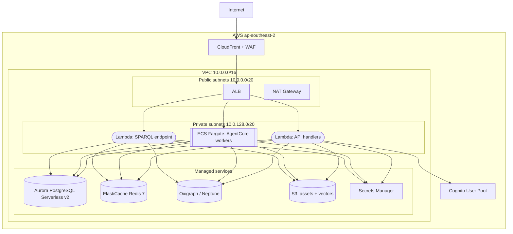

# arch-delivery Skill

Produces the two delivery-pipeline artifacts for a Weave spec entity: the CI/CD pipeline spec
and the infrastructure spec. Both target AWS via GitHub Actions with OIDC-only credentials, and
the CI/CD deploy stages assume the environment model (dev/staging/prod) defined by the
infrastructure spec. Invoked by the architect agent during the tech-spec phase when a CI/CD
and/or infrastructure design is needed for a new or updated service.

Each part below is a self-contained sub-skill: it reads its own inputs, produces its own output
file, runs its own constitutional self-check and HITL gate(s), and commits separately. Run the
part the invocation asks for.

## Model

**claude-sonnet-5** for both parts — structured generation against well-defined inputs: precise
YAML/HCL, table formatting, cost arithmetic, diagram output. Neither part is open-ended
elicitation. Escalate to **claude-fable-5** via `/architect` only if the entity introduces a
novel pattern outside Weave's confirmed stack (e.g. multi-region active-active, BYOC customer
VPCs, a non-GitHub-Actions CI provider) — do not improvise the escalation locally.

---

## Part 1: CI/CD Pipeline

Produce a CI/CD pipeline spec (`ci-cd.md`) for a Weave entity, covering the full GitHub Actions
workflow from lint to production deployment.

### Input

Before doing anything else, read:

1. `CLAUDE.md` — confirmed stack (GitHub Actions + OIDC to AWS by default; no
   alternatives unless the user explicitly states otherwise)
2. `.claude/spec-templates/tech-spec/ci-cd.md` — section scaffold and table formats
3. **Project type detection** — determine which stack(s) are present:
   - Python service → read `docs/standards/patterns/ci/github-actions-python-uv.md`
   - TypeScript / Next.js → read `docs/standards/patterns/ci/github-actions-ts-nextjs.md`
   - Mixed monorepo → read both
4. Any existing tech spec for this entity
   (`docs/specs/weave/engines/<entity>/tech-spec/*.md`) to understand service boundaries,
   deployed artefacts, and infrastructure targets
5. Ask the user which entity this spec is for if not supplied; output path is:
   `docs/specs/weave/engines/<entity>/tech-spec/ci-cd.md`

### Instructions

#### Step 0 — State the governing principle (never skip)

Write 2-3 sentences naming the principle that governs a CI/CD spec before writing anything
else.

Example: "A CI/CD spec's job is to make the path from code change to production deployment
deterministic and auditable. If a reviewer reads it and cannot identify exactly which human
action is required before production, the spec has failed. Every stage must have a single,
unambiguous trigger and a single, unambiguous failure action."

Reference this principle when justifying decisions during the HITL loop.

#### Step 1 — Context ingestion

1. Read the inputs listed above.
2. Determine project type(s): Python, TypeScript, or mixed.
3. Identify deployed artefact types: Lambda function, ECS Fargate service, S3 static
   site, or a combination.
4. Summarise in 3 bullets before writing the first section:
   - What services/artefacts are deployed
   - Which stack(s) are in scope (Python / TypeScript / mixed)
   - What infrastructure targets exist (Lambda, Fargate, CloudFront+S3, etc.)

Ask via AskUserQuestion:
- "Do you have any overrides to the default CI/CD stack (GitHub Actions + OIDC to AWS)?"
  Options: No overrides / I have specific environment URLs / I have non-standard stages /
  I need to explain something first

#### Step 2 — Section-by-section production

Produce the spec in the exact order below. For each section:

1. **Write** the section to the file `docs/specs/weave/engines/<entity>/tech-spec/ci-cd.md`
2. **Run the constitutional self-check** (see below) — stop and revise if any Law violated
3. **Present** the section to the user (display the written content)
4. **Emit a confidence block** (see below) immediately before the HITL question
5. **Ask** via AskUserQuestion: Approve / Amend / Reject
6. If Amend: apply changes, show diff, re-present with an updated confidence block
7. If Reject: regenerate with a cleaner approach, show the new version

**HITL is mandatory after the Pipeline Overview diagram and after the Workflow YAML draft.**

---

##### Section 1 — Pipeline Overview (Mermaid flowchart)

Produce a `mermaid` `flowchart LR` diagram showing:

- CI sub-graph (triggered on pull_request): lint → typecheck → unit tests →
  integration tests → build
- CD sub-graph (triggered on push to main): dev deploy → staging deploy →
  manual gate → production deploy
- Rollback arrows from failed smoke tests back to an alert/rollback node
- Label each arrow with its trigger condition

**HITL required after this section.** Do not proceed to Section 2 until the diagram
is approved.

Rules for the diagram:
- Subgraph labels must match: `CI (on pull_request)` and `CD (on push to main)`
- Manual gate node must be shaped as a decision diamond `{Manual Approval}`
- Rollback nodes must be labelled `[Rollback + Alert]`
- No `{{PLACEHOLDER}}` text in the diagram

---

##### Section 2 — CI Stages table

Produce a table with columns: `Stage | Tool | Command | Failure Action`

**Python services** (use `uv` — this is Weave's confirmed Python toolchain):

| Stage | Tool | Command | Failure Action |
|---|---|---|---|
| Lint | Ruff | `uv run ruff check . --output-format=github` | Block merge |
| Format | Ruff | `uv run ruff format --check .` | Block merge |
| Type check | mypy | `uv run mypy src --strict` | Block merge |
| Unit tests | pytest + pytest-cov | `uv run pytest --cov=src --cov-fail-under=80 -v` | Block merge |
| Integration tests | pytest | `uv run pytest tests/integration -v` | Block merge |
| Build / package | uv build | `uv build` | Block merge |

**TypeScript / Next.js services** (use pnpm + Turbo):

| Stage | Tool | Command | Failure Action |
|---|---|---|---|
| Lint | ESLint | `pnpm turbo lint --filter="...[HEAD^1]"` | Block merge |
| Type check | TypeScript | `pnpm turbo typecheck --filter="...[HEAD^1]"` | Block merge |
| Unit tests | Vitest | `pnpm turbo test --filter="...[HEAD^1]"` | Block merge |
| Integration tests | Playwright | `pnpm turbo test:e2e --filter="...[HEAD^1]"` | Block merge |
| Build | Next.js | `pnpm turbo build` | Block merge |

For mixed monorepos, produce both tables separated by a sub-heading.

Include a **Quality Gates** sub-section (bulleted) listing hard numeric thresholds:
- Test coverage ≥ 80% (enforced via `--cov-fail-under=80` / `--coverage-threshold`)
- Cyclomatic complexity ≤ 10 per function (Law E)
- Cognitive complexity ≤ 15 per function (Law E)
- Function length ≤ 50 lines (Law E)
- Zero high/critical security vulnerabilities (`pip-audit` / `npm audit`)

---

##### Section 3 — CD Stages table

Produce a table with columns:
`Stage | Trigger | Target Environment | Gate | Rollback`

Populate with exactly three CD stages following Weave's confirmed environment model:

| Stage | Trigger | Target | Gate | Rollback |
|---|---|---|---|---|
| Deploy to Dev | Merge to `main` (CI passes) | dev | Automatic | Auto-rollback on smoke fail |
| Deploy to Staging | Dev smoke tests pass | staging | Automatic | Auto-rollback on smoke fail |
| Deploy to Production | Staging smoke pass + manual approval | production | **Manual approval required** | Auto-rollback on smoke fail |

Notes to include:
- Dev deploys automatically on every merge to `main` — no human action required
- Staging deploys automatically after dev smoke tests pass
- Production requires explicit approval in the GitHub environment protection rules
- Smoke tests run as a separate job after each deploy job, gating promotion

---

##### Section 4 — GitHub Actions Workflow YAML (draft)

Generate the full workflow YAML at `.github/workflows/ci-cd.yml`.

**Security rule (non-negotiable):** Use OIDC token exchange for AWS credentials.
No `AWS_ACCESS_KEY_ID` / `AWS_SECRET_ACCESS_KEY` in GitHub Secrets. The correct
pattern is:

```yaml
- name: Configure AWS credentials
  uses: aws-actions/configure-aws-credentials@v4
  with:
    role-to-assume: ${{ vars.AWS_DEPLOY_ROLE_ARN }}
    aws-region: ${{ vars.AWS_REGION }}
```

**For Python services**, base the CI job on the few-shot at
`docs/standards/patterns/ci/github-actions-python-uv.md`:
- `astral-sh/setup-uv@v4` with `enable-cache: true` and `cache-dependency-glob: "uv.lock"`
- `uv sync --frozen --all-extras`
- Python matrix: `["3.11", "3.12"]`
- Coverage artifact upload (3.12 only), coverage comment job on PRs

**For TypeScript services**, base the CI job on the few-shot at
`docs/standards/patterns/ci/github-actions-ts-nextjs.md`:
- `pnpm/action-setup@v4` with version 9
- `pnpm install --frozen-lockfile`
- Node matrix: `["20", "22"]`
- `TURBO_TOKEN` / `TURBO_TEAM` for remote cache
- `--filter="...[HEAD^1]"` for affected-only runs on PRs

**Mandatory structural elements in the YAML:**

```yaml
concurrency:
  group: ${{ github.workflow }}-${{ github.ref }}
  cancel-in-progress: true
```

```yaml
permissions:
  id-token: write   # required for OIDC
  contents: read
```

CD jobs must use GitHub Environments:

```yaml
environment:
  name: production
  url: ${{ steps.deploy.outputs.url }}
```

**HITL required after this section.** Do not proceed to Section 5 until the YAML
draft is approved.

Do not leave `{{PLACEHOLDER}}` in the YAML. Use `${{ vars.VAR_NAME }}` for
environment-specific values and add a comment explaining what each variable holds.

---

##### Section 5 — Branch Strategy and Protection Rules

Produce two sub-sections:

**Branch Strategy** — a short table:

| Branch | Purpose | Merge strategy | Delete on merge |
|---|---|---|---|
| `main` | Single deployable trunk | Squash merge | N/A |
| `feature/<ticket>` | Feature development | Squash → main | Yes |
| `hotfix/<ticket>` | Production hotfixes | Squash → main | Yes |
| `release/<version>` | Release candidate (if used) | Merge commit | No |

**Protection Rules** — bulleted list for `main`:

- Require pull request reviews: minimum 1 approval
- Dismiss stale reviews when new commits are pushed
- Require status checks to pass before merging (list each CI job by name)
- Require branches to be up to date before merging
- Require signed commits
- Do not allow force pushes
- Do not allow deletions
- Restrict pushes to `main` to repository admins only

Include a note: "Configure these rules in GitHub → Repository Settings → Branches →
Branch protection rules. The GitHub Actions environments (dev / staging / production)
are configured in Settings → Environments."

---

#### After all sections approved

1. Ensure the file has the correct frontmatter (see Output section).
2. Remove any remaining `{{PLACEHOLDER}}` text — replace with `TBD: <description>` if
   genuinely unknown, and add a `<!-- TODO: replace before scaffolding -->` comment.
3. Commit the spec:

```bash
git add docs/specs/weave/engines/<entity>/tech-spec/ci-cd.md
git commit -m "docs(<entity>): add CI/CD pipeline spec"
```

4. Tell the user: "CI/CD spec complete. Next steps:
   - `/architect` continues with remaining tech-spec sections, or
   - Run `/implement` to scaffold `.github/workflows/ci-cd.yml` from this spec."

### Constitutional self-check (run before every section delivery)

Walk both Law layers. Write one line per Law, format exactly:

```text
Plugin Law A (common-stack first): complied | violated | N/A — <reason>
Plugin Law B (functional, automation-tested): complied | violated | N/A — <reason>
Plugin Law C (council-graded quality): complied | violated | N/A — <reason>
Plugin Law D (stacked PRs): complied | violated | N/A — <reason>
Plugin Law E (complexity budget): complied | violated | N/A — <reason>
Plugin Law F (synthetic verification only): complied | violated | N/A — <reason>
CI/CD Law 1 (OIDC only — no long-lived AWS credentials): complied | violated | N/A — <reason>
CI/CD Law 2 (uv for Python deps — never bare pip): complied | violated | N/A — <reason>
CI/CD Law 3 (manual gate on production): complied | violated | N/A — <reason>
CI/CD Law 4 (coverage threshold enforced in pipeline): complied | violated | N/A — <reason>
CI/CD Law 5 (no placeholder text in delivered YAML): complied | violated | N/A — <reason>
```

If ANY line says "violated": STOP, revise the section, re-run the check.
Output the trace in chat (user sees it). Keeps Laws active across long sessions.

### Confidence block (emit before every HITL question)

Output this block immediately after presenting the section, before the AskUserQuestion
call:

```text
<section-confidence>
Confidence: high | medium | low
Weakest part: <name the specific node, job, table row, or YAML block>
Why: <1 sentence — what input was missing or what you assumed>
</section-confidence>
```

Rules:
- Always name the weakest part, even on high-confidence sections.
- "Why" must reference a specific input gap, not a generic hedge.
- The block lives in chat only — do not embed it in the file.

### Output

File: `docs/specs/weave/engines/<entity>/tech-spec/ci-cd.md`

Template: `.claude/spec-templates/tech-spec/ci-cd.md`

Create the directory if it doesn't exist. Never leave `{{PLACEHOLDER}}` in the output.

Frontmatter:

```yaml
---
type: CI/CD Spec
title: "CI/CD Pipeline Spec: <entity display name>"
description: "<one-line summary of the CI/CD pipeline for this entity>"
tags: [<entity>, arch]
timestamp: <YYYY-MM-DDThh:mm:ssZ>
status: Draft
created: <YYYY-MM-DD>
entity: <entity>
stack: <python | typescript | mixed>
---
```

The companion workflow file (`.github/workflows/ci-cd.yml`) is written as a draft
in the spec but is not committed to `.github/` until the `/implement` skill scaffolds
it. Include it in the spec as a fenced `yaml` code block only.

### Evaluation Criteria

A well-produced CI/CD spec:

- Has a Mermaid flowchart that shows all five CI stages and all three CD environments
  with explicit trigger labels and rollback paths
- Uses OIDC credential exchange — `aws-actions/configure-aws-credentials@v4` with
  `role-to-assume` — and no long-lived AWS secrets
- Python jobs use `astral-sh/setup-uv@v4` with lockfile caching; TypeScript jobs use
  `pnpm/action-setup@v4` with Turbo affected-only filtering
- Production deployment job is gated by a GitHub Environment with manual approval;
  dev and staging are automatic
- Coverage threshold of ≥ 80% is enforced as a pipeline failure condition (not just a
  warning)
- Concurrency group with `cancel-in-progress: true` is present on all workflow triggers
- Branch protection rules are enumerated for `main` and reference the exact CI job
  names that must pass
- No `{{PLACEHOLDER}}` text remains — all environment-specific values use
  `${{ vars.VAR_NAME }}` with an explanatory comment
- Was delivered section-by-section with HITL after the diagram and after the YAML draft
- Constitutional self-check trace present in chat for every section

---

## Part 2: Infrastructure

Produce a production-ready infrastructure specification (`infrastructure.md`) for a Weave spec
entity, covering every layer of the AWS deployment — from VPC topology to Terraform module
structure to cost estimate. One section at a time, with mandatory HITL after the topology
diagram and after the Terraform module structure.

### Input

Before doing anything else, read:

1. `CLAUDE.md` — Weave confirmed stack, laws, and architecture decisions
2. `.claude/spec-templates/architecture/infrastructure.md` — section scaffold (never leave `{{}}` in output)
3. `docs/standards/patterns/infra/` — Terraform/CDK patterns; read the relevant files for the
   entity's compute shape:
   - Lambda-heavy → `aws-cdk-py-lambda-dynamo.md`
   - ECS-heavy → `docker-compose-local-dev.md` (local parity) + `aws-cloudformation-rds.md` (RDS pattern)
4. Any prior tech specs for this entity (`docs/specs/weave/engines/<entity>/tech-spec/` if present) — pull
   confirmed service choices and ADR numbers
5. Any existing infrastructure draft (`docs/specs/weave/engines/<entity>/tech-spec/infrastructure.md`) to
   continue or refine

Ask the user which entity this spec is for (e.g. `constitution-engine`, `build-engine`, `weave-platform`)
if not supplied in the invocation. Output path is:
`docs/specs/weave/engines/<entity>/tech-spec/infrastructure.md`

### Instructions

#### Step 0 — State the governing principle (never skip)

Write 2-3 sentences naming the principle that governs an infrastructure spec before writing anything else.

Example: "An infrastructure spec's job is to leave no ambiguity for the engineer who writes the first
`terraform apply`. Every service, subnet, role, and secret must be named. If a reviewer has to guess a
CIDR range or a Lambda timeout, the spec has failed."

Reference this principle when justifying decisions during the HITL loop.

#### Step 1 — Context ingestion

1. Read the inputs listed above.
2. Summarise what you know in 4 bullets before writing anything:
   - Which entity this spec covers and its primary workload shape (API-driven, event-driven, agent-heavy)
   - Which AWS services are already confirmed by prior specs or ADRs
   - Which services are still open decisions (e.g. Neptune vs Jena Fuseki for prod RDF store)
   - Estimated scale tier (dev PoC / growth-stage SaaS / enterprise)

Ask via AskUserQuestion:
- "What environment tier is this spec targeting?" Options: Dev only / Dev + Staging / All environments (Dev, Staging, Prod)

3. Ask via AskUserQuestion:
- "Are there existing ADRs or tech-spec decisions I should lock in?" Options: Yes — read them now / No — start from CLAUDE.md defaults / Not sure — proceed with defaults

#### Step 2 — Section-by-section production

Produce the spec in this exact order. For each section:

1. **Write** the section to the file
2. **Run the constitutional self-check** (see below) — stop and revise if any Law violated
3. **Present** the section to the user (display the written content in full)
4. **Emit a confidence block** (see below) immediately before the HITL question
5. **Ask** via AskUserQuestion: Approve / Amend / Reject
6. If Amend: apply changes, show diff, re-present with an updated confidence block
7. If Reject: regenerate with a cleaner approach, show the new version

---

##### Section 1 — Infrastructure Overview (topology diagram)

Write a prose paragraph (3-5 sentences) describing the deployment region, AZ strategy, and ingress path.
Then produce a Mermaid diagram showing the AWS services topology. The diagram is **mandatory** — if it
cannot be drawn accurately, ask the user for the missing service decisions before proceeding.

**Mermaid diagram requirements:**

- Use `graph TD` layout
- Label every node with the AWS service name (e.g. `ALB["ALB (Application Load Balancer)"]`)
- Show: CloudFront → ALB → Lambda / ECS → Aurora / Oxigraph / ElastiCache / S3
- Group nodes into subgraphs: `Public subnet`, `Private subnet`, `Managed services`
- Mark ECS Fargate tasks separately from Lambda functions (different node shapes: `[[ECS Task]]` vs
  `(Lambda)`)
- Include VPC boundary as a subgraph wrapper
- Do NOT omit AWS Secrets Manager — it must appear as a node that Lambda and ECS connect to

Example skeleton (expand with real service names):



**HITL GATE 1 — topology diagram** (mandatory pause here):

After presenting the diagram and prose, emit the confidence block, then ask:

> "Does the topology diagram accurately reflect the services for this entity? Approve to continue,
> Amend to adjust services/subnets/layout, Reject to redraw from scratch."

Do not proceed to Section 2 until this gate is approved.

---

##### Section 2 — Compute Layer

Produce a table and prose covering:

**Lambda functions:**

| Function name | Trigger | Runtime | Memory (MB) | Timeout | VPC? |
|---|---|---|---|---|---|
| `weave-api-handler` | ALB / API GW | Python 3.12 ARM64 | 512 | 30s | Yes — private subnet |
| `weave-sparql-endpoint` | ALB | Python 3.12 ARM64 | 1024 | 60s | Yes — private subnet |
| `weave-event-processor` | SQS / EventBridge | Python 3.12 ARM64 | 256 | 120s | Yes — private subnet |

Adjust rows to match the entity. Add a row per distinct Lambda. Include the following notes:
- All Lambda functions run Python 3.12 ARM64 (Graviton2) — cost and performance default per CLAUDE.md
- Cold-start mitigation: provisioned concurrency on `weave-api-handler` in prod only
- Dead-letter queues (SQS) on all async Lambda functions

**ECS Fargate tasks (AgentCore workers):**

| Task family | Image source | CPU (vCPU) | Memory (GiB) | Max runtime | Trigger |
|---|---|---|---|---|---|
| `weave-agentcore-worker` | ECR — `weave/agentcore:latest` | 1 | 4 | 8 hours | EventBridge Scheduler / SQS |

Notes:
- ECS Fargate is used **only** for AWS Bedrock AgentCore workloads that exceed Lambda's 15-minute limit
- Platform version: `LATEST` (Fargate 1.4.0+)
- Task role: least-privilege IAM role (defined in IAM section)
- Auto-scaling: Application Auto Scaling on SQS queue depth metric

---

##### Section 3 — Data Layer

Document every persistent store. For each service produce:
- Purpose (1 sentence)
- Configuration table (engine, tier/size, multi-AZ, encryption, backup)
- Connection method (VPC endpoint / PrivateLink / in-VPC)

**Stores to cover (adjust to entity scope):**

1. **Aurora PostgreSQL Serverless v2** — relational metadata, tenant records, task queue
   - Min ACUs: 0.5 (dev), 2 (prod) | Max ACUs: 16 (dev), 64 (prod)
   - Multi-AZ: yes (prod) / no (dev)
   - Encryption: AWS KMS CMK
   - Backups: 7-day automated (dev), 35-day automated + daily manual snapshot (prod)
   - Access: in-VPC, `Data API` disabled — use direct TCP from Lambda in same VPC

2. **ElastiCache Redis 7** — session cache, rate-limit counters, SPARQL result cache
   - Node type: `cache.t4g.micro` (dev), `cache.r7g.large` (prod)
   - Cluster mode: disabled (dev), enabled with 3 shards (prod)
   - Encryption: in-transit (TLS) + at-rest

3. **Oxigraph (dev/test) / Neptune (prod)** — RDF triple store (Constitution Engine)
   - Dev: Oxigraph container in ECS, ephemeral EFS volume
   - Prod: AWS Neptune Serverless, Neptune Analytics optional (decision deferred — see ADR note)
   - SPARQL 1.1 endpoint exposed via `weave-sparql-endpoint` Lambda

4. **S3** — SPA static assets, ontology Turtle files, S3 Vectors (embeddings)
   - Bucket naming: `weave-{env}-assets`, `weave-{env}-ontology`, `weave-{env}-vectors`
   - Versioning: enabled on ontology bucket; disabled on assets
   - Lifecycle: 30-day transition to Intelligent-Tiering on vectors bucket

---

##### Section 4 — Network Layer

Produce:

1. **VPC CIDR table:**

| Environment | VPC CIDR | Public subnets | Private subnets | AZs |
|---|---|---|---|---|
| dev | 10.1.0.0/16 | 10.1.0.0/24, 10.1.1.0/24 | 10.1.128.0/24, 10.1.129.0/24 | ap-southeast-2a, 2b |
| staging | 10.2.0.0/16 | 10.2.0.0/24, 10.2.1.0/24 | 10.2.128.0/24, 10.2.129.0/24 | ap-southeast-2a, 2b |
| prod | 10.0.0.0/16 | 10.0.0.0/20 | 10.0.128.0/20 | ap-southeast-2a, 2b, 2c |

2. **Security groups** — one table per logical tier:

| SG name | Inbound | Outbound | Attached to |
|---|---|---|---|
| `sg-alb` | 443 from 0.0.0.0/0 | 443/8080 to `sg-lambda` | ALB |
| `sg-lambda` | 443/8080 from `sg-alb` | 443 to AWS endpoints, 5432 to `sg-aurora`, 6379 to `sg-redis` | Lambda, ECS tasks |
| `sg-aurora` | 5432 from `sg-lambda` | None | Aurora |
| `sg-redis` | 6379 from `sg-lambda` | None | ElastiCache |
| `sg-neptune` | 8182 from `sg-lambda` | None | Neptune (prod) |

3. **VPC Endpoints** (to avoid NAT Gateway costs for AWS-managed services):
   - Interface endpoints: `secretsmanager`, `ecr.api`, `ecr.dkr`, `logs`, `bedrock-runtime`
   - Gateway endpoints: `s3`, `dynamodb`

4. **NAT Gateway:** single AZ in dev/staging, HA pair (one per AZ) in prod.

---

##### Section 5 — IAM and Security

Produce:

1. **IAM roles table:**

| Role name | Principal | Key permissions | Trust condition |
|---|---|---|---|
| `weave-lambda-api-role` | `lambda.amazonaws.com` | SecretsManager:GetSecretValue, aurora-db:connect, elasticache:*, s3:GetObject/PutObject (scoped buckets) | — |
| `weave-lambda-sparql-role` | `lambda.amazonaws.com` | SecretsManager:GetSecretValue, neptune-db:connect, s3:GetObject (ontology bucket) | — |
| `weave-ecs-agentcore-role` | `ecs-tasks.amazonaws.com` | SecretsManager:GetSecretValue, bedrock:InvokeModel, bedrock:InvokeAgent, s3:GetObject/PutObject | — |
| `weave-deploy-role` | `token.actions.githubusercontent.com` (OIDC) | CloudFormation:*, Lambda:*, ECS:*, ECR:*, IAM:PassRole (scoped) | `repo:weave-platform/weave:ref:refs/heads/main` |
| `weave-break-glass-role` | AWS account root (MFA required) | AdministratorAccess | MFA condition |

2. **Secrets Manager entries:**

| Secret path | Contains | Rotation |
|---|---|---|
| `weave/{env}/aurora/master` | DB host, port, username, password | 30-day automatic (Lambda rotation) |
| `weave/{env}/redis/auth` | Redis AUTH token | Manual + CloudWatch alarm on age |
| `weave/{env}/cognito/client-secret` | Cognito app client secret | Manual |
| `weave/{env}/neptune/endpoint` | Neptune cluster endpoint | Manual (changes only on cluster replace) |
| `weave/{env}/bedrock/guardrail-id` | Bedrock Guardrails identifier | Manual |

**Security rules (mandatory — never waive):**

- Secrets are **never** stored as Terraform variables, `.env` files, or GitHub Actions plain-text env vars
- All Terraform references to secrets use `data "aws_secretsmanager_secret_version"` at apply time
- All IAM policies follow least-privilege: no `*` actions on any production resource
- OIDC federation for GitHub Actions — no static AWS credentials in CI

---

##### Section 6 — Terraform Module Structure

Produce:

1. **Directory layout:**

```text
infra/
├── environments/
│   ├── dev/
│   │   ├── main.tf          # environment root — calls modules
│   │   ├── variables.tf
│   │   ├── outputs.tf
│   │   └── terraform.tfvars
│   ├── staging/
│   │   └── ... (same structure)
│   └── prod/
│       └── ... (same structure)
├── modules/
│   ├── vpc/                 # VPC, subnets, IGW, NAT GW, SGs, VPC endpoints
│   ├── lambda/               # Lambda function + IAM role + log group (reusable)
│   ├── ecs-fargate/          # ECS cluster + task def + service + ASG
│   ├── aurora/                # Aurora Serverless v2 cluster + parameter group
│   ├── elasticache/           # ElastiCache Redis cluster
│   ├── neptune/               # Neptune Serverless cluster (prod gate)
│   ├── s3/                    # Bucket + policy + lifecycle (reusable)
│   ├── cognito/                # User pool + app client
│   ├── secrets/                 # Secrets Manager entries + rotation
│   ├── iam/                    # Cross-module IAM roles and policies
│   ├── cloudfront/             # Distribution + WAF + OAC
│   └── observability/          # CloudWatch dashboards + alarms + OTEL collector
└── test/
    ├── localstack/          # LocalStack-backed integration tests (Python / pytest)
    └── unit/                # terraform validate + tfsec + checkov (no real cloud)
```

2. **Module conventions:**

| Convention | Rule |
|---|---|
| Naming | All resources prefixed `weave-{var.env}-` |
| State backend | S3 bucket `weave-tfstate-{account_id}` + DynamoDB lock table `weave-tfstate-lock` |
| State isolation | One state file per environment (`environments/{env}/terraform.tfstate`) |
| Secrets in vars | Forbidden — use `data "aws_secretsmanager_secret_version"` |
| Module versioning | Pin module sources to git SHA tags (no `?ref=main`) |
| Complexity limit | Each `.tf` file ≤ 150 lines; modules ≤ 5 resources per file (Law E) |
| Review gate | `terraform plan` output required in PR description before merge |

3. **Key Terraform resource snippets (reference patterns from few-shot):**

Lambda module root (`modules/lambda/main.tf`) skeleton:

```hcl
resource "aws_lambda_function" "this" {
  function_name = "weave-${var.env}-${var.function_name}"
  role          = aws_iam_role.lambda.arn
  handler       = var.handler
  runtime       = "python3.12"
  architectures = ["arm64"]
  timeout       = var.timeout
  memory_size   = var.memory_size

  vpc_config {
    subnet_ids         = var.private_subnet_ids
    security_group_ids = [aws_security_group.lambda.id]
  }

  environment {
    variables = {
      # Only non-secret config here — never put secret values here
      ENV        = var.env
      LOG_LEVEL  = var.env == "prod" ? "WARNING" : "DEBUG"
    }
  }

  tracing_config {
    mode = "Active"  # X-Ray
  }
}

data "aws_secretsmanager_secret_version" "app_secrets" {
  secret_id = "weave/${var.env}/aurora/master"
}
# Secret value accessed at runtime by the function — never in env vars
```

ECS Fargate task module (`modules/ecs-fargate/main.tf`) skeleton:

```hcl
resource "aws_ecs_task_definition" "agentcore" {
  family                   = "weave-${var.env}-agentcore-worker"
  requires_compatibilities = ["FARGATE"]
  network_mode             = "awsvpc"
  cpu                      = "1024"
  memory                   = "4096"
  task_role_arn            = aws_iam_role.ecs_task.arn
  execution_role_arn       = aws_iam_role.ecs_exec.arn

  container_definitions = jsonencode([{
    name      = "agentcore-worker"
    image     = "${var.ecr_repo_url}:${var.image_tag}"
    essential = true
    secrets = [
      {
        name      = "AURORA_SECRET"
        valueFrom = "weave/${var.env}/aurora/master"
      }
    ]
    logConfiguration = {
      logDriver = "awslogs"
      options = {
        "awslogs-group"         = "/ecs/weave-${var.env}-agentcore"
        "awslogs-region"        = var.aws_region
        "awslogs-stream-prefix" = "ecs"
      }
    }
  }])
}
```

Note: ECS secrets use `secrets` block (pulls from Secrets Manager at task start) — never `environment`
for secret values.

4. **CI/CD deploy commands:**

| Stage | Command | Gate |
|---|---|---|
| Validate | `terraform validate && tfsec . && checkov -d .` | Always — blocks PR merge |
| Plan | `terraform plan -out=tfplan` | Always — plan diff posted to PR |
| Apply dev | `terraform apply tfplan` | Auto on merge to `main` |
| Apply staging | `terraform apply tfplan` | Auto on merge to `main` (post-dev smoke test) |
| Apply prod | `terraform apply tfplan` | Manual approval — GitHub environment protection rule |

5. **Synthetic verification (Plugin Law F — mandatory):**

No infra code merges without passing all of the following. Document these in the spec under a
`## Synthetic Verification` subsection so the engineer who implements the module knows what
the CI gate expects:

| Tool | Purpose | When |
|---|---|---|
| `terraform validate` | HCL syntax + provider schema check | Every PR |
| `tfsec` | Security misconfig scan (e.g. open SGs, unencrypted buckets) | Every PR |
| `checkov -d infra/` | Policy-as-code: encryption, logging, least-privilege | Every PR |
| LocalStack (via `infra/test/localstack/`) | Runtime tests — Lambda invoke, S3 ops, SQS publish — without real AWS | Local + CI |

LocalStack test structure (`infra/test/localstack/`):

```text
infra/test/localstack/
├── conftest.py          # pytest fixtures: localstack endpoint, boto3 clients
├── test_lambda.py       # invoke Lambda against LocalStack, assert 200
├── test_s3.py           # bucket create/put/get lifecycle
└── test_secrets.py      # Secrets Manager create/get secret
```

Run locally:

```bash
# Start LocalStack (Docker required)
docker run -d -p 4566:4566 localstack/localstack:latest

# Run infra integration tests
cd infra && uv run pytest test/localstack/ -v
```

The orchestrator and CI pipeline **never** execute `terraform apply` against real AWS during PR checks.
Real-cloud deploys happen only via the manual CD runbook (`docs/ops/cloud-deploy-runbook.md`).

**HITL GATE 2 — Terraform module structure** (mandatory pause here):

After presenting the full Section 6 content, emit the confidence block, then ask:

> "Does the Terraform module layout and synthetic-verification plan match the team's IaC conventions?
> Approve to continue, Amend to reorganise modules or rename, Reject to redesign from scratch."

---

##### Section 7 — Cost Estimate

Produce a monthly cost estimate table for each environment tier. Use AWS public pricing for
`ap-southeast-2` (Sydney). Label all estimates as approximations (±20%).

**Template (adjust quantities to entity scope):**

| Service | Dev | Staging | Prod | Notes |
|---|---|---|---|---|
| Lambda (API + SPARQL + events) | ~$2 | ~$8 | ~$80 | 1M req/mo prod estimate |
| ECS Fargate (AgentCore workers) | ~$15 | ~$30 | ~$150 | 8-hr jobs, 20/day prod estimate |
| Aurora Serverless v2 | ~$20 | ~$40 | ~$300 | 0.5–2 ACU dev, 2–16 ACU prod |
| ElastiCache Redis t4g.micro / r7g.large | ~$12 | ~$25 | ~$160 | |
| Neptune Serverless | N/A | ~$50 | ~$200 | Prod only; dev uses Oxigraph ECS |
| S3 (assets + ontology + vectors) | ~$2 | ~$5 | ~$30 | |
| CloudFront | ~$1 | ~$3 | ~$25 | |
| NAT Gateway | ~$5 | ~$10 | ~$60 | HA pair prod |
| VPC Interface Endpoints (×5) | ~$7 | ~$7 | ~$35 | $0.01/hr per endpoint |
| Secrets Manager (×10 secrets) | ~$4 | ~$4 | ~$4 | $0.40/secret/mo |
| CloudWatch + OTEL | ~$5 | ~$10 | ~$50 | Log ingestion + dashboards |
| Cognito | ~$0 | ~$0 | ~$50 | Free tier 50k MAU; then $0.0055/MAU |
| **Total estimate** | **~$73** | **~$192** | **~$1,144** | All figures ±20% |

Include a note:
> These estimates assume Sydney (`ap-southeast-2`) pricing, no Reserved Instances, and the traffic/workload
> volumes stated above. Switching Aurora to Reserved capacity (1-year, no-upfront) reduces Aurora prod cost
> by ~30%. Run `aws ce get-cost-and-usage` post-deploy to validate actuals.

---

#### Step 3 — Final assembly and commit

After all 7 sections are approved:

1. Verify the file at `docs/specs/weave/engines/<entity>/tech-spec/infrastructure.md` is complete and
   contains no `{{PLACEHOLDER}}` text.

2. Run a final constitutional self-check across the whole document (not just the last section).

3. Commit:

```bash
git add docs/specs/weave/engines/<entity>/tech-spec/infrastructure.md
git commit -m "docs(<entity>): add infrastructure tech spec"
```

4. Update progress if a task ID for this spec shard exists in `.claude/state/progress.json`:

```bash
# Replace <task-id> with the actual task ID (e.g. "ce-infra-spec")
bash .claude/scripts/progress.sh update "<task-id>" "done"
```

If no task ID exists for this shard, skip this step.

5. Tell the user:
   > "Infrastructure spec complete. Next step: `/arch-delivery` (CI/CD Part) for the CI/CD pipeline spec, or
   > `/architect` to continue with remaining tech-spec shards."

### Constitutional self-check (run before every section delivery)

Walk both Law layers. Write one line per Law, format exactly:

```text
Plugin Law A (common-stack first): complied | violated | N/A — <reason>
Plugin Law B (testable): complied | violated | N/A — <reason>
Plugin Law C (council quality): complied | violated | N/A — <reason>
Plugin Law D (stacked PRs): complied | violated | N/A — <reason>
Plugin Law E (complexity budget): complied | violated | N/A — <reason>
Plugin Law F (no real cloud in tests): complied | violated | N/A — <reason>
Infra Law 1 (Mermaid diagram present): complied | violated | N/A — <reason>
Infra Law 2 (no secrets in Terraform vars/env): complied | violated | N/A — <reason>
Infra Law 3 (OIDC CI — no static creds): complied | violated | N/A — <reason>
Infra Law 4 (HITL gate 1 after topology diagram): complied | violated | N/A — <reason>
Infra Law 5 (HITL gate 2 after Terraform structure): complied | violated | N/A — <reason>
```

If ANY line says "violated": STOP, revise the section, re-run the check.
Output the trace in chat (user sees it). Keeps Laws active across long sessions.

**Infra Laws — definitions:**

- **Infra Law 1** — Every infrastructure spec must contain a Mermaid topology diagram before any
  tabular content. If the diagram cannot be drawn accurately, block and ask.
- **Infra Law 2** — No secret value may appear in a Terraform variable, tfvars file, `.env` file, or
  Lambda/ECS environment block. All secrets reference Secrets Manager paths only.
- **Infra Law 3** — CI/CD deploys must use GitHub Actions OIDC federation (`assume-role-with-web-identity`)
  to the `weave-deploy-role`. No `AWS_ACCESS_KEY_ID`/`AWS_SECRET_ACCESS_KEY` GitHub secrets.
- **Infra Law 4** — Mandatory HITL pause after the topology diagram (Section 1). Do not proceed to
  Section 2 without explicit Approve from the user.
- **Infra Law 5** — Mandatory HITL pause after the Terraform module structure (Section 6). Do not
  proceed to Section 7 without explicit Approve from the user.

### Confidence block (emit before every HITL question)

Output this block immediately after presenting the section, before the AskUserQuestion call:

```text
<section-confidence>
Confidence: high | medium | low
Weakest part: <name the specific node, table row, CIDR, or module>
Why: <1 sentence — what input was missing or what was assumed>
</section-confidence>
```

Rules:

- Always name the weakest part, even on high-confidence sections.
- "Why" must reference a specific input gap (e.g. "Neptune vs Jena Fuseki prod decision is not yet an
  ADR — Neptune assumed"). "The future is uncertain" is not acceptable.
- The block lives in chat only — do not embed it in the output file.

### Output

File: `docs/specs/weave/engines/<entity>/tech-spec/infrastructure.md`
Template: `.claude/spec-templates/architecture/infrastructure.md`

Create the directory if it doesn't exist:

```bash
mkdir -p docs/specs/weave/engines/<entity>/tech-spec/
```

Never leave `{{PLACEHOLDER}}` in the output. Frontmatter:

```yaml
---
type: Infrastructure Spec
title: "Infrastructure: <entity display name>"
description: "<one-line summary of the infrastructure design for this entity>"
tags: [<entity>, arch]
timestamp: <YYYY-MM-DDThh:mm:ssZ>
status: Draft
created: <YYYY-MM-DD>
entity: <entity>
shard: infrastructure
---
```

### Evaluation Criteria

A well-produced infrastructure spec:

- Contains a Mermaid topology diagram naming every AWS service by its official name — no generic
  "database" or "cache" nodes; all Lambda and ECS nodes use distinct shapes
- Specifies every Lambda function and ECS Fargate task by name, runtime/image, memory, timeout/max
  runtime, VPC placement, and trigger — no unnamed compute resources
- Has a Secrets Manager entry for every secret the application needs; no secret values appear in
  Terraform variables, tfvars files, or Lambda/ECS environment blocks
- Has IAM roles with named, scoped permissions — no `*` actions on any production resource, and
  OIDC federation used for CI/CD (no static AWS credentials in GitHub secrets)
- Has a Terraform module directory layout with all modules named, bounded to ≤ 150 lines per file,
  and a LocalStack-backed test directory (`infra/test/localstack/`) confirming Plugin Law F compliance
- Has a cost estimate table covering dev, staging, and prod with per-service line items and ±20%
  caveat — total row present
- Was delivered section-by-section with mandatory HITL at every section, with hard stops after the
  topology diagram (Section 1) and Terraform module structure (Section 6)
- Has no `{{PLACEHOLDER}}` text, and constitutional self-check trace is present in chat for every section
