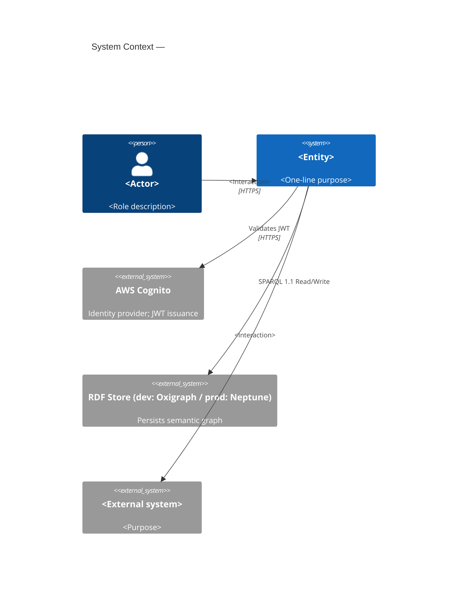
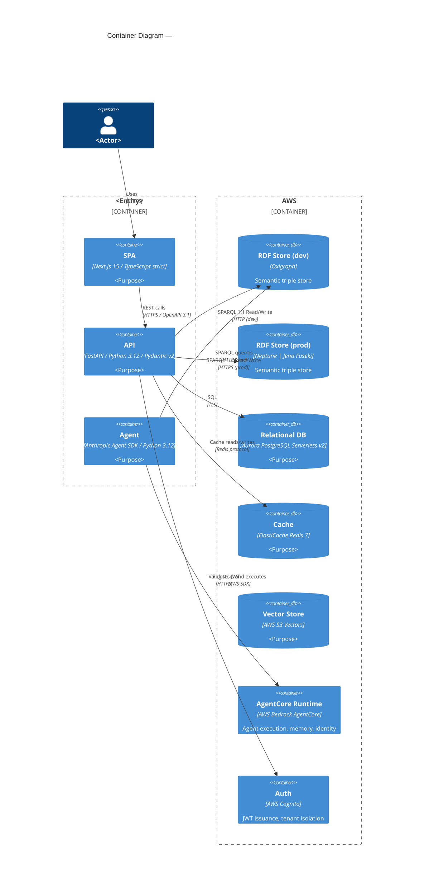
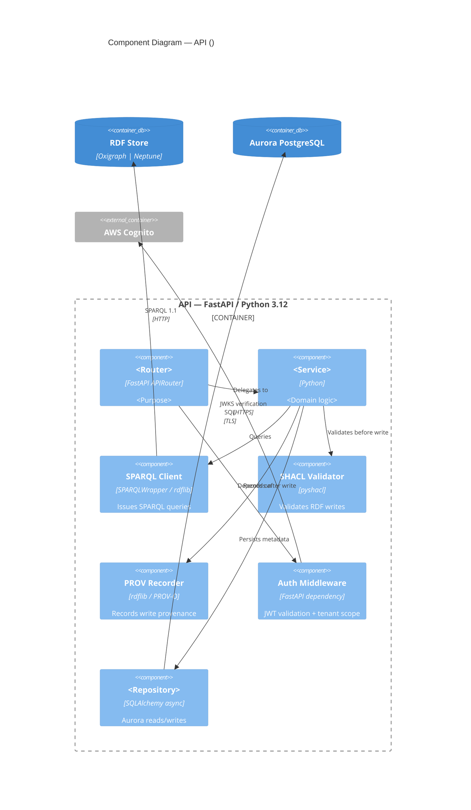
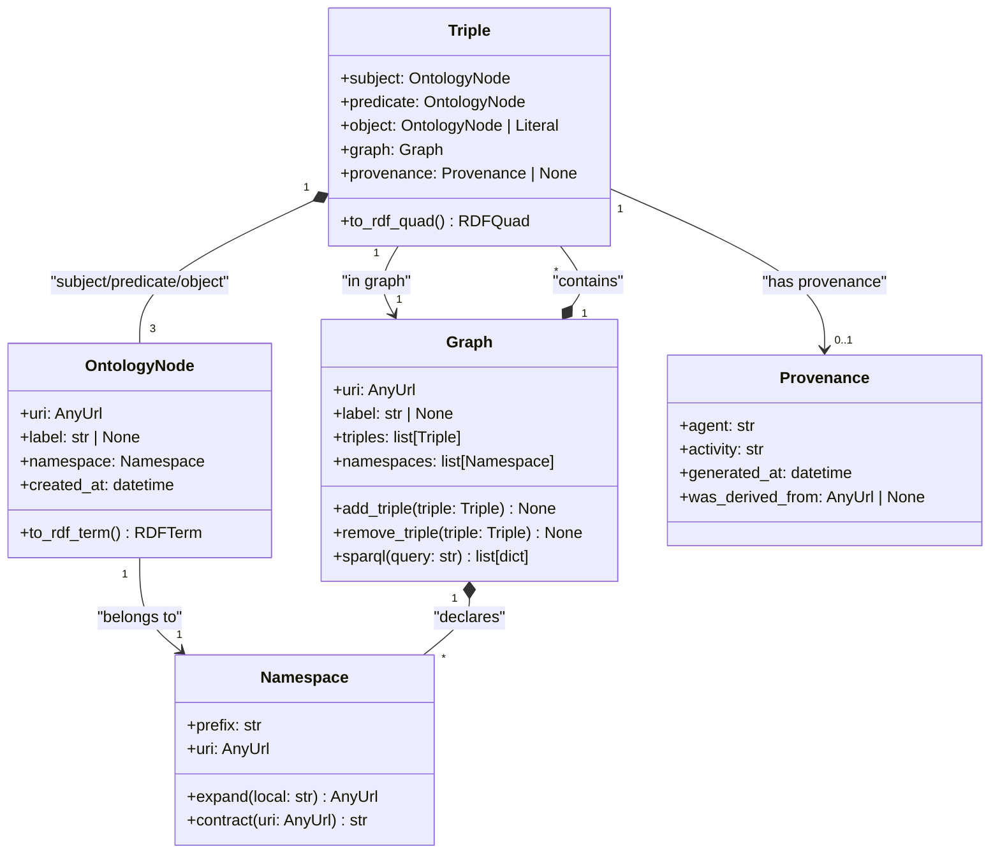
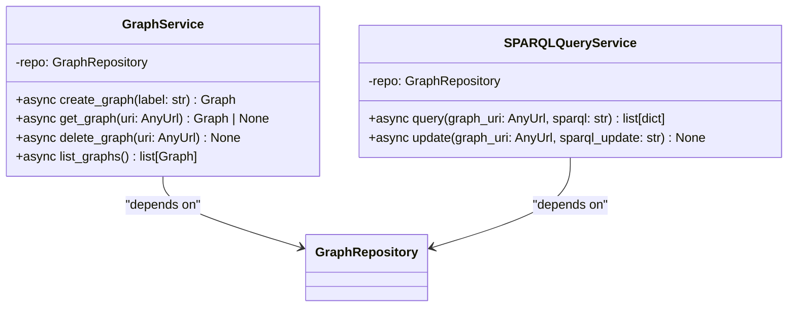
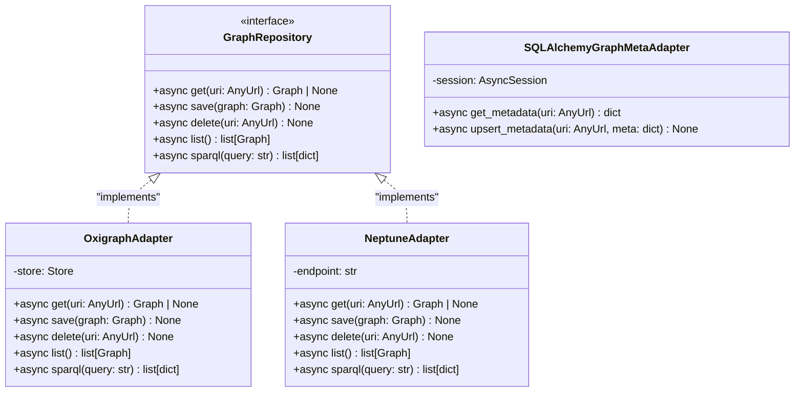
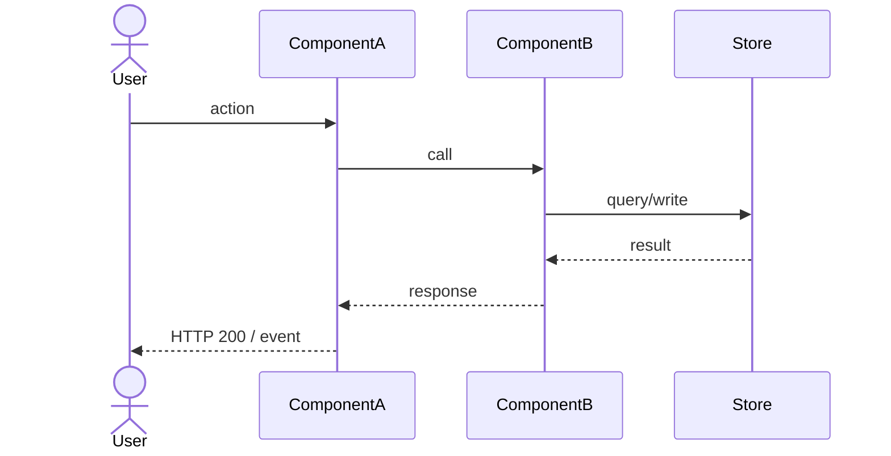
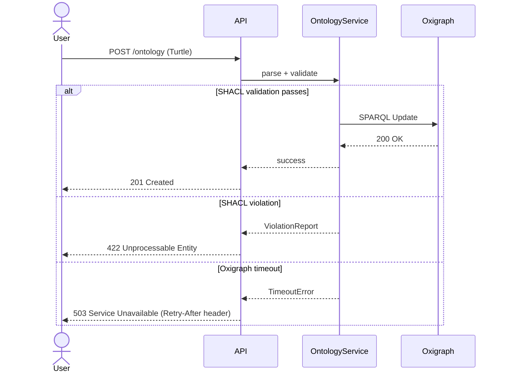
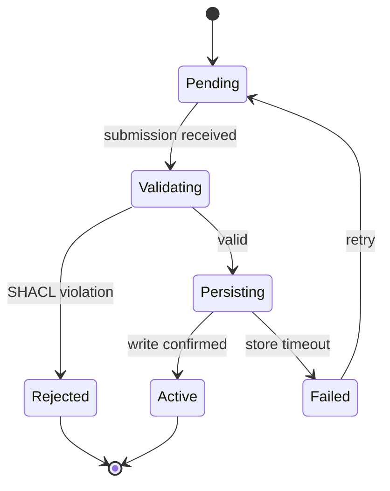

# arch-diagrams Skill

Produce the three sequential visual-architecture artifacts of a Weave tech spec: the C4
architecture document, the domain class diagram, and the business-process flow diagrams.
Invoked by the Architect agent when a tech spec needs formal diagrams. Every artifact is
delivered incrementally — one C4 level, one class batch, one flow — with HITL review (present,
confidence block, AskUserQuestion: Approve / Amend / Reject) at every step; never a single dump.

Run the three parts in this order:

1. **Part 1 — C4 Architecture** (`architecture.md`) — Levels 1-3 plus an adversarial-critic
   design-decisions table and EARS invariants.
2. **Part 2 — Class Diagram** (`class-diagram.md`) — invoked once Part 1's Level 2 container
   diagram is approved; maps the domain model as Mermaid `classDiagram`.
3. **Part 3 — Business Process Flows** (`business-process.md`) — one flow at a time; component
   names must stay consistent with Part 1's C4 diagrams and, where it exists, `data-model.md`.

Each part below keeps its own Model tier, Input list, numbered Instructions, constitutional
self-check, confidence-block rules, Output/frontmatter spec, and Evaluation Criteria — these are
self-contained per part and are not shared across parts.

---

## Part 1: C4 Architecture

### Model

- **Drafting phase:** high tier (spatial reasoning, tradeoff analysis, adversarial critic)

High tier is required here: C4 diagrams demand accurate boundary reasoning, technology placement,
and the ability to hold the full system in context while running the adversarial-critic pass.
Mid tier is not sufficient for this level of architectural precision.

### Input

Before doing anything else, read:

1. `CLAUDE.md` — Weave product context, confirmed stack, Plugin Laws A-F, agent laws
2. `.claude/spec-templates/tech-spec/architecture.md` — section scaffold (use for diagram
   structure; never leave `{{}}` in output)
3. `.claude/spec-templates/architecture/architecture.md` — current-state template (reference
   for confidence-level metadata)
4. `.claude/spec-templates/architecture/invariants.md` — invariants section shape
5. `docs/specs/weave/engines/<entity>.md` — the parent PRD; use it to identify actors,
   external systems, and integration requirements
6. `docs/specs/weave/engines/<entity>.md` — phase structure that shapes the diagram
   boundary (if present)
7. `docs/specs/weave/engines/<entity>/decisions/` and `docs/specs/weave/engines/<entity>/tech-spec/` — any existing ADRs or prior architecture drafts

Ask the user which entity this diagram is for (e.g. `constitution-engine`, `build-engine`,
`weave-platform`) if not supplied as an argument. Derive the output path as:

`docs/specs/weave/engines/<entity>/tech-spec/architecture.md`

### Instructions

#### Step 0 — State the governing principle (never skip)

Write 2-3 sentences naming the principle that governs a C4 architecture document before
writing anything else.

Example: "A C4 diagram's job is to answer a single question at each zoom level: what exists,
how it communicates, and why the boundaries are where they are. If a stakeholder reading Level
2 still has to guess which process runs which container, the diagram has failed. Every
boundary decision must be justifiable as a deployment, security, or scaling unit."

Reference this principle when justifying boundary placement and technology choices during
the HITL loop.

#### Step 1 — Context ingestion

1. Read all files listed in the Input section above.
2. Identify the entity's actors, external systems, containers, and known integration points
   from the PRD and roadmap.
3. Summarise what you know in 4 bullets before proceeding:
   - The entity's purpose and the primary actor(s) interacting with it
   - External systems and integration boundaries visible in the PRD
   - Weave stack components confirmed for this entity (from `CLAUDE.md`)
   - What is NOT yet decided (e.g. RDF store choice deferred to prod, agent runtime config)

Ask via AskUserQuestion:

- "What additional context do you have for this architecture?"
  Options: Meeting notes or transcript / Existing whiteboard / Existing draft to refine /
  Confirmed decisions not yet in CLAUDE.md / Start from context above

#### Step 2 — Confirm entity scope and boundary

Before drawing any diagram, confirm the system boundary:

1. State the proposed boundary in plain English:
   - What is INSIDE the system boundary (Weave code you own)
   - What is OUTSIDE (AWS services, external SaaS, client systems)
   - Which Weave sub-systems are peer-systems vs. components of this entity

2. Ask via AskUserQuestion:
   - "Does this system boundary look right?"
     Options: Approved / Adjust boundary / Collapse sub-systems / Expand boundary

Only proceed to diagram production once the boundary is approved. Never draw before the
boundary is confirmed.

#### Step 3 — Section-by-section production

Produce the architecture document in this exact order. For each section:

1. **Write** the section to the file
2. **Run the constitutional self-check** (see below) — stop and revise if any Law violated
3. **Present** the section to the user (display the written content including the mermaid block)
4. **Emit a confidence block** (see below) immediately before the HITL question
5. **Ask** via AskUserQuestion: Approve / Amend / Reject
6. If Amend: apply changes, show diff, re-present with updated confidence block
7. If Reject: regenerate with a cleaner approach, show the new version

**Sections in order:**

---

##### Section A — Overview and C4 Model Explanation

Write a brief orientation paragraph (3-5 sentences) that:

- Names the entity and its purpose in Weave's architecture
- Explains which C4 levels are covered in this document (1-3) and which are deferred (4)
- States the Weave stack components that appear at each level
- Notes the RDF store progression: Oxigraph (dev/test) → Neptune or Jena Fuseki (prod)
- Notes the AI layer boundary: Anthropic Agent SDK → AWS Bedrock AgentCore

Do NOT write a generic C4 tutorial. The paragraph assumes the reader knows C4 and focuses
on what is specific to this entity.

---

##### Section B — Level 1: System Context Diagram

**Diagram is MANDATORY.** Use C4Context mermaid notation exactly.

Constraints:
- Show the PRIMARY actor(s) — human users and/or machine clients
- Show the SYSTEM under design as a single box
- Show ALL external systems: AWS Cognito/Auth0, downstream Weave sub-systems that are
  peer-level, client data stores (Snowflake, Databricks, S3, Azure, Jira, ServiceNow)
- Show communication directions with labelled `Rel()`
- Do NOT show internal containers at this level

Template (adapt, do not copy verbatim):



After drafting, ask via AskUserQuestion before proceeding to Level 2:

- "Level 1 System Context — approve before I draw Level 2?"
  Options: Approved — proceed to Level 2 / Amend this diagram first / Reject and redraw

---

##### Section C — Level 2: Container Diagram

**Diagram is MANDATORY.** Use C4Container mermaid notation exactly.

Constraints:
- Show each deployable/runnable unit as a Container: SPA, API service, Lambda functions,
  agents, data stores, caches
- Use the confirmed Weave stack labels:
  - Frontend: `Next.js 15 App Router / TypeScript strict`
  - API: `FastAPI / Python 3.12 / Pydantic v2`
  - RDF store: `Oxigraph (dev) | Neptune (prod)` — show BOTH with a note
  - Vector store: `AWS S3 Vectors`
  - Relational: `Aurora PostgreSQL Serverless v2`
  - Cache: `ElastiCache Redis 7`
  - Agent: `Anthropic Agent SDK → AgentCore Runtime`
- Show the AWS boundary as a `Container_Boundary(aws, "AWS")`
- Show data-flow direction on every `Rel()` with protocol label
- Person and System_Ext from Level 1 appear at the edges (not expanded)

Template (adapt, do not copy verbatim):



After drafting, ask via AskUserQuestion before proceeding to Level 3:

- "Level 2 Container — approve before I draw Level 3?"
  Options: Approved — proceed to Level 3 / Amend this diagram first / Reject and redraw

---

##### Section D — Level 3: Component Diagram (key components only)

**Diagram is MANDATORY.** Use C4Component mermaid notation exactly. Cover the most
architecturally significant container only (typically the API or agent). Do not attempt
to draw all containers at L3 — choose one and note which was chosen and why.

Constraints:
- Focus on the container with the highest architectural complexity or risk
- Show internal components (route handlers, services, repositories, domain models)
- Show inbound calls from Level 2 peers
- Show outbound calls to stores/caches/external APIs
- Keep to ≤ 12 components in one diagram; split to a second diagram if needed
- Reference exact module/package names where known from the PRD or existing code
- Do NOT show class-level detail (that belongs in Part 2 — Class Diagram, below)

Template (adapt, do not copy verbatim):



After drafting, ask via AskUserQuestion before proceeding to Design Decisions:

- "Level 3 Component — approve before I run the adversarial-critic pass?"
  Options: Approved — run critic pass / Amend this diagram first / Reject and redraw /
  Draw a different container at L3 instead

---

##### Section E — Design Decisions (adversarial critic pass)

**Run an adversarial critic pass BEFORE writing this section.**

The critic pass asks: "What would a sceptical senior engineer ask after seeing these three
diagrams?" Generate at least 5 adversarial questions internally, then resolve each:

Mandatory critic questions (always run these):

1. "Why is the RDF store boundary drawn here and not inside the Weave SPA boundary?"
2. "What happens to in-flight SPARQL writes if the Lambda function cold-starts mid-request?"
3. "Where does multi-tenancy enforcement happen — is it the API layer, the RDF store, or both?"
4. "Does the agent container have a blast radius if it consumes unbounded tokens on AgentCore?"
5. "What is the fallback if Neptune is unavailable and only Oxigraph dev is running?"

Add entity-specific critic questions from the PRD's risk/constraint sections.

Format the output as a table:

| # | Decision | Rationale | Alternatives Rejected | Critic Challenge | Response |
|---|----------|-----------|----------------------|-----------------|---------|

Rules:
- Minimum 5 rows (the 5 mandatory critic questions above, resolved)
- Add entity-specific decisions surfaced during the diagram phases
- "Alternatives Rejected" must name at least one alternative, not just say "N/A"
- "Critic Challenge" is the adversarial question; "Response" is the resolution
- Reference ADRs if they exist (link to `docs/specs/weave/engines/<entity>/decisions/`)
- Reference the confirmed Weave stack for any technology-selection decisions

---

##### Section F — Invariants and Quality Attributes

Two sub-sections:

**Invariants** — constraints that must hold at all times in the system. Use EARS notation:

```
WHEN [trigger or steady state] THE SYSTEM SHALL [constraint]
```

Mandatory invariants to include (adapt to entity):

- Multi-tenancy: WHEN any API request is processed THE SYSTEM SHALL scope all RDF graph
  reads and writes to the authenticated tenant's named graph.
- SHACL validation: WHEN a triple is written to the RDF store THE SYSTEM SHALL validate it
  against the entity's SHACL shapes before persisting and reject invalid writes with HTTP 422.
- Provenance: WHEN any RDF write is committed THE SYSTEM SHALL record a PROV-O activity with
  actor IRI, timestamp, and changeset IRI.
- Auth: WHEN an unauthenticated request reaches any API endpoint THE SYSTEM SHALL return
  HTTP 401 and log the attempt to CloudWatch.
- Dev/prod parity: WHEN running in the test environment THE SYSTEM SHALL use LocalStack for
  all AWS services and Oxigraph for the RDF store — no real cloud calls in tests.

Add entity-specific invariants from the PRD's functional requirements and constraints.

**Quality Attributes** — table of non-functional requirements with measurable targets:

| Attribute | Target | Measurement | Risk if missed |
|-----------|--------|-------------|----------------|
| SPARQL read latency | p95 < 500ms under 50 concurrent users | Locust load test in CI | Graph explorer unusable |
| API write throughput | ≥ 100 triple-writes/sec sustained | Locust load test in CI | Build engine pipeline stall |
| Cold-start latency | Lambda p99 < 3s | CloudWatch Insights | Agent task timeout |
| Availability | 99.9% monthly uptime | CloudWatch alarms | SLA breach |
| Mutation test coverage | ≥ 60% | mutmut in CI | Silent regressions |

Adapt targets to entity specifics from the PRD. Do not copy these verbatim — replace
placeholders with entity-appropriate thresholds.

---

#### After all sections approved

1. Update the document footer to:
   `*Generated by Weave arch-diagrams skill. Review and approve before task decomposition.*`

2. Create the output directory if it does not exist:

```bash
mkdir -p docs/specs/weave/engines/<entity>/tech-spec/
```

3. Commit the architecture file:

```bash
git add docs/specs/weave/engines/<entity>/tech-spec/architecture.md
git commit -m "docs(<entity>): add C4 architecture (L1–L3 + design decisions)"
```

4. Tell the user:
   "architecture.md complete. Continuing to Part 2 (class diagram) of this skill. Once all
   three diagram artifacts are done:
   - `/arch-adr` — formalise key decisions as ADRs
   - `/arch-contracts` — draw the data model and OpenAPI spec
   - `/arch-task-brief` — decompose into implementation tasks"

### Constitutional self-check (run before every section delivery)

Walk both Law layers. Write one line per Law, format exactly:

```
Plugin Law A (common-stack first):       complied | violated | N/A — <reason>
Plugin Law B (testable):                 complied | violated | N/A — <reason>
Plugin Law C (council quality):          complied | violated | N/A — <reason>
Plugin Law D (stacked PRs):              complied | violated | N/A — <reason>
Plugin Law E (complexity budget):        complied | violated | N/A — <reason>
Plugin Law F (no real cloud in tests):   complied | violated | N/A — <reason>
C4 Law 1 (mermaid mandatory):            complied | violated | N/A — <reason>
C4 Law 2 (boundary confirmed first):     complied | violated | N/A — <reason>
C4 Law 3 (HITL between levels):          complied | violated | N/A — <reason>
C4 Law 4 (adversarial critic ran):       complied | violated | N/A — <reason>
C4 Law 5 (EARS invariants):              complied | violated | N/A — <reason>
C4 Law 6 (dev/prod RDF both shown):      complied | violated | N/A — <reason>
C4 Law 7 (Anthropic Agent SDK→AgentCore boundary):   complied | violated | N/A — <reason>
```

**C4-specific laws:**

- **C4 Law 1** — Every diagram level (L1, L2, L3) MUST include a valid mermaid C4 block.
  A prose description without a mermaid block is a violation.
- **C4 Law 2** — The system boundary (inside vs. outside) MUST be confirmed by the user
  (Step 2) before any diagram is written.
- **C4 Law 3** — The user MUST approve each diagram level before the next level is produced.
  No multi-level dumps.
- **C4 Law 4** — The adversarial critic pass MUST run internally before Section E is written.
  The 5 mandatory questions must appear in the Design Decisions table.
- **C4 Law 5** — All invariants MUST use EARS notation (`WHEN … THE SYSTEM SHALL …`).
  No exceptions.
- **C4 Law 6** — The RDF store progression (Oxigraph dev → Neptune/Jena Fuseki prod) MUST
  appear in both the Level 2 container diagram and the Quality Attributes section.
- **C4 Law 7** — The Anthropic Agent SDK → AgentCore boundary MUST be visible in the Level 2 diagram
  wherever an agent container is present in the entity scope.

If ANY line says "violated": STOP, revise the section, re-run the check.
Output the trace in chat (user sees it). Keeps Laws active across long sessions.

### Confidence block (emit before every HITL question)

Output this block immediately after presenting the section, before the AskUserQuestion call:

```
<section-confidence>
Confidence: high | medium | low
Weakest part: <name the specific diagram element, table row, or invariant>
Why: <1 sentence — what input was missing or what was assumed>
</section-confidence>
```

Rules:

- Always name the weakest part, even on high-confidence sections.
- "Why" must reference a specific input gap, not a generic hedge like "architecture is complex".
- The block lives in chat only — do not embed it in the file.

Low-confidence triggers: external system integrations not named in the PRD; agent container
scope not confirmed (what the agent does vs. what the API does); RDF named-graph strategy
not specified; quality-attribute thresholds not sourced from the PRD.

### Output

**File:** `docs/specs/weave/engines/<entity>/tech-spec/architecture.md`

Create the directory if it doesn't exist:

```bash
mkdir -p docs/specs/weave/engines/<entity>/tech-spec/
```

**Template:** `.claude/spec-templates/tech-spec/architecture.md`

Never leave `{{PLACEHOLDER}}` in the output. All template variables must be resolved before
presenting the section to the user.

**Frontmatter:**

```yaml
---
type: Architecture Spec
title: "Architecture: <Entity Display Name>"
description: "<one-line summary of the C4 architecture for this entity>"
tags: [<entity>, arch]
timestamp: <YYYY-MM-DDThh:mm:ssZ>
status: Draft
created: <YYYY-MM-DD>
entity: <entity>
phase: <Phase N — Phase Name>
prd_ref: "../../02-prd/prd.md"
---
```

**Footer line:**

```
*Generated by Weave arch-diagrams skill. Review and approve before task decomposition.*
```

### Evaluation Criteria

A well-produced architecture document:

- Has three mermaid C4 diagrams (L1 C4Context, L2 C4Container, L3 C4Component) — no
  level may be skipped or replaced with prose
- Shows the RDF store dev/prod progression (Oxigraph → Neptune | Jena Fuseki) in the
  Level 2 container diagram
- Shows the Anthropic Agent SDK → AgentCore boundary in Level 2 wherever an agent is in scope
- Has a Design Decisions table with ≥ 5 rows including responses to all 5 mandatory
  adversarial-critic questions
- Has ≥ 5 EARS-notated invariants including multi-tenancy, SHACL validation, PROV-O
  provenance, auth, and dev/prod parity
- Has a Quality Attributes table with measurable, entity-specific targets (not the
  template defaults verbatim)
- Uses confirmed Weave stack labels in all diagram tech annotations
- Has no `{{PLACEHOLDER}}` text in the output file
- Was delivered section-by-section with HITL at every level before the next level was drawn
- System boundary was confirmed by the user (Step 2) before any diagram was written
- Constitutional self-check trace present in chat for every section
- Committed with a conventional commit message
  (`docs(<entity>): add C4 architecture (L1–L3 + design decisions)`)

---

## Part 2: Class Diagram

Invoked after Part 1's C4 container diagram (Level 2, Section C) has been approved —
the class diagram's Step 1 gate checks for an approved `architecture.md` and marks
itself DRAFT if that file is absent or still in draft.

### Model

- **Drafting phase:** mid tier (structured generation, precise relationships)
- **Reasoning tier:** generation — translates spec intent into typed domain model

### Input

Before doing anything else, read:

1. `CLAUDE.md` — Weave product context, confirmed stack, laws
2. `.claude/spec-templates/architecture/class.md` — section structure (scaffold; never leave
   `{{}}` in output)
3. `docs/specs/weave/engines/<entity>/tech-spec/architecture.md` if it exists — confirms Level 3
   (module) boundary before class-level work is trustworthy
4. `docs/specs/weave/engines/<entity>.md` if it exists — domain vocabulary and bounded
   contexts
5. Any existing draft (`docs/specs/weave/engines/<entity>/tech-spec/class-diagram.md`) to
   continue or refine

Ask the user which entity this diagram is for (e.g. `constitution-engine`, `build-engine`,
`weave-platform`) if not supplied. Output path is:

```
docs/specs/weave/engines/<entity>/tech-spec/class-diagram.md
```

### Instructions

#### Step 0 — State the governing principle (never skip)

Write 2-3 sentences naming the principle that governs a class diagram before producing
anything else.

Example: "A class diagram's job is to make the domain model legible — not to document every
field in every object. If an architect reads it and still has to guess how the graph model
composes, the diagram has failed. Every class shown must carry its own weight; boilerplate
framework classes do not belong here."

Reference this principle when justifying decisions during the HITL loop.

#### Step 1 — Context ingestion

1. Read the input files listed above.
2. Confirm the architecture.md Level 3 gate: if `architecture.md` is absent or DRAFT, emit
   a warning — the class diagram is also DRAFT until Level 3 is SME-confirmed.
3. Summarise what you know in 3 bullets before producing any diagram:
   - What bounded contexts / modules are in scope
   - What Weave core types are already known (OntologyNode, Triple, Graph, Namespace, etc.)
   - What is still unclear (relationships, cardinality, inheritance chains)

Ask via AskUserQuestion:
- "What context do you have?" Options: PRD / Architecture doc / Verbal description / Start
  from scratch

4. Before producing the diagram, offer structured elicitation via AskUserQuestion:
   "Run a structured elicitation first?" Options: Domain story walk-through / CRC cards /
   Event Storming / Skip

#### Step 2 — Identify domain layers

Group all known domain objects into three layers before drawing any class:

| Layer | Description | Examples |
|---|---|---|
| Core domain | Primary domain entities with business identity | `OntologyNode`, `Triple`, `Graph`, `Namespace` |
| Service layer | Orchestration and use-case services (thin — no business logic) | `GraphService`, `SPARQLQueryService` |
| Repository / adapter | Port interfaces and concrete adapters to Oxigraph / Aurora / S3 | `GraphRepository`, `OxigraphAdapter` |

Present this table to the user as a scoping artefact. Ask via AskUserQuestion:
"Does this layer breakdown look right?" Options: Approve / Amend / Add more context

#### Step 3 — Section-by-section production

Produce the diagram in this exact order. For each section:

1. **Write** the section to the file (never more than 8 classes per batch)
2. **Run the constitutional self-check** (see below) — stop and revise if any Law violated
3. **Present** the section to the user (display the written Mermaid block)
4. **Emit a confidence block** (see below) immediately before the HITL question
5. **Ask** via AskUserQuestion: Approve / Amend / Reject
6. If Amend: apply changes, show diff, re-present with updated confidence block
7. If Reject: regenerate with a cleaner approach, show the new version

**Sections in order:**

##### Section 1 — Overview narrative

Prose paragraph (4-6 sentences) describing the key domain objects and their relationships
at a conceptual level. No Mermaid yet. Must name:

- The root aggregate or central entity (e.g. `Graph` owns `Namespace` and `Triple`)
- The primary inheritance chains (e.g. all nodes extend `OntologyNode`)
- The key composition relationships (e.g. `Triple` is composed of three `OntologyNode`
  references: subject, predicate, object)
- Any polymorphic boundaries (e.g. `GraphRepository` is an interface; `OxigraphAdapter`
  and `AuroraAdapter` are concrete implementations)

##### Section 2 — Core domain classes (Pydantic models, batch 1: up to 5 classes)

Mermaid `classDiagram` block. Rules:

- Show Pydantic models as the primary data contracts (FastAPI/Python stack — Pydantic v2).
- Every class has at minimum: typed fields and method signatures (no bare class names).
- Show inheritance with `<|--` and composition with `*--`.
- Use `<<abstract>>` for base classes and `<<interface>>` for port interfaces.
- Show cardinality on associations where it is known (e.g. `1` to `*`).

Minimum required classes for Weave constitution-engine domain:



**HITL gate — do not proceed to batch 2 until this batch is approved.**

##### Section 3 — Core domain classes (batch 2: remaining domain classes, up to 5)

Any additional core domain classes not covered in batch 1. Common candidates:

- `SHACLShape` — validation shape bound to a node type
- `OntologyClass` — extends `OntologyNode`; represents an OWL class
- `OntologyProperty` — extends `OntologyNode`; represents an OWL property
- `SKOSConcept` — extends `OntologyNode`; represents a SKOS concept
- `Literal` — RDF literal with datatype and optional language tag

Apply the same Mermaid rules as Section 2. Show cross-batch relationships
(e.g. `OntologyClass <|-- OntologyNode`).

**HITL gate — do not proceed to service layer until this batch is approved.**

##### Section 4 — Service layer classes

Thin orchestration services — no business logic here; delegate to domain objects.
For Python/FastAPI: show these as regular classes with typed method signatures.
Mark any async methods explicitly (e.g. `+async query(sparql: str) list[dict]`).

Common Weave service classes:

- `GraphService` — CRUD on graphs; calls `GraphRepository`
- `SPARQLQueryService` — executes SPARQL queries; validates against `SHACLShape`
- `ProvenanceService` — writes `Provenance` records via PROV-O
- `OntologyImportService` — parses Turtle/OWL files into `Triple` objects

Show dependencies between services and the repository interface:



**HITL gate — do not proceed to repository layer until this batch is approved.**

##### Section 5 — Repository / adapter layer

Port interfaces and concrete adapters. Rules:

- Interfaces use `<<interface>>` stereotype (Python: `Protocol` or `ABC`).
- Concrete adapters use standard class notation with `implements` shown as `<|..`.
- Show only the methods relevant to the domain — no internal plumbing methods.

Standard Weave adapters:

- `GraphRepository` — interface (port)
- `OxigraphAdapter` — implements `GraphRepository`; dev/test store
- `NeptuneAdapter` — implements `GraphRepository`; prod store (stub until Neptune decision)
- `SQLAlchemyGraphMetaAdapter` — Aurora PostgreSQL adapter for graph metadata



**HITL gate — all sections must be approved before the commit step.**

#### After all sections approved

Run `.claude/scripts/progress.sh` to update `.claude/state/progress.json` if present.

Commit the diagram:

```
git add docs/specs/weave/engines/<entity>/tech-spec/class-diagram.md
git commit -m "docs(<entity>): add class diagram"
```

Then tell the user: "Class diagram complete. Continuing to Part 3 (business-process flows)
of this skill. `/arch-contracts` covers the data model and OpenAPI spec separately."

### Constitutional self-check (run before every section delivery)

Walk both Law layers. Write one line per Law, format exactly:

```
Plugin Law A (common-stack first): complied | violated | N/A — <reason>
Plugin Law B (testable): complied | violated | N/A — <reason>
Plugin Law C (council quality): complied | violated | N/A — <reason>
Plugin Law D (stacked PRs): complied | violated | N/A — <reason>
Plugin Law E (complexity budget): complied | violated | N/A — <reason>
Plugin Law F (no real cloud in tests): complied | violated | N/A — <reason>
Class Law 1 (Mermaid mandatory): complied | violated | N/A — <reason>
Class Law 2 (domain-only, no boilerplate): complied | violated | N/A — <reason>
Class Law 3 (Pydantic as primary contract): complied | violated | N/A — <reason>
Class Law 4 (inheritance and composition explicit): complied | violated | N/A — <reason>
Class Law 5 (≤ 8 classes per batch): complied | violated | N/A — <reason>
Class Law 6 (HITL after every batch): complied | violated | N/A — <reason>
```

If ANY line says "violated": STOP, revise the section, re-run the check.
Output the trace in chat (user sees it). Keeps Laws active across long sessions.

### Confidence block (emit before every HITL question)

Output this block immediately after presenting the section, before the AskUserQuestion call:

```
<section-confidence>
Confidence: high | medium | low
Weakest part: <name the specific class, field, or relationship>
Why: <1 sentence — what input was missing or what you assumed>
</section-confidence>
```

Rules:

- Always name the weakest part, even on high-confidence sections.
- "Why" must reference a specific input gap. "The future is uncertain" is not acceptable.
- On architecture diagrams: name the specific relationship or cardinality that is assumed.
- The block lives in chat only — do not embed it in the file.

### Output

File: `docs/specs/weave/engines/<entity>/tech-spec/class-diagram.md`

Template: `.claude/spec-templates/architecture/class.md`

Create the directory if it doesn't exist. Never leave `{{PLACEHOLDER}}` in the output.

Frontmatter:

```yaml
---
type: Class Diagram Spec
title: "Class Diagram: <entity display name>"
description: "<one-line summary of the domain class model for this entity>"
tags: [<entity>, arch]
timestamp: <YYYY-MM-DDThh:mm:ssZ>
status: Draft
created: <YYYY-MM-DD>
entity: <entity>
layer: class
confirmed_by: ""
confirmed_on: null
---
```

Rendering note: every Mermaid block must be fenced with triple backticks and the `mermaid`
language tag. GitHub renders these natively; no separate rendering step is needed.

### Evaluation Criteria

A well-produced class diagram:

- Contains at least one `classDiagram` Mermaid block per module with typed fields and
  method signatures (no bare property names)
- Shows Pydantic v2 models as the primary data contracts for Python/FastAPI classes
- Shows inheritance (`<|--`) and composition (`*--`) explicitly — not implied by prose
- Shows the repository port interface and at least one concrete adapter
- Has no more than 8 classes per Mermaid block (readability law)
- Has no boilerplate framework classes (FastAPI `APIRouter`, SQLAlchemy `Base`, etc.)
- Reflects the Weave confirmed stack (Oxigraph adapter present; Neptune adapter stubbed)
- Was delivered section-by-section, in batches, with HITL at every batch
- Constitutional self-check trace present in chat for every section
- No `{{PLACEHOLDER}}` text in the committed file

---

## Part 3: Business Process Flows

Benefits from Part 1 (component names in sequence diagrams must match `architecture.md`
C4 Level 2/3) and, if it exists yet, `data-model.md` (entity names must match the ERD).

### Model

- **Flow elicitation:** high tier (broad reasoning, surfaces edge cases and invisible paths)
- **Diagram drafting:** mid tier (structured Mermaid, concise prose)

### Input

Before doing anything else, read:

1. `CLAUDE.md` — Weave product context, confirmed stack, laws
2. `.claude/spec-templates/architecture/flows.md` — output scaffold (never leave `{{}}` in output)
3. Approved PRD: `docs/specs/weave/engines/<entity>.md` (scope, user journeys)
4. Approved roadmap: `docs/specs/weave/engines/<entity>.md` (phase being specced)
5. C4 architecture doc if present: `docs/specs/weave/engines/<entity>/tech-spec/architecture.md`
   (component names must be consistent across all arch shards)
6. Data model if present: `docs/specs/weave/engines/<entity>/tech-spec/data-model.md`
   (entity names used in diagrams must match the ERD)

Ask the user which entity this covers if not supplied. Output path is:
`docs/specs/weave/engines/<entity>/tech-spec/business-process.md`

### Instructions

#### Step 0 — State the governing principle (never skip)

Write 2-3 sentences naming what makes a flow diagram worth having before writing anything else.

Example: "A flow diagram earns its keep by exposing decisions that prose hides. The happy path
alone is a lie — every flow has at least one error path, one auth boundary, and one timeout.
If a diagram doesn't show where things go wrong, it's decoration, not specification."

Reference this principle when justifying scope decisions during HITL loops.

#### Step 1 — Context ingestion

1. Read the inputs listed above (all that exist).
2. Summarise what you know in 3 bullets before asking the first question:
   - Which sub-system / entity this covers
   - Which stack components appear in this entity's flows (from CLAUDE.md confirmed stack)
   - Which flows are already implied by the PRD or C4 container diagram

3. Ask via AskUserQuestion which flows to cover (MANDATORY — never draft diagrams before this):

   > "Which flows should I document? Select all that apply, or describe custom flows."
   > Options (pre-populated for Weave; user may add others):
   > - Ontology ingestion (Turtle/RDF upload → parse → validate SHACL → persist to Oxigraph)
   > - Graph query (SPARQL request → Oxigraph → result set → API response)
   > - Agent trigger (event → Anthropic Agent SDK agent → Bedrock model call → action → graph write-back)
   > - Schema validation (SHACL shape check → violation report → rejection or warning)
   > - User authentication (login → Cognito → JWT → API gateway → service)
   > - Connector sync (external source → managed connector → graph delta → RDF store update)
   > - Custom flow (user describes)

4. For each selected flow, ask via AskUserQuestion:
   > "For [flow name]: does it involve persistent state changes (i.e. should I also draw a
   > state machine)?"
   > Options: Yes — draw state machine / No — sequence diagram only

5. Confirm the full flow list and order with the user before proceeding to Step 2.

#### Step 2 — Process overview section

Write the `## Process overview` section: a numbered list of all flows to be documented, each
with a one-sentence description of the trigger, the key components traversed, and the terminal
outcome. This is a map of the document, not the diagrams themselves.

Run the constitutional self-check (see below).
Present the section.
Emit a confidence block.
Ask via AskUserQuestion: Approve / Amend / Reject.

#### Step 3 — Per-flow production (repeat for each flow)

For each flow agreed in Step 1, produce the following sub-sections in order.
Run one HITL cycle per flow (not per sub-section), unless the flow is complex enough
to warrant splitting happy path and error cases across two HITL rounds (use judgement;
flows with more than 3 error variants should split).

##### 3a — Happy path sequence diagram



Rules:
- Use `actor` for human actors. Use `participant` for system components.
- Component names MUST match those in `architecture.md` (C4 Level 2/3).
- Show the JWT/Cognito auth step wherever an API boundary is crossed.
- Show Oxigraph as the named RDF store for dev/test. Use `RDF Store` as an alias when
  the prod target (Neptune / Fuseki) is not yet decided.
- Show Anthropic Agent SDK agent and Bedrock model call as separate participants for agent flows.
- Response arrows use `-->>` (dashed). Request arrows use `->>` (solid).
- Add a `Note over ComponentA,ComponentB: annotation` for non-obvious steps.
- Latency SLOs go in notes: `Note right of Store: target < 200 ms`.

##### 3b — Error and edge case diagrams

Cover all four mandatory error variants for every flow:

1. **Auth failure** — token absent, expired, or insufficient scope
2. **Validation failure** — SHACL violation, Pydantic schema error, or malformed input
3. **Downstream timeout** — RDF store, Bedrock, or external connector does not respond
4. **Idempotency / conflict** — duplicate submission, optimistic lock failure, or replay

Each variant may be a separate `sequenceDiagram` block, or combined using `alt` / `opt` /
`loop` Mermaid blocks within the happy-path diagram if the branching is simple.

Prefer separate diagrams when the error path diverges at the first step. Prefer `alt` blocks
when the error diverges only at the final persistence step.

Example `alt` pattern:



##### 3c — State machine diagram (only if user confirmed in Step 1 step 4)

Use `stateDiagram-v2`. Cover all reachable states and terminal states.



Rules:
- Every state must have at least one outgoing transition, except terminal states.
- Label every transition arrow with the trigger event.
- Include a `Failed` / error state for any flow that touches an external system.
- For long-running agent flows, include `Running`, `Waiting`, and `Cancelled` states.

##### 3d — Invisible edges table

List edges the static diagram cannot show: event-bus publishes, DI wirings, feature-flag
branches, runtime-resolved URLs. One row per edge. This is mandatory even if empty (write
"None identified" as a single row with all other columns blank).

| Edge | From | To | Mechanism | Source (SME + date) |
|---|---|---|---|---|
| … | … | … | event name / queue / flag | … |

---

After completing all sub-sections for a flow, run the constitutional self-check.
Present the full flow (all sub-sections together).
Emit a confidence block.
Ask via AskUserQuestion: Approve / Amend / Reject.

If Amend: apply changes to the specific sub-section, re-show the affected diagram, re-present
the confidence block.

If Reject: regenerate the entire flow from scratch with a new approach.

#### Step 4 — Entry points table

After all flows are approved, write the `## Entry points (observed)` table from the template.
Populate it from the flows just documented — one row per distinct API endpoint, event, or CLI
command that appeared as the first arrow in any sequence diagram.

| Entry point | Type | Handler (file#symbol) | Notes |
|---|---|---|---|
| … | HTTP / CLI / queue / cron | `path#symbol` | auth, rate-limit, flags |

If the codebase does not yet exist (greenfield), mark the `Handler` column `TBD` and note
the planned FastAPI router path.

Run constitutional self-check, present, confidence block, HITL.

#### Step 5 — Commit

```bash
git add docs/specs/weave/engines/<entity>/tech-spec/business-process.md
git commit -m "docs(<entity>): add business-process flows shard"
```

Tell the user: "Flows complete — architecture.md, class-diagram.md, and business-process.md
are all done. Cross-check component names for consistency. Next: `/arch-contracts` for the
data model and OpenAPI spec."

---

### Constitutional self-check (run before every section delivery)

Walk both Law layers. Write one line per Law, format exactly:

```
Plugin Law A (common-stack first): complied | violated | N/A — <reason>
Plugin Law B (testable): complied | violated | N/A — <reason>
Plugin Law C (council quality): complied | violated | N/A — <reason>
Plugin Law D (stacked PRs): complied | violated | N/A — <reason>
Plugin Law E (complexity budget): complied | violated | N/A — <reason>
Plugin Law F (no real cloud in tests): complied | violated | N/A — <reason>
Flows Law 1 (diagrams mandatory): complied | violated | N/A — <reason>
Flows Law 2 (flows scoped before drafting): complied | violated | N/A — <reason>
Flows Law 3 (four error variants per flow): complied | violated | N/A — <reason>
Flows Law 4 (component names consistent with C4): complied | violated | N/A — <reason>
Flows Law 5 (one HITL per flow): complied | violated | N/A — <reason>
```

If ANY line says "violated": STOP, revise the section, re-run the check.

Output the trace in chat. Keeps Laws active across long sessions.

**Flows Laws defined:**

- **Law 1** — Every flow MUST have at least one Mermaid diagram. Prose-only flows are a violation.
- **Law 2** — Flow scope MUST be agreed via AskUserQuestion before any diagram is drafted.
  Drafting without scope confirmation is a violation.
- **Law 3** — Every flow MUST cover all four error variants: auth failure, validation failure,
  downstream timeout, idempotency/conflict. Omitting any variant is a violation unless the
  user explicitly waives it.
- **Law 4** — Component names in diagrams MUST match those in `architecture.md` (C4 Level 2/3)
  if that file exists. Drift is a violation.
- **Law 5** — HITL MUST be run once per complete flow, not once per document. Running HITL
  only at the end of all flows is a violation.

---

### Confidence block (emit before every HITL question)

Output this block immediately after presenting the section, before the AskUserQuestion call:

```
<section-confidence>
Confidence: high | medium | low
Weakest part: <name the specific diagram, variant, or table row>
Why: <1 sentence — what input was missing or what you assumed>
</section-confidence>
```

Rules:

- Always name the weakest part, even on high-confidence sections.
- For diagrams, the weakest part is usually the timeout handling or an invisible edge.
- "Why" must reference a specific input gap. "Flows are hard to know without code" is not
  acceptable. "Assumed Cognito JWT is verified at the API Gateway layer, not the service
  layer — no C4 diagram available to confirm" is acceptable.
- The block lives in chat only — do not embed it in the output file.

---

### Output

**File:** `docs/specs/weave/engines/<entity>/tech-spec/business-process.md`

**Template:** `.claude/spec-templates/architecture/flows.md`

Create the directory if it does not exist. Never leave `{{PLACEHOLDER}}` in the output.

**Frontmatter:**

```yaml
---
type: Business Process Spec
title: "Business Process Flows: <entity display name>"
description: "<one-line summary of the business process flows for this entity>"
tags: [<entity>, arch]
timestamp: <YYYY-MM-DDThh:mm:ssZ>
status: Draft
created: <YYYY-MM-DD>
entity: <entity>
phase: arch
shard: business-process
flows_covered: <comma-separated list of flow names>
---
```

**Document structure (in order):**

1. Intro paragraph (2-3 sentences: what this document covers and how it relates to the C4
   architecture and data model shards)
2. `## Process overview` — numbered list from Step 2
3. For each flow, a `## Flow: <flow name>` section containing:
   - `### Happy path` — sequenceDiagram
   - `### Error and edge cases` — one or more sequenceDiagram / alt-block diagrams
   - `### State machine` — stateDiagram-v2 (if applicable)
   - `### Invisible edges` — table
4. `## Entry points (observed)` — table from Step 4

---

### Evaluation Criteria

A well-produced `business-process.md`:

- Every flow has at least one `sequenceDiagram` — no prose-only flows
- All four error variants (auth, validation, timeout, idempotency) are covered for every flow,
  or explicitly waived in the HITL transcript with user approval
- Component names in diagrams are consistent with `architecture.md` (C4 Level 2/3), or that
  file does not yet exist (greenfield) and a note to that effect is present
- State machine diagrams present for every flow confirmed as stateful in Step 1
- Invisible edges table present for every flow (may be "None identified")
- Entry points table populated; `Handler` column either filled or marked `TBD` with rationale
- No `{{PLACEHOLDER}}` text anywhere in the output file
- HITL was run per flow (traceable from chat history)
- Mermaid diagrams are syntactically valid (no unclosed blocks, no undefined participants)
- Auth (Cognito JWT) boundary shown wherever a Weave API endpoint is crossed
