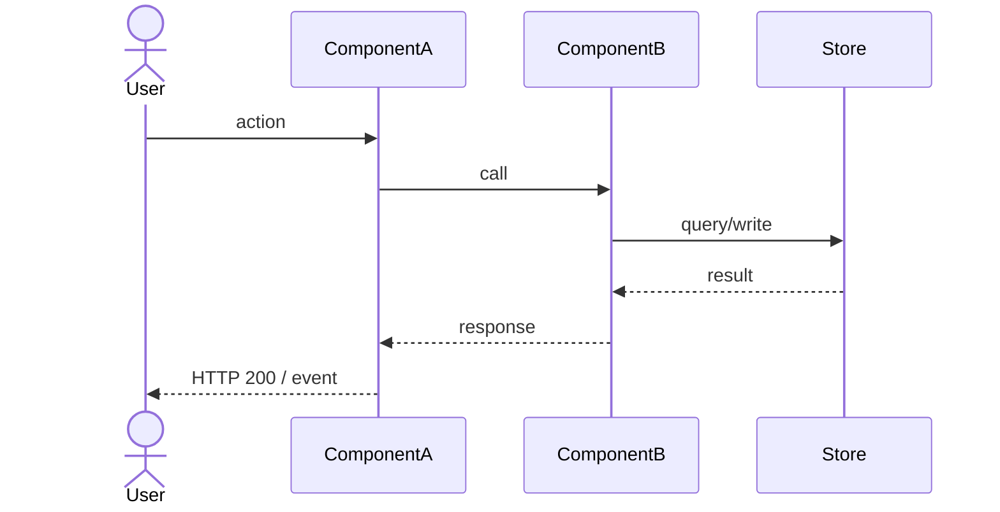
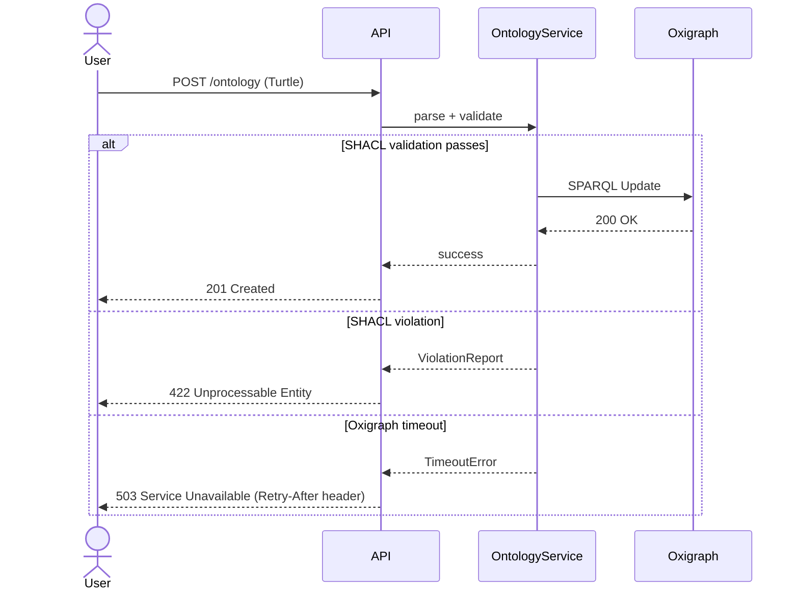
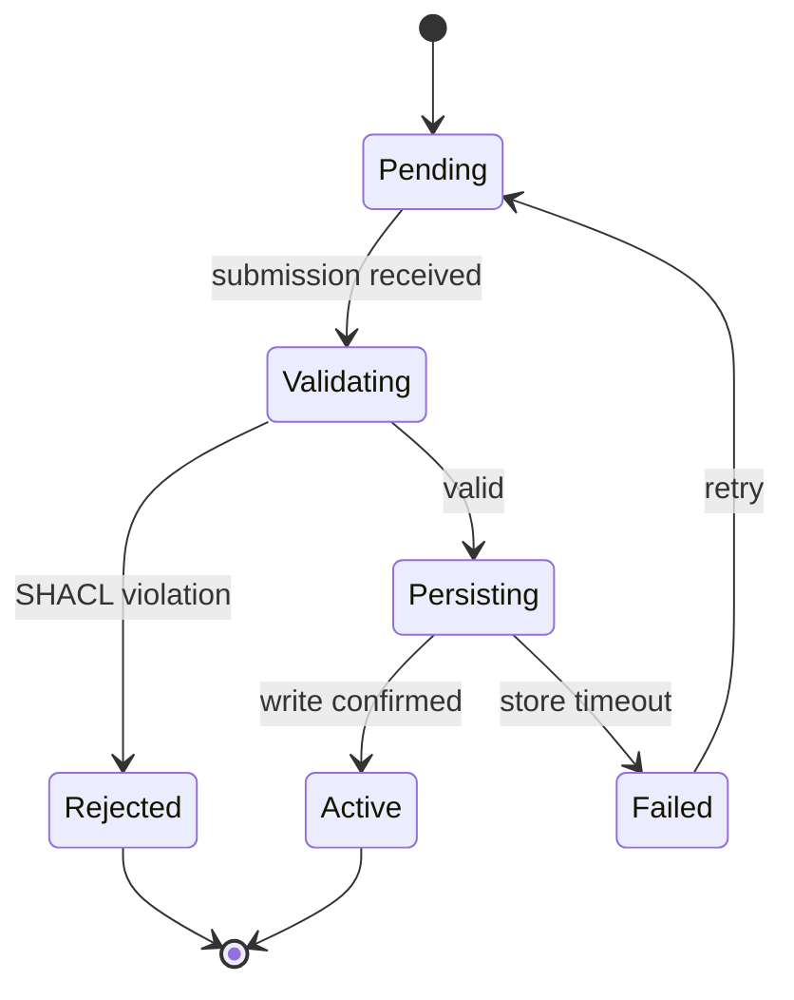

# arch-flows Skill

Produce the `business-process.md` tech-spec shard for a Weave entity — one flow at a time,
with mandatory Mermaid diagrams and HITL review after every flow. Invoked when the architect
needs to document how data and control move through the system.

## Model

- **Flow elicitation:** claude-opus-4-8 (broad reasoning, surfaces edge cases and invisible paths)
- **Diagram drafting:** claude-sonnet-4-6 (structured Mermaid, concise prose)

## Input

Before doing anything else, read:

1. `CLAUDE.md` — Weave product context, confirmed stack, laws
2. `.claude/spec-templates/architecture/flows.md` — output scaffold (never leave `{{}}` in output)
3. Approved PRD: `docs/specs/<entity>/02-prd/prd.md` (scope, user journeys)
4. Approved roadmap: `docs/specs/<entity>/03-roadmap/roadmap.md` (phase being specced)
5. C4 architecture doc if present: `docs/specs/<entity>/04-arch/tech-spec/architecture.md`
   (component names must be consistent across all arch shards)
6. Data model if present: `docs/specs/<entity>/04-arch/tech-spec/data-model.md`
   (entity names used in diagrams must match the ERD)

Ask the user which entity this covers if not supplied. Output path is:
`docs/specs/<entity>/04-arch/tech-spec/business-process.md`

## Instructions

### Step 0 — State the governing principle (never skip)

Write 2-3 sentences naming what makes a flow diagram worth having before writing anything else.

Example: "A flow diagram earns its keep by exposing decisions that prose hides. The happy path
alone is a lie — every flow has at least one error path, one auth boundary, and one timeout.
If a diagram doesn't show where things go wrong, it's decoration, not specification."

Reference this principle when justifying scope decisions during HITL loops.

### Step 1 — Context ingestion

1. Read the inputs listed above (all that exist).
2. Summarise what you know in 3 bullets before asking the first question:
   - Which sub-system / entity this covers
   - Which stack components appear in this entity's flows (from CLAUDE.md confirmed stack)
   - Which flows are already implied by the PRD or C4 container diagram

3. Ask via AskUserQuestion which flows to cover (MANDATORY — never draft diagrams before this):

   > "Which flows should I document? Select all that apply, or describe custom flows."
   > Options (pre-populated for Weave; user may add others):
   > - Ontology ingestion (Turtle/RDF upload → parse → validate SHACL → persist to Oxigraph)
   > - Graph query (SPARQL request → Oxigraph → result set → API response)
   > - Agent trigger (event → Anthropic Agent SDK agent → Bedrock model call → action → graph write-back)
   > - Schema validation (SHACL shape check → violation report → rejection or warning)
   > - User authentication (login → Cognito → JWT → API gateway → service)
   > - Connector sync (external source → managed connector → graph delta → RDF store update)
   > - Custom flow (user describes)

4. For each selected flow, ask via AskUserQuestion:
   > "For [flow name]: does it involve persistent state changes (i.e. should I also draw a
   > state machine)?"
   > Options: Yes — draw state machine / No — sequence diagram only

5. Confirm the full flow list and order with the user before proceeding to Step 2.

### Step 2 — Process overview section

Write the `## Process overview` section: a numbered list of all flows to be documented, each
with a one-sentence description of the trigger, the key components traversed, and the terminal
outcome. This is a map of the document, not the diagrams themselves.

Run the constitutional self-check (see below).
Present the section.
Emit a confidence block.
Ask via AskUserQuestion: Approve / Amend / Reject.

### Step 3 — Per-flow production (repeat for each flow)

For each flow agreed in Step 1, produce the following sub-sections in order.
Run one HITL cycle per flow (not per sub-section), unless the flow is complex enough
to warrant splitting happy path and error cases across two HITL rounds (use judgement;
flows with more than 3 error variants should split).

#### 3a — Happy path sequence diagram



Rules:
- Use `actor` for human actors. Use `participant` for system components.
- Component names MUST match those in `architecture.md` (C4 Level 2/3).
- Show the JWT/Cognito auth step wherever an API boundary is crossed.
- Show Oxigraph as the named RDF store for dev/test. Use `RDF Store` as an alias when
  the prod target (Neptune / Fuseki) is not yet decided.
- Show Anthropic Agent SDK agent and Bedrock model call as separate participants for agent flows.
- Response arrows use `-->>` (dashed). Request arrows use `->>` (solid).
- Add a `Note over ComponentA,ComponentB: annotation` for non-obvious steps.
- Latency SLOs go in notes: `Note right of Store: target < 200 ms`.

#### 3b — Error and edge case diagrams

Cover all four mandatory error variants for every flow:

1. **Auth failure** — token absent, expired, or insufficient scope
2. **Validation failure** — SHACL violation, Pydantic schema error, or malformed input
3. **Downstream timeout** — RDF store, Bedrock, or external connector does not respond
4. **Idempotency / conflict** — duplicate submission, optimistic lock failure, or replay

Each variant may be a separate `sequenceDiagram` block, or combined using `alt` / `opt` /
`loop` Mermaid blocks within the happy-path diagram if the branching is simple.

Prefer separate diagrams when the error path diverges at the first step. Prefer `alt` blocks
when the error diverges only at the final persistence step.

Example `alt` pattern:



#### 3c — State machine diagram (only if user confirmed in Step 1 step 4)

Use `stateDiagram-v2`. Cover all reachable states and terminal states.



Rules:
- Every state must have at least one outgoing transition, except terminal states.
- Label every transition arrow with the trigger event.
- Include a `Failed` / error state for any flow that touches an external system.
- For long-running agent flows, include `Running`, `Waiting`, and `Cancelled` states.

#### 3d — Invisible edges table

List edges the static diagram cannot show: event-bus publishes, DI wirings, feature-flag
branches, runtime-resolved URLs. One row per edge. This is mandatory even if empty (write
"None identified" as a single row with all other columns blank).

| Edge | From | To | Mechanism | Source (SME + date) |
|---|---|---|---|---|
| … | … | … | event name / queue / flag | … |

---

After completing all sub-sections for a flow, run the constitutional self-check.
Present the full flow (all sub-sections together).
Emit a confidence block.
Ask via AskUserQuestion: Approve / Amend / Reject.

If Amend: apply changes to the specific sub-section, re-show the affected diagram, re-present
the confidence block.

If Reject: regenerate the entire flow from scratch with a new approach.

### Step 4 — Entry points table

After all flows are approved, write the `## Entry points (observed)` table from the template.
Populate it from the flows just documented — one row per distinct API endpoint, event, or CLI
command that appeared as the first arrow in any sequence diagram.

| Entry point | Type | Handler (file#symbol) | Notes |
|---|---|---|---|
| … | HTTP / CLI / queue / cron | `path#symbol` | auth, rate-limit, flags |

If the codebase does not yet exist (greenfield), mark the `Handler` column `TBD` and note
the planned FastAPI router path.

Run constitutional self-check, present, confidence block, HITL.

### Step 5 — Commit

```bash
git add docs/specs/<entity>/04-arch/tech-spec/business-process.md
git commit -m "docs(<entity>): add business-process flows shard"
```

Tell the user: "Flows complete. Cross-check component names in `architecture.md` before
proceeding to `/arch-class` or `/arch-openapi`."

---

## Constitutional self-check (run before every section delivery)

Walk both Law layers. Write one line per Law, format exactly:

```
Plugin Law A (common-stack first): complied | violated | N/A — <reason>
Plugin Law B (testable): complied | violated | N/A — <reason>
Plugin Law C (council quality): complied | violated | N/A — <reason>
Plugin Law D (stacked PRs): complied | violated | N/A — <reason>
Plugin Law E (complexity budget): complied | violated | N/A — <reason>
Plugin Law F (no real cloud in tests): complied | violated | N/A — <reason>
Flows Law 1 (diagrams mandatory): complied | violated | N/A — <reason>
Flows Law 2 (flows scoped before drafting): complied | violated | N/A — <reason>
Flows Law 3 (four error variants per flow): complied | violated | N/A — <reason>
Flows Law 4 (component names consistent with C4): complied | violated | N/A — <reason>
Flows Law 5 (one HITL per flow): complied | violated | N/A — <reason>
```

If ANY line says "violated": STOP, revise the section, re-run the check.

Output the trace in chat. Keeps Laws active across long sessions.

**Flows Laws defined:**

- **Law 1** — Every flow MUST have at least one Mermaid diagram. Prose-only flows are a violation.
- **Law 2** — Flow scope MUST be agreed via AskUserQuestion before any diagram is drafted.
  Drafting without scope confirmation is a violation.
- **Law 3** — Every flow MUST cover all four error variants: auth failure, validation failure,
  downstream timeout, idempotency/conflict. Omitting any variant is a violation unless the
  user explicitly waives it.
- **Law 4** — Component names in diagrams MUST match those in `architecture.md` (C4 Level 2/3)
  if that file exists. Drift is a violation.
- **Law 5** — HITL MUST be run once per complete flow, not once per document. Running HITL
  only at the end of all flows is a violation.

---

## Confidence block (emit before every HITL question)

Output this block immediately after presenting the section, before the AskUserQuestion call:

```
<section-confidence>
Confidence: high | medium | low
Weakest part: <name the specific diagram, variant, or table row>
Why: <1 sentence — what input was missing or what you assumed>
</section-confidence>
```

Rules:

- Always name the weakest part, even on high-confidence sections.
- For diagrams, the weakest part is usually the timeout handling or an invisible edge.
- "Why" must reference a specific input gap. "Flows are hard to know without code" is not
  acceptable. "Assumed Cognito JWT is verified at the API Gateway layer, not the service
  layer — no C4 diagram available to confirm" is acceptable.
- The block lives in chat only — do not embed it in the output file.

---

## Output

**File:** `docs/specs/<entity>/04-arch/tech-spec/business-process.md`

**Template:** `.claude/spec-templates/architecture/flows.md`

Create the directory if it does not exist. Never leave `{{PLACEHOLDER}}` in the output.

**Frontmatter:**

```yaml
---
type: Business Process Spec
title: "Business Process Flows: <entity display name>"
description: "<one-line summary of the business process flows for this entity>"
tags: [<entity>, 04-arch]
timestamp: <YYYY-MM-DDThh:mm:ssZ>
status: Draft
created: <YYYY-MM-DD>
entity: <entity>
phase: 04-arch
shard: business-process
flows_covered: <comma-separated list of flow names>
---
```

**Document structure (in order):**

1. Intro paragraph (2-3 sentences: what this document covers and how it relates to the C4
   architecture and data model shards)
2. `## Process overview` — numbered list from Step 2
3. For each flow, a `## Flow: <flow name>` section containing:
   - `### Happy path` — sequenceDiagram
   - `### Error and edge cases` — one or more sequenceDiagram / alt-block diagrams
   - `### State machine` — stateDiagram-v2 (if applicable)
   - `### Invisible edges` — table
4. `## Entry points (observed)` — table from Step 4

---

## Evaluation Criteria

A well-produced `business-process.md`:

- Every flow has at least one `sequenceDiagram` — no prose-only flows
- All four error variants (auth, validation, timeout, idempotency) are covered for every flow,
  or explicitly waived in the HITL transcript with user approval
- Component names in diagrams are consistent with `architecture.md` (C4 Level 2/3), or that
  file does not yet exist (greenfield) and a note to that effect is present
- State machine diagrams present for every flow confirmed as stateful in Step 1
- Invisible edges table present for every flow (may be "None identified")
- Entry points table populated; `Handler` column either filled or marked `TBD` with rationale
- No `{{PLACEHOLDER}}` text anywhere in the output file
- HITL was run per flow (traceable from chat history)
- Mermaid diagrams are syntactically valid (no unclosed blocks, no undefined participants)
- Auth (Cognito JWT) boundary shown wherever a Weave API endpoint is crossed
