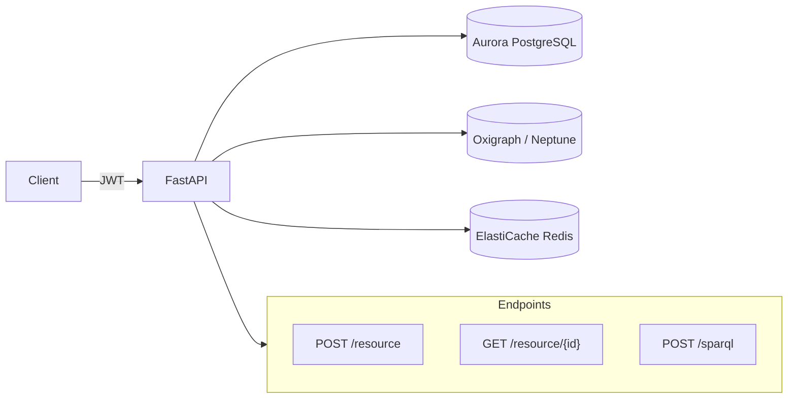

# arch-openapi Skill

Produce a production-ready OpenAPI 3.1.0 specification (`openapi.yaml`) for a Weave spec
entity, targeting a FastAPI + Pydantic v2 implementation. Delivered section-by-section in
HITL batches of 3–5 endpoints; never dumps the full spec at once.

## Model

- **All phases:** claude-sonnet-5 (structured output, schema precision, YAML accuracy)

No elicitation phase for this skill — inputs come from approved upstream specs. If the
upstream tech-spec or PRD is missing, STOP and ask the user to run `/architect` first.

## Input

Before doing anything else, read:

1. `CLAUDE.md` — Weave confirmed stack, Agent Laws A–F
2. `.claude/spec-templates/architecture/openapi.yaml` — section scaffold and metadata
   header (never leave `{{}}` placeholders in output)
3. `.claude/spec-templates/few-shot/api/fastapi-router.md` — FastAPI + Pydantic v2
   patterns (operationId style, response_model conventions, error handling)
4. `docs/specs/weave/engines/<entity>/04-arch/tech-spec/architecture.md` (if present) — resource list, auth
   approach, non-functional requirements
5. `docs/specs/weave/engines/<entity>.md` (if present) — user stories that drive endpoint
   shape
6. Any existing `openapi.yaml` draft at `docs/specs/weave/engines/<entity>/04-arch/tech-spec/openapi.yaml`
   to continue rather than overwrite

Ask the user which entity this spec is for (e.g. `constitution-engine`, `build-engine`,
`weave-platform`) if not supplied. Confirm the base URL and environment (dev / staging /
prod) before writing the `servers` block.

## Instructions

### Step 0 — State the governing principle (never skip)

Write 2–3 sentences naming the principle that governs an OpenAPI spec before writing
anything else.

Example: "An OpenAPI spec is a contract, not documentation. Every endpoint must be
implementable directly from this file without reading source code. Every schema must be
Pydantic-model-ready: snake_case fields, explicit types, no `additionalProperties: true`
unless justified."

Reference this principle when resolving schema ambiguities during the HITL loop.

### Step 1 — Context ingestion

1. Read all files listed in the Input section above.
2. Summarise what you know in 3 bullets before writing the first YAML block:
   - What resources/entities this API exposes (from tech-spec or PRD)
   - What authentication scheme is confirmed (Cognito JWT or Auth0 JWT)
   - What graph/SPARQL endpoints are required (ontology queries, triple writes)

Ask via AskUserQuestion:
- "Which entity is this OpenAPI spec for?"
  Options (supply as free text): e.g. `constitution-engine`, `build-engine`, `weave-platform`

Then ask:
- "What is the base URL for the primary environment?"
  Options: `http://localhost:8000` / `https://api.dev.weave.internal` / Custom

### Step 2 — Enumerate resources

Before writing any YAML, list the planned resource groups as a Markdown table:

| Resource Group | Endpoints (rough) | Notes |
|---|---|---|
| `<resource>` | GET list, GET by ID, POST, PUT, DELETE | e.g. Ontology triples |

Ask via AskUserQuestion:
- "Does this resource list look complete?"
  Options: Looks good / Add a resource / Remove a resource / Reorder

Amend until approved. This table is chat-only — it does not go in the YAML file.

### Step 3 — Section-by-section YAML production

Produce the spec in this exact order. For each section or endpoint batch:

1. **Write** the YAML block to the file
2. **Run the constitutional self-check** (see below) — stop and revise if any Law violated
3. **Present** the written YAML to the user in a fenced `yaml` code block
4. **Emit a confidence block** (see below) immediately before the HITL question
5. **Ask** via AskUserQuestion: Approve / Amend / Reject
6. If Amend: apply changes, show a diff, re-present with updated confidence block
7. If Reject: regenerate cleanly, show the new version

#### Phase A — File header

Write the metadata comment block and `openapi`, `info`, and `servers` sections.

```yaml
# ---
# source: sme-authored-stub
# confirmed_by: "<name>"
# confirmed_on: <YYYY-MM-DD>
# last_verified_sha: <HEAD_SHA>
# expires_on: <YYYY-MM-DD + 90 days>
# owner: <team or squad>
# coverage: 0%
# _AUTO: false
# ---

openapi: 3.1.0
info:
  title: <Entity Display Name> API
  version: 0.1.0
  description: |
    <One-paragraph description of what this API does and who it serves.>
    Implementation target: FastAPI 0.115+ / Pydantic v2 / Python 3.12.

servers:
  - url: <base_url>
    description: <environment label>
```

Rules:
- `version` starts at `0.1.0` for pre-GA specs; bump to `1.0.0` at first prod deployment.
- `description` must identify the FastAPI/Pydantic v2 implementation target.
- Include `x-weave-entity: <entity>` as a top-level extension field.

#### Phase B — Security schemes

Write the `components/securitySchemes` block and the top-level `security` declaration.

```yaml
components:
  securitySchemes:
    CognitoJWT:
      type: http
      scheme: bearer
      bearerFormat: JWT
      description: |
        AWS Cognito-issued JWT. Validate using the JWKS endpoint:
        https://cognito-idp.<region>.amazonaws.com/<userPoolId>/.well-known/jwks.json
        Verify: iss, aud (client_id), exp. Do NOT accept unsigned tokens.
    Auth0JWT:
      type: http
      scheme: bearer
      bearerFormat: JWT
      description: |
        Auth0-issued JWT (multi-IdP path). Validate using:
        https://<tenant>.auth0.com/.well-known/jwks.json
        Verify: iss, aud, exp. Do NOT accept unsigned tokens.

security:
  - CognitoJWT: []
```

Rules:
- Include both `CognitoJWT` and `Auth0JWT` schemes (multi-IdP is a confirmed requirement).
- Default top-level security to `CognitoJWT`; individual endpoints may override.
- Endpoints that are intentionally public must declare `security: []` explicitly.

#### Phase C — Endpoint batches (3–5 endpoints per HITL round)

Produce endpoints in resource-group order, 3–5 per HITL batch. Never dump all endpoints
at once.

For every endpoint, write an EARS acceptance criterion **before** the YAML block. This
is the behavioural contract that the QA skill and task-brief skill will reference.

Format:

```
EARS — <operationId>:
WHEN <actor> calls <METHOD> <path> with a <valid | invalid> payload
THE SYSTEM SHALL <expected behaviour> within <latency budget, e.g. 500ms>.
```

Examples:

```
EARS — createOntologyTriple:
WHEN an authenticated user POSTs a valid RDF triple to /ontology/triples
THE SYSTEM SHALL persist it to the RDF store and return HTTP 201 within 500ms.

EARS — executeSparqlQuery:
WHEN an authenticated user POSTs a valid SPARQL SELECT query to /sparql
THE SYSTEM SHALL return a W3C-compliant SPARQL Results JSON body with HTTP 200 within 2s.

EARS — createOntologyTriple (invalid):
WHEN a user POSTs a triple missing the required predicate field
THE SYSTEM SHALL return HTTP 422 with a ProblemDetails body within 200ms.
```

EARS statements live in chat only — do not embed them in the YAML file. They are inputs
to the downstream `/arch-task-brief` and `/qa` skills.

For every endpoint include **all** of:
- `operationId` — camelCase, format: `<verb><Resource>` (e.g. `listOntologyTriples`,
  `createOntologyTriple`, `deleteOntologyTriple`)
- `summary` — one imperative sentence (e.g. "List ontology triples for a named graph")
- `tags` — matches the resource group name
- `parameters` — path params, query params, all with `schema` and `description`
- `requestBody` — for POST/PUT/PATCH, with `required: true` and `application/json` content
- `responses`:
  - `200` or `201`: full schema ref
  - `400`: Problem Details (RFC 7807) — use `$ref: '#/components/schemas/ProblemDetails'`
  - `401`: authentication failure
  - `403`: authorisation failure (if applicable)
  - `404`: not found (if applicable)
  - `422`: validation error (FastAPI unprocessable entity)
  - `500`: internal server error

**SPARQL endpoint pattern** (mandatory for graph/ontology APIs):

```yaml
  /sparql:
    post:
      operationId: executeSparqlQuery
      summary: Execute a SPARQL 1.1 SELECT or CONSTRUCT query
      tags:
        - graph
      security:
        - CognitoJWT: []
      requestBody:
        required: true
        content:
          application/sparql-query:
            schema:
              type: string
              example: "SELECT ?s ?p ?o WHERE { ?s ?p ?o } LIMIT 10"
      responses:
        '200':
          description: SPARQL results in JSON binding format (W3C SPARQL 1.1 Results)
          content:
            application/sparql-results+json:
              schema:
                $ref: '#/components/schemas/SparqlResultSet'
        '400':
          $ref: '#/components/responses/BadRequest'
        '401':
          $ref: '#/components/responses/Unauthorized'
        '500':
          $ref: '#/components/responses/InternalServerError'
```

Include the SPARQL endpoint whenever the entity involves ontology queries, graph
traversal, or RDF triple reads. Default to `POST /sparql` with
`application/sparql-query` body. Do NOT use query parameters for SPARQL strings.

#### Phase D — Request/response schemas

Write all `components/schemas` referenced by the endpoints. Produce in batches matching
the endpoint batches above. One HITL per batch.

Rules for Pydantic v2 compatibility:
- All field names **snake_case** — never camelCase in schema property names.
- Add `x-python-type` extension on fields that map to non-trivial Python types
  (e.g. `UUID`, `datetime`, `HttpUrl`, custom enums).
- Use `format: uuid` for UUID fields, `format: date-time` for datetime fields.
- Never use `additionalProperties: true` unless the endpoint genuinely accepts
  arbitrary key-value maps (document why if used).
- Enums: define as `enum` array on a `string` type; add a `description` naming the
  Python `StrEnum` class.
- Read schemas (response): include all computed / database-set fields (e.g. `id`,
  `created_at`).
- Write schemas (request body): omit server-set fields; mark all truly optional fields
  with `required: false` or exclude from the `required` array.

Mandatory global schemas (always include):

```yaml
  ProblemDetails:
    type: object
    description: RFC 7807 Problem Details for HTTP APIs
    required:
      - type
      - title
      - status
    properties:
      type:
        type: string
        format: uri
        example: "https://weave.internal/errors/validation-error"
      title:
        type: string
        example: "Validation Error"
      status:
        type: integer
        example: 422
      detail:
        type: string
        example: "Field 'label' must not be empty"
      instance:
        type: string
        format: uri
        example: "/ontology/triples/abc123"

  SparqlResultSet:
    type: object
    description: W3C SPARQL 1.1 Query Results JSON Format
    required:
      - head
      - results
    properties:
      head:
        type: object
        properties:
          vars:
            type: array
            items:
              type: string
      results:
        type: object
        properties:
          bindings:
            type: array
            items:
              type: object
              additionalProperties:
                type: object
                properties:
                  type:
                    type: string
                    enum: [uri, literal, bnode]
                  value:
                    type: string
```

#### Phase E — Shared response components

Write the `components/responses` block for reusable error responses.

```yaml
components:
  responses:
    BadRequest:
      description: Invalid request payload or parameters
      content:
        application/problem+json:
          schema:
            $ref: '#/components/schemas/ProblemDetails'
    Unauthorized:
      description: Missing or invalid bearer token
      content:
        application/problem+json:
          schema:
            $ref: '#/components/schemas/ProblemDetails'
    Forbidden:
      description: Token valid but insufficient permissions
      content:
        application/problem+json:
          schema:
            $ref: '#/components/schemas/ProblemDetails'
    NotFound:
      description: Resource not found
      content:
        application/problem+json:
          schema:
            $ref: '#/components/schemas/ProblemDetails'
    UnprocessableEntity:
      description: FastAPI/Pydantic validation error (HTTP 422)
      content:
        application/problem+json:
          schema:
            $ref: '#/components/schemas/ProblemDetails'
    InternalServerError:
      description: Unexpected server-side error
      content:
        application/problem+json:
          schema:
            $ref: '#/components/schemas/ProblemDetails'
```

Rules:
- All error responses use `application/problem+json` content type (RFC 7807).
- Reference these via `$ref: '#/components/responses/<Name>'` in every endpoint.
- Do NOT inline error schemas — always use `$ref`.

### After all sections approved

#### Coverage check

Count: total endpoints defined ÷ total endpoints listed in the Step 2 resource table.
Write `coverage: <pct>%` into the metadata comment header.

Update `_AUTO: false` if manually authored (which it always is for new specs).

#### Validate YAML structure

Run a structural check:
```bash
python3 -c "import yaml, sys; yaml.safe_load(open('docs/specs/weave/engines/<entity>/04-arch/tech-spec/openapi.yaml'))" \
  && echo "YAML valid" || echo "YAML INVALID — fix before commit"
```

If invalid: identify the error, fix it, re-present only the corrected section to the user.

#### Architecture diagram

Produce a Mermaid flowchart in chat (not in the YAML file) showing the API surface:



Adapt the diagram to the actual resources in this spec. Present to the user with:

```
<section-confidence>
Confidence: high | medium | low
Weakest part: <specific node or edge>
Why: <1 sentence — what was assumed>
</section-confidence>
```

Then ask via AskUserQuestion: Approve diagram / Amend / Skip (diagram not needed)

#### Commit

```bash
git add docs/specs/weave/engines/<entity>/04-arch/tech-spec/openapi.yaml
git commit -m "docs(<entity>): add OpenAPI 3.1 spec — <N> endpoints across <M> resource groups"
```

#### Update progress state

```bash
.claude/scripts/progress.sh update openapi-<entity> done
```

If no matching task exists yet in `.claude/state/progress.json`, add it first:

```bash
.claude/scripts/progress.sh add-task openapi-<entity> arch-<entity> "OpenAPI 3.1 spec — <entity>"
.claude/scripts/progress.sh update openapi-<entity> done
```

Then tell the user: "OpenAPI spec complete. Next step: `/architect` for task breakdown, or
run `/qa` to validate the spec against the PRD acceptance criteria."

## Constitutional self-check (run before every section delivery)

Walk both Law layers. Write one line per Law, format exactly:

```
Plugin Law A (common-stack first): complied | violated | N/A — <reason>
Plugin Law B (testable): complied | violated | N/A — <reason>
Plugin Law C (council quality): complied | violated | N/A — <reason>
Plugin Law D (stacked PRs): complied | violated | N/A — <reason>
Plugin Law E (complexity budget): complied | violated | N/A — <reason>
Plugin Law F (no real cloud in tests): complied | violated | N/A — <reason>
OpenAPI Law 1 (every endpoint has operationId): complied | violated | N/A — <reason>
OpenAPI Law 2 (all errors use RFC 7807 ProblemDetails): complied | violated | N/A — <reason>
OpenAPI Law 3 (schemas Pydantic v2 compatible — snake_case, no additionalProperties:true without justification): complied | violated | N/A — <reason>
OpenAPI Law 4 (HITL after every 3–5 endpoints — never full dump): complied | violated | N/A — <reason>
OpenAPI Law 5 (SPARQL endpoint present for ontology/graph APIs): complied | violated | N/A — <reason>
OpenAPI Law 6 (security schemes cover both Cognito and Auth0): complied | violated | N/A — <reason>
OpenAPI Law 7 (each endpoint batch has EARS acceptance criteria in chat): complied | violated | N/A — <reason>
```

If ANY line says "violated": STOP, revise the section, re-run the check.
Output the trace in chat. Keeps Laws active across long sessions.

## Confidence block (emit before every HITL question)

Output this block immediately after presenting the section, before the AskUserQuestion:

```
<section-confidence>
Confidence: high | medium | low
Weakest part: <name the specific endpoint, field, or schema>
Why: <1 sentence — what input was missing or what you assumed>
</section-confidence>
```

Rules:
- Always name the weakest part, even on high-confidence sections.
- "Why" must reference a specific input gap (e.g. "assumed GET /triples uses cursor
  pagination because the PRD did not specify offset vs cursor").
- The block lives in chat only — do not embed it in the YAML file.

## Output

File: `docs/specs/weave/engines/<entity>/04-arch/tech-spec/openapi.yaml`
Template: `.claude/spec-templates/architecture/openapi.yaml`

Create the directory if it doesn't exist:
```bash
mkdir -p "docs/specs/weave/engines/<entity>/04-arch/tech-spec"
```

Never leave `{{PLACEHOLDER}}` in the output. All metadata fields in the comment header
must be populated before the final commit.

YAML file metadata header (comment block at top of file):

```yaml
# ---
# source: sme-authored-stub
# confirmed_by: "<author name>"
# confirmed_on: <YYYY-MM-DD>
# last_verified_sha: <git rev-parse HEAD>
# expires_on: <confirmed_on + 90 days>
# owner: <entity team>
# coverage: <pct>%
# _AUTO: false
# ---
```

## Evaluation Criteria

A well-produced `openapi.yaml`:

- Has a complete, valid `info` block (version, FastAPI/Pydantic v2 description,
  `x-weave-entity` extension) and passes `yaml.safe_load` without error before commit
- Has both `CognitoJWT` and `Auth0JWT` security schemes; top-level security defaults to
  `CognitoJWT`; public endpoints declare `security: []` explicitly
- Every endpoint has `operationId`, `summary`, `tags`, and all applicable response codes
  (200/201, 400, 401, 404, 422, 500)
- All error responses use `application/problem+json` content type with `$ref` to
  `ProblemDetails` (RFC 7807) — no inline error schemas anywhere
- All schemas are Pydantic v2 compatible: snake_case field names, no unexplained
  `additionalProperties: true`, explicit `format` on UUID and datetime fields
- Ontology/graph APIs include `POST /sparql` with `application/sparql-query` body and
  `SparqlResultSet` response schema
- Every endpoint batch has EARS acceptance criteria in chat (behaviour + status code +
  latency budget); EARS statements are inputs to downstream `/arch-task-brief` and `/qa`
- Was delivered in HITL batches of 3–5 endpoints (never full dump); constitutional
  self-check trace and confidence block present in chat for every section
