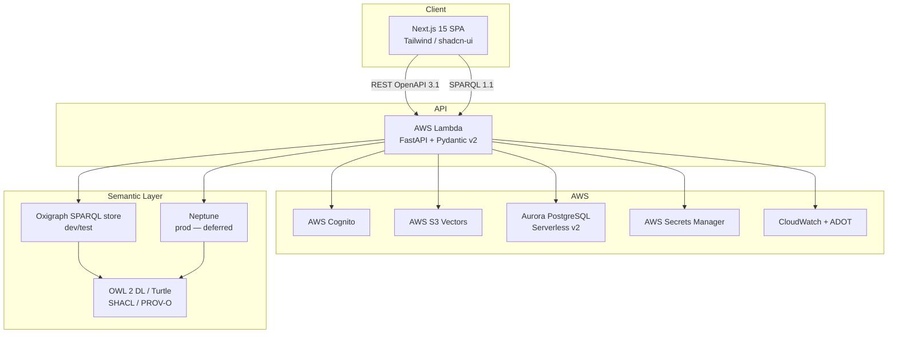

# Arch-Stack Skill

Confirm and document the technology stack for a Weave spec entity before any other
architectural artefact is produced. This skill is invoked FIRST by the architect agent —
it locks the stack so that all subsequent arch-* skills write to a settled foundation.

## Model

- **Detection / validation phase:** claude-sonnet-5 (validation runs on the sonnet tier — haiku dropped 2026-07-02)
- **Override / ADR phase:** claude-sonnet-5 (structured justification, ADR prose)
- **HITL questions:** AskUserQuestion (always — no silent defaulting)

## Input

Before doing anything else, read:

1. `CLAUDE.md` — canonical confirmed stack; § "Stack (confirmed)" and § "Architecture
   decisions (confirmed)"
2. `docs/specs/weave/engines/<entity>.md` — entity scope, constraints, known decisions
3. `docs/specs/weave/engines/<entity>.md` — if present; look for technology constraints or
   explicit non-functional requirements (NFRs) that affect stack choice
4. `docs/specs/weave/engines/<entity>/tech-spec/` — if an in-progress draft exists, read any
   existing files for stack context (skip the rest)
5. Any ADRs already in `docs/specs/weave/engines/<entity>/decisions/` — to detect prior overrides

Ask the user which entity this stack confirmation is for if not supplied. Output paths are:

- Stack confirmation block: `docs/specs/weave/engines/<entity>/tech-spec/stack.md`
- ADR stub (only when a CLAUDE.md default is overridden):
  `docs/specs/weave/engines/<entity>/decisions/ADR-<NNN>-stack-override-<dimension>.md`

## Instructions

### Step 0 — State the governing principle (never skip)

Write 2-3 sentences naming the principle before reading anything:

> "A confirmed stack is a constraint that rules out a class of future debates. Every
> dimension confirmed here closes a negotiation; every dimension left open is a risk
> that will resurface at integration. The job of this skill is to confirm what is already
> decided and surface only what is genuinely open — not to re-litigate settled choices."

Reference this principle when justifying decisions during the HITL loop.

### Step 1 — Context ingestion

1. Read all files listed in Input above.
2. Extract and list the confirmed Weave-wide stack dimensions from `CLAUDE.md`:

   | Layer | Confirmed choice | Source |
   |-------|-----------------|--------|
   | Backend runtime | Python 3.12+ / FastAPI / Pydantic v2 / uv | CLAUDE.md |
   | Frontend | TypeScript strict / Next.js 15 App Router / Tailwind CSS / shadcn/ui | CLAUDE.md |
   | API surface | REST (OpenAPI 3.1) + SPARQL 1.1 | CLAUDE.md |
   | Auth | AWS Cognito (default) or Auth0 | CLAUDE.md |
   | Agent SDK | Anthropic Agent SDK (Python primary, TypeScript secondary) | CLAUDE.md |
   | Agent runtime | AWS Bedrock AgentCore (GA components only) | CLAUDE.md |
   | Models | claude-fable-5 / claude-sonnet-5 | CLAUDE.md |
   | Guardrails | AWS Bedrock Guardrails | CLAUDE.md |
   | RDF store | Oxigraph (dev/test) → Neptune or Jena Fuseki (prod, deferred) | CLAUDE.md |
   | Vector store | AWS S3 Vectors | CLAUDE.md |
   | Relational | AWS Aurora PostgreSQL Serverless v2 + SQLAlchemy async | CLAUDE.md |
   | Cache | AWS ElastiCache (Redis 7) | CLAUDE.md |
   | IaC | Terraform | CLAUDE.md |
   | Compute | AWS Lambda + ECS Fargate | CLAUDE.md |
   | SPA hosting | CloudFront + S3 | CLAUDE.md |
   | Secrets | AWS Secrets Manager | CLAUDE.md |
   | CI/CD | GitHub Actions (OIDC to AWS) | CLAUDE.md |
   | Observability | CloudWatch + OpenTelemetry (ADOT Collector) | CLAUDE.md |
   | Semantic web | OWL 2 DL / Turtle / SHACL / PROV-O / SKOS / SPARQL 1.1 | CLAUDE.md |
   | Testing | TDD-first; unit → integration → E2E; Playwright for browser | CLAUDE.md |
   | Python tooling | uv only | CLAUDE.md |

3. For the specific entity, identify which of these dimensions are **directly relevant**
   (i.e. the entity's scope requires that layer to be deployed or configured).

4. Identify any dimensions that are **genuinely undecided** for this entity:
   - The prod RDF store choice (Neptune vs Jena Fuseki) is deferred — flag if entity is the
     Constitution Engine or uses the graph layer
   - Auth provider (Cognito vs Auth0) — flag if entity has its own auth surface
   - Any entity-specific infrastructure not covered by CLAUDE.md

5. Summarise in 3 bullets:
   - What this entity is (from Brief/PRD)
   - Which confirmed stack dimensions apply to it
   - What is genuinely not yet decided for this entity

### Step 2 — Section-by-section production

Produce the stack confirmation in this exact order. For each section:

1. **Write** the section to the file
2. **Run the constitutional self-check** (see below) — stop and revise if any law violated
3. **Present** the section to the user (display the written content)
4. **Emit a confidence block** (see below) immediately before the HITL question
5. **Ask** via AskUserQuestion: Approve / Amend / Reject
6. If Amend: apply changes, show diff, re-present with updated confidence block
7. If Reject: regenerate with a cleaner approach, show the new version

**Sections in order:**

#### Section A — Confirmed Stack Dimensions

A table of every stack dimension that applies to this entity, with its confirmed choice
and the source of that confirmation. Do NOT ask the user about these — they are locked.

Format:

```
## Confirmed Stack Dimensions

| Layer | Choice | Source | Notes |
|-------|--------|--------|-------|
| Backend runtime | Python 3.12+ / FastAPI / Pydantic v2 / uv | CLAUDE.md | — |
| ... | ... | ... | ... |
```

Rules:
- Include only dimensions relevant to the entity's scope (omit layers the entity does not use)
- The `Source` column must be `CLAUDE.md`, an ADR number, or `PRD §<section>`
- The `Notes` column captures entity-specific constraints or variants — keep to 1 line
- Never mark a CLAUDE.md-confirmed dimension as "TBD" or "to be decided"

#### Section B — Open Dimensions

A table of dimensions genuinely not yet decided for this entity. If there are none, write
a single sentence: "All stack dimensions for this entity are confirmed; no open choices remain."

Format:

```
## Open Dimensions

| Dimension | Options | Decision needed before | Impact if deferred |
|-----------|---------|----------------------|-------------------|
| Prod RDF store | Neptune / Jena Fuseki | Constitution Engine prod deployment | Query performance, cost model, ops complexity |
| ... | ... | ... | ... |
```

Ask via AskUserQuestion about each open dimension, **one at a time**. Present the options
from CLAUDE.md or the entity's PRD. Do NOT invent options not mentioned in those sources.

For each open dimension:
- If the user selects an option: record it in the Confirmed Stack table, mark source as
  "User decision [YYYY-MM-DD]", and continue
- If the user defers: mark the dimension as deferred with a deadline note; do NOT block
  progress on this skill

#### Section C — Stack Diagram

A Mermaid architecture diagram showing how the confirmed stack dimensions connect for this
entity. This is mandatory — a text-only stack summary is insufficient.

Diagram requirements:
- Use `graph TD` or `graph LR` (not C4 — that is arch-c4's domain)
- Show the tiers relevant to the entity: client → API → backend services → data stores
- Label each node with the specific technology (e.g. "Next.js 15" not "Frontend")
- Show AWS services in a subgraph labelled `AWS`
- Show RDF/semantic-web stack in a subgraph labelled `Semantic Layer` if applicable
- Keep the diagram to the entity's scope — do not include the full platform graph

Example for Constitution Engine:



#### Section D — Override Requests (conditional — only if user requested an override)

If the user has requested to deviate from a confirmed CLAUDE.md choice during this session,
this section records each override and produces an ADR stub.

For each override:
1. Ask via AskUserQuestion: "Confirm you are overriding `<dimension>` from `<default>` to
   `<proposed>`. Provide justification (required)." Options: Confirm with justification /
   Cancel override
2. If confirmed: write the ADR stub (see ADR Stub format below) and add the override to
   the Confirmed Stack table with source `ADR-<NNN>`
3. If cancelled: revert to the CLAUDE.md default

**ADR Stub format:**

File: `docs/specs/weave/engines/<entity>/decisions/ADR-<NNN>-stack-override-<dimension>.md`

```markdown
---
id: ADR-<NNN>
title: "Stack override: <dimension>"
status: Proposed
date: <YYYY-MM-DD>
entity: <entity>
overrides: CLAUDE.md default "<old value>"
---

# ADR-<NNN>: Stack Override — <dimension>

## Status

Proposed — requires tech-architect approval before implementation begins.

## Context

<Entity> requires <dimension> to be <proposed value> rather than the Weave platform
default (<old value>). The user-supplied justification is:

> <paste justification verbatim>

## Decision

Use <proposed value> for <dimension> in the <entity> entity.

## Consequences

- **Positive:** <list from user justification>
- **Negative / risk:** Diverges from platform default. This entity will need its own
  <dimension>-specific runbooks, CI configuration, and on-call procedures.
  Future platform-wide upgrades to <old value> will not automatically benefit this entity.

## Alternatives Considered

| Option | Rejected because |
|--------|-----------------|
| CLAUDE.md default: <old value> | User justification: <summary> |
| <other options considered> | <reason> |
```

### Step 3 — Finalise and write stack confirmation file

After all sections are approved, write the complete `stack.md` file to
`docs/specs/weave/engines/<entity>/tech-spec/stack.md`.

Frontmatter:

```yaml
---
type: Stack Confirmation
title: "Stack Confirmation: <entity display name>"
description: "<one-line summary of the confirmed technology stack for this entity>"
tags: [<entity>, arch]
timestamp: <YYYY-MM-DDThh:mm:ssZ>
status: Confirmed
created: <YYYY-MM-DD>
entity: <entity>
confirmed-by: arch-stack skill
open-dimensions: <count of deferred items, or 0>
---
```

The file body is the approved Section A + B + C content (and Section D if overrides exist).

### Step 4 — Commit

```bash
git add docs/specs/weave/engines/<entity>/tech-spec/stack.md
git add docs/specs/weave/engines/<entity>/decisions/  # if any ADR stubs written
git commit -m "docs(<entity>): stack confirmation"
```

Tell the user: "Stack confirmed. Next step: run `arch-c4` to produce the C4 diagrams,
or run `/architect` to continue the full tech-spec sequence."

## Constitutional self-check (run before every section delivery)

Walk both Law layers. Write one line per Law, format exactly:

```
Plugin Law A (common-stack first): complied | violated | N/A — <reason>
Plugin Law B (testable): complied | violated | N/A — <reason>
Plugin Law C (council quality): complied | violated | N/A — <reason>
Plugin Law D (stacked PRs): complied | violated | N/A — <reason>
Plugin Law E (complexity budget): complied | violated | N/A — <reason>
Plugin Law F (no real cloud in tests): complied | violated | N/A — <reason>
Arch-Stack Law 1 (never re-ask confirmed): complied | violated | N/A — <reason>
Arch-Stack Law 2 (open dimensions only via AskUserQuestion): complied | violated | N/A — <reason>
Arch-Stack Law 3 (override requires justification + ADR): complied | violated | N/A — <reason>
Arch-Stack Law 4 (diagram mandatory): complied | violated | N/A — <reason>
Arch-Stack Law 5 (entity scope only): complied | violated | N/A — <reason>
```

If ANY line says "violated": STOP, revise the section, re-run the check.
Output the trace in chat (user sees it). Keeps Laws active across long sessions.

**Arch-Stack Laws (skill-specific):**

- **Law 1 — Never re-ask confirmed choices.** If a dimension is confirmed in CLAUDE.md,
  it is confirmed. Do not surface it as a question. Do not present it as a default
  needing acceptance. It is done.
- **Law 2 — Open dimensions only via AskUserQuestion.** Any question about a stack
  dimension must go through AskUserQuestion. No inline text like "I'll assume X" — that
  is a silent default, which is prohibited.
- **Law 3 — Override requires justification + ADR stub.** A user may override any CLAUDE.md
  default, but they must supply explicit justification and an ADR stub must be written.
  Undocumented overrides are a violation.
- **Law 4 — Diagram is mandatory.** Section C must contain a Mermaid diagram. Skipping it
  because "the stack is standard" is not a valid reason — the diagram is how the next arch-*
  skill knows the scope boundaries.
- **Law 5 — Entity scope only.** The diagram and confirmed-dimensions table cover this
  entity's scope. Do not include platform-wide infrastructure this entity does not deploy
  or consume.

## Confidence block (emit before every HITL question)

Output this block immediately after presenting the section and before the AskUserQuestion call:

```
<section-confidence>
Confidence: high | medium | low
Weakest part: <name the specific row, decision, or diagram node>
Why: <1 sentence — what input was missing or what you assumed>
</section-confidence>
```

Rules:
- Always name the weakest part, even on high-confidence sections.
- "Why" must reference a specific input gap, not a generic disclaimer.
- The block lives in chat only — do not embed it in `stack.md`.

Example (arch-stack delivering Section B for Constitution Engine):

```
<section-confidence>
Confidence: medium
Weakest part: "Prod RDF store" row — Neptune vs Jena Fuseki
Why: CLAUDE.md explicitly defers this decision; no further constraint found in the
Brief or PRD to break the tie; user input is required.
</section-confidence>
```

## Output

### Primary file

**Path:** `docs/specs/weave/engines/<entity>/tech-spec/stack.md`

**Template:** none (this skill owns its own output structure — no `.claude/spec-templates/`
file exists for stack confirmation; the structure is defined in Step 3 above)

**Frontmatter:**

```yaml
---
type: Stack Confirmation
title: "Stack Confirmation: <entity display name>"
description: "<one-line summary of the confirmed technology stack for this entity>"
tags: [<entity>, arch]
timestamp: <YYYY-MM-DDThh:mm:ssZ>
status: Confirmed
created: <YYYY-MM-DD>
entity: <entity>
confirmed-by: arch-stack skill
open-dimensions: <integer — count of deferred dimensions>
---
```

### Secondary files (conditional)

**Path:** `docs/specs/weave/engines/<entity>/decisions/ADR-<NNN>-stack-override-<dimension>.md`

Written only when the user explicitly overrides a CLAUDE.md-confirmed dimension. The `NNN`
sequence continues from the highest existing ADR number in that entity's decisions directory.

### Downstream consumers

The following arch-* skills read `stack.md` as their first input:

- `arch-c4` — uses confirmed compute/API/data tiers to populate C4 container diagram
- `arch-data-model` — uses confirmed relational/RDF/vector stores
- `arch-openapi` — uses confirmed API surface (REST + SPARQL endpoints)
- `arch-infra` — uses confirmed AWS services and IaC choice
- `arch-cicd` — uses confirmed CI/CD platform and compute targets
- `arch-testing` — uses confirmed test frameworks and mutation targets

Never write `stack.md` with placeholder values. If a dimension is genuinely undecided,
mark it in the `open-dimensions` frontmatter field and include it in Section B, not
Section A.

## Evaluation Criteria

A well-produced stack confirmation:

- Contains no questions about CLAUDE.md-confirmed choices — every confirmed dimension is
  stated as fact, not surfaced as a decision
- Has a Section B that is either genuinely empty ("all dimensions confirmed") or lists only
  dimensions that cannot be resolved from CLAUDE.md or existing specs
- Has a Mermaid diagram scoped to the entity (not the full platform) with named technologies
- Has frontmatter `open-dimensions` count that matches the actual count of deferred rows in
  Section B
- Has an ADR stub for every CLAUDE.md override requested during the session
- Has no `{{PLACEHOLDER}}` text anywhere in output files
- Was delivered section-by-section with HITL at every section and constitutional
  self-check traces present in chat for every section
- Produces a `stack.md` that the next arch-* skill can read without AskUserQuestion — all
  required dimensions for that skill are resolved or explicitly deferred
