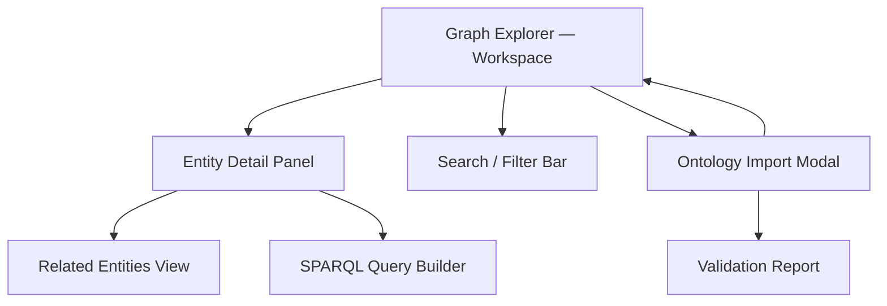

> **Consolidated-spec output (post-merge layout).** Every PO artifact for an entity lives as a
> **section inside one file**: `docs/specs/weave/engines/<entity>.md`. This skill writes/updates
> **only its own sections** and MUST NOT overwrite others — `## Brief` (Part 1), `## Product
> Requirements (PRD)` (Part 2), `## Epics` with one `### EPIC-NNN` subsection per epic (po-epic,
> separate skill), `## Roadmap` (Part 3). If the file does not yet exist, create it with merged
> frontmatter (per `.claude/spec-templates/frontmatter-schema.md`) and a `# <Engine>` heading, then
> add your section. Determine the next `EPIC-NNN` by scanning existing `### EPIC-` headings **within
> this file** (max + 1) — there is no per-epic file or `epics/` directory any more. Architect
> artifacts (tech spec, tasks, ADRs) remain **files** under
> `docs/specs/weave/engines/<entity>/{tech-spec,decisions}/` and `<entity>/<milestone>/tasks/` — tasks are grouped by roadmap milestone (m1, m2, v1, post-v1); tech-spec/ and decisions/ are engine-level living artifacts; the active milestone today is m1.

# PO Strategy Skill

Produces three sequential PO artifacts for a Weave spec entity — Brief, then PRD, then Roadmap —
each written as a section in `docs/specs/weave/engines/<entity>.md`, one sub-section at a time
with HITL review at every step. **Each part is gated on the previous part's full approval: do not
start Part 2 until every Part 1 section is HITL-approved; do not start Part 3 until every Part 2
section is HITL-approved.** Fable drafts elicitation-heavy content (wide reasoning, novel framing,
root-cause probing); Sonnet drafts structured, precise prose from settled inputs — see each part's
own Model section for the exact split.

---

## Part 1: Brief

Produce a high-quality project brief — the `## Brief` section of
`docs/specs/weave/engines/<entity>.md`. One section at a time, with HITL review at every section.
First PO artifact — no predecessor gate.

### Model

- **Elicitation phase:** claude-fable-5 (wide reasoning, novel framing, root-cause probing)
- **Drafting phase:** claude-sonnet-5

### Input

Before doing anything else, read:

1. `CLAUDE.md` — Weave product context, confirmed stack, laws
2. `.claude/spec-templates/brief.md` — section structure (use as scaffold, never leave `{{}}` in output)
3. Any prior elicitation output (`docs/specs/weave/engines/<entity>.md00-elicit/*.md` if present)
4. `docs/specs/weave/engines/<entity>.md` if it already exists (avoid re-asking answered questions)

Ask the user which entity this brief is for (e.g. `constitution-engine`, `build-engine`,
`weave-platform`) if not supplied. Output path is:
`docs/specs/weave/engines/<entity>.md`

### Instructions

#### Step 0 — State the governing principle (never skip)

Write 2-3 sentences naming the principle that governs a brief before writing anything else.

Example: "A brief's job is to commit to a single falsifiable outcome. If a stakeholder reads it
and still has to guess what 'done' means, the brief has failed. Every section should add a
constraint that rules something out."

Reference this principle when justifying decisions during the HITL loop.

#### Step 1 — Context ingestion

1. Read the existing specs (listed in Input above)
2. Read `CLAUDE.md` for Weave product positioning and laws
3. Summarise what you know in 3 bullets before asking the first question:
   - What entity this is (from Weave's sub-system list)
   - What is already decided (from CLAUDE.md § Architecture decisions)
   - What is not yet decided (scope, success criteria, constraints)

Ask via AskUserQuestion:
- "What context do you have?" Options: Meeting notes / Verbal description / Existing draft to
  refine / Start from scratch

4. Before creating the brief, offer structured elicitation via AskUserQuestion:
   "Run structured elicitation first?" Options: 20 Questions / Six Hats / Five Whys / Skip

#### Step 2 — Research round

Use WebSearch to find:
- Comparable products in the same domain (no more than 2-3 queries)
- Industry-standard success criteria for this type of product
- Known failure modes or constraints in the problem space

Record findings as concise bullets. Reference them when writing the Success Criteria and
Constraints sections.

#### Step 3 — Section-by-section production

Produce the brief in this exact order. For each section:
1. **Write** the section to the file
2. **Run the constitutional self-check** (see below) — stop and revise if any Law is violated
3. **Present** the section to the user (display the written content)
4. **Emit a confidence block** (see below) immediately before the HITL question
5. **Ask** via AskUserQuestion: Approve / Amend / Reject
6. If Amend: apply changes, show diff, re-present with updated confidence block
7. If Reject: regenerate with a cleaner approach, show the new version

**Sections in order:**

##### Mission Statement

One sentence: what we're building, for whom, why it matters. Must be falsifiable.
Good: "We are building X for Y so that Z, replacing the current W that costs Q."
Bad: "We are building a developer productivity tool."

EARS notation does not apply here (this is prose, not an AC). But the statement must be testable
at the macro level (can a stakeholder verify it 12 months from now?).

##### Problem

What problem does this solve? Who has it? What happens if we don't solve it?
Must name: the current-state pain, the persona experiencing it, and the consequence of inaction.

##### Vision

What does success look like? 3-5 bullet outcomes, each observable within 12 months.
Cite research findings (Step 2) where relevant.

##### Scope

In Scope (bulleted) and Out of Scope (bulleted). Out of Scope is as important as In Scope — it
rules out scope creep before it starts.

##### Target Users

Table: User Type | Description | Primary Need
3-5 rows max. Deliver in batches of 3 if there are more than 3 rows (AskUserQuestion batch).

##### Success Criteria

Bulleted checklist items. Each must be:
- Measurable (has a number or binary signal)
- Time-bounded (has a target date or milestone)
- Sourced (who measures it, and with what system)

Example: `- [ ] 80% of Constitution Engine specs complete within 1 session of /po (measured via
session transcript analysis, target: 30 days post-launch)`

##### Constraints

Technical, business, and timeline constraints. Reference confirmed stack decisions from
`CLAUDE.md` where relevant (e.g. "AWS-only cloud; no multi-cloud in v1").

##### Key Decisions

Table: Decision | Rationale | Date
List confirmed architectural/product decisions that are relevant, pulling from
`CLAUDE.md § Architecture decisions (confirmed)` as the master list.

#### Machine-Readability Checklist (run before finalising — blocking)

The brief is the root contract the entire dark factory inherits. Agents are gap-intolerant: any
ambiguity here gets bridged with downstream hallucination, not judgement. Before committing, walk
this checklist out loud in chat and resolve every `✗` with the user before proceeding. The
completeness test (AERO): *"Could a downstream agent, given only this brief, derive the PRD and
tasks without inventing scope, naming, or success conditions?"*

```
[ ] Acceptance criteria — every Success Criterion is measurable (number or binary signal),
    time-bounded (date or milestone), sourced (who measures it, with what system)
[ ] Success metric — at least one falsifiable top-line metric a stakeholder can verify in 12 months
[ ] Entity boundary — Scope names both IN and OUT; no capability left undecided
[ ] Explicit non-goals — Out-of-Scope rules out the known scope-creep vectors for this entity
[ ] Testable completion — "done" is stated as an observable condition, not an aspiration
[ ] Stakeholder identified — Target Users names concrete personas (never "the user"), each with a Primary Need
[ ] Stack alignment — Constraints reference the confirmed Weave stack where relevant (no re-litigation)
[ ] No placeholders — zero `{{...}}` or `<...>` tokens remain in the file
[ ] OKF frontmatter — `type: Product Brief` plus title/description/tags/timestamp present
```

If any item is `✗`, fix it (loop back to the relevant section's HITL) before committing.
Output the completed checklist in chat as the brief's machine-readability receipt.

#### Add a `# Related` section (build the knowledge-graph edges)

Append a `# Related` section at the end of the brief that cross-links predecessor and
successor documents using `docs/`-relative or path-relative markdown links. This is how the OKF
knowledge graph gets its edges — a document with no `# Related` section is a dead end in the
graph, even if it's correct on its own.

- Only link documents that exist **right now**.
- Predecessors may exist: a prior elicitation (`../00-elicit/*.md`), or the platform brief
  (`../../weave-platform/01-brief/brief.md`) for an engine entity.
- Do **not** emit a forward-link to `02-prd/prd.md` for a successor that doesn't yet exist — an
  unresolved link becomes a broken OKF cross-link warning. Part 2 (PRD) adds the back-link to the
  brief when it is written.

#### After all Part 1 sections approved

Commit the brief:
```
git add docs/specs/weave/engines/<entity>.md
git commit -m "docs: add <entity> brief"
```

Then tell the user: "Brief complete. Proceeding to the PRD next." — and move on to Part 2.

### Constitutional self-check (run before every Part 1 section delivery)

Walk both Law layers. Write one line per Law, exactly:

```
Plugin Law A (common-stack first): complied | violated | N/A — <reason>
Plugin Law B (testable): complied | violated | N/A — <reason>
Plugin Law C (council quality): complied | violated | N/A — <reason>
Plugin Law D (stacked PRs): complied | violated | N/A — <reason>
Plugin Law E (complexity budget): complied | violated | N/A — <reason>
Plugin Law F (no real cloud in tests): complied | violated | N/A — <reason>
PO Law 1 (AskUserQuestion for decisions): complied | violated | N/A — <reason>
PO Law 2 (section-by-section delivery): complied | violated | N/A — <reason>
PO Law 3 (small batches for tables): complied | violated | N/A — <reason>
PO Law 4 (capture technical prerequisites): complied | violated | N/A — <reason>
PO Law 5 (offer /elicit before documents): complied | violated | N/A — <reason>
```

If ANY line says "violated": STOP, revise the section, re-run the check.
Output the trace in chat (the user sees it). This keeps Laws active across long sessions.

### Confidence block (emit before every Part 1 HITL question)

Output this block immediately after presenting the section, before the AskUserQuestion call:

```
<section-confidence>
Confidence: high | medium | low
Weakest part: <name the specific bullet, sentence, or table row>
Why: <1 sentence — what input was missing or what you assumed>
</section-confidence>
```

Rules:
- Always name the weakest part, even on high-confidence sections.
- "Why" must reference a specific input gap. "The future is uncertain" is not acceptable.
- The block lives in chat only — do not embed it in the file.

### Output (Part 1)

File: `docs/specs/weave/engines/<entity>.md`
Template: `.claude/spec-templates/brief.md`

Create the directory if it doesn't exist. Never leave `{{PLACEHOLDER}}` in the output.
Frontmatter (OKF v0.1 — `type` is mandatory or the bundle fails `/okf-validate`):
```yaml
---
type: Product Brief
title: "Brief: <entity display name>"
description: "<one-line summary of what the entity delivers and for whom>"
tags: [<entity>, 01-brief]
timestamp: <YYYY-MM-DDThh:mm:ssZ>
status: Draft
resource: docs/specs/weave/engines/<entity>.md
---
```

### Evaluation Criteria (Part 1)

A well-produced brief:
- Has a falsifiable, single-sentence Mission Statement
- Names the current-state pain and consequence of inaction in the Problem section
- Has ≥ 3 measurable, time-bounded success criteria
- Has explicit Out of Scope items that rule out known scope creep vectors
- References confirmed Weave stack decisions in Constraints
- Has no `{{PLACEHOLDER}}` text
- Was delivered section-by-section with HITL at every section
- Has the constitutional self-check trace present in chat for every section

---

**Gate: Part 2 does not start until every Part 1 section is HITL-approved and the
Machine-Readability Checklist is all `✓`.**

## Part 2: PRD

Produce a complete Product Requirements Document — the `## Product Requirements (PRD)` section
of `docs/specs/weave/engines/<entity>.md` — one section at a time, with HITL review at every
section. Invoked after Part 1 (Brief) is approved; output feeds Part 3 (Roadmap) and the
`/architect` phase.

### Model

- **User Stories (epics + stories):** claude-fable-5 — wide reasoning; ordered by user pain,
  novel framing, root-cause story derivation
- **Functional Requirements:** claude-fable-5 — observable-behaviour derivation, failure-mode
  analysis, EARS AC authoring
- **Overview, Product Context:** claude-sonnet-5 — structured, precise prose from known inputs
- **Non-Functional Requirements:** claude-sonnet-5 — systematic category-by-category
  enumeration against the Weave stack
- **Information Architecture:** claude-sonnet-5 — Mermaid diagram generation
- **Technical Prerequisites:** claude-sonnet-5 — pre-fill from confirmed CLAUDE.md stack;
  structured table output
- **Risks and Mitigations, Dependencies, Timeline:** claude-sonnet-5 — structured tables
  from approved context

### Input

Before doing anything else, read:

1. `CLAUDE.md` — Weave product context, confirmed stack, laws, EARS notation rules
2. `.claude/spec-templates/prd.md` — section structure (use as scaffold, never leave `{{}}` in output)
3. `docs/specs/weave/engines/<entity>.md` — mission statement, goals, scope, target users,
   success criteria, constraints, and key decisions
4. Any prior elicitation output (`docs/specs/weave/engines/<entity>.md00-elicit/*.md` if present)

Ask the user which entity this PRD is for (e.g. `constitution-engine`, `build-engine`,
`weave-platform`) if not supplied. Output path is:
`docs/specs/weave/engines/<entity>.md`

### Instructions

#### Step 0 — State the governing principle (never skip)

Write 2-3 sentences naming the principle that governs a PRD before writing anything else.

Example: "A PRD's job is to make every user-visible behaviour falsifiable. If a developer reads
a requirement and cannot write a failing test from it, the requirement has failed. Every
functional requirement must name an observable behaviour, a failure mode, and an acceptance
condition — in that order."

Reference this principle when justifying decisions during the HITL loop.

#### Step 1 — Context ingestion

1. Read the brief and extract: entity, mission statement, target users (by name), success
   criteria, and all In-Scope / Out-of-Scope items.
2. Read `CLAUDE.md` for confirmed stack decisions (Python/uv, Next.js 15, AWS Cognito,
   Oxigraph, Aurora PostgreSQL Serverless v2, Lambda/Fargate, Bedrock, ElastiCache Redis 7).
3. Summarise what you know in 4 bullets before asking the first question:
   - What the entity is and what it delivers
   - Who the target users are (from the brief) — list them ordered by pain severity
   - What is already decided (stack, auth, infra — from CLAUDE.md)
   - What is not yet decided (feature scope, epic structure, NFR targets)

Ask via AskUserQuestion:
- "What additional context do you have beyond the brief?"
  Options: None — brief covers it / Meeting notes to ingest / Additional stakeholder input /
  Existing draft to refine

#### Step 2 — Elicitation round (if needed)

If the user has additional context or the brief is thin, run one elicitation round before
drafting. Present no more than 4 questions per AskUserQuestion call:

**Round 1 (skip if brief is comprehensive):**
1. "Which user type experiences the highest-stakes pain if this is not built?" (free text)
2. "Are there any epics you know are required even before I propose the structure?" (free text)
3. "Are there performance or security targets the business has committed to?" (free text)
4. "Are there external systems this entity must integrate with beyond the Weave confirmed stack?" (free text)

#### Step 3 — Section-by-section production

Produce the PRD in this exact order. For each section:

1. **Write** the section to the file
2. **Run the constitutional self-check** (see below) — stop and revise if any Law violated
3. **Present** the section to the user (display the written content)
4. **Emit a confidence block** (see below) immediately before the HITL question
5. **Ask** via AskUserQuestion: Approve / Amend / Reject
6. If Amend: apply changes, show diff, re-present with updated confidence block
7. If Reject: regenerate with a cleaner approach, show the new version

Never batch multiple sections. One section = one Write + one HITL. No exceptions.

---

##### Section 1 — Overview

Write the file header and Overview metadata block:

```markdown
---
type: Product Requirements Document
title: "PRD: <Entity Display Name>"
description: "<one-line summary of the product requirements for this entity>"
tags: [<entity>, 02-prd]
timestamp: <YYYY-MM-DDThh:mm:ssZ>
source: sme-interview
confirmed_by: "none"
confirmed_on: null
last_verified_sha: <current HEAD sha — run git rev-parse --short HEAD>
expires_on: <today + 180 days>
owner: <github handle supplied by user, or "orphan">
coverage: "n/a"
resource: docs/specs/weave/engines/<entity>.md
---

# Product Requirements Document: <Entity Display Name>

## Overview

**Brief:** [brief.md](../01-brief/brief.md)
**Status:** Draft
**Last Updated:** <YYYY-MM-DD>
```

Present the header and ask for approval before proceeding.

---

##### Section 2 — Product Context

Write the Product Context section with three subsections:

**Background:** 2-4 sentences. What is the business/user context? Why now? Reference the
brief's problem statement directly. Do not paraphrase — cite it.

**Goals:** Numbered list of 3-5 goals. Each goal must be:
- Observable (a stakeholder can verify it without reading code)
- Aligned to a brief success criterion (reference it by bullet)
- Distinct from other goals (no overlap)

**Non-Goals:** Numbered list of 2-4 items. Pull directly from the brief's Out of Scope list.
Add one additional non-goal if the background surfaced an obvious scope creep vector not
already captured.

---

##### Section 3 — User Stories: Epic Structure Sign-Off (SEPARATE HITL GATE)

Before writing any stories, derive a proposed epic structure from the brief's target users
and scope.

Present a plain list of proposed epic names and one-line descriptions, ordered by user pain
(highest-stakes user drives the first epic, not build order):

```
Proposed Epic Structure for <Entity>:

EPIC-001: <Epic Name> — <1-sentence description> [addresses: <user type from brief>]
EPIC-002: <Epic Name> — <1-sentence description> [addresses: <user type from brief>]
...
```

After the list, emit the confidence block and ask via AskUserQuestion:
"Does this epic structure cover everything in scope?"
Options: Yes, proceed story-by-story / Add, rename, or reorder an epic / Remove an epic /
Regenerate from scratch

**Do not write any stories until the epic structure is approved.**

---

##### Section 4 — User Stories: One Epic at a Time

After the epic structure is approved, deliver stories one epic at a time.

**For each epic:**

1. Write all stories for that epic to the file.
2. Present the full epic (all stories) to the user.
3. Emit the confidence block.
4. Ask via AskUserQuestion: "Approve this epic / Amend a story / Add a story / Reject and regen"

**Story format:**

```markdown
### Epic: EPIC-00N — <Epic Name>

#### Story <N>.<M>: <Story Title>

**As a** <specific named user type from brief — never "user">
**I want** <concrete capability with trigger>
**So that** <measurable benefit — name the cost avoided or outcome gained>

**Acceptance Criteria:**
- WHEN <event or state trigger> THE SYSTEM SHALL <observable behaviour> within <time/SLA if applicable>
- WHEN <failure trigger> THE SYSTEM SHALL <safe failure behaviour> and <inform/log action>

**Priority:** Must Have | Should Have | Could Have | Won't Have
**Epic:** EPIC-00N
```

**Story ordering rules:**
- Within an epic: highest user pain first (not build order)
- Across epics: highest-stakes user type drives the first epic
- "Must Have" stories come before "Should Have" within an epic

**Quality bar per story:**
- "As a" must name a concrete user type from the brief's Target Users table
- The trigger in "I want" must be a real event ("when I submit X", "when the graph changes")
- "So that" must name a measurable cost avoided or outcome gained (time, errors, decisions)
- Every AC must use EARS notation: `WHEN [event] THE SYSTEM SHALL [behaviour]`
- No story may contain both "should" and no measurable signal — that is a non-goal, not a story

**Bad example (reject this pattern):**
> As a user, I want a fast system, so that I can be productive.
> — "user" is generic, "fast" is unmeasurable, "productive" is unfalsifiable

**Good example (Weave-idiomatic):**
> As a **constitution engineer** onboarding a new domain,
> I want to import an OWL 2 DL Turtle file in a single drag-and-drop action,
> so that I avoid the 3-hour manual triple-entry process that currently blocks every new domain onboarding.
>
> AC: WHEN a valid Turtle file is dropped onto the import target THE SYSTEM SHALL parse, validate
> against SHACL, and persist all triples to Oxigraph within 5 seconds.
> AC: WHEN the Turtle file contains a SHACL violation THE SYSTEM SHALL reject the import, display
> the violated constraint URI, and leave the graph unchanged.

---

##### Section 5 — Functional Requirements

Produce FRs in batches of 3-5 per AskUserQuestion confirmation. Never dump all FRs at once.

**Before writing the first batch**, derive FRs directly from approved stories — one or more FRs
per story. Assign FR IDs sequentially (FR-001, FR-002, …).

**For each batch:**
1. Write the batch to the file
2. Present the batch
3. Emit the confidence block
4. Ask: "Approve this batch / Amend an FR / Reject and regen this batch / Continue to next batch"

**FR format:**

```markdown
### FR-00N: <Requirement Name>

- **Description:** <What the system does. One observable behaviour. Active voice. No "should".>
- **User Story:** <Story N.M reference>
- **Priority:** P0 | P1 | P2
- **Failure Mode:** <What happens when it goes wrong — be specific>
- **Acceptance Condition:** WHEN <trigger> THE SYSTEM SHALL <behaviour> [within <time>]
```

**Quality bar per FR:**
- Must have all five fields: Description, User Story, Priority, Failure Mode, Acceptance Condition
- Description: active voice, observable system behaviour — no "should be easy to use"
- Failure Mode: specific, not "handle errors gracefully"
- Acceptance Condition: EARS notation mandatory — `WHEN [event] THE SYSTEM SHALL [behaviour]`
- No two FRs may describe the same observable behaviour (merge instead)

**Good example (Weave-idiomatic):**
> FR-007: SPARQL Query Execution
> - **Description:** The system executes a SPARQL 1.1 SELECT query against the active named graph
>   and returns a result set via REST JSON-LD response.
> - **User Story:** Story 2.3
> - **Priority:** P0
> - **Failure Mode:** If the query parse fails, the system returns HTTP 400 with the SPARQL parser
>   error token and position.
> - **Acceptance Condition:** WHEN a valid SPARQL 1.1 SELECT query is submitted THE SYSTEM SHALL
>   return a JSON-LD result set within 2 seconds for graphs ≤ 100k triples.

---

##### Section 6 — Non-Functional Requirements

Produce NFRs one category at a time. Deliver each category as a separate HITL round.

**Category order:**
1. Performance
2. Security
3. Accessibility
4. Browser / Device Support

**For each category:**
1. Write the category section to the file
2. Present it
3. Emit the confidence block
4. Ask: "Approve / Amend / Reject"

**Performance** — pre-fill from Weave stack defaults. Adjust only if the brief specifies
different targets:

```markdown
### Performance

- API endpoints (non-graph): p95 response ≤ 500ms under 100 concurrent users
- SPARQL SELECT queries (≤ 100k triples, Oxigraph dev): p95 ≤ 2s
- SPA initial load (CloudFront CDN): Largest Contentful Paint ≤ 2.5s on 4G
- Lambda cold start budget: ≤ 1s (use provisioned concurrency for latency-critical paths)
- Graph mutations (SPARQL Update): acknowledged within 1s; async propagation ≤ 5s
```

**Security** — derive from `CLAUDE.md` security rules and Weave stack. Always include:

```markdown
### Security

- Authentication: AWS Cognito JWT (default); Auth0 for multi-IdP clients
- Authorisation: RBAC enforced at API layer; graph-level permissions via named graph ACL
- Secrets: AWS Secrets Manager only — never in code, never in `.env` files
- Input validation: all user inputs validated at system boundaries before graph write
- PII handling: AWS Bedrock Guardrails enabled for all agent endpoints
- Transport: TLS 1.3 minimum for all inter-service and client-facing traffic
- Audit log: all graph mutations written to CloudWatch with user ID, timestamp, triple count
```

**Accessibility:**

```markdown
### Accessibility

- WCAG 2.1 AA compliance for all user-facing UI components
- Keyboard navigation: all interactive graph-explorer elements reachable without mouse
- Screen reader: all semantic roles present in React component tree (shadcn/ui defaults apply)
- Colour contrast: minimum 4.5:1 ratio for all text elements
```

**Browser / Device Support:**

```markdown
### Browser / Device Support

- Supported browsers: Chrome ≥ 120, Firefox ≥ 120, Safari ≥ 17, Edge ≥ 120
- Minimum viewport: 1280×720 (desktop-first; mobile view is out of scope per brief)
- JavaScript required: no progressive-enhancement fallback for SPA core flows
```

---

##### Section 7 — Information Architecture

Produce a Mermaid `graph TD` diagram showing the primary navigation and data-flow paths for
this entity. The diagram must:

- Show every major screen or view implied by the approved epics
- Show directional arrows for user navigation flows (not data model relationships)
- Label each node with the screen/view name
- Group related nodes with `subgraph` blocks where clarity is improved
- Use a second diagram (or `flowchart LR`) if a data-flow view is materially different from
  the navigation view

After the diagram, write 2-4 sentences describing the primary user journey through the IA.

Good example for a graph-explorer entity:



---

##### Section 8 — Technical Prerequisites

This section is critical for the implementor. Pre-fill every row from the confirmed Weave
stack in `CLAUDE.md`. Do not re-elicit stack decisions already made; only prompt for
entity-specific values not covered by the global stack.

**Dependencies table (3-5 rows per batch; AskUserQuestion after each batch):**

Pre-fill these rows from the confirmed stack; add entity-specific rows as needed:

| Dependency | Version | Purpose | Install Command |
|---|---|---|---|
| Python | ≥ 3.12 | Backend runtime | `uv python install 3.12` |
| uv | latest | Python package manager (enforced; pip rejected) | `brew install uv` |
| Node.js | ≥ 20.x | Next.js 15 frontend runtime | `nvm install 20` |
| AWS CLI | ≥ 2.x | Infrastructure provisioning + Secrets Manager access | `brew install awscli` |
| Oxigraph | ≥ 0.4 | RDF triple store (dev/test) | `uv add oxigraph` |
| Terraform | ≥ 1.7 | IaC (Terraform-compatible) | `brew tap hashicorp/tap && brew install hashicorp/tap/terraform` |

Ask: "Are there entity-specific dependencies not listed above?"

**Environments table:**

| Environment | URL | Purpose | Deployment |
|---|---|---|---|
| Development | localhost:8000 (API) / localhost:3000 (SPA) | Local dev + Oxigraph in-process | Manual — `uv run fastapi dev` / `npm run dev` |
| Dev | `<AWS dev stack URL — to be set at scaffold>` | Integration testing against LocalStack | Auto on merge to `main` via GitHub Actions |
| Staging | `<AWS staging stack URL — to be set at scaffold>` | Pre-production validation; uses real Cognito | Auto after dev smoke pass |
| Production | `<AWS prod stack URL — to be set at scaffold>` | Live users | Manual approval required in GitHub Actions environment |

**Credentials table:**

Ask the user: "What credentials does this entity require beyond the Weave base stack?" via
AskUserQuestion — free text. Then produce the table with a batch of up to 5 rows:

| Credential | Environment Variable | Purpose | Where Stored |
|---|---|---|---|
| AWS Access (OIDC) | n/a (OIDC assumed role) | CI/CD infrastructure access | GitHub Actions OIDC → IAM role |
| Cognito User Pool ID | `COGNITO_USER_POOL_ID` | JWT validation | AWS Secrets Manager |
| Cognito App Client ID | `COGNITO_APP_CLIENT_ID` | OAuth2 client | AWS Secrets Manager |
| Oxigraph endpoint (non-dev) | `OXIGRAPH_ENDPOINT` | RDF store URL | AWS Secrets Manager |

**Security note:** All credentials accessed via AWS Secrets Manager at runtime. Never stored
in `.env` files, never committed to source control.

**Deployment targets:**

```markdown
### Deployment Targets

- **Cloud provider:** AWS
- **Backend compute:** AWS Lambda (primary) / ECS Fargate (long-running agent tasks)
- **Frontend hosting:** CloudFront + S3 (Next.js static export) or CloudFront + Lambda@Edge
  (SSR — decide at tech-spec phase)
- **RDF store:** Oxigraph in-process (dev/test) → Neptune or Jena Fuseki (prod — decision
  deferred to Constitution Engine tech spec)
- **Relational:** AWS Aurora PostgreSQL Serverless v2
- **Cache:** AWS ElastiCache Redis 7
- **CDN:** CloudFront
- **IaC:** Terraform under `infra/`
```

---

##### Section 9 — Risks and Mitigations

Produce risks in batches of 3-4 rows per AskUserQuestion confirmation. Derive risks from:
- Brief's constraints and scope
- Known failure modes from approved FRs
- Weave stack-specific risks (Oxigraph → Neptune migration, cold-start latency, SHACL
  validation overhead, multi-tenant graph isolation)

**Risk table format:**

| Risk | Impact | Likelihood | Mitigation |
|---|---|---|---|
| <Risk description> | High / Med / Low | High / Med / Low | <Concrete mitigation action> |

Ask: "Approve this risk batch / Amend a row / Add more risks / Continue"

Standard Weave-stack risks to always include:

- **Oxigraph → Neptune migration** — data model assumptions made in dev may not port cleanly
  (Impact: High, Likelihood: Med)
- **Lambda cold start on SPARQL endpoints** — complex queries on first invocation may breach SLA
  (Impact: Med, Likelihood: High — mitigate: provisioned concurrency for P0 paths)
- **SHACL validation overhead** — large ontology imports with complex shape graphs may block UI
  (Impact: Med, Likelihood: Med — mitigate: async validation with progress feedback)
- **Multi-tenant named graph isolation** — ACL misconfiguration could leak cross-tenant triples
  (Impact: High, Likelihood: Low — mitigate: mandatory named-graph ACL tests in CI)

---

##### Section 10 — Dependencies

List external dependencies on other Weave entities, third-party services, or
cross-team deliverables. Derive from the brief's constraints and the approved FRs.

Format:

```markdown
## Dependencies

- **<Dependency name>:** <1-sentence description of what is needed and when>
```

Present the full list and ask: "Approve / Amend / Add"

---

##### Section 11 — Timeline

Derive a high-level phased timeline from the approved epics and their MoSCoW priorities.
Do not invent dates — use relative milestones unless the brief specifies target dates.

**Table format:**

| Phase | Milestone | Target Date |
|---|---|---|
| Phase 1 — Foundation | Must Have epics delivered; E2E smoke tests pass | <from brief or TBD> |
| Phase 2 — Core | Should Have epics delivered; staging validation passed | <from brief or TBD> |
| Phase 3 — Enhancement | Could Have epics delivered; production launch | <from brief or TBD> |

After presenting, note: "Timeline is indicative. Dates are confirmed at the Roadmap phase
(Part 3, below). If the brief has hard deadlines, override these rows before approval."

---

#### Step 3b — Add a `# Related` section (build the knowledge-graph edges)

Append a `# Related` section linking predecessor and successor documents with `docs/`-relative
or path-relative markdown links. **Link only files that exist on disk now.**
- Predecessor (always exists): the brief — `[brief.md](../01-brief/brief.md)`.
- Do **not** forward-link the roadmap (`../03-roadmap/roadmap.md`) or epics until they exist;
  Part 3 (Roadmap) / po-epic add the back-link to this PRD when they are written.

#### Step 4 — After all Part 2 sections approved

Update the file frontmatter `confirmed_by` to the user's GitHub handle if they have confirmed
all sections, and set `confirmed_on` to today's date.

Commit:

```
git add docs/specs/weave/engines/<entity>.md
git commit -m "docs(<entity>): add PRD"
```

Then tell the user: "PRD complete. Proceeding to the Roadmap next." — and move on to Part 3.

### Constitutional self-check (run before every Part 2 section delivery)

Walk both law layers. Write one line per law, format exactly:

```
Plugin Law A (common-stack first): complied | violated | N/A — <reason>
Plugin Law B (testable): complied | violated | N/A — <reason>
Plugin Law C (council quality): complied | violated | N/A — <reason>
Plugin Law D (stacked PRs): complied | violated | N/A — <reason>
Plugin Law E (complexity budget): complied | violated | N/A — <reason>
Plugin Law F (no real cloud in tests): complied | violated | N/A — <reason>
PO Law 1 (AskUserQuestion for decisions): complied | violated | N/A — <reason>
PO Law 2 (section-by-section delivery): complied | violated | N/A — <reason>
PO Law 3 (small batches for tables): complied | violated | N/A — <reason>
PO Law 4 (capture technical prerequisites): complied | violated | N/A — <reason>
PO Law 5 (offer /elicit before documents): complied | violated | N/A — <reason>
PRD Law 1 (EARS on all ACs): complied | violated | N/A — <reason>
PRD Law 2 (epic-structure sign-off before stories): complied | violated | N/A — <reason>
PRD Law 3 (user pain ordering): complied | violated | N/A — <reason>
PRD Law 4 (FR triad — behaviour + failure + AC): complied | violated | N/A — <reason>
PRD Law 5 (AWS Secrets Manager — no .env): complied | violated | N/A — <reason>
```

If ANY line says "violated": STOP, revise the section, re-run the check.
Output the trace in chat (user sees it). This keeps Laws active across long sessions.

### Confidence block (emit before every Part 2 HITL question)

Output this block immediately after presenting the section, before the AskUserQuestion call:

```
<section-confidence>
Confidence: high | medium | low
Weakest part: <name the specific bullet, sentence, table row, or story>
Why: <1 sentence — what input was missing or what was assumed>
</section-confidence>
```

Rules:
- Always name the weakest part, even on high-confidence sections.
- "Why" must reference a specific input gap. "The future is uncertain" is not acceptable.
- The block lives in chat only — do not embed it in the file.

### Output (Part 2)

File: `docs/specs/weave/engines/<entity>.md`
Template: `.claude/spec-templates/prd.md`

Create the directory if it doesn't exist. Never leave `{{PLACEHOLDER}}` or `{{}}` tokens
in the output.

Frontmatter (OKF `type` + recommended fields, then the provenance schema from
`.claude/spec-templates/frontmatter-schema.md` — both coexist; `type` is mandatory or
the bundle fails `/okf-validate`):

```yaml
---
type: Product Requirements Document
title: "PRD: <Entity Display Name>"
description: "<one-line summary of the product requirements for this entity>"
tags: [<entity>, 02-prd]
timestamp: <YYYY-MM-DDThh:mm:ssZ>
source: sme-interview
confirmed_by: "none"
confirmed_on: null
last_verified_sha: <git rev-parse --short HEAD at write time>
expires_on: <today + 180 days, YYYY-MM-DD>
owner: <github handle or "orphan">
coverage: "n/a"
resource: docs/specs/weave/engines/<entity>.md
---
```

### Evaluation Criteria (Part 2)

A well-produced PRD:

- Has an approved epic structure sign-off as a distinct HITL gate before any story is written
- Orders user stories by user pain (most-stakes persona first), not build order
- Every acceptance criterion in user stories and FRs uses EARS notation
  (`WHEN [event] THE SYSTEM SHALL [behaviour]`) — no `Given/When/Then` Gherkin
- Every FR has all five fields: Description, User Story, Priority, Failure Mode,
  Acceptance Condition — no vague descriptions, no "should be easy to use"
- Technical Prerequisites section pre-fills from the confirmed Weave stack (Python/uv,
  Next.js 15, Oxigraph, Aurora, Lambda/Fargate, ElastiCache), never re-elicits settled
  decisions, and stores all credentials in AWS Secrets Manager — never in `.env` files
- Information Architecture contains at least one Mermaid diagram derived from approved epics
- Was delivered section-by-section with HITL at every section (11 sections + epic-structure
  sign-off = 12 gates minimum), constitutional self-check trace present for each, and no
  `{{PLACEHOLDER}}` or `{{}}` tokens remain in the output file
- Uses the provenance frontmatter schema from `.claude/spec-templates/frontmatter-schema.md`
  with `confirmed_by: "none"` on first write

---

**Gate: Part 3 does not start until every Part 2 section is HITL-approved** (frontmatter
`confirmed_by` set to the user's handle, `confirmed_on` set, epic-structure sign-off included).

## Part 3: Roadmap

Produce a phase-structured delivery roadmap — the `## Roadmap` section of
`docs/specs/weave/engines/<entity>.md` — grouping PO-approved epics into sequenced phases with
explicit HITL gate criteria at every phase boundary. Invoked after Part 2 (PRD) is approved;
output feeds the Architect's tech-spec phase.

### Model

- **Primary model:** claude-sonnet-5 (all phases — Gantt generation, phase block drafting,
  gate criteria prose)
- **Reasoning tier note:** Phase-scoping step (Step 2) requires dependency analysis; use
  extended thinking tokens via claude-sonnet-5's thinking budget rather than switching
  models. Do not invoke claude-fable-5 unless the user explicitly requests it.

### Input

Before doing anything else, read:

1. `CLAUDE.md` — Weave product context, confirmed stack, laws, EARS notation rules
2. `.claude/spec-templates/roadmap.md` — section structure (use as scaffold, never leave `{{}}` in output)
3. `.claude/spec-templates/phase-gate.md` — gate checklist structure; gate exit criteria must mirror this
4. `docs/specs/weave/engines/<entity>.md` — success criteria and constraints
5. `docs/specs/weave/engines/<entity>.md` — approved epics and their priorities

Ask the user which entity this roadmap is for (e.g. `constitution-engine`, `build-engine`,
`weave-platform`) if not supplied. Output path is:
`docs/specs/weave/engines/<entity>.md`

### Instructions

#### Step 0 — State the governing principle (never skip)

Write 2-3 sentences naming the principle that governs a roadmap before writing anything else.

Example: "A roadmap's job is to make phase boundaries undeniable. If a stakeholder cannot tell
you exactly what 'done with Phase 1' means — and what will stop the team from starting Phase 2
— the roadmap has failed. Every gate criterion should be binary: the system either satisfies it
or it does not."

Reference this principle when justifying phase boundaries and gate criteria during the HITL loop.

#### Step 1 — Context ingestion

1. Read the approved PRD and extract all named epics with their MoSCoW priority.
2. Read the brief's success criteria and constraints.
3. Summarise what you know in 4 bullets before asking the first question:
   - Entity name and brief summary of what is being built
   - Total number of epics identified from the PRD
   - Any hard dependencies between epics (cannot start B before A)
   - Any hard timeline or resource constraints from the brief

#### Step 2 — Phase scoping (AskUserQuestion — required before drafting)

Ask the user the following three questions in a single AskUserQuestion call:

1. "How many phases do you expect this delivery to have?"
   Options: 2 phases / 3 phases / 4+ phases / Not sure — suggest one
2. "What does each phase deliver at a high level? (Describe in 1 sentence per phase)"
   (free text — capture verbatim for use in Phase Goal sections)
3. "Who is the HITL gate approver for each phase boundary?"
   Options: Product Owner / Engineering Lead / Both / External Stakeholder

If the user selects "Not sure — suggest one", derive a phase grouping from the PRD epics using
this heuristic:

- **Phase 1:** Foundation — Must Have epics that have no predecessors (can start immediately)
- **Phase 2:** Core — remaining Must Have epics, plus Should Have epics that depend on Phase 1
- **Phase 3+:** Enhancement — Could Have epics and Should Have epics not needed for MVP

Propose this grouping with a rationale and ask for confirmation before proceeding.

#### Step 3 — Section-by-section production

Produce the roadmap in this exact order. For each section:

1. **Write** the section to the file
2. **Run the constitutional self-check** (see below) — stop and revise if any Law violated
3. **Present** the section to the user (display the written content)
4. **Emit a confidence block** (see below) immediately before the HITL question
5. **Ask** via AskUserQuestion: Approve / Amend / Reject
6. If Amend: apply changes, show diff, re-present with updated confidence block
7. If Reject: regenerate with a cleaner approach, show the new version

**Sections in order:**

##### Overview + Gantt Diagram

Produce a Mermaid `gantt` diagram that:

- Uses `dateFormat YYYY-MM-DD` with realistic relative durations (estimate from epic count;
  default 2 weeks per epic unless the user has specified otherwise)
- Has one `section` per phase
- Lists every epic as a task bar within its phase section
- Inserts a `milestone` row labelled `HITL Gate N` at the END of each phase section, with
  duration `0d` (milestone point, not a bar)
- Uses `after <prior-task>` chaining so the diagram reflects sequential dependencies

Below the Gantt, write the Overview metadata block:

```markdown
**Entity:** <entity name>
**Brief:** [brief.md](../01-brief/brief.md)
**PRD:** [prd.md](../02-prd/prd.md)
**Status:** Draft
**Phases:** <N>
**HITL Gates:** <N>
```

After presenting the Gantt, ask via AskUserQuestion:
"Does this phase grouping reflect your delivery intent?"
Options: Yes, proceed / Adjust phase boundaries / Adjust timeline / Regenerate from scratch

Do not proceed to Phase 1 until the user approves the Gantt.

##### Phase 1 Definition

Produce a full phase block using this structure:

```markdown
### Phase 1: <phase name>

**Goal:** <Single sentence. What is delivered and verifiable at gate close.>
**Duration:** <Estimated calendar weeks>
**HITL Gate:** Gate 1 — <1-sentence gate description>

| Epic ID | Epic Title | Description | Stories (est.) | Priority |
|---------|------------|-------------|----------------|----------|
| EPIC-001 | <title> | <2-sentence description> | <N> | Must Have |

**Entry Criteria (Definition of Ready):**
- [ ] PRD approved and signed off
- [ ] Tech spec approved for Phase 1 epics
- [ ] Tasks decomposed, estimated, and reviewed by Engineering Lead
- [ ] <Any phase-specific prerequisite>

**Exit Criteria (HITL Gate 1):**
- [ ] WHEN all Phase 1 epics are marked Done THE SYSTEM SHALL have 0 open blocking bugs
- [ ] WHEN the gate review runs THE SYSTEM SHALL pass all unit, integration, and E2E tests
- [ ] WHEN coverage is measured THE SYSTEM SHALL report >= 80% line coverage and >= 60% mutation score
- [ ] <Phase-specific observable outcome in EARS notation>
- [ ] Human approver has reviewed and signed off the gate checklist

**phase_gate() metadata:**
phase: 1
gate_id: gate-1
condition: all_exit_criteria_met
approver: <role from Step 2>
blocks: phase-2
```

Rules for Exit Criteria:
- Every criterion MUST use EARS notation: `WHEN [trigger] THE SYSTEM SHALL [behaviour]`
- At least one criterion must reference a concrete, measurable artefact (test pass rate,
  coverage %, a live URL, a deployed API endpoint)
- The final criterion must always be the human sign-off line

The `phase_gate()` metadata block is YAML-in-a-code-fence. It drives the dark factory
`phase_gate()` check during implementation. Never omit it.

##### Phase 2+ Definitions (one AskUserQuestion loop per phase)

For each additional phase (Phase 2, Phase 3, etc.), repeat the Phase 1 structure with:

- `**Dependencies:** Phase N-1 gate passed` added below the Goal line
- Entry Criteria updated to reference the prior phase gate
- Phase-specific epics from the PRD epic list

Gate granularity rule: one HITL AskUserQuestion per phase block. Do NOT ask for approval
after each epic row — only after the complete phase block is written.

If the user has 4+ phases, offer to batch Phase 3 and Phase 4 drafts together for
efficiency, but still present them separately for approval (one AskUserQuestion per phase).

##### HITL Gate Summary Table

Produce a summary table of all gates:

```markdown
## HITL Gate Summary

| Gate | After Phase | Gate Description | Exit Criterion (key) | Approver | blocks |
|------|-------------|-----------------|----------------------|----------|--------|
| Gate 1 | Phase 1 | <1-line> | <primary EARS criterion> | <role> | Phase 2 |
| Gate 2 | Phase 2 | <1-line> | <primary EARS criterion> | <role> | Phase 3 |
```

Rules:
- "Exit Criterion (key)" must be the single most important EARS criterion from that gate
- "blocks" must reference the next phase by name (or "Release" for the final gate)
- Every gate must have a named approver role

#### Add a `# Related` section (build the knowledge-graph edges)

Append a `# Related` section linking predecessor and successor documents with `docs/`-relative
or path-relative markdown links. **Link only files that exist on disk now.**
- Predecessor (always exists): the PRD — `[prd.md](../02-prd/prd.md)` — and the brief.
- Do **not** forward-link tech-spec shards (`../tech-spec/*.md`) until they exist; the
  architect skills add the back-link to this roadmap when they run.

#### After all Part 3 sections approved

Commit the roadmap:

```bash
git add docs/specs/weave/engines/<entity>.md
git commit -m "docs(<entity>): add delivery roadmap with <N> phases and HITL gates"
```

Then tell the user: "Roadmap complete. HITL gate exit criteria serve two roles in
implementation: they become the `phase_gate()` conditions checked by the dark factory at phase
close, and they are the `/goal` primitive conditions that the `/implement` loop verifies before
marking a phase done. Next step: `/architect` produces the tech spec scoped to Phase 1 epics."

### Constitutional self-check (run before every Part 3 section delivery)

Walk both Law layers. Write one line per Law, format exactly:

```
Plugin Law A (common-stack first): complied | violated | N/A — <reason>
Plugin Law B (testable): complied | violated | N/A — <reason>
Plugin Law C (council quality): complied | violated | N/A — <reason>
Plugin Law D (stacked PRs): complied | violated | N/A — <reason>
Plugin Law E (complexity budget): complied | violated | N/A — <reason>
Plugin Law F (no real cloud in tests): complied | violated | N/A — <reason>
Roadmap Law 1 (phase boundary clarity): complied | violated | N/A — <reason>
Roadmap Law 2 (EARS exit criteria): complied | violated | N/A — <reason>
Roadmap Law 3 (phase_gate metadata present): complied | violated | N/A — <reason>
Roadmap Law 4 (Gantt approved before phases): complied | violated | N/A — <reason>
Roadmap Law 5 (gate per phase not per epic): complied | violated | N/A — <reason>
```

If ANY line says "violated": STOP, revise the section, re-run the check.
Output the trace in chat (user sees it). Keeps Laws active across long sessions.

**Roadmap Law definitions:**

- **Roadmap Law 1 (phase boundary clarity):** Every phase has a single-sentence Goal and a
  named gate that makes the boundary unambiguous.
- **Roadmap Law 2 (EARS exit criteria):** Every exit criterion uses `WHEN … THE SYSTEM SHALL …`
  notation. Plain-language criteria are a violation.
- **Roadmap Law 3 (phase_gate metadata present):** Every phase block includes a `phase_gate()`
  YAML metadata fence. Missing metadata = violation.
- **Roadmap Law 4 (Gantt approved before phases):** The Gantt diagram must be approved by the
  user (via AskUserQuestion) before any phase block is drafted.
- **Roadmap Law 5 (gate per phase not per epic):** HITL AskUserQuestion is issued once per
  complete phase block, not per epic row within a phase.

### Confidence block (emit before every Part 3 HITL question)

Output this block immediately after presenting the section, before the AskUserQuestion call:

```
<section-confidence>
Confidence: high | medium | low
Weakest part: <name the specific bullet, sentence, or table row>
Why: <1 sentence — what input was missing or what you assumed>
</section-confidence>
```

Rules:

- Always name the weakest part, even on high-confidence sections.
- "Why" must reference a specific input gap or assumption. "The future is uncertain" is not
  acceptable.
- For phase duration estimates, the weakest part is almost always the story-count assumption —
  name it explicitly.
- The block lives in chat only — do not embed it in the roadmap file.

### Output (Part 3)

File: `docs/specs/weave/engines/<entity>.md`
Template: `.claude/spec-templates/roadmap.md`

Create the directory if it doesn't exist. Never leave `{{PLACEHOLDER}}` in the output.

Frontmatter:

```yaml
---
type: Roadmap
title: "Roadmap: <entity display name>"
description: "<one-line summary of the phased delivery roadmap for this entity>"
tags: [<entity>, 03-roadmap]
timestamp: <YYYY-MM-DDThh:mm:ssZ>
status: Draft
phases: <N>
gates: <N>
resource: docs/specs/weave/engines/<entity>.md
---
```

The frontmatter `phases` and `gates` counts are consumed by `.claude/scripts/progress.sh`
to track roadmap completeness in `.claude/state/progress.json`.

### Evaluation Criteria (Part 3)

A well-produced roadmap:

- Has a Mermaid Gantt with every epic as a named task bar and every gate as a `milestone` row
- Every phase has a single-sentence Goal that is falsifiable (a stakeholder can verify it)
- Every exit criterion uses EARS notation (`WHEN … THE SYSTEM SHALL …`)
- Every phase block includes a `phase_gate()` YAML metadata fence with `condition`,
  `approver`, and `blocks` keys
- The HITL Gate Summary table lists every gate with a named approver role and the next phase
  it blocks
- Gantt was presented and approved via AskUserQuestion before any phase block was drafted
- No `{{PLACEHOLDER}}` text remains in the output file
- Constitutional self-check trace present in chat for every section
