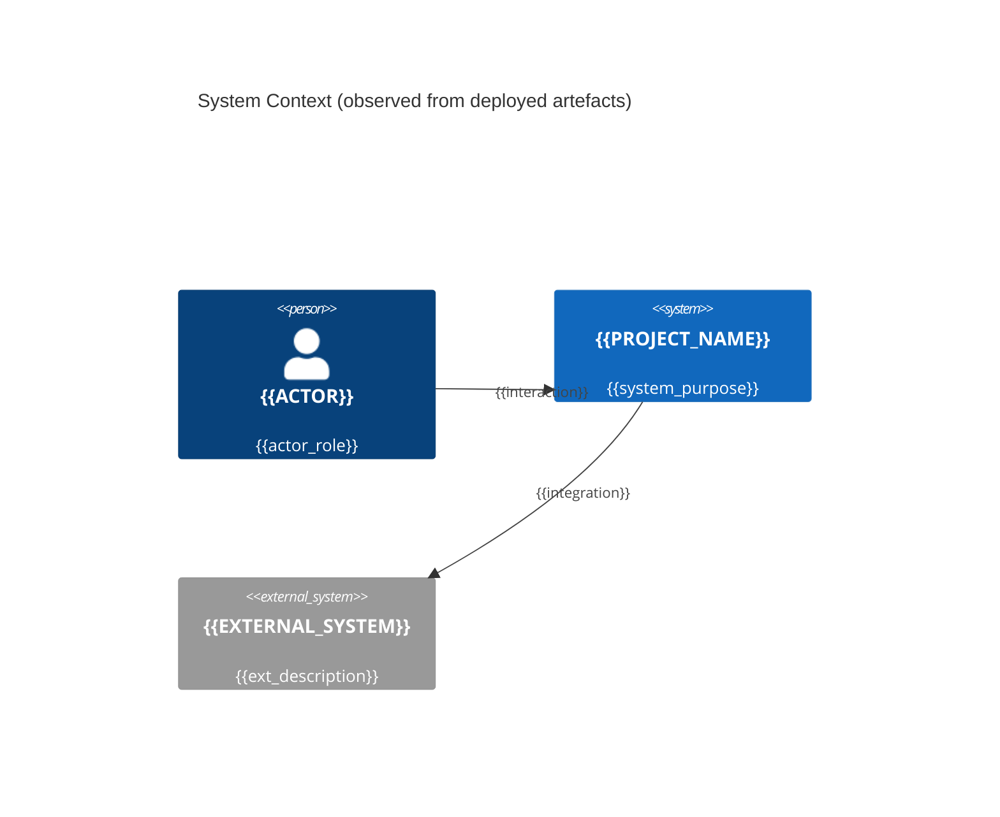
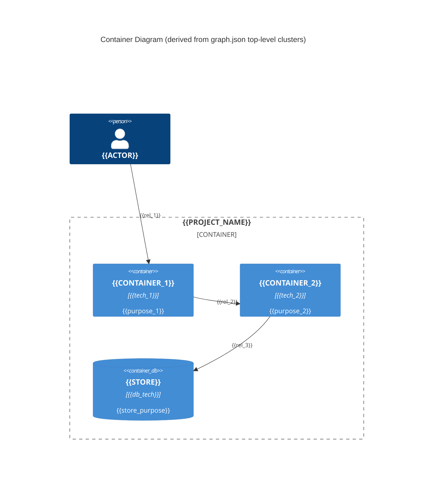
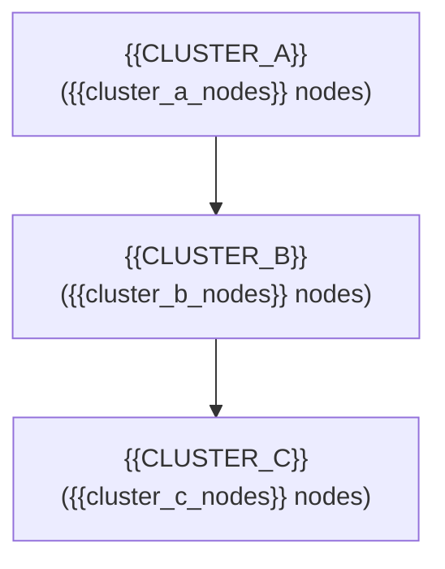

<!-- Current-state architecture. Mirrors the shape of docs/specs/weave/engines/<entity>/tech-spec/architecture.md but documents WHAT IS, not what will be. -->
<!-- Frontmatter schema: templates/frontmatter-schema.md -->
# Architecture (current state): {{PROJECT_NAME}}

> Coverage: {{COVERAGE_PCT}}% of LOC analysed{{COVERAGE_EXCLUSIONS}}
> See `.claude/state/discovery/coverage.yml` for per-language breakdown and `docs/specs/weave/engines/<entity>/tech-spec/architecture.md` for the future-state design.

## C4 Model — observed

### Level 1: System Context

> Graph node: {{L1_NODE_ID}} · Confidence: high (derived from build artefacts, manifests, deploy config).

### Level 2: Container

> Graph node: {{L2_NODE_IDS}} · Confidence: high (derived from clustered dependency edges).

### Level 3: Component — DRAFT (unverified grouping)

> **This section was auto-generated from Graphify clusters. Cluster shape ≠ architectural component. Do not trust without SME confirmation.** See `.claude/state/context/patterns.md` for grouping rationale once an SME has reviewed.
>
> Status: `DRAFT — unverified grouping`. Run `/interview architect` to confirm or correct.

### Level 4: Code — not auto-generated

> L4 (class-level) requires SME-confirmed L3 groupings. Populate `class.md` (see sibling file) only after Level 3 is confirmed.

## Cluster Map

| Cluster | Nodes | Representative path | Churn (last 90d) | Confirmation |
|---|---|---|---|---|
| {{CLUSTER_NAME}} | {{NODE_COUNT}} | `{{REPR_PATH}}` | {{CHURN}} | {{none|alice|etc}} |

## Blind spots

<!-- Populated when coverage < 100%. Lists paths graph extraction did not analyse. -->

{{#each blind_spots}}
- `{{path}}` — reason: {{reason}}
{{/each}}

## Integration boundaries (invisible to static graph)

These edges the graph cannot see by construction. SME input required; add to `.claude/state/context/tribal-knowledge.md` and cite here:

- {{Dynamic dispatch / reflection / DI container boundaries}}
- {{Event bus / message queue topics}}
- {{Feature flag branches}}
- {{Cross-service calls via runtime-resolved URLs}}

## Archive

<!-- Compacted content moves here. Prefix each entry with the date it was archived. -->
