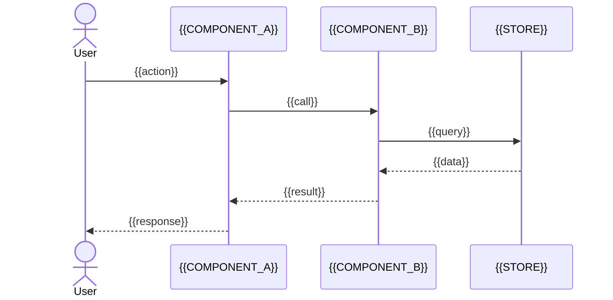
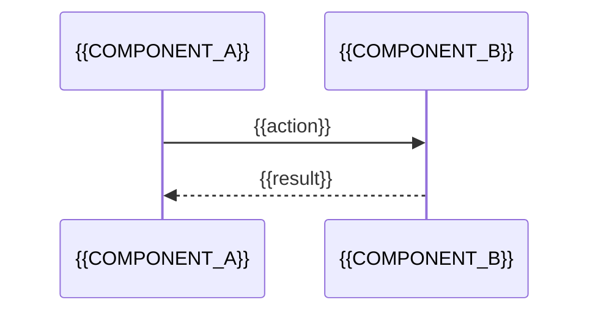

<!-- Frontmatter schema: templates/frontmatter-schema.md -->
<!-- Sequence diagrams for each detected entry point. Read docs/specs/weave/engines/<entity>/04-arch/tech-spec/business-process.md for future-state flows. -->
# Flows (current state): {{PROJECT_NAME}}

> Coverage: {{COVERAGE_PCT}}% of LOC analysed{{COVERAGE_EXCLUSIONS}}

## Entry points (observed)

| Entry point | Type | Handler (file#symbol) | Notes |
|---|---|---|---|
| {{route / CLI cmd / event}} | {{HTTP / CLI / queue / cron}} | `{{path#symbol}}` | {{auth, rate-limit, flags}} |

## Sequence diagrams

### {{FLOW_1_NAME}}

> Graph edges: {{EDGE_IDS}} · Confirmation: {{none | SME handle}}

### {{FLOW_2_NAME}}

## Invisible edges (SME-authored)

The static graph does not see: DI container wirings, event-bus publishes/subscribes, reflection, runtime-resolved URLs, feature-flag branches. Capture them here — each row is SME-confirmed and carries a citation.

| Edge | From | To | Mechanism | Source (SME + date) |
|---|---|---|---|---|
| {{edge}} | {{src_component}} | {{dst_component}} | {{event name / topic / queue / flag}} | {{handle + date}} |

## Archive
