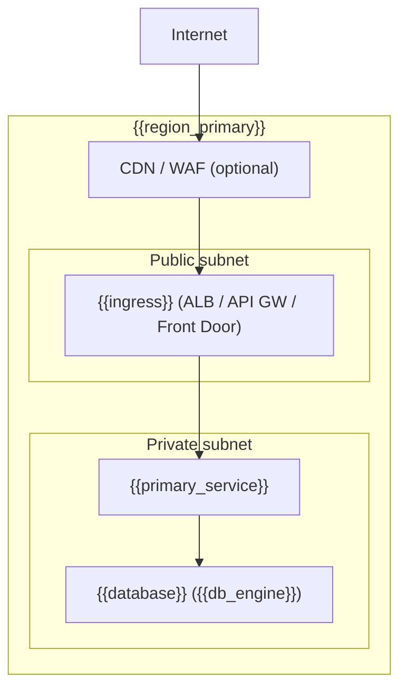

# Infrastructure: {{PROJECT_NAME}}

**Status:** {{Draft | Approved | Superseded}}
**Last updated:** {{YYYY-MM-DD}}
**Owner:** {{OWNER}}

## Overview

{{PROJECT_NAME}} deploys to **{{cloud_provider}}** ({{region_primary}}{{#if region_dr}}, {{region_dr}} DR{{/if}}) using **{{iac_tool}}** as the IaC layer. Stack row: `{{language}}` / `{{iac}}` from `docs/stack-equivalents.md`. See `docs/standards/patterns/infra/{{iac_few_shot_file}}` for the seed example.

## Cloud Topology



_Replace with actual topology. Mark each node with the AWS/Azure service name. Add subnets, VPC peering, or private endpoints as required._

## IaC Architecture

| Dimension | Value |
|---|---|
| Tool | {{iac_tool}} |
| Repo layout | `infra/` — stacks, constructs/modules, config |
| Package boundaries | One stack per environment tier; shared constructs in `infra/constructs/` |
| Synth command | `{{synth_command}}` (e.g. `cdk synth`, `pulumi preview`, `sam build`) |
| Deploy command | `{{deploy_command}}` (e.g. `cdk deploy --all`, `pulumi up`, `sam deploy`) |
| Few-shot example | `docs/standards/patterns/infra/{{iac_few_shot_file}}` |

_Stacks/modules must respect the same file-length and complexity limits as application code (see `templates/standards/base/complexity.md`)._

## IAM / RBAC

- **Principal model:** {{describe principals — service accounts, managed identities, task roles, etc.}}
- **Least-privilege:** each workload role grants only the permissions it needs; no wildcard actions on production resources.
- **CI/CD identity:** OIDC federation — the pipeline (GitHub Actions) assumes a deploy role via OIDC rather than storing long-lived credentials. See Plugin Law F.
  - AWS: `oidc-provider: token.actions.githubusercontent.com` → `DeployRole` with condition on repo + branch.
  - Azure: Workload Identity Federation on the managed identity.
- **Human access:** break-glass role with MFA + CloudTrail/Azure Monitor audit trail; no standing write access to production.

## Secrets Management

| Secret type | Store | Rotation | Runtime validation |
|---|---|---|---|
| DB credentials | {{AWS Secrets Manager / Azure Key Vault / SSM Parameter Store}} | {{rotation period}} | {{env-validation lib}} at startup |
| API keys (third-party) | {{same store}} | Manual + alert | Same |
| Signing keys / JWTs | {{store}} | {{period}} | Same |

- Secrets are **never** stored in IaC source or `.env` files committed to the repo.
- Runtime env validation library: `{{env_validation_lib}}` (from `docs/stack-equivalents.md` Secrets/env validation row). App fails fast on startup if any required secret is absent.

## Network Topology

```
{{cloud_provider}} account / subscription
└── VPC / VNet: {{cidr}}
    ├── Public subnets:  {{public_cidr}} — load balancer / API gateway only
    └── Private subnets: {{private_cidr}} — compute, databases, caches
        └── Egress: NAT Gateway / Azure NAT Gateway (single AZ for dev; HA pair for prod)
```

_For fully serverless architectures (Lambda + APIGW, Azure Functions + APIM) where no VPC is needed, replace this section with "Serverless — N/A. Endpoints secured via IAM / API key / OAuth at the gateway layer."_

- Ingress: {{ALB with WAF / API Gateway / Azure Front Door + APIM}}
- Egress: {{NAT Gateway / service endpoints / private link}}
- Private endpoints / PrivateLink: {{list services routed privately}}
- No direct database exposure to the public internet.

## Environments

| Environment | Account / subscription | Branch | Deploy gate |
|---|---|---|---|
| dev | {{dev_account}} | `feature/*`, `main` | Auto on merge |
| staging | {{staging_account}} | `main` | Auto on merge |
| prod | {{prod_account}} | `release/*` | Manual approval (GitHub environment protection rule) |

- Environment protection rules configured in GitHub → Settings → Environments.
- Promotion is always **forward-only** (dev → staging → prod). Hotfixes branch from the release tag, not from prod.
- Prod deploy requires at least one reviewer from the `{{team_name}}` team.

## Observability Hooks

This infra integrates with the observability stack via:

- **Structured logs:** {{log destination — CloudWatch Logs / Azure Monitor / Datadog}} — log groups per service, retention {{N}} days dev / {{N}} days prod.
- **Traces:** {{X-Ray / Azure Monitor distributed tracing / OTEL collector}} — sampling rate `{{rate}}` in prod.
- **Metrics + dashboards:** {{CloudWatch dashboards / Azure Monitor workbooks / Grafana}}.
- **Alarms:** p99 latency, error rate, DLQ depth — see `docs/specs/weave/engines/<entity>/tech-spec/testing-strategy.md`.
- **Few-shot example:** `docs/standards/patterns/observability/{{observability_few_shot_file}}`.

## Synthetic Verification (Plugin Law F)

No infra code merges without passing:

| Tool | Purpose | When |
|---|---|---|
| {{cdk-nag / cfn-lint / bicep lint / checkov}} | Static security + compliance analysis | `cdk synth` / CI |
| {{checkov / tfsec / PSRule}} | Policy-as-code gate | CI |
| LocalStack / Azurite / Cosmos emulator / Testcontainers | Local runtime tests without real cloud calls | Local + CI |

- IaC unit tests live in `infra/test/` and run via `{{test_command}}`.
- The orchestrator / plugin **never** executes real-cloud deploys during verification runs; all tests use the local emulator listed above.

## Real-Deploy Runbook

Runbook for actual cloud deploys is maintained separately at `docs/ops/cloud-deploy-runbook.md` (created during the CD setup task). It covers:

- Pre-deploy checklist (environment variables set, secrets seeded, DB migrations queued)
- Deploy command sequence with rollback steps
- Post-deploy smoke tests
- Incident escalation contacts

The orchestrator does **not** execute the runbook steps. A human operator or a purpose-built CD pipeline is the only actor that runs real deploys.
