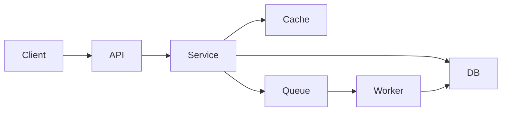

<!-- Budget: ~200 lines. Archive older content below the Archive section. -->
<!-- Frontmatter schema: templates/frontmatter-schema.md -->
# Data Model: {{PROJECT_NAME}}

> Coverage: {{COVERAGE_PCT}}% of LOC analysed{{COVERAGE_EXCLUSIONS}}

> Graph node: {{NODE_ID}}

## Storage

| Store | Type | Version | Hosting | Notes |
|-------|------|---------|---------|-------|
| {{STORE_NAME}} | {{SQL / NoSQL / File / KV}} | {{VERSION}} | {{Managed / Self-hosted / Local}} | {{NOTES}} |

## Entities

| Entity | Storage | Relationships | Notes |
|--------|---------|---------------|-------|
| {{ENTITY}} | {{STORE_NAME}} | {{Has many X, belongs to Y}} | {{NOTES}} |

## ER Diagram

```mermaid
erDiagram
    {{ENTITY_A}} {
        string id PK
        string {{field}} "{{description}}"
    }
    {{ENTITY_B}} {
        string id PK
        string {{entity_a}}_id FK
    }

    {{ENTITY_A}} ||--o{ {{ENTITY_B}} : "{{relationship}}"
```

## Data Flow Patterns

{{How data moves through the system. Request lifecycle, caching layers, event propagation.}}



## Known Data Issues

| Issue | Severity | Description | Evidence |
|-------|----------|-------------|----------|
| {{ISSUE}} | {{High / Medium / Low}} | {{DESCRIPTION}} | {{Where observed}} |

## Archive

<!-- Compacted content moves here. Prefix each entry with the date it was archived. -->

---
*Generated by Weave Architect agent.*
