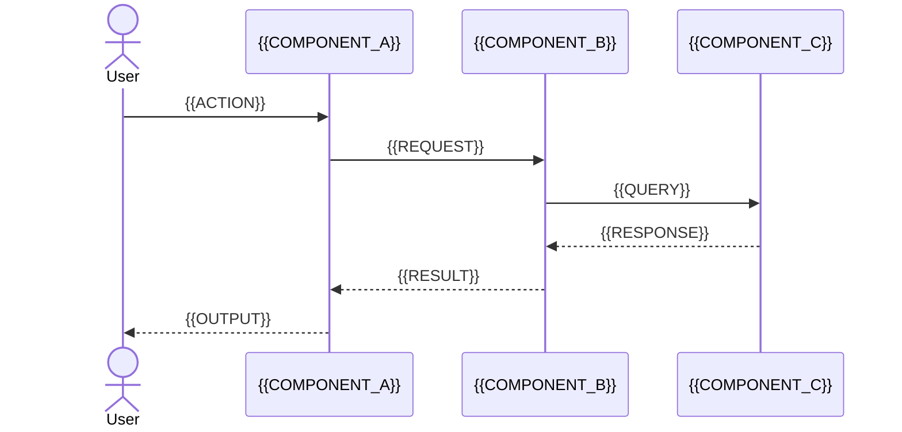
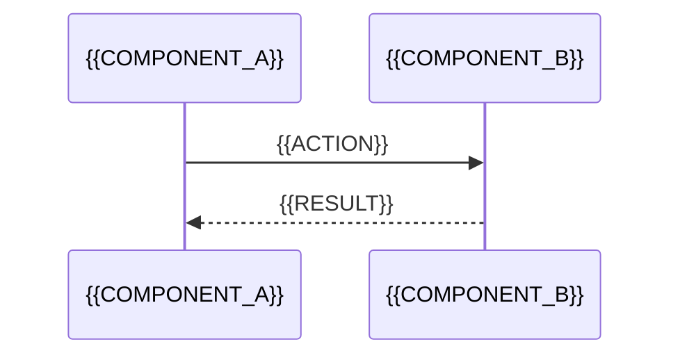

<!-- Budget: ~200 lines. Archive older content below the Archive section. -->
<!-- Frontmatter schema: templates/frontmatter-schema.md -->
# Flows: {{PROJECT_NAME}}

> Coverage: {{COVERAGE_PCT}}% of LOC analysed{{COVERAGE_EXCLUSIONS}}

> Graph node: {{NODE_ID}}

## Key User Flows

| Flow | Entry Point | Happy Path Steps | Error Handling | Notes |
|------|-------------|-----------------|----------------|-------|
| {{FLOW_NAME}} | {{ENTRY}} | {{STEPS}} | {{ERROR_HANDLING}} | {{NOTES}} |

## Sequence Diagrams

### {{FLOW_1_NAME}}

### {{FLOW_2_NAME}}

### {{FLOW_3_NAME}}

## API Surface

| Endpoint | Method | Auth | Description | Notes |
|----------|--------|------|-------------|-------|
| {{PATH}} | {{GET/POST/PUT/DELETE}} | {{Type}} | {{DESCRIPTION}} | {{NOTES}} |

## Integration Points

| Service | Type | Direction | Protocol | Notes |
|---------|------|-----------|----------|-------|
| {{SERVICE}} | {{External API / MCP / Webhook / Queue / File}} | {{Inbound / Outbound / Bidirectional}} | {{REST / gRPC / WebSocket / AMQP}} | {{NOTES}} |

## Archive

<!-- Compacted content moves here. Prefix each entry with the date it was archived. -->

---
*Generated by Weave Architect agent.*
