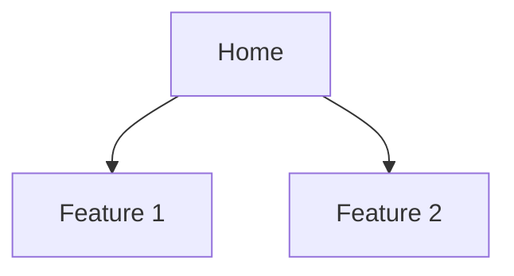

<!--
EXAMPLES — for the PO agent's reference only.
These do NOT appear in generated prd files (HTML comment block).

<example kind="good-user-story">
As a Versent platform engineer onboarding a new team,
I want one command that scaffolds our standard CI/CD, observability,
and IaC baseline,
so that I don't repeat 4 hours of copy-paste from the last project.

Why good: concrete role, concrete trigger ("onboarding a new team"),
concrete cost ("4 hours"), one named outcome.
</example>

<example kind="bad-user-story">
As a user, I want a fast system, so that I can be productive.

Why bad: "user" is generic, "fast" is unmeasurable, "productive" is
unfalsifiable. The Architect cannot derive AC from this.
</example>

<example kind="good-functional-requirement">
FR-012: Scaffold command MUST accept a `--stack` shortcode flag and
fully pre-fill the stack object without prompting when the shortcode
maps to an entry in `docs/stack-equivalents.md`. Failure mode: an
unrecognised shortcode prints the list of valid shortcodes and exits
non-zero. Acceptance: `scaffold --stack ts-nextjs-aws` produces a
project tree with zero MCQ rounds; `scaffold --stack does-not-exist`
exits 1 within 100ms.
</example>

<example kind="bad-functional-requirement">
FR-012: The CLI should be easy to use and handle errors gracefully.

Why bad: no observable behaviour, no failure mode, no acceptance
condition. The Engineer cannot write a test from this; QA cannot
verify it.
</example>
-->

# Product Requirements Document: {{PROJECT_NAME}}

## Overview

**Brief:** [brief.md](./brief.md)
**Status:** Draft | In Review | Approved
**Last Updated:** {{DATE}}

## Product Context

### Background
{{Why are we building this? What's the business/user context?}}

### Goals
1. {{Primary goal}}
2. {{Secondary goal}}

### Non-Goals
1. {{What we're explicitly not trying to achieve}}

## User Stories

### Epic: {{EPIC_NAME}}

#### Story 1: {{STORY_TITLE}}
**As a** {{user type}}
**I want** {{capability}}
**So that** {{benefit}}

**Acceptance Criteria:**
- [ ] Given {{context}}, when {{action}}, then {{expected result}}
- [ ] Given {{context}}, when {{action}}, then {{expected result}}

**Priority:** Must Have | Should Have | Could Have | Won't Have

#### Story 2: {{STORY_TITLE}}
...

## Functional Requirements

### FR-001: {{Requirement Name}}
- **Description:** {{What it does}}
- **User Story:** {{Reference}}
- **Priority:** {{P0/P1/P2}}
- **Acceptance Criteria:** {{Testable criteria}}

## Non-Functional Requirements

### Performance
- {{Response time targets}}
- {{Throughput expectations}}

### Security
- {{Authentication requirements}}
- {{Data handling requirements}}

### Accessibility
- {{WCAG compliance level}}

### Browser/Device Support
- {{Supported platforms}}

## Information Architecture

## Technical Prerequisites

### Required Dependencies

| Dependency | Version | Purpose | Install Command |
|-----------|---------|---------|----------------|
| Node.js | >= 20.x | Runtime | `brew install node` / `nvm install 20` |
| npm | >= 10.x | Package manager | Bundled with Node |
| Git | >= 2.x | Version control | `brew install git` |
| {{Additional}} | {{Version}} | {{Purpose}} | {{Command}} |

### Environments

| Environment | URL | Purpose | Deployment |
|------------|-----|---------|------------|
| Development | localhost:3000 | Local dev | Manual |
| Dev | {{URL}} | Integration testing | Auto on merge to main |
| Staging | {{URL}} | Pre-production validation | Auto after dev smoke pass |
| Production | {{URL}} | Live users | Manual approval required |

### Required Credentials

| Credential | Environment Variable | Purpose | Where Stored |
|-----------|---------------------|---------|-------------|
| {{Credential}} | `{{ENV_VAR_NAME}}` | {{Purpose}} | GitHub Secrets / .env |

**Security:** All credentials stored as environment variables. Never in code. `.env` must be in `.gitignore`.

### Deployment Targets

- **Cloud provider:** {{AWS / Vercel / GCP / Azure}}
- **Infrastructure:** {{Serverless / Container / VM}}
- **CDN:** {{CloudFront / Vercel Edge / None}}
- **Database hosting:** {{RDS / PlanetScale / Supabase / Local}}

## Risks and Mitigations

| Risk | Impact | Likelihood | Mitigation |
|------|--------|------------|------------|
| {{Risk 1}} | High/Med/Low | High/Med/Low | {{How to address}} |

## Dependencies

- {{External dependency 1}}
- {{External dependency 2}}

## Timeline

| Phase | Milestone | Target Date |
|-------|-----------|-------------|
| {{Phase 1}} | {{Deliverable}} | {{Date}} |

---
*Generated by Weave PO agent. Review and approve before proceeding to Tech Spec.*
