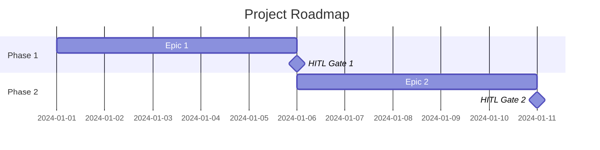

# Roadmap: {{PROJECT_NAME}}

## Overview

**Brief:** [brief.md](./brief.md)
**PRD:** [prd.md](./prd.md)
**Status:** Draft | In Review | Approved

## Phases

### Phase 1: {{PHASE_NAME}}

**Goal:** {{What this phase delivers}}
**HITL Gate:** {{What must be true to proceed}}

| Epic | Description | Stories | Priority |
|------|-------------|---------|----------|
| EPIC-001 | {{Description}} | {{Count}} | Must Have |

**Entry Criteria (Definition of Ready):**
- [ ] PRD approved
- [ ] Tech spec approved
- [ ] Tasks decomposed and reviewed

**Exit Criteria (HITL Gate):**
- [ ] {{Measurable outcome}}
- [ ] {{All tests passing}}
- [ ] {{Human review complete}}

### Phase 2: {{PHASE_NAME}}

**Goal:** {{What this phase delivers}}
**HITL Gate:** {{What must be true to proceed}}
**Dependencies:** Phase 1 complete

| Epic | Description | Stories | Priority |
|------|-------------|---------|----------|
| EPIC-002 | {{Description}} | {{Count}} | Must Have |

**Entry Criteria:**
- [ ] Phase 1 gate passed
- [ ] {{Additional scaffolding if needed}}

**Exit Criteria (HITL Gate):**
- [ ] {{Measurable outcome}}

## HITL Gate Summary

| Gate | After Phase | Approval Criteria | Approver |
|------|------------|-------------------|----------|
| Gate 1 | Phase 1 | {{Criteria}} | {{Role}} |
| Gate 2 | Phase 2 | {{Criteria}} | {{Role}} |

---
*Generated by Weave PO agent. Review and approve before proceeding to Technical Architecture.*
