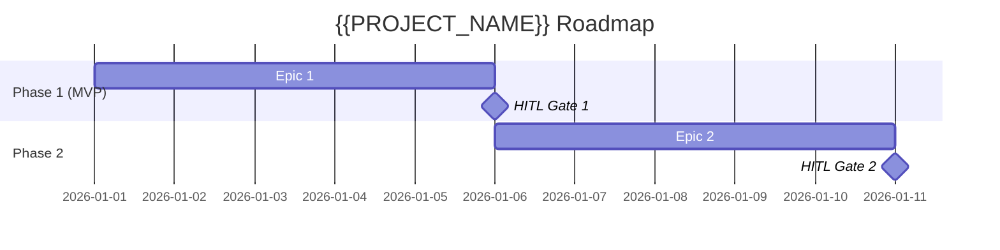

# Roadmap: {{PROJECT_NAME}}

**Brief:** [brief.md](../01-brief/brief.md) · **PRD:** [prd.md](../02-prd/prd.md)
**Program roadmap:** [../../_program-roadmap.md](../../_program-roadmap.md)
**Status:** Draft

## Position in the build order

Weave build order: **Platform shell → Constitution → Graph Explorer → Build → Events → Onboarding**.
This engine is **#{{N}}**. **Depends on:** {{upstream engines / contracts (cite contract IDs)}}.
**Unblocks:** {{downstream}}. Work that is contract-unblocked may run in parallel — see the program roadmap.

## Phases



---

### Phase 1: {{PHASE_NAME}}  ·  {{MVP | Phase 2 | …}}

**Goal:** {{What this phase delivers — the demonstrable outcome.}}
**Epics:**

| Epic | Description | Stories | Priority | MVP? |
|------|-------------|---------|----------|------|
| EPIC-001 | {{Description}} | {{N}} | Must Have | yes/no |

**Entry criteria (Definition of Ready):**
- [ ] PRD section approved; tech spec for this phase approved
- [ ] Tasks decomposed; each task brief passes the DoR gate
- [ ] {{phase-specific prerequisites / upstream contracts available}}

**Exit criteria (EARS, measurable, human-signed):**
- [ ] WHEN {{event}} THE SYSTEM SHALL {{measurable behaviour}} — verified by {{artefact/test}}
- [ ] Coverage ≥ 80% (default, tunable) · mutation ≥ 60% (default, tunable) · 0 blocking bugs
- [ ] {{≥1 measurable delivered artefact}}
- [ ] **Human sign-off recorded** (always the final exit criterion)

**HITL gates (configurable for this phase — declare which are active):**

| Gate | Active? | Approver | Blocks |
|------|---------|----------|--------|
| Spec-approval (PO/stakeholder sign-off) | **mandatory** | {{role}} | phase start |
| Phase-boundary ceremony (security-review + mutation + doc-gen) | yes/no | {{role}} | phase-2 |
| Pre-AWS-deploy (full local pyramid + gates green → approve) | yes/no | {{role}} | deploy |
| Publish/generate (ontology publish / artefact release) | yes/no | {{role}} | release |

> HITL gates are project/workspace-configurable; only spec-approval is globally mandatory. In the
> Build Engine dark factory, each client project declares its gates here in its own roadmap.

**Phase-gate metadata** (evaluated by the phase-gate Stop hook / `/goal` condition):

```
phase: 1
gate_id: {{slug}}-gate-1
condition: all_exit_criteria_met
approver: {{role}}
blocks: phase-2
```

---

### Phase 2: {{PHASE_NAME}}

**Goal:** {{…}}  ·  **Dependencies:** Phase 1 gate passed{{; + upstream}}
{{repeat the Phase 1 block structure}}

---

## HITL gate summary

| Gate | After phase | Approval criteria | Approver |
|------|-------------|-------------------|----------|
| Gate 1 | Phase 1 | {{EARS exit criteria met + human sign-off}} | {{role}} |

---
*Generated by Weave PO agent. Review and approve before proceeding to Technical Architecture.*
