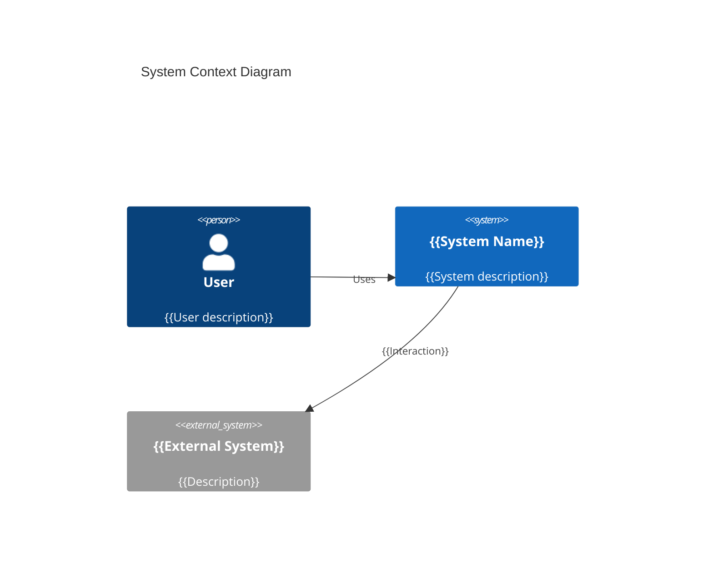
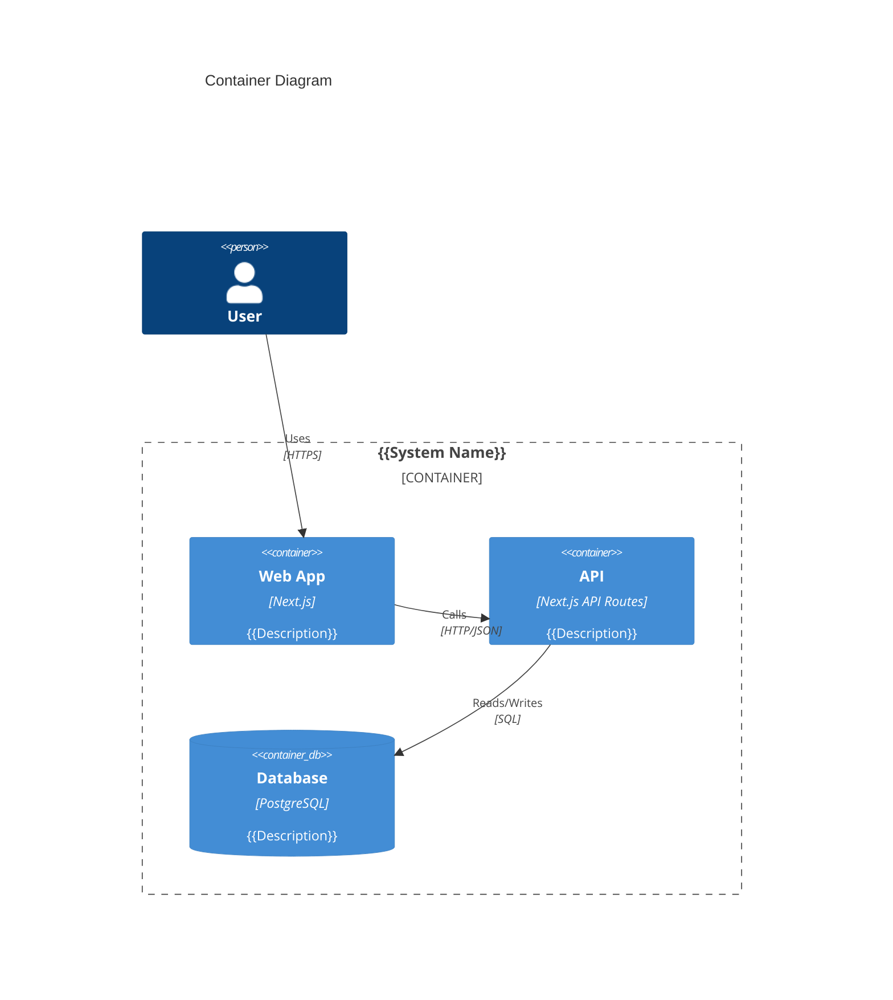
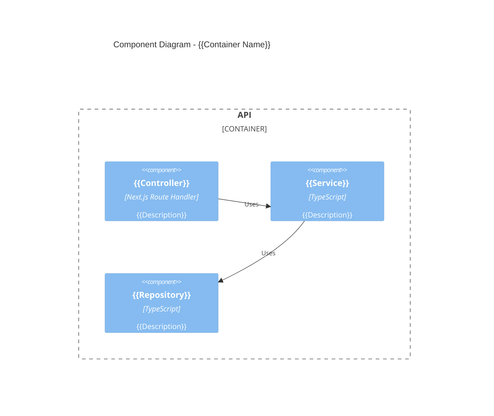

# Architecture: {{PROJECT_NAME}}

## C4 Model

### Level 1: System Context



### Level 2: Container



### Level 3: Component



### Level 4: Code

```mermaid
classDiagram
    class {{ClassName}} {
        +{{property}}: {{type}}
        +{{method}}(): {{returnType}}
    }
```

## Technology Stack

| Layer | Technology | Version | Rationale |
|-------|-----------|---------|-----------|
| Frontend | Next.js | 15.x | Full-stack React framework |
| Styling | {{CSS solution}} | {{Version}} | {{Why}} |
| Testing (E2E) | Playwright | latest | Browser automation |
| Testing (Unit) | Vitest | latest | Fast, Vite-native |
| Testing (Component) | Testing Library | latest | User-centric |
| Linting | ESLint + SonarJS | latest | Complexity analysis |
| API Spec | OpenAPI 3.1 | - | Contract-first |
| Database | {{DB}} | {{Version}} | {{Why}} |

## System Dependencies

### Runtime Dependencies

| Dependency | Version | Required By | Check Command |
|-----------|---------|-------------|--------------|
| Node.js | >= 20.x | Next.js, Vitest, Playwright | `node --version` |
| npm | >= 10.x | Package management | `npm --version` |
| Git | >= 2.x | Version control, worktrees | `git --version` |
| {{Additional}} | {{Version}} | {{Component}} | {{Command}} |

### Build/Deploy Dependencies

| Dependency | Version | Required By | Check Command |
|-----------|---------|-------------|--------------|
| GitHub CLI | latest | PR creation | `gh --version` |
| {{Docker}} | {{Version}} | {{Containerisation}} | `docker --version` |
| {{AWS CLI}} | {{Version}} | {{Deployment}} | `aws --version` |

### Required Credentials

| Credential | Env Variable | Used By | Scope |
|-----------|-------------|---------|-------|
| GitHub Token | `GITHUB_TOKEN` | PR creation, CI/CD | All environments |
| {{Database URL}} | `DATABASE_URL` | {{API/ORM}} | Per-environment |
| {{API Key}} | `{{ENV_VAR}}` | {{Service}} | {{Scope}} |

**Security rules:**
- All credentials via environment variables only
- `.env` in `.gitignore` (enforced by init)
- Production secrets in GitHub Actions environment secrets
- Agent sees variable names, never values

## Key Architectural Decisions

See [decisions/](../decisions/) for full ADRs.

| ADR | Decision | Status |
|-----|----------|--------|
| ADR-001 | {{Decision}} | Accepted |

---
*Generated by Weave Architect agent. Review and approve before task decomposition.*
