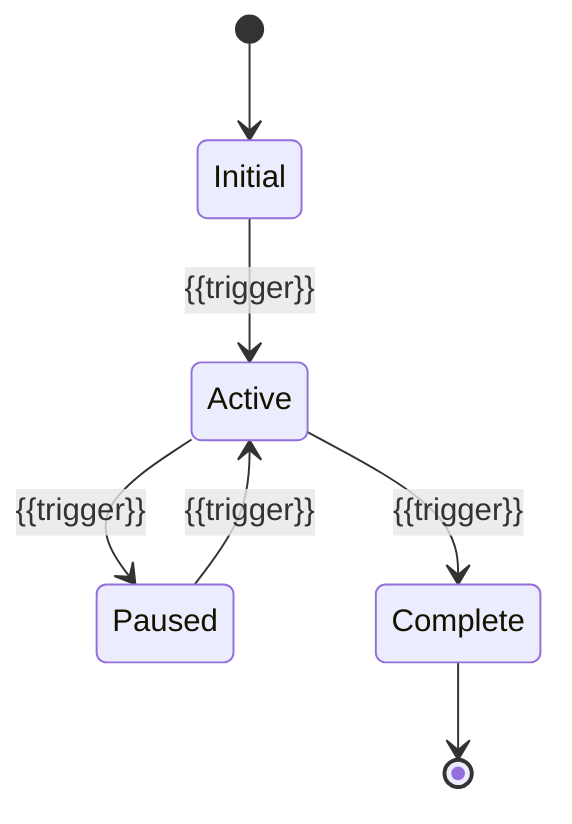
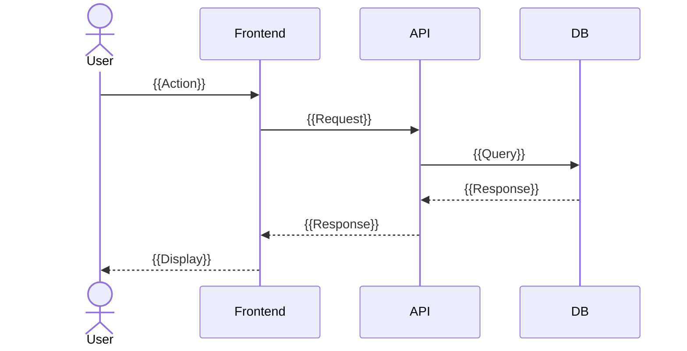

# Business Process Model: {{PROJECT_NAME}}

## Core User Flows

### Flow 1: {{FLOW_NAME}}

```mermaid
flowchart TD
    A[User opens app] --> B{Is authenticated?}
    B -->|Yes| C[Show dashboard]
    B -->|No| D[Show login]
    D --> E[User authenticates]
    E --> C
    C --> F[{{Core action}}]
    F --> G[{{Result}}]
```

### Flow 2: {{FLOW_NAME}}

```mermaid
flowchart TD
    A[{{Start}}] --> B[{{Step 1}}]
    B --> C{{{Decision}}}
    C -->|Option A| D[{{Outcome A}}]
    C -->|Option B| E[{{Outcome B}}]
```

## State Machine



## Sequence Diagrams

### {{Interaction Name}}



---
*Generated by Weave Architect agent.*
