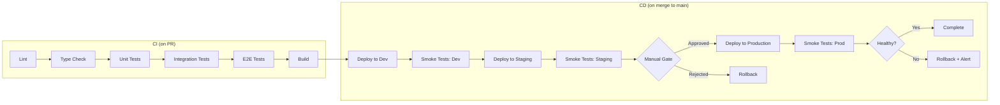

# CI/CD Pipeline: {{PROJECT_NAME}}

## Pipeline Overview



## Pipeline Stages

### CI: Pull Request Checks

| Stage | Tool | Command | Failure Action |
|-------|------|---------|----------------|
| Lint | ESLint + SonarJS | `npm run lint` | Block merge |
| Type Check | TypeScript | `npm run type-check` | Block merge |
| Unit Tests | Vitest | `npm run test:unit` | Block merge |
| Integration Tests | Vitest | `npm run test:integration` | Block merge |
| E2E Tests | Playwright | `npm run test:e2e` | Block merge |
| Build | Next.js | `npm run build` | Block merge |
| Coverage | Vitest | `npm run test:coverage` | Warn if < 80% |
| Complexity | ESLint SonarJS | `npm run lint` | Block if threshold exceeded |
| Security | npm audit | `npm audit --audit-level=high` | Warn on high/critical |
| Duplication | jscpd | `npx jscpd src/ --threshold 5` | Block merge |
| License Compliance | license-checker | `npx license-checker --onlyAllow "MIT;ISC;Apache-2.0;BSD-2-Clause;BSD-3-Clause"` | Block merge |

### CD: Deployment Pipeline

| Stage | Trigger | Target | Gate |
|-------|---------|--------|------|
| Deploy to Dev | Merge to `main` | {{Dev URL}} | Automatic |
| Smoke Tests: Dev | Post-deploy | {{Dev URL}} | Auto-rollback on fail |
| Deploy to Staging | Dev smoke pass | {{Staging URL}} | Automatic |
| Smoke Tests: Staging | Post-deploy | {{Staging URL}} | Auto-rollback on fail |
| **Manual Gate** | Staging smoke pass | — | **Human approval required** |
| Deploy to Production | Manual approval | {{Prod URL}} | Manual trigger |
| Smoke Tests: Prod | Post-deploy | {{Prod URL}} | Auto-rollback on fail |

## GitHub Actions Workflow (Generated During Scaffolding)

The Engineer agent generates this file at `.github/workflows/ci-cd.yml` during the scaffolding step.

```yaml
# .github/workflows/ci-cd.yml
name: CI/CD

on:
  pull_request:
    branches: [main]
  push:
    branches: [main]

jobs:
  ci:
    name: CI
    runs-on: ubuntu-latest
    steps:
      - uses: actions/checkout@v4
      - uses: actions/setup-node@v4
        with:
          node-version: '20'
          cache: 'npm'
      - run: npm ci
      - run: npm run lint
      - run: npm run type-check
      - run: npm run test:unit
      - run: npm run test:integration
      - run: npm run test:e2e
      - run: npm run build
      - run: npm run test:coverage
      - name: Check coverage threshold
        run: |
          # Extract coverage percentage and fail if below 80%
          npx vitest run --coverage --reporter=json | node -e "
            const data = require('/dev/stdin');
            const pct = data.total.lines.pct;
            if (pct < 80) { console.error('Coverage ' + pct + '% < 80%'); process.exit(1); }
          "
      - run: npm audit --audit-level=high || true
      - name: Duplication check
        run: npx jscpd src/ --threshold 5 --reporters console
      - name: License compliance
        run: npx license-checker --onlyAllow "MIT;ISC;Apache-2.0;BSD-2-Clause;BSD-3-Clause"

  deploy-dev:
    name: Deploy to Dev
    needs: ci
    if: github.ref == 'refs/heads/main'
    runs-on: ubuntu-latest
    environment: development
    steps:
      - uses: actions/checkout@v4
      - name: Deploy to dev
        run: echo "Deploy to dev environment"
        # {{REPLACE with actual deploy command}}
      - name: Smoke test dev
        run: echo "Run smoke tests against dev"
        # {{REPLACE with actual smoke test command}}

  deploy-staging:
    name: Deploy to Staging
    needs: deploy-dev
    runs-on: ubuntu-latest
    environment: staging
    steps:
      - uses: actions/checkout@v4
      - name: Deploy to staging
        run: echo "Deploy to staging environment"
        # {{REPLACE with actual deploy command}}
      - name: Smoke test staging
        run: echo "Run smoke tests against staging"
        # {{REPLACE with actual smoke test command}}

  deploy-production:
    name: Deploy to Production
    needs: deploy-staging
    runs-on: ubuntu-latest
    environment:
      name: production
      # MANUAL GATE: requires approval in GitHub environment settings
    steps:
      - uses: actions/checkout@v4
      - name: Deploy to production
        run: echo "Deploy to production environment"
        # {{REPLACE with actual deploy command}}
      - name: Smoke test production
        run: echo "Run smoke tests against production"
        # {{REPLACE with actual smoke test command}}
```

## Environment Configuration

| Environment | URL | Branch | Deploy Trigger | Approval |
|------------|-----|--------|----------------|----------|
| Development | localhost:3000 | feature/* | N/A (local) | None |
| Dev | {{Dev URL}} | main | Automatic on merge | None |
| Staging | {{Staging URL}} | main | After dev smoke pass | None |
| Production | {{Prod URL}} | main | Manual approval | **Required** |

## Required Secrets (GitHub Actions)

| Secret | Environment | Purpose |
|--------|-------------|---------|
| {{DEPLOY_KEY}} | dev, staging, production | Deployment authentication |
| {{DATABASE_URL}} | dev, staging, production | Database connection |
| {{API_KEY}} | dev, staging, production | External API access |

All secrets stored in GitHub Actions environment secrets. NEVER in code.

## Quality Gates

- All lint rules pass (zero warnings in CI)
- Cyclomatic complexity <= 10 per function
- Cognitive complexity <= 15 per function
- Test coverage >= 80%
- No critical/high security vulnerabilities (npm audit)
- No code duplication above 5% threshold (jscpd)
- All dependencies use approved licenses (license-checker)
- Build succeeds without warnings
- Smoke tests pass in each environment before promoting

---
*Generated by Weave Architect agent. The Engineer agent generates the actual GitHub Actions workflow file during scaffolding.*
