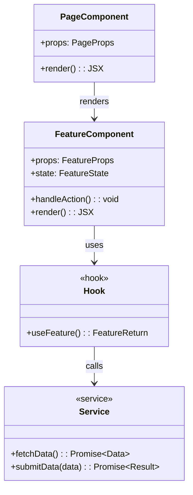

# Class Diagram: {{PROJECT_NAME}}

## Domain Model

```mermaid
classDiagram
    class {{ClassName}} {
        +{{property}}: {{type}}
        -{{privateProperty}}: {{type}}
        +{{method}}({{params}}): {{returnType}}
    }

    class {{InterfaceName}} {
        <<interface>>
        +{{method}}(): {{returnType}}
    }

    {{ClassName}} ..|> {{InterfaceName}} : implements
    {{ClassName}} --> {{OtherClass}} : uses
```

## Component Structure



## Type Definitions

```typescript
// Key interfaces and types referenced in the class diagram
interface {{TypeName}} {
  {{property}}: {{type}};
}
```

---
*Generated by Weave Architect agent.*
