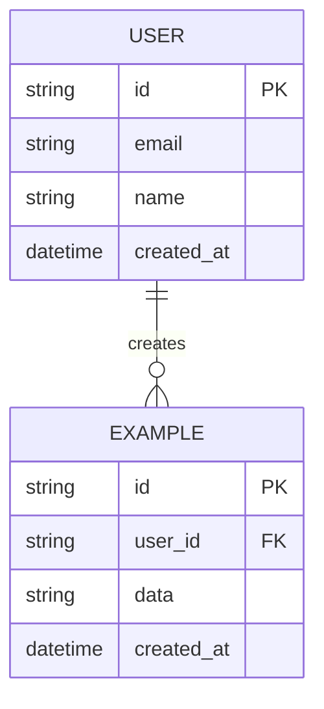

# Data Model: {{PROJECT_NAME}}

## Entity Relationship Diagram

## Entity Definitions

### {{Entity Name}}

| Field | Type | Constraints | Description |
|-------|------|-------------|-------------|
| id | UUID | PK, auto-generated | Unique identifier |
| {{field}} | {{type}} | {{constraints}} | {{description}} |

## Relationships

| From | To | Type | Description |
|------|----|------|-------------|
| {{Entity A}} | {{Entity B}} | One-to-Many | {{Description}} |

## Indexes

| Table | Columns | Type | Rationale |
|-------|---------|------|-----------|
| {{Table}} | {{Column(s)}} | {{B-tree/GIN}} | {{Why}} |

## Migration Strategy

{{How the schema evolves over phases. Any seeding requirements.}}

---
*Generated by Weave Architect agent.*
