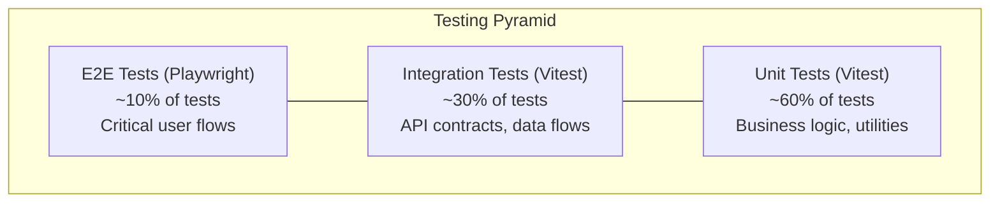

# Testing Strategy: {{PROJECT_NAME}}

## Testing Pyramid



## Frameworks and Tools

| Type | Framework | Config File | Run Command |
|------|-----------|-------------|-------------|
| Unit | Vitest | `vitest.config.ts` | `npm run test:unit` |
| Integration | Vitest | `vitest.config.ts` | `npm run test:integration` |
| Component | Testing Library + Vitest | `vitest.config.ts` | `npm run test:component` |
| E2E | Playwright | `playwright.config.ts` | `npm run test:e2e` |
| Coverage | Vitest (v8) | `vitest.config.ts` | `npm run test:coverage` |

## Coverage Targets

| Metric | Target | Enforcement |
|--------|--------|-------------|
| Line coverage | >= 80% | CI blocks merge below threshold |
| Branch coverage | >= 75% | CI warns below threshold |
| Function coverage | >= 80% | CI blocks merge below threshold |

## Test File Conventions

```
src/
├── components/
│   ├── MyComponent.tsx
│   └── __tests__/
│       ├── MyComponent.test.tsx          # Unit/component test
│       └── MyComponent.integration.test.tsx  # Integration test
├── lib/
│   ├── utils.ts
│   └── __tests__/
│       └── utils.test.ts
tests/
├── e2e/
│   ├── user-flow.spec.ts                # E2E test
│   └── fixtures/                         # Test fixtures
└── helpers/
    └── test-utils.ts                     # Shared test utilities
```

## Test Naming Convention

```typescript
describe('{{ComponentOrFunction}}', () => {
  it('should {{expected behavior}} when {{condition}}', () => {
    // Arrange
    // Act
    // Assert
  });
});
```

## Per-Task Test Requirements

Every task brief MUST specify:

1. **Explicit test scenarios** -- named test cases with expected behavior
2. **Test type requirements** -- minimum count per type (unit/integration/E2E)
3. **AC-mapped tests** -- each acceptance criterion maps 1:1 to at least one test

Example in task brief:
```markdown
## Test Requirements

### Unit Tests (minimum 3)
- `should calculate score correctly when snake eats number`
- `should reject duplicate number selection`
- `should validate number is within range 1-35`

### E2E Tests (minimum 1)
- `should complete full number selection flow from start to result`

### AC Mapping
| AC | Test |
|----|------|
| AC-1: User can select 7 numbers | E2E: full number selection flow |
| AC-2: Duplicates rejected | Unit: reject duplicate number selection |
```

## Mocking Strategy

- **External APIs:** Mock at the boundary (MSW for HTTP, mock functions for SDK calls)
- **Database:** Use in-memory test database or fixtures
- **Time/Random:** Deterministic seeding via test utilities
- **Never mock:** Business logic, utility functions, component rendering

## Quality Complexity Checks

Enforced via ESLint + SonarJS plugin:

| Metric | Threshold | Rule |
|--------|-----------|------|
| Cyclomatic complexity | <= 10 | `complexity` |
| Cognitive complexity | <= 15 | `sonarjs/cognitive-complexity` |
| Max function length | <= 50 lines | `max-lines-per-function` |
| Max file length | <= 300 lines | `max-lines` |

## Performance Testing

### Lighthouse Targets

| Metric | Target | Applies To |
|--------|--------|-----------|
| Performance score | >= {{90}} | All pages |
| Accessibility score | >= {{95}} | All pages |
| Best practices score | >= {{90}} | All pages |
| Bundle size (JS) | <= {{200}}KB gzipped | Total initial load |

### API Response Time Targets

| Endpoint | Method | Target | P95 Target |
|----------|--------|--------|-----------|
| {{/api/example}} | GET | < {{200}}ms | < {{500}}ms |
| {{/api/example}} | POST | < {{500}}ms | < {{1000}}ms |

### When to Run

QA agent runs performance tests selectively based on task brief:
- **Page/UI task** -> Lighthouse performance + accessibility audit
- **API task** -> API response time benchmarks
- **Backend-only task** -> Skip performance testing

## Accessibility Testing

### WCAG Compliance

- **Level:** WCAG 2.1 AA
- **Automated checks:** Lighthouse accessibility audit + axe-core
- **Manual checks:** Keyboard navigation, screen reader compatibility

### Accessibility Targets

| Check | Requirement |
|-------|------------|
| Lighthouse a11y score | >= {{95}} |
| axe-core violations | 0 critical, 0 serious |
| Keyboard navigable | All interactive elements |
| Screen reader | All content accessible |
| Color contrast | WCAG AA minimum (4.5:1 text, 3:1 large text) |

---
*Generated by Weave Architect agent.*
