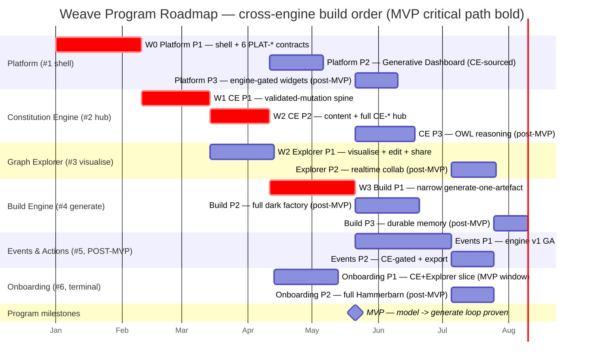

# Weave Program Roadmap

**Scope:** the cross-engine plan that ties the six per-engine roadmaps to the program MVP milestone
in build order. Per-engine sequencing lives in each engine's own roadmap; this document owns the
*inter-engine* sequence, the parallelism that the contracts permit, and the program-level gates.

**Per-engine roadmaps:**
[weave-platform](weave-platform/03-roadmap/roadmap.md) ·
[constitution-engine](constitution-engine/03-roadmap/roadmap.md) ·
[graph-explorer](graph-explorer/03-roadmap/roadmap.md) ·
[build-engine](build-engine/03-roadmap/roadmap.md) ·
[events-actions-engine](events-actions-engine/03-roadmap/roadmap.md) ·
[onboarding](onboarding/03-roadmap/roadmap.md)

**Canonical references:** contracts → [_inter-engine-contracts.md](_inter-engine-contracts.md) ·
dev environment → [_dev-environment.md](_dev-environment.md)

**MVP success criterion (from CLAUDE.md):** one real client models their company → Weave
auto-generates one working artefact (app, pipeline, or agent).

> All numeric thresholds in this document are **default X, tunable** — they resolve through the
> `PLAT-SETTINGS-1` four-level cascade (Company → Domain → Workspace → Project, tighter-wins).
> Cross-engine dependencies cite contract IDs from `_inter-engine-contracts.md`.

---

## 1. Build order and rationale

**Locked order:** Platform shell (#1) → Constitution Engine (#2) → Graph Explorer (#3) →
Build Engine (#4) → Events & Actions (#5) → Onboarding (#6).

The order is **dependency-derived, not preference**. Trace it by contract, not by the numbering:

| # | Engine | Why it sits here |
|---|--------|------------------|
| 1 | **Platform shell** | The *application shell* (app/nav/workspace/Cognito/Bedrock routing/tenancy), **not an engine**. It owns the six cross-cutting `PLAT-*` contracts that CE and every engine emit to or read from. Its Phase 1 has **no upstream engine dependency**, so it must ship first — nothing else can stand up without auth, tenancy, identity, audit, notify, billing and connectors. |
| 2 | **Constitution Engine** | The **first engine** on the shell and the **contract hub**: it provides `CE-READ-1 / CE-WRITE-1 / CE-DIFF-1 / CE-VERSION-1 / CE-BRAND-1 / CE-METRICS-1 / CE-EVENT-1`, which Explorer, Build, Events, Platform-dashboard and Onboarding all consume. It depends only on Platform's `PLAT-IDENTITY-1 / PLAT-AUDIT-1 / PLAT-SETTINGS-1` (available after #1). Until CE exists there is no graph to visualise, generate from, or automate against — so it is the gate on everything downstream. |
| 3 | **Graph Explorer** | The *visualise* half of the thin loop. It consumes CE's read/write/diff/version contracts (the CE Phase-1 spine) and **provides `GE-CANVAS-1`** to Build. It needs no engine below it, so it is next. |
| 4 | **Build Engine** | The *generate* half of the thin loop. Its narrow MVP slice (generate one app) consumes the CE read/write/diff/version spine **and `CE-BRAND-1`** (the compliant-by-construction conformance bar). It provides `BE-ARTEFACT-1` write-back and `BE-SELFIMPROVE-1`. It is after the two model engines because generation grounds on the modelled graph. |
| 5 | **Events & Actions** | Whole engine is **POST-MVP**. It automates *against* the live graph (CE), reuses Build's dark-factory dispatch (`BE-SELFIMPROVE-1`), and provides `EA-AUTOMATION-1`. It depends on #1–#4 contracts, so it follows them. |
| 6 | **Onboarding** | The terminal consumer — owns no graph data, exposes **no inter-engine contract**. It integrates the Hammerbarn seed across CE/Explorer/Build/Events, so it is built last. (Its CE+Explorer *slice* may be pulled into the MVP window — see §3 — but the full demo waits on Build + Events GA.) |

**Platform is the foundation; CE is the first engine; the rest cascade off the CE contract hub.**

---

## 2. Cross-engine phase plan — what is contract-unblocked to run in parallel

Parallelism is **gated by which CE phase publishes the contract a consumer needs** — it is *not*
"once CE is live" as a single event. Two distinct unblock points matter:

- **CE Phase 1** publishes the spine: `CE-READ-1`, `CE-WRITE-1`, `CE-DIFF-1`, `CE-VERSION-1`.
- **CE Phase 2** publishes the rest of the hub: `CE-BRAND-1`, `CE-METRICS-1`, `CE-EVENT-1` (beta).

The consequence (corroborated by the per-engine gantts — CE P1 starts after Platform P1, CE P2
completes as Build P1 begins):

| Wave | Runs | Unblocked by | Runs in parallel with |
|------|------|--------------|-----------------------|
| **W0** | Platform P1 (shell + 6 `PLAT-*` contracts) | nothing (no upstream engine dep) | — (solo foundation; everything waits on it) |
| **W1** | CE P1 (validated-mutation spine) | Platform P1 `PLAT-IDENTITY-1 / PLAT-AUDIT-1 / PLAT-SETTINGS-1` | — (CE P1 is the next critical-path link) |
| **W2** | **Explorer P1** ∥ **CE P2** | CE **P1** spine (Explorer); Platform P1 + CE P1 (CE P2) | Explorer P1 and CE P2 run concurrently — Explorer needs only the CE-P1 spine, so it does not wait for CE P2 |
| **W3** | **Build P1 (narrow slice)** ∥ **Platform P2 (Generative Dashboard)** | CE **P2** `CE-BRAND-1` (Build); CE **P2** `CE-METRICS-1` (dashboard) | Build's MVP slice and the CE-sourced dashboard both unblock at CE P2 and run concurrently |
| **W-par** | **Onboarding P1 (CE+Explorer slice)** | CE P1+P2 + Explorer P1 (+ Platform shell) | may run in the MVP window once its upstreams are GA — **parallel, not on the thin-loop critical path** (see §3) |

**Key correction to a naïve reading:** Build's *MVP slice does not unblock at CE Phase 1.* Its
Definition-of-Ready lists `CE-BRAND-1`, which ships in **CE Phase 2**. So the model→generate thin
loop closes only after CE Phase 2 — CE Phase 2 is the single gate on Build's MVP contribution.
Build P1 explicitly does **not** need `GE-CANVAS-1` (that is Build Phase 2 / FR-032), so Explorer
is not a Build blocker — the two *generate*-side waves (Build P1, dashboard) are gated by CE, not
by Explorer.

The MVP critical path is therefore:
**Platform P1 → CE P1 → CE P2 → Build P1** (with Explorer P1 ∥ CE P2, and the dashboard ∥ Build P1).

---

## 3. MVP milestone — the thin end-to-end loop

**Definition.** The program MVP is the **thin model→generate loop** and nothing more:

> **Platform shell** (Platform P1) + **Constitution Engine** (CE P1+P2, *model*) +
> **Graph Explorer** (Explorer P1, *visualise*) + a **narrow Build slice** (Build P1, *generate
> ONE artefact*).

This proves **model → generate** end-to-end: a real client models their company in CE, sees it in
Explorer, and Weave auto-generates one working application from that model, written back into the
graph.

**Explicitly NOT in the MVP milestone** (scope discipline — honour the locked decision over each
engine's own MVP self-tagging):

- **Events & Actions** — whole engine is post-MVP.
- **Full Onboarding** — only the CE+Explorer onboarding *slice* (Onboarding P1) may run in the MVP
  *window*, in parallel; it is **not on the thin-loop critical path and not part of the MVP exit
  criteria**. The full Hammerbarn demo (Build + Events seed) is post-MVP.
- **The Generative Dashboard** (Platform P2) — MVP-tagged in Platform's own roadmap, but it is *not*
  the model→generate loop. It runs in the MVP window in parallel with Build P1; it is **not a
  thin-loop gate**.
- **Realtime collaboration** (Explorer P2) — post-MVP.

**Constituent gates feed the program gate.** Each engine's own Phase-1 exit criteria (Platform P1,
CE P1+P2, Explorer P1, Build P1) must be green and signed off; the program-level exit criterion
below is the **end-to-end loop assertion** layered on top of them.

### MVP exit criteria (EARS, measurable, human-signed)

- [ ] WHEN a real client authors a company model in the Constitution Engine and a product owner
      requests one application from it THE SYSTEM SHALL ground the request via `CE-READ-1`, generate
      one working application (Next.js UI + FastAPI API), and write its new services/APIs/data-assets
      back into the graph via `CE-WRITE-1` (clone→SHACL→commit) with PROV-O attribution — closing the
      model→generate loop end-to-end.
- [ ] WHEN the modelled company is opened in the Graph Explorer THE SYSTEM SHALL render it as a
      force-directed canvas via `CE-READ-1`, coloured by CE node-kind, proving the *visualise* half
      of the loop on the same model the artefact was generated from.
- [ ] WHEN the generated application is published THE SYSTEM SHALL pass the Build quality gates
      (SAST, type-check, delta-scoped mutation ≥ 70% default tunable, package-existence/secret-scan,
      and `CE-BRAND-1` conformance ≥ 90% default tunable) before any commit.
- [ ] WHEN any tenant-A principal reads across CE, Explorer, or Build THE SYSTEM SHALL return zero
      tenant-B data — verified by each engine's mandatory cross-tenant-read isolation test.
- [ ] Coverage ≥ 80% (default, tunable) · mutation ≥ 70% (default, tunable) · 0 blocking bugs
      (default, tunable) across the four MVP components.
- [ ] **Measurable artefact:** one deployed, demonstrable application (UI + API) with a shareable
      demo URL, generated from one real client's modelled company and written back into that
      company's graph — the program's one-working-artefact proof.
- [ ] **Human sign-off recorded** (always the final exit criterion).

### MVP entry criteria (Definition of Ready)

- [ ] Platform P1, CE P1, CE P2, Explorer P1 and Build P1 each have **PRD + Phase tech spec
      approved** and **tasks decomposed + DoR-passing** (the per-engine spec-approval gates).
- [ ] The thin shared dev AWS account (`_dev-environment.md` §1: Cognito, Bedrock, Secrets Manager)
      is provisioned and the local-first stack stands up via `docker compose up`.
- [ ] All MVP-path contracts are published and pinnable (`?version=latest`): the six `PLAT-*`,
      the CE spine + `CE-BRAND-1`, and `GE-CANVAS-1`.

---

## 4. Post-MVP sequence

Once the thin loop is proven, the program expands in this order (each item is a per-engine phase
already specced; the program sequences them by contract availability and value):

1. **Build Engine P2** — full dark factory: AI-agent + data-pipeline generation, the embedded
   project-ontology canvas (`GE-CANVAS-1`), client-app self-healing (`BE-SELFIMPROVE-1`), artefact
   staleness, decision-log export. *Needs:* Explorer `GE-CANVAS-1` GA (already shipped at MVP).
2. **Events & Actions P1 (engine v1 GA)** — the whole engine: NL automation builder, full v1
   trigger/action set, run spine, governance, audit, metering. *Needs:* `PLAT-*`, CE spine,
   `BE-SELFIMPROVE-1`. Provides `EA-AUTOMATION-1`.
3. **Platform P2 dashboard CE-sourced widgets** — if not already run in the MVP window, the
   Generative Dashboard over `CE-METRICS-1`; then **Platform P3** engine-gated widget expansion as
   each source engine reaches GA.
4. **Constitution Engine P3** — publish-time OWL reasoning (OQ-01-gated) + deferred should-haves
   (bulk-populate, scheduled self-audit, saved queries).
5. **Events & Actions P2** — CE-gated triggers/actions (`CE-EVENT-1` graph-change, `CE-WRITE-1`
   graph-update) + portable Agent-SDK artefact export.
6. **Graph Explorer P2 — realtime collaboration** — Figma-style live co-edit/presence (Yjs CRDT) +
   the `CE-EVENT-1` live-stream upgrade. *Needs:* `CE-EVENT-1` GA.
7. **Onboarding P2 (full Hammerbarn demo)** — Build project + Kitchen Designer app
   (`BE-ARTEFACT-1`) and example automations (`EA-AUTOMATION-1`) as live seed areas, plus the
   Build/Events/Dashboard tours and the BE-01/AE-01 exercises. *Needs:* Build GA + Events GA.
8. **Build Engine P3** — durable agent memory + structured elicitation toolkit.

> Items 1–3 are contract-ready immediately after MVP and may overlap. Items 4–8 are gated on a
> decision (CE OQ-01) or a downstream contract (`CE-EVENT-1`, `EA-AUTOMATION-1`, `BE-ARTEFACT-1`).

---

## 5. Program-level HITL gate summary

The five available gate types and where they apply across the program. **Only spec-approval is
globally mandatory; every other gate is project/workspace-configurable and declared per-phase in
the engine roadmaps.**

| Gate | Scope | Mandatory? | Typical approver |
|------|-------|------------|------------------|
| **Spec-approval** | Before *every* phase of *every* engine | **Globally mandatory** | PO + exec/eng/EA/compliance sponsor (per engine) |
| **Phase-boundary ceremony** (security-review + mutation + doc-gen) | Active on all security- or audit-load-bearing phases — which is **every MVP-path phase** (auth/tenancy/audit in Platform P1; single-mutation-entry-point + isolation in CE; `CE-WRITE-1` edits in Explorer; generation quality in Build) | Per-phase configurable | Architect / Eng lead / Tech lead + security reviewer |
| **Pre-AWS-deploy** (full local pyramid + all gates green → HITL approve → dev-AWS smoke → promote) | Active on every phase that deploys a surface (`_dev-environment.md` §4). No autonomous path crosses this. | Per-phase configurable | Workspace admin / release approver |
| **Publish/generate** (ontology publish / artefact release) | Active where a *release event* occurs: CE's first downstream `CE-*` contract publish (CE P2), Explorer's `GE-CANVAS-1` release, Build's artefact write-back + demo release, Events' client-automation activation, Onboarding's Hammerbarn seed publish, and Platform's Weave-internal self-improvement dispatch (Platform P1). N/A where a "publish" is internal server-side state (e.g. pinning a dashboard widget). | Per-phase configurable | PO / Ontology lead / content admin (per release) |

**Program-MVP gate sequence** (the human gates the thin loop must pass, in order):

1. Platform P1 phase-gate (isolation + revocation + audit-tamper + budget + notify + self-improve authz).
2. CE P1 phase-gate (single mutation entry point + PROV-O/audit + version lifecycle + CE-READ/WRITE).
3. CE P2 phase-gate + **publish gate** (all seven `CE-*` contracts exposed; first downstream release).
4. Explorer P1 phase-gate + `GE-CANVAS-1` publish gate (runs concurrently with CE P2).
5. Build P1 phase-gate + artefact publish gate (generate-one-app proven, write-back validated).
6. **Program-MVP sign-off** — the end-to-end loop exit criteria (§3) + human sign-off.

---

## 6. Dependency matrix (engine × contract)

Provided vs consumed, by contract ID. `P` = provides (owner), `C` = consumes.

| Contract | Owner | Platform | CE | Explorer | Build | Events | Onboarding |
|----------|-------|:--------:|:--:|:--------:|:-----:|:------:|:----------:|
| `PLAT-AUDIT-1` | Platform | **P** | C | C | C | C | C |
| `PLAT-NOTIFY-1` | Platform | **P** | C | C | C | C | C |
| `PLAT-IDENTITY-1` | Platform | **P** | C | C | C | C | C |
| `PLAT-CONNECTOR-1` | Platform | **P** | C | – | C | C | C (P2) |
| `PLAT-SETTINGS-1` | Platform | **P** | C | C | C | C | C |
| `PLAT-BILLING-1` | Platform | **P** | C | – | C | C | – |
| `CE-READ-1` | CE | C | **P** | C | C | C | C |
| `CE-WRITE-1` | CE | C (ingest) | **P** | C | C | C (P2) | C |
| `CE-DIFF-1` | CE | C | **P** | C | C | C | – |
| `CE-VERSION-1` | CE | C | **P** | C | C | C | C |
| `CE-BRAND-1` | CE | – | **P** | – | C | – | – |
| `CE-METRICS-1` | CE | C | **P** | – | – | – | C |
| `CE-EVENT-1` | CE | C | **P** | C (P2) | – | C (P2) | C (poll-degrade) |
| `GE-CANVAS-1` | Explorer | – | – | **P** | C (P2) | – | C |
| `BE-ARTEFACT-1` | Build | – | – (write target via CE-WRITE-1) | – | **P** | – | C (P2) |
| `BE-SELFIMPROVE-1` | Build* | C (delivers internal instance, P1) | – | – | **P** | C | – |
| `EA-AUTOMATION-1` | Events | C (dashboard) | – | – | – | **P** | C (P2) |

> \* `BE-SELFIMPROVE-1` is **owned by Build** (contracts §4) but its first instance — Weave-internal
> product self-improvement — is **delivered inside Platform P1**. Provider = Build; Platform P1
> delivers and configures the internal instance. It is not double-owned.
>
> Cells marked `(P2)` / `(poll-degrade)` are post-MVP or degraded-mode consumptions; the MVP loop
> uses only the spine + `CE-BRAND-1` + `GE-CANVAS-1` + the six `PLAT-*`.

---

## 7. Program timeline (cross-engine gantt)

Dependency-ordered using relative `after` references (per-engine roadmaps carry inconsistent absolute
placeholder dates — the program timeline is the authoritative sequence). The single date spine below
is illustrative; durations are **default, tunable** sequencing placeholders, not committed estimates.

> **Critical path (bold/crit):** Platform P1 → CE P1 → CE P2 → Build P1 → **MVP**. Explorer P1 runs
> parallel to CE P2; the dashboard and Onboarding P1 run in the MVP window in parallel but off the
> critical path.

---

## 8. Risks

Ordered MVP-relevant first.

| # | Risk | Impact | Mitigation |
|---|------|--------|------------|
| R1 | **CE Phase 2 is the single gate on Build's MVP slice** — Build P1 needs `CE-BRAND-1` (CE P2), not just the CE-P1 spine. A CE P2 slip slips the whole MVP. | High — directly delays the model→generate proof. | Treat CE P2 as a program-critical milestone, not an engine-internal one. Pull `CE-BRAND-1` forward within CE P2 if capacity allows; stub `CE-BRAND-1` behind a contract test so Build P1 can build against the stub before CE P2 is GA. |
| R2 | **Platform P1 gates everything** — no engine can stand up without the six `PLAT-*` contracts, and Platform P1 ships the security-load-bearing surfaces (auth, tenancy, audit). | High — a Platform P1 slip slips all of #2–#6. | Platform P1 has no upstream engine dependency, so start it first and resource it fully; its phase-boundary security review is mandatory and real, not pro-forma. |
| R3 | **`CE-EVENT-1` transport not ready** (graph-change stream). | Medium — affects Explorer live-refresh, Events graph-change triggers, Onboarding activation detection. | Already specced: all consumers **degrade to `CE-READ-1` since-version polling**. `CE-EVENT-1` is beta in CE P2 and a live-stream upgrade post-MVP. No MVP-path dependency. |
| R4 | **Cross-tenant isolation regressions** across CE/Explorer/Build (and the shared RDF/Aurora/S3-Vectors stores). | High — a leak is a security failure, not a bug. | Every MVP engine carries a mandatory cross-tenant-read isolation test in its Phase-1 exit criteria; the program-MVP exit (§3) re-asserts zero-tenant-B reads across all four components. Resolved through `PLAT-SETTINGS-1`. |
| R5 | **Local↔AWS parity gaps** (Oxigraph↔Neptune, Postgres↔Aurora, Ollama↔Bedrock). | Medium — local-green may not be dev-AWS-green. | The pre-AWS-deploy gate (`_dev-environment.md` §4) runs a dev-AWS smoke suite after the full local pyramid; parity is preserved by standards (SPARQL 1.1, SQLAlchemy, OIDC, AWS SDK). |
| R6 | **Bedrock cost** in dev (heavy agentic reasoning). | Medium — uncontrolled spend in the inner loop. | Tiered model routing (`_dev-environment.md` §3): route to Ollama wherever a small model suffices; Bedrock only for quality-sensitive paths. Per-developer/day cap is a tech-spec open item. |
| R7 | **Onboarding OQ-08 — Admin-path activation** (first team-member invite) needs a platform member-management signal **not yet contracted**. | Low (post-MVP) — only the Admin activation milestone; Business/Tech/Compliance activation via CE is unblocked. | Contract the platform invite-detection signal before Onboarding P1's Admin milestone; flagged at-risk in the Onboarding roadmap. |
| R8 | **CE OQ-01 — OWL reasoner tractability** at target scale (≥ 500k triples). | Low (post-MVP) — gates CE P3 only; the MVP publish path publishes without the heavy reasoner. | CE P3 cannot start until OQ-01 resolves in the tech spec (reasoner chosen, budget fixed); the consistency-check-vs-full-inference split is the fallback lever. |

---

*Generated by the Weave program planning pass. Review and approve before proceeding; per-engine
roadmaps remain the source of truth for each engine's internal sequencing.*
