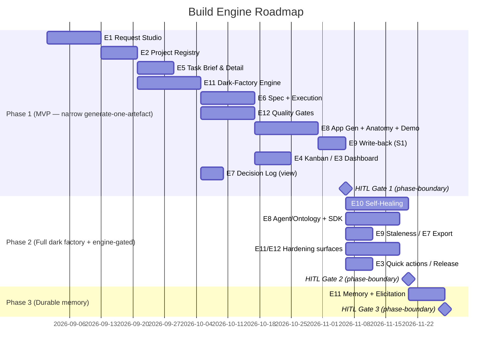

# Roadmap: Build Engine

**Brief:** [brief.md](../01-brief/brief.md) · **PRD:** [prd.md](../02-prd/prd.md)
**Program roadmap:** [../../_program-roadmap.md](../../_program-roadmap.md)
**Status:** Draft

## Position in the build order

Weave build order: **Platform shell → Constitution → Graph Explorer → Build → Events → Onboarding**.
This engine is **#4** (the first generation engine, after the shell and the two model engines).

**Depends on:**

- **Weave Platform (#1)** — the shell and cross-cutting services: `PLAT-SETTINGS-1` (tenancy cascade
  + budget caps + RBAC), `PLAT-BILLING-1` (per-token + per-run metering), `PLAT-AUDIT-1` (immutable
  audit/decision-log view), `PLAT-IDENTITY-1` (dark-factory agent principals + no-self-approval),
  `PLAT-NOTIFY-1` (HITL-gate / budget / generation-failure events), `PLAT-CONNECTOR-1` (Jira/Slack
  handles by reference). DevEx + local→HITL→deploy boundary: `_dev-environment.md`.
- **Constitution Engine (#2)** — `CE-READ-1` (grounding, blast-radius, stakeholder resolution,
  SPARQL), `CE-WRITE-1` (validated write-back `POST /api/operations/apply`), `CE-VERSION-1` (pinned
  version + canonical staleness), `CE-DIFF-1` ("upgrade pin" diff), `CE-BRAND-1` (design tokens +
  VoiceRules for the conformance bar). Every CE-dependent FR is tagged **CE GA** and degrades
  gracefully on outage.
- **Graph Explorer (#3)** — `GE-CANVAS-1` (embeddable project-ontology slice). Consumed only by the
  Phase-2 Project Ontology embed (FR-032); the MVP slice does not block on it.

**Unblocks:**

- **Events & Actions Engine (#5)** — reuses the dark-factory execution + dispatch patterns and the
  shared `BE-SELFIMPROVE-1` signal→issue→dispatch engine; Build's write-back keeps the graph the
  Events Engine automates against alive.
- **Onboarding (#6)** — the Hammerbarn seed is *built* by Build (`BE-ARTEFACT-1` write-back) and
  integrated by Onboarding.
- **Weave Platform** consumes `BE-SELFIMPROVE-1` for Weave-product self-improvement.

Work that is contract-unblocked may run in parallel — see the program roadmap. The MVP contribution
of Build is deliberately the **narrow generate-one-artefact slice** (Phase 1): the program-level MVP
needs Build only to prove **model → generate one working app artefact**, end to end. The full dark
factory, the engine-gated surfaces, and durable agent memory are Phase 2+.

## Phases



---

### Phase 1: Narrow generate-one-artefact slice  ·  MVP

**Goal:** Prove **model → generate** end-to-end with the narrowest Build slice: a product owner
describes a need in Request Studio, an AI-drafted spec is reviewed and approved, the dark factory
executes the resulting tasks under bounded, audited, quality-gated control, **one application
(Next.js UI + FastAPI API) is generated** with measured `CE-BRAND-1` conformance, deployed to a
demo with visual-state captures, and **written back to the Constitution graph** via the validated
path. This is Build's contribution to the program-level thin end-to-end MVP loop. Generation is
scoped to **applications only**; agents, pipelines, dashboards, the typed-SDK/graph-surface OpenAPI
generator, self-healing, the ontology canvas embed, multi-project polish, and durable memory are
deferred.

**Epics:**

| Epic | Description | Stories | Priority | MVP? |
|------|-------------|---------|----------|------|
| EPIC-001 (E1) | Request Studio — NL intake, run-mode selector, AI-drafted brief/PRD/tech-spec, blast-radius, cost-estimate gate, stakeholder sign-off | 4 (S1–S4) | Must Have | yes |
| EPIC-002 (E2) | Project Registry & Settings — projects grid, auto-create from approved request, cascading governance (caps, integrations, secrets, pinned version) | 3 (S1–S3) | Must Have | yes |
| EPIC-003 (E3) | Project Dashboard — at-a-glance status tiles + commit ribbon (quick actions deferred to P2) | 1 of 2 (S1) | Must Have | yes (S1) |
| EPIC-004 (E4) | Kanban & Task Management — six-lane board, task-tree dependency view, board filters | 3 (S1–S3) | Must Have | yes |
| EPIC-005 (E5) | Task Brief & Detail — self-contained typed YAML brief (EARS + DoR/DoD + test map), five-tab Task Detail | 2 (S1–S2) | Must Have | yes |
| EPIC-006 (E6) | Specification Lifecycle & Dark-Factory Execution — spec library/editor, autonomous/interactive/Spike modes, typed result + four-class retry, HITL gates + replan + no-self-approval | 4 (S1–S4) | Must Have | yes |
| EPIC-007 (E7) | Decision Log — per-project filtered view over `PLAT-AUDIT-1` (export deferred to P2) | 1 of 2 (S1) | Must Have | yes (S1) |
| EPIC-008 (E8) | Generation, Anatomy & Deployment — **Application generation** with measured-conformance gates (S1), Anatomy/Wiki auto-index (S3 anatomy), deploy + visual-state capture + demo (S4 demo) | 3 of 5 (S1, S3-anatomy, S4-demo) | Must Have | yes |
| EPIC-009 (E9) | Bidirectional Graph Sync — write generated artefacts back via `BE-ARTEFACT-1` → `CE-WRITE-1` (S1) | 1 of 2 (S1) | Must Have | yes (S1) |
| EPIC-011 (E11) | Dark-Factory Execution Engine — bounded turn cap, PLAN→DELEGATE→ASSESS→CODIFY, dependency-summary handoff, RLS state spine, model routing | 5 of 6 (S1–S5) | Must Have | yes |
| EPIC-012 (E12) | Quality Gates & Spec-Coverage — DoR/DoD gates, full QA category suite, cumulative spec-coverage audit, phase-gate ceremony, pre-scaffold spec-review | 6 of 8 (S1–S6) | Must Have | yes |

> FR mapping (all **P0 / MVP** in PRD §4): FR-001–013, FR-015–027, FR-029, FR-031, FR-033, FR-035,
> FR-041–047, FR-052–055. Partial epics (E3/E7/E8/E9/E11/E12) ship only their P0 stories here;
> their P1 stories move to Phase 2.

**Entry criteria (Definition of Ready):**

- [ ] PRD §1–§7 approved; Phase-1 tech spec (C4, OpenAPI, data-model, ADRs) approved
- [ ] Phase-1 tasks decomposed; **each task brief passes the DoR gate** (FR-046)
- [ ] Upstream contracts available in **dev**: `CE-READ-1`, `CE-WRITE-1`, `CE-VERSION-1`,
      `CE-DIFF-1`, `CE-BRAND-1` (CE GA); `PLAT-SETTINGS-1`, `PLAT-BILLING-1`, `PLAT-AUDIT-1`,
      `PLAT-IDENTITY-1`, `PLAT-NOTIFY-1`, `PLAT-CONNECTOR-1`
- [ ] Tech-spec resolutions recorded for the MVP-blocking open questions: OQ-01 (repo strategy),
      OQ-02 (runtime), OQ-06 (multi-tenant isolation mechanism), OQ-03 (visual-state capture impl)
- [ ] Local-first dev environment (`_dev-environment.md`) stands up via `docker compose up`

**Exit criteria (EARS, measurable, human-signed):**

- [ ] WHEN a product owner submits a Request Studio prompt and picks a run mode THE SYSTEM SHALL
      stream an AI-drafted brief/PRD/tech-spec grounded via `CE-READ-1` and render a blast-radius
      panel showing domains and `modify|consume|NEW` services — verified by E1 integration tests
      (FR-001, FR-003)
- [ ] WHEN a drafted spec's cost estimate exceeds the per-spec cap THE SYSTEM SHALL block project
      creation, AND WHEN all required stakeholders approve THE SYSTEM SHALL auto-create a project
      with a pinned ontology version — verified by E1/E2 tests (FR-004, FR-005, FR-007)
- [ ] WHEN an application is generated from an approved spec THE SYSTEM SHALL commit nothing unless
      SAST, mypy/tsc, delta-scoped mutation ≥70% (default, tunable), package-existence, secret-scan,
      and ≥90% (default, tunable) `CE-BRAND-1` conformance all pass — verified by E8-S1 gate tests
      and a slopsquatted-package hard-block test (FR-029)
- [ ] WHEN a generated artefact is deployed (non-Spike) THE SYSTEM SHALL write its new
      services/APIs/data-assets back via `CE-WRITE-1` (clone→SHACL→422) with PROV-O attribution,
      AND WHEN `CE-WRITE-1` returns 422 THE SYSTEM SHALL feature-flag-rollback the artefact —
      verified by E9-S1 write-back tests (FR-035)
- [ ] WHEN an autonomous run reaches the turn cap (default 60, tunable) OR the binding cost cap THE
      SYSTEM SHALL halt to a HITL gate with state preserved and resumable from the last completed
      CODIFY — verified by E11-S1/S2 resumability tests (FR-041, FR-042)
- [ ] WHEN an agent principal attempts to approve a HITL gate its own action triggered THE SYSTEM
      SHALL reject and log it to `PLAT-AUDIT-1` — verified by the no-self-approval test (FR-026)
- [ ] WHEN a tenant-A principal requests any tenant-B project record, decision-log entry, or graph
      triple THE SYSTEM SHALL return zero tenant-B data — verified by the cross-tenant-read test
      (NFR Isolation, OQ-06)
- [ ] WHEN a phase reaches completion THE SYSTEM SHALL run the cumulative spec-coverage audit and
      halt unless ≥90% of `Must` items are DELIVERED (default, tunable) with zero MISSING, then run
      the phase-gate ceremony (security-review + mutation + doc-gen) — verified by E12-S4/S5 tests
      (FR-052, FR-053)
- [ ] Coverage ≥ 80% (default, tunable) · mutation ≥ 70% (default, tunable) · 0 blocking bugs
- [ ] **Measurable artefact:** one deployed, demonstrable application (UI + API) with a shareable
      demo URL and 8 passing visual-state captures, written back into the company graph
- [ ] **Human sign-off recorded** (always the final exit criterion)

**HITL gates (configurable for this phase — declare which are active):**

| Gate | Active? | Approver | Blocks |
|------|---------|----------|--------|
| Spec-approval (PO/stakeholder sign-off) | **mandatory** | Product owner + resolved stakeholders (FR-005); pre-scaffold spec-review (FR-055) | phase start / scaffold |
| Phase-boundary ceremony (security-review + mutation + doc-gen) | yes | Delivery manager (web Approve/Amend/Reject via `PLAT-NOTIFY-1`, no self-approval — FR-052) | phase-2 |
| Pre-AWS-deploy (full local pyramid + gates green → approve → dev-AWS smoke) | yes | Delivery manager / engineer (env-verification gate FR-050; local→HITL→deploy per `_dev-environment.md`) | deploy |
| Publish/generate (ontology publish / artefact release) | yes | Product owner (write-back FR-035 is the validated graph publish; demo release FR-033) | release |

> HITL gates are project/workspace-configurable; only spec-approval is globally mandatory. In the
> Build Engine dark factory, each client project declares its gates here in its own roadmap. The
> per-task / phase-boundary / failure-only / never trigger policy (FR-025) is itself configurable.

**Phase-gate metadata** (evaluated by the phase-gate Stop hook / `/goal` condition):

```
phase: 1
gate_id: build-engine-gate-1
condition: all_exit_criteria_met
approver: delivery-manager
blocks: phase-2
```

---

### Phase 2: Full dark factory + engine-gated surfaces  ·  Phase 2

**Goal:** Widen the narrow slice into the full Build Engine: additional generation targets (AI
agents, data pipelines), the ontology→typed-SDK + standalone graph-surface OpenAPI generator
(`BE-SDK-1`), the embedded project-ontology canvas, client-app self-healing, artefact staleness,
decision-log export, dashboard quick actions + release planning, and the orchestrator hardening
surfaces (preflight, scaffolding gate, self-verification, isolated investigators, cross-task
finding propagation, reality-drift detection).

**Dependencies:** Phase 1 gate passed; **Graph Explorer `GE-CANVAS-1` GA** (for FR-032);
self-healing AWS signal sources reachable in dev (E10).

**Epics:**

| Epic | Description | Stories | Priority | MVP? |
|------|-------------|---------|----------|------|
| EPIC-003 (E3) | Project Dashboard — quick actions (Run demo / Replan / Plan release / Open Kanban) | 1 of 2 (S2) | Should Have | no |
| EPIC-007 (E7) | Decision Log — export delegated to `PLAT-AUDIT-1` (JSON/NDJSON, signature metadata) | 1 of 2 (S2) | Should Have | no |
| EPIC-008 (E8) | Generation — AI-agent generation (Anthropic Agent SDK, S2), Project Ontology embed (`GE-CANVAS-1`, S3 ontology), release/rollback plan (S4 release), ontology→typed-SDK + standalone graph-surface OpenAPI (`BE-SDK-1`, S5) | 4 surfaces (S2, S3-ontology, S4-release, S5-SDK) | Should Have | no |
| EPIC-009 (E9) | Bidirectional Graph Sync — artefact provenance + staleness (canonical lag via `CE-VERSION-1`) | 1 of 2 (S2) | Should Have | no |
| EPIC-010 (E10) | Client-App Self-Healing — signal collection, issue creation + HITL-gated dispatch, self-healing screen (configures `BE-SELFIMPROVE-1`) | 3 (S1–S3) | Should Have | no |
| EPIC-011 (E11) | Dark-Factory Engine — orchestrator preflight, scaffolding gate, self-verification, isolated investigators (S6, minus durable memory) | 1 of 6 (S6 P1 parts) | Should Have | no |
| EPIC-012 (E12) | Quality Gates — cross-task finding propagation + escalation queue, reality-drift detection | 2 of 8 (S7–S8) | Should Have | no |

> FR mapping (all **P1 / Phase 2** in PRD §4): FR-014, FR-028, FR-030, FR-032, FR-034, FR-036,
> FR-037, FR-038, FR-039, FR-040, FR-048, FR-049, FR-050, FR-051, FR-056, FR-057, FR-059.

**Entry criteria (Definition of Ready):**

- [ ] Phase 1 gate passed and signed off
- [ ] PRD §3 Phase-2 stories approved; Phase-2 tech-spec deltas (E10 signal sources, E8 agent SDK
      runtime — OQ-09, ontology embed) approved
- [ ] Phase-2 tasks decomposed; each task brief passes the DoR gate (FR-046)
- [ ] `GE-CANVAS-1` available in dev (for FR-032); self-healing OQ resolutions recorded
      (OQ-09 agent SDK runtime, OQ-03/OQ-08 already from Phase 1)

**Exit criteria (EARS, measurable, human-signed):**

- [ ] WHEN generation type "Agent" is selected THE SYSTEM SHALL scaffold an Anthropic-Agent-SDK
      agent under a `PLAT-IDENTITY-1` principal using only confirmed model ids (no prototype
      placeholders) — verified by E8-S2 tests (FR-030)
- [ ] WHEN the Project Ontology screen opens THE SYSTEM SHALL embed `GE-CANVAS-1` scoped to the
      project IRI (read-only) and degrade to a `CE-READ-1` entity list on canvas outage — verified
      by E8-S3 tests (FR-032)
- [ ] WHEN "Generate SDK" is triggered on a project pinned to a CE version THE SYSTEM SHALL read the
      BPMO kinds + SHACL shapes via `CE-READ-1` and emit a typed client SDK (TypeScript/npm +
      Python/pip) plus a standalone OpenAPI 3.1 graph-surface contract — both versioned to the pin,
      carrying the `BE-ARTEFACT-1` provenance header, regenerable on a `CE-DIFF-1` delta, and
      client-owned/forkable — AND WHEN `CE-READ-1` is unreachable or the shapes are unresolvable THE
      SYSTEM SHALL fail atomically with no partial package emitted — verified by E8-S5 tests (FR-059)
- [ ] WHEN a WARN/CRITICAL operational signal is raised THE SYSTEM SHALL draft an issue and offer
      dispatch only past the deterministic deny→authority→automatable→HITL gate sequence, with
      **no autonomous merge** — verified by E10-S2 tests (FR-038, FR-039)
- [ ] WHEN the pinned ontology version reaches the canonical lag threshold (default ≥2, configurable)
      THE SYSTEM SHALL mark affected artefacts stale and fire a `PLAT-NOTIFY-1` version-lag event —
      verified by E9-S2 tests (FR-036)
- [ ] WHEN an agent reaches a HITL handoff THE SYSTEM SHALL emit a line-by-line self-verification
      block and STOP the handoff on any `violated` line — verified by E11-S6 tests (FR-048)
- [ ] Coverage ≥ 80% (default, tunable) · mutation ≥ 70% (default, tunable) · 0 blocking bugs
- [ ] **Measurable artefact:** one generated AI agent under a named principal, AND one self-healing
      loop closed (signal → issue → HITL-approved fix → resolved) for a deployed product
- [ ] **Human sign-off recorded** (always the final exit criterion)

**HITL gates (configurable for this phase — declare which are active):**

| Gate | Active? | Approver | Blocks |
|------|---------|----------|--------|
| Spec-approval (PO/stakeholder sign-off) | **mandatory** | Product owner + stakeholders (FR-005); pre-scaffold spec-review (FR-055) | phase start |
| Phase-boundary ceremony (security-review + mutation + doc-gen) | yes | Delivery manager (FR-052, no self-approval) | phase-3 |
| Pre-AWS-deploy (full local pyramid + gates green → approve → dev-AWS smoke) | yes | Delivery manager / Ops (self-healing dispatch to deployed envs; `_dev-environment.md`) | deploy |
| Publish/generate (ontology publish / artefact release) | yes | Product owner / Ops (self-heal fix dispatch FR-039 is HITL-gated, no autonomous merge — D4) | release |

> HITL gates are project/workspace-configurable; only spec-approval is globally mandatory. Self-healing
> dispatch (FR-039) is itself always HITL-gated — no autonomous merge.

**Phase-gate metadata** (evaluated by the phase-gate Stop hook / `/goal` condition):

```
phase: 2
gate_id: build-engine-gate-2
condition: all_exit_criteria_met
approver: delivery-manager
blocks: phase-3
```

---

### Phase 3: Durable agent memory  ·  Later

**Goal:** Give the dark factory continuity across sessions: a per-project, tenant-scoped durable
memory store (committed decisions, conventions, references) injected into agent sessions at run
start, plus a structured elicitation toolkit offered on conflicting requirements, unclear root
cause, or competing approaches — so agents carry project decisions forward rather than
rediscovering them.

**Dependencies:** Phase 2 gate passed; orchestrator session lifecycle (E11-S6 P1 parts) shipped.

**Epics:**

| Epic | Description | Stories | Priority | MVP? |
|------|-------------|---------|----------|------|
| EPIC-011 (E11) | Dark-Factory Engine — per-project durable memory + structured elicitation toolkit (S6 P2 parts) | 1 of 6 (S6 P2 part) | Could Have | no |

> FR mapping (**P2 / Later** in PRD §4): FR-058.

**Entry criteria (Definition of Ready):**

- [ ] Phase 2 gate passed and signed off
- [ ] PRD FR-058 story approved; tenant-scoped memory-store tech-spec delta approved (RLS, OQ-06
      mechanism reused)
- [ ] Phase-3 tasks decomposed; each task brief passes the DoR gate (FR-046)

**Exit criteria (EARS, measurable, human-signed):**

- [ ] WHEN an agent session starts on a project THE SYSTEM SHALL inject the project's tenant-scoped
      durable memory (committed decisions/conventions/references) into its context, AND on
      conflicting requirements / unclear root cause THE SYSTEM SHALL offer the structured elicitation
      toolkit — verified by E11-S6 memory tests (FR-058)
- [ ] Coverage ≥ 80% (default, tunable) · mutation ≥ 70% (default, tunable) · 0 blocking bugs
- [ ] **Measurable artefact:** a project whose second agent session demonstrably reuses a decision
      recorded in the first (no rediscovery), verified by an integration test
- [ ] **Human sign-off recorded** (always the final exit criterion)

**HITL gates (configurable for this phase — declare which are active):**

| Gate | Active? | Approver | Blocks |
|------|---------|----------|--------|
| Spec-approval (PO/stakeholder sign-off) | **mandatory** | Product owner (FR-005) | phase start |
| Phase-boundary ceremony (security-review + mutation + doc-gen) | yes | Delivery manager (FR-052, no self-approval) | engine complete |
| Pre-AWS-deploy (full local pyramid + gates green → approve → dev-AWS smoke) | no | — (no new deployable surface; memory is an internal store) | — |
| Publish/generate (ontology publish / artefact release) | no | — (no new artefact release) | — |

> HITL gates are project/workspace-configurable; only spec-approval is globally mandatory.

**Phase-gate metadata** (evaluated by the phase-gate Stop hook / `/goal` condition):

```
phase: 3
gate_id: build-engine-gate-3
condition: all_exit_criteria_met
approver: delivery-manager
blocks: engine-complete
```

---

## HITL gate summary

| Gate | After phase | Approval criteria | Approver |
|------|-------------|-------------------|----------|
| Gate 1 | Phase 1 (MVP) | All Phase-1 EARS exit criteria met (generate-one-app proven, write-back validated, no-self-approval + cross-tenant tests green, cumulative spec-coverage ≥90% Must DELIVERED / 0 MISSING) + human sign-off | Delivery manager |
| Gate 2 | Phase 2 | All Phase-2 EARS exit criteria met (agent generation, ontology embed, one self-healing loop closed, staleness) + human sign-off | Delivery manager |
| Gate 3 | Phase 3 | Durable-memory reuse demonstrated across sessions + human sign-off | Delivery manager |

> Globally mandatory: **spec-approval** (every phase). Activated for this engine: **phase-boundary
> ceremony** (every phase — generation quality + audit demand it), **pre-AWS-deploy** (Phases 1–2,
> where deployable artefacts exist), **publish/generate** (Phases 1–2, where artefacts release and
> graph write-back publishes). All numeric thresholds are **default X, tunable** per the
> `PLAT-SETTINGS-1` cascade.

---
*Generated by Weave PO agent. Review and approve before proceeding to Technical Architecture.*
