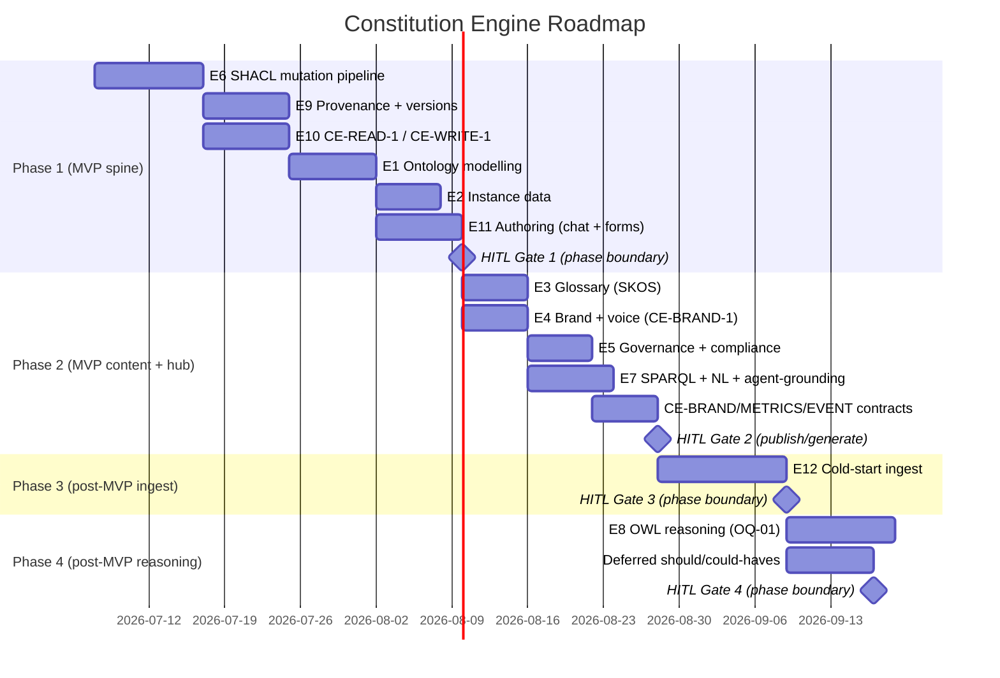

# Roadmap: Constitution Engine

**Brief:** [brief.md](../01-brief/brief.md) · **PRD:** [prd.md](../02-prd/prd.md)
**Program roadmap:** [../../_program-roadmap.md](../../_program-roadmap.md)
**Contracts:** [../../_inter-engine-contracts.md](../../_inter-engine-contracts.md) ·
**Dev environment:** [../../_dev-environment.md](../../_dev-environment.md)
**Status:** Draft

## Position in the build order

Weave build order: **Platform shell (#1) → Constitution Engine (#2) → Graph Explorer (#3) →
Build Engine (#4) → Events & Actions (#5) → Onboarding (#6)**. Platform is the application
**shell** (app/nav/workspace/Cognito/Bedrock/tenancy), not an engine; the Constitution Engine
(CE) is the **first engine** built on that shell. This engine is **#2**.

**Depends on (upstream — Platform shell contracts):**

- **PLAT-IDENTITY-1** — canonical service-principal IRIs for the LLM authoring agent and human
  approvers, written into every PROV-O record and audit entry (FR-006).
- **PLAT-AUDIT-1** — every commit emits a typed audit event; CE PROV-O is the semantic mirror
  (FR-006).
- **PLAT-SETTINGS-1** — tenant isolation, RBAC cascade, and per-scope tunable thresholds resolve
  through the 4-level cascade (FR-025, FR-031, NFR Isolation).
- **PLAT-NOTIFY-1** — SHACL-violation, self-audit-failure, and version notifications (FR-026).
- **PLAT-BILLING-1** — NL/AI authoring + NL-query token usage metered per-token.
- **PLAT-CONNECTOR-1** — connector→graph ingestion writes back through **CE-WRITE-1** (CE does
  not own connectors; consumed only for the ingestion write-path contract).

**Unblocks (downstream — this engine is the contract hub):**

- **CE-READ-1, CE-WRITE-1, CE-DIFF-1, CE-VERSION-1** → Graph Explorer (#3), Build (#4),
  Events (#5), Platform widgets, Onboarding (#6).
- **CE-BRAND-1** → Build (#4) compliant-by-construction generation (conformance bar default 90%,
  tunable).
- **CE-METRICS-1** → Platform Generative Dashboard (CE-sourced widgets = the MVP-eligible set).
- **CE-EVENT-1** (beta) → Events (#5) graph-change triggers (degrade to polling CE-READ-1 by
  since-version until transport lands), Platform live-activity widgets.

CE is on the **MVP thin end-to-end loop**: Platform shell + **CE (model)** + Explorer (visualise)
+ a narrow Build slice (generate ONE artefact). Work that is contract-unblocked may run in
parallel — see the program roadmap. Realtime collab, full Onboarding, and the Events engine are
post-MVP. **Cold-start ingest** (absorbing a client's existing EA/BPMN/document model — the lever
for clients leaving Bizzdesign / LeanIX / MEGA) is **post-MVP but prioritized ahead of the deferred
should-haves**: it lands in Phase 3, before the publish-time-reasoning + deferred-conveniences work
in Phase 4.

## Phases



---

### Phase 1: Validated-Mutation Spine  ·  MVP

**Goal:** Stand up the irreducible "model the business" spine — the **single validated mutation
entry point**, provenance, the draft→published version lifecycle, and the read/write contracts —
then let a user author the upper-ontology framework, a client domain taxonomy, and instances
through **both** chat and guided forms, with every change SHACL-validated on a clone and
PROV-O-stamped. Demonstrable outcome: a user builds a small taxonomy + instances with zero raw
Turtle, every commit is blocked-or-validated, and a downstream caller can read the graph at a
pinned version via CE-READ-1 and write through CE-WRITE-1.

**Epics:**

| Epic | Description | Stories | Priority | MVP? |
|------|-------------|---------|----------|------|
| EPIC-006 | SHACL Validation (cross-cutting) — single clone-then-validate mutation entry point; severity handling | 3 | Must Have | yes |
| EPIC-009 | Provenance & Version Lifecycle — PROV-O + PLAT-AUDIT-1 emit; draft→published; server-side diff | 3 | Must Have | yes |
| EPIC-010 | Stable Read & Write Interfaces — CE-READ-1, CE-WRITE-1 (contract hub core) | 2 | Must Have | yes |
| EPIC-001 | Ontology Modelling (OWL structure) — classes, restrictions, disjointness, import; *E1-S4 reasoning carried to Phase 4* | 3 | Must Have | yes |
| EPIC-002 | Instance Data Population — add/edit/delete (partial-update), browse/search; *E2-S3 bulk-populate carried to Phase 4* | 3 | Must Have | yes |
| EPIC-011 | Authoring Surfaces — persistent chat AND SHACL-shape-driven guided forms; AI-explains; *E11-S4 history carried to Phase 4* | 3 | Must Have | yes |

> Phase-1 covers the P0 FRs that form the spine: FR-001–FR-006, FR-008–FR-014, FR-020, FR-021,
> FR-031–FR-034. E1-S4 (reasoning inference) and E2-S3 (bulk-populate) are explicitly carved out
> to Phase 4; E8 (OWL reasoning, OQ-01-gated) is Phase 4 in full.

**Entry criteria (Definition of Ready):**

- [ ] PRD §1–§4 approved; Phase-1 tech spec approved (C4, OpenAPI for CE-READ-1/CE-WRITE-1,
      data model incl. punning + named-graph layout, SHACL clone-validation flow).
- [ ] Tasks decomposed from EPIC-001/002/006/009/010/011; each TASK brief passes the DoR gate.
- [ ] Upstream Platform-shell contracts available in the shared dev account: **PLAT-IDENTITY-1**
      (principal IRIs), **PLAT-AUDIT-1** (audit emit), **PLAT-SETTINGS-1** (tenant + RBAC cascade);
      mock/offline JWT issuer available for offline unit tests (DX3).
- [ ] Local stack green: Oxigraph + FastAPI + Ollama/Bedrock routing per `_dev-environment.md` §5.

**Exit criteria (EARS, measurable, human-signed):**

- [ ] WHEN any committed change is applied THE SYSTEM SHALL route it through exactly one mutation
      entry point (`POST /api/operations/apply`, CE-WRITE-1), validate it on a throwaway clone,
      and commit only if zero `sh:Violation` — verified by a CI test asserting no auto-apply / raw
      SPARQL-Update write surface exists (FR-003, FR-004).
- [ ] WHEN a batch contains any `sh:Violation` THE SYSTEM SHALL return HTTP 422 and leave the graph
      unchanged (all-or-nothing on the clone) — verified by an integration test exercising
      violation/warning/info severities (FR-004, FR-005).
- [ ] WHEN any change commits THE SYSTEM SHALL write a PROV-O `prov:Activity` recording
      authoring-agent kind (LLM = `prov:SoftwareAgent`, approving human = `prov:Person`) and the
      PLAT-IDENTITY-1 principal IRI, AND emit the same event to PLAT-AUDIT-1 (retried on failure) —
      verified by a test asserting 100% of commits carry both (FR-006).
- [ ] WHEN an author publishes THE SYSTEM SHALL snapshot the draft into an immutable version IRI
      and leave prior published versions byte-identical, and `?version=latest` SHALL resolve to the
      newest published version — verified by a publish-then-read test (FR-008, FR-009).
- [ ] WHEN a downstream caller reads `GET /api/sparql?version=<iri|latest>&page=<n>` THE SYSTEM
      SHALL execute SELECT-only, reject UPDATE/`SERVICE` pre-execution, and paginate (never
      silently truncate) — verified by CE-READ-1 contract tests (FR-010, FR-011).
- [ ] WHEN two published versions are diffed via `GET /api/ontology/diff?from=&to=` THE SYSTEM SHALL
      return server-computed added/removed/**modified nodes AND edges** (an edge-only change appears
      in `modified`) — verified by a CE-DIFF-1 edge-diff test (FR-013); and `GET /api/ontology/versions`
      SHALL be the single source for `is_latest` and canonical version-lag (FR-014).
- [ ] WHEN an author uses chat OR guided forms THE SYSTEM SHALL author classes/instances with no
      raw Turtle, applying partial-update semantics (only named properties retracted/asserted) —
      verified by an edit-omitting-position test proving position survives (FR-002, FR-034, FR-001,
      FR-033); WHEN the AI provider is unavailable THE SYSTEM SHALL return 503 on NL surfaces while
      forms/browse stay live (FR-001, FR-033).
- [ ] WHEN a tenant-A JWT issues an unscoped SPARQL query THE SYSTEM SHALL return zero tenant-B
      triples — verified by the mandatory cross-tenant-read test (NFR Isolation, FR-032).
- [ ] Coverage ≥ 80% (default, tunable) · mutation ≥ 70% (default, tunable) · 0 blocking bugs.
- [ ] **Measurable artefact:** a published version IRI with ≥ 1 client class + ≥ 1 instance
      authored end-to-end via forms and chat, readable through CE-READ-1 at that pin.
- [ ] **Human sign-off recorded** (always the final exit criterion).

**HITL gates (configurable for this phase — declare which are active):**

| Gate | Active? | Approver | Blocks |
|------|---------|----------|--------|
| Spec-approval (PO/stakeholder sign-off) | **mandatory** | Product Owner + Ontology lead | phase start |
| Phase-boundary ceremony (security-review + mutation + doc-gen) | yes | Eng lead | Phase 2 |
| Pre-AWS-deploy (full local pyramid + gates green → approve → dev-AWS smoke) | yes | Eng lead | dev-AWS deploy |
| Publish/generate (ontology publish / artefact release) | no | — | n/a (no external publish yet) |

> HITL gates are project/workspace-configurable; only spec-approval is globally mandatory. The
> security-review sub-gate is load-bearing this phase: the single-mutation-entry-point invariant
> (FR-003) and cross-tenant isolation (NFR Isolation) are security properties that must pass before
> any dev-AWS deploy. In the Build Engine dark factory, each client project declares its gates here
> in its own roadmap.

**Phase-gate metadata** (evaluated by the phase-gate Stop hook / `/goal` condition):

```
phase: 1
gate_id: constitution-engine-gate-1
condition: all_exit_criteria_met
approver: eng-lead
blocks: phase-2
```

---

### Phase 2: Governed Content + Query + Contract Hub  ·  MVP

**Goal:** Complete the MVP within-MVP sequence (brief §Timeline allows brand/glossary/governance
content to follow the core authoring loop): add the SKOS glossary (punned with OWL classes),
governed brand/voice standards, tenant-scoped governance SHACL shapes, and the SPARQL + NL query
surfaces — and finish the contract hub (CE-BRAND-1, CE-METRICS-1, and the beta CE-EVENT-1; the
CE-READ-1/WRITE-1/DIFF-1/VERSION-1 core landed in Phase 1). Demonstrable outcome: a compliance
officer encodes a rule as a tenant-scoped shape enforced on later edits (and proven not to leak to
another tenant); a business user answers a plain-English question without SPARQL; Build can read
brand tokens via CE-BRAND-1. By the end of this phase all seven `CE-*` contracts are exposed — the
narrow Build slice and Explorer consume them.

**Epics:**

| Epic | Description | Stories | Priority | MVP? |
|------|-------------|---------|----------|------|
| EPIC-003 | SKOS Controlled Vocabulary (Glossary) — punned class+concept (B1), search/browse | 3 | Must Have | yes |
| EPIC-004 | Brand & Voice Standards — governed individuals + VoiceRules; CE-BRAND-1 projection | 2 | Must/Should | yes |
| EPIC-005 | Governance & Compliance Rules — tenant-scoped SHACL shapes + browse; *E5-S2 self-audit scheduling carried to Phase 4* | 2 | Must Have | yes |
| EPIC-007 | SPARQL Query & NL Query — SELECT-only editor (B3) + NL→SELECT + **agent-grounding SELECTs (E7-S4)**; *E7-S3 saved queries carried to Phase 4* | 3 | Must/Should | yes |

> Phase-2 covers the remaining content/query/hub FRs: FR-016 (CE-BRAND-1), FR-017 (CE-METRICS-1),
> FR-018, FR-019, FR-022, FR-023, FR-024, FR-025, FR-027, **FR-036 (agent-grounding, read-side over
> CE-READ-1 — no new contract), FR-037 (framework + client competency-question set)**, and FR-015
> (CE-EVENT-1, **beta** — Should-Have for Events). **CE-DIFF-1 (FR-013) and CE-VERSION-1 (FR-014)
> land in Phase 1 with EPIC-009** (E9-S2/E9-S3) — they are not re-claimed here. The Should-Have
> stories E2-S3 (bulk-populate, FR-030), E5-S2 self-audit *scheduling* (FR-026), E4-S2 VoiceRule
> *extraction*, and E7-S3 saved queries (FR-035) sequence to Phase 4 unless pulled forward by
> capacity; cold-start ingest (FR-038–FR-042) is Phase 3.

**Entry criteria (Definition of Ready):**

- [ ] Phase 1 gate passed (spine green, human sign-off recorded).
- [ ] PRD §5 (Inter-engine Interfaces) approved; Phase-2 tech spec approved (CE-BRAND-1 token
      projection, SHACL shapes-graph layout, NL→SPARQL prompt/guardrails, CE-EVENT-1 transport
      decision OQ-12).
- [ ] Tasks decomposed from EPIC-003/004/005/007 + contract-finalisation tasks; each passes DoR.
- [ ] **PLAT-NOTIFY-1** available (self-audit-failure + version notifications, FR-026);
      **PLAT-SETTINGS-1** cascade confirmed for tenant-scoped shapes (FR-025).

**Exit criteria (EARS, measurable, human-signed):**

- [ ] WHEN a glossary term is created THE SYSTEM SHALL persist a single punned URI that is both
      `owl:Class` and `skos:Concept` (B1), enforce one `skos:prefLabel`/lang + one `skos:definition`
      via SHACL (`inference='none'`), and return 422 on a second prefLabel/lang — verified by a
      punning + duplicate-label test (FR-022, FR-023).
- [ ] WHEN a compliance officer describes a rule THE SYSTEM SHALL store the generated `sh:NodeShape`
      in **this tenant's** shapes graph (never global) with its own PROV-O, enforce it on later
      edits, and invalidate validation caches across all workers — verified by the **cross-tenant
      shape-leak test** (tenant-A shape, tenant-B commit unaffected) (FR-025).
- [ ] WHEN a user asks a plain-English question THE SYSTEM SHALL generate and execute a SPARQL
      SELECT, show the generated query, and ask a clarifying question rather than hallucinate;
      WHEN the AI is unavailable THE SYSTEM SHALL return 503 while the raw SELECT-only editor stays
      live — verified by NL-query + 503-fallback tests (FR-018, FR-019).
- [ ] WHEN Build reads `GET /api/brand/tokens` and `GET /api/brand/voice-rules` THE SYSTEM SHALL
      return flattened design-token JSON + machine-evaluable VoiceRules, excluding any brand
      individual that fails its SHACL shape — verified by a CE-BRAND-1 contract test (FR-016, FR-024).
- [ ] WHEN a graph change commits THE SYSTEM SHALL emit a CE-EVENT-1 change event
      `{change_type, entity_iri, version_iri, actor, ts}` (beta; consumers may degrade to polling
      CE-READ-1 by since-version) — verified by a one-commit-one-event test (FR-015).
- [ ] WHEN `GET /api/validate` is called THE SYSTEM SHALL return a full tenant-scoped SHACL report
      (violations/warnings/info); bad version → 404; no JWT → 401 — verified by FR-027 tests; and
      `GET /api/metrics/ontology` SHALL return the documented shape for the Platform Dashboard
      (FR-017).
- [ ] WHEN a caller issues a built-in agent-authority SELECT over CE-READ-1 THE SYSTEM SHALL answer
      "what may an agent do, on which systems/data/process, who to escalate to" from the modelled
      `governedBy`/`performedBy`/`accesses` links — an **unstated** permission resolves to
      **deny / route-to-human** (default, tunable), an **explicit deny** overrides inferred authority,
      and a **missing required link** (e.g. a process with no `performedBy`) returns an explicit
      **coverage-gap row**, never an empty result read as "permitted" — verified by an
      agent-grounding test, no new contract minted (FR-036, E7-S4). The shipped **framework
      competency-question set** SHALL return for the seeded graph and a client with < 2 declared
      domain competency questions SHALL be flagged at onboarding (FR-037).
- [ ] Coverage ≥ 80% (default, tunable) · mutation ≥ 70% (default, tunable) · 0 blocking bugs.
- [ ] **Measurable artefact:** all seven `CE-*` contracts exposed at the §5 shapes; one
      tenant-scoped governance shape enforced on a later edit; one brand token consumed by a
      CE-BRAND-1 contract test.
- [ ] **Human sign-off recorded** (always the final exit criterion).

**HITL gates (configurable for this phase — declare which are active):**

| Gate | Active? | Approver | Blocks |
|------|---------|----------|--------|
| Spec-approval (PO/stakeholder sign-off) | **mandatory** | Product Owner + Compliance lead | phase start |
| Phase-boundary ceremony (security-review + mutation + doc-gen) | yes | Eng lead | Phase 3 |
| Pre-AWS-deploy (full local pyramid + gates green → approve → dev-AWS smoke) | yes | Eng lead | dev-AWS deploy |
| Publish/generate (ontology publish / artefact release) | yes | Ontology lead + Compliance lead | first CE-* contract publish to downstream engines |

> The **publish/generate** gate activates this phase because Phase 2 first exposes the `CE-*`
> contracts that Graph Explorer and the narrow Build slice consume — publishing a contract version
> downstream is a release event. The cross-tenant shape-leak property (FR-025) is part of the
> security-review sub-gate.

**Phase-gate metadata** (evaluated by the phase-gate Stop hook / `/goal` condition):

```
phase: 2
gate_id: constitution-engine-gate-2
condition: all_exit_criteria_met
approver: eng-lead
blocks: phase-3
```

---

### Phase 3: Cold-Start Ingest  ·  Post-MVP (prioritized)

**Goal:** Solve the blank-page cold-start problem — let a client absorb the model they already hold
in documents, EA/BPMN tool exports, diagrams, and structured data, so they populate the graph from
what they have instead of from scratch (the adoption lever for clients leaving Bizzdesign / LeanIX /
MEGA). Every ingest path writes through the **single** validated mutation entry point (CE-WRITE-1)
with PROV-O attribution and reuses the propose-mutations + find-existing-node reconciliation flow —
no second mutation path. This phase is **post-MVP but prioritized ahead of the deferred
should-haves** (Phase 4): it sequences after the MVP authoring loop but before the reasoning +
conveniences work. Demonstrable outcome: a user uploads an existing enterprise document and, through
the chat panel, accepts agent-proposed additions **linked to existing graph resources**, each
committed via CE-WRITE-1 with PROV-O attribution.

**Epics:**

| Epic | Description | Stories | Priority | MVP? |
|------|-------------|---------|----------|------|
| EPIC-012 | Artefact & Document Ingest — conversational document ingest (**E12-S1, USER PRIORITY, Must-within-epic**), ArchiMate/BPMN structured import, image-to-data, R2RML/RML structured-data import, SKOS cross-notation reconciliation | 5 | Should Have (E12-S1 Must-within-epic) | no (post-MVP, prioritized) |

> Phase-3 covers FR-038 (conversational ingest, the `[USER PRIORITY]` Must-within-epic), FR-039
> (ArchiMate/BPMN import), FR-040 (image-to-data), FR-041 (R2RML/RML structured-data import), and
> FR-042 (SKOS cross-notation reconciliation). All five are **materialised-copy** import through
> CE-WRITE-1 — distinct from the platform's live connectors (PLAT-CONNECTOR-1) and explicitly NOT
> query-time SPARQL→SQL federation (OQ-17). Ingest is AI-*assisted*, per-proposal human-reviewed, and
> SHACL-gated; it is never sold as zero-effort liveness (PRD §10 risk).

**Entry criteria (Definition of Ready):**

- [ ] Phase 2 gate passed (all CE-* contracts exposed, MVP authoring loop green, human sign-off).
- [ ] Phase-3 (ingest) tech spec approved: the element-type→BPMO-kind mapping table
      (ArchiMEO / archimate2rdf as *reference*, not dependency), the per-notation well-formedness
      SHACL shapes, the R2RML/RML mapping authoring+storage+execution layer, and the confidence /
      similarity defaults (0.6 / 0.85, OQ-18).
- [ ] Tasks decomposed from EPIC-012; each passes DoR. The CI no-second-mutation-path assertion is
      extended to cover every ingest route.

**Exit criteria (EARS, measurable, human-signed):**

- [ ] WHEN a user uploads an enterprise document THE SYSTEM SHALL extract BPMO candidates, propose
      them **through the chat panel linked to existing resources** (same-label + same-kind reuse, not
      duplication), commit each accepted proposal via CE-WRITE-1 with PROV-O attributing the LLM as
      extractor, the human as approver, and the source doc as `prov:used`, flag low-confidence
      (default 0.6, tunable) for explicit review, and on AI-unavailable return 503 with **no partial
      commit** — verified by a re-mention-reuses-not-duplicates test and a 503-commits-nothing test
      (FR-038, E12-S1).
- [ ] WHEN an ArchiMate Exchange Format or BPMN file is imported THE SYSTEM SHALL convert it to RDF
      through CE-WRITE-1 with a per-notation well-formedness SHACL check, map element types to BPMO
      kinds (BPMN task→Activity, BPMN event→Event, ArchiMate application-component→System/Service),
      default unmapped elements to **Concept** (tunable) and list them, and reject a malformed file
      before any commit while a partially-valid file commits only valid elements — verified by a
      BPMN-task→Activity test and a malformed-file-commits-nothing test (FR-039).
- [ ] WHEN a diagram/image is uploaded THE SYSTEM SHALL route vision-extracted BPMO entities through
      the same per-proposal review + CE-WRITE-1 commit as E12-S1, flag sub-threshold confidence
      (default 0.6, tunable), and on an unreadable image propose nothing with no partial commit —
      verified by a routes-through-CE-WRITE-1 test (FR-040).
- [ ] WHEN structured data is imported via R2RML (relational/CMDB) or RML (CSV/JSON/XML) THE SYSTEM
      SHALL materialise RDF through CE-WRITE-1 (materialised copy, NOT query-time federation),
      SHACL-validate per row with skip-and-report, sample ≥ N rows for datatype inference (default 20,
      tunable), and reject a malformed mapping before any commit leaving the store untouched —
      verified by a failing-rows-skipped + malformed-mapping-no-op test (FR-041).
- [ ] WHEN the same concept arrives from multiple notations THE SYSTEM SHALL collapse duplicates to
      **one punned `owl:Class` + `skos:Concept`** (decision B1, no separate linking property) via the
      find-existing-node flow, propose a merge only above the similarity threshold (default 0.85,
      tunable) for human confirm, never auto-merge below it, and block a merge that would violate
      SHACL — verified by a cross-notation-collapse + sub-threshold-not-merged test (FR-042).
- [ ] **No ingest path bypasses validation:** a CI test asserts every Epic-12 route writes only
      through CE-WRITE-1 (clone-then-validate) and introduces no second mutation entry point (PRD §10
      risk).
- [ ] Coverage ≥ 80% (default, tunable) · mutation ≥ 70% (default, tunable) · 0 blocking bugs.
- [ ] **Measurable artefact:** one enterprise document ingested end-to-end — agent-proposed additions
      linked to ≥ 1 existing graph resource, accepted per-proposal, committed via CE-WRITE-1 with a
      PROV-O activity naming the source document.
- [ ] **Human sign-off recorded** (always the final exit criterion).

**HITL gates (configurable for this phase — declare which are active):**

| Gate | Active? | Approver | Blocks |
|------|---------|----------|--------|
| Spec-approval (PO/stakeholder sign-off) | **mandatory** | Product Owner + Ontology lead | phase start |
| Phase-boundary ceremony (security-review + mutation + doc-gen) | yes | Eng lead | Phase 4 |
| Pre-AWS-deploy (full local pyramid + gates green → approve → dev-AWS smoke) | yes | Eng lead | dev-AWS deploy |
| Publish/generate (ontology publish / artefact release) | no | — | n/a (ingest populates the draft; no new downstream contract) |

> The **per-proposal human-in-the-loop** review is load-bearing this phase (it is the trust boundary
> for AI-extracted content), and the security-review sub-gate must confirm **no ingest route bypasses
> CE-WRITE-1's prospective SHACL validation** (PRD §10 risk: "ingest reintroduces a second,
> unvalidated mutation path").

**Phase-gate metadata** (evaluated by the phase-gate Stop hook / `/goal` condition):

```
phase: 3
gate_id: constitution-engine-gate-3
condition: all_exit_criteria_met
approver: eng-lead
blocks: phase-4
```

---

### Phase 4: Publish-Time Reasoning + Deferred Should-Haves  ·  Post-MVP

**Goal:** Add publish-time OWL reasoning (the OQ-01-gated capability) — per-version inferred named
graphs and a pre-publish consistency check — and land the deferred Should/Could-Have authoring
conveniences (bulk-populate, scheduled self-audit, VoiceRule extraction, saved queries). This phase
is **engine-/decision-gated**: it cannot start until the tech spec resolves OQ-01 (which OWL
reasoner ships, tractable at 500k triples). It is not on the MVP thin loop.

**Epics:**

| Epic | Description | Stories | Priority | MVP? |
|------|-------------|---------|----------|------|
| EPIC-008 | OWL Reasoning — pre-publish consistency check (Must, OQ-01-gated) + per-version inference materialisation (Should) | 2 | Must/Should | no (post-MVP) |
| EPIC-001 (carry) | E1-S4 — reasoning surfaces inferences (Should; OQ-01) | 1 | Should Have | no |
| EPIC-002 (carry) | E2-S3 — bulk-populate via CSV/table with datatype inference (FR-030) | 1 | Should Have | no |
| EPIC-005 (carry) | E5-S2 — scheduled self-audit gap queries + PLAT-NOTIFY-1 on failure (FR-026) | 1 | Should Have | no |
| EPIC-007 (carry) | E7-S3 — server-side, workspace-scoped saved queries (FR-035) | 1 | Could Have | no |
| EPIC-011 (carry) | E11-S4 — server-side conversation persistence (OQ-08) | 1 | Should Have | no |

> EPIC-007's E7-S4 (agent-grounding, FR-036) is **not** carried here — it ships in Phase 2 as
> read-side SPARQL over CE-READ-1.

> Phase-4 covers FR-007, FR-028, FR-029 (reasoning, OQ-01-gated), FR-030 (bulk-populate), FR-026
> scheduling, and FR-035 (saved queries). Note: FR-007 (consistency check) is *Must-Have* at PRD
> level but its **timing** is publish-time and its **reasoner** is OQ-01-gated, so it lands here once
> OQ-01 resolves; the MVP publish path in Phase 1–2 publishes without the heavy reasoner and is
> upgraded in place. The exact split between "consistency-check-only" and "full inference
> materialisation" is the OQ-01 fallback lever (see PRD §10 Risks).

**Entry criteria (Definition of Ready):**

- [ ] Phase 3 gate passed (cold-start ingest delivered, human sign-off recorded).
- [ ] **OQ-01 resolved** in the tech spec: OWL reasoner chosen, tractability confirmed at the target
      scale, reasoner budget (default 30 s, tunable) fixed.
- [ ] Phase-4 tech spec approved (per-version inferred named-graph layout, inferred-triple labelling,
      bulk-populate mapping/datatype-inference flow).
- [ ] Tasks decomposed; each passes DoR.

**Exit criteria (EARS, measurable, human-signed):**

- [ ] WHEN an author publishes THE SYSTEM SHALL run an OWL consistency check first and block the
      publish with the affected classes + violated axioms if inconsistent (and block, never publish
      unchecked, if the reasoner is unavailable) — verified by an inconsistent-draft-cannot-publish
      test (FR-007).
- [ ] WHEN a version is published THE SYSTEM SHALL materialise inferred triples into a per-version
      inferred named graph (e.g. `weave:graph/v1.2.0/inferred`), label them as inferred, and ensure
      a pinned read of v1.2 never sees v1.3 inferences; a reasoner timeout (default 30 s, tunable)
      SHALL produce no partial inferred graph — verified by a pinned-read isolation test (FR-028,
      FR-029).
- [ ] WHEN a user uploads a CSV/table THE SYSTEM SHALL present a column→property mapping with xsd
      datatype inferred from ≥ N sampled rows (default 20, tunable) for human correction before any
      commit, flag+skip rows failing SHACL with a per-row reason, and commit the rest with a summary
      — verified by a mixed-validity bulk-import test (FR-030).
- [ ] Coverage ≥ 80% (default, tunable) · mutation ≥ 70% (default, tunable) · 0 blocking bugs.
- [ ] **Measurable artefact:** one published version with a per-version inferred named graph showing
      ≥ 1 labelled inferred triple, OR a recorded reasoner-timeout that produced no partial graph;
      one bulk-import run with a committed-vs-skipped summary.
- [ ] **Human sign-off recorded** (always the final exit criterion).

**HITL gates (configurable for this phase — declare which are active):**

| Gate | Active? | Approver | Blocks |
|------|---------|----------|--------|
| Spec-approval (PO/stakeholder sign-off) | **mandatory** | Product Owner + Ontology lead | phase start |
| Phase-boundary ceremony (security-review + mutation + doc-gen) | yes | Eng lead | GA / next engine |
| Pre-AWS-deploy (full local pyramid + gates green → approve → dev-AWS smoke) | yes | Eng lead | dev-AWS deploy |
| Publish/generate (ontology publish / artefact release) | yes | Ontology lead | publishing a reasoned/inferred version downstream |

**Phase-gate metadata** (evaluated by the phase-gate Stop hook / `/goal` condition):

```
phase: 4
gate_id: constitution-engine-gate-4
condition: all_exit_criteria_met
approver: eng-lead
blocks: ga
```

---

## HITL gate summary

| Gate | After phase | Approval criteria | Approver |
|------|-------------|-------------------|----------|
| Gate 1 | Phase 1 (spine) | All Phase-1 EARS exit criteria met (single mutation entry point, PROV-O + audit, version lifecycle, CE-READ-1/WRITE-1, cross-tenant isolation) + human sign-off | Eng lead (security-review + phase-boundary ceremony) |
| Gate 2 | Phase 2 (content + hub) | All Phase-2 EARS exit criteria met (glossary punning, tenant-scoped shapes + shape-leak test, NL/SPARQL query, agent-grounding deny-default + coverage-gap, all 7 CE-* contracts exposed) + **publish gate** for first downstream contract release + human sign-off | Eng lead + Ontology/Compliance leads |
| Gate 3 | Phase 3 (cold-start ingest) | All Phase-3 EARS exit criteria met (conversational/structured/image/structured-data ingest + cross-notation reconciliation, all via CE-WRITE-1 with PROV-O, no second mutation path) + per-proposal HITL + human sign-off | Eng lead + Ontology lead |
| Gate 4 | Phase 4 (reasoning + deferred) | All Phase-4 EARS exit criteria met (OQ-01-resolved reasoning, per-version inference, bulk-populate) + human sign-off | Eng lead + Ontology lead |

> Gate configuration is per project/workspace. Only **spec-approval** is globally mandatory across
> all four phases; phase-boundary, pre-AWS-deploy, and publish/generate gates are activated per the
> tables above for this engine. All numeric thresholds (coverage ≥ 80%, mutation ≥ 70%, page sizes,
> reasoner budget, sampling N, conformance ≥ 90%) are **default X, tunable** per workspace via
> PLAT-SETTINGS-1.

---
*Generated by Weave PO agent. Review and approve before proceeding to Technical Architecture.*
