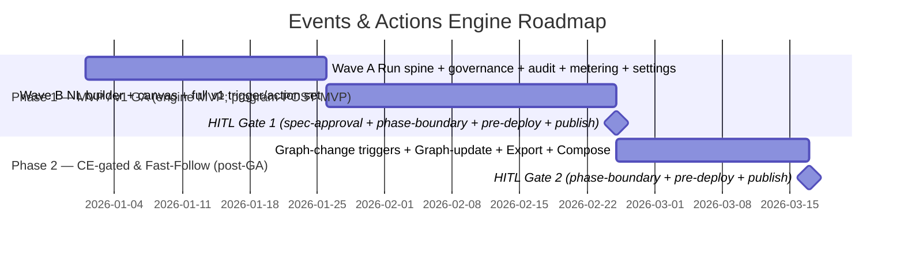

# Roadmap: Events & Actions Engine

**Brief:** [brief.md](../01-brief/brief.md) · **PRD:** [prd.md](../02-prd/prd.md)
**Program roadmap:** [../../_program-roadmap.md](../../_program-roadmap.md)
**Status:** Draft

> **DRAFT** — not yet human-confirmed (`confirmed_by: none`).

## Position in the build order

Weave build order: **Platform shell (#1) → Constitution Engine (#2) → Graph Explorer (#3) →
Build Engine (#4) → Events & Actions (#5) → Onboarding (#6)**. This engine is **#5, and the whole
engine is POST-MVP** — the program MVP is the thin model→generate loop (Platform shell + CE +
Explorer + a narrow Build slice). Events & Actions ships after that loop is proven; nothing in this
roadmap is on the program-MVP critical path. Phase 1 below is the *engine's own* MVP / v1 GA.

**Depends on (consumed contracts, cited from [`_inter-engine-contracts.md`](../../_inter-engine-contracts.md)):**

| Upstream | Contracts | Needed by phase |
|---|---|---|
| Platform shell (#1) | `PLAT-AUDIT-1`, `PLAT-NOTIFY-1`, `PLAT-IDENTITY-1`, `PLAT-CONNECTOR-1`, `PLAT-BILLING-1`, `PLAT-SETTINGS-1` | Phase 1 (run spine, governance, connectors, metering, settings) |
| Constitution Engine (#2) | `CE-READ-1`, `CE-VERSION-1`, `CE-DIFF-1` | Phase 1 (grounding, NL resolve, version pin, upgrade diff) |
| Constitution Engine (#2) | `CE-EVENT-1` (graph-change stream), `CE-WRITE-1` (graph update) | Phase 2 (degrade to `CE-READ-1` polling if `CE-EVENT-1` transport not ready) |
| Build Engine (#4) | `BE-SELFIMPROVE-1` (signal→issue→dispatch) | Phase 1 (on-failure "create self-healing issue" action; HITL-gated) |

**Provides (this engine exposes):** `EA-AUTOMATION-1` — the two-tier automation model. **Unblocks:**
**Onboarding (#6)** (Hammerbarn example automations) and the **Platform dashboard** (automation/run
health widgets). Work that is contract-unblocked may run in parallel — see the program roadmap.

> Cross-engine dependency note: Phase 2 epics are gated on CE contracts (`CE-EVENT-1`, `CE-WRITE-1`)
> landing. If those slip, Phase 2 graph-change triggers degrade to `CE-READ-1` since-version polling
> (no push-only claim) and the graph-update action stays Should-Have — neither blocks v1 GA.

## Phases



> Durations are indicative sequencing placeholders (default, tunable), not committed estimates.
> The Wave A / Wave B split inside Phase 1 is a *sequencing* device, not a gate boundary (both waves
> are MVP-tagged and gate together at Gate 1) — see the Phase 1 sequencing note.

---

### Phase 1: MVP / v1 GA  ·  engine MVP (program-POST-MVP)

**Goal:** Ship the Constitution-Engine-grounded core: a user describes an automation in plain
language grounded in a published ontology process, refines it on the visual canvas, tests it,
activates it, and it runs reliably (at-least-once, per-step idempotency), governed by the
deterministic HITL gate, metered to `PLAT-BILLING-1`, and audited as a VIEW over `PLAT-AUDIT-1`.
This phase reaches **v1 GA**. Demonstrable outcome: the goods-inward NL prompt → grounded
Webhook → Slack automation, authored end-to-end via the Builder, activated, and run.

**Epics:**

| Epic | Description | Stories | Priority | MVP? |
|------|-------------|---------|----------|------|
| EPIC-001 | Automation Registry — list, status, health indicators, CE-derived labels | 2 | Must Have | yes |
| EPIC-002 | Natural-Language Automation Builder — NL describe/refine/test/activate, grounded via `CE-READ-1` | 3 | Must Have | yes |
| EPIC-003 | Visual Flow Canvas — full node set; canvas + chat as projections of one canonical definition | 2 | Must Have | yes |
| EPIC-004 (S1–S3) | Trigger Sources (MVP set) — webhook, Atlassian (Jira), ServiceNow, cron, Slack (S4 graph-change → Phase 2) | 3 | Must Have | yes |
| EPIC-005 (S1–S3, S5) | Action Types (MVP set) — Slack notification, API call, agent run, HITL gate (S4 graph update → Phase 2) | 4 | Must Have | yes |
| EPIC-006 | Ontology Grounding — grounding required for activation; published-version pin (`CE-READ-1`/`CE-VERSION-1`/`CE-DIFF-1`) | 2 | Must Have | yes |
| EPIC-007 (S1 interpreter) | Two-Tier Model — auto-tier simple/complex, interpreter-first (export + S2 composition → Phase 2) | 1 | Must Have | yes |
| EPIC-008 | Run Engine & Reliability — at-least-once, per-step idempotency, durable paused runs, retry/DLQ, metering | 3 | Must Have | yes |
| EPIC-009 | Audit & Compliance Reporting — emit run/step events to `PLAT-AUDIT-1`; compliance report VIEW | 2 | Must Have | yes |
| EPIC-010 | Templates & Library — ≥ 6 templates ship at v1 GA (FR-034); CE-contract-dependent template *activation* defers to Phase 2 | 1 | Should Have | yes |
| EPIC-011 | Automation Settings — resolved through the `PLAT-SETTINGS-1` cascade (tighter-wins) | 1 | Must Have | yes |

> **Phase 1 sequencing note (tradeoff surfaced per Law 1):** Phase 1 is large. It may be delivered as
> two internal waves — **Wave A** the run spine, governance gate, audit/metering, settings, grounding
> (EPIC-001, 006, 008, 009, 011 + the governance/secret-scan invariants of E5-S5/FR-022/FR-023/FR-008),
> then **Wave B** the NL builder, canvas, and full trigger/action set (EPIC-002, 003, 004 S1–S3, 005
> S1–S3+S5, 007 interpreter, 010). This is a sequencing convenience only: every epic in both waves is
> MVP-tagged, so they share one Definition-of-Ready, one set of exit criteria, and **gate together at
> Gate 1**. No phase boundary is manufactured between the waves.

**Entry criteria (Definition of Ready):**

- [ ] PRD section approved; Phase-1 tech spec approved (run-engine runtime model OQ-09, storage OQ-02,
      isolation OQ-11, webhook ingestion OQ-07, canvas framework OQ-01/bindings OQ-08, agent-run runtime
      OQ-09, principal granularity OQ-10 resolved enough to build)
- [ ] Tasks decomposed; each task brief passes the DoR gate
- [ ] Upstream contracts available in the shared dev account: `PLAT-AUDIT-1`, `PLAT-NOTIFY-1`,
      `PLAT-IDENTITY-1`, `PLAT-CONNECTOR-1` (Atlassian/ServiceNow/Slack), `PLAT-BILLING-1`,
      `PLAT-SETTINGS-1`, and `CE-READ-1`/`CE-VERSION-1`/`CE-DIFF-1`
- [ ] Local stack per `_dev-environment.md` (LocalStack SQS/SNS run engine, mock connectors, Oxigraph,
      Postgres, Redis; Bedrock for agentic actions)

**Exit criteria (EARS, measurable, human-signed):**

- [ ] WHEN a user describes an automation in NL referencing a CE process THE SYSTEM SHALL resolve the
      entity via `CE-READ-1`, draft a grounded simple-tier automation pinned via `CE-VERSION-1`, and
      NOT fabricate an IRI if CE is unreachable — verified by the NL-grounding test (FR-004, FR-005).
- [ ] WHEN a canvas edit and an AI edit target the canonical definition concurrently THE SYSTEM SHALL
      resolve by optimistic last-writer-wins and show the loser the diff (no silent merge); and a
      cyclic/disconnected graph SHALL block activation — verified by the projection + canvas-validation
      tests (FR-010, FR-011).
- [ ] WHEN a trigger event is enqueued THE SYSTEM SHALL consume it from SQS, dedupe by `run_id`, and on
      mid-run redelivery skip completed steps via idempotency markers and replay from the last
      incomplete step — verified by the at-least-once + per-step idempotency tests (FR-029).
- [ ] WHEN a HITL gate fires THE SYSTEM SHALL ack the run off SQS, persist it as a durable paused-run
      record, notify the approver via `PLAT-NOTIFY-1`, resume on approval, and emit the decision to
      `PLAT-AUDIT-1` — verified by the paused-run lifecycle E2E (FR-029b, FR-023).
- [ ] WHEN any autonomous action targets a non-`automatable` step THE SYSTEM SHALL route it to a human
      regardless of value threshold, and an automation's own principal SHALL NOT approve its gate —
      verified by the deterministic governance-gate test (FR-022, FR-023, no-self-approval).
- [ ] WHEN a webhook is received THE SYSTEM SHALL resolve the tenant from an opaque server-side token
      before touching any tenant resource, require HMAC-SHA256 for write/external automations, and route
      bad-sig/unknown-token/oversize/schema-mismatch to DLQ with a typed reason — verified by the
      webhook-security test (FR-012).
- [ ] WHEN a Slack-notification, API-call, or agent-run action runs THE SYSTEM SHALL apply
      interpolation with run-time egress secret-scrub, follow the Error-Handler retry/DLQ policy, run
      the agent under a `PLAT-IDENTITY-1` least-privilege principal, and prevent duplicate side effects
      on redelivery — verified by the action-execution tests (FR-018, FR-019, FR-020, FR-008b).
- [ ] WHEN a retry policy is exhausted THE SYSTEM SHALL move the event to the per-workspace DLQ, emit a
      `PLAT-NOTIFY-1` event, expose DLQ depth as a CloudWatch metric, and offer "Retry from DLQ" —
      verified by the retry/DLQ test (FR-030).
- [ ] WHEN a run terminates THE SYSTEM SHALL emit a per-run metering event to `PLAT-BILLING-1` on a
      separate queue (durably buffered if unavailable, never dropped), and emit typed append-only
      `PLAT-AUDIT-1` run/step events keeping no independent signed store; a delete attempt SHALL be
      rejected and logged — verified by the metering + audit-emit tests (FR-031, FR-032).
- [ ] WHEN an automation has no grounding link to a PUBLISHED-version entity THE SYSTEM SHALL block
      activation; and WHEN the secret-scan service is down THE SYSTEM SHALL fail closed — verified by
      the activation-validation test (FR-024, FR-008).
- [ ] WHEN a compliance officer filters by grounded process + date range THE SYSTEM SHALL render a
      report VIEW over `PLAT-AUDIT-1` (run count, success %, HITL decisions, 422 SHACL violations),
      filterable by actor class and exportable as PDF/JSON with seq + signatures — verified by the
      compliance-report test (FR-033).
- [ ] WHEN a tenant-A principal issues an unscoped or tenant-B registry/run/audit/SPARQL query THE
      SYSTEM SHALL return zero tenant-B records and log the attempt — verified by the cross-tenant-read
      test (§6 Isolation).
- [ ] Coverage ≥ 80% (default, tunable) · mutation ≥ 70% (default, tunable) · 0 blocking bugs.
- [ ] Measurable delivered artefact: the goods-inward NL→Slack automation authored end-to-end via the
      Builder, grounded, version-pinned, activated, run, metered, and audited — the v1 GA demo.
- [ ] **Human sign-off recorded** (always the final exit criterion).

**HITL gates (configurable for this phase — declare which are active):**

| Gate | Active? | Approver | Blocks |
|------|---------|----------|--------|
| Spec-approval (PO/stakeholder sign-off) | **mandatory** | Product Owner + Eng Lead | phase start |
| Phase-boundary ceremony (security-review + mutation + doc-gen) | yes | Eng Lead + Security | phase-2 / GA |
| Pre-AWS-deploy (full local pyramid + gates green → approve → dev-AWS smoke) | yes | Eng Lead + Release Mgr | GA deploy |
| Publish/generate (ontology publish / artefact release) | yes | Product Owner | activate automations to clients at GA |

> Phase 1 is the GA boundary, so all four gates activate. The **security-review** sub-ceremony is
> essential here: webhook ingress, opaque-token tenant resolution, secret-scan, the governance gate,
> and per-automation service principals are all security-critical surfaces landing in this phase. The
> **pre-AWS-deploy** gate enforces the local→AWS boundary (`_dev-environment.md` §4 — full local
> pyramid green → HITL approve → dev-AWS smoke → promote); **publish/generate** covers activating
> client-facing automations at GA.

**Phase-gate metadata** (evaluated by the phase-gate Stop hook / `/goal` condition):

```
phase: 1
gate_id: events-actions-gate-1
condition: all_exit_criteria_met
approver: eng-lead+security+release-mgr+product-owner
blocks: phase-2
gates_active: [spec-approval, phase-boundary, pre-aws-deploy, publish-generate]
```

---

### Phase 2: CE-gated Triggers/Actions & Fast-Follow  ·  Phase 2 (post-GA)

**Goal:** Deliver the PRD-tagged Phase-2 capabilities that depend on CE contracts landing or are
fast-follows: graph-change triggers (consuming `CE-EVENT-1`, degrading to `CE-READ-1` polling if the
transport is not ready), the graph-update action (`CE-WRITE-1`, 201/422 SHACL handling, PROV-O
`prov:SoftwareAgent` attribution), the portable Agent-SDK artefact export, sub-automation
composition, and the activation of CE-contract-dependent templates. None of these block v1 GA.

**Dependencies:** Phase 1 gate passed (v1 GA shipped); `CE-EVENT-1` transport and `CE-WRITE-1`
available from the Constitution Engine — if not, graph-change degrades to polling and graph-update
stays Should-Have.

**Epics:**

| Epic | Description | Stories | Priority | MVP? |
|------|-------------|---------|----------|------|
| EPIC-004 (S4) | Graph-change trigger — consumes `CE-EVENT-1`; degrades to `CE-READ-1` since-version polling; per-workspace cap | 1 | Should Have | no |
| EPIC-005 (S4) | Graph-update action — via `CE-WRITE-1` (201 commit / 422 terminal SHACL / 5xx retried); PROV-O attribution | 1 | Should Have | no |
| EPIC-007 (S1 export, S2) | Portable Agent-SDK artefact export (semver, `pip`-installable) + sub-automation composition with cycle detection | 2 | Should Have | no |
| EPIC-010 (CE-gated activation) | Activate the graph-change / graph-update-dependent templates flagged unavailable at GA (FR-034) | — | Should Have | no |

> EPIC-010's ≥ 6 templates *ship* at GA (Phase 1, FR-034); only the templates whose nodes require
> `CE-EVENT-1` or `CE-WRITE-1` are flagged unavailable until those contracts land — their *activation*
> is what closes out in Phase 2.

**Entry criteria (Definition of Ready):**

- [ ] Phase 1 gate passed; v1 GA shipped and stable
- [ ] Phase-2 tech spec approved (export codegen OQ-04, `CE-EVENT-1` transport OQ-03)
- [ ] Tasks decomposed; each task brief passes the DoR gate
- [ ] `CE-EVENT-1` transport and `CE-WRITE-1` available — OR the degraded-mode (polling / Should-Have)
      path explicitly accepted by the PO

**Exit criteria (EARS, measurable, human-signed):**

- [ ] WHEN a graph-change trigger is active and `CE-EVENT-1` transport is unavailable THE SYSTEM SHALL
      degrade to `CE-READ-1` since-version polling (no push-only claim) within the per-workspace cap
      (default 10, tunable) — verified by the graph-change degrade test (FR-017).
- [ ] WHEN a graph-update action runs THE SYSTEM SHALL write via `CE-WRITE-1` with the principal IRI as
      actor, treat 422 SHACL as terminal (not retried), retry 5xx, and attribute the change to a
      `prov:SoftwareAgent` — verified by the graph-update test (FR-021).
- [ ] WHEN an automation is exported THE SYSTEM SHALL produce a portable Agent-SDK artefact
      (skill/command/agent), semver-versioned and `pip`-installable, referenceable as a sub-automation;
      and a sub-automation cycle (A→B→A) SHALL block activation — verified by the export + composition
      tests (FR-027, FR-028).
- [ ] WHEN a template referencing a now-available CE contract is opened THE SYSTEM SHALL clear the
      "unavailable node" flag and permit activation — verified by the template-activation test (FR-034).
- [ ] Coverage ≥ 80% (default, tunable) · mutation ≥ 70% (default, tunable) · 0 blocking bugs.
- [ ] Measurable delivered artefact: a graph-change-triggered automation (or its polling-degraded
      equivalent) that writes back via `CE-WRITE-1`, plus one exported `pip`-installable artefact.
- [ ] **Human sign-off recorded** (always the final exit criterion).

**HITL gates (configurable for this phase — declare which are active):**

| Gate | Active? | Approver | Blocks |
|------|---------|----------|--------|
| Spec-approval (PO/stakeholder sign-off) | **mandatory** | Product Owner + Eng Lead | phase start |
| Phase-boundary ceremony (security-review + mutation + doc-gen) | yes | Eng Lead + Security | release |
| Pre-AWS-deploy (full local pyramid + gates green → approve → dev-AWS smoke) | yes | Eng Lead + Release Mgr | deploy |
| Publish/generate (ontology publish / artefact release) | yes | Product Owner | export-artefact + CE-write release |

> The **publish/generate** gate is active because Phase 2 introduces both `CE-WRITE-1` graph writes
> (ontology mutation, PROV-O attributed) and the downloadable artefact release — both are publish
> events requiring human sign-off.

**Phase-gate metadata** (evaluated by the phase-gate Stop hook / `/goal` condition):

```
phase: 2
gate_id: events-actions-gate-2
condition: all_exit_criteria_met
approver: eng-lead+security+release-mgr+product-owner
blocks: none
gates_active: [spec-approval, phase-boundary, pre-aws-deploy, publish-generate]
```

---

## HITL gate summary

| Gate | After phase | Approval criteria | Approver |
|------|-------------|-------------------|----------|
| Gate 1 | Phase 1 (MVP / v1 GA) | All Phase-1 EARS exit criteria met (authoring, run spine, governance, audit, metering, isolation) + security-review of webhook/token/secret-scan/gate surfaces + full local pyramid green → dev-AWS smoke + publish of client-facing automations + human sign-off | Eng Lead + Security + Release Mgr + Product Owner |
| Gate 2 | Phase 2 (CE-gated & Fast-Follow) | All Phase-2 EARS exit criteria met (or degraded-mode accepted) + `CE-WRITE-1`/export release sign-off + human sign-off | Eng Lead + Security + Release Mgr + Product Owner |

> Only **spec-approval** is globally mandatory at every phase start. Phase-boundary, pre-AWS-deploy,
> and publish/generate are activated per-phase as declared above (all four active at the GA boundary,
> Phase 1). All numeric thresholds are "default X, tunable" and resolve through the `PLAT-SETTINGS-1`
> cascade where workspace-scoped.

---
*Generated by Weave PO agent. Review and approve before proceeding to Technical Architecture.*
