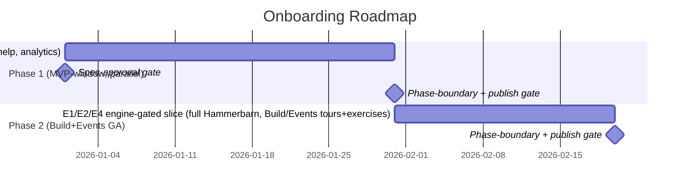

# Roadmap: Onboarding

**Brief:** [brief.md](../01-brief/brief.md) · **PRD:** [prd.md](../02-prd/prd.md)
**Program roadmap:** [../../_program-roadmap.md](../../_program-roadmap.md)
**Status:** Draft

## Position in the build order

Weave build order: **Platform shell → Constitution → Graph Explorer → Build → Events →
Onboarding**. This engine is **#6** — the last engine built.

The two-phase split below is **not** driven by onboarding's #6 position. By the time onboarding
is built, every upstream engine (CE, Explorer, Build, Events) already exists. The split is
driven by the **MVP pull-forward**: the basic CE+Explorer onboarding slice must be deliverable
inside the **MVP window** — when Build and Events are not yet GA — so it must depend only on what
is GA at MVP (Platform shell + CE + Explorer + the narrow Build slice). That slice is **Phase 1
(MVP)**. The engine-gated remainder of the full Hammerbarn demo (the Build project + Kitchen
Designer app, the Events automations, and the tours/exercises that target those screens) lands
once **Build and Events reach GA** — **Phase 2**.

**Depends on:**

- **Constitution Engine** — CE-READ-1, CE-WRITE-1, CE-EVENT-1, CE-VERSION-1, CE-METRICS-1
  (Hammerbarn seed authoring/read, sandbox writes, activation detection, version pinning,
  Business-path starter widgets).
- **Graph Explorer** — GE-CANVAS-1 (render the Hammerbarn graph; GE-01/GE-02 exercise checks).
- **Platform** — PLAT-SETTINGS-1 (per-user sandbox copy/isolation, RBAC, tunable cascade),
  PLAT-IDENTITY-1 (IdP-agnostic role→path resolution, user principal IRI), PLAT-NOTIFY-1
  (publish `onboarding-activation`), PLAT-AUDIT-1 (canonical-write rejections, analytics-view
  access), PLAT-CONNECTOR-1 (Phase 2: AE-01 Slack target, Admin connector milestone).
- **Phase 2 adds** — **Build Engine** BE-ARTEFACT-1 (Kitchen Designer project/app + BE-01) and
  **Events & Actions** EA-AUTOMATION-1 (example automations + AE-01).

**Unblocks:** **none.** Onboarding is a terminal consumer — it owns no graph data and exposes no
inter-engine contract (PRD §5 "Provided: none"). The role→starter-widget-set mapping is consumed
by Platform E1-S6 as configuration, not a published contract. Work that is contract-unblocked may
run in parallel — see the program roadmap.

> **Sub-dependency flags (surfaced, not buried):**
>
> - **OQ-08 (Admin activation):** the Admin-path activation milestone (first team-member invite)
>   needs a platform member-management capability that is **not yet published as an inter-engine
>   contract**. Business / Technical / Compliance activation via CE is fine for MVP; the Admin
>   milestone is **at-risk** until the platform invite-detection signal is contracted.
> - **OQ-02 (sandbox isolation topology):** the per-user writable-sandbox isolation topology is
>   deferred to the tech spec; the writable-copy P0 is **gated on the PLAT-SETTINGS-1 tenant
>   model**. The isolation expectation and the cross-tenant-read test are pinned in PRD §6; the
>   topology choice is the Architect's.

## Phases



---

### Phase 1: Hammerbarn CE+Explorer demo, role paths, guidance, activation  ·  MVP-window (parallel) — NOT a thin-loop MVP exit gate

> **Honest scoping (reconciled with the program roadmap §3).** This phase runs **in the MVP
> *window*, in parallel, off the thin-loop critical path** — it is **not** part of the program
> MVP exit criteria. The program MVP is the thin **model→generate** loop (Platform P1 + CE P1+P2 +
> Explorer P1 + the narrow Build slice) and nothing more. Only the **CE+Explorer tours/exercises**
> in this phase can ship in the MVP window, because they depend only on what is GA at MVP
> (Platform shell + CE + Explorer). The **full Hammerbarn demo** — the Build project + Kitchen
> Designer app and the Events automations, plus their tours/exercises — **waits on Build + Events
> GA** and is **Phase 2** (already a locked decision). The "MVP-window" tags in the table below
> mean *deliverable in the MVP window in parallel*, **not** *a thin-loop MVP exit gate*.

**Goal:** A brand-new user signs in, lands in the **Hammerbarn demo workspace** (CE + Explorer
content rendering from a live-pipeline seed), is resolved to one of the **4 primary role paths**,
is guided by tours / beacons / welcome modals on shipped screens, practises in a **per-user
writable sandbox**, tracks progress in the onboarding checklist, and reaches a CE-grounded
**activation milestone** in their own workspace — all without depending on Build or Events. Help
launcher, training library (placeholders + written walkthroughs), and role-segmented analytics
ship in this phase. Areas owned by not-yet-GA engines are **feature-flagged off**, not broken.

**Epics:**

| Epic | Description | Stories (this phase) | Priority | MVP-window (parallel)? |
|------|-------------|----------------------|----------|:----------------------:|
| EPIC-001 | Hammerbarn Demo Workspace — CE/Explorer seed areas, per-user writable sandbox, manual reset, sandbox-only writes | 3 (E1-S1 CE/Explorer, E1-S2, E1-S3) | Must Have | yes (CE+Explorer only) |
| EPIC-002 | Guided Tours & Contextual Overlays — CE/Explorer tours, beacons on shipped screens, welcome modals | 3 (E2-S1 CE/GE, E2-S2 shipped, E2-S3) | Must Have | yes (CE+Explorer only) |
| EPIC-003 | Role-Tailored Onboarding Paths — 4-path 9→4 resolution, role→starter-widget mapping (CE-sourced) | 2 (E3-S1, E3-S2) | Must / Should | yes |
| EPIC-004 | Hands-On Exercises — CE-01/02/03/03b + GE-01/02 in the writable sandbox, progress in checklist | 2 (E4-S1 CE/GE, E4-S2) | Must / Should | yes (CE+Explorer only) |
| EPIC-005 | Onboarding Checklist & Activation — Dashboard checklist widget, idempotent CE-grounded activation | 2 (E5-S1, E5-S2 Business/Tech/Compliance) | Must Have | yes |
| EPIC-006 | Training Library — placeholder video cards + written walkthroughs, search, What's New | 2 (E6-S1, E6-S2) | Must / Should | yes |
| EPIC-007 | Help Launcher — persistent ? launcher, keyboard shortcut, contextual help per screen | 2 (E7-S1, E7-S2) | Must / Should | yes |
| EPIC-008 | Onboarding Analytics — role-segmented completion/activation, anonymised cohort analytics | 2 (E8-S1, E8-S2) | Should Have | yes |

> **MVP-window (parallel)?** = deliverable in the MVP window, in parallel, off the thin-loop
> critical path — **not** a program-MVP exit gate. "CE+Explorer only" marks the straddle epics
> (1, 2, 4): only their CE/Explorer story portions are MVP-window; their Build/Events portions are
> Phase 2 (Build + Events GA).

> Epics 1, 2, 4 **straddle** both phases: their MVP story portions ship here; their engine-gated
> continuations ship in Phase 2. Epics 3, 5, 6, 7, 8 are **MVP-complete** (Phase 1 only).

**Entry criteria (Definition of Ready):**

- [ ] PRD section approved; Phase-1 tech spec approved (OQ-01 tour framework, OQ-02 sandbox
      topology, OQ-04 video hosting, OQ-05 analytics tool, OQ-06 tour-anchor strategy resolved).
- [ ] Tasks decomposed; each task brief passes the DoR gate.
- [ ] **Upstream contracts GA at MVP:** CE-READ-1, CE-WRITE-1, CE-VERSION-1, CE-METRICS-1
      (CE-EVENT-1 **Should Have** — degrade to CE-READ-1 since-version poll if not ready);
      GE-CANVAS-1; PLAT-IDENTITY-1, PLAT-NOTIFY-1, PLAT-AUDIT-1.
- [ ] **PLAT-SETTINGS-1 tenant model available** — gates the writable-sandbox P0 (per-user copy +
      isolation topology, OQ-02). Writable exercises build only once the tenant model exists.
- [ ] **OQ-08 noted as at-risk:** Admin-path activation (invite detection) deferred until the
      platform member-management signal is contracted; Business/Tech/Compliance activation via CE
      is unblocked.

**Exit criteria (EARS, measurable, human-signed):**

- [ ] WHEN a brand-new user opens the workspace switcher THE SYSTEM SHALL present a "Hammerbarn
      Demo" workspace labelled "Demo — fictional data" with no setup, whose CE + Explorer areas
      render real seed content and whose not-yet-GA (Build/Events) areas are feature-flagged off —
      verified by an E2E first-sign-in test.
- [ ] WHEN a non-content-admin identity issues a write against the **canonical** Hammerbarn graph
      THE SYSTEM SHALL reject it with HTTP 403 and record the attempt via PLAT-AUDIT-1 — verified
      by an integration test.
- [ ] WHEN a tenant-A / user-A sandbox query is issued without an explicit scope THE SYSTEM SHALL
      return **zero** tenant-B and zero other-user triples — verified by the cross-tenant-read
      test (PRD §6).
- [ ] WHEN a user edits their sandbox, signs out, and signs back in THE SYSTEM SHALL preserve the
      edits, and only an explicit "Reset demo" click SHALL restore canonical state within a
      **default 30 s, tunable** target — verified by a persistence + reset E2E test.
- [ ] WHEN a signed-in user's onboarding path is resolved THE SYSTEM SHALL map their canonical
      role(s) (PLAT-IDENTITY-1, IdP-agnostic) to exactly one of the 4 primary paths per the 9→4
      mapping (multi-role → choose-path prompt; zero-role/Viewer → Business read-only) — verified
      by a role-resolution test matrix.
- [ ] WHEN a user reaches a CE-grounded activation milestone in their own workspace THE SYSTEM
      SHALL fire the celebration and analytics event **exactly once** per `(tenant, user,
      milestone)` and publish an `onboarding-activation` event to PLAT-NOTIFY-1 — verified by an
      idempotency (re-trigger) test.
- [ ] WHEN any onboarding overlay (tour / beacon / modal / checklist) renders THE SYSTEM SHALL
      pass the **WCAG 2.1 AA zero-violations** axe gate in CI — verified by the CI accessibility
      job.
- [ ] Coverage ≥ 80% (default, tunable) · mutation ≥ 70% (default, tunable) · 0 blocking bugs.
- [ ] **Measurable delivered artefacts:** the Hammerbarn CE+Explorer demo workspace; the 4
      resolved role paths; the CE/GE exercise set (CE-01/02/03/03b, GE-01/02); the onboarding
      checklist widget; the role-segmented analytics dashboard.
- [ ] **Human sign-off recorded** (always the final exit criterion).

**HITL gates (configurable for this phase — declare which are active):**

| Gate | Active? | Approver | Blocks |
|------|---------|----------|--------|
| Spec-approval (PO/stakeholder sign-off) | **mandatory** | Product Owner | phase start |
| Phase-boundary ceremony (security-review + mutation + doc-gen) | yes | Tech Lead + Security reviewer | phase-2 |
| Pre-AWS-deploy (full local pyramid + gates green → approve) | yes | Tech Lead | deploy |
| Publish/generate (Hammerbarn seed publish via CE-WRITE-1) | yes | Onboarding/content admin + Tech Lead | seed release |

> HITL gates are project/workspace-configurable; only spec-approval is globally mandatory.
> **Why all three optional gates are active here:** the **phase-boundary security review** is
> load-bearing — this engine enforces three isolation boundaries (per-user sandbox; sandbox vs
> canonical 403; sandbox vs real tenant), the cross-tenant-read test, and no-PII cohort
> analytics. **Pre-AWS-deploy** is active because the phase ships a deployed SPA overlay, sandbox
> storage, and a durable analytics queue. **Publish/generate** is active because onboarding, as
> integrator, drives the **canonical Hammerbarn seed** going live to every new user — a release
> with real blast radius (CE-WRITE-1 in Phase 1). If the program prefers to attribute the seed
> publish to CE's own publish gate, downgrade this row; it is consciously activated here.

**Phase-gate metadata** (evaluated by the phase-gate Stop hook / `/goal` condition):

```
phase: 1
gate_id: onboarding-gate-1
condition: all_exit_criteria_met
approver: Product Owner + Tech Lead + Security reviewer
blocks: phase-2
```

---

### Phase 2: Full Hammerbarn demo — Build & Events seed, tours, and exercises  ·  Phase 2 (Build+Events GA)

**Goal:** Complete the full Hammerbarn demo once **Build and Events reach GA**. The Build project
+ Kitchen Designer app (BE-ARTEFACT-1) and the example automations (EA-AUTOMATION-1) become live
seed areas; the previously feature-flagged-off Build, Events (Automate), and Platform-Dashboard
tours / beacons / welcome modals turn on; and the engine-gated exercises (BE-01, AE-01) join the
exercise set. **Dependencies:** Phase 1 gate passed; Build Engine GA (BE-ARTEFACT-1); Events &
Actions GA (EA-AUTOMATION-1); PLAT-CONNECTOR-1 (Slack target for AE-01).

**Epics:**

| Epic | Description | Stories (this phase) | Priority | MVP? |
|------|-------------|----------------------|----------|------|
| EPIC-001 | Hammerbarn Demo Workspace — Build project + Kitchen Designer app + example automations as live seed areas (FR-003) | 1 (E1-S1 Build/Events areas) | Must Have (at GA) | no |
| EPIC-002 | Guided Tours & Contextual Overlays — Build, Events (Automate), Platform-Dashboard tours + Phase-2 beacons/modals turned on | 2 (E2-S1 Build/Events/Dashboard, E2-S2 Phase-2 screens) | Must Have (at GA) | no |
| EPIC-004 | Hands-On Exercises — BE-01 (open Kitchen Designer project) and AE-01 (draft a Slack-notify automation) | 1 (E4-S1 BE-01, AE-01) | Must Have (at GA) | no |

> Only the three straddle epics (1, 2, 4) continue into Phase 2 — their engine-gated story
> subsets. Epics 3, 5, 6, 7, 8 completed in Phase 1.

**Entry criteria (Definition of Ready):**

- [ ] Phase-1 gate passed; Phase-2 tech spec delta approved (live-pipeline seed orchestration,
      OQ-03; tour anchors for Build/Events/Dashboard, OQ-06).
- [ ] Tasks decomposed; each task brief passes the DoR gate.
- [ ] **Build Engine GA** — BE-ARTEFACT-1 available (Kitchen Designer project/app seed + BE-01).
- [ ] **Events & Actions GA** — EA-AUTOMATION-1 available (example automations seed + AE-01).
- [ ] **PLAT-CONNECTOR-1** available — Slack channel target for AE-01; Admin connector-config
      milestone deep-link resolvable.

**Exit criteria (EARS, measurable, human-signed):**

- [ ] WHEN a user opens the Build and Automate areas of Hammerbarn THE SYSTEM SHALL render the
      Kitchen Designer project + app (BE-ARTEFACT-1) and the example automations (EA-AUTOMATION-1)
      as live seed content — verified by a full-demo content-completeness check (no remaining
      "Coming soon" placeholder for a GA engine).
- [ ] WHEN a user starts a Build, Events, or Platform-Dashboard tour THE SYSTEM SHALL run it with
      spotlight + tooltip + Back/Next + step indicator, skippable and resumable from the last
      step — verified by a tour E2E test per area; a step whose anchor is absent SHALL skip with a
      logged warning, never block.
- [ ] WHEN a Technical user completes AE-01 THE SYSTEM SHALL save an automation as **Draft**
      grounded in the Goods Inward **process** (triggered by a Delivery **Event**; EA-AUTOMATION-1,
      Slack via PLAT-CONNECTOR-1), and
      WHEN a Technical/Admin user completes BE-01 THE SYSTEM SHALL record the Decisions-tab-opened
      signal — verified against the named completion checks.
- [ ] WHEN any Phase-2 overlay renders THE SYSTEM SHALL pass the WCAG 2.1 AA zero-violations axe
      gate in CI — verified by the CI accessibility job.
- [ ] Coverage ≥ 80% (default, tunable) · mutation ≥ 70% (default, tunable) · 0 blocking bugs.
- [ ] **Measurable delivered artefacts:** the full Hammerbarn demo (CE + Explorer + Build +
      Events seed areas all live); the Build/Events/Dashboard tour set; the BE-01 and AE-01
      exercises.
- [ ] **Human sign-off recorded** (always the final exit criterion).

**HITL gates (configurable for this phase — declare which are active):**

| Gate | Active? | Approver | Blocks |
|------|---------|----------|--------|
| Spec-approval (PO/stakeholder sign-off) | **mandatory** | Product Owner | phase start |
| Phase-boundary ceremony (security-review + mutation + doc-gen) | yes | Tech Lead + Security reviewer | release |
| Pre-AWS-deploy (full local pyramid + gates green → approve) | yes | Tech Lead | deploy |
| Publish/generate (full Hammerbarn seed publish: CE-WRITE-1 + BE-ARTEFACT-1 + EA-AUTOMATION-1) | yes | Onboarding/content admin + Tech Lead | full-demo release |

> The publish/generate gate is active because Phase 2 promotes the **full canonical Hammerbarn
> seed** (now including the Build project, app, and live automations) to every new user — the
> highest-blast-radius release in this engine. Security review re-runs because the AE-01 path
> reaches an external Slack connector (token in AWS Secrets Manager via PLAT-CONNECTOR-1, never
> read by onboarding).

**Phase-gate metadata** (evaluated by the phase-gate Stop hook / `/goal` condition):

```
phase: 2
gate_id: onboarding-gate-2
condition: all_exit_criteria_met
approver: Product Owner + Tech Lead + Security reviewer
blocks: release
```

---

## HITL gate summary

| Gate | After phase | Approval criteria | Approver |
|------|-------------|-------------------|----------|
| Spec-approval | before each phase | PRD + phase tech spec approved; tasks DoR-passing | Product Owner |
| Gate 1 (phase-boundary + pre-deploy + seed publish) | Phase 1 | All Phase-1 EARS exit criteria met (incl. 403-on-canonical-write, cross-tenant-read zero-triple test, exactly-once activation, WCAG AA axe gate) + floors green + human sign-off | Product Owner + Tech Lead + Security reviewer |
| Gate 2 (phase-boundary + pre-deploy + full-seed publish) | Phase 2 | All Phase-2 EARS exit criteria met (full demo content-complete, Build/Events/Dashboard tours, BE-01/AE-01, WCAG AA) + floors green + human sign-off | Product Owner + Tech Lead + Security reviewer |

> All numeric thresholds are **"default X, tunable"** (coverage ≥ 80%, mutation ≥ 70%, reset-op
> ≤ 30 s, training search ≤ 300 ms, analytics freshness ≤ 5 min, cohort k ≥ 20, checklist
> auto-dismiss 7 days, etc.). Activation rate and time-to-first-outcome are **measure-and-report
> baselines for cohort 1, not GA gates** (decision E4).

---
*Generated by Weave PO agent. Review and approve before proceeding to Technical Architecture.*
