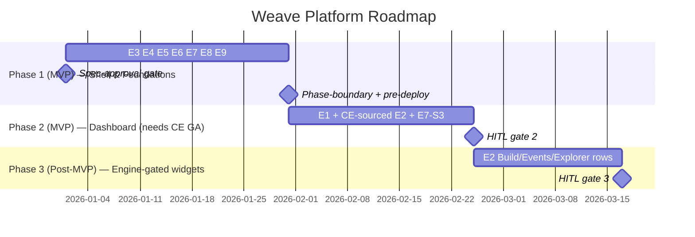

# Roadmap: Weave Platform

**Brief:** [brief.md](../01-brief/brief.md) · **PRD:** [prd.md](../02-prd/prd.md)
**Program roadmap:** [../../_program-roadmap.md](../../_program-roadmap.md)
**Status:** Draft

## Position in the build order

Weave build order: **Platform shell → Constitution → Graph Explorer → Build → Events → Onboarding**.
This engine is **#1** — the shell the whole loop runs in (app, navigation, workspace, Cognito,
Bedrock routing, tenancy), **not an engine**. The Constitution Engine is the first engine that
runs on this shell.

The platform's position is **bidirectional**, and that is the load-bearing point of this section:

- **Unblocks (provides):** the platform exposes the cross-cutting contracts every engine emits to
  or reads — `PLAT-AUDIT-1`, `PLAT-NOTIFY-1`, `PLAT-IDENTITY-1`, `PLAT-CONNECTOR-1`,
  `PLAT-SETTINGS-1`, `PLAT-BILLING-1` — plus the app shell, auth, RBAC and tenancy. **CE and all
  four engines depend on these.** Phase 1 has **no upstream engine dependency** and must ship first.
- **Depends on (consumes):** the Generative Dashboard and CE-sourced widgets consume
  `CE-METRICS-1`, `CE-READ-1`, `CE-DIFF-1`, `CE-VERSION-1`, `CE-EVENT-1`; connector-data ingestion
  writes via `CE-WRITE-1`. **These cannot be delivered or verified until the Constitution Engine
  is GA.** This forces the within-MVP split below: the shell precedes CE; the dashboard follows it.
- **Engine-gated expansion:** Build-, Events-, and Explorer-sourced widget rows depend on those
  engines reaching GA (no contract exists for them yet — tracked as not-yet-contracted engine
  surfaces). They light up post-MVP as each source engine ships.

Work that is contract-unblocked may run in parallel — see the program roadmap.

## Phases



> Dates are illustrative; the **sequence is authoritative**. Absolute date anchors are non-committed
> placeholders — the cross-engine build order and its critical path live in `_program-roadmap.md` §7,
> which is the single authoritative timeline. Within this chart, ordering is expressed by the `after`
> milestone chain (`m1`, `m2`), not by the start dates.

---

### Phase 1: Platform Shell & Cross-Cutting Foundations  ·  MVP

**Goal:** Stand up the shell the whole loop runs in and the cross-cutting contracts every engine
depends on — app chrome + navigation + search, Cognito auth + RBAC + agent identity, the 4-level
tenancy/settings cascade, notifications, managed-connector config + health, billing/metering +
budget caps, the immutable hash-chained audit service, and Weave-internal product self-improvement.
**This phase has no upstream engine dependency and unblocks the Constitution Engine and every other
engine.** Demonstrable outcome: a tenant-isolated, authenticated SPA shell with all six platform
contracts live, exercised by the cross-tenant-isolation and audit-tamper tests.

**Epics:**

| Epic | Description | Stories | Priority | MVP? |
|------|-------------|---------|----------|------|
| **EPIC-000** | **Foundation & Boilerplate — FIRST; gates everything.** Monorepo, Terraform + S3 state, Next.js shell + design system + Storybook, CI/CD + lint/complexity/SAST/secret gates, Cognito+Bedrock connectivity, test + visual-regression harness, OpenAPI + OTel scaffold, AI evals, local docker-compose stack, Lighthouse-100 + WCAG-AA gates | 9 | Must Have | yes |
| EPIC-003 | Tenancy, Workspaces & Settings Cascade (`PLAT-SETTINGS-1`, 4-level tighter-wins) | 3 | Must Have | yes |
| EPIC-004 | Authentication, RBAC & Agent Identity (Cognito/Auth0, JWT RBAC, `PLAT-IDENTITY-1` IAM/STS) | 3 | Must Have | yes |
| EPIC-005 | Global Navigation & Search (persistent top bar, Cmd+K, help/tour) | 3 | Must Have | yes |
| EPIC-006 | Notifications (`PLAT-NOTIFY-1`, open taxonomy, in-app + Slack) | 2 | Must Have | yes |
| EPIC-007 | Managed Connectors — config + health (`PLAT-CONNECTOR-1`, 7 v1 connectors) | 2 of 3 (S1, S2) | Must Have | yes |
| EPIC-008 | Billing, Metering & Budgets (`PLAT-BILLING-1`, cascade caps, hard pre-call enforcement) | 2 | Must Have | yes |
| EPIC-009 | Immutable Audit (`PLAT-AUDIT-1`) & Weave-product Self-Improvement (`BE-SELFIMPROVE-1`, Weave-internal) | 4 | Must Have | yes |

> Epic 7 story S3 (connector-data **ingestion** via `CE-WRITE-1`) is held to Phase 2 because it
> depends on CE GA. Epic 7 config + health (S1, S2) ship here with no CE dependency.

**Entry criteria (Definition of Ready):**

- [ ] PRD §Epics 3–9 approved; Phase-1 tech spec approved (arch-stack + arch-infra resolve the
      dev-environment AWS floor per [`_dev-environment.md`](../../_dev-environment.md))
- [ ] Tasks decomposed; each task brief passes the DoR gate
- [ ] Multi-tenant isolation mechanism decided (OQ-01) OR the cross-tenant-read test fixed and the
      mechanism stubbed behind it; `PLAT-AUDIT-1` storage choice decided (OQ-05)
- [ ] Thin shared dev AWS account provisioned (Cognito pool, Bedrock access, Secrets Manager) per DX1/DX3

**Exit criteria (EARS, measurable, human-signed):**

- [ ] WHEN a query is issued in tenant A's context THE SYSTEM SHALL return zero rows from tenant
      B's seeded data across RDF, Aurora and S3 Vectors, and SHALL reject an unscoped SPARQL query
      — verified by the cross-tenant-read isolation test (PRD §6/§9)
- [ ] WHEN a member is removed or their role changed THE SYSTEM SHALL reject the next request
      bearing their prior token within the bounded revocation latency (default ≤ 60 s, tunable) —
      verified by the revocation integration test (FR-021/FR-024)
- [ ] WHEN any historical `PLAT-AUDIT-1` entry is altered or deleted THE SYSTEM SHALL fail chain
      verification at a named row and SHALL log the delete attempt — verified by the audit tamper
      test (FR-036/FR-037, PRD §9)
- [ ] WHEN AI-generation spend reaches 100% of the effective cascade-resolved cap THE SYSTEM SHALL
      reject the request before any AI API call with the readable cap message — verified by the
      budget-enforcement test (FR-035)
- [ ] WHEN a connector enters a degraded/disconnected state THE SYSTEM SHALL publish a
      `PLAT-NOTIFY-1` event delivered in-app (and Slack if configured) — verified by the
      connector-health test (FR-032)
- [ ] WHEN a Weave-product signal crosses its provisional threshold THE SYSTEM SHALL draft a DRAFT
      GitHub issue visible only to a Weave-internal platform operator, and SHALL reject a
      client-tenant approval attempt with HTTP 403 + audit — verified by the self-improvement
      authz test (FR-043)
- [ ] Coverage ≥ 80% (default, tunable) · mutation ≥ 70% (default, tunable) · 0 blocking bugs (default, tunable)
- [ ] **Measurable artefact:** a running tenant-isolated SPA shell with the six platform contracts
      live (`PLAT-AUDIT-1`, `PLAT-NOTIFY-1`, `PLAT-IDENTITY-1`, `PLAT-CONNECTOR-1`,
      `PLAT-SETTINGS-1`, `PLAT-BILLING-1`), deployed to dev-AWS and passing the smoke suite
- [ ] **Human sign-off recorded** (always the final exit criterion)

**HITL gates (configurable for this phase — declare which are active):**

| Gate | Active? | Approver | Blocks |
|------|---------|----------|--------|
| Spec-approval (PO/stakeholder sign-off) | **mandatory** | PO + exec sponsor | phase start |
| Phase-boundary ceremony (security-review + mutation + doc-gen) | yes | Architect + security reviewer | phase-2 |
| Pre-AWS-deploy (full local pyramid + gates green → approve → dev-AWS smoke) | yes | Workspace admin / release approver | deploy |
| Publish/generate (ontology publish / artefact release) | yes (scoped to E9-S4 self-improvement dispatch only) | Weave-internal platform operator | self-improvement dispatch |

> HITL gates are project/workspace-configurable; only spec-approval is globally mandatory.
> Phase-boundary ceremony is load-bearing here — this phase ships auth, RBAC, audit and
> tenant-isolation, so the security review is real, not pro-forma. Pre-AWS-deploy is active because
> the platform deploys (Cognito, Bedrock, the dev-AWS smoke per [`_dev-environment.md`](../../_dev-environment.md) §4).
> Publish/generate applies only to the Weave-internal self-improvement dispatch (E9-S4); no client
> artefact is published in this phase.

**Phase-gate metadata** (evaluated by the phase-gate Stop hook / `/goal` condition):

```
phase: 1
gate_id: weave-platform-gate-1
condition: all_exit_criteria_met
approver: Architect + security reviewer
blocks: phase-2
```

---

### Phase 2: Generative Dashboard & CE-Sourced Widgets  ·  MVP

**Goal:** Deliver the user-facing centrepiece — the declarative Generative Dashboard (prompt →
best-fit widget from the finite component library, streamed live) and the **CE-sourced** widget
set, plus connector-data ingestion into the graph. **Depends on Constitution Engine GA** (consumes
`CE-METRICS-1` / `CE-READ-1` / `CE-DIFF-1` / `CE-VERSION-1` / `CE-EVENT-1`; ingestion writes via
`CE-WRITE-1`). Demonstrable outcome: a user types "show me active compliance contraventions by
domain" and a live bar chart streams from `CE-METRICS-1`; pins persist server-side and reload
cross-device; a request for a non-GA category renders the defined unavailable state.

**Epics:**

| Epic | Description | Stories | Priority | MVP? |
|------|-------------|---------|----------|------|
| EPIC-001 | Generative Dashboard (composition + lifecycle: prompt, refine, pin, publish, starters) | 7 | Must Have | yes |
| EPIC-002 | Widget Library — **CE-sourced stories only** (S1, S2, S5, S7-CE, S10, S11, S13, S14, S15) | 9 of 15 | Must Have / Should Have | yes |
| EPIC-007 | Managed Connectors — **ingestion** story S3 (`CE-WRITE-1`, validated ops) | 1 of 3 (S3) | Must Have | yes |

> Epic 2 is split per the PRD's own per-story Phase tags. CE-sourced stories (ontology health,
> completeness, compliance, CE issues, sentiment over `PLAT-AUDIT-1`, agent activity, growth, RBAC
> coverage, onboarding progress) are MVP here. Build/Events/Explorer-sourced rows are Phase 3.
> E2-S3 token-spend and E2-S8 connector-health rows already shipped data in Phase 1 (billing +
> connector health); their automation/per-run dimensions remain Phase 3.

**Entry criteria (Definition of Ready):**

- [ ] Phase 1 gate passed (shell + all six platform contracts live)
- [ ] **Constitution Engine is GA** and `CE-METRICS-1`/`CE-READ-1`/`CE-DIFF-1`/`CE-VERSION-1`/
      `CE-EVENT-1`/`CE-WRITE-1` are published and pinned (`?version=latest`)
- [ ] PRD §Epics 1–2 approved; Phase-2 tech spec approved (streaming RSC pattern OQ-02, widget
      caching OQ-03, widget-state store OQ-13 resolved)
- [ ] Tasks decomposed; each task brief passes the DoR gate

**Exit criteria (EARS, measurable, human-signed):**

- [ ] WHEN a user submits "show me active compliance contraventions by domain" THE SYSTEM SHALL
      stream a bar chart from `CE-METRICS-1` within the default target (streaming header ≤ 1 s,
      tunable) with a data-source footer label — verified by the generative-widget E2E (FR-002/FR-014, PRD §9)
- [ ] WHEN a user submits a prompt for a Build/Events/Explorer-sourced category THE SYSTEM SHALL
      render the defined "source engine not yet available" state, never blank or fabricated data —
      verified by the unavailable-state test (FR-015, PRD §9)
- [ ] WHEN a user pins a widget THE SYSTEM SHALL persist it server-side scoped to (tenant, user)
      and reload it with live data on a different device, invisible to another tenant — verified by
      the pin-persistence cross-device test (FR-008, PRD §9)
- [ ] WHEN a user publishes a pinned widget THE SYSTEM SHALL list it in the server-side
      workspace-scoped library so another user can add an independent copy — verified by the
      publish/add test (FR-011, PRD §9)
- [ ] WHEN inbound connector data arrives THE SYSTEM SHALL ingest it into the graph via `CE-WRITE-1`
      under a connector-scoped agent principal, committing only on SHACL pass — verified by the
      ingestion test (FR-033)
- [ ] Coverage ≥ 80% (default, tunable) · mutation ≥ 70% (default, tunable) · 0 blocking bugs (default, tunable)
- [ ] **Measurable artefact:** a working Generative Dashboard rendering ≥ 9 CE-sourced widget
      categories with server-side pin + publish, plus live connector ingestion into the graph,
      deployed to dev-AWS and passing the smoke suite
- [ ] **Human sign-off recorded** (always the final exit criterion)

**HITL gates (configurable for this phase — declare which are active):**

| Gate | Active? | Approver | Blocks |
|------|---------|----------|--------|
| Spec-approval (PO/stakeholder sign-off) | **mandatory** | PO + exec sponsor | phase start |
| Phase-boundary ceremony (security-review + mutation + doc-gen) | yes | Architect + security reviewer | phase-3 |
| Pre-AWS-deploy (full local pyramid + gates green → approve → dev-AWS smoke) | yes | Workspace admin / release approver | deploy |
| Publish/generate (ontology publish / artefact release) | no (no client artefact published; widget publish is server-side workspace state, not an external release) | n/a | — |

> Phase-boundary ceremony stays active (the dashboard widens the RBAC + audit surface). Pre-AWS-deploy
> active (dashboard + ingestion deploy). Publish/generate is N/A — publishing a widget to the
> workspace library is internal server-side state, not an external artefact release.

**Phase-gate metadata** (evaluated by the phase-gate Stop hook / `/goal` condition):

```
phase: 2
gate_id: weave-platform-gate-2
condition: all_exit_criteria_met
approver: Architect + security reviewer
blocks: phase-3
```

---

### Phase 3: Engine-Gated Widget Expansion  ·  Post-MVP

**Goal:** Light up the remaining Widget Library categories as their **source engines reach GA**.
This is a single phase keyed to "per source-engine GA" rather than three engine-aligned phases, so
Epic 2 is not fragmented further. Each category renders its defined "not yet available" state until
its engine ships, then activates against that engine's metrics surface. Demonstrable outcome: when
the Build Engine is GA, the active-project pipeline widget renders live project metrics where it
previously showed "Build Engine not yet available".

**Epics:**

| Epic | Description | Stories | Priority | MVP? |
|------|-------------|---------|----------|------|
| EPIC-002 | Widget Library — **engine-gated stories** (S4 Build; Build rows of S7/S12; automation rows of S3/S8; Explorer realtime sub-widgets of S9; per-run dimensions) | 6 of 15 (S3 per-run, S4, S7 Build, S8 automation, S9 realtime, S12) | P0 when source engine ships | no |

> These are the PRD's "P0 when `<engine>` ships" and "Phase 2 (Explorer realtime)" stories. They
> activate incrementally — Build-sourced when Build is GA, Events-sourced when Events is GA,
> Explorer realtime presence when a realtime presence contract exists (tracked; no contract ID yet,
> a Phase-2 Explorer deliverable). No new platform contract is introduced here.

**Entry criteria (Definition of Ready):**

- [ ] Phase 2 gate passed (Generative Dashboard + CE-sourced widgets GA)
- [ ] At least one downstream engine (Build, Events, or Graph Explorer realtime) is GA and exposes
      a consumable metrics surface (its metrics endpoint added to that engine's PRD/contracts)
- [ ] PRD §Epic 2 engine-gated stories re-approved against the now-available engine surfaces
- [ ] Tasks decomposed for the activatable categories; each task brief passes the DoR gate

**Exit criteria (EARS, measurable, human-signed):**

- [ ] WHEN the Build Engine is GA THE SYSTEM SHALL render the active-project pipeline widget (E2-S4)
      with live project metrics where it previously showed the "Build Engine not yet available"
      state — verified by the Build-sourced widget test (FR-015)
- [ ] WHEN the Events Engine is GA THE SYSTEM SHALL add automation counts/failure-rate rows (E2-S8)
      and per-run automation spend (E2-S3) sourced from the Events metrics surface — verified by the
      Events-sourced widget test
- [ ] WHEN a consumer engine's pinned ontology version lags `is_latest` by ≥ the amber threshold
      (default 2, tunable) THE SYSTEM SHALL highlight the version-pin row amber via the canonical
      `CE-VERSION-1` lag (≥ red threshold default 4) — verified by the version-pin widget test (FR-018)
- [ ] WHEN a source engine is not yet GA THE SYSTEM SHALL continue to render that category's defined
      unavailable state, never fabricated rows — verified by the not-yet-available regression test (FR-015)
- [ ] Coverage ≥ 80% (default, tunable) · mutation ≥ 70% (default, tunable) · 0 blocking bugs (default, tunable)
- [ ] **Measurable artefact:** the dashboard renders every category whose source engine is GA with
      live data and the remainder in the defined unavailable state, deployed to dev-AWS and passing
      the smoke suite
- [ ] **Human sign-off recorded** (always the final exit criterion)

**HITL gates (configurable for this phase — declare which are active):**

| Gate | Active? | Approver | Blocks |
|------|---------|----------|--------|
| Spec-approval (PO/stakeholder sign-off) | **mandatory** | PO + exec sponsor | phase start |
| Phase-boundary ceremony (security-review + mutation + doc-gen) | yes | Architect + security reviewer | release |
| Pre-AWS-deploy (full local pyramid + gates green → approve → dev-AWS smoke) | yes | Workspace admin / release approver | deploy |
| Publish/generate (ontology publish / artefact release) | no (widget activation reads downstream engine metrics; no artefact is published) | n/a | — |

> Phase-boundary + pre-AWS-deploy remain active (each engine-gating change deploys and widens the
> read surface). Publish/generate N/A — this phase only consumes downstream metrics.

**Phase-gate metadata** (evaluated by the phase-gate Stop hook / `/goal` condition):

```
phase: 3
gate_id: weave-platform-gate-3
condition: all_exit_criteria_met
approver: Architect + security reviewer
blocks: release
```

---

## HITL gate summary

| Gate | After phase | Approval criteria | Approver |
|------|-------------|-------------------|----------|
| Spec-approval (mandatory, every phase) | before each phase | PRD + Phase tech spec approved; tasks DoR-passing | PO + exec sponsor |
| Gate 1 | Phase 1 | EARS exit criteria met (isolation, revocation, audit-tamper, budget, notify, self-improvement authz) + security review + pre-deploy smoke + human sign-off | Architect + security reviewer |
| Gate 2 | Phase 2 | EARS exit criteria met (CE-sourced widget stream, unavailable state, server-side pin/publish, ingestion) + security review + pre-deploy smoke + human sign-off | Architect + security reviewer |
| Gate 3 | Phase 3 | EARS exit criteria met (engine-gated activation + not-yet-available regression) + security review + pre-deploy smoke + human sign-off | Architect + security reviewer |

> Spec-approval is the only globally mandatory gate. Phase-boundary ceremony and pre-AWS-deploy are
> active on all three phases because the platform ships security-load-bearing surfaces and deploys
> to dev-AWS each phase. Publish/generate is active only in Phase 1, scoped to the Weave-internal
> E9-S4 self-improvement dispatch.

---
*Generated by Weave PO agent. Review and approve before proceeding to Technical Architecture.*
