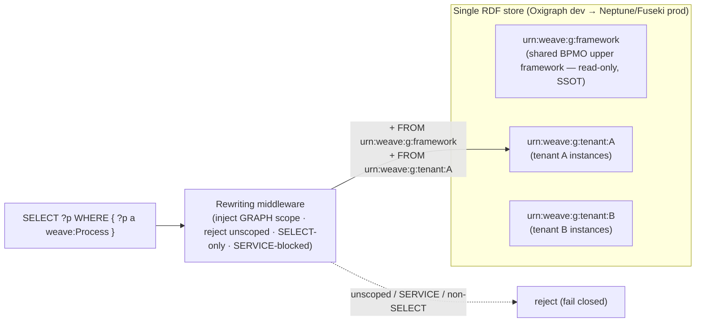

# ADR-001: Tenant isolation — named-graph-per-tenant + mandatory query-rewriting

**Scope:** program-level. Binds [Platform](../engines/weave-platform.md),
[Constitution Engine](../engines/constitution-engine.md),
[Graph Explorer](../engines/graph-explorer.md), and [Build Engine](../engines/build-engine.md).
Enforces the isolation contract in [rbac-multi-tenancy](../../../standards/rbac-multi-tenancy.md).
Resolves **OQ-01 / CE OQ-04**. Must be decided before M1 (see
[weave-spec §1.4 M1 DoR](../weave-spec.md)).

## Status

Accepted — 2026-07-01 (human-confirmed). Build phase: **M1** (the isolation boundary is a
release gate for the M1 thin loop, not deferrable).

## Context

`rbac-multi-tenancy.md` fixes the **isolation expectation and its test** but deliberately
leaves the **RDF mechanism** to the Architect. Two candidates:

1. **Named-graph-per-tenant + query-rewriting** — one shared store; a middleware scopes every
   query to the tenant's named graph and rejects any unscoped query.
2. **Store-per-tenant** — each tenant gets a physically separate RDF store (the prototype's
   proven `ProjectManager` model; unknown id → 404).

The decision is load-bearing because the dev store (Oxigraph) and the prod target
(Neptune / Fuseki — decision deferred to CE tech spec) differ: **Neptune is one cluster =
one store**, so store-per-tenant does not map to prod without an Oxigraph-per-tenant fleet or
per-tenant clusters (cost/ops-hostile at mid-market tenant counts). Isolation must also cover
the **connector write-path** (SEC-1/3), not just reads.

## Decision

**One shared RDF store; each tenant's instance data lives in a per-tenant named graph; a
mandatory, fail-closed rewriting middleware is the single enforcement point.**

**Named-graph scheme (canonical — every engine uses these IRIs):**

| Graph | IRI | Written by | Read by |
|-------|-----|-----------|---------|
| Shared upper framework (BPMO ~13 kinds, SHACL shapes, SKOS) | `urn:weave:g:framework` | Weave release process only | every tenant (read-only) |
| Tenant instance graph | `urn:weave:g:tenant:{tenant_id}` | that tenant via `CE-WRITE-1` / connectors | that tenant only |
| Tenant provenance graph (PROV-O) | `urn:weave:g:tenant:{tenant_id}:prov` | audit path | that tenant only |

The **framework graph is the single source of truth** for the upper ontology; tenant graphs
extend it, never copy it. A query reads `framework ∪ tenant:{id}` and nothing else.

**Enforcement rules (all fail-closed):**

- Every SPARQL query passes through the rewriter, which sets the active graph(s) to
  `framework + tenant:{ctx.tenant_id}`. A query that already names a *different* tenant graph,
  or names none where scope is required, is **rejected — never silently broadened**
  (`UnscopedQueryRejected`). This subsumes LLM-generated SPARQL from `POST /api/query/nl`
  ([CE-READ-1](../contracts.md)) — the generated string is validated by the **same** rewriter.
- SELECT-only + `SERVICE`-blocked, per `rbac-multi-tenancy.md` §RDF layer (one validator).
- Writes never issue raw triples; they go through `CE-WRITE-1`, which targets
  `urn:weave:g:tenant:{ctx.tenant_id}` derived from the request context, **not from the
  payload** — a payload naming another tenant's graph is a 403 + audit.
- **Connector write-path (SEC-1/3):** a connector ingest job carries the tenant context; its
  writes land only in that tenant's graph. A misrouted/forged write target is rejected before
  commit and audited. The cross-tenant test (below) exercises this path.
- Aurora: `tenant_id` column + base-layer predicate; S3 Vectors: tenant prefix; CRDT (Explorer
  Phase 2): room id carries tenant — all unchanged from `rbac-multi-tenancy.md`.

**Cross-tenant release gate (extends the standard's test):** the mandatory
`test_cross_tenant_read_returns_zero_rows` + `test_unscoped_query_is_rejected` gain a
**connector-write** case: seed a connector write for tenant A, assert it is invisible in
tenant B and that a write targeting B's graph from A's context is rejected.

## Consequences

**Positive:** maps 1:1 to Neptune prod (one cluster); cheapest at thousands of tenants; one
store to back up / migrate / reason across for platform-internal analytics; the shared
framework graph gives true SSOT (no per-tenant ontology drift).

**Negative / risk:** correctness concentrates in the rewriter — **one missed rewrite = a
cross-tenant leak**, a higher blast radius than physical separation. Mitigations, all
mandatory: (1) deny-by-default (unscoped ⇒ reject); (2) property-based / fuzz tests on the
rewriter treated as a security gate; (3) the rewriter is the **only** query path — no code may
issue a raw store query (grep-enforced invariant); (4) the CE perf/security spike
([CE TASK-008](../engines/constitution-engine/04-arch/tasks/TASK-008.md)) stress-tests the
rewriter at scale, and its degrade plan **must preserve** the M1 generate step (never widen
scope to hit a latency target).

## Alternatives considered

- **Store-per-tenant** — rejected as the primary mechanism: Neptune-hostile at scale,
  per-tenant migration fan-out, cross-tenant platform analytics require federating stores.
  **Retained as a documented fallback** *only if* the CE spike proves query-rewriting fragile;
  switching is a re-decision (supersede this ADR), **not** a parallel dual build — the program
  ships exactly one mechanism (council ENG note).
- **Row-level `tenant_id` triple on every statement (reification)** — rejected: bloats the
  graph, defeats SPARQL ergonomics, and still needs a rewriter to enforce.
