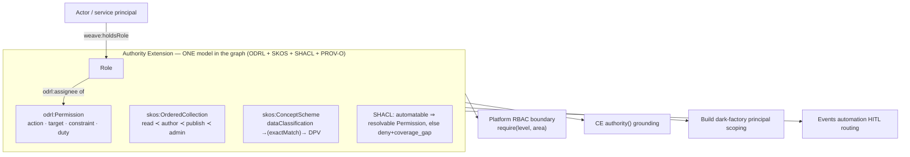

# ADR-002: Authority Extension — open-standard, single-source-of-truth authority model

**Scope:** program-level (ontology-owned by [Constitution Engine](../engines/constitution-engine.md);
consumed by [Platform](../engines/weave-platform.md) RBAC, [Build](../engines/build-engine.md)
dark-factory principals, and Events automation HITL). Resolves **OQ-AUTH-1** and **ONT-4**.
Grounds [CE-READ-1 `authority()`](../contracts.md) and the `automatable` property honestly.

## Status

Accepted — 2026-07-01 (human-confirmed). **Direction decided now; build phased:** the *base*
degrade behaviour (`coverage_gap` + deny-by-default + `escalation`) is **M1**; the ODRL/SKOS
**Authority Extension module** ships **M2** alongside `CE-FUNCTION-1` / `authority()`. Opt-in:
the base BPMO works without it and degrades honestly.

## Context

The council found (ONT-1/3/4) that the base 13-kind BPMO **cannot express permission,
authority level, HITL triggers, or data classification**, so `authority()` was oversold, and
`Actor` conflated the *who* with the *role they act in* — the chain
`Actor → (role) → permission → resource` cannot resolve. Separately, `rbac-multi-tenancy.md`
defines four permission levels (`read ≺ author ≺ publish ≺ admin`) **in the RBAC layer**. Left
unreconciled, the platform would carry **two sources of truth** for authority — an ontology one
an agent reasons over, and an RBAC one the API boundary enforces — which drift.

**User principle (2026-07-01):** authority must be built in *the same open languages and
standards* as the rest of the app, reuse existing code/vocabularies, and be a **single source
of truth** — "a founding principle of the entire app."

## Decision

Ship a **canonical Authority Extension**: an opt-in ontology module, pure **OWL 2 + ODRL 2.2 +
SKOS + SHACL + PROV-O** (no bespoke vocabulary), that is the **one** authority model the whole
platform reads.

**1. Split `Actor` → `Role` (ONT-4).** Add `Role` and `weave:holdsRole (Actor → Role)`. The
authority chain becomes `Actor —holdsRole→ Role —(ODRL assignee)→ Permission —(target)→
resource`. Agents act under a service-principal Actor holding a least-privilege Role
(reconciles with `PLAT-IDENTITY-1`).

**2. Permissions in ODRL 2.2** (W3C Rec, RDF-native — the open standard for exactly this).
Reuse `odrl:Policy / odrl:Permission / odrl:Prohibition / odrl:Duty`, with `odrl:assignee`
(a `Role`), `odrl:action` (a Weave action, e.g. `weave:publishVersion`, `weave:runAutomation`),
`odrl:target` (a resource / `BusinessDomain` / graph), and `odrl:constraint`. No invented
permission kinds.

**3. `authorityLevel` as one SKOS ordered scheme = the RBAC levels (SSOT).** Define the four
levels **once** as a `skos:OrderedCollection` (`read ≺ author ≺ publish ≺ admin`) — the *same*
levels as `rbac-multi-tenancy.md`. The RBAC boundary's `require(level, area)` reads the
**ontology-derived** effective level via the settings cascade; it does **not** hardcode a
parallel role table. One definition, two consumers.

**4. `dataClassification` as a SKOS scheme, alignable to DPV.** `public / internal /
confidential / restricted` as a `skos:ConceptScheme`, each `skos:exactMatch` to a
[DPV](https://w3id.org/dpv) term so we adopt the open privacy vocabulary without forking it.

**5. HITL as an ODRL `Duty` + the `automatable` flag.** An automatable action carries an
`odrl:Duty` "obtain human approval" gated by an `odrl:constraint` (e.g. dataClassification ≥
confidential, or authorityLevel exceeded). `automatable=false` OR an unresolvable permission
chain ⇒ **route to human** (`escalation`) — the honest degrade the council required.

**6. SHACL enforces what ODRL/SKOS declares.** SHACL shapes assert every `automatable=true`
action has a resolvable `Permission` whose `assignee` Role is `holdsRole`-linked to the acting
principal and whose Duties are satisfied; otherwise `authority()` returns **deny +
`coverage_gap`**. Declaration (ODRL/SKOS) and enforcement (SHACL) stay in the graph — the SSOT.

## Consequences

**Positive:** `authority()` becomes *real* when a client opts in (adds Role/Permission
instances) — the M1 "wow" (governance-aware agents) is honestly reachable; one authority model,
no RBAC/ontology drift; entirely open standards (ODRL/SKOS/DPV/PROV-O/SHACL) → portable,
forkable, aligned with the platform's anti-lock-in moat; the base framework without the
extension still runs and degrades honestly (`coverage_gap` + deny).

**Negative:** ODRL adds vocabulary surface a client's SME must learn (mitigated: forms are
SHACL-shape-driven, so authoring stays NL+forms, not raw ODRL); the SSOT projection (ontology
level → RBAC boundary) needs an integration test proving the two never diverge; full richness
is M2, so M1 ships only the honest degrade — messaging must not imply M1 authority() is
complete (GTM framing already fixed in weave-spec §1.3).

## Alternatives considered

- **Bespoke `weave:authorityLevel` datatype + custom permission kinds** — rejected: violates
  the open-standard principle and creates a *second* source of truth divorced from RBAC/ODRL.
- **RBAC-in-code only (no ontology authority)** — rejected: the agent cannot reason over
  authority it can't see in the graph; two sources of truth by construction.
- **Full DPV import for classification** — rejected as too heavy for M-scope; SKOS scheme with
  `skos:exactMatch` to DPV gives interop without the weight (revisit if privacy modelling deepens).
