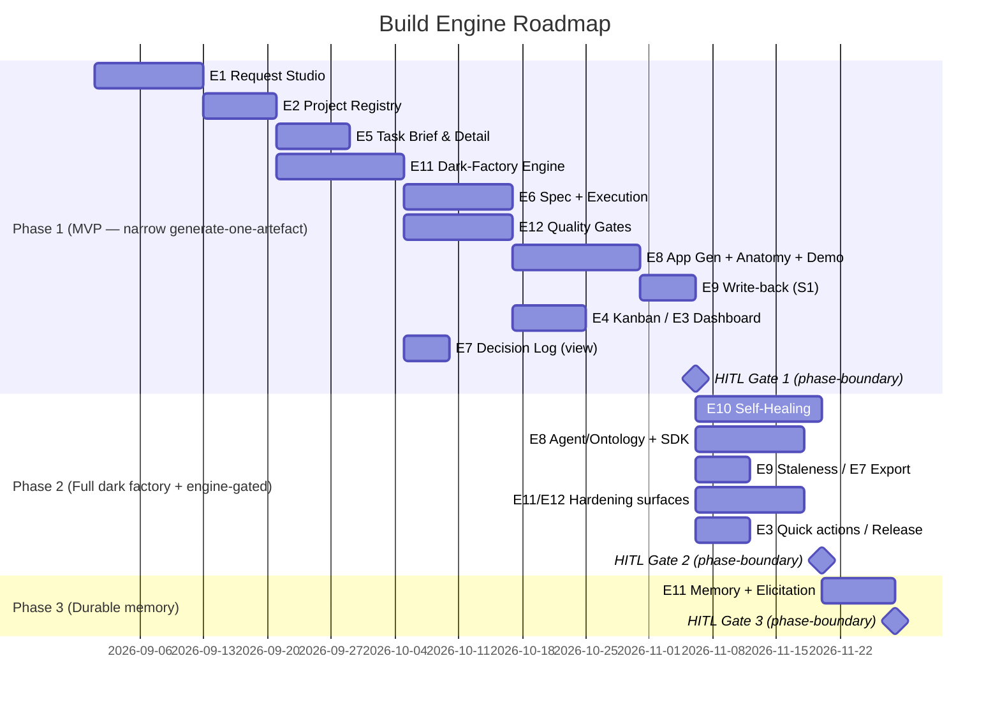

# Build Engine

> The Weave Build Engine is the place where a company turns its knowledge graph into working
> software. Within the company workspace, teams of humans and AI agents spin up and navigate
> multiple projects; for each project they collaboratively author a specification and then generate
> and ship the applications (UI + API), AI agents, data pipelines, and forms/dashboards it calls
> for. Every artefact is grounded in the company's ontology, vocabulary, brand, and governance
> constraints and stays traceable back to the graph it came from — replacing months of bespoke,
> tribal-knowledge-driven delivery with model-driven generation. Build is the GENERATE half of the
> Weave loop (model → generate → automate) and owns the `BE-ARTEFACT-1`, `BE-SELFIMPROVE-1`, and
> `BE-SDK-1` contracts.

## 1. Brief

### Mission Statement

We are building the Weave Build Engine — the place where a company turns its knowledge graph into
working software — so that within the company workspace, teams of humans and AI agents can spin up
and navigate multiple projects, and for each project collaboratively author a specification and
then generate and ship the applications (UI + API), AI agents, data pipelines, and forms/dashboards
it calls for. Every artefact is grounded in the company's ontology, vocabulary, brand, and
governance constraints and stays traceable back to the graph it came from — replacing months of
bespoke, tribal-knowledge-driven delivery with model-driven generation.

### Problem

Turning a description of how a business works into working software is slow, repetitive, and
disconnected from any authoritative model.

- **Low-code and codegen tools build from scratch.** They have no model of the business, so every
  app, pipeline, or form is assembled against tribal knowledge and re-derives the same entities and
  rules each time.
- **AI code generation is ungrounded.** General-purpose AI coding assistants hallucinate domain
  structure because nothing anchors them to the company's real processes, systems, data assets,
  vocabulary, and constraints — the process-centric model agents should reason inside.
- **Generated output ignores company standards.** Artefacts rarely respect the organisation's
  brand, tone of voice, naming/vocabulary, or governance and compliance rules — so they need heavy
  manual rework before they are usable or safe.
- **There is no traceability.** When something is generated, nobody can say which part of the model
  it came from; when the model changes, the generated artefact silently goes stale.
- **Spec, planning, and delivery are disconnected from the model — and from each other.** The
  specification lives in one tool, project management (kanban, issues) in another, and the running
  code in a third; none of them is anchored to the company graph, so context is re-gathered and
  re-explained at every hand-off between idea, business case, spec, and implementation.
- **Agents that build code lack project context.** An AI agent dropped into a repository with no
  map of the company's domains, services, or the project's own structure burns effort rediscovering
  what already exists — and still risks reinventing or duplicating it.
- **Agent-driven delivery is ungoverned.** There is no shared place to cap token/budget spend,
  manage secrets safely, classify data, or inherit company → domain → workspace → project policy —
  so autonomous building is either reckless or blocked.

The people who feel this are **engineers and architects** asked to deliver apps, agents, and
pipelines quickly and consistently, the **product owners** iterating on several specs at once, and
the **operations owners** who wait on them. If this is not solved, the value of having an
authoritative graph is never cashed in: the model describes the business, but humans still
hand-build everything that runs it — so Weave's "model → generate" promise collapses back into
ordinary bespoke software delivery.

### Vision

Within 12 months, success for the Build Engine looks like:

- **Projects are born from the graph.** A team spins up a project inside the company workspace and
  generates a working artefact — an application, AI agent, data pipeline, or dashboard — that runs a
  genuine business process and is grounded in the company's process-centric model (the processes,
  activities, actors, systems, services, data assets, capabilities, goals, and governing policies
  the graph links to that process), not assembled from scratch.
- **The spec-to-ship loop runs with humans and agents together.** A specification co-authored with
  PO/architect agents drives implementation either autonomously (the dark-factory agent teams) or
  through interactive human-in-the-loop sessions, moving through draft → review → approved with HITL
  gates and a mid-flight replan control, producing portable code a team can own.
- **Output meets the Constitution's standards measurably.** Generated artefacts are checked against
  the Constitution's brand, tone of voice, vocabulary, and governance/compliance constraints and
  pass an automated conformance bar (default 90% adherence, configurable per scope; measured against
  the published brand/voice standards) with no critical violations before human review — not
  "compliant by assertion".
- **Delivery is navigable and governed.** Multiple projects run concurrently, each navigable with
  its own dashboard and kanban; each enforces budget/token caps, manages secrets via AWS Secrets
  Manager, classifies data, and inherits company → domain → workspace → project policy.
- **Agents build efficiently from context.** Agents use a project anatomy/wiki and the company graph
  to deliver without rediscovering the codebase or the ecosystem, measurably reducing wasted effort
  and duplication.
- **The model stays alive in both directions.** Creating or updating a project writes its new and
  changed artefacts — services, APIs, data assets, components — back into the company ontology, and
  every artefact stays traceable to the graph elements and spec it came from, so when the model
  changes the affected artefacts are known.
- **Every agent decision is auditable.** Agent actions and the reasoning behind them are emitted to
  the platform's one immutable audit/provenance service; the Build decision log is a view over it,
  available for compliance, replay, and self-improvement.
- **Built products heal themselves — always with a human gate.** Built products and the dark factory
  observe their own logs to raise issues and dispatch fixes through the same agent pipeline; every
  fix passes a human gate (no autonomous merge). Improving Weave-the-product itself (Build's own
  prompts, workflows, and harness) is owned by the Weave Platform, which configures a shared
  signal→issue→dispatch engine that Build provides.

### Scope

The Build Engine is the company workspace's "Build" area: it holds many **projects** (one per coded
product/app), and for each project it runs the spec-to-ship loop, generation, governance, and
self-improvement.

#### In Scope

**Projects & navigation**

- Multiple projects under the company workspace, each navigable with its own dashboard (recent
  activity, metrics, spend).
- Project lifecycle from idea → business case → initiative sign-off → specification → implementation.

**Specification & planning**

- Specification authoring co-authored with PO/architect agents, with a spec lifecycle (draft →
  review → approved) and reviewers/timelines.
- Project management: kanban and graph views, issues, and dependency-aware task flow (moving a task
  to in-progress inherits its dependency trace).
- A project-level ontology view — this project's slice of the graph and its relationships, derived
  in part from the spec.
- A project anatomy/wiki (files, functions, and semantic explanations; capabilities, services,
  architectural decisions, runbooks) so agents traverse the codebase efficiently instead of
  rediscovering it.

**Generation (apps first)**

- Generate **applications (UI + API) first**, then AI agents, data pipelines, and forms/dashboards
  (ordering refined at roadmap).
- All output is grounded in the company graph and Constitution — applying the process-centric model
  (process ↔ activity ↔ actor ↔ system ↔ service ↔ data asset ↔ capability ↔ goal ↔ policy),
  glossary, brand/voice, and governance constraints, with conformance measured against the published
  standards (default 90% bar, configurable) before an artefact is considered done.
- Three run modes: autonomous dark-factory agent teams, interactive human-in-the-loop sessions, **and
  a Spike sandbox run that never merges to production** — all with HITL gates and a mid-flight replan
  control (instruction + criticality, must-fix-before-production).
- Portable code the team can own, pushed to the team's own repositories.

**Bidirectional graph sync**

- Write-back: new and changed artefacts (services, APIs, data assets, components) flow back into the
  company ontology, with full traceability between artefact, graph, and spec.

**Governance & operations of delivery**

- Project settings: token/budget caps and alerts, members and roles, data classification, and
  cascading policy inheritance (company → domain → workspace → project).
- Secrets and environment management via AWS Secrets Manager.
- Integrations consumed by reference through the platform managed-connector capability — Build uses
  Jira (task federation, Weave remaining source of truth) and Slack; no connector credential is
  stored in Build.
  <!-- SHARED-HOISTED: full 7-connector list replaced with PLAT-CONNECTOR-1 ref; see ../contracts.md PLAT-CONNECTOR-1 -->
- A decision log of agent actions and the reasoning behind them, surfaced as a view over the
  platform's one immutable audit/provenance service, for compliance, replay, and self-improvement.

**Self-healing** *(client-app + dark-factory; always HITL)*

- Operational self-healing for built products: observe deployment signals, raise issues, and dispatch
  fixes via agent teams — every fix passes a human gate, no autonomous merge.
- Dark-factory self-healing: the build agents monitor their own logs and dispatch remediations
  through the same HITL-gated pipeline.
- Build provides the shared signal→issue→dispatch engine; **Weave-the-product self-improvement**
  (improving Build's own prompts, workflows, model routing, and harness) is **owned by the Weave
  Platform**, which configures that shared engine — it is no longer a Build-owned capability.

#### Out of Scope

- **Authoring Constitution content** (ontology, glossary, brand, governance, motivation) — that is
  the Constitution Engine; the Build Engine consumes it and writes artefacts back, but does not
  author the governed model.
- **Business-process automations and the external event bus** (e.g. "when a delivery arrives, notify
  the store manager", webhooks, cron, ServiceNow triggers) — that is the Events & Actions Engine.
  Build owns self-healing of *its own* products and factory, not general business automation.
- **The org-wide graph visualisation and collaborative canvas** — that is Graph Explorer. Build has
  project-level kanban/graph PM views, not the company network explorer.
- **Managed source-system connectors** themselves — a platform-level capability Build consumes.
- **Long-term production hosting/runtime of client artefacts beyond deployment and self-healing** —
  operational hosting model is decided at platform/infra level.
- **Weave-the-product self-improvement** (improving Build's own prompts, workflows, model routing,
  and harness) — owned by the Weave Platform; Build only provides the shared signal→issue→dispatch
  engine the Platform configures.
- **The immutable audit/provenance store itself** — owned by the Weave Platform; Build emits typed
  events to it and surfaces its decision log as a view, keeping no independent signed store.

### Target Users

| User Type | Description | Primary Need |
|-----------|-------------|--------------|
| Product owner | Authors and iterates specifications across several projects at once | Agent-assisted spec authoring with a clear lifecycle, grounded in the company model |
| Technical architect | Designs the high- and low-level solution for a project | A project-level ontology and anatomy that ground design decisions in the real ecosystem |
| Engineer / developer | Owns, extends, and reviews generated code; drives interactive build sessions | Portable, compliant code plus HITL control and a replan lever when the agents drift |
| Delivery / engineering manager | Oversees multiple projects, budgets, and people | Dashboards, kanban, budget/token caps, roles, and policy inheritance across projects |
| Operations owner / SRE | Runs the built products in production | Self-healing that surfaces issues from logs and opens and resolves fixes, with an audit trail |

### Success Criteria

- [ ] **An app is generated and shipped from the graph.** At least one project generates an
  application (UI + API) that runs a genuine business process and is deployed to a working
  environment. Measured by a deployed, demonstrable app; source: deployment records. Target: within
  6 months of the Build Engine's first release.
- [ ] **Output meets the Constitution's standards measurably.** Generated artefacts pass an automated
  conformance check against the Constitution's brand, vocabulary, and governance constraints
  (measured against the published brand/voice standards) at or above the conformance bar — default
  90% adherence, configurable per scope — with no critical violations before human review. Measured
  by conformance audit; source: build/decision logs. Target: within 6 months of first release.
- [ ] **The spec-to-ship loop works in both modes.** At least one project completes spec (draft →
  approved) → implementation via the autonomous dark factory, and at least one via an interactive
  human-in-the-loop session. Measured by project lifecycle records; source: project store. Target:
  within 6 months of first release.
- [ ] **The graph stays alive in both directions.** At least one project writes its generated
  artefacts (services, APIs, data assets) back into the company ontology, and they are queryable in
  the Constitution Engine. Measured by a before/after graph diff; source: graph store. Target: within
  6 months of first release.
- [ ] **Delivery is governed.** Budget/token caps are enforced (a run halts or alerts at its cap), no
  secret is ever written into generated code (verified by secret scanning), and policy inheritance is
  applied. Measured by cap-event logs and secret-scan results; source: build logs and CI. Target: at
  first release.
- [ ] **Self-healing closes at least one loop.** At least one issue is automatically raised from logs
  (for a built product or for the dark factory itself) and a fix is opened and resolved through to
  human approval. Measured by the issue and decision-log trail; source: compliance/decision log.
  Target: within 9 months of first release.

### Constraints

**Technical**

- Generated artefacts target Weave's confirmed stacks (TypeScript/Next.js for UI, Python/FastAPI for
  API/services), and AI agents are generated against the **Anthropic Agent SDK (Claude Agent SDK)** —
  Python primary, TypeScript secondary. (CLAUDE.md updated 2026-06-26; AgentCore runtime fit is
  revisited in this engine's tech spec.)
- Output must be portable code the client team can own and run, not a locked-in runtime.
- Each project targets a specific published ontology version (pinned), so that ontology evolution
  does not silently break a project's generated artefacts; upgrading the pin is a deliberate action.
- Measured conformance is a hard requirement: every artefact applies the Constitution's ontology,
  glossary, brand/voice, and governance constraints, and passes the conformance bar (default 90%
  adherence, configurable; measured against the published brand/voice standards) before it is
  considered done.
- Secrets are never embedded in generated code — AWS Secrets Manager only, enforced by secret
  scanning (per the project security rules). An outbound-prompt scrubber redacts secrets/PII before
  any prompt reaches a model provider.
- The decision log is a view over the platform's one append-only, tamper-evident audit/provenance
  service; no agent can alter it, and Build keeps no independent signed store.
- Dark-factory agents are long-running and must respect budget/token caps and HITL gates.

**Business**

- Generated code is portable and owned by the client; no lock-in.
- Weave remains the source of truth even when integrated with external tools (e.g. Jira task
  federation).
- Usage-based revenue is tied to generation and automation runs (per the platform pricing decision),
  so generation events must be metered.

**Timeline / sequencing**

- The Build Engine depends on the Constitution Engine (the MVP) and ships after it.
- Applications (UI + API) are the first generation target; agents, pipelines, and dashboards follow.
- Weave-product self-improvement (Platform-owned, configuring Build's shared engine) may *propose*
  changes to Build's agent prompts or harness, but changes are applied only through human-approved
  review (PRs), never auto-applied; client-app self-healing is likewise always HITL-gated with no
  autonomous merge.

### Key Decisions (Brief)

For the platform-wide master list see `CLAUDE.md § Architecture decisions (confirmed)` and the
`weave-platform` brief. Decisions specific to the Build Engine:
<!-- SHARED-HOISTED: program Laws / MVP success criterion live in ../weave-spec.md §Program -->

| Decision | Rationale | Date |
|----------|-----------|------|
| Build Engine owns the company workspace's "Build" area: multiple projects, spec lifecycle, PM, generation, and delivery | "Workspace" is the company/Weave level; "project" is the per-product level inside Build — keeps a clean two-tier model | 2026-06-26 |
| Generate applications (UI + API) first; agents, pipelines, dashboards follow | Most demonstrable MVP proof and the tour artefact is an app; exercises the full brand+ontology stack | 2026-06-26 |
| AI agents are generated against the Anthropic Agent SDK (Claude Agent SDK) | Matches the chosen direction and latest Claude models; AgentCore runtime fit revisited at tech spec | 2026-06-26 |
| Measured conformance is a hard requirement (default 90% bar, configurable) | Generation must apply the Constitution's ontology, glossary, brand/voice, and governance and pass an automated conformance check against the published standards — "compliant by construction" is replaced by a falsifiable bar | 2026-06-30 |
| Bidirectional graph sync — Build writes artefacts back into the ontology | Keeps the model alive and the graph reflecting what was actually built, not just planned | 2026-06-26 |
| Three run modes: autonomous dark-factory teams, interactive human-in-the-loop, and a Spike sandbox (no prod merge) | Different work and risk levels need different human involvement; a sandbox mode that never reaches production is a distinct safety control; all share spec lifecycle, gates, and replan | 2026-06-30 |
| Client-app + dark-factory self-healing live in Build (always HITL); general business automation stays in Events & Actions | Build heals its own products and factory; every dispatched fix passes a human gate (no autonomous merge); the Events Engine owns business-process automation | 2026-06-30 |
| Weave-product self-improvement is Platform-owned; Build provides the shared signal→issue→dispatch engine | One Weave-product self-improvement subsystem (Platform), configuring Build's reusable engine; the former Build self-improvement engine folds into Platform | 2026-06-30 |
| Decision log is a view over the platform's one immutable audit/provenance service | One platform-owned, append-only, tamper-evident system of record; Build emits typed events and keeps no independent signed store | 2026-06-30 |
| Descriptive, human-intelligible naming — no codenames | See `.claude/memory/decision_naming-convention.md`; BluShift → Weave, Polaris → self-improvement engine | 2026-06-26 |
| Projects pin to a specific published ontology version | Prevents ontology evolution from silently breaking generated artefacts; versioning lifecycle owned by Constitution Engine | 2026-06-26 |

### Navigation

First-draft **secondary navigation** (left sidebar) for the **Build** primary area. The primary
top-header nav is defined in the `weave-platform` brief. Build has two sidebar levels because it
contains many projects.

**Build root (no project selected)**

- **Projects** — list of project workspaces (cards with status, activity, spend); open or create.
- **New Request** — Request Studio: start from a natural-language request → spec → run mode.
- **Templates & module kit** — reusable starting points and pattern kit.
- **Build settings** — defaults, roles, and cascading policies that flow into projects.

**Inside a project (project selected)**

- **Overview** — project dashboard: activity, metrics, spend, status.
- **Spec** — the specification, co-authored with PO/architect agents; lifecycle draft → review →
  approved.
- **Plan / Kanban** — project management: kanban and dependency-aware task flow, issues.
- **Project ontology** — this project's slice of the graph and its relationships.
- **Anatomy / Wiki** — files, functions, capabilities, services, decisions, runbooks for agent and
  human context.
- **Artefacts** — generated apps, agents, pipelines, dashboards and their deploy status.
- **Decision log** — a view over the platform immutable audit/provenance service: agent actions and
  reasoning for this project.
- **Self-healing** — issues raised from deployment signals and the fixes dispatched/resolved (always
  HITL-gated).
- **Settings** — budget/token caps, integrations (Jira, Slack), secrets, data classification, policy
  inheritance, pinned ontology version.

## 2. Product Requirements (PRD)

### Product context

The Build Engine is where the company knowledge graph becomes working software. A team describes
what they want to build — in natural language, through AI-assisted intake — and the engine closes
the loop from idea through specification, planning, autonomous or interactive generation, and
deployment. Every generated artefact is grounded in the company's process-centric model (the BPMO
graph the Constitution Engine serves — processes and their activities, actors, systems, services,
data assets, capabilities, goals, and governing policies), its vocabulary, brand, and governance
rules, and writes new services/APIs/data-assets back into that graph.

The engine runs multiple concurrent **projects** (one per built product), each managed as a
first-class workspace within the Build area. For each project, the spec-to-ship loop runs through:
**Request Studio intake** → **AI-assisted specification** → **HITL spec review** → **implementation
by autonomous dark-factory agents, an interactive human-in-the-loop session, or a Spike sandbox
run** → **artefact deployment** → **client-app self-healing** → **write-back to the company graph**.

Key patterns confirmed from the Blushift prototype and the dark-factory harness:

- **Request Studio** is the AI request intake (CTA "New Request"): the user describes what they want,
  the AI drafts a brief, PRD, and tech spec, and computes a blast-radius impact analysis, which the
  team reviews and approves before a project starts.
- **Dark-factory agents** (Engineer, QA, Architect, Review, Sandbox) execute tasks; each task has a
  typed YAML brief, a dependency chain, and a HITL gate. Each agent step emits a **typed result
  block** the orchestrator branches on.
- **Three run modes** are selectable at intake: Draft-spec-only, Spec→review→build, and **Spike
  (sandbox repo, never merges to production)**.
- **Generation is gated** by SAST, type checks, delta-scoped mutation testing, a package-existence
  (slopsquatting) check, and a conformance check against published brand / voice standards — so
  conformance is measured, not asserted.
- **Self-healing** (E10) observes deployed-app signals and dispatches fixes through the same dark
  factory, **always behind a human gate** (no autonomous merge).
- **Bidirectional graph sync**: generated artefacts write back into the company ontology through the
  Constitution Engine's validated write path.

> Decision note: Weave-the-product self-improvement (improving Build's own prompts, workflows, model
> routing, and harness) is **owned by the Weave Platform**, configured through the shared
> `BE-SELFIMPROVE-1` engine that Build provides — see §2.3. Build no longer enumerates a
> self-improvement proposal taxonomy of its own.

**Goals**

1. Let any team go from a natural-language description to a generated, deployed artefact grounded in
   the company graph — without starting from a blank project or tribal knowledge.
2. Provide a complete spec-to-ship project management surface (kanban, task tree, spec lifecycle,
   dependency tracking, budget, demo readiness) inside Weave — no external PM tool required.
3. Execute implementation autonomously (dark factory), interactively (human-in-the-loop), or in a
   Spike sandbox, all with HITL gates and a replan control, producing portable code the team can own.
4. Govern every project: cascading budget/token caps, secrets in AWS Secrets Manager, tenant
   isolation, and a decision log that is a view over the platform immutable audit service.
5. Keep the company graph alive in both directions: Constitution Engine content grounds generation;
   generated artefacts write back into the graph.
6. Surface client-app self-healing for deployed products and dispatch fixes through the dark factory,
   always human-approved.

**Non-Goals**

1. **Authoring the company ontology, glossary, brand, or governance rules** — owned by the
   **Constitution Engine** (Build consumes via `CE-READ-1` / `CE-BRAND-1`, writes via `CE-WRITE-1`).
2. **Business-process automation and the external event bus** — owned by the **Events & Actions
   Engine** (`EA-AUTOMATION-1`). Build self-heals only its own products and factory.
3. **Company-wide graph visualisation and the collaborative canvas** — owned by **Graph Explorer**.
   Build embeds the project-scoped slice via `GE-CANVAS-1` but owns no canvas of its own.
4. **Weave-the-product self-improvement** (improving Build's prompts/workflows/harness) — owned by
   **Weave Platform**; Build only provides the shared `BE-SELFIMPROVE-1` engine it configures.
5. **The immutable audit/provenance store itself** — owned by **Weave Platform** (`PLAT-AUDIT-1`);
   Build's decision log is a filtered view over it.
6. **Managed source-system connectors themselves** — a platform capability (`PLAT-CONNECTOR-1`);
   Build consumes connector handles (e.g. Jira, Slack).
7. **Long-term production hosting beyond deployment and self-healing** — decided at platform/infra
   level.

**Personas & roles**

| Persona | Description | Primary need | Permission level |
|---|---|---|---|
| Product owner | Authors and iterates specs via Request Studio across several projects | Agent-assisted, graph-grounded spec authoring with a clear lifecycle | author |
| Technical architect | Designs the high/low-level solution; resolves architectural decisions | Project ontology + anatomy grounding design in the real ecosystem | author |
| Engineer / developer | Owns, extends, reviews generated code; drives interactive sessions | Portable compliant code + HITL control + a replan lever | author |
| Delivery / engineering manager | Oversees multiple projects, budgets, people | Dashboards, kanban, cascading caps, roles, policy inheritance | admin (project) |
| Ops / SRE | Runs built products in production | Self-healing that surfaces issues and dispatches HITL-gated fixes, with audit | author |
| Compliance officer | Audits what the dark factory did and why | Queryable, tamper-evident decision-log view + export | read |

> Role slugs align with the platform RBAC model resolved through the tenancy cascade
> (`PLAT-SETTINGS-1`). Dark-factory agents are non-human principals minted by `PLAT-IDENTITY-1`,
> never holders of these human roles.

### 2.1 Functional requirements

> ACs (Given/When/Then + a failure-mode AC) live with each story in §3 Epics. This table carries the
> one-line requirement, its story, priority, and the **Phase / depends-on** tag.

| ID | Requirement | Story | Priority | Phase / depends-on |
|---|---|---|---|---|
| FR-001 | Request Studio (CTA "New Request"): free-text intake + run-mode selector → AI-drafted brief+PRD+tech spec (streaming, `claude-opus-4-8`); grounding via `CE-READ-1` | E1-S1 | P0 | MVP · CE GA |
| FR-002 | Three run modes selectable at intake: Draft-spec-only / Spec→review→build / Spike (sandbox, no prod merge) | E1-S1, E6-S2 | P0 | MVP |
| FR-003 | Intake blast-radius + risk: domains (primary/secondary/discarded), services (`modify\|consume\|NEW`) via `CE-READ-1`; Critic flags + quality signals; HITL before project creation | E1-S2 | P0 | MVP · CE GA |
| FR-004 | Pre-generation cost-estimate gate: block project creation when estimate > per-spec cap (default ~$25-equiv, tunable) resolved via `PLAT-SETTINGS-1` | E1-S3 | P0 | MVP · Platform settings |
| FR-005 | Stakeholder sign-off: reviewers from graph (`CE-READ-1`); approve/changes/reject (comment mandatory); spec locked on submit; auto-create on all-approved | E1-S4 | P0 | MVP · CE GA |
| FR-006 | Projects grid + filters + search; per-card status, budget, demo state, actions; localized error on metrics outage | E2-S1 | P0 | MVP |
| FR-007 | Project auto-created from approved request with pinned version via `CE-VERSION-1`; anatomy pre-seeded; idempotent create | E2-S2 | P0 | MVP · CE GA |
| FR-008 | Cascading governance via `PLAT-SETTINGS-1` (tighter-wins): per-spec/per-PR caps, burn-rate alert, overage-review trigger, model-tier gating, 100% hard-reject — all configurable defaults; metering via `PLAT-BILLING-1` (per-token + per-run) | E2-S3 | P0 | MVP · Platform settings+billing |
| FR-009 | Integrations bound by reference via `PLAT-CONNECTOR-1` (Jira handle, Slack channel); no connector credential stored in Build | E2-S3 | P0 | MVP · Platform connectors |
| FR-010 | Secrets are AWS Secrets Manager references only; secret-scan gate blocks plaintext secrets in generated code | E2-S3, E8-S1 | P0 | MVP |
| FR-011 | "Upgrade pin" shows `CE-DIFF-1` diff (nodes + edges) and requires explicit confirmation | E2-S3 | P0 | MVP · CE GA |
| FR-012 | Project dashboard: 6 areas + commit ribbon; per-tile error isolation; read-only Platform self-improvement card | E3-S1 | P0 | MVP |
| FR-013 | Budget tile estimate-vs-actual ratio (default ×1.0 ±0.2, tunable, flagged assumption) | E3-S1 | P0 | MVP |
| FR-014 | Quick actions (Run demo / Replan / Plan release / Open Kanban) with deploy-failure handling | E3-S2 | P1 | Phase 2 |
| FR-015 | Kanban: 6 lanes; cards state-coded with legend; per-class retry chip; RUNNING + agent-failure states | E4-S1 | P0 | MVP |
| FR-016 | Task tree dependency graph (state-coded, legend, keyboard-nav); orphan flagging | E4-S2 | P0 | MVP |
| FR-017 | Board filters (All / In flight / Blocked / Self-improvement-flagged / This phase) | E4-S3 | P0 | MVP |
| FR-018 | Self-contained typed YAML task brief — superset: EARS acceptance (each mapped to a named test), `design_tokens` from `CE-BRAND-1`, layout_constraints, forbidden_inferences, required_diagrams, provenance, dependency_chain, **DoR checklist** (FR-046), **DoD checklist** (FR-047), **test-requirements** (type counts + AC-to-test map), **implementation hints**, **token-cost estimate**; brief alone + dep summaries suffice to implement; incomplete-brief → replan | E5-S1 | P0 | MVP · CE GA |
| FR-019 | Task Detail 5 tabs (Brief/Handoff/Tests/Console/Audit); Audit tab is a `PLAT-AUDIT-1` view | E5-S2 | P0 | MVP · Platform audit |
| FR-020 | Provenance links on brief (spec section, ADR, **Critic finding**, self-improvement proposal) | E5-S2 | P0 | MVP |
| FR-021 | Spec library + viewer (Spec/Reviews/Timeline/References) + editor (Brief/PRD/Tech spec/Decisions/History); non-destructive regenerate | E6-S1 | P0 | MVP |
| FR-022 | Dark-factory agents (Engineer/QA/Architect/Review/Sandbox) under named principals from `PLAT-IDENTITY-1`; autonomous / interactive / Spike execution; **per-role tool scopes + turn caps** (defaults tunable via `PLAT-SETTINGS-1`; out-of-scope tool call BLOCKED+audited) incl. the **QA tests-only / never-modify-impl boundary**; turn-cap reached → halt to HITL | E6-S2 | P0 | MVP · Platform identity |
| FR-023 | Typed result block per agent step (`status/artifact_path/failure_class`) driving orchestrator branching | E6-S3 | P0 | MVP |
| FR-024 | Four-class retry taxonomy (logic 3 / dependency 1 / interface 1 / spec-ambiguity 0→replan), configurable defaults; spec-ambiguity never code-retried | E6-S3 | P0 | MVP |
| FR-025 | HITL gates (configurable trigger + deadline escalation via `PLAT-NOTIFY-1`); mid-flight replan → Architect plan → human approval | E6-S4 | P0 | MVP · Platform notify |
| FR-026 | No-self-approval invariant: agent principals cannot approve a gate/escalation their own action triggered; approver recorded in `PLAT-AUDIT-1`; per-env deploy authority (default prod = two-person + Critic pass) | E6-S4 | P0 | MVP · Platform identity+audit |
| FR-027 | Decision log = filtered view over `PLAT-AUDIT-1`; Build keeps no independent signed store; mutating action fails closed if audit unreachable | E7-S1 | P0 | MVP · Platform audit |
| FR-028 | Decision-log export delegated to `PLAT-AUDIT-1` query+export (JSON/NDJSON, filtered, signature-verification metadata) | E7-S2 | P1 | Phase 2 · Platform audit |
| FR-029 | Application generation gates (pre-commit, all required): SAST (Bandit/Semgrep), mypy/tsc, delta mutation ≥70%, package-existence hard-block, secret-scan, conformance vs `CE-BRAND-1` (default ≥90%, tunable, no critical violations); atomic on failure | E8-S1 | P0 | MVP · CE GA |
| FR-030 | AI-agent generation (Anthropic Agent SDK); tools grounded in the BPMO graph (process↔actor↔system↔data, policy enforcement); authority bounded by the model (`CE-READ-1` agent-grounding, unstated→deny); principal from `PLAT-IDENTITY-1`; RBAC from graph; only confirmed model ids — no prototype placeholders | E8-S2 | P1 | Phase 2 |
| FR-031 | Anatomy/Wiki auto-index (files/functions, capabilities, service catalog, ADR index, runbooks); loaded into agent context | E8-S3 | P0 | MVP |
| FR-032 | Project Ontology embeds `GE-CANVAS-1` (mode c4/force, filterByIri=project IRI, readonly); edits via `CE-WRITE-1`; fallback list on canvas outage | E8-S3 | P1 | Phase 2 · Explorer canvas |
| FR-033 | Deployment + visual-state capture (8 named states, baseline diff); time-limited shareable demo URL; deploy-failure handling | E8-S4 | P0 | MVP |
| FR-034 | Release/rollback plan artefact (rollout sequence + feature-flag rollback, scope, approvers, target date) | E8-S4 | P1 | Phase 2 |
| FR-035 | Write-back via `BE-ARTEFACT-1` → `CE-WRITE-1` (clone→SHACL→422, PROV-O attribution); MUST NOT use any auto-apply bypass; 422 → feature-flag rollback | E9-S1 | P0 | MVP · CE GA |
| FR-036 | `BE-ARTEFACT-1` provenance header per artefact; stale indicator from `CE-VERSION-1` canonical lag (default ≥2, configurable); version-lag notify via `PLAT-NOTIFY-1` | E9-S2 | P1 | Phase 2 · CE GA |
| FR-037 | Self-healing signal collection (12 types) with configurable-default thresholds flagged as assumptions; per-source collection-failure state | E10-S1 | P1 | Phase 2 |
| FR-038 | Issue creation (`claude-sonnet-4-6`) + duplicate-append; CRITICAL auto-notify; configures shared `BE-SELFIMPROVE-1` engine | E10-S2 | P1 | Phase 2 |
| FR-039 | HITL-gated dispatch through deterministic gate sequence (deny→authority→automatable→HITL); no autonomous merge (D4); auto-reopen after observation window (default 30 min, tunable) | E10-S2 | P1 | Phase 2 |
| FR-040 | Self-healing screen (signal bar, open/resolved issues) + dashboard summary chip | E10-S3 | P1 | Phase 2 |
| FR-041 | Bounded autonomous run: orchestrator-enforced turn/iteration cap on dispatch cycles (default 60, tunable via `PLAT-SETTINGS-1`; distinct from FR-022 per-agent turn caps) **in addition to** the FR-008 cost cap; either cap halts the run to HITL with state preserved; halt fires `PLAT-NOTIFY-1` | E11-S1 | P0 | MVP · runtime OQ-02 |
| FR-042 | Per-task PLAN→DELEGATE→ASSESS→CODIFY lifecycle; CODIFY non-skippable (summary written + state committed before Done); resumable from last completed stage on crash | E11-S2 | P0 | MVP |
| FR-043 | Per-task dependency-summary handoff (decisions/edge-cases/context) to tenant-scoped store (RLS, OQ-06); dependents MUST read predecessors' summaries in PLAN; orchestrator receives summary (not source) on sub-agent completion; missing summary → replan | E11-S3 | P0 | MVP |
| FR-044 | State-spine schema as contract (`{project_iri, phase, epics[], tasks[{id,epic,status,blocked_by[]}]}`) in a **per-tenant DB table with RLS** (OQ-06); `ready` DAG-frontier resolver + `phase-complete` query; committed after every task (resumability contract) | E11-S4 | P0 | MVP · OQ-06 |
| FR-045 | Configurable dark-factory model routing: `{role\|tier\|complexity}→{provider,model}` per environment, overridable via `PLAT-SETTINGS-1`; Ollama/Bedrock/Anthropic-API abstraction; minimise Bedrock; confirmed Claude ids only; metered via `PLAT-BILLING-1`; provider-down → policy fallback + `PLAT-NOTIFY-1`, no-provider → halt; local-fidelity paths re-run on Claude tier before phase-gate (`../dev-environment.md` §3) | E11-S5 | P0 | MVP · Platform settings+billing |
| FR-046 | First-class DoR gate: mechanical checklist verified in PLAN before DELEGATE; any single FAIL → NOT READY → replan; unevaluable brief defaults to NOT READY | E12-S1 | P0 | MVP |
| FR-047 | First-class DoD gate: mechanically-verifiable checklist (lint, type-check, complexity ≤10/15/50, coverage ≥80%, mutation ≥70%, SAST 0-high, boundary validation, no eval, docs, git hygiene — defaults tunable); QA runs commands itself, never self-report; unrunnable command → NOT VERIFIED (fail) | E12-S2 | P0 | MVP |
| FR-048 | Agent self-verification ritual before each HITL handoff: line-by-line rule self-check (`complied\|violated\|n/a`) + confidence note naming weakest part; any `violated` STOPs for revision | E11-S6 | P1 | Phase 2 |
| FR-049 | Dependency/credential preflight before scaffold + at each phase boundary: verify system deps + credential **reference names** exist (never read values); critical-missing → STOP to HITL | E11-S6 | P1 | Phase 2 |
| FR-050 | First-run scaffolding gate: scaffold env (CI, hooks, health route, smoke test) then **force web HITL environment-verification** via `PLAT-NOTIFY-1` before any feature task dispatches | E11-S6 | P1 | Phase 2 |
| FR-051 | Isolated read-only investigator runs: answer one narrow question, return pointer+summary (not source) to tenant-scoped output, keep orchestrator context clean; no sub-investigators (addresses OQ-11) | E11-S6 | P1 | Phase 2 · OQ-11 |
| FR-052 | Phase-gate ceremony auto-triggered on phase-complete (FR-044): security review (CRITICAL blocks Approve), mutation score (default <70% RED), cumulative spec-coverage audit (FR-053), doc-gen, phase-summary artefact → **web HITL Approve/Amend/Reject** via `PLAT-NOTIFY-1` (no self-approval); Reject writes escalation + halts; fail-closed on ceremony error | E12-S5 | P0 | MVP · Platform notify |
| FR-053 | Cumulative spec-coverage audit at phase end: every `Must` FR/NFR → DELIVERED/PARTIAL/MISSING vs code/test, `cumulative_coverage_pct`; phase halts unless ≥90% Must DELIVERED (default, tunable) **and** zero MISSING; ambiguous → MISSING | E12-S4 | P0 | MVP |
| FR-054 | Full QA category suite per task: AC↔test, coverage ≥80%, complexity budget, lint, design/diagram conformance, a11y (axe/WCAG AA), perf load test, browser-automation **with backend assertion**, delta mutation, edge-case test extension; unavailable tooling → NOT VERIFIED (fail) | E12-S3 | P0 | MVP |
| FR-055 | Pre-scaffold whole-spec review gate: cascade check (brief→PRD→roadmap→tech-spec→impl-ready) with hard blockers + completeness/consistency review; critical gap halts scaffolding → spec replan | E12-S6 | P0 | MVP |
| FR-056 | Cross-task finding propagation (`affects:[task_id…]` in tenant-scoped store; affected tasks read before validating) + project escalation queue (recommendation recurring ≥2× → project issue with owner+deadline) | E12-S7 | P1 | Phase 2 |
| FR-057 | Reality-drift detection (code vs spec): Confirmed/Contradicted/Unverifiable table, SOT recommendation, never auto-resolve; contradictions → Blockers & Escalations; distinct from version-lag (FR-036); code-graph unavailable → "drift unknown" | E12-S8 | P1 | Phase 2 |
| FR-058 | Per-project durable memory: tenant-scoped, committed decisions/conventions/references injected into agent sessions at run start; structured elicitation toolkit available on conflicting requirements / unclear root cause | E11-S6 | P2 | Later |
| FR-059 | Ontology→typed-SDK generation (`BE-SDK-1`): from a pinned CE version, generate a typed client SDK (TypeScript/npm + Python/pip) over the BPMO kinds + SHACL shapes — SHACL node shape→class, properties→typed fields, SPARQL SELECT→typed query method — **and** a standalone OpenAPI 3.1 contract for the graph query/write surface; versioned to the pin, `BE-ARTEFACT-1` provenance, regenerable on `CE-DIFF-1` change (bumped tag, prior package retained), forkable/client-owned; `CE-READ-1` unreachable / shapes unresolvable → atomic fail, no partial package | E8-S5 | P1 | Phase 2 · CE GA |

> **Folded out:** the former E12 self-improvement proposal taxonomy (PROMPT/WORKFLOW/RULE/CONTEXT/
> MODEL) and its FRs are **owned by Weave Platform** and removed here (A3, `BE-SELFIMPROVE-1`). Build
> provides the shared engine and surfaces relevant proposals read-only (FR-012).

### 2.2 Non-functional requirements

#### Performance

- Project dashboard load: default ≤ 2 s (p95), tunable per environment SLO.
- Kanban with 50 tasks: default ≤ 1 s initial render, ≤ 100 ms lane-filter switch.
- Task detail panel open: default ≤ 500 ms (p95).
- Agent tool-use console: first token default ≤ 500 ms of agent action; subsequent tokens ≤ 200 ms.
- Request Studio generation: first section token default ≤ 2 s; full draft default ≤ 60 s (p95).
- Visual-state capture: default ≤ 30 s for 8 states per task.
- All performance numbers are configurable per-environment SLO targets, not hard product limits; they
  are baselines to validate, not traced requirements.

#### Security

- **Outbound-prompt scrubber:** before any prompt reaches a model provider, a redaction pass removes
  secrets/PII (default patterns: SSN, `sk_live_*`-style API keys, sort codes, plus a domain
  blocklist), pattern set configurable per workspace. Test: a prompt seeded with a known secret token
  reaches the provider mock with the token redacted. (CLAUDE.md: never log/transmit PII.)
- **Sandbox agent controls:** writes to protected paths (credentials, `.env`, `~/.kube`, AWS config)
  are BLOCKED and logged to `PLAT-AUDIT-1`; **network egress is restricted to an allowlist**;
  **destructive bash is blocked** (`rm -rf`, `mkfs`, `dd`). Test: an attempted protected-path write,
  an off-allowlist egress, and a destructive bash each yield a BLOCKED audit entry and no side effect.
- **Generation gates** (E8-S1): SAST + package-existence + secret-scan run before any commit; secrets
  are AWS Secrets Manager references only — never plaintext in the data model or code.
- **Agent identity:** least-privilege principals from `PLAT-IDENTITY-1`; the no-self-approval
  invariant (FR-026) is enforced and tested (an agent attempting to approve its own gate is rejected
  and logged).

#### Reliability

- Generation is **atomic per task**: a mid-pipeline failure commits nothing (E6-S2/E8-S1).
- Write-back is transactional against `CE-WRITE-1`'s clone-validate-or-422 semantics; a 422 triggers
  feature-flag rollback so deployed state and graph never silently diverge (FR-035).
- Audit emission is **fail-closed**: a mutating agent action is refused if `PLAT-AUDIT-1` is
  unreachable (FR-027).
- Self-healing dispatch is idempotent (duplicate-append by signal-type+ARN) and re-opens on a
  configurable observation window (FR-039).

#### Observability

- Every agent tool use emits an OTel span with attributes: `agent.principal_iri`, `tool`, `target`,
  `duration_ms`, `outcome`, `failure_class`.
- Every generation run emits: `spec_id`, `artefact_type`, `token_count_by_model`, `latency_ms`, SHACL
  result, secret-scan result, SAST result, mutation-score, conformance-score.
- Logs correlate by `project_iri` + `task_id` + `activity_iri` (the `CE-WRITE-1` PROV-O activity).

#### Accessibility

- Kanban, task detail, spec editor: WCAG 2.1 AA; task-tree SVG nodes keyboard-navigable (Enter opens
  detail). Zero-violations gate (axe) on these surfaces in CI.

#### Isolation & data safety

- **Multi-tenant isolation is required across every Build-touched store** — project records,
  decision-log view, secret references, generated repos, and graph write-back. The expected mechanism
  is **either store/schema-per-tenant OR a tenant partition key with row-level security** enforced
  through the `PLAT-SETTINGS-1` tenancy cascade; for graph access the mechanism is a named-graph +
  query-rewriting layer that **rejects unscoped queries**. The final mechanism is an Architect
  tech-spec decision (OQ-06), but the requirement holds now.
- **Cross-tenant-read test (required):** given a tenant-A principal, a request for any tenant-B
  project record, decision-log entry, or graph triple returns **zero** tenant-B data (the test fails
  the build if any leaks).

#### Browser / device support

- Chrome, Firefox, Safari — latest 2 major versions. Desktop-first.

### 2.3 Inter-engine interfaces

> Contracts referenced by ID from `../contracts.md` (canonical: `../contracts.md`).
> Consumed contracts are pinned to the project's pinned graph version where they read the model.
> Full contract definitions live in `../contracts.md` — cited here by ID + intent only.

**Consumed (Build calls / reads)**

| Provider engine | Contract | Version pin | Used for |
|---|---|---|---|
| Constitution Engine | `CE-READ-1` | project pinned version | Grounding context, blast-radius, stakeholder resolution, SPARQL reads |
| Constitution Engine | `CE-WRITE-1` | latest (write target = draft/version) | Validated write-back (`POST /api/operations/apply`), clone→SHACL→422 |
| Constitution Engine | `CE-DIFF-1` | from-pin → to-version | "Upgrade pin" diff (nodes + edges) |
| Constitution Engine | `CE-VERSION-1` | n/a (lag source) | Pinned-version resolution + canonical staleness (default lag ≥2) |
| Constitution Engine | `CE-BRAND-1` | project pinned version | Design tokens + VoiceRules; conformance check (default ≥90%) |
| Graph Explorer | `GE-CANVAS-1` | project pinned version | Embedded read-only project-ontology slice (mode c4/force) |
| Weave Platform | `PLAT-AUDIT-1` | stable | Emit audit events; decision-log view + export |
| Weave Platform | `PLAT-IDENTITY-1` | stable | Agent service-principal IRIs (5 dark-factory roles); no-self-approval |
| Weave Platform | `PLAT-SETTINGS-1` | stable | 4-level cascade for budget caps, model-tier gating, RBAC, retry ceilings |
| Weave Platform | `PLAT-BILLING-1` | stable | Per-token generation metering + per-run automation metering |
| Weave Platform | `PLAT-NOTIFY-1` | stable | HITL-gate, budget, generation-failure, version-lag, self-heal events |
| Weave Platform | `PLAT-CONNECTOR-1` | stable | Jira/Slack connector handles (by reference; credentials in Secrets Manager) |

**Provided (Build exposes to others)**

| Contract | Consumers | Shape (link) | Stability |
|---|---|---|---|
| `BE-ARTEFACT-1` | Constitution Engine (graph), Platform (audit/provenance) | [contracts §4](../contracts.md) | beta |
| `BE-SELFIMPROVE-1` | Weave Platform (Weave-product self-improvement) + Build E10 (client-app self-healing) | [contracts §4](../contracts.md) | beta |
| `BE-SDK-1` — ontology→typed-SDK + standalone graph-surface OpenAPI 3.1, versioned to a pinned CE version, `BE-ARTEFACT-1` provenance, regenerable on `CE-DIFF-1`, forkable/client-owned | Client engineering teams (consume the generated graph SDK), downstream apps generated by Build | [contracts §4](../contracts.md) | alpha |

> External boundary cited: `EA-AUTOMATION-1` (Events & Actions Engine) owns business-process
> automation — Build self-heals only its own products and factory, never general automation.

### 2.4 Open questions (for Tech Spec)

| # | Question | Owner |
|---|---|---|
| OQ-01 | Repository strategy: per-project repo vs workspace monorepo (and how Spike sandbox repos map) | Architect |
| OQ-02 | Dark-factory runtime: AWS Lambda (short tasks) vs ECS Fargate (long agent chains); per-task budget binding | Architect |
| OQ-03 | Visual-state capture implementation: Playwright vs Puppeteer; screenshot-diff baseline storage | Architect |
| OQ-04 | Audit signing/storage **algorithm and engine** — resolved jointly as Platform OQ-09 = Build OQ-04 (one decision); Build only consumes `PLAT-AUDIT-1` | Architect (Platform-led) |
| OQ-05 | Request Studio generation orchestration: single Opus pass vs multi-agent (PO + Critic + Architect) | Architect |
| OQ-06 | **Multi-tenant isolation mechanism** (store/schema-per-tenant vs partition-key + RLS; named-graph + query-rewriting for graph) — requirement + cross-tenant-read test stated in §2.2, mechanism deferred | Architect |
| OQ-07 | Jira federation transport (API poll vs webhook) and the Weave-task-id ↔ Jira-field mapping, over `PLAT-CONNECTOR-1` | Architect + Ops |
| OQ-08 | Anatomy/Wiki index build (AST + LLM summaries) and re-index trigger | Architect |
| OQ-09 | Anthropic Agent SDK runtime for generated agents (multi-turn vs single-turn; AgentCore fit) | Architect |
| OQ-10 | **Task-brief model choice** (the per-task default model the Architect assigns) — right-sizing table in §2.5 is the guide; the binding default is deferred | Architect |
| OQ-11 | **Context-retrieval/ranking at scale** — the prototype 200-node prompt cap is a known scale risk for entity reconciliation in large graphs; a retrieval/ranking strategy is needed | Architect |
| OQ-12 | **Ontology-bound function — shared primitive ownership.** Whether a single typed, graph-aware logic unit (one definition, bound to a CE object type) should be referenceable simultaneously as a Build SDK method (`BE-SDK-1`), an Events action (`EA-AUTOMATION-1`), and an agent tool — and **which engine owns** the primitive's definition, registry, and versioning if so (Build vs Events vs a CE-owned shared contract). Cross-engine; coordinate with Events OQ-13 and the PO. (P2) | Architect + PO (Build/Events) |

### 2.5 Key design decisions captured (PRD §7)

| Decision | Rationale |
|---|---|
| Request Studio (CTA "New Request") is the intake feature name | Locked rename of "Snappy"; descriptive, no codenames. |
| Three run modes incl. Spike (sandbox, no prod merge) | A sandbox mode that never reaches production is a distinct safety control (prototype run-mode selector). |
| Four-class retry taxonomy, not a flat 3-retry ceiling | Flat retries over-retry dependency/interface failures and futilely retry spec-ambiguity; the harness uses logic 3 / dep 1 / iface 1 / spec-ambiguity 0→replan. |
| Typed result block between agents | Prose-only handoffs are the deepest dark-factory fragility; a typed block lets the orchestrator branch deterministically and drives the retry taxonomy. |
| Generation gates make conformance measured, not asserted | "Compliant by construction" is unfalsifiable; SAST, type-check, mutation ≥70%, package-existence, and a ≥90% conformance bar vs `CE-BRAND-1` make it testable. |
| Write-back via `BE-ARTEFACT-1` → `CE-WRITE-1` only | The validated `POST /api/operations/apply` clone→SHACL→422 path is the sole mutation entry; the legacy `/api/llm/mutate` bypass is forbidden. |
| Decision log = view over `PLAT-AUDIT-1` | One platform-owned immutable audit/provenance service; Build emits events, keeps no independent signed store (A2). |
| E12 folds into Platform self-improvement | One Weave-product self-improvement subsystem, Platform-owned, via shared `BE-SELFIMPROVE-1`; Build's old proposal taxonomy removed (A3). |
| Client-app self-healing is always HITL | No autonomous merge; every dispatched fix passes deny→authority→automatable→HITL (D4). |
| No agent self-approval | Agents are least-privilege principals (`PLAT-IDENTITY-1`) that structurally cannot clear a gate their own action triggered. |
| Every numeric threshold is a configurable default | No bare confabulated numbers; budget caps, latency, conformance %, self-heal triggers, observation windows are "default X, tunable" (E4). |
| Task→model routing right-sizing, with a configurable provider+model layer | Opus = elicitation/architecture/security-review; Sonnet = PRD/flows/OpenAPI/code; Haiku = validation/lint/config; only confirmed model ids in generated config. Extended to a **configurable provider+model routing layer** (FR-045): `{role\|tier\|complexity}→{provider,model}` per environment, Ollama/Bedrock/Anthropic-API abstraction, Bedrock minimised, metered via `PLAT-BILLING-1`, policy via `PLAT-SETTINGS-1` — the dark-factory form of right-sizing (`../dev-environment.md` §3). |
| Bounded loop = turn cap **plus** cost cap | A cost cap (FR-008) does not stop a cheap-but-looping run; an orchestrator-enforced turn/iteration cap (FR-041) is the actual runaway-prevention control. Both bind independently. |
| PDAC lifecycle with non-skippable CODIFY | Without a mandatory CODIFY stage (FR-042) the dependency-summary handoff (FR-043) has nothing to carry forward and runs are not resumable; the four stages make every task planned, delegated, assessed, and recorded. |
| State spine is a typed contract, not a UI artefact | The kanban (E4) is the surface; the source of truth is a typed per-tenant state record with a `ready` resolver + `phase-complete` query (FR-044), committed after every task so a crashed run resumes from the last checkpoint. Re-platformed from a local file to a per-tenant DB table with RLS (OQ-06). |
| Defence-in-depth quality gates (DoR/DoD/spec-coverage/phase-gate) wrap generation | E8-S1 generation gates run pre-commit; FR-046/047/053/052 add task-entry readiness, mechanically-verified done, cumulative `Must`-coverage, and a phase ceremony with a human sign-off — quality enforced redundantly, not only at generation. |
| Dark-factory agent roster reconciled to the execution five | The PRD execution roster is Engineer/QA/Architect/**Review/Sandbox** (FR-022). In the reference harness "**Review**" is realised as the `/code-review` **skill** invoked by the Engineer/QA per commit (not a standing agent), and "**Sandbox**" maps to the prototyper/Spike sandbox agent. The harness's **product-owner** agent maps to **Request Studio** (Epic 1), not the execution roster. Tool scopes + turn caps + the QA tests-only boundary are per-role (FR-022). |
| Visual-state capture replaces "F25 visual test"; "council"→"Critic" | Undefined identifiers replaced with defined terms (8 named states + baseline diff; the reviewer is the Critic). |

### 2.6 PRD-level acceptance criteria (PRD §9)

The Build Engine PRD is satisfied when:

- [ ] A product owner clicks "New Request", picks a run mode, and a brief/PRD/tech spec stream into
  the editor; a blast-radius panel shows domains and `modify|consume|NEW` services from the pinned
  graph; generation timeout preserves a draft and creates no project.
- [ ] A cost estimate above the per-spec cap blocks project creation; within cap, all-approved
  stakeholder sign-off auto-creates a project with a pinned ontology version.
- [ ] A QA `fail` is classified; a spec-ambiguity failure routes to replan (never code-retried); a
  dependency failure retries at most once; the kanban retry chip reflects the per-class ceiling.
- [ ] An agent cannot approve a HITL gate its own action triggered; a self-approval attempt is
  rejected and logged to `PLAT-AUDIT-1`; production deploy requires the configured two-person + Critic
  gate.
- [ ] Generation commits nothing unless SAST, mypy/tsc, delta mutation ≥70%, package-existence,
  secret-scan, and ≥90% conformance vs `CE-BRAND-1` all pass; a slopsquatted package hard-blocks.
- [ ] Generated services write back only via `CE-WRITE-1` (`POST /api/operations/apply`); a `422`
  triggers a feature-flag rollback; no write uses the `/api/llm/mutate` bypass.
- [ ] The decision log renders as a view over `PLAT-AUDIT-1`; a mutating action is refused when the
  audit service is unreachable; a BLOCKED sandbox entry is present and undeletable.
- [ ] A prompt seeded with a secret reaches the provider mock redacted; an off-allowlist egress and a
  destructive bash each produce a BLOCKED entry with no side effect.
- [ ] A tenant-A principal requesting any tenant-B project record, decision-log entry, or graph triple
  receives zero tenant-B data.
- [ ] A CRITICAL signal raises an issue, notifies, and dispatch is offered — but auto-dispatch only
  proceeds past the deny→authority→automatable→HITL gate; no fix merges without a human.
- [ ] The Project Ontology screen embeds `GE-CANVAS-1` scoped to the project IRI (read-only) and
  degrades to a `CE-READ-1` entity list if the canvas is unavailable.
- [ ] No generated config contains a prototype placeholder model id (`sonnet-4-5`, `opus-4-1`).
- [ ] An autonomous run that loops cheaply still halts at the turn cap (default 60, tunable) and is
  resumable from its last completed CODIFY; the halt fires a `PLAT-NOTIFY-1` event.
- [ ] A task runs PLAN→DELEGATE→ASSESS→CODIFY; it reaches Done only after its dependency summary is
  written and the state spine is committed; a dependent task reads that summary in PLAN.
- [ ] A task that fails its DoR checklist is not dispatched; a task that fails any DoD item does not
  merge; QA runs every DoD command itself rather than trusting a self-report.
- [ ] At phase end the cumulative spec-coverage audit halts the phase unless ≥90% of `Must` items are
  DELIVERED and zero are MISSING; the phase-gate ceremony runs security-review + mutation + doc-gen
  and requires a human Approve/Amend/Reject.
- [ ] No build scaffolds until the pre-scaffold whole-spec review passes; scaffolding forces a human
  environment-verification gate before any feature task is dispatched.
- [ ] Dark-factory model routing resolves `{role|tier|complexity}→{provider,model}` per environment;
  an unreachable provider falls back per policy or halts (never silently invoking an unapproved
  model); a local-fidelity path is re-run on the Claude tier before the phase-gate sign-off.

### 2.7 Risks & mitigations (PRD §10)

> The source risk table carries no R-IDs; rows preserved verbatim and in order.

| Risk | Impact | Likelihood | Mitigation |
|---|---|---|---|
| Build ships before CE write/brand/version contracts are GA | High | Med | Every CE-dependent FR tagged "CE GA"; consume contracts by ID; degrade gracefully on outage |
| Generated code carries vulnerabilities / fictitious deps | High | High | SAST + package-existence hard-block + mutation ≥70% as pre-commit gates (E8-S1) |
| Cross-tenant data leak across Build stores | High | Med | Isolation NFR + cross-tenant-read test; mechanism deferred to OQ-06 with the test stated now |
| PII/secrets reach a model provider | High | Med | Outbound-prompt scrubber (configurable patterns) + provider-mock redaction test |
| Autonomous self-heal merges an unsafe fix | High | Low | Always-HITL (D4) + deterministic deny→authority→automatable→HITL gate sequence |
| Unsourced thresholds calcify into false requirements | Med | High | All numbers are "default X, tunable" assumptions flagged for PO validation (E4) |
| Confused self-improvement ownership recreates the E12 overlap | Med | Med | E12 folded to Platform; Build provides `BE-SELFIMPROVE-1` only; proposals surface read-only |
| 200-node retrieval cap limits reconciliation in large graphs | Med | Med | Flagged as OQ-11; retrieval/ranking strategy required in tech spec; isolated investigator runs (FR-051) keep orchestrator context clean |
| A cheap autonomous run loops indefinitely under the cost cap | High | Med | Orchestrator turn/iteration cap (FR-041) binds independently of the cost cap; halt to HITL with resumable state |
| A phase closes with a silently-missing `Must` requirement | High | Med | Cumulative spec-coverage audit (FR-053) halts the phase on any MISSING `Must`; phase-gate ceremony (FR-052) requires a human sign-off |
| An unverified or incomplete spec is built before it is ready | Med | Med | DoR gate (FR-046), pre-scaffold spec-review gate (FR-055), and scaffolding HITL gate (FR-050) catch unready inputs before tokens are spent |
| Bedrock spend balloons across the dark factory | Med | Med | Configurable provider+model routing (FR-045) minimises Bedrock, routes simpler work to Ollama; metered per provider via `PLAT-BILLING-1` |

## 3. Epics

> Each epic below carries its epic-file overview, epic-level acceptance criteria, dependencies, and
> technical notes, followed by its full PRD §3 user stories with every Given/When/Then and
> failure-mode AC preserved.

### EPIC-001 — Request Studio (AI request intake)

**Phase:** Phase 1 (MVP — narrow generate-one-artefact slice) · **Priority:** Must Have ·
**Status:** Backlog
**depends_on:** CE-READ-1, PLAT-SETTINGS-1, PLAT-NOTIFY-1 · **blocks:** EPIC-002 · **provides:** —

Request Studio is the AI request-intake surface where a product owner describes what they want to
build in natural language, picks a run mode, and the engine drafts a brief, PRD, and tech spec
grounded in the company graph. Before any project is created, intake computes a blast-radius impact
analysis, gates on a pre-generation cost estimate, and collects stakeholder sign-off — so a project
only ever starts from an approved, scoped, costed spec.

**Stories:** TASK-001 (E1-S1), TASK-002 (E1-S2), TASK-003 (E1-S3), TASK-004 (E1-S4) — all Must Have.

**Epic-level acceptance criteria**

- [ ] No project is ever created except through the full intake gate chain: a drafted spec must clear
  blast-radius review (E1-S2), pass the per-spec cost-estimate gate (E1-S3), and collect all required
  stakeholder approvals (E1-S4) — bypassing any one stage cannot produce a project.
- [ ] Every AI-drafted artefact (brief, PRD, tech spec) pulls grounding context from the same pinned
  graph version via `CE-READ-1` across all stories — the blast-radius panel, stakeholder resolution,
  and the drafted spec all reference one consistent pinned version, not divergent reads.
- [ ] A degraded upstream (generation timeout, unreachable company graph, or stakeholder rejection)
  leaves the request as a recoverable editable draft and fires the appropriate `PLAT-NOTIFY-1` event —
  in no failure path is a half-created or unapproved project left navigable.
- [ ] The run mode chosen at intake (Draft-spec-only / Spec→review→build / Spike) is carried through
  to project creation so downstream execution (E6-S2) honours the same autonomy boundary the product
  owner selected.

**Dependencies & notes**

- **Blocked by:** Constitution Engine `CE-READ-1` (grounding, blast-radius, stakeholder resolution);
  Weave Platform `PLAT-SETTINGS-1` (per-spec cap resolution) and `PLAT-NOTIFY-1` (failure / rejection
  events). **Blocks:** EPIC-002 (auto-create from an approved request, E2-S2 consumes the approval
  set) and all downstream generation epics.
- Grounding reads use `CE-READ-1` against the project's pinned graph version; intake degrades
  gracefully (blast-radius "unavailable — review manually") rather than blocking when the graph is
  unreachable. Spec drafting streams section-by-section with `claude-opus-4-8` (FR-001); generation
  timeout default 60 s, tunable per workspace. The per-spec cost cap (default ~$25-equivalent)
  resolves through the `PLAT-SETTINGS-1` cascade (tighter-wins); the cost-estimate gate is a pre-flight
  control distinct from the mid-build cascading cap (E2-S3 / E11-S1). Spec lock-on-submit and the
  no-further-AI-generation rule hold across the whole intake lifecycle.

**E1-S1: Describe what you want to build in natural language and pick a run mode** — *Must Have*
As a **product owner**, I want to type a free-text description ("new motor claims fast-track service —
auto-adjudicate no-signal claims under £2,500") and pick a run mode, so that I do not start from a
blank document and I control how far the engine runs autonomously.

- **AC:** Given the Build root, when I click **"New Request"** (Request Studio CTA, also reachable
  from the project dashboard "Start a Request" button), then a free-text prompt opens with a
  **run-mode selector**: Draft-spec-only / Spec→review→build / **Spike (sandbox, no prod merge)**.
- **AC:** Given a prompt, when the AI drafts the spec, then it pulls grounding context from the pinned
  graph version via `CE-READ-1` — the BPMO kinds and relationships (the processes the request touches
  and their linked activities, actors, systems, services, data assets, capabilities, goals, and
  governing policies), the glossary, and governance rules — plus a stakeholder/role resolution query,
  and streams a brief, PRD, and tech spec section by section.
- **AC (failure mode):** Given the generation call times out (default 60 s, tunable per workspace) or
  the model errors, then the partial draft is preserved as an editable draft, the failed section is
  marked "generation failed — retry", and **no project is created**; a `PLAT-NOTIFY-1`
  generation-failure event fires.

**E1-S2: See blast-radius and risk before the request becomes a project** — *Must Have*
As a **product owner**, I want the intake to compute the impact of the request on the existing model,
so that I review the footprint before committing to a project.

- **AC:** Given a drafted spec, when the Critic agent runs, then it flags ambiguity, scope creep, and
  missing acceptance criteria as inline annotations, and a **blast-radius panel** shows domains
  touched (primary / secondary / discarded) and services impacted tagged `modify | consume | NEW`,
  derived from the company graph via `CE-READ-1` (pinned version).
- **AC:** Given the blast-radius panel, then a risk assessment summarises the highest-impact changes
  for HITL review before project creation; quality signals (Critic-flag count, acceptance test count,
  ADR coverage, data-classification/PII status) display green/amber.
- **AC (failure mode):** Given the company graph is unreachable, then intake proceeds with
  blast-radius marked "unavailable — review manually" rather than blocking, and the project cannot be
  auto-created until a human acknowledges the missing impact analysis.

**E1-S3: Pre-generation cost-estimate gate** — *Must Have*
As a **delivery manager**, I want intake to estimate the generation cost and block when it exceeds the
per-spec cap, so that there is a pre-flight cost control before any tokens are spent on the build.

- **AC:** Given a drafted spec ready to become a project, when the cost estimate exceeds the resolved
  **per-spec cap** (default ~$25-equivalent, tunable per workspace via `PLAT-SETTINGS-1`), then
  project creation is blocked with the estimate and the binding cap level shown.
- **AC (failure mode):** Given the estimate is within cap but the run later breaches the cascading cap
  mid-build, then the run halts at the cap (E2-S3) rather than silently continuing.

**E1-S4: Collect stakeholder sign-off before creating a project** — *Must Have*
As a **product owner**, I want to route the approved spec to a named set of stakeholders for sign-off,
so that the project does not start without the right approvals.

- **AC:** Given a drafted spec, then stakeholders are resolved from the company graph (org-unit
  owners, role holders) via `CE-READ-1` and can be manually adjusted; each can Approve, Request
  changes, or Reject (comment mandatory on changes/rejection).
- **AC:** Given the spec is submitted for review, then it is locked (no further AI generation) and only
  the author may withdraw it; once all required approvals are collected, a project is created
  automatically (E2-S2).
- **AC (failure mode):** Given a stakeholder rejects, then the project is not created, the spec returns
  to Draft with the rejection reason recorded, and the author is notified via `PLAT-NOTIFY-1`.

### EPIC-002 — Project Registry & Settings

**Phase:** Phase 1 (MVP) · **Priority:** Must Have · **Status:** Backlog
**depends_on:** EPIC-001, CE-VERSION-1, CE-DIFF-1, PLAT-SETTINGS-1, PLAT-BILLING-1, PLAT-CONNECTOR-1,
PLAT-NOTIFY-1 · **blocks:** EPIC-005, EPIC-011 · **provides:** —

The Project Registry is the Build root surface: a browsable grid of all projects, automatic project
creation from a fully-approved request, and per-project cascading governance (budget caps,
members/roles, integrations, secrets, data classification, pinned ontology version). Each project is
governed independently but inherits company → domain → workspace policy through the tenancy cascade.

**Stories:** TASK-001 (E2-S1), TASK-002 (E2-S2), TASK-003 (E2-S3) — all Must Have.

**Epic-level acceptance criteria**

- [ ] A project created via E2-S2 is immediately governed by the full E2-S3 cascade: its budget caps,
  model-tier gating, and pinned ontology version resolve through Company → Domain → Workspace →
  Project the moment the card appears in the E2-S1 grid — there is no window where a project exists
  ungoverned.
- [ ] Every numeric governance default (per-spec ~$25, per-PR ~$8, burn-rate 90%, overage >3× median,
  100% hard-reject) is resolved from `PLAT-SETTINGS-1` (tighter-wins) and is never hard-coded in
  Build; loosening a parent cap requires parent approval.
- [ ] No connector credential or plaintext secret is ever stored in Build: integrations bind by
  reference via `PLAT-CONNECTOR-1` and secrets are AWS Secrets Manager references only, enforced
  consistently across the registry and every project's settings.
- [ ] A binding-cap breach mid-run halts in-flight agent steps at the next safe checkpoint with a
  `PLAT-NOTIFY-1` budget event — partial work commits only if it passes the generation gates (E8-S1),
  never silently.

**Dependencies & notes**

- **Blocked by:** EPIC-001 (an approved request is the input to E2-S2); `CE-VERSION-1`
  (pinned-version resolution at create), `CE-DIFF-1` ("Upgrade pin" diff); `PLAT-SETTINGS-1`
  (cascade), `PLAT-BILLING-1` (metering), `PLAT-CONNECTOR-1` (Jira/Slack handles), `PLAT-NOTIFY-1`
  (budget events). **Blocks:** EPIC-003, EPIC-011, and all per-project execution.
- The cascade is `PLAT-SETTINGS-1` four-level (Company → Domain → Workspace → Project), tighter-wins;
  metering is per-token + per-run via `PLAT-BILLING-1`. Creation pins the newest published ontology
  version via `CE-VERSION-1`; "Upgrade pin" surfaces a `CE-DIFF-1` node-and-edge diff requiring
  explicit confirmation. Create must be idempotent and retryable. The metrics-unavailable card badge
  (E2-S1) and the budget-halt path (E2-S3) are both fail-visible, not fail-silent.

**E2-S1: Browse all projects from the Build root** — *Must Have*
As a **delivery manager**, I want all projects as status cards, so that I can navigate to any project
or spot which need attention.

- **AC:** Given the Projects screen, then a responsive grid shows per card: name, stack chip, current
  phase + % progress, owner, demo status, budget used/cap, and Dashboard/Board/Replan actions; filters
  (All / In flight / Spec review / Blocked / Recent) and name search are available.
- **AC (failure mode):** Given a project's metrics service is unreachable, then the card renders with a
  "metrics unavailable" badge instead of failing the whole grid.

**E2-S2: Create a project from an approved request** — *Must Have*
As a **delivery manager**, I want a project created automatically when a request is fully approved, so
that there is no manual handoff step.

- **AC:** Given all required stakeholders have approved, then a project record is created with: name,
  stack (from tech spec), phase "Kickoff", owner, resolved budget cap, and **pinned ontology version**
  (newest published at creation time, resolved via `CE-VERSION-1`); the Anatomy/Wiki is pre-seeded
  from the tech spec.
- **AC (failure mode):** Given project-record creation fails after approvals, then the approval set is
  retained and the create action is idempotently retryable; no half-created project is left navigable.

**E2-S3: Configure cascading project governance** — *Must Have*
As a **delivery manager**, I want budget caps, members/roles, integrations, secrets, data
classification, and the pinned ontology version configured per project within the tenancy cascade, so
that each project is governed independently but inherits company/domain/workspace policy.

- **AC:** Given Settings → Budget, then caps resolve through the **Company → Domain → Workspace →
  Project** cascade (`PLAT-SETTINGS-1`, tighter-wins; loosening a parent cap needs parent approval).
  Defaults, all tunable per scope: per-spec cap ~$25-equivalent, per-PR cap ~$8-equivalent, burn-rate
  alert at 90% of cap, overage review trigger at >3× the workspace median spend, hard-reject at 100%
  of the binding cap. Usage is metered per agent type and per token via `PLAT-BILLING-1` (per-token
  dimension) and per-run for any automation it triggers.
- **AC:** Given Settings → Model tiers, then the project may gate which model tiers are permitted
  (standard / fast / premium / experimental), defaulting to the workspace policy.
- **AC:** Given Settings → Integrations, then a Jira project handle and Slack channel are bound by
  **reference** through `PLAT-CONNECTOR-1` (Weave remains source of truth); no connector credential is
  stored in Build.
- **AC:** Given Settings → Secrets, then secrets are AWS Secrets Manager references only; the
  generation secret-scan gate (E8-S1) blocks any plaintext secret in generated code.
- **AC:** Given Settings → Ontology version, then the pinned version shows; "Upgrade pin" displays a
  `CE-DIFF-1` diff of added/removed/modified nodes **and edges** since the pin and requires explicit
  confirmation.
- **AC (failure mode):** Given the binding cap is breached mid-run, then in-flight agent steps stop at
  the next safe checkpoint, the run is marked "halted: budget", and a `PLAT-NOTIFY-1` budget event
  fires — partial work is committed only if it passes the generation gates.

### EPIC-003 — Project Dashboard

**Phase:** Phase 1 (MVP — S1 status view) · Phase 2 (S2 quick actions) ·
**Priority:** Must Have (S1) / Should Have (S2) · **Status:** Backlog
**depends_on:** EPIC-006, BE-SELFIMPROVE-1, PLAT-BILLING-1 · **blocks:** — · **provides:** —

The Project Dashboard is the primary at-a-glance status view for a project: demo readiness, budget and
forecast, tasks in flight, blockers, and a git commit ribbon. Quick actions (Run demo, Replan, Plan
release, Open Kanban) let a member act without navigating away. The status view ships in Phase 1; the
quick-action surface follows in Phase 2.

**Stories:** TASK-001 (E3-S1, Must Have), TASK-002 (E3-S2, Should Have).

**Epic-level acceptance criteria**

- [ ] Every dashboard tile fails independently: when any single data source errors (metrics, budget,
  forecast, commit ribbon, or a quick-action deployment), that tile shows a localized error state and
  the rest of the dashboard still renders — a single upstream outage never blanks the page.
- [ ] The budget tile's estimate-vs-actual ratio (default ×1.0 ±0.2) is presented explicitly as a
  flagged assumption to validate, not as a hard requirement, consistent with the `PLAT-SETTINGS-1`
  tunable-default convention.
- [ ] The Platform self-improvement card is strictly read-only and links out to the Platform surface —
  the dashboard never lets a user act on a self-improvement proposal lifecycle Build does not own.
- [ ] Quick actions (S2) wire to the canonical owning surfaces (Run demo → E8-S4 visual-state capture,
  Replan → E6-S4, Plan release → E8-S4 release modal, Open Kanban → E4 board) rather than
  reimplementing them — and a failed "Run demo" deploy retains the prior demo URL.

**Dependencies & notes**

- **Blocked by:** EPIC-002 (project record + budget/metrics), EPIC-011 (state spine drives
  tasks-in-flight + forecast), EPIC-007 (commit/decision data); S2 is blocked by EPIC-008 (demo +
  release plan) and EPIC-006 (replan). **Blocks:** nothing hard; the dashboard is a consumer surface.
- Per-tile error isolation is a cross-cutting invariant (FR-012). Demo-readiness thumbnails reuse the
  E8-S4 visual-state-capture set (8 named states). The read-only self-improvement card consumes the
  shared `BE-SELFIMPROVE-1` engine surface owned by Weave Platform (A3) — Build surfaces, never
  authors, the proposal. S2 quick actions deferred to Phase 2.

**E3-S1: Project dashboard as the primary status view** — *Must Have*
As any project member, I want an at-a-glance dashboard, so that I immediately know demo readiness,
budget, forecast, tasks in flight, and blockers.

- **AC:** Given an open project, then the dashboard renders: (1) a **demo-readiness tile** (status dot
  + "Last demo: Xh ago" + a strip of visual-state-capture thumbnails); (2) a **budget tile** ($used/
  $cap with a token breakdown by agent type and a pre-flight estimate-vs-actual ratio — target default
  ×1.0 ±0.2, tunable per workspace, flagged as an assumption to validate); (3) a **forecast tile**
  ("Phase complete in N±M days", cycle-time sparkline, velocity/WIP/defect KPIs); (4) **tasks in
  flight**; (5) **blockers & escalations** with AI remediation text and "Help me"/"Mute"; (6) a **git
  commit ribbon** (last 5 agent commits, hash/message/agent/status).
- **AC:** Given a Weave-product self-improvement proposal relevant to this project exists, then it
  surfaces here as a **read-only** card linking to the Platform self-improvement surface (Build does
  not own the proposal lifecycle).
- **AC (failure mode):** Given a tile's data source errors, then that tile shows a localized error
  state and the rest of the dashboard still renders.

**E3-S2: Quick actions from the dashboard** — *Should Have*
As a **product owner**, I want "Run demo", "Replan", "Plan release", and "Open Kanban" actions, so that
I can act without navigating away.

- **AC:** Given the dashboard, then "Run demo" triggers a demo deployment and a fresh visual-state
  capture set (E8-S4); "Replan" opens the replan view (E6-S4); "Plan release" opens the
  release/rollback-plan modal (E8-S4); "Open Kanban" opens the board.
- **AC (failure mode):** Given "Run demo" deployment fails, then the demo-readiness tile shows "demo
  failed" with the error surfaced and the previous demo URL retained.

### EPIC-004 — Kanban & Task Management

**Phase:** Phase 1 (MVP) · **Priority:** Must Have · **Status:** Backlog
**depends_on:** EPIC-006 (and EPIC-011, EPIC-005 per dependency notes) · **blocks:** — · **provides:** —

The Kanban surface makes the state of dark-factory work visible: a six-lane board (Backlog → Ready →
In Progress → Review → QA → Done), a task-tree dependency-graph view of epics → sub-epics → tasks, and
board filters. Cards are colour-coded by agent state and reflect the per-class retry ceiling so that
what blocks what, and what is actively running, is always legible.

**Stories:** TASK-001 (E4-S1), TASK-002 (E4-S2), TASK-003 (E4-S3) — all Must Have.

**Epic-level acceptance criteria**

- [ ] The board, task-tree, and filters all render from one consistent task-state source: a task's
  lane on the board, its node colour in the tree, and its inclusion under a filter never disagree about
  that task's state at a given moment.
- [ ] Agent state colour-coding carries a visible legend on both the board cards and the task-tree
  nodes — state is never conveyed by colour alone without the legend, in either view.
- [ ] No task is ever shown silently RUNNING or silently dropped: a crashed agent shows "agent failed"
  classified per the E6-S3 retry taxonomy, and an orphaned dependency (missing predecessor) renders
  flagged rather than disappearing.
- [ ] The retry chip everywhere reflects the per-class ceiling (e.g. "retry 1/1" for a dependency
  failure), not a flat "/3" — consistent with the four-class taxonomy in E6-S3.

**Dependencies & notes**

- **Blocked by:** EPIC-011 (state spine: `ready` resolver feeds the Ready lane, `blocked_by` edges
  feed the task tree); EPIC-006 (the four-class retry taxonomy the chip reflects); EPIC-005 (Task
  Detail panel opens from a card/node click). **Blocks:** EPIC-003 (dashboard "Open Kanban" quick
  action).
- Lane membership and the Ready frontier derive from the E11-S4 state spine (`ready` DAG-frontier
  resolver), not board-local state. Pixel/colour/bezier specifics demoted to design system / tech
  spec; ACs stay behavioural. Board filters apply within the resolved render budget (Kanban with 50
  tasks default ≤ 1 s render, ≤ 100 ms lane-filter switch). Empty/invalid filter states reset to "All"
  with an empty-state message — never a blank/broken board.

**E4-S1: Kanban board with six lanes** — *Must Have*
As any project member, I want a kanban across six lanes, so that the state of work is visible.

- **AC:** Given the board, then six lanes (Backlog → Ready → In Progress → Review → QA → Done) each
  show a count; each task card shows task ID, title, assigned agent (colour-coded by state with a
  visible legend), elapsed time, a **retry chip reflecting the per-class ceiling** (E6-S3), and a
  RUNNING indicator when an agent is active.
- **AC (failure mode):** Given a task's agent crashes, then the card shows "agent failed" and the task
  is classified per the retry taxonomy (E6-S3), not left silently RUNNING.

**E4-S2: Task tree (dependency graph) view** — *Must Have*
As a **technical architect**, I want to switch to a dependency-graph view of epics → sub-epics →
tasks, so that I can see what blocks what.

- **AC:** Given the board toolbar, when I toggle "Task tree", then an SVG dependency graph renders with
  nodes **colour-coded by task state with a visible legend**; clicking a node opens the Task Detail
  panel; nodes are keyboard-navigable (Enter opens detail).
- **AC (failure mode):** Given the dependency data is incomplete (a referenced predecessor is missing),
  then the orphan is rendered flagged rather than dropped silently.

> Pixel/colour/bezier specifics are demoted to the design system / tech spec; PRD ACs stay behavioural
> (state-coded with a legend).

**E4-S3: Board filters** — *Must Have*
As any project member, I want to filter the board by task state.

- **AC:** Given the board, then filters (All / In flight / Blocked / Self-improvement-flagged / This
  phase) apply within the resolved render budget for the board (E9 performance NFR).
- **AC (failure mode):** Given a filter resolves to zero tasks or an invalid filter state, then an
  empty-state message is shown and the filter resets to "All" — never a blank/broken board.

### EPIC-005 — Task Brief & Detail

**Phase:** Phase 1 (MVP) · **Priority:** Must Have · **Status:** Backlog
**depends_on:** EPIC-002, CE-BRAND-1, PLAT-SETTINGS-1, PLAT-AUDIT-1 (and EPIC-011 per notes) ·
**blocks:** EPIC-006, EPIC-011 · **provides:** —

Every task is driven by a self-contained typed YAML brief — complete enough that a dark-factory agent
can satisfy every acceptance criterion using only the brief and its predecessors' dependency
summaries, with no other spec file. The five-tab Task Detail panel (Brief / Handoff / Tests / Console /
Audit) lets any member inspect every aspect of a task, from the typed brief through the live tool-use
stream to the audit slice.

**Stories:** TASK-001 (E5-S1), TASK-002 (E5-S2) — both Must Have.

**Epic-level acceptance criteria**

- [ ] Self-containment is enforced end-to-end: a brief that lacks any required field (acceptance in
  EARS, AC-to-test map, DoR/DoD checklists, test-requirements, design tokens, provenance,
  dependency_chain, token-cost estimate) is held in Ready as "brief incomplete", routed to replan, and
  is **not** dispatched to an Engineer — an incomplete brief can never reach DELEGATE.
- [ ] The same brief object renders consistently across the Brief and Handoff tabs (typed YAML and the
  NL brief side by side) and its provenance links (spec section, ADR, Critic finding, self-improvement
  proposal) resolve from one source — the two views never describe different acceptance criteria.
- [ ] The Tests tab shows exactly the 8 visual-state captures defined in E8-S4 with pass/fail, and the
  Audit tab is a read-only slice of `PLAT-AUDIT-1` (E7) — when audit is unreachable it shows "audit
  unavailable" and never fabricates entries.
- [ ] The brief's acceptance criteria are EARS-notation (`WHEN <event> THE SYSTEM SHALL <behaviour>`)
  and each maps to a named test, so the brief is machine-verifiable by the DoR gate (E12-S1) and the QA
  suite (E12-S3) without human re-interpretation.

**Dependencies & notes**

- **Blocked by:** `CE-BRAND-1` (design tokens in the brief); `PLAT-AUDIT-1` (Audit tab view) and
  `PLAT-SETTINGS-1` (tunable test-type minimums); EPIC-011 (dependency-summary handoff, E11-S3).
  **Blocks:** EPIC-006 / EPIC-011 (the Architect must produce a valid brief before the Engineer
  begins); EPIC-012 (DoR/DoD gates read the brief's checklists).
- The brief is the superset contract in FR-018. Default test-type minimums (3 unit / 1 integration / 1
  E2E) are tunable per workspace via `PLAT-SETTINGS-1`. "Council finding" is renamed **Critic
  finding**. The Console tab streams live agent tool-use with BLOCKED entries red — sourced from the
  same `PLAT-AUDIT-1` event stream as the Audit tab.

**E5-S1: Task brief as a self-contained typed YAML document** — *Must Have*
As a **dark-factory agent**, I want a structured typed YAML brief that is complete enough to work from
without reading any other spec file, so that I receive unambiguous, machine-readable instructions and
never leak unrelated spec context into my work.

- **AC:** Given a task, then the Architect agent generates a YAML brief before the Engineer begins,
  with **all** of: `id`, `title`, `phase`, `assigned_to`, `acceptance` (numbered testable criteria in
  **EARS notation** — `WHEN <event> THE SYSTEM SHALL <behaviour>` — each mapped to a named test);
  `design_tokens` (from `CE-BRAND-1`), `layout_constraints`, `forbidden_inferences`,
  `required_diagrams`, `provenance` (spec section, ADRs, originating request), `dependency_chain`; a
  **Definition-of-Ready checklist** (pre-filled, gates task start — FR-046); a **Definition-of-Done
  checklist** (pre-filled, gates merge — FR-047); a **test-requirements** block (named scenarios
  `should <X> when <Y>`, minimum **type counts** — e.g. default min 3 unit / 1 integration / 1 E2E,
  tunable per workspace via `PLAT-SETTINGS-1` — and an **AC-to-test mapping table**); **implementation
  hints** (patterns, pitfalls, libraries); and a **token-cost estimate** for the task. The brief
  renders syntax-highlighted in the Brief tab.
- **AC:** Given a generated brief, then it is self-contained: an Engineer assigned the task can satisfy
  every acceptance criterion using only the brief and the predecessors' dependency summaries (FR-043) —
  no other spec file is required at implementation time.
- **AC (failure mode):** Given the Architect cannot produce a valid brief (e.g. missing acceptance
  criteria, no AC-to-test map, or an unsatisfiable DoR), then the task is held in Ready with a "brief
  incomplete" flag and routed to replan (spec-ambiguity, E6-S3) — it is **not** dispatched to the
  Engineer, and it does **not** pass the DoR gate (FR-046).

**E5-S2: Task Detail panel with five tabs** — *Must Have*
As any project member, I want Brief / Handoff / Tests / Console / Audit tabs, so that I can inspect
every aspect of a task.

- **AC:** Given a task, then: **Brief** shows the typed YAML + state-machine diagram + provenance links
  (spec section, ADR, **Critic finding**, self-improvement proposal — each linkable); **Handoff** shows
  the NL brief beside the typed YAML; **Tests** shows the **visual-state captures** (the 8 states
  defined in E8-S4) with pass/fail + a filterable console log, failing states marked red; **Console**
  shows the live agent tool-use stream with BLOCKED entries red; **Audit** shows the last 8 entries
  from this task's slice of the decision-log view (E7).
- **AC (failure mode):** Given the audit view cannot reach `PLAT-AUDIT-1`, then the Audit tab shows
  "audit unavailable" and never fabricates entries.

> "Council finding" is renamed **Critic finding** (the reviewer agent is the Critic).

### EPIC-006 — Specification Lifecycle & Dark-Factory Execution

**Phase:** Phase 1 (MVP) · **Priority:** Must Have · **Status:** Backlog
**depends_on:** EPIC-005, EPIC-011, CE-READ-1, PLAT-IDENTITY-1, PLAT-SETTINGS-1, PLAT-AUDIT-1,
PLAT-NOTIFY-1 · **blocks:** EPIC-003, EPIC-004, EPIC-008, EPIC-010 · **provides:** —

This epic owns the spec library/editor and the dark-factory execution contract: tasks executed by
Engineer / QA / Architect / Review / Sandbox agents in one of three run modes (Autonomous, Interactive,
Spike), typed result handoffs with a four-class retry taxonomy, and the HITL gates, mid-flight replan
lever, and no-self-approval invariant. It owns the run-mode and governance contract that Epic 11's loop
mechanics wrap.

**Stories:** TASK-001 (E6-S1), TASK-002 (E6-S2), TASK-003 (E6-S3), TASK-004 (E6-S4) — all Must Have.

**Epic-level acceptance criteria**

- [ ] Each agent runs strictly within its scoped tool allowlist and per-role turn cap across every run
  mode: any out-of-scope tool call is BLOCKED and logged to `PLAT-AUDIT-1`, and the QA agent can never
  modify implementation code or clear its own tests-only boundary — a QA pass that touched
  implementation is marked invalid.
- [ ] No agent ever clears its own gate: an agent principal cannot approve a HITL gate or escalation
  its own action triggered, and a detected self-approval attempt is rejected, logged to `PLAT-AUDIT-1`,
  and fires a `PLAT-NOTIFY-1` security event — this holds in Autonomous and Interactive modes alike.
- [ ] Failure handling is deterministic and bounded: every agent step emits a typed result block that
  drives the next lane transition, a QA failure is retried only up to its per-class ceiling (logic 3 /
  dependency 1 / interface 1 / spec-ambiguity 0), a spec-ambiguity failure is routed to replan and
  never code-retried, and a misclassifiable failure defaults to spec-ambiguity.
- [ ] Generation is atomic per task across all modes: a mid-pipeline failure or a turn-cap halt commits
  no partial code unless it passes the generation gates (E8-S1), and Spike-mode work runs only in a
  sandbox repo that can never merge to production with write-back disabled.

**Dependencies & notes**

- **Blocked by:** EPIC-005 (valid typed brief); EPIC-008 (E8-S1 generation gates the Engineer runs);
  EPIC-007 (`PLAT-AUDIT-1` logging of BLOCKED ops + approver identity); EPIC-011 (loop mechanics);
  `PLAT-IDENTITY-1` (agent principals, no-self-approval), `PLAT-NOTIFY-1` (gate / security events),
  `PLAT-SETTINGS-1` (tool scopes, turn caps, retry ceilings). **Blocks:** EPIC-004 (retry chip),
  EPIC-008 / EPIC-009 (execution produces and deploys artefacts), EPIC-010 (self-healing fixes run as
  normal kanban tasks through this gate sequence).
- **Partition with Epic 11:** Epic 6 owns run modes (E6-S2), typed-result + four-class retry (E6-S3),
  and HITL gates / replan / no-self-approval (E6-S4); Epic 11 owns the wrapping loop mechanics. Per-role
  defaults (tunable via `PLAT-SETTINGS-1`): Engineer ~100 turns (read/write/edit + sandboxed bash); QA
  ~40 turns (tests-only boundary); Architect ~80 turns (no destructive bash); Sandbox runs only in a
  Spike repo with relaxed gates. Per-environment deploy authority (default production deploy = two-person
  approval + a passing Critic review, tunable). Replan takes an NL instruction + criticality.

**E6-S1: Spec library and viewer/editor** — *Must Have*
As a **product owner**, I want a Specs screen across all projects with status filters, a structured
viewer (Spec / Reviews / Timeline / References), and an editor (Brief / PRD / Tech spec / Decisions /
History) with per-section regenerate, so that I track and refine the pipeline draft→approved.

- **AC:** Given the Specs screen, then specs list with ID, title, status chip (Draft / In HITL review /
  Approved / Changes requested / Rejected), author, last-updated, domain tags; the viewer shows quality
  signals (Critic flags, AC count, ADR coverage, data-classification status); the editor regenerates a
  single section on demand.
- **AC (failure mode):** Given a regenerate call fails, then the previous section content is retained
  (no destructive overwrite) and the failure is surfaced inline.

**E6-S2: Autonomous, interactive, and Spike execution** — *Must Have*
As a **delivery manager**, I want tasks executed by dark-factory agents (Engineer, QA, Architect,
Review, Sandbox) in one of three modes, so that autonomy matches risk.

- **AC:** Given delivery mode "Autonomous" and a task in Ready, then it is dispatched to the agent in
  the brief's `assigned_to`; the Engineer implements + runs the generation gates (E8-S1), the QA agent
  validates against acceptance criteria + visual-state captures, the Architect reviews ADR/API
  conformance.
- **AC:** Given any agent is dispatched, then it runs under a **scoped tool allowlist and a per-role
  turn cap** (defaults, tunable per workspace via `PLAT-SETTINGS-1`): the **Engineer** may
  read/write/edit code and run sandboxed bash (default cap ~100 turns); the **QA** agent has the same
  tools **but a tests-only boundary — it may add or extend tests and never modify implementation code**
  (default cap ~40 turns); the **Architect** may read and ask the user but is not granted destructive
  bash (default cap ~80 turns); the **Sandbox** agent runs only in a Spike repo with relaxed gates. A
  tool call outside an agent's scope is BLOCKED and logged to `PLAT-AUDIT-1` (E7).
- **AC:** Given **Interactive** mode, then each agent action (edit/bash/write) is proposed and waits for
  human approve/reject before executing; the approving human identity is recorded in the decision log
  (E7).
- **AC:** Given **Spike** mode, then all work runs in a **sandbox repository that can never merge to
  production**; deploy targets are demo-only and write-back to the graph is disabled.
- **AC (failure mode):** Given an agent reaches its turn cap before completing, then the run halts to a
  HITL gate (E6-S4) with state preserved (FR-041) rather than looping unbounded; the partial work is
  not committed unless it passes the generation gates (E8-S1).
- **AC (failure mode):** Given the QA agent attempts to edit implementation code (outside its tests-only
  scope), then the edit is BLOCKED, logged to `PLAT-AUDIT-1`, and the QA pass is marked invalid — QA
  never clears its own boundary.
- **AC (failure mode):** Given generation fails mid-pipeline, then **no partial code is committed** (the
  generation is atomic per task); the task is classified and retried/replanned per E6-S3.

**E6-S3: Typed result handoffs and the four-class retry taxonomy** — *Must Have*
As a **delivery manager**, I want every agent step to emit a typed result and failures classified, so
that the orchestrator branches deterministically and never over-retries unfixable failures.

- **AC:** Given any agent step completes, then it emits a typed result block (`status: ok|fail|blocked`,
  `artifact_path`, `failure_class`) that the orchestrator reads to pick the next lane transition; the QA
  pass/fail populates `failure_class`.
- **AC:** Given a QA `fail`, then the failure is classified and retried up to its **per-class ceiling**
  (defaults, tunable per workspace via `PLAT-SETTINGS-1`): **logic = 3**, **dependency = 1**,
  **interface = 1**, **spec-ambiguity = 0**. A spec-ambiguity failure routes to replan/`/architect`
  (E6-S4) — it is **never** retried as code.
- **AC:** Given a task hits its per-class ceiling, then it moves to Blockers & Escalations with an AI
  remediation suggestion; the kanban retry chip reflects the per-class ceiling (e.g. "retry 1/1" for a
  dependency failure), not a flat "/3".
- **AC (failure mode):** Given a failure is misclassifiable, then it defaults to spec-ambiguity (route
  to replan) rather than logic (retry), because retrying an ambiguous spec cannot fix it.

**E6-S4: HITL gates, mid-flight replan, and no self-approval** — *Must Have*
As a **delivery manager**, I want configurable HITL gates, a replan lever, and a guarantee that no
agent clears its own gate, so that I retain control over quality and risk.

- **AC:** Given gate configuration, then gates can fire at: every task / phase boundary / failure only /
  never; when a gate fires the task moves to Review, a `PLAT-NOTIFY-1` HITL-gate event fires, and a
  deadline (default 24 h, tunable) triggers escalation if unactioned.
- **AC:** Given a HITL gate or escalation, then the approver must be a **human (or higher-authority)
  principal**; an agent principal (minted by `PLAT-IDENTITY-1`, least-privilege, bound to a role) **can
  never approve a gate or escalation its own action triggered** — the approving identity is recorded in
  the decision log (E7). Per-environment deploy authority applies (default: production deploy =
  two-person approval + a passing Critic review, tunable per workspace).
- **AC:** Given a "Replan" instruction (NL + criticality must-fix-before-production | informational),
  then the Architect drafts a revised task plan for human approval before it takes effect; completed
  tasks are not re-run unless explicitly invalidated.
- **AC (failure mode):** Given an attempt to self-approve is detected, then the action is rejected,
  logged to `PLAT-AUDIT-1`, and a `PLAT-NOTIFY-1` security event fires.

### EPIC-007 — Decision Log (view over the platform audit service)

**Phase:** Phase 1 (MVP — S1 view) · Phase 2 (S2 export) ·
**Priority:** Must Have (S1) / Should Have (S2) · **Status:** Backlog
**depends_on:** EPIC-011, PLAT-AUDIT-1, PLAT-IDENTITY-1 · **blocks:** — · **provides:** —

The Decision Log records every agent action and HITL approval immutably so a compliance officer can
audit what the dark factory did and why. Critically, Build keeps **no** independent signed store — both
the Decision Log screen and the per-task Audit tab are filtered views over `PLAT-AUDIT-1`. Export
(Phase 2) is delegated to the platform's query+export interface with signature metadata.

**Stories:** TASK-001 (E7-S1, Must Have), TASK-002 (E7-S2, Should Have).

**Epic-level acceptance criteria**

- [ ] Build holds no independent audit store: the Decision Log screen, the per-task Audit tab (E5-S2),
  and export (S2) are all filtered views/delegations over `PLAT-AUDIT-1` — there is no Build-side signed
  log that could diverge from the platform's hash-chained record.
- [ ] The system is fail-closed on audit: when `PLAT-AUDIT-1` is unreachable, any mutating agent action
  is **refused** rather than performed un-audited, and BLOCKED operations (sandbox violations) are
  recorded and surfaced but never deletable.
- [ ] Every recorded event carries the canonical actor principal IRI from `PLAT-IDENTITY-1`, so a HITL
  approval's approving identity and an agent's BLOCKED op are attributable to a real principal across
  both the screen and the export.
- [ ] Export (S2) preserves signature-verification metadata consistent with the platform chaining scheme
  and paginates rather than silently truncating when it exceeds the platform size/time budget.

**Dependencies & notes**

- **Blocked by:** `PLAT-AUDIT-1` (the immutable store, query + export) and `PLAT-IDENTITY-1` (principal
  IRIs). **Blocks:** EPIC-006 (BLOCKED ops + approver identity must be logged for no-self-approval);
  EPIC-005 (Task Detail Audit tab); EPIC-012 (phase-gate ceremony references the decision record).
- Append-only, tamper-evidence (hash-chain + signing) is enforced by `PLAT-AUDIT-1` at the DB-constraint
  level — not reimplemented in Build; delete attempts are rejected and themselves logged. The
  fail-closed-on-mutation rule is a cross-cutting invariant binding every mutating agent step. Export is
  JSON/NDJSON, filtered by date/agent/op, delegated to `PLAT-AUDIT-1` (FR-028); Phase 2.

**E7-S1: Per-project decision log as a view over PLAT-AUDIT-1** — *Must Have*
As a **compliance officer**, I want every agent action recorded immutably, so that I can audit what the
dark factory did and why.

- **AC:** Given any agent tool use (Read/Edit/Write/Bash/Block) or HITL approval, then a typed event is
  emitted to `PLAT-AUDIT-1` with the canonical actor principal IRI (from `PLAT-IDENTITY-1`); the Build
  **Decision Log screen and the Task Detail Audit tab are filtered views over `PLAT-AUDIT-1`** — Build
  keeps **no** independent signed store. Append-only and tamper-evidence (hash-chain + signing) are
  enforced by `PLAT-AUDIT-1` at the DB-constraint level; delete attempts are rejected and themselves
  logged.
- **AC:** Given a BLOCKED operation (sandbox violation), then it is recorded and flagged but never
  deleted; it appears in the project Decision Log and the per-task Audit tab.
- **AC (failure mode):** Given the audit service is unreachable when an agent attempts a mutating
  action, then the action is **refused** (fail-closed) rather than performed un-audited.

**E7-S2: Decision-log export** — *Should Have*
As a **compliance officer**, I want to export the log for a project or date range, so that I can fulfil
audit requests.

- **AC:** Given the Decision Log screen, then export (JSON/NDJSON, filtered by date/agent/op) is
  delegated to the `PLAT-AUDIT-1` query+export interface, including signature-verification metadata
  consistent with the platform chaining scheme.
- **AC (failure mode):** Given an export exceeds the platform size/time budget, then it is paginated
  rather than truncated silently.

### EPIC-008 — Generation, Anatomy, Project Ontology & Deployment

**Phase:** Phase 1 (MVP — S1 app gen, S3 anatomy, S4 demo) · Phase 2 (S2 agent gen, S3 ontology embed,
S4 release, S5 SDK) · **Priority:** Must Have (S1, S3-anatomy, S4-demo) / Should Have (S2, S3-ontology,
S4-release, S5) · **Status:** Backlog
**depends_on:** EPIC-006, CE-READ-1, CE-BRAND-1, CE-VERSION-1, CE-DIFF-1, GE-CANVAS-1, CE-WRITE-1,
PLAT-IDENTITY-1, BE-ARTEFACT-1 · **blocks:** EPIC-009, EPIC-010 · **provides:** BE-SDK-1

This epic turns an approved spec into a deployed artefact with measured conformance. It generates a
Next.js UI + FastAPI API behind a battery of falsifiable quality gates, generates AI agents on the
Anthropic Agent SDK (Phase 2), maintains a project Anatomy/Wiki and an embedded project-ontology view,
deploys to a demo environment with 8-state visual capture and a release/rollback plan, and generates a
typed client SDK plus a standalone graph-surface OpenAPI contract from a pinned Constitution ontology
version (Phase 2). Every generated artefact is grounded in the company's process-centric (BPMO) graph
and its brand/voice.

**Stories:** TASK-001 (E8-S1, Must), TASK-002 (E8-S2, Should), TASK-003 (E8-S3, Must anatomy / Should
ontology embed), TASK-004 (E8-S4, Must demo+capture / Should release plan), TASK-005 (E8-S5, Should).

**Epic-level acceptance criteria**

- [ ] Conformance is measured, not asserted: before any commit the pipeline runs **all** of SAST,
  mypy/tsc, delta-scoped mutation ≥70%, a package-existence (slopsquatting) hard-block, secret scan, and
  a `CE-BRAND-1` conformance check (default ≥90%, no critical violations) — each gate a distinct
  falsifiable AC, and any one failing commits nothing (atomic).
- [ ] Generated config across all targets (app and agent) uses only confirmed model ids
  (`claude-opus-4-8` / `claude-sonnet-4-6` / `claude-haiku-4-5`) — no prototype placeholder id
  (`sonnet-4-5`, `opus-4-1`) appears anywhere in generated config.
- [ ] Generation and deployment are grounded in one consistent pinned graph version: the app pipeline,
  the agent scaffold, the anatomy, the embedded ontology view, and the SDK/OpenAPI generator all read
  spec + the project's slice of the process-centric (BPMO) graph via `CE-READ-1` — the BPMO kinds and
  relationships the artefact realises (the processes/activities and their actors, systems, services,
  data assets, capabilities, goals, and governing policies) — and brand/voice via `CE-BRAND-1` against
  the same pin.
- [ ] No half-deployed or stale state is ever presented as ready: a deploy failure retains the prior
  demo URL and surfaces the error, visual-state captures diff against the last passing baseline, an
  unavailable `GE-CANVAS-1` falls back to a `CE-READ-1` entity list rather than a blank canvas, and SDK
  generation fails atomically (no partial package emitted) when `CE-READ-1` is unreachable or the pinned
  version's SHACL shapes cannot be resolved.
- [ ] The generated SDK stays derived from the model, not hand-maintained: typed classes map to BPMO
  node shapes (`Process`, `Activity`, `Actor`, `System`, `Service`, `DataAsset`/`Field`, and the rest of
  the BPMO kind set), typed fields map to the shape's declared properties (datatype/cardinality from the
  SHACL shape), and named SPARQL SELECTs map to typed query methods — both the SDK (TypeScript/npm +
  Python/pip) and the standalone OpenAPI 3.1 contract are versioned to the pinned CE version, carry the
  `BE-ARTEFACT-1` provenance header, and are client-owned and forkable.

**Dependencies & notes**

- **Blocked by:** `CE-READ-1` (spec + project ontology + BPMO kinds + SHACL shapes for the SDK),
  `CE-BRAND-1` (design tokens + VoiceRules), `CE-VERSION-1` (pinned version the SDK/OpenAPI generate
  against), `CE-DIFF-1` (SDK regeneration on a pin change, S5); `GE-CANVAS-1` (Phase-2 ontology embed);
  `PLAT-IDENTITY-1` (generated-agent principals); EPIC-006/EPIC-011 (execution dispatches the pipeline);
  EPIC-005 (approved spec + brief). **Blocks:** EPIC-009 (write-back operates on the deployed artefact +
  reuses the `BE-ARTEFACT-1` header the SDK also carries); EPIC-003 (demo thumbnails reuse E8-S4
  captures); EPIC-010 (self-healing observes the deployed app); client engineering teams (consume the
  generated graph SDK, S5); program-level MVP "generate one working app" depends on E8-S1/S3/S4.
- **Partition with Epic 12:** E8-S1 owns the **generation gates** that run before a single commit; Epic
  12 owns the task/phase quality ceremonies that wrap them (DoD subset). Generated agents (E8-S2) use the
  Anthropic Agent SDK (Python primary), act under their own named `PLAT-IDENTITY-1` service principal
  with RBAC from the graph, and fail generation if a required permission falls outside graph RBAC.
  "Visual-state capture" = 8 named UI states (default, hover, focus, active, disabled, loading, empty,
  error) diffed against a stored baseline. Project-ontology embed: `GE-CANVAS-1` with `mode:
  "c4"|"force"`, `filterByIri = project IRI`, `readonly`; edits route through `CE-WRITE-1`. Conformance/
  mutation defaults (≥90%, ≥70%) tunable via `PLAT-SETTINGS-1` / CLAUDE.md. SDK generation (E8-S5,
  `BE-SDK-1`): SHACL node shape → typed class, declared properties → typed fields (datatype + cardinality
  from the shape), named SPARQL SELECT → typed query method; emits TS/npm + Python/pip + a standalone
  OpenAPI 3.1 contract (a client-facing wrapper over `CE-READ-1`/`CE-WRITE-1`, not a redefinition of CE's
  API); versioned to the pin, `BE-ARTEFACT-1` provenance, regenerable on a `CE-DIFF-1` delta (bumped tag,
  prior package retained), client-owned/forkable; atomic — unreachable `CE-READ-1` / unresolvable shapes
  → fail with the shape/version named, no partial package.

**E8-S1: Generate an application with measured conformance** — *Must Have*
As a **product owner**, I want to generate a Next.js UI + FastAPI API from the approved spec and project
ontology, with quality gates, so that the output meets brand/governance standards measurably.

- **AC:** Given an approved spec, when I trigger Application generation, then the pipeline reads spec +
  the project's slice of the BPMO graph (`CE-READ-1` — the process↔system↔data model: the
  processes/activities the app realises and their actors, systems, services, data assets, and governing
  policies) + brand/voice (`CE-BRAND-1`) and produces OpenAPI → FastAPI routes → Next.js
  pages/components.
- **AC:** Before commit, the pipeline runs **all** of: SAST (Bandit for Python, Semgrep); AST/type
  checks (mypy, tsc); **delta-scoped mutation testing with a ≥70% gate** (CLAUDE.md); a
  **package-existence check** on generated `requirements.txt`/`package.json` that **hard-blocks** any
  non-existent (slopsquatted) dependency; a secret-scan gate; and a **conformance check against
  `CE-BRAND-1`** (design tokens + machine-evaluable VoiceRules) — pass bar **default 90% adherence,
  tunable per workspace**, with **no critical violations**. Each gate is a distinct, falsifiable AC.
- **AC (failure mode):** Given any gate fails, then **nothing is committed** (atomic), the failing gate +
  evidence are surfaced on the task, and the failure is classified per E6-S3 (e.g. SAST finding = logic;
  missing package = dependency).

**E8-S2: AI-agent and pipeline generation (Anthropic Agent SDK)** — *Should Have (after Application
generation is stable)*
As a **product owner**, I want to generate an AI agent (Anthropic Agent SDK, Python primary), so that a
built agent is grounded in the company graph and governed.

- **AC:** Given generation type "Agent", then a scaffold using the Anthropic Agent SDK is produced with
  tools grounded in the BPMO graph (BPMO-kind lookup, rule/policy enforcement, SPARQL over the
  process↔actor↔system↔data model via `CE-READ-1`); the agent's authority is bounded by what the model
  states for the process it serves (per `CE-READ-1` agent-grounding — unstated permissions default to
  deny/route-to-human), and it acts under its own named service principal from `PLAT-IDENTITY-1` with
  RBAC derived from the graph.
- **AC:** Generated config MUST use only the confirmed model ids (`claude-opus-4-8`, `claude-sonnet-4-6`,
  `claude-haiku-4-5`); **no prototype placeholder id** (`sonnet-4-5`, `opus-4-1`) may appear in generated
  config.
- **AC (failure mode):** Given a generated agent would require a permission outside the graph RBAC, then
  generation fails with the offending permission named.

**E8-S3: Anatomy/Wiki and project-ontology view** — *Must Have (anatomy) / Should Have (ontology embed,
P1)*
As a **dark-factory agent / architect**, I want a project anatomy and an embedded project-ontology view,
so that agents deliver without rediscovering the codebase and architects see the footprint.

- **AC:** Given a project repo, then the Anatomy/Wiki auto-indexes files/functions, capability
  descriptions, a service catalog, an ADR index, and runbook stubs, refreshed on every commit; agents
  load it into context before a task.
- **AC:** Given the Project Ontology screen, then it embeds the Graph Explorer canvas (`GE-CANVAS-1`,
  `mode: "c4"|"force"`, `filterByIri = project IRI`, `readonly`) scoped to this project's entities;
  entities this project generated are visually distinguished; edits go through `CE-WRITE-1` (the view
  does not mutate the graph directly).
- **AC (failure mode):** Given `GE-CANVAS-1` is unavailable, then the screen shows a graceful fallback
  list of project entities from `CE-READ-1` rather than a blank canvas.

**E8-S4: Deployment, visual-state capture, demo, and release/rollback plan** — *Must Have (demo +
capture) / Should Have (release plan)*
As a **product owner**, I want to deploy to a preview/demo environment, capture visual states, and plan
a release with a rollback path, so that I can demonstrate and ship safely.

- **AC:** Given "Run demo", then the artefact deploys to a preview environment and a **visual-state
  capture** set is taken — the 8 states **default, hover, focus, active, disabled, loading, empty,
  error** — diffed against the last passing baseline; the demo URL is shareable via a time-limited link.
- **AC:** Given "Plan release", then a release/rollback-plan artefact is produced: rollout sequence, a
  **feature-flag-based rollback path**, scope, approvers, and target date, between spec approval and
  build.
- **AC (failure mode):** Given a deploy fails, then the failure is surfaced on the dashboard, the prior
  demo URL is retained, and no half-deployed state is presented as ready.

> "Visual-state capture" replaces the undefined "F25 visual test": 8 named UI states diffed against a
> stored baseline.

**E8-S5: Generate a typed client SDK and a standalone graph-surface OpenAPI contract** — *Should Have
(P1, after Application generation is stable)*
As a **technical architect**, I want Build to generate, from a pinned CE ontology version, a typed
client SDK (TypeScript + Python) plus a standalone OpenAPI 3.1 contract for the graph query/write
surface, so that engineers consume the company graph through typed, ontology-derived classes and methods
— owned by the client and forkable — rather than hand-writing SPARQL or untyped HTTP calls.

- **AC:** Given a project pinned to a CE version (`CE-VERSION-1`), when I trigger "Generate SDK", then
  Build reads the BPMO kinds + SHACL shapes via `CE-READ-1` and produces (a) a **typed client SDK**
  packaged as a TypeScript/npm package and a Python/pip package — with typed classes over the BPMO kinds
  (Process, Activity, Actor, System, Service, DataAsset/Field, etc.) and their relationships — and (b) a
  **standalone OpenAPI 3.1 contract** describing the graph query/write surface; both are versioned to the
  pinned CE version and carry the `BE-ARTEFACT-1` provenance header (spec ID, pinned CE version,
  referenced entity IRIs). The SDK package shape + the ontology→type mapping follow the `BE-SDK-1`
  contract.
- **AC:** Given the ontology→type mapping, then a SHACL node shape maps to a typed class, its declared
  properties map to typed fields (cardinality/datatype from the shape), and a named SPARQL SELECT maps to
  a typed query method — so types stay derived from the model, not hand-maintained.
- **AC:** Given the pinned CE version changes (a `CE-DIFF-1` delta exists since the pin), then the SDK +
  OpenAPI contract are **regenerable** against the new version and the regenerated package carries a
  bumped version tag; the previously generated package is retained (no destructive overwrite) so a client
  can pin an older SDK.
- **AC:** Given the generated SDK + OpenAPI contract, then they are **client-owned and forkable** —
  emitted into the project repo as portable source the team can edit and version independently of Weave
  (consistent with Build's portable-code goal); Build does not gate the client's fork.
- **AC (failure mode):** Given `CE-READ-1` is unreachable or the pinned version's SHACL shapes cannot be
  resolved, then SDK generation fails with the unresolved shape/version named and **no partial package is
  emitted** (atomic per generation, per E8-S1) — a half-typed SDK is never committed.

### EPIC-009 — Bidirectional Graph Sync & Staleness

**Phase:** Phase 1 (MVP — S1 write-back) · Phase 2 (S2 provenance + staleness) ·
**Priority:** Must Have (S1) / Should Have (S2) · **Status:** Backlog
**depends_on:** EPIC-008, CE-WRITE-1, CE-VERSION-1, PLAT-NOTIFY-1 · **blocks:** — · **provides:** BE-ARTEFACT-1

This epic keeps the company graph alive in both directions: generated BPMO `System`/`Service` nodes, API
endpoints, and `DataAsset` (+`Field`) nodes — with their relationships (`runsOn`, `accesses`,
`produces`/`consumes`) — are written back into the Constitution graph through the validated write path,
and each artefact carries a provenance header plus a staleness indicator computed from the canonical
Constitution version-lag. The graph and the deployed state never silently diverge.

**Stories:** TASK-001 (E9-S1, Must Have), TASK-002 (E9-S2, Should Have).

**Epic-level acceptance criteria**

- [ ] Write-back writes new BPMO `System`/`Service` nodes, API endpoints, and `DataAsset` (+`Field`)
  nodes and their relationships (`runsOn`, `accesses`, `produces`/`consumes`) via `CE-WRITE-1` (`POST
  /api/operations/apply`) **only** — applied on a throwaway clone, SHACL-validated, committed only on no
  `sh:Violation` — and MUST NOT use any auto-apply bypass (e.g. the prototype's unvalidated
  `/api/llm/mutate`); Spike-mode work never writes back.
- [ ] The graph and the deployed state cannot silently diverge: a `CE-WRITE-1` `422 { violations }` rolls
  the deployed artefact back via its feature flag (E8-S4), surfaces the violations on the task, and
  retries write-back only after the artefact or the proposed delta is corrected.
- [ ] Every written entity carries the `BE-ARTEFACT-1` provenance header (spec ID, pinned CE version,
  referenced entity IRIs) and a PROV-O activity attributed to the Build service principal — so provenance
  and staleness (S2) are computable per artefact.
- [ ] Staleness is read from the canonical source, never recomputed locally: the stale indicator comes
  from `CE-VERSION-1` version-lag (default threshold ≥2) and shows "unknown" when `CE-VERSION-1` is
  unreachable rather than asserting "current".

**Dependencies & notes**

- **Blocked by:** `CE-WRITE-1` (validated write path), `CE-VERSION-1` (canonical staleness, S2); EPIC-008
  (a deployed artefact + its feature flag); `PLAT-NOTIFY-1` (version-lag events, S2), `PLAT-IDENTITY-1`
  (Build service principal for PROV-O attribution). **Blocks:** Onboarding (#6) — Hammerbarn seed is
  built by Build and written back via `BE-ARTEFACT-1`; Events & Actions Engine (#5) automates against the
  graph Build keeps alive.
- `BE-ARTEFACT-1` is a Build-provided contract (beta) consumed by the Constitution Engine (graph) and
  Platform (audit/provenance). The 422 → feature-flag-rollback path ties E9-S1 to the E8-S4 mechanism —
  feature-flag-based, not a redeploy. "Published version" semantics follow the Constitution snapshot
  lifecycle (draft | released | deprecated, single released version) via `CE-VERSION-1`. S2 is Phase 2;
  S1 is the MVP slice required for the program-level "written back into the company graph" criterion.

**E9-S1: Write generated artefacts back via the validated write path** — *Must Have*
As a **technical architect**, I want generated services/APIs/data-assets written back into the
Constitution graph through the validated path, so that the operating model reflects what was built.

- **AC:** Given an artefact deployment (non-Spike), then Build writes new BPMO `System`/`Service` nodes,
  API endpoints, `DataAsset` (+`Field`) nodes, and their relationships (e.g. `runsOn`, `accesses`,
  `produces`/`consumes`) via **`CE-WRITE-1` (`POST /api/operations/apply`)**: applied on a throwaway
  clone, SHACL-validated, committed only if no `sh:Violation` (Warning/Info advisory), each batch
  carrying a PROV-O activity attributed to the Build service principal. Each written entity carries the
  `BE-ARTEFACT-1` provenance header (spec ID, pinned CE version, referenced entity IRIs).
- **AC:** Write-back MUST use `CE-WRITE-1` only; it MUST NOT use any auto-apply bypass (e.g. the
  prototype's legacy unvalidated `/api/llm/mutate`).
- **AC (failure mode):** Given `CE-WRITE-1` returns `422 { violations }`, then the **deployed artefact is
  rolled back via its feature flag** (E8-S4), the violations surface on the task, and the write-back is
  retried only after the artefact or the proposed graph delta is corrected — the graph and the deployed
  state never silently diverge.

**E9-S2: Artefact provenance and staleness** — *Should Have*
As a **technical architect**, I want each artefact linked to its source and a stale indicator, so that
when the model changes I know which artefacts are affected.

- **AC:** Given a generated artefact, then it carries the `BE-ARTEFACT-1` provenance header; the Artefacts
  screen lists files with provenance and a **stale indicator computed from `CE-VERSION-1` canonical
  version-lag** (default "stale" threshold = lag ≥ 2, configurable) — Build does not recompute lag
  locally.
- **AC:** Given the pinned version falls "stale", then a `PLAT-NOTIFY-1` version-lag event fires for the
  project; "published version" semantics follow the Constitution snapshot lifecycle (draft | released |
  deprecated, single released version) referenced via `CE-VERSION-1`.
- **AC (failure mode):** Given `CE-VERSION-1` is unreachable, then the stale indicator shows "unknown"
  rather than asserting "current".

### EPIC-010 — Client-App Self-Healing (always HITL)

**Phase:** Phase 2 (Full dark factory + engine-gated surfaces) · **Priority:** Should Have ·
**Status:** Backlog
**depends_on:** EPIC-006, EPIC-008, CE-WRITE-1, PLAT-NOTIFY-1, PLAT-AUDIT-1, PLAT-CONNECTOR-1 ·
**blocks:** — · **provides:** BE-SELFIMPROVE-1

> Self-healing **configures the shared `BE-SELFIMPROVE-1` signal→issue→dispatch engine** that Build
> provides. Every dispatched fix is **HITL-gated; there is no autonomous merge** (D4). Build heals its
> own deployed products and its own factory; the **Events & Actions Engine** owns business-process
> automation (`EA-AUTOMATION-1`).

Self-healing observes deployed-app signals, drafts issues from WARN/CRITICAL signals, and dispatches
fixes through the same dark factory — always behind a human gate, with no autonomous merge. It surfaces
operational health (active signals, open and resolved issues) without the AWS Console.

**Stories:** TASK-001 (E10-S1), TASK-002 (E10-S2), TASK-003 (E10-S3) — all Should Have.

**Epic-level acceptance criteria**

- [ ] No autonomous merge, ever (D4): every dispatched fix passes the deterministic gate sequence
  explicit-deny → authority → automatable-flag → HITL **before any autonomous step runs**, then runs as a
  normal kanban task (Engineer → QA → Architect → HITL gate → commit) — a non-automatable or denied
  action stops at the gate and notifies a human for manual dispatch.
- [ ] The system never shows a false green: a signal source that is unreachable shows "collection failed
  — last good Xh ago", a stalled/failed self-healing screen renders a "data unavailable" state, and the
  dashboard summary chip goes neutral (grey) rather than green on missing data.
- [ ] Every numeric signal threshold (5xx >1%, Lambda memory >90%, p99 >25%, cost >2×, HITL-override
  >30%, etc.) is a tunable-per-project default flagged as a product-owner-confirmable assumption, not a
  fixed requirement — consistent with the `PLAT-SETTINGS-1` convention.
- [ ] A fix's effect is verified, not assumed: an issue is marked resolved only with the fix commit link,
  passing visual-state captures (where applicable), and the post-fix signal value, and it auto-reopens if
  the signal has not improved after the observation window (default 30 min).

**Dependencies & notes**

- **Blocked by:** Phase 1 gate passed; a deployed product from EPIC-008; EPIC-006 (fixes run through the
  dark-factory run modes + HITL gates + no-self-approval); EPIC-007 (`PLAT-AUDIT-1` for the dispatch
  decision record); self-healing AWS signal sources reachable in dev; `PLAT-NOTIFY-1` (CRITICAL
  auto-notify). **Blocks:** nothing downstream in Build; the shared `BE-SELFIMPROVE-1` engine it
  configures is also consumed by Weave Platform for product self-improvement.
- Self-healing **configures** the shared `BE-SELFIMPROVE-1` engine Build provides; it heals Build's own
  deployed products and factory only. Issue drafting uses `claude-sonnet-4-6`; duplicate detection
  appends evidence to an open issue with the same signal-type + ARN. Twelve signal types are collected
  (CloudWatch errors, 5xx rate, Lambda memory/cold-start, p99 latency, DLQ depth, cost anomaly,
  visual-regression, CVE, secret-in-CI, write-back 422, HITL-override rate, agent-retry rate), each with
  severity INFO/WARN/CRITICAL, evidence, and ARN. The deterministic gate sequence
  (deny→authority→automatable→HITL) and no-self-approval are inherited from E6-S4.

**E10-S1: Collect operational signals from a deployed app** — *Should Have*
As an **ops / SRE**, I want signals collected from multiple AWS sources, so that issues are caught before
users report them.

- **AC:** Given a deployed app, then signals are collected at configurable intervals with the following
  **default** thresholds, **each tunable per project** and flagged as a product-owner-confirmable
  assumption (not a fixed requirement): CloudWatch errors (5 min, NLP-clustered); HTTP 5xx rate CRITICAL
  at default >1% sustained 5 min; Lambda memory CRITICAL at default >90% of limit and cold-start default
  >20% in a 15-min window; p99 latency WARN at default >25% over a 7-day baseline (hourly); DLQ depth >0
  (15 min); cost anomaly INFO at default >2× the 7-day moving average (daily); visual-regression WARN on
  capture diff (on CI); HIGH/CRITICAL CVE → CRITICAL (daily); secret-in-CI → CRITICAL + pipeline block
  (per commit); `CE-WRITE-1` write-back 422 → WARN (on event); HITL-override rate WARN at default >30%
  (daily); agent-retry rate WARN when tasks hit the per-class ceiling (hourly).
- **AC:** Each signal record carries: type, severity (INFO/WARN/CRITICAL), timestamp, value, delta vs.
  baseline, evidence (log excerpt/metric snapshot), and AWS resource ARN; signals display in the
  Self-healing screen grouped by severity with a per-type last-checked timestamp.
- **AC (failure mode):** Given a signal source (e.g. CloudWatch) is unreachable, then that signal type
  shows "collection failed — last good Xh ago" rather than a false green.

**E10-S2: Issue creation and HITL-gated dispatch through the deterministic gate sequence** — *Should Have*
As an **ops / SRE**, I want issues created from signals and fixes dispatched only after the deterministic
governance gates, so that self-healing is governed and never bypasses a human.

- **AC:** Given a WARN/CRITICAL signal, then `claude-sonnet-4-6` drafts a project issue (title,
  root-cause hypothesis, evidence, affected resource, suggested fix category); CRITICAL auto-notifies via
  `PLAT-NOTIFY-1`, WARN creates a draft only; duplicate detection appends evidence to an open issue with
  the same signal-type + ARN rather than creating a duplicate.
- **AC:** Given "Dispatch fix", then **before any autonomous step runs** the dispatch passes the
  deterministic gate sequence **explicit-deny → authority → automatable-flag → HITL**; a non-automatable
  or denied action stops at the gate. The fix runs as a normal kanban task (Engineer → QA → Architect →
  **HITL gate** → commit) — **no autonomous merge** (D4).
- **AC:** Given a fix commits, then the issue is marked resolved with the fix commit link, passing
  visual-state captures (if applicable), and the post-fix signal value; if the signal has not improved
  after the fix + a default 30-min observation window (tunable), the issue auto-reopens with post-fix data
  as new evidence.
- **AC (failure mode):** Given a CRITICAL signal but the deny/authority/automatable gate blocks
  auto-dispatch, then the issue is raised and a human is notified for manual dispatch — the engine never
  force-merges past the gate.

**E10-S3: Self-healing screen** — *Should Have*
As a **project member**, I want a Self-healing screen of active signals, open issues, and resolved
issues, so that operational health is visible without the AWS Console.

- **AC:** Given the Self-healing screen, then a signal status bar (chip per type, severity-coloured,
  last-checked), ranked open issues (with "Dispatch fix"), and the last 20 resolved issues (with
  resolution method + fix commit) display; the project dashboard shows a summary chip (green / amber ≥1
  WARN / red ≥1 CRITICAL).
- **AC (failure mode):** Given signal collection has stalled or the issues list fails to load, then the
  affected section shows a "data unavailable — last good Xh ago" state and the summary chip renders
  neutral (grey), never a false green.

### EPIC-011 — Dark-Factory Execution Engine

**Phase:** Phase 1 (MVP — S1–S5) · Phase 2 (S6 preflight/scaffold/self-verify/investigator) · Phase 3
(S6 durable memory) · **Priority:** Must Have (S1–S5) / Should Have (S6 P1 parts) / Could Have (S6
durable memory) · **Status:** Backlog
**depends_on:** EPIC-002, EPIC-005, PLAT-SETTINGS-1, PLAT-BILLING-1, PLAT-NOTIFY-1 ·
**blocks:** EPIC-006, EPIC-007, EPIC-012 · **provides:** —

> **Partition rule (with Epic 6):** Epic 6 owns the **run modes** (E6-S2), the **typed-result +
> four-class retry** contract (E6-S3), and the **HITL gates / replan / no-self-approval** controls
> (E6-S4). Epic 11 owns the **loop mechanics that wrap them** — the bounded autonomous loop, the per-task
> PLAN→DELEGATE→ASSESS→CODIFY lifecycle, the dependency-summary handoff, the state-spine schema, model
> routing, and the orchestrator-side context/preflight controls. Stories here **reference** E6-S2/S3/S4
> rather than restating them.

Epic 11 owns the loop mechanics that wrap Epic 6's run-mode and governance contracts: the bounded
autonomous loop with a hard turn cap, the per-task PLAN→DELEGATE→ASSESS→CODIFY lifecycle, the
dependency-summary handoff, the tenant-scoped RLS state spine, configurable model routing, and the
orchestrator-side preflight / context-hygiene / scaffolding controls. It is the deterministic, resumable
runtime that schedules and survives a crashed run.

**Stories:** TASK-001 (E11-S1), TASK-002 (E11-S2), TASK-003 (E11-S3), TASK-004 (E11-S4), TASK-005
(E11-S5) — all Must Have; TASK-006 (E11-S6) Should Have (P1) / Could Have (durable memory P2).

**Epic-level acceptance criteria**

- [ ] Runaway is impossible on two independent axes: the orchestrator enforces a turn/iteration cap on
  dispatch cycles (default 60, distinct from per-agent caps) **in addition to** the cascading cost cap —
  either cap halts the run to a HITL gate, so a cheap-but-looping run that never trips budget still cannot
  run away.
- [ ] Every halt is deterministically resumable: a task is never left partially committed — CODIFY is
  non-skippable (dependency summary written + state spine committed before Done), so any crash or
  cap-halt resumes from the last completed stage on the persisted RLS state, never from scratch.
- [ ] Tenant isolation holds across the whole runtime: the state spine, dependency summaries, and
  investigator outputs are all tenant-scoped DB rows with row-level security (OQ-06) — a tenant-A
  principal can read zero tenant-B state, summaries, or investigator results.
- [ ] Model routing never silently invokes an unapproved model: routing resolves
  `{role|tier|complexity}→{provider,model}` per environment, uses only confirmed Claude ids on the Claude
  tier, halts the task on a routing miss with no valid provider, and re-runs any quality-sensitive
  local-model output against the Claude tier before phase-gate sign-off.

**Dependencies & notes**

- **Blocked by:** EPIC-006 (the run-mode + retry + HITL-gate contracts this loop wraps); EPIC-005 (the
  typed brief PLAN reads); EPIC-002 (project record the state spine scopes to); `PLAT-SETTINGS-1` (turn
  caps, routing overrides, tenancy cascade), `PLAT-BILLING-1` (per-provider metering), `PLAT-NOTIFY-1`
  (run-halted / routing-degraded events); runtime resolution OQ-02; tenant isolation OQ-06. **Blocks:**
  EPIC-004 (Ready lane + task tree derive from the state spine), EPIC-003 (tasks-in-flight + forecast
  read the spine), EPIC-012 (phase-gate ceremony evaluates `phase-complete`).
- State-spine schema (FR-044): `{ project_iri, phase, epics:[{id,title,status}],
  tasks:[{id,epic,title,status,blocked_by:[]}] }` with `backlog → in_progress → review → done`; per-tenant
  DB table with RLS; committed after every task; exposes a `ready` DAG-frontier resolver + `phase-complete`
  query. Model routing spans three backends (Ollama / Bedrock / Anthropic API); Bedrock minimised; heavy
  planning → Claude tier, simpler work → Ollama (`../dev-environment.md` §3). S6 splits across phases:
  preflight, scaffolding gate, self-verification, isolated investigators are Phase 2 (P1); durable memory
  + structured elicitation are Phase 3 (P2 / FR-058). Investigators return pointer + short summary, cannot
  spawn sub-investigators (OQ-11).

**E11-S1: Bounded autonomous run with a hard turn cap** — *Must Have*
As a **delivery manager**, I want every autonomous run to carry a hard turn/iteration cap (not only a
cost cap), so that a cheap-but-looping run cannot run away even though it never trips the budget gate
(E1-S3/E2-S3).

- **AC:** Given an autonomous run, then the orchestrator enforces a **turn/iteration cap per project run**
  (default 60 turns, tunable per workspace via `PLAT-SETTINGS-1`) — counting orchestrator dispatch
  cycles, **distinct from the per-agent internal turn caps in FR-022** — **in addition to** the cascading
  cost cap (FR-008); the cap binds independently — reaching either halts the run.
- **AC:** Given a run halts on the turn cap, then it stops at the next safe checkpoint to a HITL gate
  (E6-S4) with full state preserved so it is **resumable from the last completed CODIFY** (FR-042), not
  restarted; a `PLAT-NOTIFY-1` run-halted event fires naming the cap that bound.
- **AC (failure mode):** Given a run is approaching the cap mid-task, then no task is left in a
  partially-committed state — the in-flight task either completes its CODIFY or is rolled back to its last
  checkpoint, so resume is deterministic.

**E11-S2: Per-task PLAN→DELEGATE→ASSESS→CODIFY lifecycle** — *Must Have*
As a **delivery manager**, I want each task to execute a defined four-stage lifecycle where CODIFY is
non-skippable, so that work is always planned, delegated, assessed, and recorded — and the dependency
handoff (E11-S3) always has something to carry forward.

- **AC:** Given a Ready task, then it runs **PLAN** (read brief + predecessors' dependency summaries,
  verify the DoR gate — FR-046) → **DELEGATE** (the assigned agent implements under TDD with the
  generation gates — E8-S1) → **ASSESS** (QA validates and classifies any failure per the four-class
  taxonomy — E6-S3) → **CODIFY** (write the dependency summary — FR-043, update the state spine — FR-044,
  run the code-review gate, advance the lane).
- **AC:** Given a task reaches ASSESS with a PASS, then **CODIFY cannot be skipped**: the task moves to
  Done only after its dependency summary is written and the state spine is committed; a task whose CODIFY
  did not complete is not counted as Done by the phase-completion query (FR-044).
- **AC (failure mode):** Given an agent or sandbox crashes mid-lifecycle, then the task resumes from its
  last completed stage on the preserved state, never from scratch, and is never silently left RUNNING
  (E4-S1).

**E11-S3: Per-task dependency-summary handoff** — *Must Have*
As a **dark-factory agent**, I want each completed task to write a structured summary (decisions, edge
cases, nuances, context dependents need) that downstream tasks read in PLAN, so that later tasks do not
rediscover what an earlier task already settled.

- **AC:** Given a task completes CODIFY (E11-S2), then it writes a **dependency summary** to the
  tenant-scoped project store (a row keyed by `project_iri` + `task_id`, RLS-isolated per OQ-06) capturing
  key decisions, edge cases handled, and the context a dependent task needs; writing the summary is
  **blocking** before the task is marked Done.
- **AC:** Given a task enters PLAN, then it MUST load the dependency summaries of every task in its
  `dependency_chain` (FR-018) before DELEGATE; the orchestrator receives each predecessor's summary (not
  its source) when a sub-agent completes, so the orchestrator context stays summary-level, not code-level.
- **AC (failure mode):** Given a predecessor's summary is missing or unreadable, then the dependent task
  is held in Ready with a "missing handoff" flag and routed to replan (E6-S3) rather than dispatched
  blind.

**E11-S4: State spine as a typed, tenant-scoped contract** — *Must Have*
As a **delivery manager**, I want the orchestrator's source of truth to be a typed project-state record
with a dependency-aware "ready" resolver and a "phase-complete" query, committed after every task, so
that work scheduling and resumability are deterministic and survive a crashed run.

- **AC:** Given a project, then its state is a typed record — `{ project_iri, phase, epics: [{id, title,
  status}], tasks: [{id, epic, title, status, blocked_by: []}] }` with task statuses `backlog →
  in_progress → review → done` — persisted as a **per-tenant DB table with row-level security** (not a
  local file), isolated through the `PLAT-SETTINGS-1` tenancy cascade (mechanism deferred to OQ-06).
- **AC:** Given the state record, then the orchestrator exposes a **`ready` resolver** (returns the tasks
  whose `blocked_by` are all Done — the DAG frontier that feeds the Ready lane, E4-S1) and a
  **`phase-complete` query** (returns COMPLETE only when every task in the phase is Done) that the
  phase-gate ceremony (FR-052) and the bounded-loop goal condition (FR-041) evaluate against.
- **AC:** Given any task transition, then the state record is **committed after every task** so a crashed
  run resumes from the last committed checkpoint (E11-S1/E11-S2); the commit is the resumability contract.
- **AC (failure mode):** Given a write to the state store fails, then the task transition is treated as
  not-committed (the prior state stands) rather than half-applied, and the run halts to HITL with the
  error surfaced.

**E11-S5: Configurable dark-factory model routing (provider + model tiering)** — *Must Have*
As a **delivery manager**, I want a configurable provider+model routing layer that sends simpler agentic
work to cheaper/local models and only heavy planning to the premium tier, so that the dark factory is
right-sized for cost without hand-editing each agent.

- **AC:** Given the dark factory runs, then provider+model selection resolves through a config surface
  that maps `{agent-role | task-tier | complexity} → {provider, model}`, resolvable **per environment**
  (local / dev / staging / prod) and overridable per workspace/role/task via `PLAT-SETTINGS-1` (see
  `../dev-environment.md` §3). Heavy/complex planning (architecture, elicitation, multi-step generation)
  routes to the **Bedrock** Claude tier; simpler work (validation, formatting, classification, lint,
  sub-tasks) routes to **Ollama** small models where capable; **Bedrock use is minimised** (cost).
- **AC:** Given a provider abstraction with three backends (**Ollama / Bedrock / Anthropic API**), then
  generated config and routed calls MUST use only confirmed Claude model ids on the Claude tier
  (`claude-opus-4-8` / `claude-sonnet-4-6` / `claude-haiku-4-5`) — no prototype placeholder ids; and
  token/run usage is metered through `PLAT-BILLING-1` per the routed provider+model.
- **AC (failure mode):** Given the configured provider for a role is unreachable, then routing falls back
  per the configured policy (e.g. Ollama-down → escalate that role to the Claude tier, or halt if no
  fallback is permitted) and fires a `PLAT-NOTIFY-1` routing-degraded event; a routing miss with **no**
  valid provider/model **halts the task** rather than silently invoking an unapproved model.
- **AC (failure mode):** Given a quality-sensitive path (final generation, conformance-graded output) is
  configured to a local small model, then the run is flagged "plumbing-only fidelity" and must be re-run
  against the Claude tier before the phase-gate sign-off (FR-052) — local output never satisfies a quality
  gate on its own (`../dev-environment.md` §3 fidelity caveat).

**E11-S6: Orchestrator preflight, context hygiene, and scaffolding gate** — *Should Have (preflight,
scaffolding gate, self-verification, isolated investigator — all P1) / Could Have (durable memory +
elicitation, P2)*
As a **delivery manager**, I want the orchestrator to verify the environment before work starts, keep
agent context clean on large projects, scaffold the project once behind a human gate, and self-verify
before each handoff, so that long autonomous runs stay correct and within budget.

- **AC:** Given a build is about to start and at each phase boundary, then a **dependency/credential
  preflight** verifies required system dependencies and that required credentials exist as
  Secrets-Manager references (it checks reference **names**, never reads secret values); a critical
  missing dependency STOPs the run to HITL (FR-049).
- **AC:** Given the first run of a new project, then the orchestrator scaffolds the project environment
  (CI config, git hooks, health route, smoke test) and **forces a human environment-verification gate**
  (web Approve/Amend/Reject via `PLAT-NOTIFY-1`) before any feature task is dispatched (FR-050).
- **AC:** Given a large project graph, then the orchestrator may spawn **isolated read-only investigator
  runs** that answer one narrow question and return a **pointer + short summary** (not raw source) to a
  tenant-scoped output, keeping the orchestrator context window clean (FR-051, addresses OQ-11);
  investigators cannot spawn sub-investigators.
- **AC:** Given any agent reaches a HITL handoff, then it emits a **self-verification block** — a
  line-by-line check of its governing rules (`complied | violated | n/a`) plus a confidence note naming
  the weakest part of its output; any `violated` line STOPs the handoff for revision (FR-048).
- **AC:** Given an agent session starts on a project, then a **tenant-scoped durable memory store**
  (committed decisions, conventions, references) is injected into its context, and a structured
  elicitation toolkit is offered on conflicting requirements / unclear root cause / competing approaches
  (FR-058) — so agents carry project decisions across sessions rather than rediscovering them.
- **AC (failure mode):** Given the preflight, scaffolding gate, or self-verification fails, then the run
  halts to HITL with the specific failure surfaced — it never proceeds to dispatch on an unverified
  environment or an unaudited self-check.

### EPIC-012 — Quality Gates & Spec-Coverage

**Phase:** Phase 1 (MVP — S1–S6) · Phase 2 (S7 finding propagation, S8 reality-drift) ·
**Priority:** Must Have (S1–S6) / Should Have (S7–S8) · **Status:** Backlog
**depends_on:** EPIC-011, PLAT-SETTINGS-1, PLAT-NOTIFY-1 · **blocks:** — · **provides:** —

> **Partition rule (with Epic 6 / Epic 8):** Epic 8 (E8-S1) owns the **generation gates** (SAST,
> type-check, mutation, package-existence, secret-scan, brand conformance) that run before a single
> commit. Epic 12 owns the **task- and phase-level quality ceremonies that wrap generation**: the
> Definition-of-Ready and Definition-of-Done gates, the full QA category suite, the cumulative
> spec-coverage audit, cross-task finding propagation, the phase-gate ceremony, the pre-scaffold
> spec-review gate, and reality-drift detection. These reference E8-S1's gates as a subset rather than
> restating them.

Epic 12 owns the task- and phase-level quality ceremonies that wrap generation, ensuring "done" and
"ready" are measured, never asserted.

**Stories:** TASK-001 (E12-S1), TASK-002 (E12-S2), TASK-003 (E12-S3), TASK-004 (E12-S4), TASK-005
(E12-S5), TASK-006 (E12-S6) — all Must Have; TASK-007 (E12-S7), TASK-008 (E12-S8) — Should Have.

**Epic-level acceptance criteria**

- [ ] Gates are mechanical and self-run, never self-reported: the DoR checklist (any single FAIL → NOT
  READY) is verified in PLAN before DELEGATE, the DoD checklist names a tool/metric per item and the QA
  agent runs each command itself, and a QA pass that touched implementation code is invalid (E6-S2
  boundary) — at no point does an agent vouch for its own readiness or doneness.
- [ ] Every "cannot evaluate" defaults to fail/halt, never to a silent pass: an unevaluable brief is NOT
  READY, an unrunnable DoD command is NOT VERIFIED (fail), unavailable QA-category tooling is NOT VERIFIED
  (fail), an unmappable `Must` item in the coverage audit is MISSING, and a ceremony-step error keeps the
  phase gate closed (fail-closed).
- [ ] A phase cannot close with silently-missing requirements: the cumulative spec-coverage audit halts
  the phase unless ≥90% of `Must` items are DELIVERED (default, tunable) **and** zero are MISSING, and the
  phase-gate ceremony then requires a human Approve/Amend/Reject subject to no-self-approval (E6-S4) — a
  CRITICAL security finding blocks Approve.
- [ ] Defects and contradictions are carried forward, not silently repeated: a defect affecting other
  tasks propagates with an `affects:[task_id…]` list that later QA passes MUST read, a recommendation
  recurring ≥2× is promoted to a project issue, and reality-drift contradictions are surfaced for human
  decision (never auto-resolved).

**Dependencies & notes**

- **Blocked by:** EPIC-005 (the brief's DoR/DoD checklists + AC-to-test map the gates verify); EPIC-008
  (E8-S1 generation gates the DoD subsumes); EPIC-011 (`phase-complete` query; PLAN stage the DoR runs
  in); EPIC-007 (`PLAT-AUDIT-1` for the no-self-approval record); `PLAT-NOTIFY-1` (web HITL
  Approve/Amend/Reject), `PLAT-SETTINGS-1` (tunable gate thresholds). **Blocks:** scaffolding (E12-S6
  pre-scaffold spec-review must pass); phase advancement for every phase (phase-gate ceremony is the
  gate); EPIC-006 (findings surface in Blockers & Escalations).
- **Partition with Epic 6 / Epic 8:** E8-S1 owns the generation gates before a single commit; Epic 12
  owns the task/phase ceremonies wrapping them (DoD subset). DoD defaults (tunable via `PLAT-SETTINGS-1`):
  lint 0 errors, type-check clean, complexity cyclomatic ≤10 / cognitive ≤15 / function length ≤50,
  coverage ≥80%, mutation ≥70%, SAST 0-high, boundary validation, no `eval`/`Function()`, docs updated,
  conventional-commit hygiene. The QA category suite (E12-S3) includes browser-automation-with-backend-
  assertion and a11y (axe / WCAG 2.1 AA). The former E12 self-improvement proposal taxonomy
  (PROMPT/WORKFLOW/RULE/CONTEXT/MODEL) is folded out — owned by Weave Platform via `BE-SELFIMPROVE-1`
  (A3); Build surfaces proposals read-only (FR-012). S7–S8 are Phase 2; S1–S6 are the MVP slice.

**E12-S1: First-class Definition-of-Ready gate** — *Must Have*
As a **dark-factory agent**, I want a mechanical Definition-of-Ready checklist verified before a task is
dispatched, so that I never start a task whose prerequisites are incomplete.

- **AC:** Given a task about to be dispatched, then a **DoR gate** verifies a mechanical checklist (brief
  completeness, dependencies resolved, required diagrams present, design decisions/ADRs captured, test
  scenarios + AC-to-test map present, token-cost estimate present); **any single FAIL → NOT READY** (no
  threshold negotiation) and the task is held in Ready and routed to replan (E6-S3).
- **AC:** Given the DoR gate passes, then the task enters PLAN (E11-S2) and the checklist result is
  recorded; the gate runs in PLAN before DELEGATE so an unready task never reaches an agent.
- **AC (failure mode):** Given the DoR checklist cannot be evaluated (e.g. the brief is malformed), then
  the task is treated as NOT READY rather than defaulting to ready.

**E12-S2: First-class Definition-of-Done gate** — *Must Have*
As a **QA agent**, I want a mechanically-verifiable Definition-of-Done checklist that gates merge, where I
run each command myself rather than trusting a self-report, so that "done" is measured.

- **AC:** Given a task in ASSESS, then a **DoD gate** verifies a checklist where every item names a
  tool/metric (defaults, tunable per workspace via `PLAT-SETTINGS-1`): lint 0 errors, type-check clean,
  complexity budget (cyclomatic ≤10 / cognitive ≤15 / function length ≤50), coverage ≥80%, mutation ≥70%,
  SAST 0-high, boundary input validation present, no `eval`/`Function()`, docs updated, conventional-commit
  git hygiene; the **QA agent runs the commands itself and never trusts the Engineer's self-report**. The
  generation gates (E8-S1) are a subset of the DoD.
- **AC:** Given any DoD item fails, then the task does not merge; the failure is classified per E6-S3 and
  the task returns to In Progress or replan.
- **AC (failure mode):** Given a DoD command cannot run (e.g. the mutation tool is unavailable in the
  sandbox), then the item is recorded as NOT VERIFIED (a fail), never as a silent pass.

**E12-S3: Full QA category suite** — *Must Have*
As a **QA agent**, I want to validate a task across the full category suite, not just acceptance criteria,
so that coverage, complexity, accessibility, performance, and real browser behaviour are all checked.

- **AC:** Given a task in ASSESS, then QA validates **all applicable** categories: AC↔test mapping,
  coverage ≥80%, complexity budget, lint, design-decision + diagram conformance, accessibility (axe / WCAG
  2.1 AA, zero violations on UI surfaces), performance (a load test against the resolved SLO),
  **browser-automation with a backend assertion** (a UI action is verified to have produced the expected
  backend effect, not just a screenshot), delta-scoped mutation on changed files, plus **edge-case test
  extension** (QA adds tests for unhandled edges); each category emits a pass/fail.
- **AC:** Given QA completes, then it emits the typed result (E6-S3) with `failure_class` populated from
  the first failing category; visual-state captures (E8-S4) are part of the UI validation.
- **AC (failure mode):** Given a category's tooling is unavailable, then that category reports NOT
  VERIFIED (a fail for gating purposes) rather than being skipped silently.

**E12-S4: Cumulative spec-coverage audit at phase end** — *Must Have*
As a **delivery manager**, I want an end-of-phase audit that proves every `Must` requirement is actually
implemented or asserted by a test, so that the phase cannot close with silently-missing requirements.

- **AC:** Given a phase reaches completion (FR-044 phase-complete), then a **cumulative spec-coverage
  audit** maps every `Must` FR/NFR in scope to implementing code or an asserting test, classifying each
  **DELIVERED / PARTIAL / MISSING** and emitting a `cumulative_coverage_pct`; the audit result is written
  to the tenant-scoped project store.
- **AC:** Given the audit result, then the phase **halts** unless **≥90% of `Must` items are DELIVERED
  (default, tunable per workspace) and there are zero MISSING** `Must` items; a halt routes to
  replan/escalation (E6-S3/E6-S4) with the MISSING items named.
- **AC (failure mode):** Given a `Must` item is ambiguous to map (cannot be tied to code or a test), then
  it is classified MISSING (the safe default), not PARTIAL, so the gate errs toward halting.

**E12-S5: Phase-gate ceremony with security, mutation, and doc-generation** — *Must Have*
As a **delivery manager**, I want the phase-boundary gate to run a defined ceremony — security review,
mutation score, doc generation, and a written phase summary — auto-triggered on phase completion and
requiring a human Approve/Amend/Reject, so that a phase only advances after a real quality bar and a human
sign-off.

- **AC:** Given the phase-complete query returns COMPLETE (FR-044), then the **phase-gate ceremony is
  auto-triggered**: it runs a security review (a CRITICAL finding **blocks** Approve), checks the mutation
  score (below the gate — default 70%, tunable — is flagged RED), runs the cumulative spec-coverage audit
  (FR-053), generates/refreshes docs, and writes a **phase summary** artefact to the tenant-scoped store.
- **AC:** Given the ceremony completes, then it routes to a **web HITL approval** via `PLAT-NOTIFY-1`
  (Approve / Amend / Reject), subject to the no-self-approval invariant (E6-S4); **Reject** writes an
  escalation artefact and halts the run, **Amend** returns specific items to replan, **Approve** advances
  to the next phase.
- **AC (failure mode):** Given the ceremony cannot complete a step (e.g. the security-review tool errors),
  then the gate stays closed (fail-closed) and the phase does not advance.

**E12-S6: Pre-scaffold whole-spec review gate** — *Must Have*
As a **technical architect**, I want a whole-spec completeness/consistency/readiness review to pass before
any build is scaffolded, so that incomplete specs are caught before tokens are spent on code.

- **AC:** Given a project is approved and about to scaffold, then a **pre-scaffold spec-review gate** runs
  a cascade check (brief → PRD → roadmap → tech spec → implementation-ready) with hard blockers per
  transition plus completeness/consistency review categories; **a critical gap halts** scaffolding and
  routes to spec replan.
- **AC:** Given the spec-review passes, then scaffolding (E11-S6) may proceed; the review result is
  recorded against the project.
- **AC (failure mode):** Given the review cannot reach a required spec artefact, then it reports the
  missing artefact and halts rather than passing on incomplete inputs.

**E12-S7: Cross-task finding propagation and project escalation queue** — *Should Have*
As a **QA agent**, I want defects that affect other tasks to be carried forward and recommendations that
recur to be promoted to a project issue, so that the same defect or recommendation does not silently
repeat across tasks.

- **AC:** Given QA finds a defect affecting other tasks, then the finding is recorded with an `affects:
  [task_id…]` list in the tenant-scoped store; later QA passes on any affected task MUST read these
  findings before validating.
- **AC:** Given the same recommendation appears in ≥2 consecutive QA reports (default, tunable), then it
  is promoted to a **project-level issue** with an owner and a deadline and stops repeating per-task; the
  issue surfaces in Blockers & Escalations (E6-S3).
- **AC (failure mode):** Given the findings store is unreachable, then QA does not silently proceed — it
  flags "cross-task findings unavailable" and holds gating decisions that depend on them.

**E12-S8: Reality-drift detection (code vs spec)** — *Should Have*
As a **technical architect**, I want periodic detection of drift between code reality and the spec,
surfaced for human resolution, so that the spec and the built system do not silently diverge.

- **AC:** Given a project with generated code, then a **reality-drift check** extracts claims from the
  spec/anatomy and cross-references them against the code graph, producing a Confirmed / Contradicted /
  Unverifiable table with a source-of-truth recommendation; it **never auto-resolves** — contradictions
  are surfaced for human decision.
- **AC:** Given a contradiction is found, then it is raised in Blockers & Escalations (E6-S3) with the
  conflicting spec claim and code reality side by side; this is distinct from artefact version-lag
  (E9-S2), which tracks staleness vs the pinned CE version.
- **AC (failure mode):** Given the code graph is unavailable, then the check reports "drift unknown"
  rather than asserting "in sync".

## 4. Roadmap

**Program roadmap:** [`../weave-spec.md`](../weave-spec.md#1-program-plan) §Program. Status: Draft.

### Position in the build order

Weave build order: **Platform shell → Constitution → Graph Explorer → Build → Events → Onboarding**.
This engine is **#4** (the first generation engine, after the shell and the two model engines).

**Depends on:**

- **Weave Platform (#1)** — the shell and cross-cutting services: `PLAT-SETTINGS-1` (tenancy cascade +
  budget caps + RBAC), `PLAT-BILLING-1` (per-token + per-run metering), `PLAT-AUDIT-1` (immutable
  audit/decision-log view), `PLAT-IDENTITY-1` (dark-factory agent principals + no-self-approval),
  `PLAT-NOTIFY-1` (HITL-gate / budget / generation-failure events), `PLAT-CONNECTOR-1` (Jira/Slack handles
  by reference). DevEx + local→HITL→deploy boundary: `../dev-environment.md`.
- **Constitution Engine (#2)** — `CE-READ-1` (grounding, blast-radius, stakeholder resolution, SPARQL),
  `CE-WRITE-1` (validated write-back `POST /api/operations/apply`), `CE-VERSION-1` (pinned version +
  canonical staleness), `CE-DIFF-1` ("upgrade pin" diff), `CE-BRAND-1` (design tokens + VoiceRules for the
  conformance bar). Every CE-dependent FR is tagged **CE GA** and degrades gracefully on outage.
- **Graph Explorer (#3)** — `GE-CANVAS-1` (embeddable project-ontology slice). Consumed only by the
  Phase-2 Project Ontology embed (FR-032); the MVP slice does not block on it.

**Unblocks:**

- **Events & Actions Engine (#5)** — reuses the dark-factory execution + dispatch patterns and the shared
  `BE-SELFIMPROVE-1` signal→issue→dispatch engine; Build's write-back keeps the graph the Events Engine
  automates against alive.
- **Onboarding (#6)** — the Hammerbarn seed is *built* by Build (`BE-ARTEFACT-1` write-back) and
  integrated by Onboarding.
- **Weave Platform** consumes `BE-SELFIMPROVE-1` for Weave-product self-improvement.

Work that is contract-unblocked may run in parallel — see the program roadmap. The MVP contribution of
Build is deliberately the **narrow generate-one-artefact slice** (Phase 1): the program-level MVP needs
Build only to prove **model → generate one working app artefact**, end to end. The full dark factory, the
engine-gated surfaces, and durable agent memory are Phase 2+.

### Phases (gantt)



### Phase 1: Narrow generate-one-artefact slice · MVP

**Goal:** Prove **model → generate** end-to-end with the narrowest Build slice: a product owner describes
a need in Request Studio, an AI-drafted spec is reviewed and approved, the dark factory executes the
resulting tasks under bounded, audited, quality-gated control, **one application (Next.js UI + FastAPI
API) is generated** with measured `CE-BRAND-1` conformance, deployed to a demo with visual-state
captures, and **written back to the Constitution graph** via the validated path. This is Build's
contribution to the program-level thin end-to-end MVP loop. Generation is scoped to **applications
only**; agents, pipelines, dashboards, the typed-SDK/graph-surface OpenAPI generator, self-healing, the
ontology canvas embed, multi-project polish, and durable memory are deferred.

**Epics (Phase 1):**

| Epic | Description | Stories | Priority | MVP? |
|------|-------------|---------|----------|------|
| EPIC-001 (E1) | Request Studio — NL intake, run-mode selector, AI-drafted brief/PRD/tech-spec, blast-radius, cost-estimate gate, stakeholder sign-off | 4 (S1–S4) | Must Have | yes |
| EPIC-002 (E2) | Project Registry & Settings — projects grid, auto-create from approved request, cascading governance (caps, integrations, secrets, pinned version) | 3 (S1–S3) | Must Have | yes |
| EPIC-003 (E3) | Project Dashboard — at-a-glance status tiles + commit ribbon (quick actions deferred to P2) | 1 of 2 (S1) | Must Have | yes (S1) |
| EPIC-004 (E4) | Kanban & Task Management — six-lane board, task-tree dependency view, board filters | 3 (S1–S3) | Must Have | yes |
| EPIC-005 (E5) | Task Brief & Detail — self-contained typed YAML brief (EARS + DoR/DoD + test map), five-tab Task Detail | 2 (S1–S2) | Must Have | yes |
| EPIC-006 (E6) | Specification Lifecycle & Dark-Factory Execution — spec library/editor, autonomous/interactive/Spike modes, typed result + four-class retry, HITL gates + replan + no-self-approval | 4 (S1–S4) | Must Have | yes |
| EPIC-007 (E7) | Decision Log — per-project filtered view over `PLAT-AUDIT-1` (export deferred to P2) | 1 of 2 (S1) | Must Have | yes (S1) |
| EPIC-008 (E8) | Generation, Anatomy & Deployment — **Application generation** with measured-conformance gates (S1), Anatomy/Wiki auto-index (S3 anatomy), deploy + visual-state capture + demo (S4 demo) | 3 of 5 (S1, S3-anatomy, S4-demo) | Must Have | yes |
| EPIC-009 (E9) | Bidirectional Graph Sync — write generated artefacts back via `BE-ARTEFACT-1` → `CE-WRITE-1` (S1) | 1 of 2 (S1) | Must Have | yes (S1) |
| EPIC-011 (E11) | Dark-Factory Execution Engine — bounded turn cap, PLAN→DELEGATE→ASSESS→CODIFY, dependency-summary handoff, RLS state spine, model routing | 5 of 6 (S1–S5) | Must Have | yes |
| EPIC-012 (E12) | Quality Gates & Spec-Coverage — DoR/DoD gates, full QA category suite, cumulative spec-coverage audit, phase-gate ceremony, pre-scaffold spec-review | 6 of 8 (S1–S6) | Must Have | yes |

> FR mapping (all **P0 / MVP** in PRD §2.1): FR-001–013, FR-015–027, FR-029, FR-031, FR-033, FR-035,
> FR-041–047, FR-052–055. Partial epics (E3/E7/E8/E9/E11/E12) ship only their P0 stories here; their P1
> stories move to Phase 2.

**Entry criteria (Definition of Ready):**

- [ ] PRD §1–§7 approved; Phase-1 tech spec (C4, OpenAPI, data-model, ADRs) approved
- [ ] Phase-1 tasks decomposed; **each task brief passes the DoR gate** (FR-046)
- [ ] Upstream contracts available in **dev**: `CE-READ-1`, `CE-WRITE-1`, `CE-VERSION-1`, `CE-DIFF-1`,
      `CE-BRAND-1` (CE GA); `PLAT-SETTINGS-1`, `PLAT-BILLING-1`, `PLAT-AUDIT-1`, `PLAT-IDENTITY-1`,
      `PLAT-NOTIFY-1`, `PLAT-CONNECTOR-1`
- [ ] Tech-spec resolutions recorded for the MVP-blocking open questions: OQ-01 (repo strategy), OQ-02
      (runtime), OQ-06 (multi-tenant isolation mechanism), OQ-03 (visual-state capture impl)
- [ ] Local-first dev environment (`../dev-environment.md`) stands up via `docker compose up`

**Exit criteria (EARS, measurable, human-signed):**

- [ ] WHEN a product owner submits a Request Studio prompt and picks a run mode THE SYSTEM SHALL stream an
      AI-drafted brief/PRD/tech-spec grounded via `CE-READ-1` and render a blast-radius panel showing
      domains and `modify|consume|NEW` services — verified by E1 integration tests (FR-001, FR-003)
- [ ] WHEN a drafted spec's cost estimate exceeds the per-spec cap THE SYSTEM SHALL block project
      creation, AND WHEN all required stakeholders approve THE SYSTEM SHALL auto-create a project with a
      pinned ontology version — verified by E1/E2 tests (FR-004, FR-005, FR-007)
- [ ] WHEN an application is generated from an approved spec THE SYSTEM SHALL commit nothing unless SAST,
      mypy/tsc, delta-scoped mutation ≥70% (default, tunable), package-existence, secret-scan, and ≥90%
      (default, tunable) `CE-BRAND-1` conformance all pass — verified by E8-S1 gate tests and a
      slopsquatted-package hard-block test (FR-029)
- [ ] WHEN a generated artefact is deployed (non-Spike) THE SYSTEM SHALL write its new
      services/APIs/data-assets back via `CE-WRITE-1` (clone→SHACL→422) with PROV-O attribution, AND WHEN
      `CE-WRITE-1` returns 422 THE SYSTEM SHALL feature-flag-rollback the artefact — verified by E9-S1
      write-back tests (FR-035)
- [ ] WHEN an autonomous run reaches the turn cap (default 60, tunable) OR the binding cost cap THE SYSTEM
      SHALL halt to a HITL gate with state preserved and resumable from the last completed CODIFY —
      verified by E11-S1/S2 resumability tests (FR-041, FR-042)
- [ ] WHEN an agent principal attempts to approve a HITL gate its own action triggered THE SYSTEM SHALL
      reject and log it to `PLAT-AUDIT-1` — verified by the no-self-approval test (FR-026)
- [ ] WHEN a tenant-A principal requests any tenant-B project record, decision-log entry, or graph triple
      THE SYSTEM SHALL return zero tenant-B data — verified by the cross-tenant-read test (NFR Isolation,
      OQ-06)
- [ ] WHEN a phase reaches completion THE SYSTEM SHALL run the cumulative spec-coverage audit and halt
      unless ≥90% of `Must` items are DELIVERED (default, tunable) with zero MISSING, then run the
      phase-gate ceremony (security-review + mutation + doc-gen) — verified by E12-S4/S5 tests (FR-052,
      FR-053)
- [ ] Coverage ≥ 80% (default, tunable) · mutation ≥ 70% (default, tunable) · 0 blocking bugs
- [ ] **Measurable artefact:** one deployed, demonstrable application (UI + API) with a shareable demo URL
      and 8 passing visual-state captures, written back into the company graph
- [ ] **Human sign-off recorded** (always the final exit criterion)

**HITL gates (Phase 1 — declare which are active):**

| Gate | Active? | Approver | Blocks |
|------|---------|----------|--------|
| Spec-approval (PO/stakeholder sign-off) | **mandatory** | Product owner + resolved stakeholders (FR-005); pre-scaffold spec-review (FR-055) | phase start / scaffold |
| Phase-boundary ceremony (security-review + mutation + doc-gen) | yes | Delivery manager (web Approve/Amend/Reject via `PLAT-NOTIFY-1`, no self-approval — FR-052) | phase-2 |
| Pre-AWS-deploy (full local pyramid + gates green → approve → dev-AWS smoke) | yes | Delivery manager / engineer (env-verification gate FR-050; local→HITL→deploy per `../dev-environment.md`) | deploy |
| Publish/generate (ontology publish / artefact release) | yes | Product owner (write-back FR-035 is the validated graph publish; demo release FR-033) | release |

> HITL gates are project/workspace-configurable; only spec-approval is globally mandatory. The per-task /
> phase-boundary / failure-only / never trigger policy (FR-025) is itself configurable.

**Phase-gate metadata:**

```
phase: 1
gate_id: build-engine-gate-1
condition: all_exit_criteria_met
approver: delivery-manager
blocks: phase-2
```

### Phase 2: Full dark factory + engine-gated surfaces · Phase 2

**Goal:** Widen the narrow slice into the full Build Engine: additional generation targets (AI agents,
data pipelines), the ontology→typed-SDK + standalone graph-surface OpenAPI generator (`BE-SDK-1`), the
embedded project-ontology canvas, client-app self-healing, artefact staleness, decision-log export,
dashboard quick actions + release planning, and the orchestrator hardening surfaces (preflight,
scaffolding gate, self-verification, isolated investigators, cross-task finding propagation,
reality-drift detection).

**Dependencies:** Phase 1 gate passed; **Graph Explorer `GE-CANVAS-1` GA** (for FR-032); self-healing AWS
signal sources reachable in dev (E10).

**Epics (Phase 2):**

| Epic | Description | Stories | Priority | MVP? |
|------|-------------|---------|----------|------|
| EPIC-003 (E3) | Project Dashboard — quick actions (Run demo / Replan / Plan release / Open Kanban) | 1 of 2 (S2) | Should Have | no |
| EPIC-007 (E7) | Decision Log — export delegated to `PLAT-AUDIT-1` (JSON/NDJSON, signature metadata) | 1 of 2 (S2) | Should Have | no |
| EPIC-008 (E8) | Generation — AI-agent generation (Anthropic Agent SDK, S2), Project Ontology embed (`GE-CANVAS-1`, S3 ontology), release/rollback plan (S4 release), ontology→typed-SDK + standalone graph-surface OpenAPI (`BE-SDK-1`, S5) | 4 surfaces (S2, S3-ontology, S4-release, S5-SDK) | Should Have | no |
| EPIC-009 (E9) | Bidirectional Graph Sync — artefact provenance + staleness (canonical lag via `CE-VERSION-1`) | 1 of 2 (S2) | Should Have | no |
| EPIC-010 (E10) | Client-App Self-Healing — signal collection, issue creation + HITL-gated dispatch, self-healing screen (configures `BE-SELFIMPROVE-1`) | 3 (S1–S3) | Should Have | no |
| EPIC-011 (E11) | Dark-Factory Engine — orchestrator preflight, scaffolding gate, self-verification, isolated investigators (S6, minus durable memory) | 1 of 6 (S6 P1 parts) | Should Have | no |
| EPIC-012 (E12) | Quality Gates — cross-task finding propagation + escalation queue, reality-drift detection | 2 of 8 (S7–S8) | Should Have | no |

> FR mapping (all **P1 / Phase 2** in PRD §2.1): FR-014, FR-028, FR-030, FR-032, FR-034, FR-036, FR-037,
> FR-038, FR-039, FR-040, FR-048, FR-049, FR-050, FR-051, FR-056, FR-057, FR-059.

**Entry criteria (Definition of Ready):**

- [ ] Phase 1 gate passed and signed off
- [ ] PRD §3 Phase-2 stories approved; Phase-2 tech-spec deltas (E10 signal sources, E8 agent SDK runtime
      — OQ-09, ontology embed) approved
- [ ] Phase-2 tasks decomposed; each task brief passes the DoR gate (FR-046)
- [ ] `GE-CANVAS-1` available in dev (for FR-032); self-healing OQ resolutions recorded (OQ-09 agent SDK
      runtime, OQ-03/OQ-08 already from Phase 1)

**Exit criteria (EARS, measurable, human-signed):**

- [ ] WHEN generation type "Agent" is selected THE SYSTEM SHALL scaffold an Anthropic-Agent-SDK agent
      under a `PLAT-IDENTITY-1` principal using only confirmed model ids (no prototype placeholders) —
      verified by E8-S2 tests (FR-030)
- [ ] WHEN the Project Ontology screen opens THE SYSTEM SHALL embed `GE-CANVAS-1` scoped to the project
      IRI (read-only) and degrade to a `CE-READ-1` entity list on canvas outage — verified by E8-S3 tests
      (FR-032)
- [ ] WHEN "Generate SDK" is triggered on a project pinned to a CE version THE SYSTEM SHALL read the BPMO
      kinds + SHACL shapes via `CE-READ-1` and emit a typed client SDK (TypeScript/npm + Python/pip) plus
      a standalone OpenAPI 3.1 graph-surface contract — both versioned to the pin, carrying the
      `BE-ARTEFACT-1` provenance header, regenerable on a `CE-DIFF-1` delta, and client-owned/forkable —
      AND WHEN `CE-READ-1` is unreachable or the shapes are unresolvable THE SYSTEM SHALL fail atomically
      with no partial package emitted — verified by E8-S5 tests (FR-059)
- [ ] WHEN a WARN/CRITICAL operational signal is raised THE SYSTEM SHALL draft an issue and offer dispatch
      only past the deterministic deny→authority→automatable→HITL gate sequence, with **no autonomous
      merge** — verified by E10-S2 tests (FR-038, FR-039)
- [ ] WHEN the pinned ontology version reaches the canonical lag threshold (default ≥2, configurable) THE
      SYSTEM SHALL mark affected artefacts stale and fire a `PLAT-NOTIFY-1` version-lag event — verified by
      E9-S2 tests (FR-036)
- [ ] WHEN an agent reaches a HITL handoff THE SYSTEM SHALL emit a line-by-line self-verification block and
      STOP the handoff on any `violated` line — verified by E11-S6 tests (FR-048)
- [ ] Coverage ≥ 80% (default, tunable) · mutation ≥ 70% (default, tunable) · 0 blocking bugs
- [ ] **Measurable artefact:** one generated AI agent under a named principal, AND one self-healing loop
      closed (signal → issue → HITL-approved fix → resolved) for a deployed product
- [ ] **Human sign-off recorded** (always the final exit criterion)

**HITL gates (Phase 2 — declare which are active):**

| Gate | Active? | Approver | Blocks |
|------|---------|----------|--------|
| Spec-approval (PO/stakeholder sign-off) | **mandatory** | Product owner + stakeholders (FR-005); pre-scaffold spec-review (FR-055) | phase start |
| Phase-boundary ceremony (security-review + mutation + doc-gen) | yes | Delivery manager (FR-052, no self-approval) | phase-3 |
| Pre-AWS-deploy (full local pyramid + gates green → approve → dev-AWS smoke) | yes | Delivery manager / Ops (self-healing dispatch to deployed envs; `../dev-environment.md`) | deploy |
| Publish/generate (ontology publish / artefact release) | yes | Product owner / Ops (self-heal fix dispatch FR-039 is HITL-gated, no autonomous merge — D4) | release |

> HITL gates are project/workspace-configurable; only spec-approval is globally mandatory. Self-healing
> dispatch (FR-039) is itself always HITL-gated — no autonomous merge.

**Phase-gate metadata:**

```
phase: 2
gate_id: build-engine-gate-2
condition: all_exit_criteria_met
approver: delivery-manager
blocks: phase-3
```

### Phase 3: Durable agent memory · Later

**Goal:** Give the dark factory continuity across sessions: a per-project, tenant-scoped durable memory
store (committed decisions, conventions, references) injected into agent sessions at run start, plus a
structured elicitation toolkit offered on conflicting requirements, unclear root cause, or competing
approaches — so agents carry project decisions forward rather than rediscovering them.

**Dependencies:** Phase 2 gate passed; orchestrator session lifecycle (E11-S6 P1 parts) shipped.

**Epics (Phase 3):**

| Epic | Description | Stories | Priority | MVP? |
|------|-------------|---------|----------|------|
| EPIC-011 (E11) | Dark-Factory Engine — per-project durable memory + structured elicitation toolkit (S6 P2 parts) | 1 of 6 (S6 P2 part) | Could Have | no |

> FR mapping (**P2 / Later** in PRD §2.1): FR-058.

**Entry criteria (Definition of Ready):**

- [ ] Phase 2 gate passed and signed off
- [ ] PRD FR-058 story approved; tenant-scoped memory-store tech-spec delta approved (RLS, OQ-06 mechanism
      reused)
- [ ] Phase-3 tasks decomposed; each task brief passes the DoR gate (FR-046)

**Exit criteria (EARS, measurable, human-signed):**

- [ ] WHEN an agent session starts on a project THE SYSTEM SHALL inject the project's tenant-scoped durable
      memory (committed decisions/conventions/references) into its context, AND on conflicting
      requirements / unclear root cause THE SYSTEM SHALL offer the structured elicitation toolkit —
      verified by E11-S6 memory tests (FR-058)
- [ ] Coverage ≥ 80% (default, tunable) · mutation ≥ 70% (default, tunable) · 0 blocking bugs
- [ ] **Measurable artefact:** a project whose second agent session demonstrably reuses a decision
      recorded in the first (no rediscovery), verified by an integration test
- [ ] **Human sign-off recorded** (always the final exit criterion)

**HITL gates (Phase 3 — declare which are active):**

| Gate | Active? | Approver | Blocks |
|------|---------|----------|--------|
| Spec-approval (PO/stakeholder sign-off) | **mandatory** | Product owner (FR-005) | phase start |
| Phase-boundary ceremony (security-review + mutation + doc-gen) | yes | Delivery manager (FR-052, no self-approval) | engine complete |
| Pre-AWS-deploy (full local pyramid + gates green → approve → dev-AWS smoke) | no | — (no new deployable surface; memory is an internal store) | — |
| Publish/generate (ontology publish / artefact release) | no | — (no new artefact release) | — |

> HITL gates are project/workspace-configurable; only spec-approval is globally mandatory.

**Phase-gate metadata:**

```
phase: 3
gate_id: build-engine-gate-3
condition: all_exit_criteria_met
approver: delivery-manager
blocks: engine-complete
```

### HITL gate summary

| Gate | After phase | Approval criteria | Approver |
|------|-------------|-------------------|----------|
| Gate 1 | Phase 1 (MVP) | All Phase-1 EARS exit criteria met (generate-one-app proven, write-back validated, no-self-approval + cross-tenant tests green, cumulative spec-coverage ≥90% Must DELIVERED / 0 MISSING) + human sign-off | Delivery manager |
| Gate 2 | Phase 2 | All Phase-2 EARS exit criteria met (agent generation, ontology embed, one self-healing loop closed, staleness) + human sign-off | Delivery manager |
| Gate 3 | Phase 3 | Durable-memory reuse demonstrated across sessions + human sign-off | Delivery manager |

> Globally mandatory: **spec-approval** (every phase). Activated for this engine: **phase-boundary
> ceremony** (every phase — generation quality + audit demand it), **pre-AWS-deploy** (Phases 1–2, where
> deployable artefacts exist), **publish/generate** (Phases 1–2, where artefacts release and graph
> write-back publishes). All numeric thresholds are **default X, tunable** per the `PLAT-SETTINGS-1`
> cascade.

---

