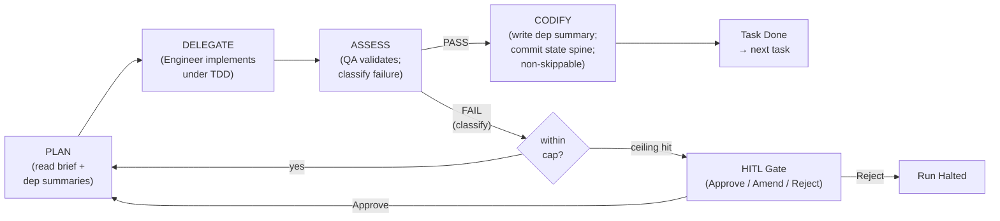

# Build Engine

> The Weave Build Engine turns the company knowledge graph into working software. Teams of humans
> and AI agents author specs, generate artefacts (UI + API, agents, pipelines), and write
> everything back to the graph — grounded in and traceable to the process-centric model that
> describes the business. Build is the GENERATE half of the Weave loop and owns the
> `BE-ARTEFACT-1`, `BE-SELFIMPROVE-1`, and `BE-SDK-1` contracts.

[weave-spec](../weave-spec.md) · [contracts](../contracts.md) · [constitution-engine](constitution-engine.md) · [graph-explorer (CE §5–§8)](constitution-engine.md#5-graph-explorer--brief)

## 1. Brief

### Mission Statement

The Build Engine is the place where a company turns its knowledge graph into working software.
Within the company, teams spin up projects, co-author specifications with AI agents, and
generate and ship artefacts that run genuine business processes — grounded in the company's
ontology, vocabulary, brand, and governance constraints. Every generated artefact is traceable back
to the graph elements and spec it came from; when the model changes, the affected artefacts are
known.

### Problem

- **Codegen is ungrounded.** AI coding tools have no model of the business; they hallucinate domain
  structure and re-derive the same entities and rules across every project.
- **Generated output ignores company standards.** Artefacts rarely respect brand, tone of voice,
  vocabulary, or governance rules — they need heavy manual rework.
- **No traceability.** When the model changes, generated artefacts silently go stale; nobody can
  say which part of the model a generated system came from.
- **Spec, planning, and delivery are disconnected from the model.** Specification, kanban, and
  running code live in separate tools; context is re-gathered at every hand-off.
- **Agent-driven delivery is ungoverned.** No shared place to cap spend, manage secrets, classify
  data, or inherit company → domain → project policy.

The people who feel this most are **engineers and architects** asked to deliver consistently,
**product owners** iterating on several specs at once, and **operations owners** who wait on them.
Without this, the value of the company graph is never cashed in: the model describes the business,
but humans still hand-build everything that runs it.

### Vision

- **Projects are born from the graph.** A team spins up a project and generates a working artefact
  grounded in the process-centric model (BPMO: processes, activities, actors, systems, services,
  data assets, capabilities, goals, governing policies).
- **The spec-to-ship loop runs with humans and agents together.** A specification co-authored with
  PO/architect agents drives implementation autonomously (dark factory) or interactively, with
  HITL gates at every phase boundary and a mid-flight replan control.
- **Output meets the Constitution's standards measurably.** Generated artefacts pass an automated
  conformance bar — default ≥ 90% adherence, configurable per scope, zero critical violations —
  before human review. Not "compliant by assertion". Gate formula defined in [contracts](../contracts.md)
  `CE-BRAND-1`: `score = (normal rules passed) / (total normal rules)`; any critical rule failure
  = hard fail regardless of score.
- **The model stays alive in both directions.** Generated `System`/`Service`/`DataAsset` nodes are
  written back into the Constitution graph via the validated write path; every artefact carries
  a PROV-O provenance header.
- **Every agent decision is auditable.** Agent actions emit to the platform's immutable audit
  service; the Build decision log is a view over it.

### Scope

#### In Scope

| Area | Detail |
|---|---|
| Request intake | AI-drafted brief/PRD/spec grounded in `CE-READ-1`; blast-radius; cost gate; stakeholder sign-off |
| Project lifecycle | Per-project spec versioning, phase tracking, replan, HITL gate ceremony |
| Repo bootstrap | First step of a run: create a NEW external repo per project (GitHub/GitLab, configured), write boilerplate/harness, then implement (FR-061; rich scaffold + gate FR-062) |
| Dark-factory execution | PLAN → DELEGATE → ASSESS → CODIFY loop; bounded turn cap; resumable state spine |
| Artefact generation | Stack-agnostic generation from approved spec + client company/project standards (decision B8; M1 demo default Next.js + FastAPI); safety gates before commit; deploy + demo |
| Company/project standards | Company + project coding/architecture/stack standards (family of `docs/standards/`), governed by `Policy` via `CE-READ-1`, consumed by generation (FR-063/FR-064) |
| Direct project prompt | Prompt box on a project → agent run → PRs to code/specs/backlog (FR-065), role-gated (FR-060) |
| Graph sync | Write-back via `CE-WRITE-1` (`BE-ARTEFACT-1`); staleness from `CE-VERSION-1` |
| Quality gates | DoR, DoD, full QA suite (M2), phase-gate ceremony (M2), spec-coverage audit (M2) |
| PM surfaces | Project Registry, Dashboard, Kanban, Task Brief/Detail UI, Decision Log (v1.0) |
| SDK (M2) | Typed TypeScript/Python bindings + OpenAPI 3.1 from SHACL shapes; `CE-FUNCTION-1` bindings |
| Self-healing (post-v1) | Signal observation → HITL-gated dispatch; `BE-SELFIMPROVE-1` contract |

#### Out of Scope

- Ontology/graph authoring (Constitution Engine)
- Business-event-triggered automation (Events & Actions Engine)
- Graph visualisation (Graph Explorer)
- Defining or versioning ontology-bound functions (CE owns `CE-FUNCTION-1`; Build generates bindings only)

### Target Users

| Persona | Role in Build |
|---|---|
| Product owner | Requests, reviews, and approves specs; gates generation; monitors dashboards |
| Technical architect *(canonical role: Enterprise architect — [`personas.md`](../personas.md))* | Reviews tech spec; approves phase-gate ceremony; manages project settings |
| Delivery manager | Monitors Kanban, budget, forecasts; handles HITL escalations |
| Engineer | Consumes generated artefacts and the typed SDK; may override on fork |
| Ops / SRE | Monitors deployed products; reviews self-healing signals (post-v1) |

### Success Criteria

1. A client models their company in the Constitution Engine and the Build Engine generates one
   working artefact (app, pipeline, or agent) that a real user uses — the program-level MVP.
2. Every generated artefact passes SAST, type, mutation (≥ 70%), package-existence, and
   secret-scan gates before commit. Brand-conformance gate (CE-BRAND-1) passes at ≥ 90% with
   zero critical violations at M2.
3. Every generated entity is written back to the graph via `CE-WRITE-1` with a `BE-ARTEFACT-1`
   provenance header. Write-back on `422 { violations }` rolls back via feature flag, never
   silently diverges.
4. No autonomous run exceeds the orchestrator turn cap (default 60). Worst-case LLM-call ceiling
   stated and controlled: orchestrator 60 × per-agent ~100 = ~6,000 calls (see FR-041).
5. The dark factory runs within governance (budget cap, secret-scan, RBAC, immutable audit) with
   no cross-tenant data leak.

### Constraints

- Tech stack (**for building the Build Engine itself, not for its output**): Next.js 15 + FastAPI +
  AWS Cognito + Bedrock; Python `uv` only for tooling. **The *generated* stack is NOT constrained to
  this** — the Build Engine is stack-agnostic and generates whatever the target spec + client company/
  project standards require (decision B8, FR-063/FR-064). The M1 thin-proof uses Next.js + FastAPI as a
  demo default only.
- Source control: generated output lives in a NEW external repo per project (GitHub/GitLab, configured);
  provider + token are a project/domain setting (`PLAT-SETTINGS-1` three-level cascade) with the
  token in Secrets Manager (B9, FR-061) —
  distinct from the 7 `PLAT-CONNECTOR-1` data connectors.
- Secrets: AWS Secrets Manager only — never hardcoded, never in `.env`.
- Large-graph retrieval: A 200-node context cap is a known limit. Retrieval/ranking strategy
  (relevance scoring of BPMO subgraph before prompt assembly) is resolved at M2 by ADR-005
  (deterministic seed + weighted k-hop); until M2 lands, the 200-node cap is a documented
  constraint (OQ-11, closed M2).
- Multi-tenant isolation: state spine, summaries, and investigator outputs are RLS-isolated;
  mechanism deferred to OQ-06.
- Agent SDK: Anthropic Agent SDK (Python primary); confirmed model IDs only
  (`claude-fable-5`, `claude-sonnet-5`).
- Dark-factory agent principals (`PLAT-IDENTITY-1`): exactly **five** — Architect
  (`claude-fable-5`), Engineer (`claude-sonnet-5`), QA (`claude-sonnet-5`), Review, and Sandbox
  (execution principal). Canonical enumeration lives in [contracts.md](../contracts.md)
  §PLAT-IDENTITY-1; the orchestrator loop itself runs as the invoking session, not a principal.

### Post-v1 candidates (recorded, not committed)

- **Ideation / prototyping mode** *(personas.md §4.5)*: graph-grounded exploration and throwaway
  vibe-coded prototypes — a Build mode distinct from the dark factory: speed over gates,
  explicitly **never writes back** to the graph. Serves PO + engineer ideation.
- **Ontology-conformance audit for non-generated code** *(personas.md §4.6)*: point Weave at an
  existing repo and check it against ontology/spec/brand rules; extends FR-057 reality-drift
  beyond Build-generated products.

### Key Decisions

| ID | Decision | Rationale |
|---|---|---|
| B1 | OWL/SKOS punning (single IRI = `owl:Class` + `skos:Concept`) | Enables typed graph queries and NL lookup over the same URI; aligns with CE approach |
| B2 | EARS ACs (`WHEN <event> THE SYSTEM SHALL <behaviour>`) for all ACs | Machine-verifiable by DoR gate (FR-046) and QA (FR-054) without human re-interpretation |
| B3 | PLAN→DELEGATE→ASSESS→CODIFY: CODIFY non-skippable | Dependency summary and state-spine commit before Done = deterministic resumability |
| B4 | HITL fail-closed: no-self-approval invariant, web gate via `PLAT-NOTIFY-1` | Agent cannot approve its own work; audit outage = gate stays closed |
| B5 | `BE-SELFIMPROVE-1` is a Build-provided engine consumed by Weave Platform | Build heals its own products; product self-improvement is Platform's domain |
| B6 | CE owns `CE-FUNCTION-1` (ontology-bound function registry); Build generates SDK bindings; Events references by `fn_iri` | Resolves OQ-12 / EA-OQ-13. See [contracts](../contracts.md) §CE-FUNCTION-1. Decision made; build in M2/v1.0 |
| B7 | Brand-conformance gate (CE-BRAND-1) is M2, not M1 | Formula requires full VoiceRules SHACL catalogue; thin-proof loop ships without it |
| B8 | **Build Engine is stack-agnostic** — the *generated* stack is driven by the client company's + project's standards (FR-063/FR-064), never fixed to Weave's own stack | Weave's own stack (Next.js 15 / FastAPI / Cognito / Bedrock / `uv`) constrains **building the Build Engine itself**, not what it generates; the engine builds whatever the target spec + client standards require. The M1 thin-proof uses Next.js + FastAPI as a **demo default**, not a constraint on output |
| B9 | **Generated output lives in a NEW external repo per project** (GitHub/GitLab, configured); repo bootstrap is the **first step of a run** | Client-owned, forkable, portable code (consistent with `BE-SDK-1` ownership); source control is a project/domain setting + Secrets-Manager token, distinct from the 7 `PLAT-CONNECTOR-1` data connectors and not connector-gated |

### Navigation

| Section | Content |
|---|---|
| § 1 | Brief — mission, problem, vision, scope, users, success criteria, decisions |
| § 2 | PRD — FRs, NFRs, inter-engine interfaces, open questions |
| § 3 | Epics — milestone-tagged, EARS ACs |
| § 4 | Roadmap — M1/M2/v1.0/post-v1 with run-lifecycle and gate-flow diagrams |
| [contracts](../contracts.md) | All inter-engine contracts (CE-READ-1, CE-WRITE-1, CE-BRAND-1, CE-FUNCTION-1, BE-SDK-1, BE-ARTEFACT-1, BE-SELFIMPROVE-1) |

## 2. PRD

### Product Context

The Build Engine sits at position #4 in the Weave build order (Platform shell → Constitution →
Graph Explorer → **Build** → Events → Onboarding). It is the first engine that generates code.
Its thin proof (M1) runs the model→generate loop on the Hammerbarn pre-seed demo with no
real-client ingestion. Real-client cold-start ingestion lands in v1.0.

### Goals

1. Generate at least one working artefact (app, pipeline, or agent) from a Constitution-grounded
   spec in a governed dark factory.
2. Every generated artefact meets the safety gate bar and is written back to the graph with
   provenance.
3. Full PM surfaces (kanban, dashboards, decision log) support concurrent projects in v1.0.
4. Typed SDK (`BE-SDK-1`) including `CE-FUNCTION-1` bindings ships in M2.

### Non-Goals

- Visual graph editing (Graph Explorer)
- Defining or versioning ontology-bound functions (CE owns `CE-FUNCTION-1`)
- Open-source or client-self-hosted deployment
- Agent-based business automation (Events & Actions Engine)
- Data pipeline generation (post-v1)

### Personas

| Persona | Primary jobs in Build |
|---|---|
| Product owner | Request intake, spec approval, phase-gate HITL |
| Technical architect | Tech spec sign-off, project settings, ADR authoring, phase-gate ceremony |
| Delivery manager | Kanban, budget monitoring, escalation handling |
| Dark-factory agents | PLAN, DELEGATE, ASSESS, CODIFY under `PLAT-IDENTITY-1` principals |

### 2.1 Functional Requirements

| ID | Requirement | Story | Priority | Milestone |
|---|---|---|---|---|
| FR-001 | Intake form: free-text prompt + run-mode selector (Draft/Spec→build/Spike) | E1-S1 | Must | M1 |
| FR-002 | AI spec drafting: brief/PRD/tech-spec streamed via `CE-READ-1` (pinned version); 60 s timeout, tunable; model `claude-fable-5` | E1-S1 | Must | M1 |
| FR-003 | Blast-radius panel: domains/services touched from graph (CE-READ-1); unavailable graph = "review manually", not blocked | E1-S2 | Must | M1 |
| FR-004 | Cost-estimate gate: per-spec cap (~$25 default, tunable via `PLAT-SETTINGS-1`); blocks if exceeded | E1-S3 | Must | M1 |
| FR-005 | Stakeholder sign-off: resolve from graph via `CE-READ-1`; spec locked on submit; Approve → auto-project create | E1-S4 | Must | M1 |
| FR-006 | Project grid: status cards with phase, budget, owner, demo status; filter + name search | E2-S1 | Must | v1.0 |
| FR-007 | Auto-create project from approved request with pinned CE version (`CE-VERSION-1`) and budget cascade | E2-S2 | Must | v1.0 *¹ |
| FR-008 | Budget-cap cascade (Company→Domain→Project, tighter-wins; `PLAT-SETTINGS-1`); breach halts at checkpoint | E2-S3 | Must | v1.0 |
| FR-009 | Model-tier gating per project (standard/fast/premium/experimental); default from domain policy (`PLAT-SETTINGS-1`) | E2-S3 | Must | v1.0 |
| FR-010 | Project **external-space bindings**: project settings bind the project to specific external boards/spaces — **Confluence space, Jira board/project, ServiceNow** — by reference via `PLAT-CONNECTOR-1` (no connector credential stored in Build), so agents pull from / push to the right spaces. **Connector-dependent: rides the connector timeline (connectors deferred to v1.0), so bindings land at v1.0** | E2-S5 | Must | v1.0 (connector-gated) |
| FR-060 | Project **contributors & roles**: a project supports adding contributors with per-project roles — project **admin** (manage project settings, contributors, external bindings, backlog) and **editor** (author specs/backlog, run generation); **all company (tenant) users can read any project**; a **company/domain admin/owner can edit any project, its specs, and its backlog** (full-control overlay from the `PLAT-IDENTITY-1` JWT `roles` claim — tenant + project/domain-scoped grants; workspace level dropped 2026-07-08); roles resolve via `PLAT-SETTINGS-1` and are enforced at the API boundary (`PLAT-IDENTITY-1`). The **role model is defined now**; the settings/contributors UI ships with the Project Registry (v1.0) | E2-S4 | Must | v1.0 (role model defined now) |
| FR-011 | Secrets: AWS Secrets Manager references only; secret-scan gate (FR-029) blocks plaintext in generated code | E2-S3 | Must | v1.0 |
| FR-012 | Ontology pin upgrade: `CE-DIFF-1` diff of nodes+edges since pin; explicit confirmation required | E2-S3 | Must | v1.0 |
| FR-013 | Project Dashboard: demo-readiness, budget, forecast, tasks-in-flight, blockers, git ribbon; per-tile fail isolation | E3-S1 | Must | v1.0 |
| FR-014 | Dashboard quick actions: Run demo, Replan, Plan release, Open Kanban | E3-S2 | Should | post-v1 |
| FR-015 | Kanban board: six lanes (Backlog→Ready→In Progress→Review→QA→Done); retry chip reflects per-class ceiling (E6-S3) | E4-S1 | Must | v1.0 |
| FR-016 | Task-tree dependency-graph view: state-coded nodes with legend; orphan flagged not dropped | E4-S2 | Must | v1.0 |
| FR-017 | Board filters: All/In flight/Blocked/Self-improvement-flagged/This phase; invalid filter → empty-state, not blank board | E4-S3 | Must | v1.0 |
| FR-018 | Task brief: Architect generates self-contained typed YAML (EARS ACs, DoR/DoD checklists, AC-to-test map, design tokens, dep chain, cost estimate) before Engineer starts | E5-S1 | Must | M1 *² |
| FR-019 | Task Detail panel: Brief / Handoff / Tests / Console / Audit tabs | E5-S2 | Must | v1.0 |
| FR-020 | Tests tab: 8 visual-state captures (default/hover/focus/active/disabled/loading/empty/error); Audit tab is read-only `PLAT-AUDIT-1` view | E5-S2 | Must | v1.0 |
| FR-021 | Spec lifecycle: transitions Draft→Spec Review→Approved→In Progress→Complete↔Blocked; action guards per state | E6-S1 | Must | M1 |
| FR-022 | Run modes: Draft-spec-only / Spec→review→build / Spike (sandbox, no prod merge); per-agent internal turn caps | E6-S2 | Must | M1 |
| FR-023 | Typed-result contract: `{status: PASS/FAIL, failure_class, evidence, retry_recommended}` emitted by every agent | E6-S3 | Must | M1 |
| FR-024 | Four-class retry taxonomy: logic / syntax / dependency / spec-ambiguity; per-class ceiling; ceiling-hit → HITL | E6-S3 | Must | M1 |
| FR-025 | HITL gates: web Approve/Amend/Reject via `PLAT-NOTIFY-1`; fail-closed on audit outage; gate stays closed if ceremony step errors | E6-S4 | Must | M1 |
| FR-026 | No-self-approval invariant: an agent cannot approve its own output; enforced via `PLAT-IDENTITY-1` | E6-S4 | Must | M1 |
| FR-027 | Decision log: searchable table of agent decisions + ADRs over `PLAT-AUDIT-1` | E7-S1 | Must | v1.0 |
| FR-028 | Decision log export (PDF/CSV) | E7-S2 | Could | post-v1 |
| FR-029 | Generation safety gates (M1) before commit — **atomic; any failure = nothing committed**: SAST (Bandit/Semgrep), type-check (mypy/tsc), delta-scoped mutation ≥ 70%, package-existence hard-block, secret-scan. CE-BRAND-1 conformance gate **→ M2** (formula: `score=(normal rules passed)/(total normal rules)`; critical failure = hard fail; pass bar ≥ 90%, tunable). | E8-S1 | Must | M1 (safety) / M2 (brand gate) |
| FR-030 | Agent generation (Anthropic Agent SDK, Python primary): grounded in BPMO graph via `CE-READ-1`; acts under named `PLAT-IDENTITY-1` principal | E8-S2 | Should | post-v1 |
| FR-031 | Anatomy/Wiki: auto-indexed files/functions/capability descriptions/ADRs, refreshed per commit; agents load before a task | E8-S3 | Must | M2 |
| FR-032 | Project-ontology embed: `GE-CANVAS-1` scoped to project IRI, readonly; edits route via `CE-WRITE-1` | E8-S3 | Should | post-v1 |
| FR-033 | Deploy to preview environment + demo URL (time-limited shareable link) | E8-S4 | Must | M1 |
| FR-034 | Release/rollback-plan artefact: rollout sequence, feature-flag rollback path, approvers, target date | E8-S4 | Should | M2 |
| FR-035 | Write-back via `CE-WRITE-1` only (`POST /api/operations/apply`): SHACL-validated on clone; commit only if no `sh:Violation`; `BE-ARTEFACT-1` provenance header (spec ID, pinned CE version, entity IRIs) on every entity | E9-S1 | Must | M1 |
| FR-036 | Staleness indicator from `CE-VERSION-1` version-lag (default threshold ≥ 2); "unknown" when unreachable | E9-S2 | Should | M2 |
| FR-037 | Signal collection from 12 AWS sources with configurable thresholds; each record: type, severity, timestamp, evidence, ARN | E10-S1 | Should | post-v1 |
| FR-038 | Issue creation from WARN/CRITICAL signals; CRITICAL auto-notifies via `PLAT-NOTIFY-1`; duplicate detection | E10-S2 | Should | post-v1 |
| FR-039 | HITL-gated fix dispatch: gate sequence explicit-deny→authority→automatable→HITL before any autonomous step; no autonomous merge ever | E10-S2 | Should | post-v1 |
| FR-040 | Self-healing screen: signal bar, ranked open issues, resolved issues, summary chip | E10-S3 | Should | post-v1 |
| FR-041 | Orchestrator turn cap: default 60 dispatch cycles, tunable via `PLAT-SETTINGS-1`, **distinct from per-agent internal caps**. Worst-case ceiling: orchestrator 60 × per-agent ~100 = **~6,000 LLM calls**. Either cap halts to HITL. | E11-S1 | Must | M1 |
| FR-042 | Resumable on cap-halt or crash: resume from last completed CODIFY checkpoint; no task left partially committed | E11-S1 | Must | M1 |
| FR-043 | Dependency-summary handoff: CODIFY writes key decisions + edge cases to tenant-scoped store; PLAN reads predecessors' summaries before DELEGATE; missing summary = hold in Ready. **M1 = pass-through stub** (CODIFY writes the `dep_summaries` breadcrumb row; the consumer does not read/gate on it); full read-and-gate behaviour lands M2 (council ENG-4) | E11-S3 | Must | M1 stub / M2 |
| FR-044 | State spine: typed `{project_iri, phase, epics, tasks[{id,status,blocked_by}]}`, RLS per tenant, committed after every task; `ready` resolver + `phase-complete` query | E11-S4 | Must | M1 |
| FR-045 | Model routing: `{role|tier|complexity}→{provider,model}` per environment; confirmed Claude IDs only; routing miss = halt, not silent invocation; quality-sensitive output re-run at Claude tier before phase-gate | E11-S5 | Must | M1 |
| FR-046 | DoR gate: verifies brief completeness, deps resolved, diagrams present, AC-to-test map present, cost estimate present; any FAIL → NOT READY, hold in Ready; runs in PLAN before DELEGATE | E12-S1 | Must | M1 |
| FR-047 | DoD gate: QA agent runs commands itself (lint 0, type-check clean, complexity budget, coverage ≥ 80%, mutation ≥ 70%, SAST 0-high, no eval/Function(), docs updated, conventional-commit hygiene); unrunnable command = NOT VERIFIED (fail) | E12-S2 | Must | M1 |
| FR-048 | Agent self-verification block at every HITL handoff: line-by-line rule compliance (`complied|violated|n/a`) + confidence note; any `violated` = stop for revision | E11-S6 | Should | M2 |
| FR-049 | Preflight: credential reference check (names, not values) before build start + each phase boundary; missing critical dep = STOP to HITL | E11-S6 | Should | M2 |
| FR-050 | First-run scaffolding gate: scaffold CI/git-hooks/health-route/smoke-test once; force human environment-verification gate before first feature task | E11-S6 | Should | M2 |
| FR-051 | Isolated investigator runs: read-only, return pointer + short summary to tenant store; cannot spawn sub-investigators (addresses OQ-11) | E11-S6 | Should | M2 |
| FR-052 | Phase-gate ceremony: auto-triggered on `phase-complete`; security review (CRITICAL finding blocks Approve), mutation score (< gate = RED), coverage audit, doc refresh, phase summary; then web HITL (Approve/Amend/Reject, no-self-approval); ceremony-step error = fail-closed | E12-S5 | Must | M2 |
| FR-053 | Spec-coverage audit at phase end: maps every `Must` FR/NFR → code or test; DELIVERED/PARTIAL/MISSING; halt unless ≥ 90% DELIVERED and zero MISSING; ambiguous item = MISSING (safe default) | E12-S4 | Must | M2 |
| FR-054 | Full QA category suite: AC↔test mapping, coverage ≥ 80%, complexity budget, lint, a11y (axe/WCAG 2.1 AA), perf (vs SLO), browser-automation+backend-assertion, delta mutation, edge-case extension; unavailable category = NOT VERIFIED (fail) | E12-S3 | Must | M2 |
| FR-055 | Pre-scaffold spec-review gate: cascade check (brief→PRD→roadmap→tech-spec→impl-ready) with hard blockers per transition; critical gap halts scaffolding. **M1 = pass-through stub** (gate present but non-blocking); full cascade-blocking behaviour lands M2 (council ENG-4) | E12-S6 | Must | M1 stub / M2 |
| FR-056 | Cross-task finding propagation: defect with `affects:[task_id]` list; later QA MUST read; recurring recommendation ≥ 2× → project issue | E12-S7 | Should | post-v1 |
| FR-057 | Reality-drift detection: spec claims vs code graph; Confirmed/Contradicted/Unverifiable table; never auto-resolves contradictions | E12-S8 | Should | post-v1 |
| FR-058 | Durable per-project memory store: committed decisions/conventions injected into agent context across sessions | E11-S6 | Could | post-v1 |
| FR-059 | `BE-SDK-1` typed client SDK: SHACL node shape → typed class, declared properties → typed fields, named SPARQL SELECT → typed query method; emits TypeScript/npm + Python/pip + standalone OpenAPI 3.1; **includes one typed SDK method per `CE-FUNCTION-1` ontology-bound function** (Build generates from CE-owned registry, does not define functions); versioned to pinned CE version; `BE-ARTEFACT-1` provenance; atomic (unreachable `CE-READ-1` or unresolvable shapes = fail, no partial package); client-owned/forkable; regenerable on `CE-DIFF-1` delta | E8-S5 | Should | M2 |
| FR-061 | **External repo bootstrap = first step of a dark-factory run.** Generated output lives in a **NEW repository per project on the configured source-control provider (GitHub or GitLab)**, never inside Weave. On run start THE SYSTEM SHALL: create the repo on the configured provider, then write the project boilerplate/harness (spec-driven setup mirroring this repo's `.claude` harness) — and only then implement against the given spec. Source-control **provider + auth token are a project/domain setting** (`PLAT-SETTINGS-1` for config; token in **AWS Secrets Manager only**) — **source control is NOT one of the 7 `PLAT-CONNECTOR-1` data connectors and is NOT connector-gated to v1.0**. Generated commits/PRs (FR-033, FR-035) target this repo. | E11-S7 | Must | M1 (create repo + push output) |
| FR-062 | **Rich repo scaffolding + environment-verification gate** — branch-protection rules, full CI, secrets wiring, and the complete `.claude`-style harness/boilerplate are set up on the bootstrapped repo, behind the first-run environment-verification HITL gate. Extends FR-050 (the M1 create-and-push of FR-061 is the floor; the rich scaffold + gate is the M2 increment). | E11-S6/S7 | Should | M2 |
| FR-063 | **Company-level standards catalogue** *(workspace level dropped 2026-07-08 — catalogue re-homes to company scope)* — coding standards, architecture patterns, and preferred stacks are authored and stored at company scope (same family as this repo's `docs/standards/`, extended beyond brand/design) and **consumed by every build project in the company** (at generation, E8-S1) to drive the generated stack. Standards are **governed by `Policy` entities read via `CE-READ-1`** (`governedBy`) so agents reason over them; brand/voice remains `CE-BRAND-1`. The generated stack is chosen from these standards — **the Build Engine is stack-agnostic (decision B8)**, not fixed to Weave's own stack. | E2-S7 | Must | M2 |
| FR-064 | **Project-level standards** extend/override the company standards for a specific project (tighter-wins, aligned to the `PLAT-SETTINGS-1` cascade); the effective standard set (company ⊕ project) grounds generation (E8-S1) for that project. Also linked to `Policy` via `CE-READ-1`. | E2-S7 | Must | M2 |
| FR-065 | **Direct project prompt interface** — a prompt box scoped to a build project lets a user instruct the agent to make changes (e.g. "fix this inaccuracy", "change how the UI looks", "change what this API returns / the error message it throws"). The agent runs (reusing the dark-factory run lifecycle) with visible run status, and produces **PRs/amendments to the project's code, specs, AND backlog** as appropriate, opened against the project's external repo (FR-061). **Permission-gated:** project **editors and admins** (and company/domain admin/owner) may prompt; **readers cannot** (FR-060 role model); an unauthorised prompt returns 403 + `PLAT-AUDIT-1`. | E3-S3 | Should | v1.0 |

*¹ M1 requires a **minimal project bootstrap** (backend record: project IRI + pinned CE version, no UI) to allow E11 dark factory to run against a `project_iri`. Full Registry grid and settings UI (FR-006 through FR-012) land in v1.0. See §3 E2 notes.

*² FR-018 task-brief **schema** and Architect generation are M1 (required for E11 PLAN stage); the **five-tab Detail UI** (FR-019/FR-020) is v1.0.

### 2.2 Non-Functional Requirements

#### Performance

| Metric | Target | Notes |
|---|---|---|
| Spec drafting (E1-S1) | First token ≤ 5 s; streams section-by-section | 60 s total timeout, tunable |
| App generation (E8-S1) | Full pipeline ≤ 10 min p95 | Spike: measured during tech-spike |
| Write-back (E9-S1) | `CE-WRITE-1` `POST` ≤ 30 s p99 | Degrades gracefully on CE outage |
| Kanban render (E4-S1) | ≤ 1 s with 50 tasks; ≤ 100 ms lane filter switch | Resolved render budget |
| State-spine commit | ≤ 500 ms p99 | Per-task; blocking before Done |

#### Reliability

| Metric | Target |
|---|---|
| Dark-factory resumability | 100% of cap-halted or crashed tasks resume from last committed CODIFY checkpoint |
| Gate fail-closed | HITL gates never silently pass on ceremony-step error or audit outage |
| Write-back atomicity | 422 → feature-flag rollback; no half-committed graph state |
| Cross-tenant isolation | 0 cross-tenant reads verified by tenant-B query in regression suite |

#### Security

- Secrets: AWS Secrets Manager references only; secret-scan gate (FR-029) blocks before commit.
- Agent principals: named `PLAT-IDENTITY-1` service principals with RBAC derived from the graph.
- No `eval()` or `Function()` constructors in generated or harness code.
- Mutation ≥ 70% (delta-scoped) as a merge gate; SAST 0-high on every commit.

### 2.3 Inter-Engine Interfaces

All contract definitions live in [contracts](../contracts.md). Build consumes:

| Contract | Provider | Build uses it for |
|---|---|---|
| `CE-READ-1` | Constitution Engine | Grounding (spec drafting, blast-radius, stakeholder resolution, SDK generation); BPMO subgraph retrieval for prompt assembly (see OQ-11) |
| `CE-WRITE-1` | Constitution Engine | Write-back via `POST /api/operations/apply`; SHACL-validated on throwaway clone |
| `CE-VERSION-1` | Constitution Engine | Pinned version at project create; staleness computation |
| `CE-DIFF-1` | Constitution Engine | "Upgrade pin" diff; SDK regeneration on version delta |
| `CE-BRAND-1` | Constitution Engine | Design tokens + VoiceRules for conformance check (M2); scoring formula in [contracts](../contracts.md) |
| `CE-FUNCTION-1` | Constitution Engine | CE-owned ontology-bound function registry; Build generates one typed SDK method per function into `BE-SDK-1` (M2); **Build does NOT define functions** |
| `PLAT-SETTINGS-1` | Platform | Four-level cap cascade; turn-cap tuning; test-type minimums |
| `PLAT-BILLING-1` | Platform | Per-token + per-run metering |
| `PLAT-AUDIT-1` | Platform | Immutable decision-log view (read-only in Build) |
| `PLAT-IDENTITY-1` | Platform | Named agent principals; no-self-approval enforcement |
| `PLAT-NOTIFY-1` | Platform | HITL-gate events (Approve/Amend/Reject); budget/run-halted/routing-degraded alerts |
| `PLAT-CONNECTOR-1` | Platform | Jira/Slack handles by reference |
| `GE-CANVAS-1` | Graph Explorer | Embeddable project-ontology slice (post-v1; falls back to `CE-READ-1` entity list if unavailable) |

Build **provides**:

| Contract | Consumers |
|---|---|
| `BE-ARTEFACT-1` | Constitution Engine (provenance), Platform (audit), Events (graph kept alive) |
| `BE-SDK-1` | Client engineering teams (typed graph client); Events (function bindings) |
| `BE-SELFIMPROVE-1` | Weave Platform (Weave-product self-improvement loop) |

### 2.4 Open Questions

| ID | Question | Status |
|---|---|---|
| OQ-01 | Multi-agent rate limits and circuit breakers | Open — tech-spec task |
| OQ-02 | Runtime orchestration architecture (DAG engine or harness-driven loop?) | Open — tech-spec task |
| OQ-03 | Workflow-as-code representation for the dark factory | Open |
| OQ-04 | Agent sandboxing and code-execution isolation | Open — tech-spec task |
| OQ-05 | Per-task cost attribution across provider tiers | **CLOSED (v1.0)** — Build-local `cost_events` rollup, "estimated" label; PLAT-BILLING-1 stays invoicing SoR. ADR-008 / v1-delta §1 |
| OQ-06 | Multi-tenant RLS isolation mechanism for state spine and summaries | Open — tech-spec task |
| OQ-07 | Git strategy: branch-per-task vs sequential commits | **CLOSED (v1.0)** — answered by M1 practice: runs record `branch` + `commit_sha`; git ribbon reads those rows. v1-delta §1 |
| OQ-08 | Template library: schema and governance | Open — deferred; no story consumes it through v1.0 |
| OQ-09 | Policy-as-code spec format | Open |
| OQ-10 | AI writing rules spec format for VoiceRules | **CLOSED (M2)** — format is contracts.md §CE-BRAND-1 (`{id, severity, assertion}`); no Build-side format. m2-delta §1 |
| OQ-11 | Large-graph context cap: 200-node limit is a **known constraint**. Retrieval/ranking strategy — relevance scoring of BPMO subgraph before prompt assembly — is a **required tech-spec task**. Isolated investigator runs (FR-051) are a partial mitigation. | **CLOSED (M2)** — deterministic seed + weighted k-hop under the cap; FR-051 investigator overflow. ADR-005 / m2-delta §1 |
| OQ-12 | CE-FUNCTION-1 ownership | **RESOLVED**: CE owns ontology-bound function registry (definition, versioning, grounding patterns); Build generates `BE-SDK-1` typed bindings; Events references by `fn_iri`. See [contracts](../contracts.md) §CE-FUNCTION-1. |

### 2.5 Key Design Decisions

| Ref | Decision |
|---|---|
| B1 | OWL/SKOS punning: single IRI = `owl:Class` + `skos:Concept` |
| B2 | EARS notation for all ACs: `WHEN <event> THE SYSTEM SHALL <behaviour>` |
| B3 | PLAN→DELEGATE→ASSESS→CODIFY: CODIFY non-skippable; dependency summary written before Done |
| B4 | HITL fail-closed: `PLAT-NOTIFY-1` web gate; audit outage = gate closed; no-self-approval via `PLAT-IDENTITY-1` |
| B5 | `BE-SELFIMPROVE-1` engine provided by Build; consumed by Platform for product self-improvement; Build heals its own products only |
| B6 | CE owns `CE-FUNCTION-1`; Build generates one SDK method per function in `BE-SDK-1`; Events references by `fn_iri` (resolves OQ-12) |
| B7 | Brand-conformance gate (CE-BRAND-1) is M2: formula is defined in [contracts](../contracts.md); gate requires full VoiceRules SHACL catalogue not available in M1 |

## 3. Epics

> Each epic states its milestone, a description, and the 3–5 key EARS acceptance criteria.
> For full story ACs, see the archived story files (separate task-brief pass).

### EPIC-001 — Request Studio

**Milestone:** M1 · **Priority:** Must Have · **Status:** Backlog
**depends_on:** `CE-READ-1`, `PLAT-SETTINGS-1`, `PLAT-NOTIFY-1`
**blocks:** E2 (project create from approved request) · **provides:** approved spec

Request Studio is the AI request-intake surface. A product owner describes what they want to build
in natural language, picks a run mode, and the engine drafts a brief/PRD/tech spec grounded in the
company graph. Before any project is created, intake computes a blast-radius impact analysis, gates
on a pre-generation cost estimate, and collects stakeholder sign-off.

**Stories:** E1-S1 (intake form + spec drafting), E1-S2 (blast-radius), E1-S3 (cost gate), E1-S4
(stakeholder sign-off) — all M1 Must Have.

**Acceptance criteria (EARS)**

- WHEN a request is submitted, THE SYSTEM SHALL draft a brief/PRD/tech spec streamed section by
  section via `CE-READ-1` (pinned version); WHEN the generation call times out (default 60 s),
  THE SYSTEM SHALL preserve the partial draft as recoverable and fire a `PLAT-NOTIFY-1`
  generation-failure event — no project is created.
- WHEN the draft is complete and the cost estimate exceeds the resolved per-spec cap, THE SYSTEM
  SHALL block project creation and display the estimate with the binding cap level.
- WHEN all required stakeholders have approved, THE SYSTEM SHALL create a project automatically
  (E2-S2); WHEN any stakeholder rejects, THE SYSTEM SHALL return the spec to Draft with the
  rejection reason recorded.
- WHEN the company graph is unreachable during blast-radius computation, THE SYSTEM SHALL mark the
  blast-radius panel "unavailable — review manually" and hold project creation until a human
  acknowledges the gap.

---

### EPIC-002 — Project Registry & Settings

**Milestone:** v1.0 (full UI); M1 **project bootstrap stub** (backend record only — see note) ·
**Priority:** Must Have · **Status:** Backlog
**depends_on:** E1, `CE-VERSION-1`, `CE-DIFF-1`, `PLAT-SETTINGS-1`, `PLAT-BILLING-1`, `PLAT-CONNECTOR-1`, `PLAT-NOTIFY-1`
**blocks:** E3, E4, E5, E11 (full) · **provides:** project IRI, governance cascade

> **M1 bootstrap note (backward dependency):** The E11 dark factory requires a `project_iri` and
> pinned CE version to scope its state spine (FR-044), **plus a minimal source-control provider setting +
> Secrets-Manager token** so run step 0 (E11-S7 / TASK-010 repo bootstrap) can create the project's
> external repo at M1. The **M1 slice of E2-S6 is a config value only (provider + token reference), NOT
> the full settings UI**. So the M1 prerequisite is a **minimal backend project record** (IRI + pinned
> version + source-control config, no Registry UI). The full Project Registry grid, settings tabs,
> contributor/standards UI, and budget cascade UI (FR-006 through FR-012, plus the E2-S4/S5/S7 UIs) land
> in v1.0; E2-S7 company/project standards themselves are M2.

The Project Registry is the Build root surface: a browsable grid of all projects, automatic
project creation from a fully-approved request, and per-project cascading governance (budget caps,
contributors/roles, integrations/external-space bindings, **source-control provider config**,
**company/project standards**, secrets, data classification, pinned ontology version).

**Stories:** E2-S1 (grid), E2-S2 (auto-create), E2-S3 (governance cascade), E2-S4 (contributors &
roles, FR-060), E2-S5 (external-space bindings, FR-010), E2-S6 (source-control provider config,
FR-061/B9), E2-S7 (company/project standards, FR-063/FR-064) — all Must Have.

**Acceptance criteria (EARS)**

- WHEN a project is created, THE SYSTEM SHALL pin the newest published CE version via `CE-VERSION-1`
  and resolve governance through the Company→Domain→Project cascade (tighter-wins) with
  no window where the project exists ungoverned.
- WHEN the binding cap is breached mid-run, THE SYSTEM SHALL halt in-flight agent steps at the
  next safe checkpoint and fire a `PLAT-NOTIFY-1` budget event — partial work commits only if it
  passes the generation safety gates.
- WHEN connector integrations are configured, THE SYSTEM SHALL bind by reference via
  `PLAT-CONNECTOR-1` with no connector credential stored in Build; secrets are Secrets Manager
  references only.
- **(E2-S4 — contributors & roles, FR-060)** WHEN a contributor is added to a project, THE SYSTEM
  SHALL assign a per-project role — **admin** (project settings, contributors, external bindings,
  backlog) or **editor** (author specs/backlog, run generation) — resolved via `PLAT-SETTINGS-1` and
  enforced at the API boundary (`PLAT-IDENTITY-1` JWT `roles` claim); **all company (tenant) users can
  read any project**, and a **company/domain admin/owner can edit any project, its specs, and its
  backlog**. WHEN a user without the
  required project role attempts an edit, THE SYSTEM SHALL return 403 and record the denial to
  `PLAT-AUDIT-1`. *(Role model defined now; contributors UI ships with the Registry at v1.0.)*
- **(E2-S5 — external-space bindings, FR-010)** WHEN a project is bound to an external space
  (Confluence space, Jira board/project, or ServiceNow), THE SYSTEM SHALL store the binding as a
  reference via `PLAT-CONNECTOR-1` (no credential in Build) so agents pull from / push to the bound
  space; **because managed connectors are deferred to v1.0, external-space bindings land at v1.0** —
  until then the project settings surface the binding slots as "available when connectors ship".
- **(E2-S6 — source-control provider config, FR-061/B9)** WHEN a project (or its domain) is configured,
  THE SYSTEM SHALL capture the **source-control provider (GitHub or GitLab)** and its auth token,
  storing config via `PLAT-SETTINGS-1` and the **token in AWS Secrets Manager only** (never in Build,
  never displayed after entry). This is **distinct from the 7 `PLAT-CONNECTOR-1` data connectors and is
  NOT connector-gated** — it is available at M1 so the dark factory can bootstrap the project repo
  (FR-061). AC (failure): an invalid/absent token fails the run's repo-bootstrap step closed with a
  named error; no token value is logged.
- **(E2-S7 — company/project standards, FR-063/FR-064)** WHEN a company authors standards (coding
  standards, architecture patterns, preferred stacks — the `docs/standards/` family extended beyond
  brand/design), THE SYSTEM SHALL make them available to **every build project in the company**, and
  a project MAY define project-level standards that **extend/override** them (tighter-wins, aligned to
  the `PLAT-SETTINGS-1` cascade). Standards are **governed by `Policy` entities read via `CE-READ-1`**
  (`governedBy`) so agents reason over them; the effective set (company ⊕ project) drives the generated
  stack — the engine is stack-agnostic (B8), not fixed to Weave's own stack. *(M2 — M1 thin-proof uses a
  demo default.)*

---

### EPIC-003 — Project Dashboard

**Milestone:** v1.0 · **Priority:** Must Have (S1) / Should Have (S2, S3) · **Status:** Backlog
**depends_on:** E2, E6, E11, `PLAT-BILLING-1`
**blocks:** — · **provides:** —

The Project Dashboard is the primary at-a-glance status view: demo readiness, budget, forecast,
tasks in flight, blockers, and a git commit ribbon. Quick actions (Run demo, Replan, Plan release,
Open Kanban) are S2 (post-v1). A **direct prompt box** (E3-S3) lets an authorised user instruct the
agent to change the project.

**Stories:** E3-S1 (status view, Must Have), E3-S2 (quick actions, Should Have → post-v1),
E3-S3 (direct project prompt, FR-065, Should Have → v1.0).

**Acceptance criteria (EARS)**

- WHEN any dashboard tile's data source errors, THE SYSTEM SHALL render that tile in a localized
  error state while the rest of the dashboard continues to render — a single upstream outage never
  blanks the page.
- **(E3-S3 — direct project prompt, FR-065)** WHEN a project **editor or admin** (or company/domain
  admin/owner) submits a prompt on a project (e.g. "fix this inaccuracy", "change how the UI looks",
  "change what this API returns / the error message it throws"), THE SYSTEM SHALL run the dark-factory
  lifecycle scoped to that project with visible run status, and produce **PRs/amendments to the
  project's code, specs, AND backlog** as appropriate, opened against the project's external repo
  (FR-061). WHEN a **reader** (no edit role) submits a prompt, THE SYSTEM SHALL return 403 and record
  the denial to `PLAT-AUDIT-1` (FR-060 role model).
- WHEN a Weave-product self-improvement proposal is relevant to this project, THE SYSTEM SHALL
  surface it as a read-only card linking to the Platform surface — Build does not own the proposal
  lifecycle.
- WHEN the demo URL cannot be captured (deploy fails), THE SYSTEM SHALL retain the prior demo URL
  and surface the error; the demo-readiness tile never shows a false green.

---

### EPIC-004 — Kanban & Task Management

**Milestone:** v1.0 · **Priority:** Must Have · **Status:** Backlog
**depends_on:** E6 (retry taxonomy), E11 (state spine), E5 (Task Detail panel)
**blocks:** — · **provides:** —

The Kanban surface makes dark-factory work visible: a six-lane board (Backlog→Ready→In Progress→
Review→QA→Done), a task-tree dependency-graph view, and board filters. Cards are colour-coded by
agent state with a visible legend.

**Stories:** E4-S1 (six-lane board), E4-S2 (task tree), E4-S3 (filters) — all Must Have.

**Acceptance criteria (EARS)**

- WHEN an agent crashes, THE SYSTEM SHALL show "agent failed" on the card classified per the E6-S3
  retry taxonomy — a task is never left silently RUNNING.
- WHEN a task's `blocked_by` predecessor is missing from the dependency graph, THE SYSTEM SHALL
  render that node flagged rather than dropped.
- WHEN a board filter resolves to zero tasks, THE SYSTEM SHALL show an empty-state message and
  reset to "All" — never a blank or broken board.
- WHEN agent-state colour-coding is used, THE SYSTEM SHALL display a visible legend on both the
  board cards and the task-tree nodes — state is never conveyed by colour alone.

---

### EPIC-005 — Task Brief & Detail

**Milestone:** M1 (schema + Architect generation); v1.0 (five-tab Detail UI) ·
**Priority:** Must Have · **Status:** Backlog
**depends_on:** E2 (project), `CE-BRAND-1`, `PLAT-SETTINGS-1`, `PLAT-AUDIT-1`, E11 (dep summaries)
**blocks:** E6, E11, E12 (DoR/DoD gates read the brief)

> **M1 slice (backward dependency):** E11 PLAN stage requires a valid typed YAML brief before
> DELEGATE. The **Architect agent brief generation** (FR-018) is M1. The **five-tab Task Detail
> panel** (FR-019/FR-020) is v1.0.

Every task is driven by a self-contained typed YAML brief — complete enough that a dark-factory
agent can satisfy every AC using only the brief and predecessors' dependency summaries. The
five-tab Task Detail panel (Brief/Handoff/Tests/Console/Audit) is the v1.0 inspection surface.

**Stories:** E5-S1 (task brief, Must Have), E5-S2 (Detail panel, Must Have — v1.0).

**Acceptance criteria (EARS)**

- WHEN the Architect cannot produce a valid brief (missing EARS ACs, no AC-to-test map, or failed
  DoR pre-check), THE SYSTEM SHALL hold the task in Ready with "brief incomplete" and route to
  replan — the task is never dispatched to the Engineer with an incomplete brief.
- WHEN a task is dispatched, THE SYSTEM SHALL guarantee the brief is self-contained: an Engineer
  must satisfy every AC using only the brief and predecessors' dependency summaries with no other
  spec file.
- WHEN the Audit tab cannot reach `PLAT-AUDIT-1`, THE SYSTEM SHALL show "audit unavailable" and
  never fabricate entries.

---

### EPIC-006 — Spec Lifecycle & Run Modes

**Milestone:** M1 · **Priority:** Must Have · **Status:** Backlog
**depends_on:** E1 (approved spec), `PLAT-NOTIFY-1`, `PLAT-IDENTITY-1`, `PLAT-AUDIT-1`
**blocks:** E11 (run-mode + retry contract), E12 (gate ceremonies) · **provides:** run modes, retry contract, HITL gates

Epic 6 owns the run-mode and governance contracts that the dark factory (E11) wraps: the spec
lifecycle state machine, run modes, the typed-result + four-class retry contract, and all HITL
gate mechanics.

**Stories:** E6-S1 (lifecycle states), E6-S2 (run modes), E6-S3 (typed result + retry), E6-S4
(HITL gates + no-self-approval) — all M1 Must Have.

**Acceptance criteria (EARS)**

- WHEN an agent emits a typed result with `status: FAIL`, THE SYSTEM SHALL classify the failure
  into one of four classes (logic/syntax/dependency/spec-ambiguity) and apply the per-class retry
  ceiling; WHEN the ceiling is reached, THE SYSTEM SHALL route to a HITL gate, not retry again.
- WHEN the HITL gate fires, THE SYSTEM SHALL require web Approve/Amend/Reject via `PLAT-NOTIFY-1`;
  WHEN the audit service is unreachable, THE SYSTEM SHALL keep the gate closed (fail-closed) —
  it never auto-approves on outage.
- WHEN a HITL approval is requested, THE SYSTEM SHALL enforce the no-self-approval invariant via
  `PLAT-IDENTITY-1`; an agent cannot approve its own output regardless of role.
- WHEN a run operates in Spike mode, THE SYSTEM SHALL prevent any graph write-back and prod merge
  originating from that run.

---

### EPIC-007 — Decision Log

**Milestone:** v1.0 · **Priority:** Must Have · **Status:** Backlog
**depends_on:** `PLAT-AUDIT-1`
**blocks:** — · **provides:** —

A searchable table of agent decisions and ADRs as a read-only view over `PLAT-AUDIT-1`. Export
to PDF/CSV (E7-S2) is post-v1.

**Stories:** E7-S1 (log view, Must Have), E7-S2 (export, Could Have → post-v1).

**Acceptance criteria (EARS)**

- WHEN the decision log is displayed, THE SYSTEM SHALL render it as a read-only view over
  `PLAT-AUDIT-1`; WHEN the audit service is unreachable, THE SYSTEM SHALL show "audit unavailable"
  rather than fabricating entries or showing a blank screen.
- WHEN an ADR is linked from a task brief (FR-018), THE SYSTEM SHALL resolve the link to the
  corresponding audit record in the decision log.

---

### EPIC-008 — Artefact Generation

**Milestone:** M1 (S1 app gen + S4 deploy/demo); M2 (S3 anatomy + S5 SDK); post-v1 (S2 agent gen) ·
**Priority:** Must Have (S1, S4) / Should Have (S3, S5) · **Status:** Backlog
**depends_on:** `CE-READ-1`, `CE-BRAND-1`, `CE-VERSION-1`, `CE-DIFF-1`, `CE-FUNCTION-1` (S5), `PLAT-IDENTITY-1`, E6, E11
**blocks:** E9 (write-back operates on deployed artefact) · **provides:** `BE-SDK-1` (S5)

Epic 8 owns artefact generation — from spec to deployed app — and the generation gates. The
generation pipeline reads spec + BPMO project graph via `CE-READ-1` and produces a working app in
**the stack the client company/project standards dictate (FR-063/FR-064; decision B8 — stack-agnostic,
NOT fixed to Weave's own stack)**. The **M1 thin-proof default is OpenAPI → FastAPI routes → Next.js
pages/components**, used because the standards catalogue lands at M2; from M2 the generated stack is
driven by the effective (company ⊕ project) standard set. Generated output is committed/pushed to the
**project's external repo (FR-061)**, created at run start. Every gate is distinct and atomic.

**Partition rule:** E8-S1 owns the **generation gates** before a single commit. E12 owns the
task/phase quality **ceremonies** that wrap them.

**Stories:** E8-S1 (app generation, M1 Must Have), E8-S2 (agent gen, post-v1 Should Have),
E8-S3 (anatomy/wiki, M2 Must Have), E8-S4 (deploy + demo, M1 Must Have), E8-S5 (SDK, M2 Should Have).

**Acceptance criteria (EARS)**

- WHEN any generation safety gate fails (SAST/type/mutation/pkg/secret-scan), THE SYSTEM SHALL
  commit nothing — failure is atomic; the failing gate and evidence surface on the task.
- WHEN the CE-BRAND-1 conformance gate runs (M2), THE SYSTEM SHALL evaluate
  `score = (normal rules passed)/(total normal rules)`; WHEN any critical rule fails, THE SYSTEM
  SHALL hard-fail regardless of score; WHEN score < 0.90 (default, tunable), THE SYSTEM SHALL
  block commit (see [contracts](../contracts.md) §CE-BRAND-1 for full formula).
- WHEN "Run demo" is triggered, THE SYSTEM SHALL deploy to a preview environment and produce a
  time-limited shareable demo URL; WHEN a deploy fails, THE SYSTEM SHALL retain the prior demo URL
  and surface the error — no half-deployed state is presented as ready.
- WHEN `BE-SDK-1` is generated (M2), THE SYSTEM SHALL produce one typed class per SHACL node
  shape, one typed method per named SPARQL SELECT, and one typed binding per `CE-FUNCTION-1`
  function in the CE-owned registry; WHEN `CE-READ-1` is unreachable or SHACL shapes cannot be
  resolved, THE SYSTEM SHALL fail atomically — no partial SDK package is emitted.
- WHEN generated config references model IDs, THE SYSTEM SHALL use only confirmed Claude IDs
  (`claude-fable-5`, `claude-sonnet-5`) — no placeholder IDs.

---

### EPIC-009 — Bidirectional Graph Sync & Staleness

**Milestone:** M1 (S1 write-back); M2 (S2 staleness) ·
**Priority:** Must Have (S1) / Should Have (S2) · **Status:** Backlog
**depends_on:** E8, `CE-WRITE-1`, `CE-VERSION-1`, `PLAT-NOTIFY-1`, `PLAT-IDENTITY-1`
**blocks:** Onboarding (#6 — Hammerbarn seed), Events (#5 — keeps the graph alive) · **provides:** `BE-ARTEFACT-1`

Epic 9 keeps the graph alive in both directions: generated `System`/`Service`/`DataAsset` nodes
are written back via the validated write path, each carrying a `BE-ARTEFACT-1` provenance header
and a staleness indicator computed from the canonical CE version-lag.

**Stories:** E9-S1 (write-back, M1 Must Have), E9-S2 (staleness, M2 Should Have).

**Acceptance criteria (EARS)**

- WHEN a non-Spike artefact is deployed, THE SYSTEM SHALL write BPMO nodes/edges via `CE-WRITE-1`
  (`POST /api/operations/apply`) only — SHACL-validated on a throwaway clone, committed only on
  zero `sh:Violation`, carrying a `BE-ARTEFACT-1` provenance header and a PROV-O activity
  attributed to the Build service principal.
- WHEN `CE-WRITE-1` returns `422 { violations }`, THE SYSTEM SHALL roll back the deployed artefact
  via its feature flag and surface the violations on the task — the graph and deployed state never
  silently diverge.
- WHEN `CE-VERSION-1` is unreachable to compute the version-lag staleness indicator, THE SYSTEM
  SHALL display "unknown" rather than asserting "current".
- WHEN a Spike-mode run completes, THE SYSTEM SHALL prevent any write-back from that run.

---

### EPIC-010 — Client-App Self-Healing

**Milestone:** post-v1 · **Priority:** Should Have · **Status:** Backlog
**depends_on:** Phase-M1 complete; E6, E8, `CE-WRITE-1`, `PLAT-NOTIFY-1`, `PLAT-AUDIT-1`
**blocks:** — · **provides:** `BE-SELFIMPROVE-1`

Self-healing observes deployed-app signals (12 AWS source types), drafts issues from WARN/CRITICAL
signals, and dispatches fixes through the same dark factory — always behind the deterministic gate
sequence (explicit-deny → authority → automatable-flag → HITL). No autonomous merge, ever.

**Stories:** E10-S1 (signal collection), E10-S2 (issue creation + dispatch), E10-S3 (screen) —
all post-v1 Should Have.

**Acceptance criteria (EARS)**

- WHEN a WARN/CRITICAL signal fires and "Dispatch fix" is triggered, THE SYSTEM SHALL run the gate
  sequence explicit-deny→authority→automatable-flag→HITL before any autonomous step; WHEN any gate
  blocks, THE SYSTEM SHALL notify a human for manual dispatch — the engine never force-merges past
  the gate.
- WHEN a signal source is unreachable, THE SYSTEM SHALL display "collection failed — last good Xh
  ago" rather than a false green signal status.
- WHEN a fix commit resolves an issue and the signal has not improved after the default 30-min
  observation window, THE SYSTEM SHALL auto-reopen the issue with post-fix data as evidence.

---

### EPIC-011 — Dark-Factory Execution Engine

**Milestone:** M1 (S1–S5, S7 repo bootstrap); M2 (S6 preflight/scaffolding/self-verification/investigator); post-v1 (S6 durable memory) ·
**Priority:** Must Have (S1–S5, S7) / Should Have (S6 M2 parts) · **Status:** Backlog
**depends_on:** E6 (run-mode + retry contract), E5 (typed brief), E2 (project record + source-control config), `PLAT-SETTINGS-1`, `PLAT-BILLING-1`, `PLAT-NOTIFY-1`
**blocks:** E4, E3, E12 · **provides:** run lifecycle

Epic 11 owns the loop mechanics that wrap E6's run-mode and governance contracts: **the repo-bootstrap
first step (E11-S7)**, the bounded autonomous loop with a hard turn cap, the PLAN→DELEGATE→ASSESS→CODIFY
lifecycle, the dependency-summary handoff, the tenant-scoped RLS state spine, and configurable model
routing.

**Run step 0 (E11-S7 — repo bootstrap, FR-061/B9):** the **first step of every dark-factory run** is to
create the project's NEW external repo on the configured provider (GitHub/GitLab) and write the project
boilerplate/harness, before any PLAN/DELEGATE. Generated output is pushed there — never inside Weave. The
**rich scaffold (branch protection, full CI, complete harness) + the environment-verification HITL gate is
the M2 increment (E11-S6 / FR-062)**; the M1 floor is create-repo + push.

**Partition rule (with E6):** E6 owns run modes, retry taxonomy, and HITL gates. E11 owns the
loop mechanics, per-task lifecycle, dep-summary handoff, state spine, model routing, and repo bootstrap.

**Stories:** E11-S1 (turn cap + resumability), E11-S2 (PDAC lifecycle), E11-S3 (dep summary
handoff), E11-S4 (state spine), E11-S5 (model routing), E11-S7 (repo bootstrap — create repo + push,
FR-061) — all M1 Must Have. E11-S6 (preflight, rich scaffolding gate FR-062, self-verification,
investigator) — M2 Should Have; durable memory — post-v1.

**Acceptance criteria (EARS)**

- **(E11-S7 — repo bootstrap, FR-061)** WHEN a dark-factory run starts for a project, THE SYSTEM SHALL
  first create a NEW repository on the project's configured source-control provider (GitHub/GitLab; auth
  token from Secrets Manager) and write the project boilerplate/harness, and only then proceed to
  PLAN/DELEGATE; all generated output is pushed to that repo. WHEN the provider is unconfigured or the
  token is invalid, THE SYSTEM SHALL halt the run before generation with a named error (fail-closed) and
  never fall back to writing inside Weave. Source control is **not** a `PLAT-CONNECTOR-1` connector and
  is **not** deferred to v1.0.
- WHEN an autonomous run is dispatched, THE SYSTEM SHALL enforce a hard orchestrator turn cap
  (default 60 dispatch cycles, **distinct from per-agent internal caps**); WHEN either the
  orchestrator cap OR the cascading cost cap is reached, THE SYSTEM SHALL halt to a HITL gate with
  full state preserved. The effective worst-case ceiling is orchestrator 60 × per-agent ~100 =
  **~6,000 LLM calls**; this is a stated operational risk monitored via `PLAT-BILLING-1`.
- WHEN a cap-halt or crash occurs mid-task, THE SYSTEM SHALL resume from the last completed CODIFY
  checkpoint — no task is left partially committed or restarted from scratch.
- WHEN a task reaches CODIFY, THE SYSTEM SHALL write its dependency summary to the tenant-scoped
  store (keyed by `project_iri + task_id`, RLS-isolated) before the task is marked Done; CODIFY is
  non-skippable.
- WHEN a task enters PLAN, THE SYSTEM SHALL load every predecessor's dependency summary before
  DELEGATE; WHEN a predecessor summary is missing, THE SYSTEM SHALL hold the task in Ready with
  "missing handoff" and route to replan — it is never dispatched blind.
- WHEN the configured provider for a role is unreachable, THE SYSTEM SHALL fall back per policy or
  halt the task; routing with no valid provider/model halts the task — it never silently invokes an
  unapproved model.
- WHEN a tenant-B principal queries the state spine, THE SYSTEM SHALL return zero tenant-A rows
  (RLS enforced; mechanism per OQ-06).

---

### EPIC-012 — Quality Gates & Spec-Coverage

**Milestone:** M1 (S1 DoR + S2 DoD + S6 pre-scaffold); M2 (S3 full QA + S4 coverage audit + S5 phase-gate); post-v1 (S7–S8) ·
**Priority:** Must Have (S1–S6) / Should Have (S7–S8) · **Status:** Backlog
**depends_on:** E11 (PLAN stage, phase-complete query), E5 (brief DoR/DoD checklists), E8 (generation gates), `PLAT-SETTINGS-1`, `PLAT-NOTIFY-1`
**blocks:** scaffolding (S6), phase advancement

**Partition rule (with E8):** E8-S1 owns generation gates before a single commit. E12 owns
task- and phase-level quality ceremonies wrapping them.

**Stories:** E12-S1 (DoR gate, M1), E12-S2 (DoD gate, M1), E12-S3 (full QA suite, M2), E12-S4
(coverage audit, M2), E12-S5 (phase-gate ceremony, M2), E12-S6 (pre-scaffold spec-review, M1),
E12-S7 (cross-task finding propagation, post-v1), E12-S8 (reality-drift, post-v1).

**Acceptance criteria (EARS)**

- WHEN a task is about to enter PLAN, THE SYSTEM SHALL run the DoR gate (brief completeness,
  deps resolved, AC-to-test map, cost estimate); WHEN any item fails, THE SYSTEM SHALL hold the
  task NOT READY — it never enters DELEGATE with a failing DoR.
- WHEN the DoD gate runs, THE SYSTEM SHALL have the QA agent run every command itself; WHEN any
  command cannot run, THE SYSTEM SHALL record it as NOT VERIFIED (a fail) — never a silent pass.
- WHEN the full QA suite runs (M2), THE SYSTEM SHALL validate all applicable categories including
  a11y (axe/WCAG 2.1 AA), browser-automation-with-backend-assertion, and delta mutation; WHEN any
  category's tooling is unavailable, THE SYSTEM SHALL report NOT VERIFIED (fail) — not skip it.
- WHEN a phase reaches `phase-complete`, THE SYSTEM SHALL auto-trigger the phase-gate ceremony;
  WHEN any ceremony step errors, THE SYSTEM SHALL keep the gate closed (fail-closed) and not
  advance the phase.
- WHEN the spec-coverage audit runs, THE SYSTEM SHALL halt the phase unless ≥ 90% of `Must` items
  are DELIVERED and zero are MISSING; WHEN a `Must` item is ambiguous to map, THE SYSTEM SHALL
  classify it MISSING (the safe default).

## 4. Roadmap

[weave-spec](../weave-spec.md) §Program defines the cross-engine milestone sequence and build order. Build is
**#4** (Platform shell → Constitution → Graph Explorer → **Build** → Events → Onboarding).
Milestones are contract/value-sequenced, not dated.

### Run-Lifecycle Diagram

### Gate-Flow Diagram

```mermaid
flowchart LR
    INTAKE["E1 Request Studio\n(intake + blast-radius\n+ cost gate + sign-off)"] --> PRE_SCAFFOLD["E12-S6\nPre-scaffold\nspec-review gate"]
    PRE_SCAFFOLD --> REPO["E11-S7 Repo Bootstrap\n(create external repo\nGitHub/GitLab + boilerplate)"]
    REPO --> DoR["E12-S1\nDoR Gate\n(in PLAN)"]
    DoR --> GEN["E8-S1 App Generation\n(stack per client standards;\nM1 default OpenAPI→FastAPI→Next.js)"]
    GEN --> SAFETY["M1 Safety Gates\nSAST · type · mutation ≥70%\npkg-existence · secret-scan\n(atomic)"]
    SAFETY -->|"any gate fails\n→ nothing committed"| DoR
    SAFETY -->|"M2 only"| BRAND["E8-S1 Brand Gate\nCE-BRAND-1\nscore ≥ 0.90\nzero critical"]
    BRAND --> WRITEBACK["E9-S1 Write-back\nCE-WRITE-1\n(SHACL validate)"]
    SAFETY --> WRITEBACK
    WRITEBACK --> DoD["E12-S2 DoD Gate\n(QA self-runs\nall commands)"]
    DoD -->|"all pass"| TASK_DONE["Task Done"]
    DoD -->|"any fail"| DoR
    TASK_DONE --> PHASE_Q{"phase\ncomplete?"}
    PHASE_Q -->|"M2 only"| PHASE_GATE["E12-S5\nPhase-gate Ceremony\n(security · mutation · coverage\naudits → HITL sign-off)"]
```

### Milestone Table

| Milestone | Goal | Build epics / stories |
|---|---|---|
| **M1 — Thin Proof** | Model → generate → write-back loop on Hammerbarn pre-seed demo, output pushed to a newly-created external repo | E1 Request Studio · E6 Spec Lifecycle + Run Modes · E11-S1–S5 Dark-Factory core + **E11-S7 Repo bootstrap (create repo + push, FR-061)** · E8-S1 App generation (stack-agnostic; demo-default stack) + S4 Deploy/demo · E9-S1 Write-back · E12-S1 DoR + S2 DoD + S6 Pre-scaffold; task-brief schema (FR-018) · E2-S6 source-control config |
| **M2 — Legibility + Trust** | Brand conformance; SDK; quality ceremonies; orchestrator hardening; stack-driving standards | E8-S3 Anatomy/wiki · E8-S5 BE-SDK-1 (incl. CE-FUNCTION-1 bindings) · E8-S1 CE-BRAND-1 gate · **E2-S7 company/project standards (FR-063/FR-064)** · E11-S6 preflight + **rich repo scaffold/env-verification gate (FR-062)**/self-verify/investigator · E12-S3 Full QA · E12-S4 Coverage audit · E12-S5 Phase-gate ceremony · E9-S2 Staleness · E8-S4 Release plan |
| **v1.0 — Lighthouse** | Full PM surfaces for concurrent production projects | E2 Project Registry + settings (incl. E2-S4 roles, E2-S5 external bindings, E2-S6 source-control provider config UI) · E3 Project Dashboard + **E3-S3 direct project prompt (FR-065)** · E4 Kanban · E5 Task Brief/Detail UI (5-tab panel) · E7 Decision Log (E12 fully covered M1+M2; S7/S8 post-v1) |
| **post-v1** | Self-healing; agent generation; pipeline generation | E10 Self-healing (BE-SELFIMPROVE-1) · E8-S2 Agent generation · E8-S3 FR-032 project-ontology embed · Pipeline generation · E3-S2 Quick actions · E12-S7 Cross-task propagation · E12-S8 Reality-drift · FR-058 Durable memory |

### M1 Exit Criteria

1. Hammerbarn pre-seed: a product owner completes intake (E1); the dark factory's **first step creates a
   NEW external repo** on the configured provider (GitHub/GitLab) and writes the project boilerplate
   (E11-S7 / FR-061), then generates a working application (M1 demo-default Next.js + FastAPI stack) and
   **pushes it to that repo**, and all M1 safety gates pass.
2. Write-back: the generated `System`/`Service` nodes are written back to the CE graph via
   `CE-WRITE-1` with a `BE-ARTEFACT-1` provenance header; no `sh:Violation` left uncommitted.
3. A shareable demo URL is produced via E8-S4.
4. The orchestrator turn cap (FR-041) fires on a test run exceeding 60 cycles and halts to HITL.
5. Cross-tenant isolation: a tenant-B read against the state spine returns zero tenant-A rows.

### M2 Exit Criteria

1. CE-BRAND-1 conformance gate runs on generated output; score ≥ 0.90 and zero critical rule
   failures required to commit. Formula verified from [contracts](../contracts.md) §CE-BRAND-1.
2. `BE-SDK-1` generated as **portable source committed to the project repo** (TypeScript npm-format
   package + Python pip-format package + standalone OpenAPI 3.1 — **no registry publish**, ADR-006)
   with ≥ 1 CE-FUNCTION-1 typed binding per CE-owned function in the registry; verified mechanically
   by `tsc --noEmit` + `mypy --strict` + OpenAPI 3.1 lint passing over the committed source.
3. Phase-gate ceremony (E12-S5) completes at least one phase boundary with a web HITL sign-off
   under no-self-approval invariant.
4. Anatomy/wiki (E8-S3) auto-indexes a project repo and agents load it before each task.
5. Preflight (FR-049) verified on one full build run; credential check passes.

### v1.0 Exit Criteria

1. All five PM surfaces (E2–E5, E7) ship and support concurrent projects in a multi-tenant
   staging environment.
2. Full QA suite (E12-S3) passes on at least one generated application.
3. Spec-coverage audit (E12-S4) shows ≥ 90% Must delivery on the M1/M2 scope.

### Dependency Notes

| Risk | Impact | Mitigation |
|---|---|---|
| `CE-READ-1` unavailable | Spec drafting degrades; blast-radius = "unavailable" | Graceful fallback specified in FR-002/FR-003; does not block intake |
| `CE-WRITE-1` 422 on write-back | Deployed artefact rolls back via feature flag | Feature-flag-based rollback path specified in FR-035 |
| Large-graph context (OQ-11) | 200-node cap limits deep BPMO subgraph in prompt | Retrieval/ranking strategy required in tech spec; investigator pattern (FR-051) is M2 mitigation |
| 6,000-call turn-cap ceiling (SS-BE-5) | Costly or looping run; detected late | Orchestrator cap (FR-041) + cost cap (FR-008) are independent; both halt to HITL; budget monitored via `PLAT-BILLING-1` |
| E2 project bootstrap required for M1 dark factory (backward dep) | E11 needs `project_iri` but full E2 is v1.0 | M1 minimal backend project record (no UI) required; tracked as a prerequisite; see §3 E2 notes |
| E5 task-brief schema required for M1 dark factory (backward dep) | E11 PLAN requires typed brief but E5 full UI is v1.0 | FR-018 (Architect brief generation) is M1; FR-019/020 (5-tab UI) is v1.0; see §3 E5 notes |
