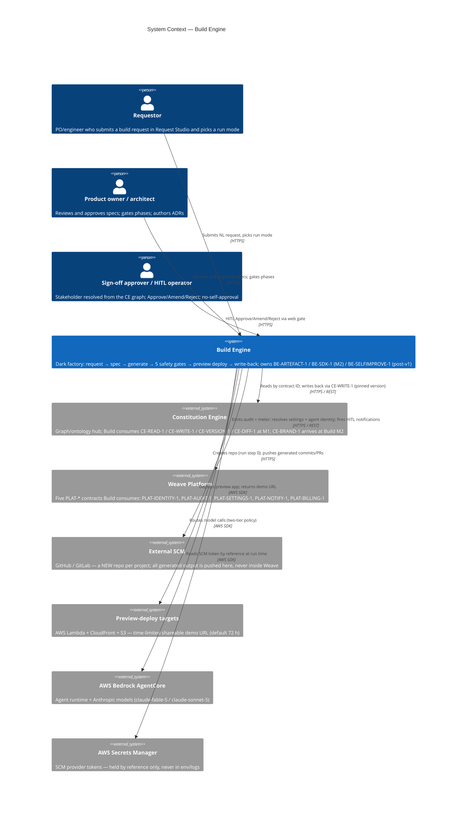

# Architecture: Build Engine

## Overview

The Build Engine is the **GENERATE** half of Weave: a dark-factory execution engine that turns a
Constitution-grounded spec into a working application, gates it, deploys a preview, and writes the
new `System`/`Service`/`DataAsset` nodes back to the graph with PROV-O provenance. This document
covers C4 Levels 1–3; Level 4 (code) is deferred to `arch-class` and the implementation.

The engine runs as **three cooperating layers**:

- **L1 request surface** — Request Studio (NL prompt → AI-drafted brief/PRD/spec) and the spec
  lifecycle.
- **L2 orchestration** — the bounded PLAN → DELEGATE → ASSESS → CODIFY dark-factory loop, run
  under a hard orchestrator turn cap (default 60) and resumable from the last CODIFY checkpoint.
- **L3 generation + write-back** — artefact generation, the five atomic M1 safety gates, preview
  deploy, and validated graph write-back.

**AI boundary.** Every model call crosses one boundary: **Anthropic Agent SDK → AWS Bedrock
AgentCore**. The engine uses the confirmed **two-tier** model policy only — `claude-fable-5` for
judgement-heavy, low-volume work (architecture, PLAN) and `claude-sonnet-5` for volume work
(engineering, QA, CODIFY validation). The routing table is a set of **constants, never runtime
variables**; a role that resolves to no allowed model raises `ModelRoutingError` and **halts the
task — it never silently invokes an unapproved or fallback model** (FR-045, TASK-006 AC-6).

| Role (loop phase) | Provider | Model | Tier rationale |
|-------------------|----------|-------|----------------|
| PLAN (Architect principal) | anthropic | `claude-fable-5` | Judgement — decompose brief, DoR reasoning |
| DELEGATE (Engineer principal) | anthropic | `claude-sonnet-5` | Volume — TDD implementation |
| ASSESS (QA principal) | anthropic | `claude-sonnet-5` | Volume — AC validation, failure classification |
| CODIFY (QA/validator principal) | anthropic | `claude-sonnet-5` | Volume — EARS-AC verification before Done |

**Fallback rule.** WHEN the configured provider for a role is unreachable, THE SYSTEM SHALL fall
back per policy **or** halt the task and emit a routing error; the fallback set is bounded by
`ALLOWED_MODELS = {claude-fable-5, claude-sonnet-5}`. No model outside that set is ever invoked.

**Graph access (ADR-001).** The Build Engine touches **no RDF store directly**. All graph access
goes through Constitution Engine contracts: reads via `CE-READ-1` (SELECT-only, `SERVICE`-blocked,
paginated, `framework ∪ tenant:{id}` only) and writes via `CE-WRITE-1`
(`POST /api/operations/apply`). The **ADR-001 query-rewriting middleware is the single
store-access point and is CE-owned** — Build's CE contract client is the sole graph egress and
issues no raw SPARQL. Build's **own** relational state (state spine, dep-summary breadcrumbs,
projects, requests, tasks, gate results) lives in Aurora and is reached only through a repository
layer whose `tenant_id` base filter backstops database RLS.

**Milestone framing.** M1 is wave **W2** (weave-spec §1.2): Build unblocks at the CE M1 spine
(`CE-READ-1 / CE-WRITE-1 / CE-DIFF-1 / CE-VERSION-1`) and consumes the Platform M1 identity, audit,
and settings contracts. `CE-BRAND-1` conformance is **Build M2** (decision B7) and is tagged, not
wired, below. Two M1 behaviours are deliberate stubs (council ENG-4): the **dep-summary handoff**
is a write-only breadcrumb (CODIFY writes the row; the consumer does not read/gate on it), and the
**pre-scaffold spec-review** is a present-but-non-blocking pass-through. Both gain full behaviour at
M2.

## C4 Model

### Level 1: System Context



Build is a **contract consumer**: it calls the Constitution Engine for all graph access and the
Platform for the five cross-cutting concerns, and reaches two external systems of its own — the
SCM provider (repo bootstrap + push) and the preview-deploy stack. The tenancy boundary is not
drawn here: at context level the meaningful fact is that graph access is CE's contract surface, and
the ADR-001 rewriter that enforces isolation lives inside CE.

### Level 2: Container

```mermaid
C4Container
    title Container Diagram — Build Engine

    Person(requestor, "Requestor")
    Person(approver, "Sign-off / HITL operator")

    Container_Boundary(build, "Build Engine") {
        Container(studio_api, "Request Studio API", "FastAPI / Python 3.12 / Lambda", "Intake form, AI spec drafting (claude-fable-5), blast-radius, cost gate, stakeholder sign-off; streams sections over SSE")
        Container(lifecycle_api, "Spec-Lifecycle API", "FastAPI / Python 3.12 / Lambda", "Spec FSM (Draft→Review→Approved→Active), minimal project-bootstrap record, run enqueue")
        Container(orchestrator, "Dark-Factory Orchestrator", "Python 3.12 / ECS Fargate", "Long-running PLAN→DELEGATE→ASSESS→CODIFY loop; turn cap (60); resumable from last CODIFY checkpoint; runs as the INVOKING SESSION, not a principal")
        Container(agents, "Dark-Factory Agents", "Anthropic Agent SDK on AgentCore", "5 PLAT-IDENTITY-1 principals: Architect (fable-5), Engineer (sonnet-5), QA (sonnet-5), Review, Sandbox (code-execution principal)")
        Container(scm_driver, "ScmDriver", "Python / GitHub|GitLab SDK", "Repo bootstrap = run step 0: create_repo, write_initial_commit, commit_workspace; GitHubDriver / GitLabDriver behind one interface")
        Container(preview_deployer, "Preview Deployer", "Python 3.12 / Fargate task", "Wraps Lambda + CloudFront + S3; produces time-limited demo URL; retains prior URL on failure")
    }

    Container_Boundary(aws, "AWS") {
        ContainerDb(pg, "Relational DB", "Aurora PostgreSQL Serverless v2", "State spine, dep-summary store, projects (repo_provider / repo_url / default_branch + scm_token_secret_ref), requests, sign-offs, tasks, generation runs, gate results; RLS on tenant_id")
        ContainerDb(cache, "Cache / Stream bus", "ElastiCache Redis 7", "SSE spec-streaming fan-out; run-status pub/sub for the run monitor")
        Container(agentcore, "AgentCore Runtime", "AWS Bedrock AgentCore", "Agent execution, memory, identity; Anthropic models")
        Container(sm, "Secrets Manager", "AWS Secrets Manager", "SCM provider tokens by reference only; no secret in env/code/logs")
        Container(cw, "Observability", "CloudWatch + OTel", "Spans, run/gate metrics, audit-emit correlation")
    }

    System_Ext(ce, "Constitution Engine", "Owns the ontology/business graph surface + ADR-001 rewriter")
    System_Ext(platform, "Weave Platform (PLAT-*)", "Identity, audit, settings, notify, billing")
    System_Ext(scm, "External SCM (GitHub / GitLab)", "New repo per project")

    Rel(requestor, studio_api, "Uses", "HTTPS")
    Rel(approver, lifecycle_api, "HITL gate actions", "HTTPS")
    Rel(studio_api, cache, "SSE spec-stream fan-out", "Redis")
    Rel(studio_api, ce, "CE-READ-1 grounding (pinned)", "HTTPS / REST")
    Rel(studio_api, pg, "Requests + sign-offs (RLS)", "TLS")
    Rel(lifecycle_api, pg, "Spec FSM + project record (RLS)", "TLS")
    Rel(lifecycle_api, orchestrator, "Enqueues approved run", "HTTPS / queue")
    Rel(orchestrator, scm_driver, "Run step 0: bootstrap repo; push output", "in-process")
    Rel(scm_driver, sm, "Reads SCM token by reference", "AWS SDK")
    Rel(scm_driver, scm, "Create repo + push commits/PRs", "HTTPS")
    Rel(orchestrator, agents, "Dispatches PLAN/DELEGATE/ASSESS/CODIFY under named principals", "AWS SDK")
    Rel(agents, agentcore, "Registers + executes agents", "AWS SDK")
    Rel(orchestrator, ce, "CE-READ-1 / CE-VERSION-1 / CE-DIFF-1 / CE-WRITE-1", "HTTPS / REST")
    Rel(orchestrator, pg, "State spine + dep summaries + tasks (RLS)", "TLS")
    Rel(orchestrator, preview_deployer, "Deploy on DoD pass", "in-process")
    Rel(preview_deployer, preview, "Lambda + CloudFront + S3 deploy", "AWS SDK")
    Rel(orchestrator, platform, "PLAT-AUDIT-1 / PLAT-BILLING-1 / PLAT-NOTIFY-1; resolve PLAT-SETTINGS-1 / PLAT-IDENTITY-1", "HTTPS / REST")
    Rel(orchestrator, cw, "OTel spans + run metrics", "OTLP")
```

Container notes:

- **Fargate for the loop, Lambda for the surfaces (D6).** The orchestrator is a long-running,
  resumable process that can run for many minutes across a turn cap of 60 dispatch cycles — it
  runs on **ECS Fargate**. The request/CRUD surfaces (Request Studio, spec lifecycle) are
  short-lived and run on **Lambda**.
- **The orchestrator is not a principal.** It runs as the invoking session. The five
  `PLAT-IDENTITY-1` principals (Architect, Engineer, QA, Review, Sandbox) are the identities under
  which agent work and code execution happen; the orchestrator dispatches to them but is not a
  sixth principal (contracts.md §PLAT-IDENTITY-1).
- **ScmDriver is one interface, two implementations.** Repo bootstrap (`create_repo`,
  `write_initial_commit`) is **run step 0**, before any PLAN/DELEGATE. `GitHubDriver` and
  `GitLabDriver` are selected by the `PLAT-SETTINGS-1` provider setting; the auth token is read
  from Secrets Manager by reference and never logged. Source control is **not** a
  `PLAT-CONNECTOR-1` connector and is **not** deferred to v1.0.
- **Redis carries the SSE spec stream** (section-by-section drafting) and the run-status pub/sub
  the run monitor subscribes to.
- **CE-BRAND-1 is M2**, not shown as a live arrow: the M1 loop runs the five safety gates only.

### Level 3: Component — Dark-Factory Orchestrator

The orchestrator is the L3 target: it concentrates the architectural risk (turn-cap + resumability,
the non-skippable CODIFY step, the atomic safety gates, fail-closed HITL, the store choke points,
and model routing all live here). Request Studio and the lifecycle API are structurally
conventional; drawing them at L3 would add pages, not insight.

```mermaid
C4Component
    title Component Diagram — Dark-Factory Orchestrator (Python 3.12 / Fargate)

    Container_Boundary(orchestrator, "Dark-Factory Orchestrator") {
        Component(scm_step0, "Repo Bootstrap (ScmDriver)", "run step 0", "ensure_project_repo: create repo + write boilerplate; fail-closed on unconfigured provider / invalid token; no Weave-internal fallback (FR-061)")
        Component(fsm, "Spec-Lifecycle FSM", "Python", "Drives requests / build_specs / build_tasks status transitions with per-state action guards")
        Component(loop, "PDAC Loop Controller", "Python", "PLAN→DELEGATE→ASSESS→CODIFY; orchestrator turn cap 60; CODIFY non-skippable; resumes from last CODIFY checkpoint")
        Component(model_router, "Model Router", "Python", "MODEL_ROUTING constants (plan=fable-5; delegate/assess/codify=sonnet-5); ModelRoutingError halts — never silent-invokes")
        Component(depsum, "Dep-Summary Writer/Reader", "Python", "CODIFY writes breadcrumb row (M1 write-only); best-effort reader; full read-and-gate is M2 (ENG-4 stub)")
        Component(gates_quality, "DoR/DoD + Pre-Scaffold Checkers", "Python", "DoR before DELEGATE; DoD QA self-runs commands; pre-scaffold spec-review is an M1 pass-through stub")
        Component(safety_gates, "Safety Gate Pipeline", "Python", "5 atomic M1 gates: (1) secret-scan (2) SAST (3) type-check (4) pkg-existence (5) mutation≥70%; any fail = nothing committed")
        Component(hitl, "HITL Gate Controller", "Python", "PLAT-NOTIFY-1 Approve/Amend/Reject; fail-closed on audit outage; no-self-approval via PLAT-IDENTITY-1")
        Component(writeback, "Write-Back Coordinator", "Python", "BE-ARTEFACT-1 header; target graph from request context NOT payload; spike = no write-back; 422 → feature-flag rollback")
        Component(ce_client, "CE Contract Client", "httpx / Pydantic v2", "Sole graph egress: CE-READ-1 (SELECT-only, paginated) / CE-WRITE-1 / CE-VERSION-1 / CE-DIFF-1; no raw SPARQL")
        Component(repo_layer, "Repository Layer", "SQLAlchemy async", "Aurora access; every query carries the tenant_id base filter (RLS backstop)")
        Component(emitter, "Audit + Billing Emitter", "Python", "Signed PLAT-AUDIT-1 event per state change; PLAT-BILLING-1 per-run + per-token metering on the never-dropped queue")
    }

    ContainerDb(pg, "Aurora PostgreSQL")
    Container(agentcore, "AgentCore Runtime")
    Container(sm, "Secrets Manager")
    System_Ext(ce, "Constitution Engine (+ ADR-001 rewriter)")
    System_Ext(scm, "External SCM (GitHub / GitLab)")
    System_Ext(platform, "Weave Platform (PLAT-*)")

    Rel(scm_step0, sm, "Reads SCM token by reference", "AWS SDK")
    Rel(scm_step0, scm, "Create repo + push output", "HTTPS")
    Rel(scm_step0, repo_layer, "Persists project.repo handle")
    Rel(loop, scm_step0, "Invokes as step 0 before PLAN")
    Rel(loop, fsm, "Advances task/spec status")
    Rel(loop, model_router, "Resolves role → model")
    Rel(model_router, agentcore, "Invokes agent under principal", "AWS SDK")
    Rel(loop, depsum, "Writes handoff at CODIFY; reads at PLAN (best-effort M1)")
    Rel(loop, gates_quality, "DoR before DELEGATE; DoD after ASSESS")
    Rel(loop, safety_gates, "Runs 5 gates before any commit")
    Rel(loop, hitl, "On cap-halt / gate fail / retry ceiling")
    Rel(loop, writeback, "On DoD pass (non-spike)")
    Rel(writeback, ce_client, "CE-WRITE-1 validated apply")
    Rel(ce_client, ce, "CE-READ-1 / CE-WRITE-1 / CE-VERSION-1 / CE-DIFF-1", "HTTPS")
    Rel(depsum, repo_layer, "dep_summaries rows (RLS)")
    Rel(fsm, repo_layer, "Status persistence (RLS)")
    Rel(safety_gates, emitter, "secret_scan_fail → PLAT-AUDIT-1")
    Rel(hitl, platform, "PLAT-NOTIFY-1 gate events", "HTTPS")
    Rel(emitter, platform, "PLAT-AUDIT-1 / PLAT-BILLING-1", "HTTPS")
    Rel(repo_layer, pg, "SQL (tenant_id RLS)", "TLS")
```



Component notes: 12 components — at the ≤ 12 cap. Two store choke points mirror the platform: no
component reaches Aurora except through `repo_layer` (RLS base filter), and **no component reaches
the graph except through `ce_client`** — which issues no raw SPARQL, so the ADR-001 rewriter (CE
side) is the single store-access point for RDF. `ce_client` is the only component that knows CE
URLs, so contract-version pinning lives in exactly one place. The **safety gate pipeline runs
secret-scan FIRST**: a secret hit halts the pipeline immediately, emits `secret_scan_fail`, and
**no downstream gate runs** — the cheapest gate guards the worst-case risk.

## Design Decisions

An adversarial critic pass was run before writing this table; the five mandatory challenges appear
as D1–D5, Build-specific challenges as D6–D9. Program-level ADRs live in
[`../../../decisions/`](../../../decisions/) (ADR-001 tenant isolation, ADR-002 authority
extension).

| # | Decision | Rationale | Alternatives Rejected | Critic Challenge | Response |
|---|----------|-----------|----------------------|-----------------|---------|
| D1 | Graph store boundary: all RDF access via CE contracts; Build issues no raw SPARQL (ADR-001) | The ADR-001 rewriter is the single, CE-owned enforcement point; Build's `ce_client` is the sole graph egress | Build holding its own scoped SPARQL layer (duplicates enforcement, doubles leak surface) | "What stops a Build code path from querying the store directly?" | No store credentials in Build; the only graph client is `ce_client`; grep-enforced no-raw-query invariant (ADR-001 mitigation 3) |
| D2 | Orchestrator death mid-run is survivable via a durable FSM: resume from the last committed CODIFY checkpoint | CODIFY commits state-spine + dep-summary before Done, so a crash never leaves a task half-committed (FR-042, B3) | In-memory loop state (lost on Fargate task restart); restart-from-scratch (wastes ~6k-call budget) | "Fargate task is killed at DELEGATE — what happens?" | Next dispatch resumes from the last CODIFY checkpoint; a task restarted from scratch when a checkpoint exists is a defect (TASK-006 AC-3) |
| D3 | Tenancy enforced twice: Aurora RLS + repo-layer base filter, and CE named-graph scoping via the rewriter | Defence-in-depth; the state spine and dep summaries are tenant-scoped (OQ-06) and the graph is `framework ∪ tenant:{id}` only | A single app-layer `WHERE tenant_id` scattered through service code (one omission = leak) | "State spine is shared infra — how is tenant A's run invisible to tenant B?" | RLS + ORM base predicate on all tables; CE reads scoped by rewriter; release-gate cross-tenant test (data-model.md §Isolation) |
| D4 | Agent-token blast radius bounded by a pre-generation cost estimate (FR-004) + PLAT-BILLING-1 metering at M1 | Worst-case ceiling is orchestrator 60 × per-agent ~100 = ~6,000 LLM calls; both caps halt to HITL independently (FR-041) | Unbounded loop; single combined cap (hides which limit tripped) | "A looping run burns $$$ before anyone notices" | Pre-gen estimate gate + per-run/per-token metering M1; cascading budget-cap cascade is v1.0; both caps monitored via PLAT-BILLING-1 |
| D5 | CE-unavailable degrades honestly, never blocks or fabricates | Grounding is best-effort at intake; write-back is validated and reversible | Hard-fail intake on CE outage; silently proceed with stale graph | "CE is down mid-run — does Build lie or stall?" | Spec drafting degrades + blast-radius shows 'unavailable — review manually' (FR-002/003); CE-WRITE-1 422 → feature-flag rollback (FR-035); staleness shows 'unknown' |
| D6 | The loop runs on ECS Fargate; request/lifecycle APIs run on Lambda | The dark-factory loop is long-running and stateful; Lambda's execution ceiling is wrong for it; the surfaces are short-lived | All-Lambda (loop hits duration limits, loses warm state); all-Fargate (idle cost on request surfaces) | "Why two compute models?" | Loop = Fargate (resumable, long); surfaces = Lambda (cheap, bursty). ADR-001/FR-042 resumability makes Fargate restarts safe |
| D7 | Write-back target graph is derived from request context, never from the payload | A payload naming another tenant's graph is a forged cross-tenant write (ADR-001) | Trusting the operation payload's target IRI | "Can a crafted write-back payload hit another tenant's graph?" | Target = `urn:weave:g:tenant:{ctx.tenant_id}`; a payload naming a different graph is 403 + PLAT-AUDIT-1 (ADR-001, data-model.md:522) |
| D8 | Spike-mode runs never write back and never merge to prod | Spike is throwaday exploration; write-back would pollute the graph with unvalidated nodes (B-run-modes) | Letting spike optionally write back behind a flag | "A spike accidentally writes to the graph" | Spike run mode structurally prevents write-back and prod merge (FR-022, EPIC-006 AC); enforced at the write-back coordinator |
| D9 | No-self-approval: an agent cannot approve its own output; HITL fails closed | Governance requires an independent approver; an audit outage must not open the gate (B4) | Agent self-approval on high confidence; auto-approve on audit timeout | "Audit service is down at a HITL gate — does the run proceed?" | Gate stays closed on audit outage; no-self-approval enforced via PLAT-IDENTITY-1 (FR-025/026, EPIC-006 AC) |

## Invariants

All invariants are EARS-notated and each maps to at least one release-gate test.

- **CODIFY non-skippable:** WHEN a task transitions to `complete` THE SYSTEM SHALL have run CODIFY
  and validated every EARS AC — a task in `complete` is a DoD guarantee (B3, FR-044).
- **Resumability:** WHEN a cap-halt or crash occurs mid-task THE SYSTEM SHALL resume from the last
  committed CODIFY checkpoint — never restart the task from scratch (FR-042).
- **HITL fail-closed:** WHEN a HITL gate fires and the audit service is unreachable, OR any
  ceremony step errors, THE SYSTEM SHALL keep the gate closed — it never auto-approves (FR-025).
- **No-self-approval:** WHEN a HITL approval is requested THE SYSTEM SHALL reject an approval whose
  approver principal equals the acting agent principal, regardless of role (FR-026).
- **Safety gates atomic:** WHEN any of the five M1 safety gates fails THE SYSTEM SHALL commit
  nothing — no partial commit; AND WHEN the secret-scan gate hits THE SYSTEM SHALL halt immediately
  and run no downstream gate (FR-029, TASK-008 AC-3/AC-4).
- **Repo bootstrap fail-closed:** WHEN the source-control provider is unconfigured or the token is
  invalid THE SYSTEM SHALL halt the run before PLAN with a named error and SHALL NOT fall back to a
  Weave-internal repo (FR-061, TASK-010 AC-4).
- **Spike no write-back:** WHEN a run operates in Spike mode THE SYSTEM SHALL prevent any graph
  write-back or prod merge originating from that run (FR-022).
- **Cross-tenant isolation:** WHEN a tenant-B principal queries the state spine or reads the graph
  THE SYSTEM SHALL return zero tenant-A rows (ADR-001; release-gate test, data-model.md §Isolation).
- **SCM token confidentiality:** WHEN the SCM provider token is used THE SYSTEM SHALL read it from
  Secrets Manager only and SHALL NOT return it in any API response or log line (TASK-010 AC-5).
- **Write-back target from context:** WHEN a write-back is issued THE SYSTEM SHALL target the graph
  derived from the request context; a payload naming another tenant's graph SHALL be rejected 403 +
  audited (ADR-001).
- **Model-routing failure halts:** WHEN a role resolves to no model in `ALLOWED_MODELS` THE SYSTEM
  SHALL raise `ModelRoutingError` and halt the task — never silently invoke an unapproved model
  (FR-045, TASK-006 AC-6).
- **Secrets:** WHEN any component requires a credential THE SYSTEM SHALL resolve it from AWS Secrets
  Manager at runtime — never from env files, code, logs, or API responses.

## Quality Attributes

Targets are the PRD §2.2 configurable defaults (provisional, not contractual SLAs).

| Attribute | Target | Measurement | Risk if missed |
|-----------|--------|-------------|----------------|
| Spec drafting (E1-S1) | First token ≤ 5 s; 60 s total timeout | SSE trace + Locust in CI | Intake feels dead; requestor abandons |
| App generation (E8-S1) | Full pipeline ≤ 10 min p95 | Run-timing assertion in the E2E lane | Dark-factory throughput too low to be useful |
| Write-back (E9-S1) | `CE-WRITE-1` POST ≤ 30 s p99 | Integration timing against CE M1 | Graph drifts from deployed state under load |
| Preview deploy (E8-S4) | Demo URL returned; TTL default 72 h | Deploy integration test | Demo not shareable in time for review |
| State-spine commit | ≤ 500 ms p99 (blocking before Done) | Integration timing | Per-task latency stacks across the loop |
| Dark-factory resumability | 100% of cap-halted/crashed tasks resume from last CODIFY checkpoint | Crash-injection integration test | Wasted ~6k-call budget; lost work |
| Cross-tenant isolation | zero rows cross-tenant (state spine + graph) | Seeded two-tenant test, M1 release gate | Worst-case breach; contract-ending |
| Turn-cap enforcement | Run exceeding 60 cycles halts to HITL | `test_orchestrator_halts_at_turn_cap_60` | Runaway spend; looping run |
| Availability | 99.9% monthly | CloudWatch alarms | Pilot-client SLA breach |
| Mutation coverage (delta) | ≥ 70% on changed lines | mutmut / Stryker in CI | Silent regressions in loop/gate logic |
| Line coverage | ≥ 80% shared target | pytest-cov / v8 in CI | Untested branches ship |

---

*Generated by Weave arch-c4 skill. Review and approve before task decomposition.*
