# Build Engine — Business Process (M1)

**Graph edges:**
[Build Engine spec](../../../build-engine.md) ·
[Inter-engine contracts](../../../../contracts.md) ·
[ADR-001 Tenant isolation](../../../decisions/ADR-001-tenant-isolation.md) ·
[ADR-002 Authority extension](../../../decisions/ADR-002-authority-extension.md)

---

## Scope

This document covers **M1 only** — the thin loop from user request through AI generation,
safety gating, and artefact write-back. Flows are shown for every key M1 interaction;
anything M2+ belongs in [Deferred (M2+)](#deferred-m2).

**Reading this document:**

- Sequence diagrams show the principal-scoped dark-factory actors (PLAT-IDENTITY-1 + ADR-002).
- State machines show FSM values that map directly to `status` columns in
  [data-model.md](data-model.md).
- ENG-4 stubs (`dep-summary-handoff`, `pre-scaffold-review`) appear as labelled pass-through
  states — they exist in M1 but do not gate progress.
- HITL routing follows ADR-002 M1 base degrade: `automatable=false` OR unresolvable permission
  chain → route to human (deny-by-default, `coverage_gap`).

---

## Request Studio

### Request Studio Intake Flow

User-facing NL-to-spec flow (EPIC-001). Produces a `requests` row with `status=pending_sign_off`.

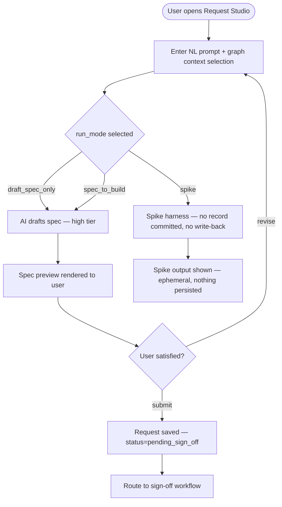

**run_mode values:**

| Mode | Behaviour | Write-back |
|---|---|---|
| `draft_spec_only` | Produce and save spec; stop before dark factory | No |
| `spec_to_build` | Spec → task briefs → full dark factory loop | Yes |
| `spike` | Ephemeral generate; no Aurora row committed | No |

---

### Request Status States

`requests.status` FSM. Maps to the `requests` table —
see [data-model.md#requests-table](data-model.md#requests-table).

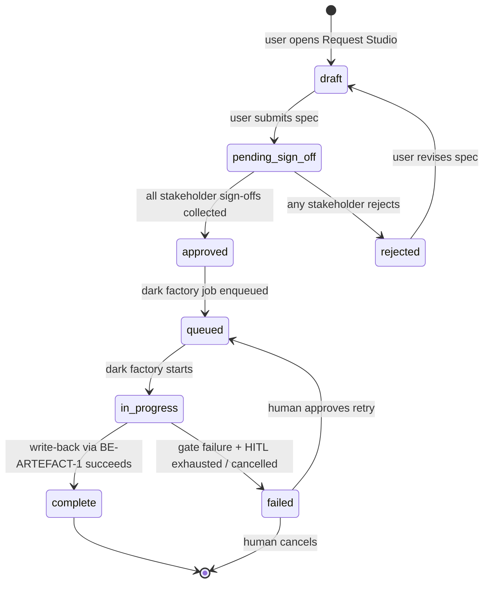

---

## Project Create Flow

M1 backend-only stub (EPIC-002). Creates the `projects` row and pins the graph version.
No Project Management UI in M1.

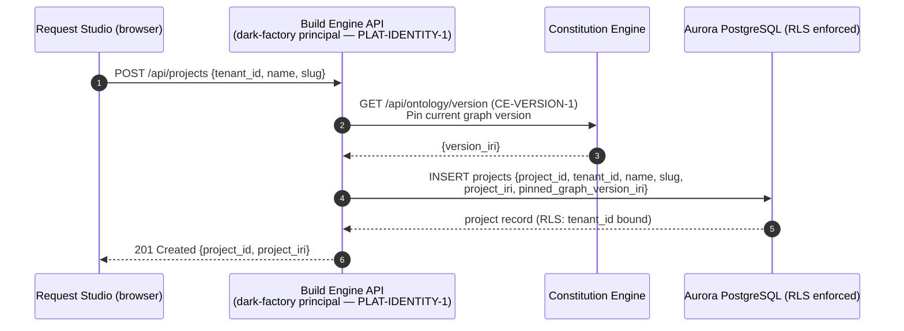

**Project IRI scheme:** `urn:weave:project:{tenant_id}:{slug}`

---

## Sign-Off Workflow

Collects stakeholder approvals before the dark factory loop starts. Stakeholder IRIs are
resolved from the tenant graph via CE-READ-1. Authority routing follows ADR-002 M1 base degrade.

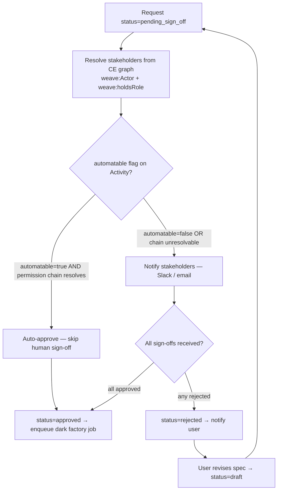

**Invariant:** unresolvable permission chain → deny-by-default (`coverage_gap`) per ADR-002 M1.
Full ODRL authority resolution is M2.

---

## Spec Lifecycle FSM

`build_specs.status` FSM — see [data-model.md#specs-tasks-tables](data-model.md#specs-tasks-tables).

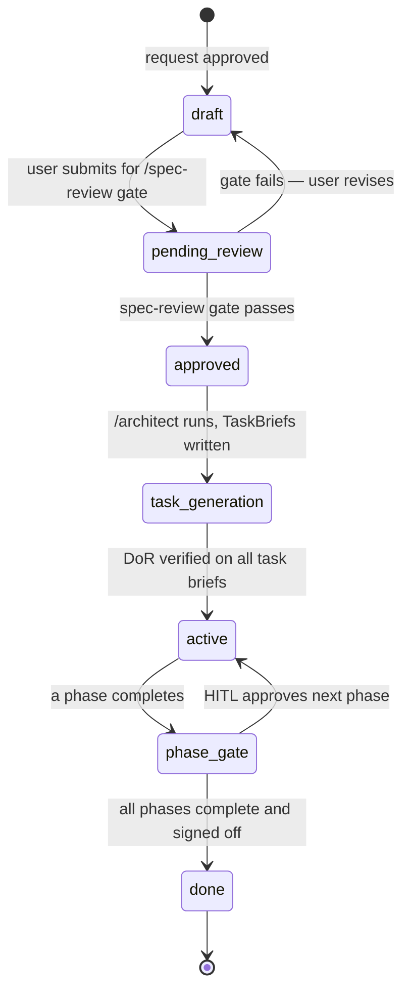

---

## HITL Gate Sequence

Invoked at the end of each dark-factory phase. Fail-closed: gate failure or
`automatable=false` always routes to a human (ADR-002 B4).

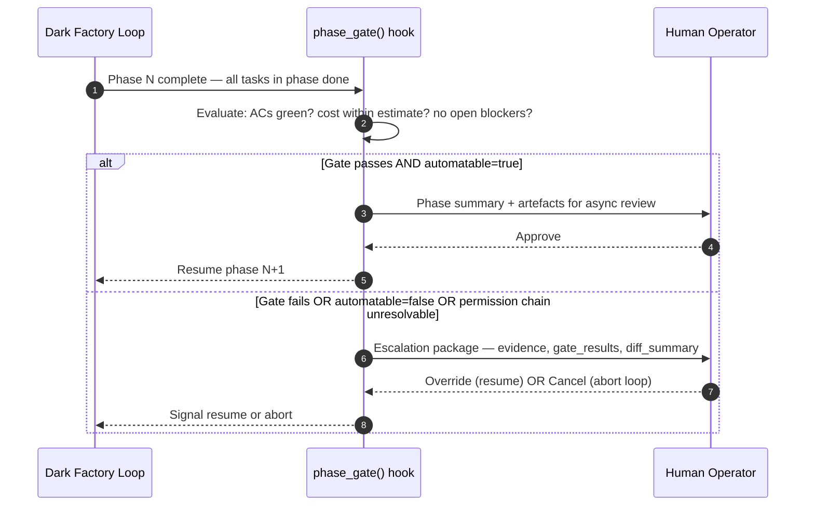

---

## Architect Agent Brief Generation

Generates TaskBrief records for all M1 tasks from the approved spec (TASK-002).
Brief IRI scheme: `urn:weave:brief:{task_id}`.

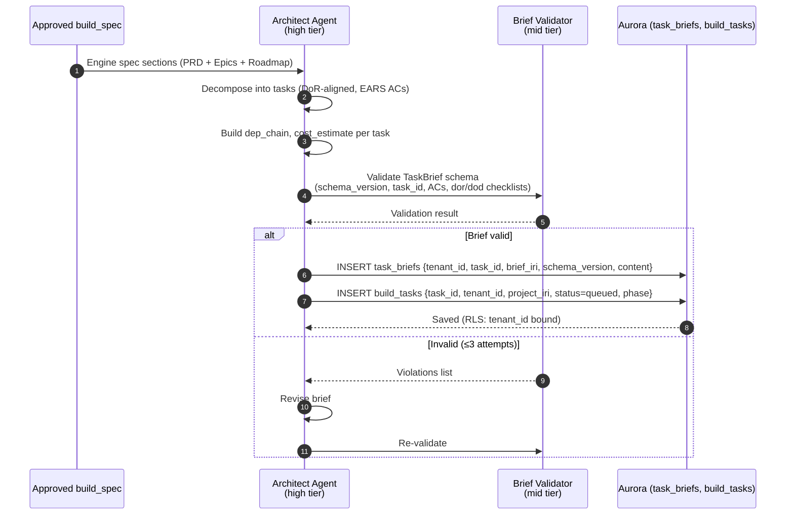

---

## Repo Bootstrap Flow {#repo-bootstrap-flow}

**Run step 0** (TASK-010, FR-061 / decision B9). Before the first PLAN, the orchestrator ensures
the project's **NEW external repository** exists on the configured source-control provider
(GitHub or GitLab) and its boilerplate/harness is pushed. All generated output (TASK-008) lands in
that client-owned repo — **never inside Weave**. The provider + auth token are a project/workspace
setting (`PLAT-SETTINGS-1` for config; token in **AWS Secrets Manager** only, referenced by
`scm_token_secret_ref`). Source control is **not** a `PLAT-CONNECTOR-1` connector and is available
at M1.

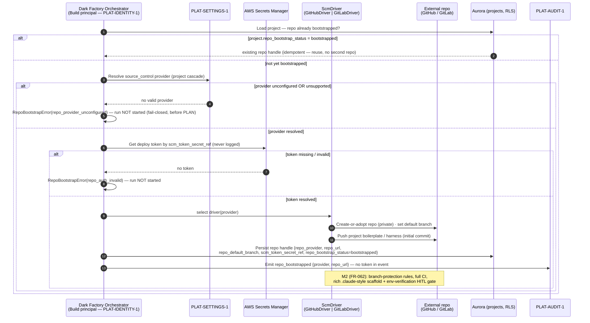

**Invariants:**

- **Idempotent re-run** — a project whose `repo_bootstrap_status = bootstrapped` reuses the existing
  repo handle; a second run never creates a second repo.
- **Token never logged** — the provider token is read from Secrets Manager at use and never appears
  in any response body, log line, or `PLAT-AUDIT-1` event.
- **Fail-closed** — an unconfigured provider or invalid token halts the run **before PLAN**; the
  run is not started and no code is generated. There is no Weave-internal repo fallback.

---

## Dark Factory PDAC Sequence

The core agentic loop: Plan → Delegate → Assess → Codify (non-skippable per B3).
ENG-4 stubs are shown as pass-through states in M1.

```mermaid
sequenceDiagram
  autonumber
  participant Arch as Architect Agent<br/>(high tier)
  participant Eng as Task Engineer<br/>(mid tier)
  participant Validator as CODIFY Validator<br/>(mid tier)
  participant HITL as Human (HITL escalation)
  participant Audit as PLAT-AUDIT-1

  Arch->>Arch: PLAN — read task brief, DoR, decompose sub-tasks
  Arch->>Eng: DELEGATE — task brief with EARS ACs + dep_chain
  Note over Eng: dep-summary-handoff STUB (M1 pass-through)<br/>Row written; no merge logic yet — ENG-4 M2
  Eng->>Eng: ASSESS — implement, self-evaluate against ACs
  Note over Eng: pre-scaffold-review STUB (M1 pass-through)<br/>Gate present but non-blocking — ENG-4 M2
  Eng->>Validator: CODIFY — validate all EARS ACs, run DoD checks
  Note over Validator: CODIFY is non-skippable (B3)
  Validator-->>Eng: AC results (pass / fail per criterion)
  alt All ACs pass
    Eng->>Eng: Commit artefacts (branch + sha)
    Eng->>Audit: Emit PLAT-AUDIT-1 event {task_id, actor_principal_iri, event=task.complete}
    Eng-->>Arch: Task complete → advance phase
  else Any AC fails (attempt ≤ 3)
    Eng->>Eng: Loop back to ASSESS
  else Retry limit exceeded
    Eng->>HITL: Escalate — evidence, failing ACs, attempt count
    HITL-->>Arch: Override (resume) OR Cancel
  end
```

---

## Task State Machine

`build_tasks.status` FSM — every transition emits a PLAT-AUDIT-1 event.

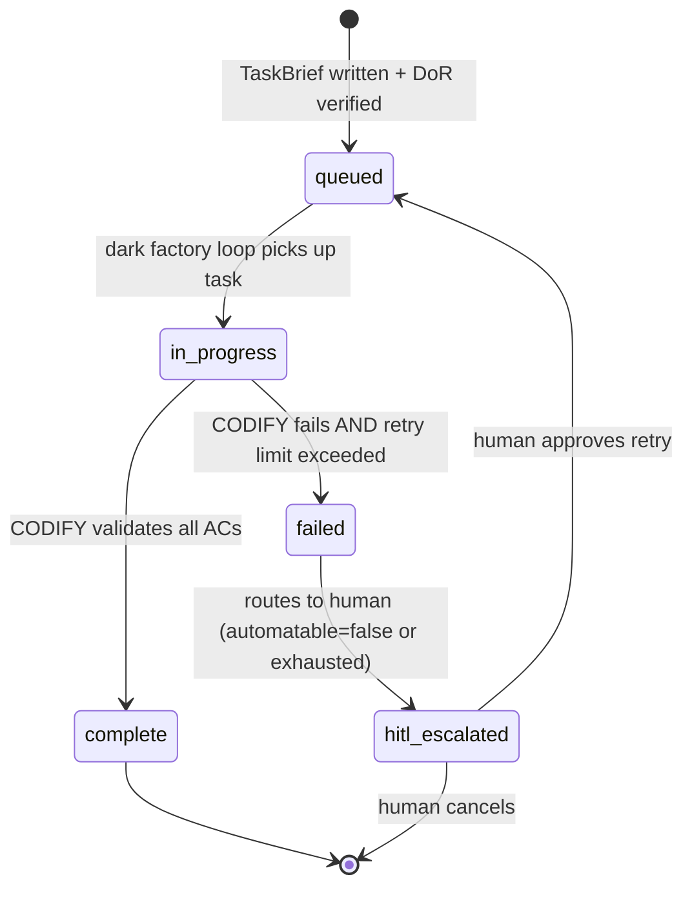

**CODIFY is non-skippable (B3):** a task cannot move to `complete` without mid tier
validation of all EARS ACs. A task in `complete` state is a DoD guarantee.

---

## App Generation Pipeline

M1 end-to-end generate flow (EPIC-008). The dark-factory principal acts under a
least-privilege IAM role (PLAT-IDENTITY-1 + ADR-002).

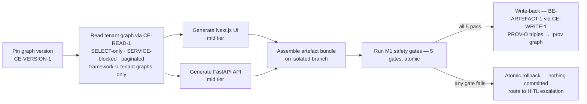

**M1 generate loop — illustrative control flow (not prescriptive):**

```python
# illustrative, not prescriptive — M1 generate loop
async def m1_generate_loop(job: BuildJob) -> None:
    version_iri = await pin_graph_version(job.tenant_id)          # CE-VERSION-1
    graph_data  = await paginated_read(job.tenant_id, version_iri) # CE-READ-1
    artefacts   = await generate_nextjs_fastapi(graph_data, job)   # mid tier
    gate_results = await run_m1_safety_gates(artefacts)            # 5 gates, atomic
    if all(g.result == "passed" for g in gate_results):
        await write_back(artefacts, version_iri, job)              # BE-ARTEFACT-1 → CE-WRITE-1
        await emit_audit_event(job, artefacts)                     # PLAT-AUDIT-1
    else:
        await route_to_hitl(job, gate_results)                     # automatable=false
```

---

## M1 Generate Loop — Full Sequence

Principal-scoped diagram showing dark-factory identity boundary (PLAT-IDENTITY-1 + ADR-001).

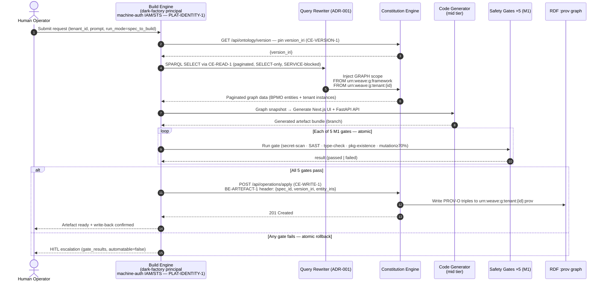

---

## automatable Decision

ADR-002 M1 base degrade: the `automatable` flag on a `weave:Activity` or `weave:Process`
entity in the CE graph determines whether the dark factory auto-executes or routes to a human.

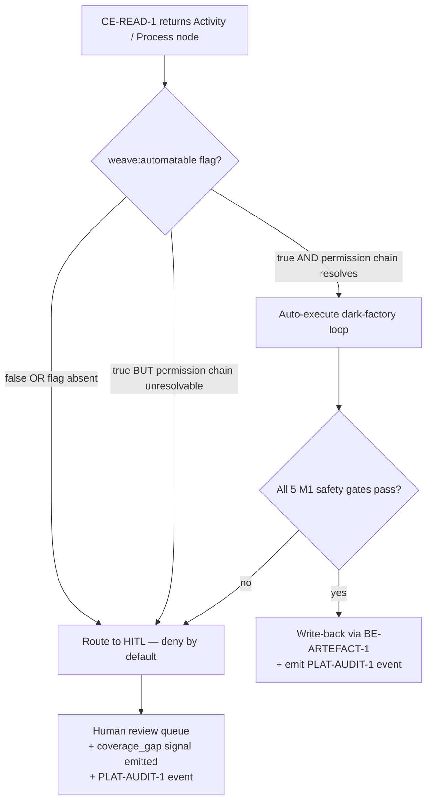

---

## Gate Flow

M1 safety gate execution — **atomic**: any failure stops the run without committing.
See [gate_results table](data-model.md#gate-results-table) for storage.

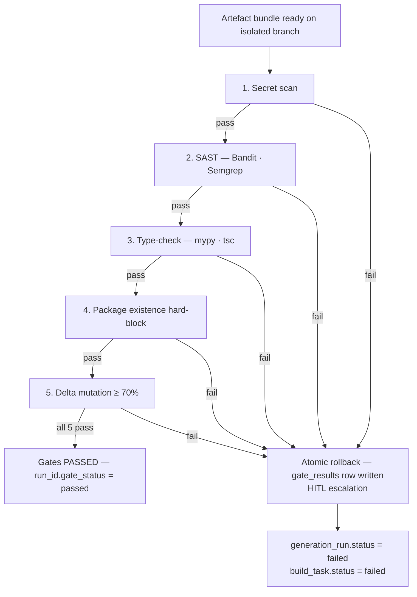

**Gate notes:**

| Gate | Tool(s) | Failure action |
|---|---|---|
| Secret scan | trufflehog / gitleaks | Hard block — any detected secret (runs first, fail-fast) |
| SAST | Bandit (Python), Semgrep | Hard block — all findings ≥ MEDIUM |
| Type-check | mypy (Python), tsc (TypeScript) | Hard block — any type error |
| Package existence | pip/npm registry lookup | Hard block — any unresolvable package |
| Delta mutation ≥ 70% | mutation test runner (delta-scoped) | Hard block — coverage < 70% on changed lines |

CE-BRAND-1 conformance is **not a M1 gate** — deferred to M2 (B7).

---

## Gate Flow DoR DoD

Definition of Ready and Definition of Done checks in relation to the generate → gate → write-back
pipeline.

```mermaid
flowchart LR
  subgraph DoR["Definition of Ready — checked before generate starts"]
    DR1[CE-READ-1 reachable and returning data]
    DR2[graph_version_iri pinned on project]
    DR3[task_brief content validated by mid tier]
    DR4[automatable flag resolved — auto or HITL decision made]
    DR5[no unresolved blockers in build_tasks.blocked_by]
  end
  subgraph DoD["Definition of Done — all must be true"]
    DD1[All 5 M1 safety gates passed atomically]
    DD2[generation_run.artefact_iri set]
    DD3[PROV-O triples written to :prov named graph]
    DD4[PLAT-AUDIT-1 event emitted and acknowledged]
    DD5[projects.write_back_complete = true]
    DD6[CODIFY step passed — all EARS ACs green]
  end

  DoR -->|all checks green| GEN[App Generation Pipeline]
  GEN --> GAT[Gate Flow — 5 gates atomic]
  GAT -->|gates passed| WB[Deploy and Write-Back Flow]
  WB --> DoD
```

---

## Deploy and Write-Back Flow

Post-gate write-back sequence (EPIC-009). Writes the artefact to S3 and provenance to CE.
PLAT-AUDIT-1 is the append-only record — Build does not maintain its own audit store.

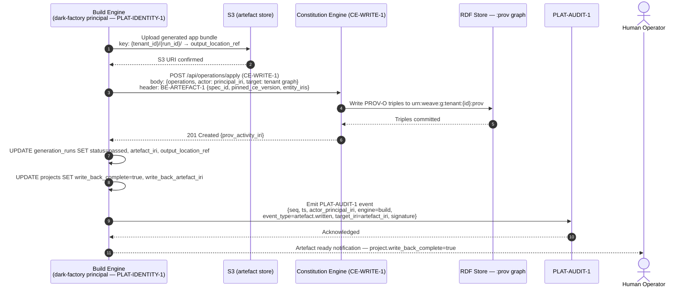

**CE-WRITE-1 rejection (SHACL validation fails):** 422 with `{violations}` response.
Build re-routes to HITL — it does NOT retry blindly.

---

## ENG-4 Council Backlog: M1 Stubs

> **Conflict resolved (2026-07-01):** `build-engine.md` previously tagged **FR-043** (dep-summary
> handoff) and **FR-055** (pre-scaffold review) as **M1 Must**. They are now reconciled to
> `M1 stub / M2` in the engine spec, matching the `scope-refine` council directive — M1 = the
> pass-through stubs described below; full behaviour lands M2. This file follows that directive.

### dep-summary-handoff (ENG-4 STUB)

In M1 the CODIFY step writes a `dep_summaries` row (producing task → consuming task) but
the **consuming task does not read or gate on it**. It is a data breadcrumb only.

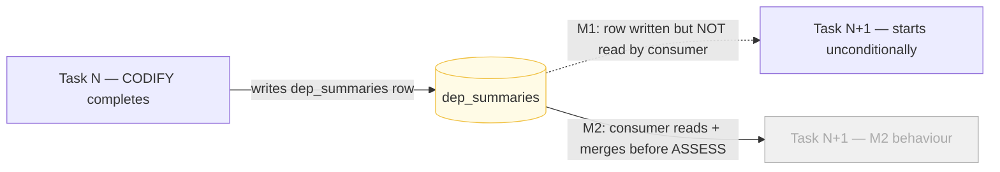

### pre-scaffold-review (ENG-4 STUB)

In M1 the pre-scaffold check step is present in the PDAC flow but **non-blocking**. The mid tier
validator runs the check; a warning is emitted if it would have gated, but the loop continues.

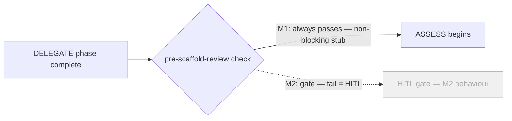

---

## Performance-Spike Degrade Note

Per [ADR-001 Consequences](../../../decisions/ADR-001-tenant-isolation.md): the CE performance
and security spike ([CE TASK-008](../../../constitution-engine/m1/tasks/TASK-008.md)) stress-
tests the query-rewriting middleware. If the spike reveals rewriter fragility:

- The degrade plan **must preserve** the M1 generate step (per weave-spec §1.2).
- Acceptable degrade: increase latency, reduce page size, add rate limiting.
- **Not acceptable:** widen graph scope to hit a latency target (cross-tenant leak risk).
- Build Engine integration tests run **only after CE M1 has landed** — do not stub the rewriter
  in integration tests.

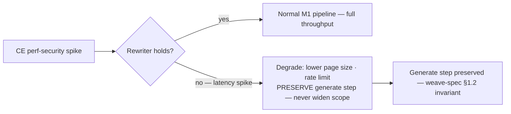

---

## Deferred (M2+)

| Flow / Feature | Milestone | Reason |
|---|---|---|
| CE-BRAND-1 conformance gate in Gate Flow | M2 | B7 — out of M1 thin loop scope |
| ODRL full authority resolution in sign-off | M2 | ADR-002 phasing |
| dep-summary-handoff merge logic | M2 (ENG-4 backlog) | Cross-task resolution deferred |
| pre-scaffold-review gate (blocking) | M2 (ENG-4 backlog) | Pre-scaffold gate deferred |
| Project Management UI (PM views) | M2 | EPIC-003 is M2 |
| Multi-user real-time collab flows | Phase 2 | Explorer collab deferred to Phase 2 |
| Agent-generation flows (Build → Events integration) | M2+ | Requires Events engine M1 |
| BE-SDK-1 artefact consumption SDK | M2 | Not in M1 generate loop |
