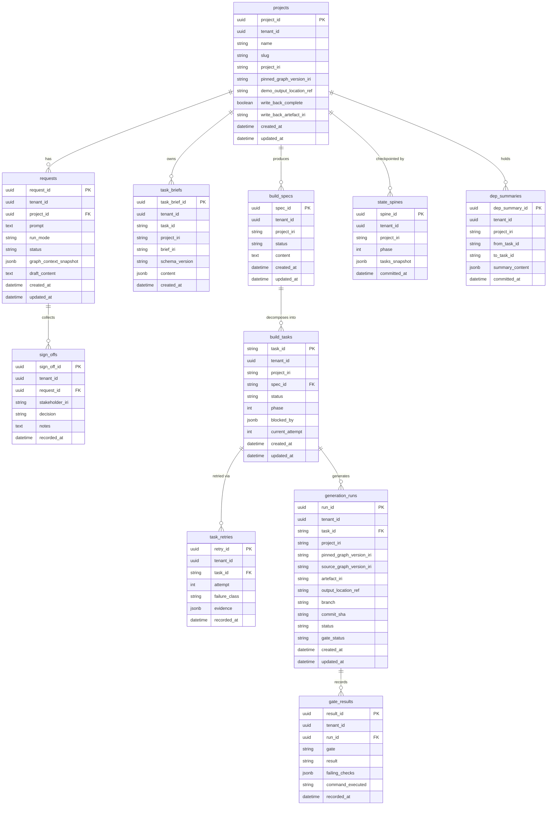

# Build Engine — Data Model (M1)

**Graph edges:**
[Build Engine spec](../../../build-engine.md) ·
[Inter-engine contracts](../../../../contracts.md) ·
[ADR-001 Tenant isolation](../../../../decisions/ADR-001-tenant-isolation.md) ·
[ADR-002 Authority extension](../../../../decisions/ADR-002-authority-extension.md)

---

## Scope

This document covers **M1 only** — the thin generate loop (pin version → read via CE-READ-1 →
generate one Next.js + FastAPI artefact → run 5 M1 safety gates → write-back via BE-ARTEFACT-1).
Every entity here maps directly to an M1 epic or task. Anything M2+ lives in
[Deferred (M2+)](#deferred-m2).

ENG-4 council-backlog items (`dep-summary-handoff`, `pre-scaffold-review`) are present in the
schema as storage structures but their cross-task merge and review-gate behaviours are **STUB in
M1** — the rows exist, the behaviour is a pass-through (see
[ENG-4 note](#state-spine-and-dep-summaries-tables)).

---

## Named-Graph Isolation Scheme

Per [ADR-001](../../../../decisions/ADR-001-tenant-isolation.md), every RDF read and write passes
through the **fail-closed query-rewriting middleware** — the single enforcement point.
No engine code issues raw store queries.

| Graph | IRI | Written by | Read by |
|---|---|---|---|
| Shared BPMO upper framework | `urn:weave:g:framework` | Weave release process | all tenants (read-only) |
| Tenant instance graph | `urn:weave:g:tenant:{tenant_id}` | that tenant via CE-WRITE-1 | that tenant only |
| Tenant provenance graph | `urn:weave:g:tenant:{tenant_id}:prov` | audit path (BE-ARTEFACT-1) | that tenant only |

The Build Engine **reads** via CE-READ-1 (SELECT-only, SERVICE-blocked, paginated) and
**writes** via CE-WRITE-1 (`POST /api/operations/apply`). It never issues raw SPARQL writes.

---

## Aurora Relational Model

All tables reside in AWS Aurora PostgreSQL Serverless v2. Every table carries `tenant_id` (UUID)
and enforces **row-level security (RLS)** at the database layer — see
[rbac-multi-tenancy](../../../../../../standards/rbac-multi-tenancy.md) for the RLS mechanism and
mandatory cross-tenant test. Queries are parameterised; user input is never concatenated into SQL.



---

### Projects Table

**IRI scheme:** `urn:weave:project:{tenant_id}:{slug}`

RLS: `tenant_id = current_setting('app.tenant_id')::uuid` enforced on all queries.

| Column | Type | Notes |
|---|---|---|
| `project_id` | UUID PK | surrogate key |
| `tenant_id` | UUID NOT NULL | RLS predicate |
| `name` | TEXT NOT NULL | human label |
| `slug` | TEXT NOT NULL | URL-safe slug; forms the project IRI |
| `project_iri` | TEXT NOT NULL | `urn:weave:project:{tenant_id}:{slug}` |
| `pinned_graph_version_iri` | TEXT | set on first generation run (CE-VERSION-1) |
| `demo_output_location_ref` | TEXT | S3 URI of generated demo app bundle |
| `write_back_complete` | BOOLEAN | true once BE-ARTEFACT-1 write-back succeeds |
| `write_back_artefact_iri` | TEXT | `urn:weave:artefact:{tenant_id}:{run_id}` |
| `created_at` | TIMESTAMPTZ | immutable |
| `updated_at` | TIMESTAMPTZ | updated on write-back |

**Indexes:** `UNIQUE (tenant_id, slug)`.

---

### Requests Table

Captures a user's natural-language prompt and AI-drafted spec before sign-off.

RLS: `tenant_id` predicate on all queries.

| Column | Type | Notes |
|---|---|---|
| `request_id` | UUID PK | |
| `tenant_id` | UUID NOT NULL | RLS |
| `project_id` | UUID FK → `projects.project_id` | |
| `prompt` | TEXT NOT NULL | raw NL input |
| `run_mode` | TEXT | `draft_spec_only \| spec_to_build \| spike` |
| `status` | TEXT | FSM values — see [Request Status States](#request-status-states) |
| `graph_context_snapshot` | JSONB | entity IRIs used at request time |
| `draft_content` | TEXT | AI-drafted spec markdown |
| `created_at` | TIMESTAMPTZ | |
| `updated_at` | TIMESTAMPTZ | |

**Indexes:** `(tenant_id, project_id, status)`.

---

### Sign-Offs Table

One row per stakeholder per request. Approval is unanimous.

RLS: `tenant_id` predicate.

| Column | Type | Notes |
|---|---|---|
| `sign_off_id` | UUID PK | |
| `tenant_id` | UUID NOT NULL | RLS |
| `request_id` | UUID FK → `requests.request_id` | |
| `stakeholder_iri` | TEXT NOT NULL | `weave:Actor` IRI from CE (PLAT-IDENTITY-1) |
| `decision` | TEXT | `pending \| approved \| rejected` |
| `notes` | TEXT | stakeholder comment |
| `recorded_at` | TIMESTAMPTZ | |

**Constraint:** decision enum enforced by CHECK.

---

### Task Briefs Table

Structured TaskBrief schema consumed by dark-factory agents (TASK-002).
**Brief IRI scheme:** `urn:weave:brief:{task_id}`

RLS: `tenant_id` predicate.

| Column | Type | Notes |
|---|---|---|
| `task_brief_id` | UUID PK | |
| `tenant_id` | UUID NOT NULL | RLS |
| `task_id` | TEXT NOT NULL | `urn:weave:project:{tenant_id}:{slug}/tasks/{n}` |
| `project_iri` | TEXT NOT NULL | back-ref to project |
| `brief_iri` | TEXT NOT NULL | `urn:weave:brief:{task_id}` |
| `schema_version` | TEXT NOT NULL | semver of TaskBrief Pydantic schema |
| `content` | JSONB NOT NULL | full TaskBrief body (ACs, dep_chain, cost_estimate…) |
| `created_at` | TIMESTAMPTZ | |

**Key JSONB fields in `content`:** `schema_version`, `acceptance_criteria` (EARS list),
`ac_to_test_map`, `dor_checklist`, `dod_checklist`, `dep_chain`, `cost_estimate`.
`design_tokens` key is reserved but empty in M1 (CE-BRAND-1 is M2).

---

### Specs Tasks Tables

Two tables that together track the spec lifecycle and task execution state.

#### `build_specs`

Captures the living spec document for a project (draft → approved → active).

RLS: `tenant_id` predicate.

| Column | Type | Notes |
|---|---|---|
| `spec_id` | UUID PK | |
| `tenant_id` | UUID NOT NULL | RLS |
| `project_iri` | TEXT NOT NULL | |
| `status` | TEXT | `draft \| pending_review \| approved \| active \| done` |
| `content` | TEXT NOT NULL | spec document (markdown) |
| `created_at` | TIMESTAMPTZ | |
| `updated_at` | TIMESTAMPTZ | |

#### `build_tasks`

Task execution state within the dark factory PDAC loop.

RLS: `tenant_id` predicate.

| Column | Type | Notes |
|---|---|---|
| `task_id` | TEXT PK | matches `task_briefs.task_id` |
| `tenant_id` | UUID NOT NULL | RLS |
| `project_iri` | TEXT NOT NULL | |
| `spec_id` | UUID FK → `build_specs.spec_id` | |
| `status` | TEXT | `queued \| in_progress \| complete \| failed \| hitl_escalated` |
| `phase` | INT NOT NULL | which PDAC phase (1-indexed) |
| `blocked_by` | JSONB | array of blocking task_ids |
| `current_attempt` | INT DEFAULT 0 | incremented on retry |
| `created_at` | TIMESTAMPTZ | |
| `updated_at` | TIMESTAMPTZ | |

**Indexes:** `(tenant_id, project_iri, status)`, `(tenant_id, phase)`.

---

### State Spine and Dep Summaries Tables

> **ENG-4 Council Backlog — M1 STUB:** `dep_summaries` rows are written and readable in M1
> but the cross-task merge logic (`dep-summary-handoff`) and the pre-scaffold spec-review gate
> (`pre-scaffold-review`) are **pass-through stubs** — the dark-factory loop reads the row but
> does not block on it. Full cross-task dependency resolution and gating are M2 behaviours.
> See [business-process §ENG-4](business-process.md#eng-4-council-backlog-m1-stubs).
>
> **Conflict resolved (2026-07-01):** `build-engine.md` previously tagged FR-043 (dep-summary
> handoff) and FR-055 (pre-scaffold review) as M1 Must; they are now reconciled to
> `M1 stub / M2` in the engine spec, matching the `scope-refine` council directive (M1 =
> pass-through stub, full behaviour M2).

#### `state_spines`

Phase-level checkpoint snapshot committed to `.claude/state/progress.json` equivalent in Aurora.

RLS: `tenant_id` predicate.

| Column | Type | Notes |
|---|---|---|
| `spine_id` | UUID PK | |
| `tenant_id` | UUID NOT NULL | RLS |
| `project_iri` | TEXT NOT NULL | |
| `phase` | INT NOT NULL | phase number |
| `tasks_snapshot` | JSONB NOT NULL | `{task_id: status}` map at commit time |
| `committed_at` | TIMESTAMPTZ | immutable |

#### `dep_summaries`

Dependency summary handoff records between tasks (ENG-4 STUB for M1 — rows written,
merge behaviour deferred).

RLS: `tenant_id` predicate.

| Column | Type | Notes |
|---|---|---|
| `dep_summary_id` | UUID PK | |
| `tenant_id` | UUID NOT NULL | RLS |
| `project_iri` | TEXT NOT NULL | |
| `from_task_id` | TEXT NOT NULL | producing task |
| `to_task_id` | TEXT NOT NULL | consuming task |
| `summary_content` | JSONB | `{outputs, interfaces, caveats}` — written by CODIFY step |
| `committed_at` | TIMESTAMPTZ | immutable |

---

### Generation Runs Table

One row per dark-factory generate attempt for a task.

**Artefact IRI scheme:** `urn:weave:artefact:{tenant_id}:{run_id}`

RLS: `tenant_id` predicate.

| Column | Type | Notes |
|---|---|---|
| `run_id` | UUID PK | |
| `tenant_id` | UUID NOT NULL | RLS |
| `task_id` | TEXT FK → `build_tasks.task_id` | |
| `project_iri` | TEXT NOT NULL | |
| `pinned_graph_version_iri` | TEXT NOT NULL | version pinned at job start (CE-VERSION-1) |
| `source_graph_version_iri` | TEXT NOT NULL | same as pinned for M1 |
| `artefact_iri` | TEXT | `urn:weave:artefact:{tenant_id}:{run_id}`; set on gate pass |
| `output_location_ref` | TEXT | S3 URI of generated bundle |
| `branch` | TEXT | git branch name for the generated code |
| `commit_sha` | TEXT | HEAD commit after generation |
| `status` | TEXT | `queued \| generating \| gating \| passed \| failed \| hitl_escalated` |
| `gate_status` | TEXT | `pending \| in_progress \| passed \| failed` |
| `created_at` | TIMESTAMPTZ | |
| `updated_at` | TIMESTAMPTZ | |

**Indexes:** `(tenant_id, task_id, status)`, `(tenant_id, artefact_iri)`.

---

### Gate Results Table

One row per gate per generation run. M1 has exactly **five** gates (see conflict note below).

> **Gate count:** the team-lead brief cited "4 M1 gates." The engine spec (FR-029, success
> criterion #2, roadmap) consistently defines **five** M1 gates: SAST, type-check, delta-mutation
> ≥70%, package-existence hard-block, secret-scan. This data model follows the engine spec
> (authoritative). CE-BRAND-1 is the M2 sixth gate. Flag to team-lead for resolution.

RLS: `tenant_id` predicate.

| Column | Type | Notes |
|---|---|---|
| `result_id` | UUID PK | |
| `tenant_id` | UUID NOT NULL | RLS |
| `run_id` | UUID FK → `generation_runs.run_id` | |
| `gate` | TEXT NOT NULL | open enum; M1 set: `sast \| type_check \| mutation \| pkg_existence \| secret_scan` |
| `result` | TEXT NOT NULL | `passed \| failed` |
| `failing_checks` | JSONB | list of `{rule, file, line, message}` on failure |
| `command_executed` | TEXT | tool invocation string (Bandit / mypy / etc.) |
| `recorded_at` | TIMESTAMPTZ | immutable |

**Constraint:** `gate` is an open enum (not a CHECK constraint) so future gates can be added
without a migration. **All five M1 gates must pass for the run to proceed** — failure of any one
triggers atomic rollback and HITL escalation.

**Indexes:** `(tenant_id, run_id, gate)`, `(tenant_id, gate, result)`.

---

### Projects Demo and Write-Back Fields

These fields on the `projects` table track the M1 thin-loop deliverable: one generated demo
app written back via BE-ARTEFACT-1.

| Field | Set when | Value |
|---|---|---|
| `demo_output_location_ref` | generation run passes all gates | S3 URI `s3://weave-artefacts/{tenant_id}/{run_id}/` |
| `write_back_complete` | CE-WRITE-1 returns 201 | `true` |
| `write_back_artefact_iri` | same | `urn:weave:artefact:{tenant_id}:{run_id}` |
| `pinned_graph_version_iri` | first generation run created | graph version IRI from CE-VERSION-1 |

**M1 success criterion (from weave-spec §1.3):** one client project reaches
`write_back_complete = true` with a resolvable `write_back_artefact_iri` and a
PROV-O provenance triple in `urn:weave:g:tenant:{tenant_id}:prov`.

---

## RDF/OWL Mapping

The Build Engine's graph-resident entities live in the tenant's RDF graphs (not Aurora).
Standards definitions are consumed, not restated — link targets below are authoritative.

| Domain entity | BPMO / Open vocab class | Predicates | Named graph |
|---|---|---|---|
| Generated artefact | `weave:System` or `weave:Service` or `weave:DataAsset` (per output type) | `prov:wasGeneratedBy`, `weave:sourceGraphVersion` | `urn:weave:g:tenant:{id}` |
| Build activity (generate run) | `prov:Activity` | `prov:wasAssociatedWith`, `prov:startedAtTime`, `prov:endedAtTime`, `weave:pinnedVersion` | `urn:weave:g:tenant:{id}:prov` |
| Dark-factory service principal | `weave:Actor` (via PLAT-IDENTITY-1) | `weave:holdsRole` | `urn:weave:g:framework` |
| Role (dark-factory agent) | `weave:Role` (ADR-002) | `odrl:assignee` on `odrl:Permission` | `urn:weave:g:framework` |
| Provenance entity (artefact record) | `prov:Entity` | `prov:wasGeneratedBy` → `prov:Activity`, `weave:outputRef` | `urn:weave:g:tenant:{id}:prov` |

**PROV-O provenance pattern (BE-ARTEFACT-1) — Turtle sketch (illustrative):**

```turtle
# Named graph: urn:weave:g:tenant:{tenant_id}:prov
<urn:weave:artefact:{tenant_id}:{run_id}>
    a prov:Entity ;
    prov:wasGeneratedBy <urn:weave:activity:{tenant_id}:{run_id}> ;
    weave:sourceGraphVersion "{version_iri}"^^xsd:anyURI ;
    weave:outputRef "{s3_uri}"^^xsd:anyURI .

<urn:weave:activity:{tenant_id}:{run_id}>
    a prov:Activity ;
    prov:wasAssociatedWith <urn:weave:principal:build-engine:dark-factory> ;
    weave:pinnedVersion "{version_iri}"^^xsd:anyURI ;
    prov:startedAtTime "{iso_ts}"^^xsd:dateTime ;
    prov:endedAtTime   "{iso_ts}"^^xsd:dateTime .

<urn:weave:principal:build-engine:dark-factory>
    a weave:Actor ;
    weave:holdsRole <urn:weave:role:dark-factory-agent> .
```

Provenance headers on the CE-WRITE-1 call carry: `spec_id`, `pinned_ce_version`,
`referenced_entity_iris[]`. Full PROV-O semantics are defined in
[semantic-web.md](../../../../../../standards/semantic-web.md) and
[audit-immutability.md](../../../../../../standards/audit-immutability.md).
The Build Engine emits PLAT-AUDIT-1 events; it does **not** maintain its own audit store.

**Authority mapping (ADR-002 M1 base degrade):**
The `automatable` flag on `weave:Activity` / `weave:Process` (default `false`, absent = route
to human) is the M1 authority gate. If `automatable=false` OR the `weave:Actor →holdsRole→
weave:Role →odrl:assignee→ odrl:Permission` chain is unresolvable, the engine **routes to HITL
and denies by default** (`coverage_gap` signal). ODRL/SKOS full Authority Extension is M2.

---

## Cross-Tenant Isolation Invariant

Per [ADR-001](../../../../decisions/ADR-001-tenant-isolation.md):

- A build job reads **only** `urn:weave:g:framework ∪ urn:weave:g:tenant:{ctx.tenant_id}`.
- Write-back targets `urn:weave:g:tenant:{ctx.tenant_id}` derived from **request context**,
  never from the payload; a payload naming another tenant's graph is a 403 + PLAT-AUDIT-1 entry.
- Aurora: `tenant_id` column + RLS on all 10 tables; base query layer enforces the predicate
  at the ORM level — no ad-hoc `WHERE tenant_id = ?` scattered through service code.
- **Release gate (mandatory):** `test_cross_tenant_read_returns_zero_rows` +
  `test_unscoped_query_is_rejected` + connector-write isolation case must pass before M1 ship.
  See [rbac-multi-tenancy.md](../../../../../../standards/rbac-multi-tenancy.md) for the test harness.

---

## Deferred (M2+)

The following entities are **excluded from the M1 core model**. They appear here only to
signal planned extension points.

| Entity / Feature | Deferred milestone | Reason |
|---|---|---|
| CE-BRAND-1 brand conformance gate | M2 | B7 — out of M1 thin loop scope |
| `design_tokens` field populated on TaskBrief | M2 | Requires CE-BRAND-1 |
| ODRL/SKOS full Authority Extension | M2 | ADR-002 phasing — base degrade is M1 |
| `dep-summary-handoff` merge logic | M2 (ENG-4 backlog) | Cross-task resolution deferred |
| `pre-scaffold-review` gate | M2 (ENG-4 backlog) | Pre-scaffold gate deferred |
| BE-SDK-1 (artefact consumption SDK) | M2 | Not required for generate loop |
| CE-VERSION-1 staleness alerting | M2 | Lag threshold alerting deferred |
| Agent-generation (agents from graph) | M2+ | Requires Build + Events integration |
