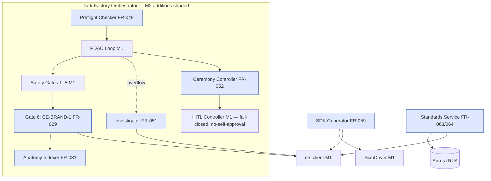

# Build Engine — M2 Tech-Spec Delta

**Scope rule:** this document contains ONLY changes from M1. `architecture.md`, `data-model.md`,
`business-process.md`, `testing-strategy.md` remain authoritative for everything not restated
here. Contract shapes stay canonical in [`contracts.md`](../../../contracts.md) — this delta
cites, never redefines. Decisions: [ADR-005](../decisions/ADR-005.md) (OQ-11 retrieval),
[ADR-006](../decisions/ADR-006.md) (BE-SDK-1 pipeline), [ADR-007](../decisions/ADR-007.md)
(standards catalogue). Upstream M2 contracts consumed: `CE-FUNCTION-1` (definition surface, CE
ADR-009) and `CE-BRAND-1` (closed-core tokens + VoiceRules). `GE-CANVAS-1` is **not** consumed in
Build M2 — the project-ontology embed (FR-032) is post-v1; forward pointer only.

## 1. Open questions closed at M2

| OQ | Disposition |
|---|---|
| OQ-11 | CLOSED — deterministic seed + weighted k-hop retrieval under the 200-node cap; FR-051 investigator overflow. ADR-005. |
| OQ-10 | CLOSED — VoiceRules format is contracts.md §CE-BRAND-1 (`{id, severity, assertion}`); no Build-side format. |
| OQ-05 | DEFERRED to v1.0 — ceremony reports per-run PLAT-BILLING-1 aggregates; per-task attribution not required by any M2 exit criterion. |
| OQ-08 | DEFERRED — template library; no M2 story consumes it. |

## 2. Architecture delta (extends architecture.md C4 L2/L3)

New/changed elements only. Everything routes through the two M1 choke points unchanged:
`repo_layer` (Aurora, RLS) and `ce_client` (no raw SPARQL, ADR-001).

- **SDK Generator** — new Fargate task (same family as Preview Deployer). Deterministic
  fetch → IR → emit pipeline per ADR-006; commits generated source via ScmDriver; refuses across
  `breaking:true` spans to the existing HITL gate.
- **Brand Gate** — sixth member of the existing atomic Safety Gate Pipeline (M1 D-note in
  data-model.md anticipated it). Runs **after** the five M1 gates. Fetches CE-BRAND-1 tokens +
  VoiceRules via `ce_client`; score `= normal-passed / normal-total`; pass = score ≥ 0.90
  (tunable via PLAT-SETTINGS-1) AND zero critical failures. Atomicity unchanged: any of the six
  fails ⇒ nothing commits.
- **Ceremony Controller** — new orchestrator component. Auto-triggers on `phase-complete`;
  sequence §3.3. Reuses the M1 HITL controller (fail-closed, no-self-approval D9).
- **Standards Service** — CRUD + effective-set resolution over `standards_documents` (ADR-007);
  lives in the Lambda API tier (short-lived requests). Prompt assembly consumes the effective set
  at E8-S1.
- **Anatomy Indexer** — post-commit step in the generate pipeline: regenerates `ANATOMY.md` +
  `docs/wiki/` **in the generated project repo** (files/functions/capabilities/ADRs, FR-031);
  agents load it at task start. Index commit is part of the run's commit set (atomic with gates).
- **Preflight Checker** — orchestrator step before run start and at each phase boundary
  (FR-049): verifies credential *references* resolve (names via Secrets Manager describe — never
  values); missing critical dep ⇒ STOP to HITL.
- **Investigator Dispatch** — ADR-005 overflow path; read-only Sandbox-class principal, no
  sub-spawn, ≤ 500-token summary to the tenant-scoped store.
- **Rich Scaffold (FR-050/FR-062)** — extends M1 ScmDriver step 0: branch-protection rules, full
  CI, secrets wiring, harness boilerplate; then a mandatory **environment-verification HITL
  gate** before the first feature task. M1 create-and-push remains the floor.



## 3. Gate, ceremony, and stub-upgrade delta

### 3.1 Safety gate order (M2)

`secret_scan → sast → type_check → pkg_existence → mutation(≥70% delta) → brand`. Set is atomic
(unchanged); `gate_results.gate` open enum gains `brand`.

### 3.2 M1-stub upgrades (both flip from pass-through to enforcing)

- **FR-043 dep-summary read-and-gate:** PLAN reads predecessors' `dep_summaries` before
  DELEGATE; a missing predecessor summary ⇒ task **held in Ready** (named hold reason), not
  started. M1 breadcrumb write path unchanged.
- **FR-055 pre-scaffold spec-review:** cascade check (brief→PRD→roadmap→tech-spec→impl-ready)
  becomes **blocking** — a critical gap halts scaffolding with the failing transition named.

### 3.3 Phase-gate ceremony (FR-052) + full QA (FR-054) + coverage audit (FR-053)

Ceremony sequence on `phase-complete` (each step a `gate_results` row; **any step error =
fail-closed**, gate stays shut):

1. Security review — CRITICAL finding blocks Approve.
2. Delta-mutation score — below gate ⇒ RED.
3. **Full QA suite (FR-054)** — categories: AC↔test mapping, coverage ≥ 80%, complexity budget
   (Law E thresholds), lint, a11y (axe / WCAG 2.1 AA — only when the generated project has a UI),
   perf vs SLO, browser-automation + backend-state assertion (Law B), delta mutation, edge-case
   extension. An unavailable category is recorded `not_verified` and **fails** the suite.
4. **Spec-coverage audit (FR-053)** — every `Must` FR/NFR of the generated project's spec mapped
   to code or test: `DELIVERED | PARTIAL | MISSING`; ambiguous ⇒ MISSING. Halt unless ≥ 90%
   DELIVERED and zero MISSING.
5. Doc refresh (anatomy re-index) + phase summary.
6. Web HITL Approve/Amend/Reject — no-self-approval (D9), fail-closed on audit outage (M1
   invariants apply verbatim).

### 3.4 Self-verification (FR-048)

Every agent HITL handoff emits a line-by-line rule-compliance block (`complied|violated|n/a`) +
confidence note; any `violated` ⇒ stop for revision. Stored on the handoff record (state spine),
not a new table.

### 3.5 Staleness (FR-036) + release plan (FR-034)

- Staleness: computed on project read as CE-VERSION-1 version-lag vs `pinned_graph_version_iri`;
  indicator fires at lag ≥ 2 (PLAT-SETTINGS-1 tunable); CE unreachable ⇒ `"unknown"`, never a
  fake healthy value.
- Release/rollback plan: generated artefact (markdown) committed to the project repo — rollout
  sequence, feature-flag rollback path (FR-035 linkage), approvers, target date. Repo artefact,
  not an Aurora entity.

## 4. Aurora delta (extends data-model.md — same RLS + repo-layer pattern)

One new table (ADR-007) and two column adds. No other schema change; ceremony/QA/audit/brand/
breaking-ack results all reuse `gate_results` (open `gate` enum — new kinds: `brand`,
`qa_full`, `coverage_audit`, `ceremony_security`, `ceremony_summary`, `preflight`,
`env_verification`, `sdk_breaking_ack`).

```sql
CREATE TABLE standards_documents (
    tenant_id     UUID        NOT NULL,
    workspace_id  UUID        NOT NULL,
    standard_id   UUID        NOT NULL DEFAULT gen_random_uuid(),
    scope         TEXT        NOT NULL CHECK (scope IN ('company','project')),
    project_id    UUID,       -- NULL unless scope='project'
    standard_key  TEXT        NOT NULL,          -- e.g. 'stack.frontend', 'patterns.api'
    title         TEXT        NOT NULL,
    body_md       TEXT        NOT NULL,
    stack_pins    JSONB,                          -- optional machine-readable pins
    policy_iri    TEXT        NOT NULL,           -- governedBy Policy, resolved via CE-READ-1
    status        TEXT        NOT NULL DEFAULT 'draft'
                              CHECK (status IN ('draft','active','retired')),
    created_by    TEXT        NOT NULL,           -- principal IRI
    created_at    TIMESTAMPTZ NOT NULL DEFAULT now(),
    updated_at    TIMESTAMPTZ NOT NULL DEFAULT now(),
    PRIMARY KEY (tenant_id, standard_id),
    UNIQUE (tenant_id, workspace_id, scope, project_id, standard_key)
);

CREATE INDEX idx_standards_effective
    ON standards_documents (tenant_id, workspace_id, status, scope, project_id);

-- projects: SDK regeneration bookkeeping (ADR-006 breaking-span diff)
ALTER TABLE projects ADD COLUMN last_sdk_version_iri TEXT;      -- CE version of last emitted SDK
ALTER TABLE projects ADD COLUMN sdk_generation_count INTEGER NOT NULL DEFAULT 0;
```

RLS + repo-layer base filter identical to every M1 table (D3). Effective-set query = company
rows overlaid by same-`standard_key` project rows, `status='active'` only (ADR-007 §3).

## 5. BE-SDK-1 pipeline (ADR-006 — summary, brief-level detail in tasks)

Fetch (pinned version: SHACL node shapes via CE-READ-1; `GET /api/functions` +
`GET /api/functions/{iri}` JSON-Schema projections; `GET /api/brand/tokens` closed core) →
Pydantic IR → Jinja2 emitters (`typescript/`, `python/`, `openapi/`) → validators
(tsc --noEmit, mypy --strict, OpenAPI 3.1 lint) → atomic `ScmDriver.commit_workspace`.

- Core mapping: node shape → class; property constraint → typed field (datatype + cardinality;
  `sh:or` → union type; unmappable constraint ⇒ named generation error, never silent `Any`);
  named SPARQL SELECT → typed query method; function JSON Schema → typed method raising
  `NotExecutableUntilV1(fn_iri)` (CE ADR-009: execution is v1.0).
- Version `{ce_version_tag}+build.{n}`; BE-ARTEFACT-1 provenance header on every file.
- `breaking:true` in the CE-DIFF-1 span since `projects.last_sdk_version_iri` ⇒ halt to HITL;
  ack row in `gate_results` (`sdk_breaking_ack`) with approver principal + acked version IRIs.

## 6. Retrieval + investigator (ADR-005 — summary)

Prompt assembly: seed (spec-referenced IRIs, always retained) → k-hop expand (k=2 default) with
predicate-class weights (config: structural 1.0 / associative 0.5 / annotation 0.1) → stable
truncate at 200 with `retrieval_truncated` flag in run log + prompt preamble. Investigator runs
are the overflow: read-only, no sub-spawn, summary ≤ 500 tokens to tenant store.

## 7. Endpoint targets — Arch Law 2 (new M2 surface only; API-only, UI lands v1.0)

| Endpoint | p95 target |
|---|---|
| `GET /api/standards` (list, scope filters) | ≤ 300 ms |
| `PUT /api/standards/{scope}/{key}` (author/update; validates `policy_iri` via CE-READ-1) | ≤ 800 ms |
| `GET /api/standards/effective?project_id=` | ≤ 300 ms |
| `POST /api/projects/{id}/sdk-generations` (202 enqueue) | ≤ 500 ms |
| `GET /api/projects/{id}/sdk-generations/latest` (status) | ≤ 300 ms |
| SDK generation pipeline end-to-end (not an endpoint) | ≤ 5 min p95 |
| Phase-gate ceremony end-to-end, excluding human wait | ≤ 10 min p95 |
| Staleness field on project read (cached CE-VERSION-1 lag) | no added latency > 100 ms |

**Arch Law 3 (Lighthouse): N/A** — Build M2 ships no pages (PM surfaces are v1.0; standards
authoring is API-only in M2). Generated-project pages are covered by the FR-054 QA perf/a11y
categories, not by Build-engine Lighthouse targets.

## 8. Testing-strategy delta (extends testing-strategy.md)

- Coverage/mutation targets unchanged (line ≥ 80%, delta mutation ≥ 70%).
- New named conformance tests (each maps to an AC in the M2 task briefs):
  - `should select same 200 nodes for same graph and seeds` / `should always retain seed nodes`
    (ADR-005, 300-node fixture)
  - `should emit identical SDK for identical pinned inputs` (golden-file per emitter)
  - `should generate one typed method per registry function` (M2 exit criterion 2)
  - `should refuse sdk regeneration across breaking version without ack`
  - `should fail brand gate on one critical rule failure despite score 1.0`
  - `should record not_verified and fail suite when qa category unavailable`
  - `should mark ambiguous coverage item MISSING and halt below 90 percent`
  - `should hold task in Ready when predecessor dep summary missing`
  - `should block scaffolding on critical cascade gap`
  - `should keep ceremony gate closed when a ceremony step errors`
  - `should stop to HITL when critical credential reference missing`
- All fixtures local (seeded fixture graph + Aurora testcontainer + SCM stub) — Law F, no cloud.

## 9. Delivery — Arch Law 9 statement

Build M2 adds **no new deploy surface**: SDK Generator reuses the existing Fargate task-family
deploy; Standards Service rides the existing Lambda API deploy; no new workflow files. The M1
tech spec shipped **without** `env-schema.yaml` / workflow stubs (predates Law 9 tooling) — this
is an inherited gap flagged to the coordinator, not silently backfilled here, because stubs must
match a delivery spec that M1 never produced. New M2 config keys (`retrieval.max_hops`,
predicate weights, brand pass bar, staleness threshold) all resolve via `PLAT-SETTINGS-1`, not
environment variables — no env-schema delta.

## 10. Invariants

M2 invariants (flat, mechanically checkable) live in [`invariants.md`](invariants.md) alongside
the M1 invariants embedded in `architecture.md` §Invariants, which remain in force verbatim.
