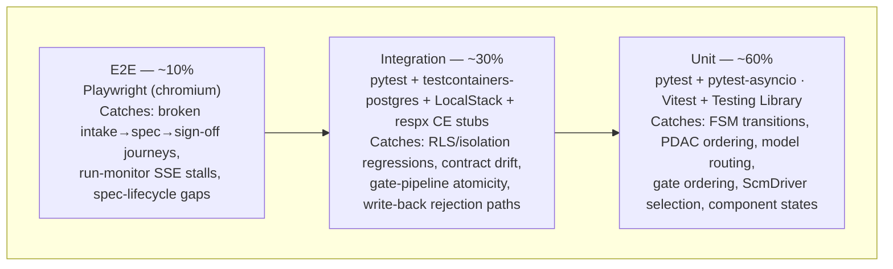

# Testing Strategy: Build Engine

## 1. Testing Pyramid Overview

The Build Engine M1 is a **backend-dominant** system — the dark-factory loop, the five safety
gates, repo bootstrap, and graph write-back are all server-side (the tasks mark E2E as N/A). Only
Request Studio and the run monitor carry UI, so the pyramid leans heavily on the pytest layers,
with a thin Vitest component band and a focused Playwright cap over the two user-facing surfaces.



| Layer | Tools | Coverage target | Mutation gate | Run in CI |
|-------|-------|-----------------|---------------|-----------|
| Unit | pytest + pytest-asyncio · Vitest + @testing-library/react | ≥ 80% (shared line target) | ≥ 70% delta-scoped (mutmut / Stryker) | Every push |
| Integration | pytest + testcontainers-postgres + LocalStack + fakeredis + respx | contributes to shared ≥ 80% | N/A (fake-infra non-determinism) | Post CE-M1 lane, every push |
| E2E | Playwright (chromium) | Request Studio + run-monitor critical paths | N/A | PR merge gate |

The mutation gate is **delta-scoped** — it scores only the lines changed in a task (mutmut for
Python, Stryker for TypeScript), matching the generated-code gate the engine itself enforces
(TASK-008 AC-5). Line coverage is the shared ≥ 80% target; mutation is ≥ 70% on the delta.

## 2. Unit Test Strategy

### Python (Build Engine API + Orchestrator)

```text
packages/backend/tests/unit/
├── test_spec_lifecycle_fsm.py    # build_specs / build_tasks / requests FSM transitions
├── test_pdac_loop.py             # PLAN→DELEGATE→ASSESS→CODIFY; CODIFY non-skippable; resume
├── test_model_router.py          # MODEL_ROUTING constants; ModelRoutingError halt
├── test_safety_gates.py          # 5-gate order (secret-scan first), atomicity, secret short-circuit
├── test_scm_driver.py            # GitHub/GitLab driver selection; fail-closed on unconfigured
├── test_dep_summary.py           # CODIFY writes breadcrumb; M1 read is best-effort non-blocking
├── test_writeback_coordinator.py # target-graph-from-context; spike no write-back; 422 rollback
├── test_hitl_controller.py       # fail-closed on audit outage; no-self-approval
└── conftest.py                   # shared fixtures (factories, fake clock, stub Agent SDK)
```

- Framework: `pytest` + `pytest-asyncio` (async FastAPI handlers + Fargate loop); `anyio` backend
- Coverage: `pytest-cov` with `--cov-fail-under=80`
- Mutation: `mutmut run` on delta — CI fails below 70% on changed lines
- Naming: `test_<function>_<scenario>_<expected_outcome>`
- Mocks: `pytest-mock` at I/O boundaries only (CE contract client, Secrets Manager, SCM SDK,
  Agent SDK transport) — never mock the FSM, the gate pipeline, model routing, or the write-back
  target derivation; those are the logic under test

#### Spec-lifecycle FSM

Each `requests` / `build_specs` / `build_tasks` transition (business-process.md §Spec Lifecycle
FSM, §Task State Machine) is asserted, including the invariant that a `build_task` cannot reach
`complete` without CODIFY (B3):

```python
def test_task_cannot_reach_complete_without_codify():
    task = BuildTask(status="in_progress", codify_checkpoint=None)
    with pytest.raises(CodifyRequiredError):
        task.transition("complete")  # CODIFY is non-skippable — DoD guarantee
```

#### PDAC loop transitions

- Turn-cap halt: `dispatch_count == 60` halts to HITL with state preserved (FR-041)
- Resume: a task with a committed `codify_checkpoint` resumes from it, never restarts (FR-042)
- CODIFY writes the dep-summary breadcrumb **before** the task is marked Done (FR-043/044)
- Dep-summary reader is **M1 best-effort non-blocking** — a missing predecessor summary does not
  hold the task (ENG-4 pass-through stub; full read-and-gate is M2)
- Pre-scaffold review runs but is a **non-blocking pass-through** in M1 (ENG-4 stub)

#### Model-routing table + `ModelRoutingError`

The routing table is a set of constants (`plan=claude-fable-5`; `delegate/assess/codify=
claude-sonnet-5` — two tiers only, the former third tier is dropped). A role resolving to no model in `ALLOWED_MODELS` raises
`ModelRoutingError` and halts the task; the engine never silently invokes a fallback model:

```python
def test_resolve_model_raises_and_halts_for_unapproved_role():
    with pytest.raises(ModelRoutingError):
        resolve_model("rogue_role")  # never silent-invokes a model outside ALLOWED_MODELS

def test_codify_routes_to_sonnet_only():
    assert resolve_model("codify")["model"] == "claude-sonnet-5"
```

#### Safety gates (ordering + atomicity)

The five M1 gates run in a fixed order with **secret-scan first** (architecture.md component notes;
TASK-008 AC-3): (1) secret-scan → (2) SAST → (3) type-check → (4) package-existence →
(5) delta-mutation ≥ 70%. Atomicity means one fail → none pass (nothing committed), and a
secret-scan hit short-circuits so no downstream gate runs:

```python
def test_secret_scan_hit_halts_before_any_downstream_gate(gate_runner):
    result = gate_runner.run(workspace_with_plaintext_secret())
    assert result.failed_gate == "secret_scan"
    assert result.gates_run == ["secret_scan"]  # SAST/type/pkg/mutation never invoked
    assert result.committed is False            # atomic — nothing committed
```

#### ScmDriver (mocked GitHub/GitLab providers)

Provider selection is data-driven from the `PLAT-SETTINGS-1` setting, not branched on strings
throughout the code (TASK-010). Both providers sit behind one `ScmDriver` interface; the SDK
transport is mocked:

```python
@pytest.mark.parametrize("provider,expected", [("github", GitHubDriver), ("gitlab", GitLabDriver)])
def test_scm_driver_selected_by_configured_provider(provider, expected):
    assert isinstance(scm_driver(provider), expected)

def test_bootstrap_halts_run_when_provider_unconfigured():
    with pytest.raises(RepoBootstrapError, match="repo_provider_unconfigured"):
        ensure_project_repo(project_iri, tenant_id)  # no Weave-internal fallback
```

### TypeScript (Request Studio UI)

```text
packages/frontend/src/
└── request-studio/
    └── __tests__/
        ├── IntakeForm.test.tsx        # NL prompt + graph-context selection, run-mode picker
        ├── SpecPreview.test.tsx       # SSE section streaming render; revise/submit states
        ├── SignOffPanel.test.tsx      # stakeholder list, unanimous-approval gating
        └── RunMonitor.test.tsx        # SSE run-status states (running/gating/complete/failed)
```

- Framework: `Vitest` (`jsdom`) + `@testing-library/react`
- Coverage: `@vitest/coverage-v8` — `--coverage.thresholds.lines=80`
- Mutation: Stryker with `@stryker-mutator/vitest-runner` — delta threshold ≥ 70%
- Naming: `should <expected behaviour> when <condition>`
- Mocks: `vi.mock()` at module boundaries; `msw` for HTTP + SSE; never mock rendering or pure logic

```typescript
it('should stream spec sections into the preview as SSE events arrive', async () => {
  render(<SpecPreview requestId="r1" />);
  server.send({ section: 'Overview', body: 'A customer-onboarding app…' });
  expect(await screen.findByText(/customer-onboarding app/i)).toBeInTheDocument();
});
```

### AC-to-test mapping (cross-cutting release gates)

These are the gates that span tasks; they must be green before M1 ship. Remaining task-level ACs
are mapped in each task brief's AC-to-Test Mapping table (the briefs are the per-task source of
truth; this table carries the cross-cutting gates).

| AC ID | EARS scenario | Test file | Test name |
|-------|---------------|-----------|-----------|
| ADR-001 iso | WHEN a tenant-B principal queries the state spine THEN THE SYSTEM SHALL return zero tenant-A rows | `test_isolation_rls.py` | `test_cross_tenant_read_returns_zero_rows` |
| CE-READ-1 iso | WHEN a SPARQL read omits a graph scope THEN THE SYSTEM SHALL reject it (unscoped-query rejected by the CE rewriter) | `test_isolation_rls.py` | `test_unscoped_query_is_rejected` |
| ADR-001 write | WHEN a write-back payload names another tenant's graph THEN THE SYSTEM SHALL reject it 403 and audit it | `test_writeback_coordinator.py` | `test_connector_write_isolation_rejects_foreign_graph` |
| FR-026 | WHEN a HITL approver principal equals the acting agent principal THEN THE SYSTEM SHALL reject the approval | `test_hitl_controller.py` | `test_no_self_approval_rejected` |
| FR-022 | WHEN a run operates in Spike mode THEN THE SYSTEM SHALL prevent any graph write-back or prod merge | `test_writeback_coordinator.py` | `test_spike_mode_never_writes_back` |
| FR-025 | WHEN a HITL gate fires and the audit service is unreachable THEN THE SYSTEM SHALL keep the gate closed | `test_hitl_controller.py` | `test_hitl_fails_closed_on_audit_outage` |
| FR-045 | WHEN a role resolves to no allowed model THEN THE SYSTEM SHALL raise ModelRoutingError and halt | `test_model_router.py` | `test_resolve_model_raises_and_halts_for_unapproved_role` |
| FR-061 | WHEN the SCM provider is unconfigured THEN THE SYSTEM SHALL halt before PLAN with no internal fallback | `test_scm_driver.py` | `test_bootstrap_halts_run_when_provider_unconfigured` |

The connector-write isolation case is a **mandatory release gate** (data-model.md §Cross-Tenant
Isolation Invariant) — it runs at both the unit boundary (target-graph derivation) and the
integration boundary (RLS + rewriter end to end).

## 3. Integration Test Strategy

Integration tests verify contracts between components against faked infrastructure — never real
cloud accounts (Law F). The isolation-critical CE rewriter is the one exception to stubbing:
**Build integration tests run only after CE M1 has landed and never stub the rewriter**
(business-process.md §Performance-Spike Degrade; weave-spec §1.2). Stubbing the enforcement point
would let a leak pass a green suite.

### Infrastructure fakes

| Service | Dev/test fake | How to start |
|---------|---------------|--------------|
| Aurora PostgreSQL | **testcontainers-postgres** (RLS policies applied in migration fixtures) — a real Postgres, not a LocalStack DB, so RLS is genuinely exercised | `Testcontainers` per session |
| S3 / Secrets Manager / SQS / Lambda (PLAT-* emission targets) | LocalStack via Docker Compose | `docker compose -f tests/integration/docker-compose.test.yml up localstack` |
| ElastiCache Redis (SSE fan-out, run pub/sub) | `fakeredis` | `fakeredis.FakeAsyncRedis()` fixture |
| CE contracts (CE-READ-1 / CE-WRITE-1 / CE-VERSION-1 / CE-DIFF-1) | `respx` HTTP stubs **pinned to `contracts.md` schemas** — for contract-shape + version-pinning tests only | fixture per contract |
| ADR-001 query rewriter / cross-tenant isolation | **NOT stubbed** — runs against the landed CE M1; the isolation lane is gated to start only after CE M1 ships | real CE M1 endpoint |
| External SCM (GitHub / GitLab) | mocked provider driver (fake repo handles) — no real repos created | `fake_scm` fixture |
| Bedrock / AgentCore (agents) | stubbed Agent SDK transport — no real model calls in the pyramid; agent quality evals live in `docs/standards/testing-agents.md` CI lane | fixture |

RLS is tested against **real Postgres** (testcontainers), because a fake DB layer that ignores
`current_setting('app.tenant_id')` would silently pass a cross-tenant read. The Agent SDK
transport is stubbed so the loop and gates are exercised deterministically; model-behaviour
quality is a separate agent-eval lane, not part of this pyramid.

### Directory layout

```text
packages/backend/tests/integration/
├── conftest.py                    # testcontainers-postgres (RLS), LocalStack, fakeredis, respx CE stubs
├── docker-compose.test.yml
├── test_isolation_rls.py          # two seeded tenants; cross-read returns zero rows (release gate)
├── test_spec_lifecycle.py         # request→sign-off→approved→run through the real FSM + Postgres
├── test_dark_factory_run.py       # one PDAC cycle; state-spine commit; dispatch_count increments
├── test_generation_gates.py       # 5-gate pipeline over a fixture workspace; atomic rollback path
├── test_writeback.py              # CE-WRITE-1 201 path + 422 SHACL-reject → HITL (no blind retry)
├── test_repo_bootstrap.py         # mocked SCM: create repo, initial commit, audit event, no token leak
├── test_hitl_gate.py              # PLAT-NOTIFY-1 gate events; fail-closed on audit outage
└── test_ce_client_contracts.py    # CE-READ-1 pagination, CE-VERSION-1 pinning, unavailable propagation
```

### Fixture patterns

```python
@pytest.fixture(scope="session")
def pg_url():
    with PostgresContainer("postgres:16") as pg:  # real Postgres — RLS genuinely enforced
        apply_migrations_with_rls(pg.get_connection_url())
        yield pg.get_connection_url()

@pytest.fixture
def ce_read_stub(respx_mock):
    respx_mock.get(url__regex=r".*/api/sparql").respond(
        json=CE_READ_1_GROUNDING_FIXTURE)  # shape-validated against contracts.md models
    return respx_mock

@pytest.fixture
def fake_scm():
    return FakeScmDriver()  # records create_repo / write_initial_commit; no real repo, no token echo
```

### Must cover

- Aurora RLS + repo-layer tenant base filter together (defence-in-depth, both asserted); two-tenant
  cross-read returns zero rows (release gate, data-model.md §Cross-Tenant Isolation Invariant)
- The full spec lifecycle FSM through real Postgres rows (request → sign-off → approved → run)
- One complete PDAC cycle: dispatch, CODIFY dep-summary write, blocking state-spine commit
- The five-gate pipeline over a fixture workspace, including atomic rollback (workspace cleaned,
  nothing committed) and the secret-scan short-circuit
- Write-back: CE-WRITE-1 201 success and 422 SHACL-rejection → HITL (Build does not blindly retry)
- Repo bootstrap against a mocked provider: repo created, boilerplate committed, `repo_bootstrapped`
  audit event emitted, and the SCM token never present in any response or log line
- CE contract client: version pinning, pagination, and error → defined unavailable state (503)

### Must NOT

- Call real AWS endpoints or create real GitHub/GitLab repos (no real credentials anywhere)
- Stub the ADR-001 query rewriter or run the isolation lane before CE M1 has landed
- Make real model calls (Agent SDK transport is always stubbed in the pyramid)
- Share state between tests (ephemeral fixtures per test; tenant seeds per test)

## 4. E2E Test Strategy

Framework: Playwright (TypeScript), against the locally started assembled app (`TEST_BASE_URL`,
default `http://localhost:3000`), LocalStack- and testcontainers-backed API. E2E is deliberately
thin — most of Build M1 is backend (the tasks mark generation, the loop, and bootstrap as
integration-covered). E2E covers only the two user-facing surfaces: Request Studio and the run
monitor.

```text
tests/e2e/
├── playwright.config.ts           # baseURL from env; workers: CI ? 1 : 4; artifacts on failure
├── fixtures/
│   ├── auth.fixture.ts            # authenticated page per role (requestor, approver)
│   └── seed.fixture.ts            # two-tenant seed + golden task-brief for isolation journeys
├── request-studio.spec.ts         # intake → AI spec draft (SSE) → submit → sign-off (unanimous)
├── spec-lifecycle.spec.ts         # draft → pending_review → approved → run enqueued
└── run-monitor.spec.ts            # SSE run-status streaming: running → gating → complete / failed
```

| AC ID | EARS scenario | Spec file | Status |
|-------|---------------|-----------|--------|
| EPIC-001 | WHEN a requestor submits an NL prompt THEN THE SYSTEM SHALL stream an AI-drafted spec section by section | `request-studio.spec.ts` | Planned |
| Sign-off | WHEN all stakeholders approve THEN THE SYSTEM SHALL advance the request to `approved` and enqueue the run | `request-studio.spec.ts` | Planned |
| FSM | WHEN a spec passes the review gate THEN THE SYSTEM SHALL move it Draft → Approved | `spec-lifecycle.spec.ts` | Planned |
| Run monitor | WHEN a run progresses THEN THE SYSTEM SHALL stream status transitions to the monitor over SSE | `run-monitor.spec.ts` | Planned |

Minimum scenarios (always required): happy path (intake → spec draft → sign-off → run enqueued),
auth guard (unauthenticated → login redirect), error state (CE unavailable → spec drafting
degrades honestly with an "unavailable — review manually" banner, not a blank screen — FR-002/003).
Accessibility: `axe-core` assertions run inside the E2E suite on Request Studio and the run
monitor — zero violations is a release gate.

CI gate: E2E runs on the PR merge gate only; unit + integration run every push. The Build E2E
suite consumes the same Playwright install as the platform `ui_verify` gate.

## 5. Test Data Management

| Layer | Strategy | Rationale |
|-------|----------|-----------|
| Unit | Inline factories (`make_project`, `make_task_brief`, `make_run`, `makeRequest`) | Fast, deterministic, no I/O |
| Integration | pytest fixtures + per-session testcontainers Postgres; two-tenant seed helper; golden task-brief fixtures; fake SCM repos | Isolation is itself under test — seeds must be per-test |
| E2E | Playwright `seed.fixture.ts` calling a test-only seed endpoint (disabled outside test env) | Reproducible starting state for the intake→sign-off journey |

**Golden task-brief fixtures.** The dark-factory loop and generation gates consume a validated
`TaskBrief` (schema_version, EARS ACs, dep_chain, cost_estimate). A small set of golden briefs —
one clean, one with a missing predecessor summary, one spike-mode — drives the loop and write-back
tests deterministically.

**Two-tenant seed.** Every isolation test seeds tenant A and tenant B with distinct projects,
runs, and state-spine rows, then asserts a tenant-B principal sees zero tenant-A rows.

**Fake SCM repos.** The `FakeScmDriver` records `create_repo` / `write_initial_commit` /
`commit_workspace` calls and returns opaque handles — no real repository is created, and the fake
never echoes the provider token.

```python
def make_task_brief(task_id="urn:weave:brief:t1", schema_version="1.0.0",
                    acceptance_criteria=None, dep_chain=None, run_mode="spec_to_build", **overrides):
    return TaskBrief(task_id=task_id, schema_version=schema_version,
                     acceptance_criteria=acceptance_criteria or [], dep_chain=dep_chain or [],
                     run_mode=run_mode, **overrides)
```

```typescript
export const makeRequest = (overrides: Partial<BuildRequest> = {}): BuildRequest => ({
  requestId: crypto.randomUUID(),
  prompt: "Build a customer-onboarding tracker",
  runMode: "spec_to_build",
  status: "draft",
  ...overrides,
});
```

Prohibited: shared mutable test databases; hardcoded UUIDs/IDs; production data snapshots
(synthetic only — Law F); real provider tokens or secrets in fixtures (fake values via `faker`);
asserting on wall-clock time (inject a `FIXED_CLOCK` — the resume/checkpoint and provenance-timestamp
tests depend on deterministic timestamps).

## 6. Performance and Load Testing

The Build Engine exposes the Request Studio spec stream and the run-queue surface — this section
applies. Targets are the PRD §2.2 configurable defaults (provisional, not contractual SLAs) and
mirror architecture.md §Quality Attributes.

| Endpoint / flow | Method | P50 target | P95 target | P99 target |
|-----------------|--------|-----------|-----------|-----------|
| Spec drafting first token (E1-S1) | SSE | ≤ 2 s | ≤ 5 s | 60 s total timeout |
| `POST /api/projects/{iri}/runs` (enqueue) | POST | < 100 ms | < 300 ms | < 500 ms |
| `GET /api/state/{iri}` (state-spine read) | GET | < 50 ms | < 150 ms | < 300 ms |
| State-spine commit (blocking, per task) | internal | < 200 ms | < 400 ms | < 500 ms |
| `CE-WRITE-1` write-back (E9-S1) | POST | < 5 s | < 15 s | < 30 s |

Load tool: `locust`, in the `performance` CI workflow (weekly schedule + any PR touching a
hot-path surface). The two hot paths are **spec streaming** (Request Studio's SSE draft) and
**run-queue throughput** (enqueue + state-spine read/commit under concurrent runs):

```python
class BuildUser(HttpUser):
    wait_time = between(1, 3)

    @task(3)
    def stream_spec_draft(self):
        with self.client.get("/api/requests/r1/draft", stream=True, name="spec-stream") as r:
            for _ in r.iter_lines():
                break  # measure time-to-first-token, not full-draft latency

    @task(1)
    def enqueue_run(self):
        self.client.post("/api/projects/p1/runs", json={"run_mode": "spec_to_build"})
```

The blocking 500 ms p99 state-spine commit (TASK-006 AC-8) and the ≤ 10 min p95 full generation
pipeline (E8-S1) are asserted as timing checks — the state-spine commit in the integration lane
(`asyncio.wait_for(..., timeout=0.5)` → task stays `In Progress`, never silently Done) and the
generation pipeline as a run-timing assertion in the E2E/integration lane, with locust guarding
the spec-stream and run-queue latency budgets.

### Definition-of-Done command set

Every task closes against the same mechanically-verifiable commands (CLAUDE.md §Conventions;
per-task DoD checklists):

```bash
uv run ruff check .                       # lint — zero errors
uv run mypy --strict app/                 # type-check
uv run pytest --cov=app --cov-fail-under=80   # unit + integration, ≥ 80% line coverage
uv run mutmut run                         # mutation ≥ 70% on delta
uv run bandit -r app/ -ll                 # SAST — no MEDIUM+ findings
```

The TypeScript surface adds `pnpm vitest run --coverage` (≥ 80% lines/functions) and
`npx stryker run` (≥ 70% delta) for Request Studio components.

---

*Generated by Weave arch-quality skill. Review and approve before task decomposition.*
