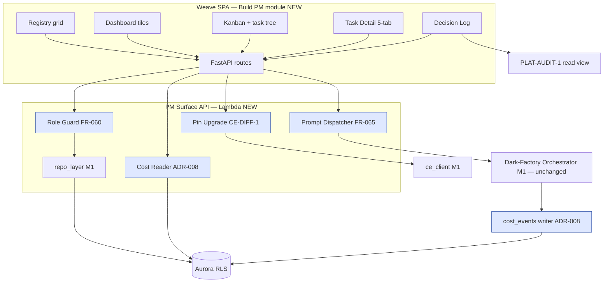

# Build Engine — v1.0 Tech-Spec Delta (PM surfaces)

**Scope rule:** changes from M1 + M2 only. `architecture.md`, `data-model.md`,
`business-process.md`, `testing-strategy.md`, and `m2-delta.md` stay authoritative for
everything not restated here. Contract shapes stay canonical in
[`contracts.md`](../../../contracts.md). Decisions: [ADR-008](../decisions/ADR-008.md)
(per-task cost attribution).

> **Scope ruling record (coordinator + human, 2026-07-08):** FR-032 (GE-CANVAS-1
> project-ontology embed) **stays post-v1** per the committed roadmap — no embed, no ADR, no
> GE-CANVAS-1 layout-scope amendment this milestone; GE-CANVAS-1 remains unimported in Build
> (the M2 invariant carries forward). CE-FUNCTION-1 *execution* is **post-v1** (CE ADR-009,
> deferred 2026-07-08); **no Build v1.0 surface invokes function execution** — executable-SDK
> binding uplift is out of Build v1 scope (SDK methods keep raising `NotExecutableUntilPostV1`).

## 1. Open questions closed at v1.0

| OQ | Disposition |
|---|---|
| OQ-05 | CLOSED — Build-local `cost_events` rollup, "estimated" label; PLAT-BILLING-1 stays invoicing SoR. ADR-008. |
| OQ-07 | Already answered by M1 practice — runs record `branch` + `commit_sha`; the git ribbon reads those rows; no new strategy decision needed. |
| OQ-08 / OQ-09 | Still open — no v1.0 story consumes the template library or policy-as-code format. |

## 2. Architecture delta (extends architecture.md C4 L2/L3 — Arch Law 5)

v1.0 adds **one container** (the Build PM module inside the shared Weave SPA — the first Build
pages) and **one Lambda surface** (PM Surface API). Everything else reuses M1/M2 components;
both choke points unchanged (`repo_layer`, `ce_client`).

- **Build PM module (SPA)** — Next.js 15 routes in the single Weave SPA: Registry grid,
  Project Dashboard, Kanban + task tree, Task Detail (5-tab panel), Decision Log, project
  settings tabs. All styling from `docs/standards/design/` tokens (no ad-hoc hex/px); passes
  the `ui_verify` gate. Each Dashboard tile fetches its own endpoint and renders a localized
  error state on failure — one upstream outage never blanks the page (FR-013 AC).
- **PM Surface API** — FastAPI/Lambda (same family as the lifecycle API): projects grid,
  dashboard tile reads, board/task-tree, task detail, decision log, costs, contributors,
  bindings, pin upgrade, prompts. Short-lived reads/writes — Lambda per D6.
- **Role Guard (FR-060)** — FastAPI dependency on every PM mutation: resolves the caller's
  per-project role from `project_contributors`, overlays company/domain admin-owner grants read
  from the **PLAT-IDENTITY-1 JWT `roles` claim** (tenant + project/domain-scoped grants — the
  single contracted source for mutation gates; there is NO workspace-role claim, workspace level
  dropped 2026-07-08), with effective RBAC precedence via `PLAT-SETTINGS-1`; enforces
  admin/editor/reader semantics; denial = 403 + `PLAT-AUDIT-1` entry. All company (tenant) users
  read any project (no read guard beyond tenancy).
- **Prompt Dispatcher (FR-065)** — accepts a project-scoped prompt, records it, and enqueues a
  standard dark-factory run (`trigger = prompt`) through the existing lifecycle enqueue path.
  No new run machinery: turn caps, gates, HITL, and repo targets (FR-061) apply verbatim.
  Output = PRs/amendments to code, specs, and backlog on the project's external repo.
- **Pin Upgrade flow (FR-012)** — `ce_client` proxies `CE-DIFF-1` (nodes+edges since pin) for
  display; upgrade requires explicit confirmation, updates `pinned_graph_version_iri`, and
  emits a `PLAT-AUDIT-1` entry. Staleness read (M2, FR-036) is the trigger surface.
- **Cost Reader (ADR-008)** — aggregate endpoint over `cost_events`; the FR-008 breach check
  in the orchestrator reads the same rollup synchronously at each safe checkpoint.
- **Run-Log Sink (Console tab source)** — net-new: M1 code emits Python logging only (no
  persisted run log — verified in `build/orchestrator.py`). The orchestrator gains a structured
  per-run log sink writing NDJSON to S3 and setting `generation_runs.log_location_ref` at run
  end; the Console tab reads the pointer (live tail stays on the existing Redis run-status
  pub/sub). S3 over a CloudWatch read-path: no CW IAM surface in the PM API, trivially stubbed
  locally (Law F).
- **Source-control provider config UI (E2-S6, FR-061/B9)** — settings tab surfacing the M1
  backend config: provider select (GitHub/GitLab) + write-only token entry. Build writes the
  token straight to Secrets Manager and stores/returns **the reference name only** — no API
  response, log, or page ever carries the token value (M1 SCM-token confidentiality invariant
  extended to the UI). Task: v1 TASK-023.
- **Visual-state capture producer (FR-020)** — net-new: nothing in M1/M2 produces the 8-state
  captures manifest (verified — the Tests tab would be permanently hollow without it). The
  QA/ASSESS lane gains a Playwright capture step for UI-bearing tasks writing
  `{output_location_ref}/captures/{state}.png` + `manifest.json`; non-UI tasks produce no
  manifest and the tab renders honest absence. Lands with TASK-009.
- **External bindings (FR-010)** — settings tab stores Confluence/Jira/ServiceNow references
  keyed by the **connector instance handle** (PLAT-CONNECTOR-1, finalised: instance-scoped, so
  two connectors of the same type never collide); no credential in Build. Binding health
  renders from the contract's health-read API (`status, last_sync, last_error, error_count`,
  incl. skipped-count); unbound slots render "available when connectors ship" until Platform
  v1 connector delivery is live — binding tasks carry that DAG dependency.



## 3. Endpoints + p95 targets (Arch Law 2 — new v1.0 surface only)

All routes tenant-scoped (RLS + repo-layer filter) and role-guarded per FR-060 (mutations).

| Endpoint | p95 target | Notes |
|---|---|---|
| `GET /api/projects` (filter + name search) | ≤ 300 ms | Registry grid; paginated |
| `PATCH /api/projects/{id}/settings` | ≤ 500 ms | model tier, caps (cascade-validated) — admin only |
| `GET /api/projects/{id}/dashboard/{tile}` | ≤ 400 ms | one endpoint per tile; tile-isolated errors |
| `GET /api/projects/{id}/costs` | ≤ 300 ms | ADR-008 rollup; `estimated` label in payload |
| `GET /api/projects/{id}/board` | ≤ 500 ms | six lanes, 50 tasks (NFR: render ≤ 1 s total) |
| `GET /api/projects/{id}/task-tree` | ≤ 500 ms | flagged orphans, never dropped |
| `GET /api/projects/{id}/tasks/{task_id}` | ≤ 400 ms | Brief/Handoff/Tests/Console pointers |
| `GET /api/projects/{id}/tasks/{task_id}/audit` | ≤ 800 ms | PLAT-AUDIT-1 filtered read; unreachable ⇒ "audit unavailable" |
| `GET /api/projects/{id}/decisions?search=` | ≤ 800 ms | read-only PLAT-AUDIT-1 view, paginated |
| `GET/PUT/DELETE /api/projects/{id}/contributors[/{principal}]` | ≤ 400 ms | admin only; denial audited |
| `GET/PUT /api/projects/{id}/bindings` | ≤ 400 ms | instance-handle references only; health via PLAT-CONNECTOR-1 read API |
| `GET /api/projects/{id}/pin-diff` | ≤ 2 s | CE-DIFF-1 proxy (CE-bound latency) |
| `POST /api/projects/{id}/pin-upgrade` | ≤ 800 ms | explicit confirm; audited |
| `POST /api/projects/{id}/prompts` | ≤ 500 ms | 202 + run handle; reader ⇒ 403 + audit |
| `GET/PUT /api/projects/{id}/source-control` | ≤ 500 ms | provider + token reference name only; token write-only to Secrets Manager, never echoed |

## 4. Aurora delta (extends data-model.md — same RLS + repo-layer pattern)

Four new tables, two column adds. Everything else reuses existing tables (git ribbon = recent
`generation_runs.branch/commit_sha`; Tests-tab captures = `{output_location_ref}/captures/`
manifest convention inside the existing bundle — no schema change).

```sql
CREATE TABLE project_contributors (
    tenant_id      UUID NOT NULL,
    project_id     UUID NOT NULL,
    principal_iri  TEXT NOT NULL,          -- PLAT-IDENTITY-1 human principal
    role           TEXT NOT NULL CHECK (role IN ('admin','editor')),
    added_by       TEXT NOT NULL,
    added_at       TIMESTAMPTZ NOT NULL DEFAULT now(),
    PRIMARY KEY (tenant_id, project_id, principal_iri)
);

CREATE TABLE external_bindings (
    tenant_id      UUID NOT NULL,
    project_id     UUID NOT NULL,
    binding_id     UUID NOT NULL DEFAULT gen_random_uuid(),
    system         TEXT NOT NULL CHECK (system IN ('confluence','jira','servicenow')),
    connector_ref  TEXT NOT NULL,          -- PLAT-CONNECTOR-1 connector INSTANCE handle
    space_ref      TEXT NOT NULL,          -- space / board / project key in the target system
    created_by     TEXT NOT NULL,
    created_at     TIMESTAMPTZ NOT NULL DEFAULT now(),
    PRIMARY KEY (tenant_id, binding_id),
    UNIQUE (tenant_id, project_id, system, space_ref)
);

CREATE TABLE cost_events (                  -- ADR-008
    tenant_id          UUID NOT NULL,
    cost_event_id      UUID NOT NULL DEFAULT gen_random_uuid(),
    project_iri        TEXT NOT NULL,
    task_id            TEXT,                -- NULL for non-task work (drafting, replans)
    run_id             UUID,                -- NULL for non-run work
    agent_role         TEXT NOT NULL,
    model              TEXT NOT NULL,       -- confirmed Claude IDs only
    tokens_in          BIGINT NOT NULL,
    tokens_out         BIGINT NOT NULL,
    cost_estimate_usd  NUMERIC(12,6) NOT NULL,  -- PLAT-SETTINGS-1 rate card, never hardcoded
    recorded_at        TIMESTAMPTZ NOT NULL DEFAULT now(),
    PRIMARY KEY (tenant_id, cost_event_id)
);
CREATE INDEX idx_cost_events_rollup ON cost_events (tenant_id, project_iri, task_id);

-- generation_runs: prompt-triggered runs (FR-065) + console log pointer
ALTER TABLE generation_runs ADD COLUMN trigger TEXT NOT NULL DEFAULT 'request'
    CHECK (trigger IN ('request','prompt'));
ALTER TABLE generation_runs ADD COLUMN log_location_ref TEXT;  -- S3 URI, Console tab source

-- prompt record (FR-065): prompt text + who + resulting run
CREATE TABLE project_prompts (
    tenant_id      UUID NOT NULL,
    prompt_id      UUID NOT NULL DEFAULT gen_random_uuid(),
    project_id     UUID NOT NULL,
    principal_iri  TEXT NOT NULL,
    prompt_text    TEXT NOT NULL,
    run_id         UUID,                    -- FK generation_runs; set on enqueue
    created_at     TIMESTAMPTZ NOT NULL DEFAULT now(),
    PRIMARY KEY (tenant_id, prompt_id)
);
```

RLS + repo-layer base filter identical to every Build table (D3). Roles: readers have **no
row** in `project_contributors` — read access is company (tenant) membership; the company/domain
admin-owner overlay resolves from the JWT `roles` claim (PLAT-IDENTITY-1) + `PLAT-SETTINGS-1`
precedence, not from this table.

## 5. Surface honesty rules (carry the M1 D5 posture onto pages)

Every failure state named in the epics is a UI state, not an exception path:

- Dashboard tile source error ⇒ tile-local error state; page renders (FR-013).
- Demo deploy failed ⇒ prior demo URL retained + error surfaced; never a false green.
- Audit unreachable ⇒ "audit unavailable" on Decision Log and Audit tab; never fabricated,
  never blank (FR-027, FR-020).
- Board filter resolves to zero ⇒ empty-state + reset to "All"; never a blank board (FR-017).
- Missing `blocked_by` predecessor ⇒ flagged node in the task tree, not dropped (FR-016).
- Agent state colour-coding always paired with a visible legend — never colour alone
  (FR-015 AC; WCAG 1.4.1).
- Staleness unknown (CE unreachable) ⇒ "unknown", never "current" (M2 rule, now visible).
- Cost figures always labelled "estimated" (ADR-008).
- Binding health unknown (connector unreachable) ⇒ "health unavailable", never a fake green
  (FR-010, mirrors the connector contract's honesty rule).

## 6. Pages + Lighthouse targets (Arch Law 3 — first Build milestone with pages)

House bar (GE/CE precedent): **Performance ≥ 90, Accessibility ≥ 95, Best-practices ≥ 90**,
Lighthouse CI on every PR touching a Build route. All pages consume `docs/standards/design/`
tokens exclusively and pass `ui_verify`.

| Page | Extra render budgets |
|---|---|
| Registry grid | grid interactive ≤ 1 s at 100 projects |
| Project Dashboard | tiles render independently; below-fold tiles lazy-loaded |
| Kanban + task tree | ≤ 1 s with 50 tasks; lane filter switch ≤ 100 ms (NFR) |
| Task Detail panel | tab switch ≤ 200 ms; captures lazy-loaded |
| Decision Log | first page of results ≤ 1 s |

## 7. Testing-strategy delta (extends testing-strategy.md)

Coverage/mutation bars unchanged (line ≥ 80%, delta mutation ≥ 70%). New named conformance
tests (each maps to an AC in a v1 task brief); all fixtures local — Law F, no cloud
(Aurora testcontainer, PLAT-* stubs, Playwright for pages):

- `should render tile error state and keep page alive when one tile source fails`
- `should retain prior demo url and surface error when deploy fails`
- `should show audit unavailable when PLAT-AUDIT-1 unreachable` (Decision Log + Audit tab)
- `should show empty state and reset to All when filter matches zero tasks`
- `should flag missing blocked_by predecessor instead of dropping node`
- `should display state legend alongside colour coding on board and tree`
- `should return 403 and audit entry when reader submits prompt`
- `should enqueue dark-factory run with trigger prompt when editor submits prompt`
- `should halt run at next checkpoint when cost rollup breaches binding cap`
- `should label all cost figures estimated`
- `should require explicit confirmation before pin upgrade and audit it`
- `should deny settings mutation to editor and allow to admin`
- `should synthesise typed brief from prompt before delegate` (FR-065 × FR-046)
- `should write captures manifest for ui task during assess` (FR-020 producer)
- `should never echo source-control token in any response` (E2-S6)
- `should show health unavailable when connector health read fails`
- `should return zero tenant-B rows for every new v1 table` (two-tenant fixture)

## 8. Delivery — Arch Law 9 statement

Build v1.0 adds **no new deploy surface**: pages ride the existing SPA deploy; the PM Surface
API rides the existing Lambda API family deploy; the migrations ride the existing migration
pipeline. No new workflow files; no env-schema delta — all new tunables (rate card, breach
check, staleness threshold) resolve via `PLAT-SETTINGS-1`. The M1 env-schema/workflow-stub gap
remains the inherited coordinator-tracked item noted in `m2-delta.md` §9.

## 9. Invariants (Arch Law 10)

The v1 invariant set lives in [`invariants.md`](invariants.md) §v1 invariants (one verify-by
selector per entry), alongside the M1 pointer and M2 set — same pattern as `m2-delta.md`.
