# Constitution Engine

> The authoritative, standards-based knowledge-graph layer that holds a company's operating
> model, so business and technical users can collaboratively author, validate, query, and trust
> a live RDF/OWL model of how the company runs — starting from a process-centric
> business-process-modelling-ontology (BPMO) framework in which **processes sit at the centre**,
> linked to the data they consume and produce, the systems and services that run them, the
> capabilities they realize, the governance that bounds them, the goals they serve, and the
> actors that perform them. This is the "business brain": the model an autonomous agent reasons
> **within the bounds of**. It is the single source of truth every other Weave engine (Build,
> Events & Actions, Graph Explorer) reads from; if the Constitution Engine is wrong, nothing
> generated downstream can be right. The engine is the **MVP — it ships first** — and is the
> **inter-engine contract hub** owning the seven `CE-*` contracts.

## 1. Brief

### Mission

We are building the Weave Constitution Engine so that business and technical users can
collaboratively author, validate, query, and trust a live RDF/OWL model of how the company runs,
starting from a **business-process-modelling-ontology (BPMO) framework** in which **processes sit
at the centre**, linked to the data they consume and produce, the systems and services that run
them, the capabilities they realize, the governance and constraints that bound them, the goals
they serve, and the actors and roles that perform them. This is the "business brain": the model an
autonomous agent reasons within the bounds of — what to do, when, with which system, who to
contact, and what it may *not* do. This is Weave's durable differentiator, not the RDF substrate
(a standards-based triple store is commodity); the value is that the model grounds generation and
agent behaviour in what the business has declared true and permitted. Weave ships the framework
(the grammar) on top of which clients build their own domain taxonomy and instances (the
sentences).

### Problem

Building an authoritative, machine-reasoned model of how a company operates is today either
impossibly expert-bound or hopelessly informal — there is no middle.

- **Formal semantic tooling is expert-only.** Tools like Protégé expose raw OWL/RDF and assume a
  knowledge engineer. A business analyst cannot use them, so the people who actually understand
  the operating model are locked out of authoring it.
- **Informal tooling is not reasoned or validated.** CMDBs, EA repositories, and wikis hold
  loosely-structured data with no formal semantics, no constraint validation, and no provenance —
  so the model cannot be trusted, queried rigorously, or used to drive generation.
- **Everyone starts from a blank page.** Teams that attempt a formal model spend months designing
  the structural scaffolding (entity kinds, relationship types, validation, version and provenance
  plumbing) before capturing a single real fact about their business — instead of starting from a
  ready-made framework and writing their own domain taxonomy on top.
- **No shared, live authoring.** Where models exist, they are single-author artefacts that drift;
  business and technical stakeholders cannot co-edit one trusted graph.

The people who feel this are **enterprise architects and ontologists** (forced to choose between
rigour and usability) and the **operations and business analysts** who hold the real knowledge but
cannot encode it. If this is not solved, the graph at the heart of Weave is never populated with
trustworthy content — and every downstream engine inherits a model that is either too thin to be
useful or too informal to be safe to generate from.

### Vision (12-month success)

- **A populated graph of record.** A real client has built their own domain taxonomy on top of the
  shipped BPMO framework, populated it with real entities and relationships, and treats that graph
  — not a spreadsheet or CMDB — as the authoritative description of how they operate.
- **Business users author safely.** A non-technical user adds and edits ontology content through
  natural language and guided forms; every change is validated against SHACL shapes before commit,
  so usability never costs correctness.
- **The model is queryable and reasoned.** Stakeholders answer real operating-model questions
  through SPARQL (directly or via generated queries), and OWL reasoning surfaces inferred
  relationships and inconsistencies the authors did not state explicitly.
- **Every change is provenance-tracked.** Who changed what, when, and why is captured as PROV-O,
  so the graph is auditable and trustworthy enough to govern downstream generation.
- **Downstream engines consume it.** At least one other engine (Build, Events & Actions, or Graph
  Explorer) reads the graph through a stable interface, proving it functions as the shared source
  of truth rather than a standalone editor.

### Scope — In Scope

The engine holds two things: the **governed content** that constitutes the company (its structure,
vocabulary, identity, and rules) and the **engine capabilities** that make that content
trustworthy and consumable.

**Governed content the graph holds**

- **The BPMO framework (the grammar, not the taxonomy).** A shipped, process-centric,
  ArchiMate-3-aligned **business-process-modelling ontology** plus W3C SHACL/PROV-O/SKOS
  scaffolding. The shipped **kinds** (13) are: **Process, Activity** (a task/step within a
  process), **Event** (a trigger or boundary event), **DataAsset** (with **Field** for its
  columns/attributes, and document/artefact content), **System, Service, BusinessCapability,
  BusinessDomain, Policy** (a constraint, rule, regulatory requirement, or principle that bounds
  behaviour), **Goal** (a motivation, driver, or outcome), **Actor** (a role, person, or
  service-account identity), **Concept** (SKOS glossary term) and **Class** (OWL type). The shipped
  **relationship types** connect them so a process is fully situated: a Process (or Activity)
  **consumes** and **produces** DataAssets, is **performedBy** an Actor, runs as or **dependsOn** a
  Service that **runsOn** a System, **realizes** a BusinessCapability that **servesGoal** a Goal and
  sits **inDomain** a BusinessDomain, is **governedBy** a Policy, is **triggeredBy** an Event and
  **hasStep** its Activities; plus **accesses** (Service→DataAsset), **describes** (e.g. a Concept
  describing an entity), **partOf**, and the SKOS **broader/narrower/related** links. This is a
  *framework*, NOT a populated business taxonomy: Weave ships no client-domain vocabulary. Clients
  build their own domain taxonomy and instances on top. "Weave provides the grammar; the company
  writes the sentences." The framework is aligned to **ArchiMate 3** (business, application,
  technology, motivation, and strategy layers); **REA** (resource-event-agent economic patterns)
  and **UFO** (foundational-ontology rigour) inform the design behind the curtain but are never
  exposed to the user. (Detailed attributes and relationship cardinalities are specified in the
  data-model tech spec.)
- **Business glossary / controlled vocabulary (SKOS).** Canonical definitions of business terms
  with preferred labels, synonyms/alt-labels, and broader/narrower relationships, so the
  organisation shares one agreed meaning per term and downstream generation uses consistent
  language.
- **Brand, voice & communication standards.** Tone of voice and brand styleguides (visual identity
  — logo usage, colour, typography — and writing style) held as machine-readable, governed assets,
  so artefacts the Build Engine generates are brand- and voice-compliant by construction.
- **Governance, policy & compliance constraints.** The rules the business operates under —
  technology-stack standards, regulatory and compliance obligations (e.g. GDPR, SOC 2,
  industry-specific), security and data-handling policies, and business rules — modelled as
  first-class graph content so they can constrain and guardrail what downstream engines generate
  and automate.
- **Strategic / motivation layer.** Mission, vision, goals, drivers, and principles (the ArchiMate
  motivation layer — the "why"), linked to the capabilities and processes that serve them.

**Engine capabilities**

- **Artefact & document ingest (cold-start population).** First-class, AI-assisted import of a
  company's *existing* model so they do not start from a blank page: conversational ingest of
  enterprise documents (a BPM, policy, runbook, process doc) where an agent extracts candidate
  entities/relationships and proposes additions through the chat panel, linked to the resources the
  graph already holds; structured model import (ArchiMate Exchange Format, BPMN); diagram/image-to-
  data via a vision model; structured-data import via W3C R2RML (relational/CMDB) and RML
  (CSV/JSON/XML); and SKOS cross-notation reconciliation. Every path writes through the same
  validated mutation API with PROV-O attribution. This is user-supplied, materialised-copy import —
  distinct from the platform's live managed connectors — and is the adoption lever for clients
  leaving Bizzdesign / LeanIX / MEGA.
- **RDF/OWL knowledge graph store.** Persisting all of the above as RDF, with OWL 2 DL semantics.
  Oxigraph for dev/test; production store decided in the tech spec.
- **Authoring surfaces — NL *and* forms, both in v1.** Natural-language (chat) editing AND
  SHACL-shape-driven guided forms that let business and technical users create and modify any of the
  governed content without writing RDF/SPARQL. Both surfaces ship in v1; neither is deferred.
- **SHACL validation.** Every committed change is validated against SHACL shapes; invalid changes
  are rejected or flagged before they enter the trusted graph.
- **SPARQL 1.1 query (SELECT-only, paginated).** Programmatic and user-facing querying of the graph,
  including queries generated from natural language. The query surface is SELECT-only, blocks the
  `SERVICE` keyword (SSRF), and paginates (no silent row cap). Writes never go through raw SPARQL
  Update — only through the validated mutation operations API.
- **Agent-grounding read capability.** Because processes are linked to the systems, data, actors,
  capabilities, and governance that surround them, the graph expresses what an agent **may** do, on
  **which** systems and data, within **which** process, and **who** to contact or escalate to. The
  engine exposes these agent-authority questions as read-side SPARQL over the BPMO graph (e.g.
  "which steps may an autonomous agent execute alone vs. route to a human", "who may read this
  sensitive data asset", "which actor does this exception escalate to") so downstream agents reason
  **within** the bounds the model states rather than from hardcoded policy. This corroborates the
  platform's separation of the model layer (what is true and permitted) from the execution layer
  (what an agent actually does at run time).
- **OWL reasoning.** Inference of implied relationships and detection of logical inconsistencies.
- **PROV-O provenance + versioning.** Every change records who, what, when, and why; history is
  auditable.
- **Draft → published version lifecycle.** The ontology, glossary, and governed content are authored
  in a draft state and versioned on publish; each published version carries an identifier and a
  PROV-O change log of what changed. Downstream projects (Build) and automations (Events) pin to a
  specific published version, so model evolution never silently breaks what depends on it.
- **A stable read interface** other engines consume to read the graph as the source of truth,
  addressable by published version.

### Scope — Out of Scope

- **Graph visualisation and the collaborative canvas** — the force-directed view, drill-in focus
  views, and the structured C4 view belong to the **Graph Explorer** engine (embeddable via contract
  GE-CANVAS-1). The Constitution Engine owns the model, store, validation, and semantic authoring
  operations; Graph Explorer owns how that graph is seen and manipulated. Figma-style real-time
  multi-user co-editing (presence, cursors, follow-me) is a **Phase 2** Graph Explorer capability —
  the MVP is single-user editing plus async sharing (saved views + comments); out of scope here
  either way.
- **Code/app/agent/pipeline generation** — that is the Build Engine.
- **Automations and event handling** — that is the Events & Actions Engine.
- **Managed source-system connectors** — platform-level capability (contract PLAT-CONNECTOR-1), not
  owned by this engine's brief. The v1 connector set is 7 integrations.
  <!-- SHARED-HOISTED: full connector list replaced with PLAT-CONNECTOR-1 ref; see ../contracts.md PLAT-CONNECTOR-1 -->
  Connector-data ingestion into the graph is a platform ingestion responsibility that writes through
  this engine's validated write API (CE-WRITE-1).
- **Choosing the production RDF store** (Neptune vs Jena Fuseki) — deferred to the tech spec.
- **Designing brand or creative assets** — the engine *holds and governs* tone of voice,
  styleguides, glossary, and policies as authoritative content and serves them to downstream
  engines; it does not design logos, write brand strategy, or author the source policies.
- **Enforcing constraints at generation time** — the engine *publishes* governance constraints,
  brand standards, and vocabulary; the Build and Events & Actions engines are responsible for
  *applying* them when they generate or automate.
- **Process mining / discovery and conformance checking** — the engine *ingests* observed behaviour
  (e.g. an OCEL 2.0 event log) as data and can model it, but it does NOT build a process-discovery
  engine, conformance-checking algorithms, or a process query language (PQL). Heavy mining is
  integrated or partnered, not built here.
- **Query-time live federation of external data** — current external-data ingestion is a
  **materialised copy** (R2RML/RML import into the graph), NOT query-time virtual-graph SPARQL→SQL
  federation against live source systems. Virtual-graph federation is an open question pending a
  tech-spec decision, not a v1 capability.

### Target Users / Personas

Per-persona feed/consume detail lives in the program persona map, [`../personas.md`](../personas.md).

| User Type | Description | Primary Need | Permission level |
|---|---|---|---|
| Enterprise architect / ontologist | Builds the client's domain taxonomy on top of the shipped framework; curates OWL structure, properties, restrictions, hierarchy | Standards-compliant (OWL/SHACL) modelling with reasoning and validation, without hand-writing RDF | author-ontology + author-shapes + publish |
| Business analyst / SME | Authors and maintains instance data and glossary terms for their domain | Natural-language *and* guided-form editing (both v1); one agreed definition per business term | author-instances |
| Data steward / data engineer | Feeds schemas, column descriptions, glossaries, and data rules into the graph; describes lineage and classification | Schema/CSV/R2RML ingest paths (FR-030/FR-041), glossary authoring, lineage traversal via NL query + Explorer | author-instances + propose shapes |
| Brand / marketing owner | Maintains tone of voice and brand styleguides as governed assets | A single authoritative home for brand standards that downstream generation provably honours (via CE-BRAND-1) | author-brand |
| Compliance / risk officer | Maintains regulatory, security, and policy constraints; audits the graph | Constraints captured as first-class, queryable, provenance-tracked content that guardrails automation; audit trail | author-shapes + read |
| Downstream platform engineer / agent | Consumes the graph from Build / Events / Explorer engines | A stable, validated read interface (CE-READ-1) and confidence the model is internally consistent | read (via service principal) |

> Role slugs (`read`, `author-instances`, `author-ontology`, `author-shapes`, `author-brand`,
> `publish`, `admin`) align with the platform RBAC model resolved through PLAT-SETTINGS-1. The
> concrete role × action matrix is FR-031. Agent/service principals are minted by PLAT-IDENTITY-1.

### Success Criteria (brief-level)

- [ ] **The framework gets built on and populated.** A real client builds their own domain taxonomy
  on top of the shipped BPMO framework and populates instances across at least 8 of the 13 framework
  kinds — including **Process** and at least two of the things a process connects to (DataAsset,
  System/Service, Actor, BusinessCapability, Policy, or Goal) — so the process-centric "business
  brain" is exercised, not just an entity list. Measured by graph statistics; source: graph store.
  Target: 30 days after GA.
- [ ] **The model answers its competency questions.** The client's graph answers the small shipped
  framework competency-question set (e.g. "what data does this process consume and produce?", "which
  systems run it?", "who performs it?", "what governs it?") plus the 2–5 client-declared domain
  competency questions. Measured by a competency-question test run; source: query logs. Target: 30
  days after GA.
- [ ] **Validated, code-free authoring works.** At least 90% of business-user edits are made through
  natural language or guided forms (no raw RDF/SPARQL), and 100% of committed changes pass SHACL
  validation, with invalid changes demonstrably blocked. Measured via editor telemetry and validation
  logs; source: application analytics. Target: 30 days after GA.
- [ ] **Governed content is consumed downstream, provably.** At least one downstream artefact honours
  Constitution-published content — a generated artefact applies a brand styleguide value, uses a
  glossary term, or is blocked/guardrailed by a governance constraint. Measured by a
  generation/automation audit trail; source: engine logs. Target: by MVP loop-close (within 6 months
  of MVP launch).
- [ ] **The model is reasoned and queryable.** OWL reasoning surfaces at least one inferred
  relationship or flagged inconsistency in a real client graph, and users answer real operating-model
  questions via SPARQL (direct or NL-generated). Measured via reasoning and query logs; source:
  application analytics. Target: 30 days after GA.
- [ ] **Every change is provenance-tracked.** 100% of committed changes carry PROV-O records (who,
  what, when). Measured by audit sampling; source: provenance store. Target: at GA.
- [ ] **It functions as the source of truth.** At least one other engine (Build, Events & Actions, or
  Graph Explorer) reads the graph through the stable interface in production-like use. Measured by
  integration in a real deployment; source: deployment records. Target: by MVP loop-close.

### Constraints

**Technical**

- Standards are mandatory, not negotiable: OWL 2 DL ontology, Turtle serialisation, SHACL validation,
  SPARQL 1.1 (SELECT-only query surface; writes via the validated operations API, not raw SPARQL
  Update), PROV-O provenance, SKOS for the glossary. M1 PII/sensitive handling uses SHACL plus
  data-classification properties (M2 likewise); ODRL 2.2 is the confirmed authority-extension
  vocabulary (program ADR-002 — the single-source-of-truth authority model); the extension module's
  build is deferred post-v1 (CE ADR-013; OQ-AUTH-1 deferred).
- RDF store is Oxigraph in dev/test; the production store (Neptune vs Jena Fuseki) is deferred to this
  engine's tech spec and must support SPARQL 1.1 and the expected scale.
- Natural-language authoring relies on the platform AI layer (Anthropic models via Bedrock); NL→RDF
  output must always pass SHACL before commit — the model never writes unvalidated triples to the
  trusted graph.
- Must expose a stable, versioned read interface (REST + SPARQL) for other engines.
- OWL reasoning must remain tractable at client scale; expressivity may be bounded (e.g. a DL profile)
  if needed for performance — decided in the tech spec.

**Business**

- The BPMO framework is Weave IP shipped to every tenant; the client-built domain taxonomy and
  instances are tenant-isolated and not shared back by default.
- Governance, brand, and compliance content is authoritative and auditable — provenance and
  validation are product requirements, not nice-to-haves, because downstream generation relies on them.

**Timeline / sequencing**

- This engine is the MVP and ships first; the core ontology, validated authoring, store, and read
  interface are prerequisites for any other engine.
- Brand, glossary, governance, and motivation content are in the engine's scope but may be sequenced
  after the core ontology + authoring loop within the MVP — phasing decided at PRD.

### Navigation (Constitution primary area, secondary left-sidebar)

> First-draft secondary navigation. The primary top-header nav is defined in the `weave-platform`
> brief. Grouped for scannability; collapsible with the active item highlighted.

**Model** — **Overview** (model health, counts by type, recent changes, draft vs published status);
**Ontology / Types** (the schema: 13 ArchiMate-aligned BPMO framework kinds + the client-built domain
taxonomy); **Instances / Data** (the populated entities and their relationships); **Org chart**
(people, roles, org units, often sourced from SSO/HR integrations).

**Vocabulary & standards** — **Glossary** (SKOS controlled vocabulary); **Brand & voice** (tone of
voice and brand styleguides); **Rules & policies** (SHACL shapes and business rules); **Governance &
compliance** (regulatory, security, data-handling obligations as content); **Strategy & motivation**
(mission, vision, goals, drivers, principles).

**Tools** — **Query** (SPARQL and NL query); **Mapping** (mappings between data and the
rules/processes that govern it); **Versions** (draft → published lifecycle, change log, diffs, PROV-O
backed); **Authoring & questionnaires** (NL/forms authoring plus questionnaire/interview elicitation
that feeds the model).

### Key Decisions (brief-level)

| Decision | Rationale | Date |
|---|---|---|
| Constitution Engine is the MVP and ships first | It is the source of truth every other engine reads; nothing generates or automates without it | 2026-06-24 |
| Ship a process-centric, ArchiMate-3-aligned **BPMO framework** (13 kinds + relationship types + W3C scaffolding), NOT a populated taxonomy; clients build their own domain taxonomy on top (decision A1) | Grounded in a recognised EA standard and a BPMO where processes sit at the centre, linked to data, systems, services, capabilities, governance, goals, and actors — the "business brain" an agent reasons inside. "Weave provides the grammar; the company writes the sentences." REA and UFO inform the design behind the curtain. | 2026-06-30 |
| Every authoring surface offers an AI / auto-population on-ramp — **no manual-only modeller** | The cold-start blank-page problem is the main adoption barrier; every place a user can author (chat, forms, ontology import, document ingest, structured-data import) must offer an AI-assisted or auto-population path, never hand-RDF-only. | 2026-06-30 |
| Document & artefact ingest is a **first-class CE capability** that writes through the validated mutation API | The cold-start lever for clients leaving Bizzdesign / LeanIX / MEGA: they already hold the model in documents and tools; CE must absorb it. Distinct from the platform's live managed connectors. | 2026-06-30 |
| Engine holds governed content beyond structure: SKOS glossary, brand/voice standards, governance/compliance constraints, and a strategic/motivation layer | A company's "constitution" is its vocabulary, identity, and rules — not just its org chart; these are exactly what downstream generation must obey | 2026-06-26 |
| Publish-vs-apply boundary | The Constitution Engine publishes constraints, brand, and vocabulary; the Build and Events & Actions engines apply/enforce them at generation and run time, keeping the model layer free of enforcement logic | 2026-06-26 |
| Constitution / Graph Explorer split | Model, store, validation, and semantic authoring live here; the visual canvas and real-time collaborative editing UX live in Graph Explorer | 2026-06-26 |
| NL authoring must pass SHACL before commit | Usability must never cost correctness; the AI layer never writes unvalidated triples to the trusted graph | 2026-06-26 |
| Two authoring surfaces ship in v1: NL chat AND SHACL-shape-driven guided forms (decision B4) | A confirmed platform decision; the prototype already ships forms (Inspector / NodeEditModal / AddNodeForm). Neither surface is deferred | 2026-06-30 |
| Glossary term and OWL class are ONE punned resource — a single URI is both `owl:Class` and `skos:Concept` (decision B1); SHACL validation runs with `inference='none'` | Avoids a fragile cross-notation linking property; DL-completeness is not load-bearing because validation does not rely on OWL inference | 2026-06-30 |
| Oxigraph for dev/test; production RDF store deferred to tech spec | Unblock development now; choose Neptune vs Jena Fuseki against real scale and SPARQL requirements later | 2026-06-24 |
| Ontology, glossary, and graph use a draft → published version lifecycle with PROV-O change logs; downstream pins to a published version | As ontologies evolve, unversioned change silently breaks Build projects and Events automations; version pinning prevents this | 2026-06-26 |

---

## 2. Product Requirements (PRD)

### Product context

The Constitution Engine is the first thing Weave ships and the layer everything else depends on. It
is where a company formally models how it operates — its structure, vocabulary, rules, brand, and
governance — as a standards-based RDF/OWL knowledge graph. The Build Engine, Events & Actions Engine,
and Graph Explorer all read from it; if the Constitution Engine does not exist and is not trusted,
nothing downstream can be generated or automated safely. The engine must be usable by non-technical
business users (NL chat **and** SHACL-shape-driven guided forms — both v1, decision B4) and by
technical ontologists (SELECT-only SPARQL editor + direct OWL model access), while ensuring every
committed change is validated by SHACL through a single mutation entry point and every mutation is
provenance-tracked. This engine is also the **inter-engine contract hub**: it owns and publishes the
seven `CE-*` contracts that Graph Explorer, Build, Events, Platform, and Onboarding consume — these
are first-class owned deliverables, not open questions.

**Goals:** (1) build/validate/query a formal OWL graph on the BPMO framework without raw RDF/SPARQL;
(2) SHACL-validate every committed change before persist through exactly one mutation entry point;
(3) track provenance (who/what/when/why; human-vs-AI authorship) per mutation, as PROV-O in the graph
and as a platform audit entry (PLAT-AUDIT-1); (4) support all five content areas in v1 (structural
ontology, instance data, SKOS vocabulary, brand & voice, governance & compliance); (5) own and publish
the seven `CE-*` contracts as stable versioned interfaces; (6) ship two authoring surfaces (NL chat
AND guided forms) + a SELECT-only SPARQL editor; (7) make the graph the agent-grounding layer
(agent-authority questions answerable as read-side SPARQL); (8) (Post-MVP, prioritized) solve
cold-start: ingest a client's existing model from documents, EA/BPMN exports, diagrams, and structured
data through the validated mutation API.

**Non-Goals:** (1) graph visualisation / structured C4 view / collaborative canvas (Graph Explorer,
GE-CANVAS-1; realtime co-editing is Phase 2 Explorer, out of scope either way); (2) code/app/agent/
pipeline generation (Build Engine); (3) automations and event handling (Events & Actions); (4) managed
source-system connectors and connector→graph ingestion (platform-level PLAT-CONNECTOR-1; ingestion
writes back through CE-WRITE-1); (5) the immutable cross-engine audit log as an independent store
(Platform PLAT-AUDIT-1; this engine emits to it — CE PROV-O is the semantic-model provenance and also
writes a PLAT-AUDIT-1 entry); (6) designing brand/creative assets; (7) enforcing constraints at
generation time (downstream engines enforce); (8) choosing the production RDF store (tech spec);
(9) the ODRL Authority Extension is deferred post-v1 (program ADR-002 fixes the vocabulary; CE ADR-013 the phasing); M1/M2 use SHACL + data-classification; (10) process
mining/discovery, conformance checking, and a PQL (engine *ingests* OCEL 2.0 event data, OQ-14, as
modellable data, builds no discovery/conformance algorithms or PQL; heavy mining integrated/partnered);
(11) query-time live federation of external data (current ingestion is a **materialised copy** via
R2RML/RML through CE-WRITE-1, NOT query-time virtual-graph SPARQL→SQL against live sources, OQ-17;
connector-driven live path is Platform / PLAT-CONNECTOR-1).

### 2.1 Functional requirements

| ID | Requirement (observable behaviour + failure mode + acceptance) | Story | Priority | Phase / depends-on |
|---|---|---|---|---|
| FR-001 | Chat panel present and persistent on all Constitution screens; returns 503 with offline message when AI unavailable while forms/browse/query stay live. AC: panel mounts on every screen; offline state asserted. | E11-S1 | P0 | MVP |
| FR-002 | Every AI-proposed mutation shows a **human-readable operation list / plain-English summary** before commit; raw-Turtle view available on demand for ontologist/power-user only. AC: default review surface is the op-list, not Turtle. | E11-S1, E11-S2 | P0 | MVP |
| FR-003 | **Exactly one** mutation entry point (`POST /api/operations/apply`, CE-WRITE-1) writes to the trusted graph; it always runs prospective SHACL validation on a clone; no auto-apply or raw SPARQL Update may write. AC: legacy auto-apply path absent; bypass attempt rejected. | E6-S1 | P0 | MVP |
| FR-004 | Prospective validation **clones** the target graph, applies the batch, runs SHACL, commits only if zero `sh:Violation`. AC: a batch with one violation commits nothing. | E6-S1 | P0 | MVP |
| FR-005 | `sh:Violation` → HTTP 422 (graph unchanged); `sh:Warning` and `sh:Info` are advisory, surfaced, never block. AC: each severity exercised. | E6-S1, E5-S3 | P0 | MVP |
| FR-006 | Every committed change produces a PROV-O `prov:Activity` in `urn:weave:g:tenant:{id}:prov` (ADR-001 named-graph scheme) recording authoring-agent kind (`prov:SoftwareAgent` for LLM, `prov:Person` for approving human via `prov:wasAssociatedWith`) and the PLAT-IDENTITY-1 principal IRI; AND emits the same event to PLAT-AUDIT-1. AC: 100% of commits carry both; audit-emit failure retried + logged. | E9-S1 | P0 | MVP; PLAT-AUDIT-1, PLAT-IDENTITY-1 |
| FR-007 | OWL **consistency check runs before each publish**; inconsistencies block publish with affected classes + violated axioms; reasoner-unavailable blocks publish (never publishes unchecked). AC: inconsistent draft cannot publish. | E8-S2 | P1 | MVP; gated on OQ-01 |
| FR-008 | Draft → published version lifecycle with immutable published named graphs (version IRIs); publish snapshots draft + generates PROV-O change log; existing versions never altered. AC: prior versions byte-identical after a new publish. | E9-S2 | P0 | MVP |
| FR-009 | `?version=latest` resolves to the **newest published version** (decision B2); downstream auto-tracks unless pinned. AC: publishing v1.3 makes `latest` resolve to v1.3. | E9-S2 | P0 | MVP |
| FR-010 | CE-READ-1: `GET /api/sparql?version=<iri\|latest>&page=<n>` — **SELECT-only**, `SERVICE` blocked, **paginated** (no silent cap). AC: UPDATE/SERVICE rejected pre-execution; large result paginates. | E10-S1, E7-S2 | P0 | MVP |
| FR-011 | CE-READ-1: REST `GET /api/ontology/types`, `/resource/{iri}`, `/versions`; all accept `?version=`, default `latest`. AC: each returns documented shape; bad version → 404. | E10-S1 | P0 | MVP |
| FR-012 | CE-WRITE-1: `POST /api/operations/apply` accepts `{operations,actor,target}`, validates on clone, returns `201{activity_iri,applied_count,version_iri}` or `422{violations}`; duplicate-IRI reconciled; idempotency key supported. AC: dup create reuses node; malformed Op → 400. | E10-S2, E6-S1 | P0 | MVP |
| FR-013 | CE-DIFF-1: `GET /api/ontology/diff?from=&to=` returns server-computed added/removed/**modified nodes AND edges**. AC: an edge-only change appears in `modified`. | E9-S3 | P0 | MVP |
| FR-014 | CE-VERSION-1: `GET /api/ontology/versions` is the single source for latest; canonical **version-lag** = count of published versions strictly between a pin and `is_latest`; "stale" default threshold lag ≥ 2 (tunable). AC: consumers read lag, never recompute. | E9-S2 | P0 | MVP |
| FR-015 | CE-EVENT-1: emit graph-change events `{change_type,entity_iri,version_iri,last_published_version,actor,ts}` (change_type ∈ added\|updated\|deleted\|constraint-violated; draft commits carry `version_iri:null` + `last_published_version`). Beta transport = **M2** transactional change-feed, `GET /api/events?since_seq={n}&limit={m}` (ADR-008; OQ-12 resolved). AC: a commit produces one event; the seq feed IS the polled transport — an aged-out cursor gets 410 and re-baselines via CE-READ-1. | E9-S1 | P1 | M2 (Should-Have for Events consumers; beta) |
| FR-016 | CE-BRAND-1: `GET /api/brand/tokens` (flattened design-token JSON) + `GET /api/brand/voice-rules` (machine-evaluable). AC: tokens consumable without parsing RDF; a brand individual failing its shape never appears in tokens. | E4-S1, E4-S2 | P0 | MVP |
| FR-017 | CE-METRICS-1: `GET /api/metrics/ontology` → `{entity_count_by_kind, latest_version, draft_published_delta, shacl_errors_by_severity, owl_inconsistencies}`. AC: Platform Dashboard binds to it; values match graph state. | E5-S3 | P1 | MVP |
| FR-018 | NL query: NL → AI-generated **SPARQL SELECT** → executed results, generated SPARQL shown (collapsed); cannot-construct → clarifying question, never hallucination; AI-unavailable → 503 while SPARQL editor stays live. AC: 503 path keeps editor functional. | E7-S1 | P0 | MVP |
| FR-019 | SPARQL editor: SELECT-only, `SERVICE`-blocked, paginated; syntax highlight + prefix auto-complete + table render; non-SELECT/`SERVICE` rejected pre-execution. AC: rejected query never reaches store. | E7-S2 | P0 | MVP |
| FR-020 | Ontology / Types screen lists the 13 BPMO framework kinds + the client-built taxonomy with properties and relationships (vocabulary-agnostic — no hardcoded client class IRIs). AC: screen reflects the active ontology, not a fixed list. | E2-S4, E1-S1 | P0 | MVP |
| FR-021 | Instances / Data screen lists + text-searches instances by class; paginates (default 50/page, tunable); never silently truncates. AC: >page-size class paginates. | E2-S4 | P0 | MVP |
| FR-022 | Glossary: create/edit punned resources (single URI = `owl:Class` + `skos:Concept`, decision B1) with `skos:prefLabel`/`altLabel`/`definition`/`broader`/`narrower`; SHACL enforces one prefLabel/lang + one definition; validation runs `inference='none'`. AC: second prefLabel/lang → 422; punning documented. | E3-S1, E3-S2 | P0 | MVP |
| FR-023 | Glossary search matches `prefLabel`/`altLabel`/`definition`; no-match → empty-state with create affordance. AC: empty search not an error. | E3-S3 | P0 | MVP |
| FR-024 | Brand & Voice screen stores brand individuals + VoiceRules with versioning + PROV-O; AI extraction from pasted styleguide, with form fallback when AI unavailable. AC: form path works at 503. | E4-S1, E4-S2 | P0 | MVP |
| FR-025 | Governance screen: SHACL shapes stored in the **authoring tenant's** shapes graph (never global) with PROV-O; browsable by target class; shape change invalidates validation cache across all workers/instances. AC: cross-tenant shape-leak test passes. | E5-S1, E5-S3 | P0 | MVP; PLAT-SETTINGS-1 |
| FR-026 | Self-audit gap queries available from Governance screen; PII/sensitive handling via SHACL + data-classification properties in M1/M2 (ODRL authority extension deferred post-v1 per CE ADR-013); schedulable; failed run → PLAT-NOTIFY-1. AC: gap query lists uncovered entities. | E5-S2 | P1 | MVP; PLAT-NOTIFY-1 |
| FR-027 | `GET /api/validate` returns a full SHACL report (JSON-LD/Turtle) incl. violations/warnings/info, tenant-scoped; bad version → 404; no JWT → 401. AC: report enumerates all severities. | E6-S3 | P0 | MVP; ships M2 (M1→M2 move — delivered with the EPIC-005 rules screen, v1/tasks/TASK-006) |
| FR-028 | OWL inferred triples materialised **per published version** (e.g. `urn:weave:g:tenant:{id}:v1.2.0:inferred`) at publish; pinned reads include/exclude inferred deterministically per version; reasoner-timeout (default 30s, tunable) → no partial graph. AC: v1.2 read excludes v1.3 inferences. | E8-S1, E1-S4 | P1 | MVP; gated on OQ-01 |
| FR-029 | Inferred triples labelled as inferred in query results and instance views. AC: asserted vs inferred distinguishable in output. | E8-S1 | P1 | MVP |
| FR-030 | Bulk-populate: CSV/table upload with AI column-to-property mapping + xsd datatype inference sampling ≥ N rows (default 20, tunable, not 1) shown for human correction before commit; rows failing SHACL flagged + skipped with reason; passing rows commit. AC: skipped-row reason surfaced. | E2-S3 | P1 | MVP |
| FR-031 | RBAC role × action matrix enforced (the grid in §2.2 → Security → RBAC matrix); resolved through PLAT-SETTINGS-1 cascade. AC: a BA cannot publish; a viewer cannot author; an architect can author-ontology + publish. | (RBAC) | P0 | MVP; PLAT-SETTINGS-1 |
| FR-032 | All REST + SPARQL endpoints require a Cognito JWT / service principal and are tenant-scoped + rate-limited; secrets via AWS Secrets Manager only. AC: no-JWT → 401; over-limit → 429. | E10-S1 | P0 | MVP |
| FR-033 | Import initial model from pasted document/text via chat (AI proposes classes + properties; reject-individual + ask-alternative without restart; per-proposal commit); AI-unavailable → 503 + forms fallback. AC: granular history; 503 path documented. | E1-S3 | P0 | MVP |
| FR-034 | Edit uses **partial-update** semantics: only named properties retracted/asserted; all others (position, colour, domain…) preserved. AC: an edit omitting position never wipes position. | E2-S2 | P0 | MVP |
| FR-035 | Saved queries are **server-side, domain-scoped** (PLAT-SETTINGS-1 cascade — workspace level removed 2026-07-08), visible to all domain members; promotable to saved view. AC: a colleague in the same domain re-runs a saved query. | E7-S3 | P2 | MVP |
| FR-036 | Agent-grounding: built-in agent-authority SPARQL SELECTs over CE-READ-1 answer "what may an agent do, on which systems/data/process, who to escalate to" from modelled `governedBy`/`performedBy`/`accesses` links; absent permission defaults to **deny / route-to-human** (default, tunable via PLAT-SETTINGS-1); with no Authority Extension populated the surface never returns permit — explicit-deny override lands with the post-v1 extension (ADR-013); a missing required link returns an explicit coverage-gap row `{entity_iri, missing_link}`, never an empty "permitted". AC: a process with no `performedBy` yields a coverage-gap row; an unstated permission resolves to deny. | E7-S4 | P1 | MVP (read-side over CE-READ-1; no new contract) |
| FR-037 | Ship a small **framework competency-question set** (e.g. consumes/produces/runs-on/performed-by/governed-by per process) runnable against any client graph; client onboarding MUST declare **2–5** domain competency questions; both are runnable as a test. AC: framework CQs return for the seeded graph. The "<2 declared domain questions" flag is an **Onboarding-owned manual self-mark checklist item** (post-v1 for a CE-sourced auto-count — no CE query/shape backs a countable declared-question individual in M2; OQ-M2-1). | (CQ) | P1 | MVP |
| FR-038 | Conversational document ingest: an uploaded document → agent-extracted BPMO candidates proposed **through the chat panel, linked to existing resources** (reuse propose-mutations + find-existing-node reconciliation); per-proposal human accept/reject; SHACL prospective pre-flight on a throwaway clone; commit via CE-WRITE-1 with PROV-O (LLM extractor + human approver + source doc as `prov:used`); low-confidence (default 0.6, tunable) flagged; AI-unavailable → 503 with no partial commit; `sh:Violation` → 422. AC: a re-mention of an existing entity reuses it, not duplicates; 503 path commits nothing. | E12-S1 | P1 | Post-MVP (prioritized) |
| FR-039 | Structured model import (ArchiMate Exchange Format + BPMN/BBO) → RDF via CE-WRITE-1 with per-notation SHACL well-formedness; element-type→BPMO-kind mapping; unmapped elements default to **Concept** (tunable) and are listed, not dropped; a file failing well-formedness is rejected with per-element reasons; a partially-valid file commits valid elements and reports skips. The ArchiMate→RDF basis follows published prior art (**ArchiMEO** ontology / **archimate2rdf**) as a *reference*, not a tooling dependency. AC: a BPMN task lands as Activity; a malformed file commits nothing. | E12-S2 | P2 | Post-MVP (prioritized) |
| FR-040 | AI diagram/image-to-data: a vision model extracts BPMO entities/relationships from an uploaded image, proposed through the same per-proposal review + CE-WRITE-1 commit as FR-038; confidence below threshold (default 0.6, tunable) flagged; unreadable image → clear error, no partial commit. AC: extraction routes through CE-WRITE-1; unreadable input proposes nothing. | E12-S3 | P2 | Post-MVP (prioritized) |
| FR-041 | Structured-data import via W3C **R2RML** (relational/CMDB) + **RML** (CSV/JSON/XML) materialised through CE-WRITE-1 (materialised copy, NOT query-time federation — OQ-17); per-row SHACL with skip-and-report; datatype inference samples ≥ N rows (default 20, tunable); malformed mapping rejected before any commit; the R2RML/RML mapping layer (mapping authoring, storage, execution engine) is detailed in the CE data-model / ingest tech-spec note. AC: failing rows skipped with reason, rest commit; malformed mapping leaves store untouched. | E12-S4 | P2 | Post-MVP (prioritized); distinct from PLAT-CONNECTOR-1 |
| FR-042 | SKOS cross-notation reconciliation: entities denoting one concept across notations collapse to **one canonical punned resource** (`owl:Class` + `skos:Concept`, decision B1 — no separate cross-notation linking property) via the find-existing-node reconciliation flow; merge proposed above similarity threshold (default 0.85, tunable) for human confirm, never auto-merged below; a merge that would violate SHACL is blocked and surfaced. AC: cross-notation duplicates collapse to one concept on confirm; sub-threshold pairs are not merged. | E12-S5 | P2 | Post-MVP (prioritized) |
| FR-043 | **Document corpus companion store** (per [ADR-003](../decisions/ADR-003-document-corpus.md)): every artefact ingested via EPIC-012 is retained in S3 with embeddings in **S3 Vectors**, tenant-prefixed per **ADR-001**; each retained artefact is linked to the graph entities extracted from it via `prov:used`. Extraction agents and NL query (CE-READ-1) MAY retrieve source passages so an answer cites **both** the grounded graph IRIs **and** the source text it rests on. **Strictly read-side** — retrieval never mutates the graph; CE-WRITE-1 remains the sole mutation path (CI-asserted, per PRD §10 risk). AC: an ingested document is retrievable after commit and its passages resolve to the entities it produced; no corpus-retrieval path can write to the graph. | E12-S6 | P1 | Post-MVP (prioritized); v1.0; [ADR-003](../decisions/ADR-003-document-corpus.md) |
| FR-044 | **Pre-ingestion context capture**: a lightweight metadata step on upload captures source system, owner, date-of-truth, sensitivity, and free-text business context, stored as PROV-O / annotation properties on the ingest `prov:Activity`; the extractor prompt consumes it to improve extraction. AC: uploaded context is persisted on the ingest activity and demonstrably reaches the extractor prompt; skipping the step still permits ingest with system-captured provenance only. | E12-S7 | P2 | Post-MVP (prioritized); v1.0 |

**Recorded candidates (not committed — personas.md §4.3/§4.7):** (a) **SME interview loop** —
agent drafts follow-up questions from extraction gaps → suggests recipients from the org chart
(already CE content) → human confirms → share-link questionnaire → answers re-enter as proposals
through the same per-proposal HITL path; converts the "questionnaire/interview elicitation" nav
item into future scope. (b) **Risk-artefact ingestion** — risk registers, assessments, and
heatmaps as named source types with mapping tables for common register formats. Route through /po
when picked up.

> Every FR is phased; FRs that cannot ship before another engine/contract carry it in "depends-on".
> Contract-bearing FRs cite the owning `CE-*`/`PLAT-*` contract ID verbatim.

### 2.2 Non-functional requirements

**Performance** — **philosophy:** targets are tunable defaults; those on the M1 synchronous critical
path are **SPIKE-gated** before downstream engines build against CE. **SPIKE-CE-PERF-1** (load-test
SPARQL SELECT + SHACL validation against 10k–500k triple graphs) must complete in the Phase-1 tech
spec before Build M1 grounding calls are coded to rely on CE. Remaining targets (chat AI, publish
duration) are post-spike tunable. OQ-13 (perf threshold confirmation) is closed by SPIKE-CE-PERF-1.

- SPARQL SELECT (≤ 3 triple patterns) against a published graph: **default p95 < 500 ms** at
  10k–500k triples (UNVERIFIED — confirm by load test, OQ-13).
- SHACL prospective validation for a single-entity mutation: **default < 2 s** (UNVERIFIED;
  re-derive against an actual shapes-graph size estimate — the prior "≤ 200 shapes" figure was a
  likely misattribution of the prototype's 200-*node* prompt cap and is removed).
- Chat AI response: **default p95 < 5 s** (excluding streaming); first streamed token **< 1 s**
  (UNVERIFIED, OQ-13).
- Publish (snapshot + OWL consistency check + per-version inference + PROV-O): **default < 30 s** for
  graphs up to 500k triples (UNVERIFIED, OQ-13); reasoner budget default 30 s, tunable.

These user-facing ceilings decompose into the internal per-operation budgets and TASK-008 go/no-go
thresholds in [business-process.md §TASK-008 Perf-Spike Degrade Contingency](constitution-engine/tech-spec/business-process.md);
the two must stay consistent.

**Security**

- All REST + SPARQL endpoints require a Cognito JWT / service principal (FR-032); RBAC enforced per
  the **role × action matrix** below (FR-031) resolved through the **PLAT-SETTINGS-1** cascade. The
  enforcement *layer* (middleware vs attribute-level SHACL) is OQ-07; the *policy* is fixed here.

RBAC matrix (✓ = permitted; — = denied):

| Role \ Action | read | author-instances | author-ontology | author-shapes | author-brand | publish | delete |
|---|---|---|---|---|---|---|---|
| Architect / ontologist | ✓ | ✓ | ✓ | ✓ | — | ✓ | ✓ |
| Business analyst / SME | ✓ | ✓ | — | — | — | — | —¹ |
| Brand / marketing owner | ✓ | — | — | — | ✓ | — | —¹ |
| Compliance / risk officer | ✓ | — | — | ✓ | — | — | — |
| Downstream engineer / viewer (service principal) | ✓ | — | — | — | — | — | — |
| Admin | ✓ | ✓ | ✓ | ✓ | ✓ | ✓ | ✓² |

¹ May delete only instances they authored within their content area (delete-own), per the
referencing-warning flow (E2-S2). ² No role may delete PROV-O provenance records — that is not an
available operation for any principal, including admin (FR-006 append-only invariant).

- **SELECT-only** query surface; UPDATE/INSERT/DELETE rejected; `SERVICE` keyword blocked (SSRF
  prevention); writes only through the single validated mutation entry point (CE-WRITE-1) — no raw
  SPARQL Update from any UI (FR-003, FR-010, FR-019).
- PROV-O records are immutable + append-only; deletion is not an available operation (not even for
  admins); the audit log (PLAT-AUDIT-1) is append-only at the DB-constraint level.
- NL authoring: AI-proposed operations are never applied to the real store without passing the
  clone-based SHACL gate; the AI never bypasses the validation pipeline.
- Secrets: all credentials (database, Cognito, AI provider keys) via **AWS Secrets Manager** only;
  never in env files or source.
- PII / sensitive data: classify via SHACL + data-classification properties; surface gaps in
  self-audit queries (FR-026). **The ODRL authority extension is deferred post-v1** (program ADR-002 fixes the vocabulary; CE ADR-013 the phasing; OQ-09 resolved, OQ-AUTH-1 deferred).

**Reliability**

- The single mutation pipeline is all-or-nothing on the clone: a batch with any `sh:Violation`
  commits nothing (FR-004).
- CE-EVENT-1 is itself a polled, transactional seq feed (M2 beta, ADR-008) — there is no separate
  since-version fallback; an aged-out cursor gets `410 Gone` and re-baselines via CE-READ-1
  (FR-015); change-event delivery is at-least-once with idempotent consumers.
- PLAT-AUDIT-1 emit is retried on failure and the discrepancy logged; a commit is never recorded as
  audited when its audit emit failed (FR-006).
- AI-provider-unavailable degrades to 503 on NL surfaces only; forms, browse, and SPARQL stay live
  (FR-001, FR-018, FR-033).
- AI/NL token usage metered via **PLAT-BILLING-1** (per-token); metering events never dropped.

**Observability**

- Every `apply_operations` emits an OpenTelemetry span: attributes `outcome`
  (success\|validation-failure\|error), `mutation_count`, `validation_duration_ms`,
  `actor_principal_iri`, `tenant_id`.
- SPARQL execution emits spans: `query_hash`, `result_count`, `page`, `duration_ms`, `tenant_id`.
- AI authoring emits spans: `model_id`, `input_tokens`, `output_tokens`, `proposal_accepted` (bool).
  Logs correlate by `trace_id`; no PII or secrets logged.

**Accessibility**

- Chat panel, guided forms, and query screen: **WCAG 2.1 AA**, with a zero-violations gate in CI
  (axe).
- Full keyboard navigation for all primary authoring flows (chat submit, form fill/submit, diff
  review confirm/reject); visible focus; ARIA labels on interactive controls.

**Isolation & data safety**

- **Multi-tenant isolation mechanism (named):** each tenant's graph data is isolated such that **no
  query — with or without an explicit `GRAPH` clause — can return another tenant's triples.**
  Implemented as either store-per-tenant OR named-graph + query-rewriting middleware that injects the
  tenant graph and **rejects any unscoped query**. Final mechanism resolved by ADR-001:
  named-graph-per-tenant + mandatory fail-closed query-rewriting (OQ-04 closed); the expectation and
  test are fixed here.
- **Cross-tenant-read test (required):** a tenant-A JWT issuing an unscoped SPARQL query returns
  **zero** tenant-B triples. A companion **cross-tenant shape-leak test** confirms a tenant-A custom
  SHACL shape never affects a tenant-B commit (FR-025).
- Tenant boundaries, RBAC, and budget caps resolve through **PLAT-SETTINGS-1** (tighter-wins).

**Browser / device support**

- Chrome, Firefox, Safari — latest 2 major versions. Browser SPA only; no IE11; no
  Electron-specific code.

### 2.3 Inter-engine interfaces

> CE is the contract **hub**. The Provided table mirrors every `CE-*` contract in
> `../contracts.md` (formerly `docs/specs/_inter-engine-contracts.md` §1) verbatim by ID. These are
> first-class owned deliverables, not open questions. Full contract DEFINITIONS live in
> `../contracts.md`; cited here by ID + intent.

**Consumed (this engine calls / reads)** — all pinned to `latest` at PRD level; the tech spec fixes
exact version tags.

| Provider | Contract | Used for |
|---|---|---|
| Platform | **PLAT-AUDIT-1** | Every commit emits a typed audit event; CE PROV-O is the semantic mirror (FR-006). |
| Platform | **PLAT-IDENTITY-1** | Canonical service-principal IRI for the LLM authoring agent and human approvers, used in PROV-O + every audit entry (FR-006). |
| Platform | **PLAT-NOTIFY-1** | SHACL-violation, self-audit-failure, and version notifications (FR-026; open type taxonomy). |
| Platform | **PLAT-SETTINGS-1** | Tenant isolation, RBAC cascade, per-scope tunable thresholds via the 4-level cascade (FR-025, FR-031, NFR Isolation). |
| Platform | **PLAT-BILLING-1** | NL/AI authoring + NL-query token usage metered per-token (NFR Reliability). |
| Platform | **PLAT-CONNECTOR-1** | Connector→graph ingestion writes back through CE-WRITE-1 (Non-Goal #4); CE does not own connectors. |

**Provided (this engine exposes to others — mirrors `../contracts.md` §1 verbatim by ID)**

| Contract | Consumers | Intent (full shape in ../contracts.md) | Stability |
|---|---|---|---|
| **CE-READ-1** — Versioned read interface | Explorer, Build, Events, Platform, Onboarding | `GET /api/ontology/types` → the 13 BPMO framework kinds + relationship-types + client extensions; `/resource/{iri}` → entity + properties + edges; `/versions` → `[{version_iri, semver, published_at, is_latest}]`; `GET /api/sparql?version=<iri\|latest>&page=<n>` — SPARQL 1.1 **SELECT-only**, `SERVICE` blocked (SSRF), **paginated** (no silent cap), `version=latest` = newest published. **M1 additions** (full shape in [contracts](../contracts.md) §1): `POST /api/query/nl` NL→SELECT surface (`{question}` → `{sparql, rows, columns, grounded_iris}`); named agent-authority SELECT patterns (`authority(actor, action, target)`, `escalation(process)`, `coverage_gap(kind, required_links[])` — default invocation `(Process, [performedBy, governedBy])`, rows `{entity_iri, missing_link}` — ported from obpm `mi-agent-model.ttl`); `automatable` SHACL-shaped boolean on Activity/Process (default `false` = route-to-human; safety hinge for Events EA-AUTOMATION-1). Base-links `authority`/`escalation` executable patterns = M2 (ADR-013 descope — `decision` never `permit`); extension-resolved authority = post-v1. | stable |
| **CE-WRITE-1** — Validated-operations write API | Build, Events, Platform ingestion, Explorer | `POST /api/operations/apply` · Request `{operations:[Op], actor:<principal IRI>, target:"draft"\|<version_iri>}`; `Op ∈ add_node\|update_node\|add_edge\|delete_node\|delete_edge` (new nodes carry a local `ref` resolved to IRIs in-batch; dedup = case-insensitive `label`+`kind` reuse). Applied on a **throwaway clone**, SHACL-validated, commits only if no `sh:Violation` (Warning/Info advisory); writes a PROV-O activity attributed to `actor`. Response `201{activity_iri,applied_count,version_iri}` OR `422{violations:[{focus_node,path,severity,message}]}`. Idempotency key supported; duplicate-IRI create reconciled. **Only** mutation entry point. | stable |
| **CE-DIFF-1** — Version diff | Explorer (diff overlay), Build (artefact staleness) | `GET /api/ontology/diff?from=<version_iri>&to=<version_iri>` → `{added:[Node\|Edge], removed:[Node\|Edge], modified:[{ref,kind,before,after}]}` — includes **edge** modifications (server-side). | stable |
| **CE-VERSION-1** — Version metadata + canonical lag | Build, Events, Explorer, Platform | `GET /api/ontology/versions` is the single source for "latest". **Canonical version-lag** = count of published versions strictly between a consumer's pin and `is_latest`; consumers never re-implement it. "Stale" default threshold = lag ≥ 2 (configurable). | stable |
| **CE-EVENT-1** — Graph-change event stream **· Milestone: M2 (beta)** | Events (graph-change triggers — **Should Have**), Platform (live activity / draft-vs-published delta widgets) | Events `{change_type:"added"\|"updated"\|"deleted"\|"constraint-violated", entity_iri, version_iri, last_published_version, actor, ts}` — publish events carry a real CE-VERSION-1 `version_iri`; draft commits carry `version_iri:null` + `last_published_version`. Beta transport (ADR-008; OQ-12 resolved): transactional change-feed polled via `GET /api/events?since_seq={n}&limit={m}` (per-tenant monotonic `seq`; aged cursor → `410 Gone` → re-baseline via CE-READ-1 — the seq feed IS the polled transport, no separate since-version fallback). | beta |
| **CE-BRAND-1** — Brand → design-token projection + VoiceRule contract **· Milestone: M2** | Build (compliant-by-construction generation; conformance gate before code ships) | `GET /api/brand/tokens` → flattened design-token JSON (colour, type scale, spacing, radii…) projected from RDF brand individuals; `GET /api/brand/voice-rules` → machine-evaluable VoiceRules (each a checkable assertion). **Conformance formula** (full shape in [contracts](../contracts.md) §1): `score = normal_rules_passed / total_normal_rules`; any failed `critical` rule = hard fail regardless; pass bar = `score ≥ 0.90` AND zero critical failures. | stable |
| **CE-METRICS-1** — Aggregate metrics for the Dashboard | Platform Generative Dashboard (CE-sourced widgets = MVP-eligible set) | `GET /api/metrics/ontology` → `{entity_count_by_kind, latest_version, draft_published_delta, shacl_errors_by_severity, owl_inconsistencies}`. | stable |
| **CE-FUNCTION-1** — Ontology-bound function registry **· NEW · Milestone: M2 (definition) / post-v1 (execution)** | Build (typed SDK bindings), Events (action references by `fn_iri`), Build/Events agents (tool calls) | Registry of named, typed, graph-aware logic units bound to CE object-kinds. CE owns definition + versioning; Build generates typed bindings; Events references by `fn_iri`. `GET /api/functions` → list; `GET /api/functions/{iri}` → shape. Full shape in [contracts](../contracts.md) §1. **Decision made (M1); definition surface built M2, execution deferred to post-v1 (2026-07-08). Resolves Build-OQ-12 / EA-OQ-13 (function-registry ownership).** | alpha |

### 2.4 Open questions (for tech spec)

| # | Question | Owner |
|---|---|---|
| OQ-01 | Which OWL reasoner ships in v1 (RDFLib-OWL / Owlready2 / Stardog / ELK)? Tractability at 500k triples? FR-007/FR-028 gate on this. | Architect |
| OQ-02 | Production RDF store: Neptune vs Jena Fuseki — latency, SPARQL 1.1 compliance, cost at scale. | Architect |
| OQ-03 | Which Claude model handles NL→operations generation? Token budget per mutation? (Candidate: mid tier.) | Architect |
| OQ-04 | *(Resolved by ADR-001)* Named-graph-per-tenant + mandatory fail-closed query-rewriting; store-per-tenant retained only as a documented fallback if the CE spike proves rewriting fragile. Expectation + cross-tenant test fixed in NFR Isolation. | — |
| OQ-05 | *(Resolved)* SPARQL Update is never exposed; writes go only through CE-WRITE-1. Connector→graph ingestion is a platform responsibility writing via CE-WRITE-1 (PLAT-CONNECTOR-1). | — |
| OQ-06 | *(Resolved by CE-BRAND-1)* Brand/voice serialised as a flattened design-token JSON projection + machine-evaluable VoiceRules over the RDF. | — |
| OQ-07 | RBAC **enforcement layer**: FastAPI middleware vs attribute-level SHACL (the policy matrix itself is fixed in FR-031/§2.2). | Architect |
| OQ-08 | Authoring conversation history: v1 is session-only; at what phase does server-side persistence become a requirement? | PO |
| OQ-09 | *(Resolved by program ADR-002 + CE ADR-013)* ODRL 2.2 is the canonical authority-extension vocabulary (the SSOT authority model); the extension module builds **post-v1**. M1/M2 PII/sensitive handling uses SHACL + data-classification. | — |
| OQ-10 | Expand the query surface beyond SELECT (CONSTRUCT/ASK/DESCRIBE) post-v1, with SSRF mitigation if `SERVICE` is ever re-enabled. | Architect |
| OQ-11 | Should published versions carry advisory released/deprecated lifecycle states + a single-active-release pointer? (Must NOT redefine `latest` = newest published, decision B2.) | Architect + PO |
| OQ-12 | *(Resolved by ADR-008)* CE-EVENT-1 beta transport = tenant-scoped transactional change-feed polled via `GET /api/events?since_seq={n}&limit={m}` (**M2**; per-tenant monotonic seq; aged cursor → 410 → re-baseline via CE-READ-1). Push fan-out is a post-v1 additive upgrade. Events Engine is post-v1; no M1 dependency. | — |
| OQ-13 | *(Perf)* Confirm NFR Performance thresholds by load test; re-derive the SHACL "shapes-graph size" figure. **Closed by SPIKE-CE-PERF-1 in Phase-1 tech spec (see §2.2).** | Architect |
| OQ-14 | **OCEL 2.0** as the named event-layer candidate for ingesting observed-behaviour event data (object-centric event logs). Confirm the ingest mapping; NOT a process-mining engine (Non-Goal #10). | Architect |
| OQ-15 | Opt-in extension patterns: **REA (ISO 15944-4)** economic-exchange, **gUFO** foundational typing, **OWL-Time** temporal modelling — which ship as documented extension patterns vs. stay design-only behind the curtain? | Architect + PO |
| OQ-16 | UFO / OntoUML rigour as **internal discipline** advised via `sh:Warning` / `sh:Info` (never user-exposed as hard rules) — how deep to enforce-vs-advise? | Architect + PO |
| OQ-17 | Virtual-graph **SPARQL→SQL federation** (query-time live external data) vs. the v1 materialised-copy import — pending ADR. Clarifies the Non-Goal #11 boundary. | Architect |
| OQ-18 | Ingest extraction-confidence and reconciliation-similarity defaults (0.6 / 0.85) — confirm and tune against real client documents. | PO |
| OQ-AUTH-1 | Ship the canonical Authority Extension module vs document the client extension pattern (ODRL Permission / authorityLevel / HITLTrigger / dataClassification SKOS). **Deferred post-v1** (CE ADR-013); M2 `authority()` ships base-links deny-default + `coverage_gap` only — `decision` never `permit`. | Architect |

**Decided 2026-07-02 — NL grounding context caps (single source; task briefs defer to this table):**

| Surface | Cap | Notes |
|---|---|---|
| NL query grounding (CE-READ-1 `/api/query/nl`) | ≤ 200 nodes | kind + relationship schema only, no full triples |
| Chat-authoring proposal context (E11) | ≤ 50 nodes | top-N relevance filter |

Both caps are tunable via `PLAT-SETTINGS-1`; the top-N relevance filter is the shared selection
mechanism. Supersedes the scattered per-task cap mentions.

### Key design decisions captured (PRD §7)

| Decision | Rationale |
|---|---|
| **A1** — Ship a process-centric, ArchiMate-3-aligned **BPMO framework** (13 kinds + relationship types + W3C scaffolding), NOT a populated taxonomy; clients build their own domain taxonomy on top | "Weave provides the grammar; the company writes the sentences." Process is the centre, linked to the data it consumes/produces, systems/services that run it, actors that perform it, capabilities it realizes, goals it serves, the domain it sits in, and the policies that govern it — the "business brain" an agent reasons inside. Grounded in the obpm BPMO meta-model; ArchiMate-3-aligned with REA + UFO behind the curtain. Supersedes the earlier "thin 8 structural kinds" framing (drawn from the simpler prototype canvas UI). |
| **No manual-only modeller** — every authoring surface (chat, forms, ontology import, document ingest, structured-data import) offers an AI / auto-population on-ramp | The blank-page cold-start problem is the main adoption barrier; no surface may require hand-written RDF as the only path. |
| **B1** — Glossary term and OWL class are **one punned resource** (single URI = `owl:Class` + `skos:Concept`); punning documented; SHACL runs `inference='none'` | Avoids a fragile cross-notation linking property (`weave:denotes`); DL-completeness is not load-bearing since validation does not rely on OWL inference. Grounded: obpm `mi-glossary.ttl`. |
| **B2** — `?version=latest` = **newest published version**; downstream auto-tracks unless pinned | Matches CE-READ-1 / CE-VERSION-1. Released/deprecated states are advisory metadata only and do not redefine `latest` (deferred OQ-11). |
| **B3** — SPARQL surface = **SELECT-only + `SERVICE`-blocked (SSRF) + paginated** (no silent row cap); writes only via CE-WRITE-1 | Matches the implemented, intentionally-secured prototype sanitizer (`store.py:581-603`). CONSTRUCT/ASK/DESCRIBE deferred (OQ-10). |
| **B4** — Two authoring surfaces in v1: NL chat AND SHACL-shape-driven **guided forms** | A confirmed platform decision ("NL + forms editing"); the prototype already ships forms (Inspector / NodeEditModal / AddNodeForm). Neither deferred. |
| **Single validated mutation entry point** — only `POST /api/operations/apply` (CE-WRITE-1) writes; clone-then-validate-then-commit; no auto-apply, no raw SPARQL Update | Closes the prototype's legacy `/api/llm/mutate` validation-bypass hole; CE-WRITE-1 names this as the only mutation entry point. |
| **Partial-update semantics** — only named properties retracted/asserted; others preserved | Prevents AI edits from wiping canvas layout (position/colour/domain). Grounded: prototype `update_node` `exclude_unset`. |
| **Validation/reasoning timing** — SHACL prospective validation at **commit**; OWL consistency check + per-version inference at **publish** | Resolves the prior internal commit-vs-publish inconsistency; matches the prototype clone-store commit gate and a heavier batch reasoner at publish. |
| **PROV-O records human-vs-AI authorship** — LLM = `prov:SoftwareAgent`, approving human = `prov:Person`; canonical principal IRI from PLAT-IDENTITY-1; also emits PLAT-AUDIT-1 | Preserves the prototype's load-bearing "AI proposed / human approved" trust distinction. |
| **OWL/SHACL split** — OWL DL for class semantics (open-world); SHACL for data-quality enforcement (closed-world) | The "Polikoff rule" from prototype research: relationship matrix in SHACL shapes, not OWL axioms. |
| **PROV-O append-only; no deletion** | Governance / audit-trail requirement; downstream generation safety. |
| **Production RDF store deferred to tech spec** | Unblock dev with Oxigraph; choose Neptune vs Jena Fuseki against real scale (OQ-02). |

### Acceptance criteria (PRD-level)

The Constitution Engine PRD is satisfied when:

- [ ] A user can build a domain taxonomy and instances on top of the shipped framework using **either**
  the chat panel **or** guided forms — no raw Turtle written by the user.
- [ ] Every committed change (structure, instance, glossary, brand, governance) goes through the
  **single** validated mutation entry point, is SHACL-validated on a clone, carries a PROV-O record
  (human-vs-AI authorship), and emits a PLAT-AUDIT-1 event.
- [ ] A compliance officer can describe a rule in plain English, have it encoded as a **tenant-scoped**
  SHACL shape, and see it enforced on subsequent edits — and confirm it does not affect another tenant.
- [ ] A business user can ask "what systems does our Revenue domain depend on?" and get an answer
  without writing SPARQL; with the AI offline, they can still query via the SPARQL editor and author
  via forms.
- [ ] An ontologist can write and execute raw **SELECT-only** SPARQL; a non-SELECT or `SERVICE` query
  is rejected before execution.
- [ ] Build reads brand tokens via CE-BRAND-1 and the graph at a pinned version via CE-READ-1 without a
  Constitution change breaking it; the version diff (CE-DIFF-1) shows added/removed/modified nodes AND
  edges between two versions.
- [ ] A tenant-A JWT cannot read tenant-B triples via an unscoped SPARQL query (cross-tenant isolation
  test passes).
- [ ] All seven `CE-*` contracts are exposed at the shapes specified in §2.3.
- [ ] A populated client graph answers the shipped **framework competency-question set** (what a process
  consumes/produces, what runs it, who performs it, what governs it) plus the client's 2–5 declared
  domain competency questions.
- [ ] An agent-authority query returns the right answer from the modelled
  `governedBy`/`performedBy`/`accesses` links — an unstated permission defaults to deny, an explicit
  deny overrides authority, and a missing required link returns a coverage-gap row rather than an empty
  "permitted".
- [ ] (Post-MVP, prioritized) A user uploads an existing enterprise document and, through the chat
  panel, accepts agent-proposed additions **linked to existing graph resources**, each committed via
  CE-WRITE-1 with PROV-O attribution — populating the model without a blank page.

### Risks & mitigations (PRD §10)

| Risk | Impact | Likelihood | Mitigation |
|---|---|---|---|
| Chosen OWL reasoner is intractable at 500k triples | High | Med | OQ-01; FR-007/FR-028 gate on it; reasoner budget (default 30 s) + fail-closed publish; fall back to consistency-check-only if materialisation is too costly. |
| Named-graph isolation leaks across tenants | High | Med | NFR Isolation names the mechanism + a mandatory cross-tenant-read test; ADR-001 fixes named-graph + fail-closed query-rewriting as the single enforcement point (OQ-04 closed; store-per-tenant retained only as a fallback if the CE spike proves rewriting fragile). |
| A second mutation path reintroduces the validation bypass | High | Med | FR-003 mandates exactly one entry point; CI test asserts no auto-apply / raw-Update write surface exists. |
| Performance thresholds prove wrong | Med | High | All flagged UNVERIFIED defaults (OQ-13); none is a hard GA gate. |
| AI-provider outage blocks all authoring | Med | Med | Forms + SPARQL stay live at 503 (FR-001/FR-018/FR-033). |
| Punning confuses downstream consumers expecting distinct URIs | Low | Med | B1 documented; CE-READ-1 returns the single punned resource; glossary UI presents both roles of one URI. |
| Ingest is sold as zero-effort but real documents/event logs are messy (low extraction quality, dirty event logs) | High | High | **Never promise zero-effort liveness**: ingest is AI-*assisted*, per-proposal human-reviewed, SHACL-gated; low-confidence flagged (default 0.6); ingest is materialised-copy, not live federation (Non-Goal #11); event-log ingest models OCEL data, not a mining guarantee (Non-Goal #10, OQ-14). |
| Ingest reintroduces a second, unvalidated mutation path | High | Med | Every Epic 12 path writes through CE-WRITE-1 only (FR-038–FR-042); CI asserts no ingest path bypasses prospective SHACL validation. |

---

## 3. Epics

### EPIC-001 — Ontology Modelling (OWL Structure)

**Phase:** 1 (MVP) · **Milestone:** M1 · **Priority:** Must Have · **depends_on:** EPIC-006, EPIC-009,
EPIC-010, CE-WRITE-1 · **blocks:** EPIC-002, EPIC-003, EPIC-011 · **consumes:** CE-WRITE-1

Lets an enterprise architect build the client domain taxonomy on top of the shipped ArchiMate-3
process-centric **BPMO framework** — defining OWL classes, property restrictions, and disjointness
axioms — through natural-language chat or guided forms, never raw RDF. Provides the structural backbone
that every other content area (instances, glossary, governance) attaches to. OWL reasoning over the
authored structure (E1-S4) is carved out to the reasoning phase (EPIC-008/Phase 4) and not delivered
here.

**User stories**

- **TASK-001 / E1-S1 — Define a new class via chat or form** (Must). As an enterprise architect, I
  want to describe a new OWL class in natural language (or fill a guided form) so the change commits
  without my writing raw RDF.
  - AC: "add a class called ContractualObligation that is a subclass of Policy" → AI proposes a change
    as a **human-readable operation list** (plain-English summary); on confirm the class commits as an
    `owl:Class` with the correct `rdfs:subClassOf`, SHACL prospective validation passes, and a PROV-O
    activity is stamped (authoring-agent kind = `llm`, approving human = my identity).
  - AC (failure — AI unavailable): the NL surface returns HTTP 503 with a clear offline message AND the
    guided forms and browse/query surfaces remain fully functional so I can still author via a form.
  - AC (failure — invalid): a proposal producing a `sh:Violation` is blocked with HTTP 422 + a
    human-readable message; the graph is unchanged. (OWL logical inconsistency blocks at *publish* —
    E8-S2.)
- **TASK-002 / E1-S2 — Define property restrictions and disjointness** (Must). Add OWL property
  restrictions (`owl:someValuesFrom`, cardinality) and disjointness axioms via chat or form.
  - AC: "a Comedian must have at least one certLevel" → `owl:minCardinality 1`; "Actor and System are
    disjoint" → `owl:disjointWith`.
  - AC (failure): ambiguous NL → the AI asks a clarifying question rather than emitting a guessed axiom;
    if the AI is unavailable, the form path still accepts the restriction.
- **TASK-003 / E1-S3 — Import and refine a starting model** (Must). Paste a document excerpt or
  plain-text description; the AI proposes an initial OWL structure I refine iteratively.
  - AC: AI proposes classes + object properties from the pasted content; I can reject individual
    proposals and ask for alternatives without restarting; each accepted proposal commits separately so
    history is granular.
  - AC (failure): AI unavailable → import surface returns 503; user directed to the forms path.
- **TASK-004 / E1-S4 — OWL reasoning surfaces inferences** (Should; **carried to Phase 4** /
  EPIC-008, gated on OQ-01). Inferred relationships and logical inconsistencies surface so I correct
  them before they propagate.
  - AC: inference materialised **at publish** (not per-commit), per published version, into a
    per-version inferred named graph (e.g. `urn:weave:g:tenant:{id}:v1.2.0:inferred`); inferred triples labelled as
    inferred.
  - AC (failure): reasoner timeout at the configured budget (default 30 s, tunable) → publish surfaces a
    reasoner-timeout error and produces no partial inferred graph.

**Epic-level AC (FR-020, FR-021, FR-001):** Ontology / Types screen reflects the active ontology
(framework + client taxonomy) with no hardcoded class IRIs; renders correctly via chat, form, or import.
All structural changes commit through CE-WRITE-1 + PROV-O; AI unavailable → 503 on NL while forms stay
live. `sh:Violation` blocks at commit (422); OWL inconsistency blocks at publish (E8-S2), not commit.

**Technical notes:** Operates on the shipped BPMO framework (A1: 13 process-centric kinds + relationship
set + W3C SHACL/PROV-O/SKOS scaffolding; ArchiMate-3-aligned, REA + UFO behind the curtain; authoring
extends it, never ships a populated taxonomy). OWL/SHACL split ("Polikoff rule"): OWL DL carries class
semantics (open-world), SHACL carries data-quality enforcement (closed-world); restrictions/disjointness
are OWL axioms, the relationship matrix lives in SHACL shapes. Class creation is **punning-aware** (B1)
— a class URI may simultaneously be a `skos:Concept`; no separate linking property. Import (E1-S3)
commits per accepted proposal for granular history; reject-individual + ask-alternative must work without
restarting (FR-033). Standards: OWL 2 DL, Turtle, SHACL, PROV-O.

### EPIC-002 — Instance Data Population

**Phase:** 1 (MVP) · **Milestone:** M1 · **Priority:** Must Have · **depends_on:** EPIC-001, EPIC-006,
EPIC-010, CE-WRITE-1 · **consumes:** CE-WRITE-1, CE-READ-1

Lets a business analyst populate the graph with real company entities — adding, editing, deleting,
browsing, searching instances of the client's domain classes — via chat or guided forms, never raw RDF.
Edits use partial-update semantics so AI changes never wipe unrelated properties (such as canvas
layout). Bulk-populate via CSV (E2-S3) is carved out to Phase 4 and not delivered here.

**User stories**

- **TASK-001 / E2-S1 — Add a company entity via chat or form** (Must). "add our CRM system called
  Salesforce; owned by the Revenue domain" → added as an instance of the correct class in the client's
  domain taxonomy.
  - AC: AI identifies an appropriate class **in the active ontology** (e.g. a client `System` subclass),
    proposes an IRI, sets the stated properties; the class's SHACL shapes are checked before commit; the
    PROV-O record includes the approving human identity, the authoring-agent kind, a timestamp, and the
    chat message as the activity description.
  - AC (failure): violations block the save (422); if AI unavailable, the analyst adds the entity through
    the guided form for that class.
- **TASK-002 / E2-S2 — Edit and delete instances (partial-update semantics)** (Must).
  - AC: on update, **only the properties named in the change are retracted/asserted**; all others
    (position, colour, domain, etc.) are preserved untouched (partial update, matching prototype
    `exclude_unset`); PROV-O stamps the change.
  - AC (failure): deleting an instance referenced by other entities produces a warning listing the
    affected references before commit; the user must confirm; the commit otherwise aborts.
- **TASK-003 / E2-S4 — Browse and search instances** (Must).
  - AC: the Instances / Data screen lists instances grouped by class with text search on label + comment;
    clicking an instance shows its properties + outgoing/incoming relationships.
  - AC (failure): a class with more instances than one page (default 50, tunable) paginates; the screen
    never silently truncates.
- **TASK-004 / E2-S3 — Bulk-populate via structured input** (Should; **carried to Phase 4**, FR-030).
  Upload a CSV / paste a table → AI maps columns to OWL properties and batch-creates instances.
  - AC: AI presents a column-to-property mapping **and an inferred xsd datatype per column** (sampling at
    least N rows, default N=20 tunable, not a single row) for human correction before any commit.
  - AC (failure): any row that would fail SHACL is flagged + skipped with a per-row reason; the remaining
    rows commit; the user gets a committed-vs-skipped summary.

**Epic-level AC (FR-034, FR-021, FR-032):** Partial-update semantics hold across all instance mutations
— edit omitting a property (position, colour, domain) leaves it untouched. Delete of a referenced instance
→ warning listing all affected references + explicit confirm; delete-own RBAC enforced. Instance screen
paginates (never silently truncates); all mutations SHACL-checked + PROV-O-stamped with approving human
identity + authoring-agent kind.

**Technical notes:** Partial-update grounded in prototype `update_node` `exclude_unset`. Class selection
resolves against the active ontology, not a hardcoded list (FR-020/FR-021). The delete-referencing-warning
flow scopes delete-own RBAC; reuse one referential-integrity check for both. Pagination default (50/page)
is a PLAT-SETTINGS-1 tunable; never hardcode a silent cap.

### EPIC-003 — SKOS Controlled Vocabulary (Glossary)

**Phase:** 2 (MVP) · **Milestone:** M2 · **Priority:** Must Have · **depends_on:** EPIC-001, EPIC-006,
EPIC-010, CE-WRITE-1 · **blocks:** EPIC-005 · **consumes:** CE-WRITE-1, CE-READ-1

Gives the organisation one agreed meaning per business term: a SKOS-based glossary where each term has a
preferred label, definition, synonyms, and broader/narrower links, searchable by any user. A glossary
term and its structural OWL class are the **same punned resource** (decision B1), so vocabulary and
structure can never drift out of sync.

**User stories**

- **TASK-001 / E3-S1 — Define a canonical business term** (Must).
  - AC: a new `skos:Concept` is created with `skos:prefLabel`, `skos:definition`, and zero or more
    `skos:altLabel`; SHACL enforces exactly one `skos:prefLabel` per language and one `skos:definition`;
    broader/narrower (`skos:broader`/`skos:narrower`) set via chat or form.
  - AC (failure): a second `skos:prefLabel` in the same language → `sh:Violation`, blocks commit (422).
- **TASK-002 / E3-S2 — Glossary term and OWL class are one punned resource** (Must).
  - AC (decision B1): a single URI is simultaneously an `owl:Class` and a `skos:Concept` (class+concept
    punning); no separate linking property is required or used; punning documented in the data model;
    SHACL validation runs with `inference='none'` so DL-completeness is not load-bearing.
  - AC: the reconciliation query "show everything we know about ContractualObligation" returns both the
    OWL axioms and the SKOS annotations of that one URI.
  - AC (failure): a query assuming two distinct URIs (legacy `weave:denotes` pattern) is not supported;
    the Glossary and NL-query surfaces present the single punned resource.
- **TASK-003 / E3-S3 — Search and browse the glossary** (Must).
  - AC: search matches `skos:prefLabel`, `skos:altLabel`, `skos:definition`; results show the preferred
    label, definition, and the resource's OWL role (since punned).
  - AC (failure): a no-match search returns an empty-state with a "create this term" affordance, not an
    error.

**Epic-level AC (FR-022, FR-023, FR-024, B1):** Single URI is both `owl:Class` and `skos:Concept` (B1,
no separate linking property); SHACL enforces exactly one `skos:prefLabel`/lang + one `skos:definition`
with `inference='none'` (422 on duplicate). Glossary search matches prefLabel/altLabel/definition; results
show OWL role; no-match → empty-state with create affordance.

**Technical notes:** Punning grounded in obpm `mi-glossary.ttl` (same URI both). Document punning in the
data model; do not add a cross-notation linking property. Validation runs `inference='none'` precisely
because punning would otherwise make DL-completeness load-bearing (FR-022). Standards: SKOS, OWL 2 DL,
SHACL cardinality. The "create this term" empty-state feeds the same CE-WRITE-1 pipeline as E3-S1 — no
separate creation path.

### EPIC-004 — Brand & Voice Standards

**Phase:** 2 (MVP) · **Milestone:** M2 · **Priority:** Must Have · **depends_on:** EPIC-001, EPIC-006,
EPIC-010, CE-WRITE-1 · **provides:** CE-BRAND-1 · **consumes:** CE-WRITE-1

Gives the brand / marketing owner a single authoritative, versioned, provenance-stamped home for brand
styleguides and tone-of-voice rules, stored as governed RDF individuals. Projects them through CE-BRAND-1
as flattened design-token JSON + machine-evaluable VoiceRules so the Build Engine generates
compliant-by-construction artefacts without parsing RDF.

**User stories**

- **TASK-001 / E4-S1 — Upload and govern brand standards** (Must).
  - AC: brand standards stored as RDF individuals (a brand-standard class in the active ontology) with
    content type, content body (or source URI), effective date, owner; every change carries a PROV-O
    stamp and is versioned; CE-BRAND-1 `GET /api/brand/tokens` projects them to flattened design-token
    JSON so Build consumes tokens without parsing RDF.
  - AC (failure): a brand individual missing a required property (per its SHACL shape) is blocked at
    commit (422) and never appears in the token projection.
- **TASK-002 / E4-S2 — Structure tone-of-voice rules as machine-evaluable VoiceRules** (Should).
  - AC: rules modelled as VoiceRule individuals with a human label + a machine-evaluable assertion,
    exposed via CE-BRAND-1 `GET /api/brand/voice-rules`; the chat panel assists in extracting rules from
    a pasted styleguide.
  - AC (failure): if AI unavailable, the owner adds VoiceRules through the guided form; the extraction
    surface returns 503 without blocking manual entry.

**Epic-level AC (FR-016, CE-BRAND-1):** `GET /api/brand/tokens` and `GET /api/brand/voice-rules` pass
CE-BRAND-1 contract test (Build consumes without parsing RDF). Brand individuals failing SHACL blocked at
commit (422) and never appear in projections. AI unavailable → forms stay live (503 on extraction
surface). All brand/voice changes versioned + PROV-O-stamped via CE-WRITE-1.

**Technical notes:** CE-BRAND-1 is a **projection** over RDF brand individuals, not a separate store —
the RDF is the source of truth, tokens/voice-rules are derived views; re-derive on read or commit, never
let the projection diverge. VoiceRules carry a human label **and** a machine-evaluable assertion; Build
evaluates generated text against them, so the assertion shape must be stable. E4-S2 extraction is
Should-Have; manual form entry is the Must-Have floor + 503-fallback. Standards: RDF individuals, SHACL,
PROV-O, design-token JSON projection (CE-BRAND-1).

### EPIC-005 — Governance & Compliance Rules

**Phase:** 2 (MVP) · **Milestone:** M2 · **Priority:** Must Have · **depends_on:** EPIC-003, EPIC-006,
EPIC-010, CE-WRITE-1, PLAT-SETTINGS-1, PLAT-NOTIFY-1 · **provides:** CE-METRICS-1 · **consumes:**
CE-WRITE-1, CE-READ-1, PLAT-SETTINGS-1, PLAT-NOTIFY-1

Lets a compliance / risk officer describe a regulatory obligation in plain English and have the AI
generate a **tenant-scoped** SHACL shape enforced on every future edit, plus browse all modelled rules
with live violation coverage. Scheduled self-audit gap queries (E5-S2) are carved out to Phase 4.

**User stories**

- **TASK-001 / E5-S1 — Model a regulatory obligation as a tenant-scoped SHACL shape** (Must).
  - AC: the AI produces an `sh:NodeShape`/`sh:PropertyShape` from NL; I review it; on confirm it is added
    to **this tenant's** shapes graph (never global) with its own PROV-O provenance; shape changes
    invalidate validation caches **across all workers/instances** (external invalidation, not
    process-local).
  - AC (failure): a tenant's custom shape MUST NOT apply to any other tenant; a cross-tenant shape-leak
    test (tenant-A shape, tenant-B commit) confirms tenant-B is unaffected.
- **TASK-002 / E5-S3 — Browse and search compliance rules** (Must).
  - AC: the Rules & Policies screen lists all SHACL shapes (target class, constraint summary, severity
    incl. `sh:Info`); for each shape shows which entities are currently in violation.
  - AC (failure): if validation has not yet run for the current draft, the screen shows a "validation
    pending" state, not stale or empty coverage.
- **TASK-003 / E5-S2 — Run a self-audit query to find uncovered risks** (Should; **carried to Phase 4**,
  FR-026).
  - AC: built-in gap-detection SPARQL SELECT queries available from the Governance screen; results list
    affected entities with links; a self-audit can be scheduled and results surfaced in the dashboard;
    PII/sensitive handling uses SHACL + data-classification properties in M1/M2 (ODRL authority extension deferred post-v1 per CE ADR-013).
  - AC (failure): a scheduled self-audit that fails to run emits a PLAT-NOTIFY-1 notification rather than
    failing silently.

**Epic-level AC (FR-025, NFR Isolation):** Tenant-scoped SHACL shapes MUST NOT affect any other tenant
— cross-tenant shape-leak test is mandatory. Shape change invalidates validation caches **externally**
(all workers); new rule applies on the very next commit. Rules & Policies screen lists each shape with
violations; shows "validation pending" rather than stale/empty coverage. All shapes PROV-O-stamped via
CE-WRITE-1.

**`automatable` property (SS-EA-4, M2 — retagged 2026-07-02: no M1 consumer; no M1 task built it):** CE owns the `weave:automatable` SHACL-shaped boolean on
Activity and Process (default `false` = route-to-human). This is a governance shape: it belongs in the
per-tenant shapes graph alongside compliance rules, enforced by the same SHACL gate (E6-S1). The Events
Engine reads it as a safety hinge (EA-AUTOMATION-1) — no activity routes to a fully-automated agent
unless this property is explicitly set `true` by a governance owner. **CE owns; Events consumes.**

**Technical notes:** The per-tenant shapes graph is the heart of the cross-tenant security property — it
shares the same isolation mechanism (named-graph + fail-closed query-rewriting per ADR-001) as
instance data; the shape-leak test is a required security-review sub-gate this phase. Cache invalidation
must be **external** (shared, e.g. Redis/ElastiCache) so a shape edited on one worker is honoured by all.
PII/sensitive handling uses SHACL + data-classification properties in M1/M2; the ODRL authority extension is deferred post-v1 (program ADR-002 vocabulary; CE ADR-013 phasing; OQ-09 resolved). Severity
handling aligns with EPIC-006: `sh:Violation` blocks; `sh:Warning`/`sh:Info` advisory.

### EPIC-006 — SHACL Validation (Cross-Cutting)

**Phase:** 1 (MVP) · **Milestone:** M1 · **Priority:** Must Have · **depends_on:** PLAT-SETTINGS-1 ·
**blocks:** EPIC-009, EPIC-010, EPIC-001, EPIC-002, EPIC-003, EPIC-004, EPIC-005 ·
**consumes:** PLAT-SETTINGS-1

The validated-mutation spine the entire engine depends on: exactly **one** mutation entry point
(`POST /api/operations/apply`, CE-WRITE-1) that clones the target graph, applies the batch, runs SHACL,
and commits only if zero `sh:Violation`. Provides actionable error messages and a standalone whole-graph
validation endpoint. No other content area may write except through this gate.

**User stories**

- **TASK-001 / E6-S1 — One validated mutation entry point blocks invalid commits** (Must).
  - AC (single entry point — CE-WRITE-1): there is **exactly one** mutation entry point to the trusted
    graph (`POST /api/operations/apply`); it always runs prospective SHACL validation; no auto-apply path
    and no raw SPARQL Update surface may write. (The prototype's legacy auto-apply `POST /api/llm/mutate`
    bypass is explicitly forbidden.)
  - AC (mechanism): prospective validation **clones** the target graph, applies the batch to the clone,
    runs SHACL, and commits to the real graph only if zero `sh:Violation` results exist.
  - AC: `sh:Violation` → HTTP 422, graph unchanged; `sh:Warning` and `sh:Info` are advisory and never
    block.
- **TASK-002 / E6-S2 — SHACL error messages are actionable** (Must).
  - AC: error messages include the violated shape, the offending node/path, the constraint, and a
    plain-English explanation.
  - AC (failure): if the AI "fix this" helper is unavailable, the raw structured violation (focus node,
    path, severity, message) is still shown so the user can fix it manually.
- **TASK-003 / E6-S3 — Standalone validation endpoint** (Must; **ships M2** — moved M1→M2 and
  delivered under EPIC-005's rules-screen task, v1/tasks/TASK-006; re-parent recorded there).
  - AC: `GET /api/validate` returns a SHACL validation report (JSON-LD or Turtle) listing violations,
    warnings, info, scoped to the caller's tenant.
  - AC (failure): a request for a non-existent version → 404; a request without a valid JWT → 401.

**Epic-level AC (FR-003, FR-004, FR-005):** Single mutation entry point — CI asserts no auto-apply path
and no raw SPARQL Update surface exists (legacy `POST /api/llm/mutate` absent). Validation clones, runs
SHACL, commits only if zero `sh:Violation` (all-or-nothing). Severity routing: `sh:Violation` → 422 +
graph unchanged; `sh:Warning`/`sh:Info` advisory, never blocks. `GET /api/validate` returns full
tenant-scoped SHACL report; bad version → 404, no JWT → 401.

**Technical notes:** This epic **is** CE-WRITE-1's validation core (EPIC-010 wraps the public write
contract around it). The single-entry-point invariant (FR-003) is a security property gated at the
phase-boundary security-review. Clone-then-validate-then-commit grounded in the prototype clone-store
commit gate (`store.py`); the heavier batch reasoner runs separately at publish (EPIC-008), not here.
Validation runs `inference='none'` (closed-world data-quality enforcement — the OWL/SHACL "Polikoff rule"
split). Standards: SHACL (`sh:Violation`/`sh:Warning`/`sh:Info`), SHACL validation report (JSON-LD/Turtle).

### EPIC-007 — SPARQL Query & NL Query

**Phase:** 1 (MVP) · **Milestone:** M1 (E7-S1 NL→SELECT, E7-S2 SPARQL editor, coverage_gap query);
E7-S4 full agent-grounding authority patterns = M2 · **Priority:** Must Have ·
**depends_on:** EPIC-010, CE-READ-1 · **consumes:** CE-READ-1

Two query surfaces over the graph plus agent-grounding, delivered in two milestones. **M1 (the wow):**
NL→SELECT question box (`POST /api/query/nl` per CE-READ-1) + raw SPARQL editor (SELECT-only,
`SERVICE`-blocked, paginated, decision B3) + **`coverage_gap(process)` SELECT** — returns explicit gap
rows even on a sparse Hammerbarn M1 demo graph; this is the CE-side feed for the M2 completeness-map UI.
**M2:** `authority(actor, action, target)` and `escalation(process)` executable patterns (E7-S4) at the
base-links descope (ADR-013) — deny-default + coverage_gap, `decision` never "permit"; query skeletons
ported from obpm `mi-agent-model.ttl`, requiring a populated graph. Both query surfaces degrade gracefully
when the AI is offline. Server-side saved/shared queries (E7-S3) are carried to Phase 4.

**User stories**

- **TASK-001 / E7-S1 — Ask natural-language questions about the graph** (Must).
  - AC: the NL input generates and executes a **SPARQL SELECT** and returns readable results; the
    generated SPARQL is shown (collapsed, expandable); if the AI cannot construct a valid query it asks a
    clarifying question rather than hallucinating results.
  - AC (failure — AI unavailable): the NL query surface returns 503 with a clear message AND the raw
    SPARQL editor remains fully functional.
- **TASK-002 / E7-S2 — Write and execute raw SPARQL (SELECT-only, paginated)** (Must).
  - AC (decision B3): the editor supports **SPARQL 1.1 SELECT only**; UPDATE/INSERT/DELETE rejected; the
    `SERVICE` keyword blocked (SSRF); results **paginated** (no silent row cap). CONSTRUCT/ASK/DESCRIBE
    deferred to tech-spec (OQ-10), not promised in v1.
  - AC: syntax highlighting, prefix auto-complete, table rendering of SELECT bindings; standard prefixes
    (rdf, rdfs, owl, skos, prov, dcterms, xsd, weave, res) pre-loaded.
  - AC (failure): a non-SELECT or `SERVICE`-bearing query is rejected before execution with a clear
    message naming the disallowed construct; nothing executes against the store.
- **TASK-003 / E7-S4 — Ground an agent in what it may do (agent-authority queries)** (Should;
  **Milestone: M2** — full authority/escalation patterns; `coverage_gap` SELECT ships M1 via E7-S1/S2).
  - AC (EARS): WHEN a caller issues a built-in agent-authority SPARQL SELECT (e.g. "which Activities of
    process X may an autonomous agent execute alone vs. route to a human", "who may read this DataAsset",
    "which Actor does this exception escalate to and within what deadline") against a populated BPMO graph
    where processes are linked to their Actors, Systems, Services, DataAssets, and Policies, THE SYSTEM
    SHALL return the answer from the modelled `governedBy` / `performedBy` / `accesses` relationships and
    policy/constraint individuals — no answer invented where the graph is silent.
  - AC (default, tunable): where the graph does not state a permission, the answer defaults to **deny /
    route-to-human** (tunable per tenant/domain via the PLAT-SETTINGS-1 cascade); with no Authority
    Extension populated (M2 — ADR-013) the answer is never "permit"; explicit-deny override arrives
    with the post-v1 extension.
  - AC (failure): if the graph is missing the links a query needs (e.g. a process with no `performedBy`),
    the query returns an explicit "coverage gap" row for that entity rather than an empty result that
    could be read as "permitted".
  - Note: read-side SPARQL over CE-READ-1; no new contract minted. The model expresses authority; the
    Events & Actions Engine remains responsible for what an agent actually does at run time.
- **TASK-004 / E7-S3 — Save and share queries (server-side, team-shared)** (Should per PRD story;
  roadmap carry table labels it Could — PRD story value governs; **carried to Phase 4**, FR-035).
  - AC: saved queries are **server-side and domain-scoped** (PLAT-SETTINGS-1 cascade — workspace
    level removed 2026-07-08), visible to all domain members; a saved
    query can be promoted to a saved view.
  - AC (failure): a saved query referencing a now-deleted prefix or version still loads; execution
    surfaces the resolution error rather than silently returning empty.

**Epic-level AC (FR-018, FR-019, FR-036-partial, B3):** Both query surfaces are SELECT-only —
UPDATE/`SERVICE` rejected before execution (typed or NL-generated); results paginated, no silent cap. NL
path shows generated SPARQL (collapsed) + clarifying question on failure; AI unavailable → 503 + raw
editor stays live. Editor pre-loads standard prefixes; renders SELECT bindings as table. **M1:**
`coverage_gap(process)` SELECT returns explicit gap rows even on sparse graph (never empty "permitted").
**M2 (E7-S4):** base-links `authority`/`escalation` patterns (ADR-013 descope; permit unreachable); deny/route-to-human default tunable.

**Technical notes:** The SELECT-only / `SERVICE`-blocked / paginated sanitizer is the **same** guardrail
as CE-READ-1 (B3, grounded in prototype sanitizer `store.py:581-603`) — share one implementation, do not
fork. CONSTRUCT/ASK/DESCRIBE explicitly deferred (OQ-10). The NL→SPARQL path never bypasses the
SELECT-only gate: the generated query is sanitized exactly like a hand-typed one. Agent-grounding (E7-S4)
is a read-side pattern, not a new contract; the deny/route-to-human default + coverage-gap-row behaviour
are the load-bearing safety properties (an absent permission must never resolve to "permitted"). Pattern
grounded in obpm `mi-agent-model.ttl` authority/permission/HITL model. Standards: SPARQL 1.1 SELECT, SSRF
prevention (`SERVICE` block), pagination contract.

### EPIC-008 — OWL Reasoning

**Phase:** 4 (Post-MVP) · **Milestone:** post-v1 · **Priority:** Must/Should · **mvp:** false ·
**depends_on:** EPIC-009, EPIC-001, CE-VERSION-1 · **consumes:** CE-VERSION-1, CE-READ-1

Adds publish-time OWL reasoning: a pre-publish consistency check that blocks inconsistent versions, and
per-version inference materialisation into immutable inferred named graphs. Decision-gated on OQ-01 (which
reasoner ships, tractable at 500k triples) and not on the MVP thin loop; the MVP publish path runs without
the heavy reasoner and is upgraded in place here.

**User stories**

- **TASK-001 / E8-S2 — Detect inconsistencies at publish** (Must, gated on OQ-01).
  - AC: an OWL **consistency check runs before each publish**; inconsistencies (unsatisfiable classes,
    violated disjointness) block the publish with a list of affected classes + violated axioms. (SHACL
    `sh:Violation` blocks earlier, at commit — E6-S1.)
  - AC (failure): if the reasoner is unavailable, publish is blocked with a clear error (never
    published-without-check); the draft remains editable.
- **TASK-002 / E8-S1 — Infer implied relationships at publish, per version** (Should, gated on OQ-01).
  - AC: inference runs **at publish** and materialises into a **per-version** inferred named graph (e.g.
    `urn:weave:g:tenant:{id}:v1.2.0:inferred`) so a pinned read of v1.2 never sees inferences from v1.3; inferred
    triples labelled as inferred in results.
  - AC (failure): if inference exceeds the reasoner budget (default 30 s, tunable), publish fails with a
    reasoner-timeout error; no partial inferred graph is committed.

> The other Phase-4 carried stories (E1-S4, E2-S3, E5-S2, E7-S3, E11-S4) belong to their **owning** epics
> (EPIC-001/002/005/007/011) and are listed there with a "carried to Phase 4" note — not part of this
> epic. E1-S4 (reasoning surfaces inferences) is functionally adjacent but remains owned by EPIC-001.

**Epic-level AC (FR-007, FR-028, FR-029):** OWL consistency check before every publish — inconsistency
(or reasoner unavailable) blocks publish; draft remains editable. Inference materialises into a per-version
immutable named graph; v1.2 read never sees v1.3 inferences; inferred triples labelled as inferred.
Reasoner timeout → error + no partial graph committed. Boundary explicit and tested: `sh:Violation` blocks
at commit (E6); OWL inconsistency blocks at publish (here).

**Technical notes:** Reasoner is **OQ-01-gated** (candidates: RDFLib-OWL / Owlready2 / Stardog / ELK);
the fallback lever (PRD §10 Risks) is "consistency-check-only" if full materialisation is intractable at
500k triples — the consistency check (E8-S2) is the Must-Have floor, materialisation (E8-S1) the
Should-Have extension. Reasoning is **batch at publish**, deliberately distinct from the per-commit SHACL
gate — do not move it to commit time. Per-version inferred graphs immutable like their published version
(a v1.2 read is byte-deterministic); never mutate after publish. Standards: OWL 2 DL reasoning,
named-graph versioning, inferred-triple labelling, PROV-O.

### EPIC-009 — Provenance & Version Lifecycle

**Phase:** 1 (MVP) · **Milestone:** M1 · **Priority:** Must Have · **depends_on:** EPIC-006,
PLAT-AUDIT-1, PLAT-IDENTITY-1 · **blocks:** EPIC-001, EPIC-008 · **provides:** CE-DIFF-1,
CE-VERSION-1 · **provides (M2, beta):** CE-EVENT-1 (transactional change-feed transport lands M2
per ADR-008 — M1 does NOT provide CE-EVENT-1; v1/tasks/TASK-008) · **consumes:** PLAT-AUDIT-1,
PLAT-IDENTITY-1

Makes every change auditable and the model versionable: every committed batch produces an append-only
PROV-O activity (recording human-vs-AI authorship) and emits the same event to PLAT-AUDIT-1, and the
engine maintains a draft→published version lifecycle with immutable version IRIs and a server-computed
diff. This is the provenance + versioning half of the MVP spine and the basis for CE-DIFF-1 /
CE-VERSION-1. **This epic owns CE-DIFF-1 and CE-VERSION-1 — they land in Phase 1, not Phase 2.**

**User stories**

- **TASK-001 / E9-S1 — Every change carries a PROV-O record AND a platform audit entry** (Must).
  - AC: every applied operations batch creates a `prov:Activity` with `dcterms:created`, `rdfs:comment`
    (stated reason or chat message), the **authoring-agent kind** (the LLM as a `prov:SoftwareAgent`, the
    human as a `prov:Person` via `prov:wasAssociatedWith` the approval activity), and the **canonical
    principal IRI** minted by PLAT-IDENTITY-1; the same event is emitted to PLAT-AUDIT-1.
  - AC: PROV records live in `urn:weave:g:tenant:{id}:prov`, append-only, never overwritten; 100% of committed
    changes across all content areas carry a PROV-O record.
  - AC (failure): if the PLAT-AUDIT-1 emit fails, the commit is not silently accepted as audited — emit
    is retried; the discrepancy is itself logged.
- **TASK-002 / E9-S2 — Draft → published version lifecycle** (Must).
  - AC: the engine maintains a draft named graph and one or more immutable published named graphs
    identified by version IRIs (e.g. `urn:weave:g:tenant:{id}:v1.2.0`); publishing snapshots the draft, generates a
    PROV-O change log from the diff, and never alters an existing published version.
  - AC (decision B2): `?version=latest` resolves to the **newest published version**; downstream
    auto-tracks latest unless pinned. (Released/deprecated lifecycle states are advisory metadata only and
    do NOT redefine `latest` — see OQ-11.)
  - AC (failure): a publish that fails the OWL consistency check (E8-S2) leaves the prior published
    versions and the draft intact; no partial version IRI is created.
- **TASK-003 / E9-S3 — View version history and diff (server-side, nodes AND edges)** (Must).
  - AC (CE-DIFF-1): the Versions screen lists published versions; selecting two shows a **server-computed**
    diff of added/removed/**modified nodes AND edges**.
  - AC (failure): a diff request for a non-existent version → 404; a diff of a version against itself
    returns an empty diff, not an error.

**Epic-level AC (FR-006, FR-008, FR-009, FR-013, FR-014):** 100% of commits carry PROV-O (append-only
`urn:weave:g:tenant:{id}:prov`; LLM = `prov:SoftwareAgent`; approving human = `prov:Person`) + PLAT-AUDIT-1 event —
failed emit → retried + logged, never silently accepted. Publishing → immutable version IRI; all prior
versions byte-identical; `?version=latest` = newest published (B2). Server-computed diff includes edge
modifications; CE-VERSION-1 is the canonical version-lag source (consumers read, never recompute).

**Technical notes:** This epic owns **CE-DIFF-1** and **CE-VERSION-1** (Phase 1, not re-claimed by Phase
2 contract-hub work). The diff must be **server-computed** over both nodes and edges — an edge-only change
is the canonical test case catching client-side diffing shortcuts. PROV-O human-vs-AI authorship is the
load-bearing trust distinction from the prototype ("AI proposed / human approved"); model the LLM as
`prov:SoftwareAgent`, the approver as `prov:Person` via `prov:wasAssociatedWith`. Canonical version-lag
defined **once** here (CE-VERSION-1); "stale" default threshold lag ≥ 2, tunable. Standards: PROV-O,
named-graph versioning (semver version IRIs), DCTERMS, append-only audit.

### EPIC-010 — Stable Read & Write Interfaces (Inter-engine Contract Hub)

**Phase:** 1 (MVP) · **Milestone:** M1 · **Priority:** Must Have · **depends_on:** EPIC-006,
PLAT-IDENTITY-1, PLAT-SETTINGS-1 · **blocks:** EPIC-001, EPIC-002, EPIC-003, EPIC-004, EPIC-005,
EPIC-007, EPIC-012 · **provides:** CE-READ-1, CE-WRITE-1 · **provides (M2 definition / post-v1
execution):** CE-FUNCTION-1 · **provides (M2 addition):** kind-level `description` field on
`GET /api/ontology/types`, sourced from each framework kind's `skos:definition` (v1/tasks/TASK-011)
· **consumes:** PLAT-IDENTITY-1, PLAT-SETTINGS-1

Exposes the two core contract-hub interfaces every downstream engine depends on: CE-READ-1, a versioned,
SELECT-only, `SERVICE`-blocked, paginated, tenant-scoped read interface; and CE-WRITE-1, the single
validated `POST /api/operations/apply` write entry point that clones, SHACL-validates, and commits with a
PROV-O activity. These are the stable, versioned public faces of the spine built in EPIC-006 and EPIC-009.

**User stories**

- **TASK-001 / E10-S1 — Versioned read interface for downstream engines (CE-READ-1)** (Must).
  - AC: `GET /api/sparql?version=<iri|latest>&page=<n>` executes a **SELECT-only**, paginated,
    `SERVICE`-blocked query against the named version; `GET /api/ontology/types|resource/{iri}|versions`
    serve registered kinds + extensions, a single entity, and the version list.
  - AC: the endpoint is authenticated (Cognito JWT / service-principal) and tenant-scoped; it **never
    silently truncates** — it paginates.
  - AC (failure): a pinned version IRI that does not exist → 404; an unscoped query that would cross
    tenant boundaries is rejected (see Isolation NFR).
- **TASK-002 / E10-S2 — Validated write interface (CE-WRITE-1)** (Must).
  - AC: `POST /api/operations/apply` accepts `{ operations, actor, target }`, applies on a throwaway
    clone, SHACL-validates, commits only if no `sh:Violation`, writes a PROV-O activity attributed to
    `actor`, and returns `201 { activity_iri, applied_count, version_iri }` or `422 { violations }`.
    Duplicate-IRI create is reconciled (idempotency key supported).
  - AC (failure): a batch with any `sh:Violation` commits nothing (all-or-nothing on the clone); a
    malformed `Op` → 400 without touching the store.

**Epic-level AC (FR-010–FR-012, FR-003, FR-004):** CE-READ-1: SELECT-only, `SERVICE`-blocked, paginated,
tenant-scoped — missing version IRI → 404; unscoped cross-tenant query → zero foreign triples (no-JWT →
401). CE-WRITE-1: clone→SHACL→commit (`201`) or reject (`422`); any `sh:Violation` → nothing commits
(all-or-nothing). CE-WRITE-1 is the **only** mutation entry point; a CI test asserts no second write path
exists.

**Technical notes:** This epic **publishes** the spine as stable contracts; the validation/versioning
behaviour itself lives in EPIC-006/EPIC-009 — keep one implementation, two public faces; do not
re-implement query-safety or clone-validation here. `Op ∈ add_node | update_node | add_edge | delete_node
| delete_edge`; new nodes carry a local `ref` resolved to IRIs in-batch; dedup = case-insensitive
`label`+`kind` reuse (CE-WRITE-1 §2.3 shape). CE-READ-1 query-safety is the same
SELECT-only/`SERVICE`-blocked/paginated sanitizer shared with EPIC-007's editor (B3) — one guardrail.
Both contracts marked **stable** in §2.3; exact OpenAPI shapes fixed in the Phase-1 tech spec. Standards:
OpenAPI 3.1, SPARQL 1.1 SELECT, SHACL, PROV-O, Cognito JWT.

- **TASK-011 / M2 addition — Kind-level descriptions via `skos:definition`** (Should). Each of the
  13 framework BPMO kinds carries a plain-language `skos:definition` in the shipped Turtle;
  `GET /api/ontology/types` (CE-READ-1) exposes it as a `description` field per kind, for GE
  right-panel and CE authoring-surface consumption. Framework kinds only — client extension kinds'
  descriptions remain the EPIC-003 glossary path. No new endpoint; contract amendment pending,
  coordinator-owned.

### EPIC-011 — Authoring Surfaces — Chat AND Forms (Cross-Cutting)

**Phase:** 1 (MVP) · **Milestone:** M1 · **Priority:** Must Have · **depends_on:** EPIC-001, EPIC-006,
EPIC-010, CE-WRITE-1 · **blocks:** EPIC-012 · **consumes:** CE-WRITE-1, CE-READ-1

Delivers the two v1 authoring surfaces (decision B4) that every content area shares: a persistent NL chat
panel available on all Constitution screens, and SHACL-shape-driven guided forms that let a business user
author without AI and without RDF. Every AI proposal is shown as a plain-English operation list and
confirmed through the single validated mutation pipeline. Server-side conversation persistence (E11-S4) is
carved out to Phase 4.

**User stories**

- **TASK-001 / E11-S1 — Persistent chat panel for all authoring** (Must).
  - AC: the chat panel is available from all Constitution screens; it understands the current screen and
    defaults to that content area; every AI proposal shows a **human-readable operation list /
    plain-English change summary** before confirm (a raw-Turtle view is available **on demand for the
    ontologist/power-user persona only**, never the default); confirming triggers the single validated
    mutation pipeline (CE-WRITE-1).
  - AC (failure — AI unavailable): the chat returns 503 with a clear offline message; the guided forms,
    browse, and SPARQL surfaces remain fully functional.
- **TASK-002 / E11-S2 — SHACL-shape-driven guided forms (decision B4)** (Must).
  - AC: for a selected class, the form renders fields from that class's SHACL shapes (reusing the
    prototype Inspector / NodeEditModal / AddNodeForm patterns); submitting goes through the same single
    validated mutation pipeline (CE-WRITE-1); partial-update semantics apply (E2-S2).
  - AC (failure): a required field left blank produces an inline validation error before submit; a
    server-side `sh:Violation` returns 422 and the form shows the violation against the field.
- **TASK-003 / E11-S3 — AI explains its proposals** (Must).
  - AC: each proposal carries a 1–3 sentence plain-English summary; "explain this" expands the reasoning.
  - AC (failure): if the AI is unavailable, the structured operation list still renders without the prose
    summary.
- **TASK-004 / E11-S4 — Conversation history** (Should; **carried to Phase 4**, OQ-08).
  - AC: conversation is preserved for the browser session; refresh clears it (v1; server-side persistence
    deferred — OQ-08).

**Epic-level AC (FR-001, FR-002, FR-033, FR-034):** Chat panel on all Constitution screens; all AI
proposals show human-readable operation list by default (raw Turtle on-demand, power-user persona only).
Both surfaces funnel through CE-WRITE-1 (partial-update semantics, no private write path). AI unavailable
→ chat returns 503; guided forms, browse, and SPARQL surfaces remain fully functional.

**Technical notes:** Guided forms (B4) reuse the prototype Inspector / NodeEditModal / AddNodeForm
patterns; forms are **driven by SHACL shapes** for the selected kind — generated from the shape, not
hand-built per class. The op-list-not-Turtle default (FR-002) is load-bearing for the non-technical
persona; Turtle is a power-user affordance only. Partial-update semantics (E2-S2 / FR-034) apply to form
submissions exactly as to chat edits. The 503-degrade behaviour is the engine-wide reliability contract
(FR-001/FR-018/FR-033): NL surfaces fail soft; forms/browse/SPARQL stay live. Accessibility: chat + forms
WCAG 2.1 AA with a zero-violations axe gate + full keyboard navigation.

### EPIC-012 — Artefact & Document Ingest (Post-MVP, prioritized)

**Phase:** 3 (Post-MVP) · **Milestone:** v1.0 · **Priority:** Should Have (E12-S1 Must-within-epic) ·
**mvp:** false · **depends_on:** EPIC-001, EPIC-010, EPIC-011, CE-WRITE-1, CE-READ-1 · **consumes:**
CE-WRITE-1, CE-READ-1

The cold-start adoption lever for clients leaving Bizzdesign / LeanIX / MEGA: absorb the model they
already hold in documents, EA/BPMN tool exports, diagrams, and structured data so they populate the graph
from what they have instead of from a blank page. Every story writes through the **single** validated
mutation entry point (CE-WRITE-1) with PROV-O attribution and reuses the propose-mutations +
find-existing-node reconciliation flow — none introduces a second mutation path. This is user-supplied,
**materialised-copy** import, distinct from the platform's live managed connectors (PLAT-CONNECTOR-1).

**User stories** *(task IDs resynced 2026-07-08 after the v1 spine insert: v1 TASK-012 = shared
ingest spine, v1 TASK-014 = document corpus store E12-S6/S7, v1 TASK-019 = import page + epic close —
story→task refs below name the v1 task files)*

- **v1 TASK-013 / E12-S1 — Agent-driven conversational document ingest [USER PRIORITY]** (Must-within-epic,
  FR-038). Upload an existing enterprise document (BPM, policy, runbook, process doc) and have an agent
  propose, through the chat panel, additions linked to what the graph already holds.
  - AC (EARS): WHEN the agent processes an uploaded document, THE SYSTEM SHALL extract candidate entities +
    relationships, map them to the BPMO kinds, and — reusing the propose-mutations + find-existing-node
    reconciliation flow — propose additions **linked to the relevant existing graph resources**
    (same-label + same-kind matches reused, not duplicated), surfaced in the chat panel as a
    human-readable per-proposal operation list.
  - AC (HITL): the human reviews and accepts/rejects **per proposal**; each accepted proposal is
    SHACL-validated on a throwaway clone (prospective pre-flight) and committed through CE-WRITE-1 with a
    PROV-O activity attributing the LLM as the extracting agent, the human as the approver, plus the
    source document as `prov:used`.
  - AC (default, tunable): a proposal whose confidence is below a threshold (default 0.6, tunable per
    tenant/domain) is flagged "low confidence" for explicit review rather than pre-selected for accept.
  - AC (failure — AI unavailable): the upload surface returns 503 with a clear message; no partial
    extraction is committed; the user can still author via forms/chat once the provider returns.
  - AC (failure — invalid): a proposal that would produce a `sh:Violation` is blocked at commit (422) with
    the violation shown against the proposal; the graph is unchanged.
- **v1 TASK-015 / E12-S2 — Structured model import (ArchiMate Exchange Format + BPMN)** (Should, FR-039).
  - AC (EARS): WHEN a well-formed ArchiMate Exchange Format or BPMN (BBO) file is imported, THE SYSTEM
    SHALL convert it to RDF and materialise it through CE-WRITE-1 with a per-notation SHACL
    well-formedness shape checked before commit, mapping ArchiMate/BPMN element types to BPMO
    kinds (BPMN task→Activity, BPMN event→Event, ArchiMate application-component→System/Service).
  - AC (default, tunable): elements that do not map to a framework kind are imported as the nearest kind
    with a flag, defaulting to **Concept** (tunable mapping) and listed for review, not silently dropped.
  - AC (failure): a file failing the per-notation well-formedness SHACL shape is rejected with a per-element
    reason; nothing committed; a partially-valid file commits only the valid elements and reports the
    skipped ones.
- **v1 TASK-016 / E12-S3 — AI diagram / image-to-data** (Should, FR-040).
  - AC (EARS): WHEN the vision model processes an uploaded image, THE SYSTEM SHALL propose
    BPMO entities + relationships through the same per-proposal review + CE-WRITE-1 commit flow as E12-S1.
  - AC (default, tunable): extraction confidence below a threshold (default 0.6, tunable) flags the
    proposal for explicit review.
  - AC (failure): if the vision model cannot parse the image (unreadable / unsupported), the surface
    returns a clear error and proposes nothing; no partial commit.
- **v1 TASK-017 / E12-S4 — Structured-data import (R2RML + RML)** (Should, FR-041).
  - AC (EARS): WHEN the import runs over a source dataset and a mapping, THE SYSTEM SHALL materialise
    RDF committed through CE-WRITE-1 (materialised copy, not a live virtual graph),
    SHACL-validated per row, with PROV-O attribution naming the source.
  - AC (default, tunable): rows failing SHACL are flagged + skipped with a per-row reason; the rest commit;
    committed-vs-skipped summary (consistent with the bulk-CSV flow, FR-030); datatype inference samples at
    least N rows (default 20, tunable).
  - AC (failure): a malformed mapping is rejected before any commit with a clear error; the store is
    untouched.
  - Note: materialised-copy import, explicitly NOT query-time SPARQL→SQL federation (OQ-17) and distinct
    from the platform's live connectors (Non-Goal #4).
- **v1 TASK-018 / E12-S5 — SKOS cross-notation reconciliation** (Should, FR-042).
  - AC (EARS): WHEN reconciliation runs over entities ingested from multiple notations that denote the
    same concept, THE SYSTEM SHALL collapse them to **one canonical resource** via the same
    find-existing-node reconciliation flow (same-label + same-kind reuse), so the concept is one punned
    `owl:Class` + `skos:Concept` (decision B1 — no separate cross-notation linking property), and
    downstream reads see one canonical concept.
  - AC (default, tunable): reconciliation proposes a merge above a label/definition similarity threshold
    (default 0.85, tunable) for human confirmation; never auto-merges below it.
  - AC (failure): a proposed merge that would violate SHACL (e.g. conflicting single-valued properties) is
    blocked and surfaced for manual resolution.

> All stories are **Post-MVP (prioritized)** — sequenced after the MVP authoring loop (Phases 1–2) but
> ahead of nice-to-haves. **E12-S1 is the `[USER PRIORITY]` Must-Have within this epic** (FR-038); the
> remaining stories (FR-039–FR-042) are Should Have and sequence behind it.

**Epic-level AC (FR-038–FR-042):** All five ingest paths write only through CE-WRITE-1 — CI asserts no
Epic-12 path bypasses prospective SHACL validation or introduces a second mutation path (PRD §10 risk).
Every committed ingest carries PROV-O attributing LLM/vision model as extractor, human as approver, and
source artefact as `prov:used`; per-proposal HITL mandatory. Re-mention of existing entities reuses via
find-existing-node flow. Confidence/similarity gating: extraction below 0.6 flagged, merge below 0.85
not auto-merged. Failure modes non-destructive: 503/422 → no partial commit.

**Technical notes:** **Materialised-copy, NOT query-time federation** — all imports (incl. E12-S4
R2RML/RML) write a materialised RDF copy through CE-WRITE-1, explicitly NOT a query-time SPARQL→SQL virtual
graph (OQ-17, pending ADR), distinct from the platform's live connectors (Non-Goal #4 / PLAT-CONNECTOR-1).
**Mapping basis as reference, not dependency:** the ArchiMate→RDF mapping (E12-S2) follows published prior
art (**ArchiMEO** ontology / **archimate2rdf**) as a *reference*, not a tooling dependency;
element-type→BPMO-kind mapping (BPMN task→Activity, BPMN event→Event, ArchiMate
application-component→System/Service) finalised in the CE data-model / ingest tech-spec note; the
R2RML/RML mapping layer (authoring, storage, execution engine) likewise. **Unmapped elements default to
Concept (tunable)** and are listed for review, never silently dropped. **Event-log ingest** models
observed-behaviour data (OCEL 2.0, OQ-14) as modellable data only — this epic builds **no** process-mining
/ discovery / conformance engine and no PQL (Non-Goal #10). **Cross-notation reconciliation (E12-S5)**
collapses duplicates to **one punned `owl:Class` + `skos:Concept`** (B1 — no separate cross-notation
linking property). Confidence/similarity defaults (0.6 / 0.85) tunable per tenant/domain via PLAT-SETTINGS-1,
pending confirmation against real client documents (OQ-18). Standards: CE-WRITE-1 (clone-then-validate),
PROV-O (`prov:used`), SHACL (per-notation well-formedness + per-row), ArchiMate 3 / BPMN, W3C R2RML + RML,
SKOS, OCEL 2.0.

---

### EPIC-023 — Instance Browser v2 · v1

**Milestone:** v1 · **Priority:** Must Have · **Consumes:** CE-READ-1, CE-WRITE-1 · **Blocked
by:** the design-system component library (`visual-direction.md` §Delivery, ruling R13 —
Storybook atoms/molecules/organisms/templates: `KindChip`, `DataTable`, `InspectorPanel`,
`GlassPanel`, `AskBar`) — authored in the same 2026-07-09 architect pass as weave-platform
TASK-026 (tracker `PLAT-V1-TASK-026`); see the Instance Browser v2 task's Dependencies section.

Rebuilds the Constitution "Instances / Data" screen from a chat-transcript-plus-form into a real
browse/search surface with authoring as an action on it, not a replacement for it — closing the
Blocker finding that **there is no instance browse/search/list surface at all**
(`design-assessment-2026-07-09.md` F-D11) and the Major findings that the chat panel is a command
parser presented as NL chat with no recovery path (F-D12) and that the guided form hides which
kind is being authored and uses free-text for object properties (F-D13). Bundle **R3**
(`v1-design-requirements.md`) is the requirement source; the JTBD is `jtbd.md` §Constitution →
Instances / Data.

**User stories**

| Task | Title | Priority |
|---|---|---|
| TASK-031 | Instance browser v2 — browse/search surface + SHACL drawer + glass chat aside | Must Have |

**TASK-031: Instance browser v2**

- **AC:** WHEN the screen loads THE SYSTEM SHALL render a kind-chip filter row (colour + glyph
  per BPMO kind, sourced from CE-READ-1 `/api/ontology/types`) above a searchable, paginated
  dense table (name, kind chip, key relationship, updated) — the browse half that F-D11 found
  entirely missing.
- **AC:** WHEN a row is selected THE SYSTEM SHALL open a right inspector (properties, edges,
  PROV-O history, edit entry) with a "view on canvas" cross-link — never a full-page navigation.
- **AC:** WHEN a user authors or edits an entity THE SYSTEM SHALL open a guided SHACL form in a
  drawer where the kind stays visible throughout (fixes F-D13's disappearing-kind bug) and object
  properties render as entity pickers, never free text.
- **AC (failure):** IF a submitted field or form violates a SHACL shape THEN THE SYSTEM SHALL
  render the CE-WRITE-1 `422` violation inline against the specific field, never a generic toast.
- **AC:** WHERE the chat aside is open THE SYSTEM SHALL present template chips, a clear-history
  action, and a graceful, specific reply when a message can't be parsed (fixes F-D12's repeating
  "I'm not sure what you mean" failure loop) — chat becomes one authoring action on the browse
  surface, not the only way to see the data.

**Epic-level acceptance criteria (EARS)**

- [ ] WHEN a business analyst opens Instances / Data THE SYSTEM SHALL show every seeded instance
  in a searchable, kind-filterable table — verified by an integration test seeding > 1 page of
  instances across ≥ 3 kinds.
- [ ] WHEN an entity is created or edited via the guided form THE SYSTEM SHALL show a friendly
  label + mono ID chip confirmation, never a raw IRI — verified by a creation E2E test.
- [ ] WHEN the chat aside cannot parse a message THE SYSTEM SHALL reply with a specific,
  actionable message and example phrasings, not a repeated generic failure — verified by a
  can't-parse regression test seeded from the F-D12 transcript.

**Technical notes:** No new CE-READ-1/CE-WRITE-1 endpoints — this epic is a frontend rebuild
consuming the existing contracts (TASK-005/TASK-006 already implement the backend browse,
mutation, and chat-authoring paths; see the task brief's scope-traceability note). Per the
atomic-design constraint (`visual-direction.md` §Delivery), the surface consumes design-system
templates/pages; the app/container layer binds data only — a missing layout is a design-system
gap, not something this epic's screen code should patch locally.

---

### EPIC-024 — Query & Ask v2 · v1

**Milestone:** v1 · **Priority:** Must Have · **Consumes:** CE-READ-1 · **Blocked by:** the
design-system component library (`visual-direction.md` §Delivery, ruling R13 — `AskBar`,
`GlassPanel`, `CanvasLegend`) — authored in the same 2026-07-09 architect pass as weave-platform
TASK-026 (tracker `PLAT-V1-TASK-026`); see the Query & Ask v2 task's Dependencies section.

Rebuilds the Constitution "Query" screen's ask lifecycle and result presentation, closing the
Blocker finding that NL "Ask" gives **zero feedback** — 18s+ of dead air with no loading, timeout,
or error state (`design-assessment-2026-07-09.md` F-D18) — and the Major finding that results,
when they do render, are table-only with no graph-visual grounding of the answer and an unlabeled
version field (F-D19). Bundle **R5** (`v1-design-requirements.md`) is the requirement source; the
JTBD is `jtbd.md` §Constitution → Query, and research pattern 1
(`docs/design/research/graph-canvas-ux-patterns.md`, Neo4j Browser Graph/Table/Raw toggle) is the
result-frame reference.

**User stories**

| Task | Title | Priority |
|---|---|---|
| TASK-032 | Query & ask v2 — lifecycle states + Graph/Table/Raw results | Must Have |

**TASK-032: Query & ask v2**

- **AC:** WHEN a question is submitted THE SYSTEM SHALL show explicit lifecycle states
  (submitting / provider-missing / timeout / error-with-examples / success) with no state showing
  nothing (fixes F-D18's dead-air failure).
- **AC:** WHEN a query returns rows THE SYSTEM SHALL render a Graph / Table / Raw toggle over the
  same result set, defaulting to Table, with a "view SPARQL" disclosure always available.
- **AC:** WHEN the Graph view is active and the response carries `grounded_iris` THE SYSTEM SHALL
  glow matching canvas nodes and dim non-matches (fixes F-D19's missing graph-visual grounding).
- **AC:** WHERE the version selector is shown THE SYSTEM SHALL render it as a labelled control,
  never an unlabeled input containing "latest" (fixes F-D19's unlabeled-field finding).

**Epic-level acceptance criteria (EARS)**

- [ ] WHEN the AI provider is unavailable THE SYSTEM SHALL show a distinct provider-missing state
  with example questions AND keep the SPARQL editor fully functional — verified by a
  provider-unavailable integration test (FR-018).
- [ ] WHEN a result renders THE SYSTEM SHALL support switching Graph/Table/Raw without
  re-querying the store — verified by a toggle-no-requery test.
- [ ] WHEN `grounded_iris` is empty THE SYSTEM SHALL dim the canvas with a "no grounded matches"
  note, never an error — verified by an empty-grounding test.

**Technical notes:** No new CE-READ-1 endpoints — this epic is a frontend rebuild over the
existing `POST /api/query/nl` and `GET /api/sparql` surfaces (TASK-007 already implements the
backend NL-translation and sanitiser paths; see the task brief's scope-traceability note). Per
the atomic-design constraint, the surface consumes design-system templates/pages; the
app/container layer binds data only.

---

## 4. Roadmap

**Build order:** Platform shell (#1) → **Constitution Engine (#2)** → Graph Explorer (#3) → Build
Engine (#4) → Events & Actions (#5) → Onboarding (#6). Platform is the application **shell**
(app/nav/workspace/Cognito/Bedrock/tenancy), not an engine; CE is the **first engine** built on that
shell.

**Depends on / Unblocks:** see [contracts](../contracts.md) §1 (Provided) and §2.3 above for the full contract list.
CE is the contract hub — all downstream engines block on CE-READ-1/CE-WRITE-1 landing in M1. Platform
shell contracts (PLAT-IDENTITY-1, PLAT-AUDIT-1, PLAT-SETTINGS-1, PLAT-NOTIFY-1, PLAT-BILLING-1,
PLAT-CONNECTOR-1) are upstream prerequisites; the consumed-contract table in §2.3 is authoritative.

CE is on the **MVP thin end-to-end loop**: Platform shell + **CE (model)** + Explorer (visualise) + a
narrow Build slice (generate ONE artefact). Work that is contract-unblocked may run in parallel. Realtime
collab, full Onboarding, and the Events engine are post-MVP. **Cold-start ingest** is post-MVP but
prioritized ahead of the deferred should-haves: it lands in Phase 3, before the publish-time-reasoning +
deferred-conveniences work in Phase 4.

```mermaid
gantt
    title Constitution Engine Roadmap — milestone-sequenced (not calendar-dated)
    dateFormat X
    axisFormat %s
    section M1 — Thin Proof (spine + NL wow)
        E6 SHACL mutation pipeline           :a1, 0, 10d
        E9 Provenance + versions             :a2, after a1, 8d
        E10 CE-READ-1 / CE-WRITE-1           :a3, after a1, 8d
        E1 Ontology modelling                :a4, after a2, 8d
        E2 Instance data                     :a5, after a4, 6d
        E11 Authoring surfaces (chat+forms)  :a6, after a4, 8d
        E7-S1/S2 NL→SELECT + SPARQL editor   :a7, after a3, 6d
        SPIKE-CE-PERF-1 (perf gate)          :crit, a8, after a3, 5d
        HITL Gate 1 (M1 → M2)               :milestone, m1, after a6, 0d
    section M2 — Fast-Follow (legibility + trust)
        E3 Glossary (SKOS)                   :b1, after m1, 6d
        E4 Brand + voice (CE-BRAND-1)        :b2, after m1, 6d
        E5 Governance + automatable property :b3, after b1, 6d
        E7-S4 Agent-grounding authority      :b4, after b1, 6d
        CE-FUNCTION-1 registry (definition)  :b5, after b2, 6d
        HITL Gate 2 (M2 → v1.0)             :milestone, m2, after b5, 0d
    section v1.0 — Lighthouse (cold-start ingest)
        E12 Cold-start ingest                :c1, after m2, 12d
        CE-FUNCTION-1 full build             :c2, after m2, 8d
        HITL Gate 3 (v1.0 → post-v1)        :milestone, m3, after c1, 0d
    section post-v1
        E8 OWL reasoning (OQ-01-gated)       :d1, after m3, 10d
        Deferred should/could-haves          :d2, after m3, 8d
```



### Phase 1 / M1: Validated-Mutation Spine + NL Wow (Thin Proof)

**Goal:** Stand up the irreducible "model the business" spine — the **single validated mutation entry
point**, provenance, the draft→published version lifecycle, and the read/write contracts — let a user
author the upper-ontology framework, a client domain taxonomy, and instances through **both** chat and
guided forms (with every change SHACL-validated on a clone and PROV-O-stamped), and deliver the **NL
query wow**: ask a plain-English question, get a grounded graph answer. **M1 demos on Hammerbarn
pre-seed; real-client ingest is v1.0 (E12).** The `coverage_gap(process)` SELECT (FR-036-partial) ships
M1 as the CE-side feed for the M2 completeness-map UI — it returns explicit gap rows even on a sparse
graph. SPIKE-CE-PERF-1 runs this phase before Build M1 grounding calls are built to rely on CE.

**Epics (M1):** EPIC-006 (SHACL Validation — single clone-then-validate mutation entry point; 3 stories;
Must); EPIC-009 (Provenance & Version Lifecycle — PROV-O + PLAT-AUDIT-1; draft→published + diff; 3;
Must); EPIC-010 (Stable Read & Write Interfaces — CE-READ-1, CE-WRITE-1; 2; Must); EPIC-001 (Ontology
Modelling — classes, restrictions, disjointness, import; *E1-S4 reasoning → post-v1*; 3; Must);
EPIC-002 (Instance Data Population — add/edit/delete partial-update, browse/search; *E2-S3
bulk-populate → Phase 4*; 3; Must); EPIC-011 (Authoring Surfaces — persistent chat AND guided forms;
*E11-S4 history → Phase 4*; 3; Must); **EPIC-007-S1/S2** (NL→SELECT + raw SPARQL editor + coverage_gap
SELECT — the M1 wow; 2 Must stories + 1 Should; FR-018, FR-019, FR-036-partial).

> Phase-1 / M1 covers: FR-001–FR-006, FR-008–FR-014, FR-018 (NL→SELECT), FR-019 (SPARQL editor),
> FR-020, FR-021, FR-031–FR-034, and FR-036-partial (coverage_gap only). E1-S4 (reasoning inference),
> E2-S3 (bulk-populate), E11-S4 (history), and E7-S4 (full agent-grounding) carry to M2+.

**Entry criteria (DoR):** PRD §1–§4 approved + Phase-1 tech spec approved (C4, OpenAPI for
CE-READ-1/CE-WRITE-1, data model incl. punning + named-graph layout, SHACL clone-validation flow); tasks
decomposed from EPIC-001/002/006/009/010/011, each TASK brief passes the DoR gate; upstream Platform-shell
contracts available in the shared dev account: PLAT-IDENTITY-1, PLAT-AUDIT-1, PLAT-SETTINGS-1, plus a
mock/offline JWT issuer for offline unit tests (DX3); local stack green (Oxigraph + FastAPI +
Ollama/Bedrock routing per `../dev-environment.md` §5).

**Exit criteria (EARS, measurable, human-signed):**

- [ ] WHEN any committed change is applied THE SYSTEM SHALL route it through exactly one mutation entry
  point (`POST /api/operations/apply`, CE-WRITE-1), validate it on a throwaway clone, and commit only if
  zero `sh:Violation` — verified by a CI test asserting no auto-apply / raw SPARQL-Update write surface
  exists (FR-003, FR-004).
- [ ] WHEN a batch contains any `sh:Violation` THE SYSTEM SHALL return HTTP 422 and leave the graph
  unchanged (all-or-nothing on the clone) — verified by an integration test exercising
  violation/warning/info severities (FR-004, FR-005).
- [ ] WHEN any change commits THE SYSTEM SHALL write a PROV-O `prov:Activity` recording authoring-agent
  kind (LLM = `prov:SoftwareAgent`, approving human = `prov:Person`) and the PLAT-IDENTITY-1 principal
  IRI, AND emit the same event to PLAT-AUDIT-1 (retried on failure) — verified by a test asserting 100% of
  commits carry both (FR-006).
- [ ] WHEN an author publishes THE SYSTEM SHALL snapshot the draft into an immutable version IRI and leave
  prior published versions byte-identical, and `?version=latest` SHALL resolve to the newest published
  version — verified by a publish-then-read test (FR-008, FR-009).
- [ ] WHEN a downstream caller reads `GET /api/sparql?version=<iri|latest>&page=<n>` THE SYSTEM SHALL
  execute SELECT-only, reject UPDATE/`SERVICE` pre-execution, and paginate (never silently truncate) —
  verified by CE-READ-1 contract tests (FR-010, FR-011).
- [ ] WHEN two published versions are diffed via `GET /api/ontology/diff?from=&to=` THE SYSTEM SHALL
  return server-computed added/removed/**modified nodes AND edges** (an edge-only change appears in
  `modified`) — verified by a CE-DIFF-1 edge-diff test (FR-013); and `GET /api/ontology/versions` SHALL be
  the single source for `is_latest` and canonical version-lag (FR-014).
- [ ] WHEN an author uses chat OR guided forms THE SYSTEM SHALL author classes/instances with no raw
  Turtle, applying partial-update semantics (only named properties retracted/asserted) — verified by an
  edit-omitting-position test proving position survives (FR-002, FR-034, FR-001, FR-033); WHEN the AI
  provider is unavailable THE SYSTEM SHALL return 503 on NL surfaces while forms/browse stay live (FR-001,
  FR-033).
- [ ] WHEN a user asks a plain-English question THE SYSTEM SHALL generate and execute a SPARQL SELECT,
  show the generated query collapsed, and ask a clarifying question rather than hallucinate; the
  `coverage_gap(process)` SELECT SHALL return explicit gap rows for uncovered process steps (never empty
  "permitted") — verified by NL-query + coverage-gap tests (FR-018, FR-019, FR-036-partial).
- [ ] WHEN a tenant-A JWT issues an unscoped SPARQL query THE SYSTEM SHALL return zero tenant-B triples —
  verified by the mandatory cross-tenant-read test (NFR Isolation, FR-032).
- [ ] Coverage ≥ 80% (default, tunable) · mutation ≥ 60% (default, tunable) · 0 blocking bugs.
- [ ] **Measurable artefact:** a published version IRI with ≥ 1 client class + ≥ 1 instance authored
  end-to-end via forms and chat, readable through CE-READ-1 at that pin; AND one plain-English question
  answered by a generated SPARQL SELECT against the Hammerbarn pre-seed (the M1 wow).
- [ ] **Human sign-off recorded** (always the final exit criterion).

**HITL gates:** Spec-approval (**mandatory**; Product Owner + Ontology lead; blocks phase start);
Phase-boundary ceremony (yes; Eng lead; blocks Phase 2); Pre-AWS-deploy (yes; Eng lead; blocks dev-AWS
deploy); Publish/generate (no — n/a, no external publish yet). The security-review sub-gate is
load-bearing this phase: the single-mutation-entry-point invariant (FR-003) and cross-tenant isolation
(NFR Isolation) are security properties that must pass before any dev-AWS deploy.

**Phase-gate metadata:** `phase: 1` · `gate_id: constitution-engine-gate-1` · `condition:
all_exit_criteria_met` · `approver: eng-lead` · `blocks: phase-2`.

### Phase 2 / M2: Governed Content + Full Agent-Grounding + CE-FUNCTION-1 (Fast-Follow)

**Goal (M2 — Fast-Follow):** Add the SKOS glossary, governed brand/voice standards, tenant-scoped
governance SHACL shapes, and complete the CE contract hub (CE-BRAND-1, CE-METRICS-1, beta CE-EVENT-1).
**M2 also owns:** (a) the full agent-grounding authority contract — `authority(actor, action, target)` and
`escalation(process)` executable patterns (E7-S4), ported from obpm `mi-agent-model.ttl`, requiring a
populated graph; and (b) **CE-FUNCTION-1 BUILD** — the ontology-bound function registry (definition +
versioning layer; Build generates typed SDK bindings; Events references by `fn_iri`; resolves
Build-OQ-12 / EA-OQ-13). Demonstrable outcome: compliance officer encodes a tenant-scoped shape; brand
tokens flow via CE-BRAND-1 at ≥ 0.90 conformance score; agents can call authority/escalation patterns on
a real graph.

**Epics (M2):** EPIC-003 (SKOS Glossary — punned class+concept B1, search/browse; 3; Must);
EPIC-004 (Brand & Voice Standards — governed individuals + VoiceRules; CE-BRAND-1 + conformance formula;
2; Must/Should); EPIC-005 (Governance & Compliance Rules — tenant-scoped SHACL shapes + automatable
property; *E5-S2 self-audit → Phase 4*; 2; Must); **EPIC-007-S4** (Full agent-grounding authority
contract — `authority`/`escalation` SELECTs; M2; Should); **CE-FUNCTION-1 BUILD** (registry definition
layer; function versioning; Build SDK binding generation start; definition surface builds M2,
execution deferred post-v1).

> M2 FR coverage: FR-016 (CE-BRAND-1 + conformance formula), FR-017 (CE-METRICS-1), FR-022–FR-025,
> FR-027, **FR-036-full** (authority/escalation patterns, read-side CE-READ-1 — no new contract),
> FR-037, FR-015 (CE-EVENT-1 beta, Should-Have). FR-018/FR-019/FR-036-partial landed in M1. CE-DIFF-1
> (FR-013) and CE-VERSION-1 (FR-014) landed in M1 (EPIC-009). Should-Have deferred: E2-S3 (FR-030),
> E5-S2 scheduling (FR-026), E4-S2 VoiceRule extraction, E7-S3 saved queries (FR-035).

**Entry criteria (DoR):** Phase 1 / M1 gate passed (spine + NL wow green, SPIKE-CE-PERF-1 complete,
human sign-off recorded); PRD §5 (Inter-engine Interfaces) approved + Phase-2 tech spec approved
(CE-BRAND-1 token projection, SHACL shapes-graph layout, agent-grounding authority patterns,
CE-EVENT-1 transport decision OQ-12, CE-FUNCTION-1 registry schema); tasks decomposed from
EPIC-003/004/005/007-S4 + CE-FUNCTION-1-build + contract-finalisation tasks, each passes DoR;
PLAT-NOTIFY-1 available (self-audit-failure + version notifications, FR-026); PLAT-SETTINGS-1 cascade
confirmed for tenant-scoped shapes (FR-025).

**Exit criteria (EARS, measurable, human-signed):**

- [ ] WHEN a glossary term is created THE SYSTEM SHALL persist a single punned URI that is both
  `owl:Class` and `skos:Concept` (B1), enforce one `skos:prefLabel`/lang + one `skos:definition` via SHACL
  (`inference='none'`), and return 422 on a second prefLabel/lang — verified by a punning + duplicate-label
  test (FR-022, FR-023).
- [ ] WHEN a compliance officer describes a rule THE SYSTEM SHALL store the generated `sh:NodeShape` in
  **this tenant's** shapes graph (never global) with its own PROV-O, enforce it on later edits, and
  invalidate validation caches across all workers — verified by the **cross-tenant shape-leak test**
  (tenant-A shape, tenant-B commit unaffected) (FR-025).
- [ ] WHEN Build reads `GET /api/brand/tokens` and `GET /api/brand/voice-rules` THE SYSTEM SHALL return
  flattened design-token JSON + machine-evaluable VoiceRules, excluding any brand individual that fails its
  SHACL shape — verified by a CE-BRAND-1 contract test (FR-016, FR-024).
- [ ] WHEN a graph change commits THE SYSTEM SHALL emit a CE-EVENT-1 change event
  `{change_type, entity_iri, version_iri, actor, ts}` (beta; consumers may degrade to polling CE-READ-1 by
  since-version) — verified by a one-commit-one-event test (FR-015).
- [ ] WHEN `GET /api/validate` is called THE SYSTEM SHALL return a full tenant-scoped SHACL report
  (violations/warnings/info); bad version → 404; no JWT → 401 — verified by FR-027 tests; and
  `GET /api/metrics/ontology` SHALL return the documented shape for the Platform Dashboard (FR-017).
- [ ] WHEN a caller issues a built-in agent-authority SELECT over CE-READ-1 THE SYSTEM SHALL answer "what
  may an agent do, on which systems/data/process, who to escalate to" from the modelled
  `governedBy`/`performedBy`/`accesses` links — an **unstated** permission resolves to **deny /
  route-to-human** (default, tunable), `decision: "permit"` is **unreachable** (base-links descope,
  ADR-013 — explicit-deny override is post-v1), and a **missing required link** (e.g. a process with no
  `performedBy`) returns explicit **coverage-gap rows** `{entity_iri, missing_link}`, never an
  empty result read as "permitted" — verified by an agent-grounding test, no new contract minted (FR-036,
  E7-S4). The shipped **framework competency-question set** SHALL return for the seeded graph (FR-037).
  The "< 2 declared domain competency questions" flag is an **Onboarding-owned manual self-mark**
  checklist item — no CE query or shape backs an automated count in M2; auto-clear from a CE-sourced
  count is a post-v1 upgrade (OQ-M2-1).
- [ ] Coverage ≥ 80% (default, tunable) · mutation ≥ 60% (default, tunable) · 0 blocking bugs.
- [ ] **Measurable artefact:** all seven `CE-*` contracts exposed at the §2.3 shapes; one tenant-scoped
  governance shape enforced on a later edit; one brand token consumed by a CE-BRAND-1 contract test.
- [ ] **Human sign-off recorded** (always the final exit criterion).

**HITL gates:** Spec-approval (**mandatory**; Product Owner + Compliance lead; blocks phase start);
Phase-boundary ceremony (yes; Eng lead; blocks Phase 3); Pre-AWS-deploy (yes; Eng lead; blocks dev-AWS
deploy); Publish/generate (yes; Ontology lead + Compliance lead; blocks first CE-* contract publish to
downstream engines). The publish/generate gate activates this phase because Phase 2 first exposes the
`CE-*` contracts that Graph Explorer and the narrow Build slice consume — publishing a contract version
downstream is a release event. The cross-tenant shape-leak property (FR-025) is part of the
security-review sub-gate.

**Phase-gate metadata:** `phase: 2` · `gate_id: constitution-engine-gate-2` · `condition:
all_exit_criteria_met` · `approver: eng-lead` · `blocks: phase-3`.

### Phase 3 / v1.0: Cold-Start Ingest (Lighthouse)

**Goal:** Solve the blank-page cold-start problem — let a client absorb the model they already hold in
documents, EA/BPMN tool exports, diagrams, and structured data (the adoption lever for clients leaving
Bizzdesign / LeanIX / MEGA). Every ingest path writes through the **single** validated mutation entry
point (CE-WRITE-1) with PROV-O attribution and reuses the propose-mutations + find-existing-node
reconciliation flow — no second mutation path. Post-MVP but prioritized ahead of the deferred should-haves.
Demonstrable outcome: a user uploads an existing enterprise document and, through the chat panel, accepts
agent-proposed additions **linked to existing graph resources**, each committed via CE-WRITE-1 with PROV-O
attribution.

**Epics:** EPIC-012 (Artefact & Document Ingest — conversational document ingest **E12-S1, USER PRIORITY,
Must-within-epic**, ArchiMate/BPMN structured import, image-to-data, R2RML/RML structured-data import,
SKOS cross-notation reconciliation; 5 stories; Should Have (E12-S1 Must-within-epic); not MVP).

> Phase-3 covers FR-038 (conversational ingest, the `[USER PRIORITY]` Must-within-epic), FR-039
> (ArchiMate/BPMN import), FR-040 (image-to-data), FR-041 (R2RML/RML structured-data import), and FR-042
> (SKOS cross-notation reconciliation). All five are **materialised-copy** import through CE-WRITE-1 —
> distinct from the platform's live connectors (PLAT-CONNECTOR-1) and explicitly NOT query-time
> SPARQL→SQL federation (OQ-17). Ingest is AI-*assisted*, per-proposal human-reviewed, and SHACL-gated; it
> is never sold as zero-effort liveness (PRD §10 risk).

**Entry criteria (DoR):** Phase 2 gate passed (all CE-* contracts exposed, MVP authoring loop green,
human sign-off); Phase-3 (ingest) tech spec approved — the element-type→BPMO-kind mapping table (ArchiMEO
/ archimate2rdf as *reference*, not dependency), the per-notation well-formedness SHACL shapes, the
R2RML/RML mapping authoring+storage+execution layer, and the confidence/similarity defaults (0.6 / 0.85,
OQ-18); tasks decomposed from EPIC-012, each passes DoR; the CI no-second-mutation-path assertion extended
to cover every ingest route.

**Exit criteria (EARS, measurable, human-signed):**

- [ ] WHEN a user uploads an enterprise document THE SYSTEM SHALL extract BPMO candidates, propose them
  **through the chat panel linked to existing resources** (same-label + same-kind reuse, not duplication),
  commit each accepted proposal via CE-WRITE-1 with PROV-O attributing the LLM as extractor, the human as
  approver, and the source doc as `prov:used`, flag low-confidence (default 0.6, tunable) for explicit
  review, and on AI-unavailable return 503 with **no partial commit** — verified by a
  re-mention-reuses-not-duplicates test and a 503-commits-nothing test (FR-038, E12-S1).
- [ ] WHEN an ArchiMate Exchange Format or BPMN file is imported THE SYSTEM SHALL convert it to RDF
  through CE-WRITE-1 with a per-notation well-formedness SHACL check, map element types to BPMO kinds (BPMN
  task→Activity, BPMN event→Event, ArchiMate application-component→System/Service), default unmapped
  elements to **Concept** (tunable) and list them, and reject a malformed file before any commit while a
  partially-valid file commits only valid elements — verified by a BPMN-task→Activity test and a
  malformed-file-commits-nothing test (FR-039).
- [ ] WHEN a diagram/image is uploaded THE SYSTEM SHALL route vision-extracted BPMO entities through the
  same per-proposal review + CE-WRITE-1 commit as E12-S1, flag sub-threshold confidence (default 0.6,
  tunable), and on an unreadable image propose nothing with no partial commit — verified by a
  routes-through-CE-WRITE-1 test (FR-040).
- [ ] WHEN structured data is imported via R2RML (relational/CMDB) or RML (CSV/JSON/XML) THE SYSTEM SHALL
  materialise RDF through CE-WRITE-1 (materialised copy, NOT query-time federation), SHACL-validate per row
  with skip-and-report, sample ≥ N rows for datatype inference (default 20, tunable), and reject a
  malformed mapping before any commit leaving the store untouched — verified by a
  failing-rows-skipped + malformed-mapping-no-op test (FR-041).
- [ ] WHEN the same concept arrives from multiple notations THE SYSTEM SHALL collapse duplicates to **one
  punned `owl:Class` + `skos:Concept`** (decision B1, no separate linking property) via the
  find-existing-node flow, propose a merge only above the similarity threshold (default 0.85, tunable) for
  human confirm, never auto-merge below it, and block a merge that would violate SHACL — verified by a
  cross-notation-collapse + sub-threshold-not-merged test (FR-042).
- [ ] **No ingest path bypasses validation:** a CI test asserts every Epic-12 route writes only through
  CE-WRITE-1 (clone-then-validate) and introduces no second mutation entry point (PRD §10 risk).
- [ ] Coverage ≥ 80% (default, tunable) · mutation ≥ 60% (default, tunable) · 0 blocking bugs.
- [ ] **Measurable artefact:** one enterprise document ingested end-to-end — agent-proposed additions
  linked to ≥ 1 existing graph resource, accepted per-proposal, committed via CE-WRITE-1 with a PROV-O
  activity naming the source document.
- [ ] **Human sign-off recorded** (always the final exit criterion).

**HITL gates:** Spec-approval (**mandatory**; Product Owner + Ontology lead; blocks phase start);
Phase-boundary ceremony (yes; Eng lead; blocks Phase 4); Pre-AWS-deploy (yes; Eng lead; blocks dev-AWS
deploy); Publish/generate (no — n/a, ingest populates the draft; no new downstream contract). The
**per-proposal human-in-the-loop** review is load-bearing this phase (it is the trust boundary for
AI-extracted content), and the security-review sub-gate must confirm **no ingest route bypasses
CE-WRITE-1's prospective SHACL validation** (PRD §10 risk).

**Phase-gate metadata:** `phase: 3` · `gate_id: constitution-engine-gate-3` · `condition:
all_exit_criteria_met` · `approver: eng-lead` · `blocks: phase-4`.

### Phase 4 / post-v1: Publish-Time Reasoning + Deferred Should-Haves

**Goal:** Add publish-time OWL reasoning (the OQ-01-gated capability) — per-version inferred named graphs
and a pre-publish consistency check — and land the deferred Should/Could-Have authoring conveniences
(bulk-populate, scheduled self-audit, VoiceRule extraction, saved queries). This phase is
**engine-/decision-gated**: it cannot start until the tech spec resolves OQ-01 (which OWL reasoner ships,
tractable at 500k triples). It is not on the MVP thin loop.

**Epics:** EPIC-008 (OWL Reasoning — pre-publish consistency check Must, OQ-01-gated + per-version
inference materialisation Should; 2; Must/Should; not MVP); EPIC-001 (carry) E1-S4 — reasoning surfaces
inferences (Should; OQ-01; 1); EPIC-002 (carry) E2-S3 — bulk-populate via CSV/table with datatype
inference (FR-030; Should; 1); EPIC-005 (carry) E5-S2 — scheduled self-audit gap queries + PLAT-NOTIFY-1
on failure (FR-026; Should; 1); EPIC-007 (carry) E7-S3 — server-side, domain-scoped saved queries
(FR-035; Could; 1); EPIC-011 (carry) E11-S4 — server-side conversation persistence (OQ-08; Should; 1).

> EPIC-007's E7-S4 (agent-grounding, FR-036) is **not** carried here — it ships in Phase 2 as read-side
> SPARQL over CE-READ-1.
>
> Phase-4 covers FR-007, FR-028, FR-029 (reasoning, OQ-01-gated), FR-030 (bulk-populate), FR-026
> scheduling, and FR-035 (saved queries). FR-007 (consistency check) is *Must-Have* at PRD level but its
> **timing** is publish-time and its **reasoner** is OQ-01-gated, so it lands here once OQ-01 resolves; the
> MVP publish path in Phase 1–2 publishes without the heavy reasoner and is upgraded in place. The exact
> split between "consistency-check-only" and "full inference materialisation" is the OQ-01 fallback lever
> (PRD §10 Risks).

**Entry criteria (DoR):** Phase 3 gate passed (cold-start ingest delivered, human sign-off recorded);
**OQ-01 resolved** in the tech spec (OWL reasoner chosen, tractability confirmed at target scale, reasoner
budget default 30 s tunable fixed); Phase-4 tech spec approved (per-version inferred named-graph layout,
inferred-triple labelling, bulk-populate mapping/datatype-inference flow); tasks decomposed, each passes
DoR.

**Exit criteria (EARS, measurable, human-signed):**

- [ ] WHEN an author publishes THE SYSTEM SHALL run an OWL consistency check first and block the publish
  with the affected classes + violated axioms if inconsistent (and block, never publish unchecked, if the
  reasoner is unavailable) — verified by an inconsistent-draft-cannot-publish test (FR-007).
- [ ] WHEN a version is published THE SYSTEM SHALL materialise inferred triples into a per-version inferred
  named graph (e.g. `urn:weave:g:tenant:{id}:v1.2.0:inferred`), label them as inferred, and ensure a pinned read of
  v1.2 never sees v1.3 inferences; a reasoner timeout (default 30 s, tunable) SHALL produce no partial
  inferred graph — verified by a pinned-read isolation test (FR-028, FR-029).
- [ ] WHEN a user uploads a CSV/table THE SYSTEM SHALL present a column→property mapping with xsd datatype
  inferred from ≥ N sampled rows (default 20, tunable) for human correction before any commit, flag+skip
  rows failing SHACL with a per-row reason, and commit the rest with a summary — verified by a
  mixed-validity bulk-import test (FR-030).
- [ ] Coverage ≥ 80% (default, tunable) · mutation ≥ 60% (default, tunable) · 0 blocking bugs.
- [ ] **Measurable artefact:** one published version with a per-version inferred named graph showing ≥ 1
  labelled inferred triple, OR a recorded reasoner-timeout that produced no partial graph; one bulk-import
  run with a committed-vs-skipped summary.
- [ ] **Human sign-off recorded** (always the final exit criterion).

**HITL gates:** Spec-approval (**mandatory**; Product Owner + Ontology lead; blocks phase start);
Phase-boundary ceremony (yes; Eng lead; blocks GA / next engine); Pre-AWS-deploy (yes; Eng lead; blocks
dev-AWS deploy); Publish/generate (yes; Ontology lead; blocks publishing a reasoned/inferred version
downstream).

**Phase-gate metadata:** `phase: 4` · `gate_id: constitution-engine-gate-4` · `condition:
all_exit_criteria_met` · `approver: eng-lead` · `blocks: ga`.

### HITL gate summary

| Gate | After phase | Approval criteria | Approver |
|---|---|---|---|
| Gate 1 | Phase 1 (spine) | All Phase-1 EARS exit criteria met (single mutation entry point, PROV-O + audit, version lifecycle, CE-READ-1/WRITE-1, cross-tenant isolation) + human sign-off | Eng lead (security-review + phase-boundary ceremony) |
| Gate 2 | Phase 2 (content + hub) | All Phase-2 EARS exit criteria met (glossary punning, tenant-scoped shapes + shape-leak test, NL/SPARQL query, agent-grounding deny-default + coverage-gap, all 7 CE-* contracts exposed) + **publish gate** for first downstream contract release + human sign-off | Eng lead + Ontology/Compliance leads |
| Gate 3 | Phase 3 (cold-start ingest) | All Phase-3 EARS exit criteria met (conversational/structured/image/structured-data ingest + cross-notation reconciliation, all via CE-WRITE-1 with PROV-O, no second mutation path) + per-proposal HITL + human sign-off | Eng lead + Ontology lead |
| Gate 4 | Phase 4 (reasoning + deferred) | All Phase-4 EARS exit criteria met (OQ-01-resolved reasoning, per-version inference, bulk-populate) + human sign-off | Eng lead + Ontology lead |

> Gate configuration is per project/domain (PLAT-SETTINGS-1 cascade). Only **spec-approval** is globally mandatory across all
> four phases; phase-boundary, pre-AWS-deploy, and publish/generate gates are activated per the tables
> above for this engine. All numeric thresholds (coverage ≥ 80%, mutation ≥ 60%, page sizes, reasoner
> budget, sampling N, conformance ≥ 90%) are **default X, tunable** per tenant/domain via the PLAT-SETTINGS-1 cascade.

---

---

> **Graph Explorer — merged engine (2026-07-08).** Sections §5–§8 below are the Graph
> Explorer spec, merged from the former `engines/graph-explorer.md` (task #13, CE+GE spec
> merge). Explorer task briefs live in this engine's `m1/tasks/` (TASK-009..013) and
> `v1/tasks/` (TASK-020..030); Explorer ADRs are `decisions/ADR-014..021-*`; Explorer
> tech-spec files carry the `-explorer` suffix (plus `ge-canvas-1.md`). Contract IDs
> (`GE-CANVAS-1`) are unchanged — `contracts.md` stays canonical.

> The Weave Graph Explorer is the visual canvas onto the company graph — business and technical users
> see their operating model as a navigable, force-directed network, drill into any part of it, and
> (from M2) shape it through validated visual edits. **M1 = read-only legibility** (force canvas +
> drill-in, CE-READ-1). **M2 = editing + overlays + async share.** **post-v1 = C4 mode + realtime
> collaboration (Yjs).** The Constitution Engine owns the model; the Explorer owns how it is seen
> and worked on. [weave-spec](../weave-spec.md) §1.2 · [contracts](../contracts.md) · [constitution-engine](constitution-engine.md) · [build-engine](build-engine.md)

## 5. Graph Explorer — Brief

### Mission Statement

We are building the Graph Explorer so that every role — operations staff, architects, compliance,
leadership — can see their company operating model as a navigable, force-directed network and
understand the full business at a glance, without reading RDF or writing SPARQL. In M1 this is
**read-only legibility**: see the whole-company graph, spotlight nodes, drill into domains. From M2
it gains visual editing (validated via CE-WRITE-1), overlays, async sharing, and saved views. C4
mode and real-time multi-user collaboration are post-v1, sequenced after the model→generate loop
closes.

### Problem

- **Formal models are unreadable to humans.** RDF/OWL is precise but opaque; only ontologists can
  read it, so the people who hold operating knowledge cannot see the model that describes their work.
- **Generic graph tools are static and solitary.** Existing tools render fixed pictures one person
  edits at a time; they do not let a whole organisation explore a large, living graph and work on it.
- **The whole is invisible.** People understand their own silo but cannot see how domains, systems,
  processes, and data interconnect; cross-cutting impact stays hidden.
- **No shared modelling canvas.** Modelling is inherently a group activity — ops, architecture,
  compliance, leadership all hold pieces — but there is no shared canvas where they build a common
  model. (Real-time co-editing is post-v1; the MVP closes the async-collaboration gap first.)

Without a visual surface the Constitution Engine's model stays locked behind expert tooling: the
graph exists, but the organisation cannot see itself in it, so adoption stalls.

### Scope

#### M1 — READ-ONLY Legibility

- Whole-company force-directed canvas reading the **draft** graph via **CE-READ-1**; node colour by
  BPMO kind; grey fallback for client-extension kinds.
- Pan/zoom/fit; mini-map; semantic zoom (label thresholds).
- Spotlight (node click → neighbourhood + side panel, no raw IRI for business users).
- Cmd+K / sidebar search on `rdfs:label` / `skos:prefLabel` / type label.
- Server-side layout persistence per (tenant, project, graphId) — **FR-008; Aurora schema design is
  an explicit M1 task risk** (see §6.7 risks). "Reset layout" clears and re-runs.
- Drill-in / domain focus: right-click domain → focus; expand/collapse neighbours.
- Impact/dependency trace via CE SPARQL property-path SELECT (CE-READ-1); predicate closure
  confirmed against shipped BPMO relationship types via **OQ-09** — **not hard-coded here**.
- **SPIKE task (M1, Architect):** benchmark Cytoscape + fcose at 10k nodes against the OQ-01
  harness. Go/no-go on WebGL escape hatch (sigma.js/G6) at SPIKE sign-off. Do NOT assert 10k
  performance as settled until the benchmark passes.

#### M2 — Visual Editing & Collaboration

- Filters & Layers (E3): entity-type toggles, relationship-type toggles, client-side property
  filter, governed-content layers.
- Visual Overlays (E4): heatmap (prototype colour mappings), diff overlay (CE-DIFF-1 incl. edge
  mods), pinned impact, domain colouring.
- Visual Editing (E5): add/edit/delete node and draw edge on canvas, all via **CE-WRITE-1** with
  SHACL validation and optimistic rollback. Draft graph only; published versions read-only.
- Async Share & Comments (E6): "share view" via PLAT-NOTIFY-1; comments on nodes/views server-side;
  live-refresh by polling the **CE-EVENT-1 beta seq feed** (`GET /api/events?since_seq={n}` —
  the polled transport; draft commits arrive as `version_iri: null` rows). Push fan-out is a
  post-v1 additive upgrade.
- Saved Views (E7): save filters/overlays/domain/viewport/layout; tenant-shared library;
  admin-pinned featured views.
- Version Views & Diff (E8): load a published version read-only (CE-VERSION-1/CE-READ-1); diff two
  versions overlay (CE-DIFF-1).
- **Model-Completeness Map (E10, new):** overlay showing which entities lack required links,
  consuming the CE-READ-1 `coverage_gap` query pattern. Authors see what is missing; cold-start
  ramp. ([constitution-engine](constitution-engine.md) CE-READ-1 · [contracts](../contracts.md) §coverage_gap · D6/D7)
- **GE-CANVAS-1 force mode** (E9): embeddable canvas component (force mode), props
  `{source, filterByIri, mode:"force", readonly, version}`, provided to Build Engine.

#### post-v1

- **C4 structured view** (GE-CANVAS-1 c4 mode) — out of M1 and M2. Build M1 does not need it
  ([weave-spec](../weave-spec.md) §1.2); GE-CANVAS-1 force mode unblocks Build. C4 is net-new (no productionised
  prototype); budget distinctly when Build M2/v1.0 requests it. **SS-GE-2 resolved: no Explorer
  deliverable in M1 depends on GE-CANVAS-1 c4.**
- **Real-time multi-user collaboration** (Yjs CRDT) — presence, cursors, concurrent drags,
  follow-me. Deferred: costliest capability, identity/hosting-dependent; sequenced after M2 delivers
  async value.
- **CE-EVENT-1 push fan-out upgrade** (SNS/WebSocket) of live-refresh — M2 already consumes
  the seq feed by polling.

#### Out of Scope

- Model, store, SHACL validation, OWL reasoning — Constitution Engine owns these.
- Versioning lifecycle (draft → published, PROV-O) — CE; Explorer visualises.
- Raw SPARQL query authoring — CE Query screen.
- Automation flow canvas — Events & Actions Engine.
- Project kanban / PM graph views — Build Engine (Build embeds GE-CANVAS-1 slice).

### Target Users

Per-persona feed/consume detail lives in the program persona map, [`../personas.md`](../personas.md).
The `ontologist` role slug used for IRI disclosure below is the **Enterprise architect** canonical
role (weave-platform.md §Engine persona → canonical role mapping).

| User | Primary need | Permission level |
|---|---|---|
| Operations / business staff | Visual navigable view, no RDF/SPARQL | viewer (read-only) |
| Enterprise architect | Drill-in, impact/dependency, validated visual editing | BA / ontologist |
| Workshop facilitator | Team-shared views, async share + comments | BA + admin (view-pin) |
| Leadership / exec sponsor | Whole-company view at a glance | viewer |
| Compliance / analyst | Dependency tracing, version views, diff overlay | viewer |

### Success Criteria

- [ ] **M1:** Whole-company draft graph renders and is navigable at realistic scale; OQ-01 benchmark
  passes (or WebGL escape hatch is activated); non-expert viewer completes a find-and-understand task
  without seeing a raw IRI. Target: M1 GA.
- [ ] **M1:** Server-side layout persistence works: drag, reload, layout restored. Target: M1 GA.
- [ ] **M2:** Async collaboration works: save team view (with server-side layout), share, colleague
  opens with same layout and comments. Target: M2 GA.
- [ ] **M2:** Visual edits always validated: 100% of canvas commits go through CE-WRITE-1 SHACL;
  invalid edit is demonstrably blocked. Target: M2 GA.
- [ ] **M2:** Versioned views: user views a specific published version and a diff between two.
  Target: M2 GA.
- [ ] **post-v1:** Real-time collab: ≥ 2 users (target default 5 concurrent) with cursors and
  convergent edits, ≤ 500 ms p95. Target: post-v1 GA.
- [ ] **Cross-tenant isolation:** Tenant-A JWT returns zero tenant-B rows/triples across all reads.

### Constraints

- Explorer is a module within the single modular React SPA (Next.js 15, TypeScript strict) — not a
  separate app.
- Force-directed rendering performance at 10k nodes is **an unverified target** (OQ-01); Cytoscape
  benchmark SPIKE is an **M1 task**; WebGL escape hatch (sigma.js/G6) requires owner + go/no-go at
  SPIKE sign-off.
- All authoritative writes go through CE-WRITE-1 SHACL validation; canvas handle-hiding is UX only,
  never the security boundary. Role vocabulary: **ontologist** (structure), **BA** (instances),
  **viewer** (read-only) per CE-WRITE-1.
- Saved views, layout, and comments are Explorer-owned Aurora tables (tenant-scoped —
  workspace ≡ company/tenant post workspace-drop); not inter-engine contracts.
- Real-time collab (post-v1) uses Yjs; sync transport finalised at post-v1 tech spec; sync rooms
  must be tenant-scoped.

<!-- Explorer secondary sidebar panels: Explore (canvas) · Saved views · Filters & layers ·
  Versions & diff · Share & comments. Canvas stays visible; panels overlay or filter. -->

## 6. Graph Explorer — Product Requirements (PRD)

### Product Context

The Constitution Engine holds a formal OWL/SHACL knowledge graph. Without a visual surface that
graph stays expert-only and company-wide adoption stalls. The Explorer is the visual layer: an
interactive force-directed canvas where users explore, filter, overlay, and — from M2 — edit the
operating model, without RDF or SPARQL.

The Explorer does **not** own the model. Every authoritative change goes through CE-WRITE-1
(SHACL-validates on a throwaway clone, commits only on no `sh:Violation`s, writes PROV-O). The
Explorer owns *how the graph is seen and worked on*; the CE owns *what the graph is and whether it
is valid*.

Prototype-proven patterns: Cytoscape.js + fcose for force mode; spotlight, semantic zoom, drag
persistence, edgehandles, heatmap colour mappings. Exact params at tech spec (see
`prototype-findings.md`). Viewport culling and lazy loading are **net-new** (no prototype) — the
architect must design and benchmark them (OQ-01/OQ-04).

**Goals**

1. Make the full company operating model visible and navigable to every role via CE-READ-1 (M1).
2. Provide drill-in focus: domain focus, neighbourhood expand/collapse, impact traversal (M1).
3. Provide rich filtering and overlays (entity type, relationship type, heatmap, diff, impact,
   domain colouring) so users focus on what matters (M2).
4. Allow visual edits (add/edit/delete node, draw edge) on the **draft** graph, validated via
   CE-WRITE-1; published versions read-only (M2).
5. Team-shared, server-persisted Saved Views and layout (D2), async sharing + comments (M2).
   Live collab and CE-EVENT-1 live-stream post-v1.
6. Authors see model completeness: which entities lack required links, via CE-READ-1
   `coverage_gap` query (M2, E10).
7. Visualise CE versioning: load any published version read-only; server-computed diff via
   CE-DIFF-1 (M2).
8. Expose embeddable GE-CANVAS-1 (force mode M2; c4 mode post-v1) for Build Engine.

**Non-Goals**

- Model, store, ontology, SHACL validation, OWL reasoning — CE.
- Versioning lifecycle (draft → published, PROV-O) — CE; Explorer visualises.
- Raw SPARQL query authoring — CE Query screen.
- Automation flow canvas — Events & Actions Engine.
- Project kanban / PM graph views — Build Engine.
- **Real-time multi-user co-editing, presence, cursors, follow-me — post-v1** (D1).
- **GE-CANVAS-1 c4 mode — post-v1** (D4); SS-GE-2 resolved.

**Personas & Roles**

| Persona | Primary need | Permission level |
|---|---|---|
| Operations / business staff | Visual navigable view, no RDF/SPARQL | viewer |
| Enterprise architect | Drill-in, impact/dependency, validated visual editing | BA / ontologist |
| Workshop facilitator | Saved Views, async share + comments (MVP); live collab (post-v1) | BA + admin (view-pin) |
| Leadership / exec sponsor | Whole-company view at a glance, drill-in | viewer |
| Compliance / analyst | Dependency tracing, version views, diff overlay | viewer |

> Role slugs follow CE-WRITE-1 vocab: **ontologist** = structure writes; **BA** = instance writes;
> **viewer** = read-only. **admin** = Platform RBAC (PLAT-SETTINGS-1) for Saved-View governance.

### 6.1 Functional requirements

> M1 = Thin Proof (read-only legibility). M2 = Fast-Follow (editing + overlays + async share).
> post-v1 = C4 + realtime collab. Every FR has a story-level Given/When/Then AC in §7 (Epics).

| ID | Requirement (observable behaviour + failure mode) | Story | Priority | Milestone |
|---|---|---|---|---|
| FR-001 | Force canvas renders draft graph via CE-READ-1 with fcose; CE error → retry empty-state, no partial render | E1-S1 | P0 | M1 |
| FR-002 | Node colour by BPMO kind (CE-served palette + grey fallback); single ellipse shape v1; kind→shape deferred (OQ-08) | E1-S1 | P0 | M1 |
| FR-003 | Canvas load default ≤ 3 s at 1k / ≤ 8 s at 10k nodes (p95) — **unverified; OQ-01 SPIKE gates this** | E1-S1 | P0 | M1 SPIKE gate |
| FR-004 | Pan/zoom: scroll/pinch, Cmd+0 fit; mini-map bottom-right; key bindings `preventDefault` on canvas focus only | E1-S2 | P0 | M1 |
| FR-005 | Semantic zoom: edge labels hide below threshold (default 0.55×, tunable); node labels above threshold (default 0.3×, tunable) | E1-S2 | P0 | M1 |
| FR-006 | Node click → spotlight (neighbourhood full, rest default 0.18 opacity tunable); side panel shows label/type/key props; **no raw IRI** for business users | E1-S3 | P0 | M1 |
| FR-007 | Cmd+K / sidebar search on `rdfs:label`, `skos:prefLabel`, type label; click result → centre + spotlight; no global key capture | E1-S4 | P0 | M1 |
| FR-008 | Layout positions persisted **server-side** per (tenant, project, graphId); applied before fcose; "Reset layout" clears + re-runs; failed save → optimistic hold + retry | E1-S5 | P0 | M1 |
| FR-009 | Right-click domain → "Focus domain" filters to members; empty domain → empty-state | E2-S1 | P0 | M1 |
| FR-033 | Expand/collapse neighbours; expansion > default 500 (tunable) → confirm | E2-S2 | P1 | M1 |
| FR-010 | Impact/dependency trace via CE SPARQL property-path SELECT (CE-READ-1); **predicate closure confirmed via OQ-09** (do not hard-code predicates here); depth default-all/cap N (default 6, tunable); off-canvas nodes auto-load or badge; never silently truncate | E2-S3 | P0 | M1 (predicate closure gated on OQ-09) |
| FR-011 | Entity-type toggles; off hides nodes + edges, layout re-flows; all-off → empty-state | E3-S1 | P0 | M2 |
| FR-012 | Relationship-type toggles (multi); orphaned nodes de-emphasised not removed | E3-S2 | P0 | M2 |
| FR-013 | Property filter builder (type+path+operator+value, AND, chips) — **client-side over loaded nodes only**; missing path → non-match | E3-S3 | P1 | M2 |
| FR-014 | Governed-content layer toggles (Glossary/Brand/Governance); empty layer → toggle disabled | E3-S4 | P1 | M2 |
| FR-015 | Heatmap overlay with **prototype value→colour mappings** (maturity/investment/strategy/lifecycle, free-text fields); unmatched → grey + legend count | E4-S1 | P0 | M2 |
| FR-016 | Diff overlay via CE-DIFF-1 between two published versions; added/removed/modified incl. **edge modifications** (D3); identical → "no differences"; CE error → retry banner | E4-S2 | P0 | M2 |
| FR-017 | Pinned impact overlay persists through pan/zoom; source-delete auto-clears | E4-S3 | P0 | M2 |
| FR-018 | Domain colouring layer (mutually exclusive with type colouring v1); palette overflow cycles with legend | E4-S4 | P1 | M2 |
| FR-019 | Double-click → quick-add node via CE-WRITE-1; `422` shows SHACL violations; CE timeout → optimistic rollback | E5-S1 | P0 | M2 |
| FR-020 | Edgehandles drag-connect (prototype params, tunable); edge op via CE-WRITE-1; self-loop blocked; timeout → rollback | E5-S2 | P0 | M2 |
| FR-021 | Side-panel edit of label/comment/typed props via CE-WRITE-1 (`update_node`); PROV-O + PLAT-AUDIT-1 stamp; concurrency = GE-side since-version drift guard (save against a moved draft head blocked with conflict notice + current values; no-drift = LWW, both commit as successive CE versions — CE-WRITE-1 M2 has no conditional write/`409`; ADR-021) | E5-S3 | P0 | M2 |
| FR-022 | Delete node/edge via CE-WRITE-1: GE first reads the FULL incident-edge set (outbound AND inbound) via CE-READ-1, warns with the reference count, then submits ONE batch of incident-edge deletes + the node delete (CE applies exactly the submitted ops — no server-side cascade); on `201` canvas removes exactly the submitted IRIs; failure → nothing removed | E5-S4 | P0 | M2 |
| FR-023 | Async share of a Saved View → recipient notified via PLAT-NOTIFY-1; recipients lacking access excluded (no leak) | E6-S1 | P0 | M2 |
| FR-024 | Comments on node/view persisted server-side (Explorer Aurora, tenant-scoped); failed write → draft preserved + retry | E6-S2 | P0 | M2 |
| FR-025 | Live refresh: poll the CE-EVENT-1 beta seq feed (`GET /api/events?since_seq={n}`, default 30 s tunable; draft commits = `version_iri: null` rows; `410 Gone` → re-baseline via CE-READ-1); push fan-out upgrade post-v1 | E6-S3 | P1 | M2 (seq-feed poll) / post-v1 (push) |
| FR-026 | Realtime co-edit + presence/cursors (Yjs, default 5 concurrent / ≤500 ms p95, tunable); CRDT room id includes tenant id, JWT tenant validated at connect | E6-S4 | Won't-M2/Must-pv1 | post-v1 |
| FR-027 | Workshop "Follow me" (viewport-only sync) | E6-S5 | Won't-M2/Should-pv1 | post-v1 |
| FR-028 | Save view (filters, overlays, domain focus, viewport, **server-side layout**); name required; collision → overwrite/rename prompt | E7-S1 | P0 | M2 |
| FR-029 | Tenant-shared view library; creator deletes own, tenant admin (roles claim via PLAT-IDENTITY-1, resolved through PLAT-SETTINGS-1) deletes any; missing entities flagged | E7-S2 | P0 | M2 |
| FR-030 | Featured pinned views (default 5 tunable, admin-pinned); limit → unpin prompt | E7-S3 | P1 | M2 |
| FR-031 | Versions panel lists versions via CE-VERSION-1; select loads via CE-READ-1 read-only; default canvas = **draft**; `latest` = newest published | E8-S1 | P0 | M2 |
| FR-032 | Version compare applies CE-DIFF-1 diff overlay; JSON summary export (PDF/CSV → OQ-06) | E8-S2 | P0 | M2 |
| FR-035 | Model-completeness map: CE-READ-1 `coverage_gap(process)` → `{entity_iri, missing_link}` overlaid on canvas; gap-flagged nodes get indicator; click → spotlight + missing-link list in side panel | E10-S1 | P0 | M2 |
| FR-036 | Completeness drill: from gap side panel, shortcut to CE editing surface or (if E5 available) visual-edit inline | E10-S2 | P1 | M2 |
| FR-034 | GE-CANVAS-1 embeddable component (force mode), props `{source, filterByIri, mode:"force", readonly, version}`; provided to Build Engine | E9-S1 | P0 | M2/v1.0 |
| FR-034c | GE-CANVAS-1 c4 mode (`mode:"c4"`) — structured architecture view | E9-S2 | post-v1 only | post-v1 |

### 6.2 Non-functional requirements

**Performance**

- Canvas initial load: default ≤ 3 s at 1k nodes, ≤ 8 s at 10k nodes (p95, desktop Chrome/Safari).
  **Unverified pending OQ-01 benchmark SPIKE (M1 task, Architect owner) — not a settled capability.**
  Go/no-go on WebGL escape hatch (sigma.js/G6) at SPIKE sign-off. All values tunable.
- Node drag: default ≤ 16 ms (60 fps) at ≤ 1,000 visible nodes; tunable.
- Filter/overlay apply: default ≤ 300 ms at up to 10k nodes; tunable.
- post-v1 cursor sync: default ≤ 500 ms p95 at default 5 concurrent users; tunable.

**Scalability**

- v1 target: up to default 10,000 nodes / 30,000 edges (tunable) with Cytoscape + fcose.
  Viewport culling and lazy loading are **net-new (no prototype implementation)**, designed and
  benchmarked by the architect (OQ-01/OQ-04). WebGL renderer (sigma.js/G6) is the escape hatch
  if Cytoscape cannot meet targets (OQ-05); **owner: Architect; go/no-go at M1 SPIKE sign-off.**

**Security**

- All CE calls require a Cognito JWT. **Authoritative edit-authorisation boundary is CE-WRITE-1
  server-side (JWT + CE role claim)** — canvas handle-hiding is UX only, never the security control.
- Published-version views are always read-only.
- Secrets in AWS Secrets Manager only — never in `.env` or source.
- post-v1: CRDT sync-room id includes tenant id; server validates JWT tenant claim on connect.
- Explorer Aurora writes use parameterised queries; no string concatenation into SQL.

**Reliability**

- Edit flows are optimistic with rollback on CE-WRITE-1 error/timeout (default 10 s, tunable):
  add/edge/delete never leave an orphan or phantom-removed element.
- Live refresh polls the CE-EVENT-1 seq feed (default 30 s) without blocking the user; an
  aged-out cursor (`410 Gone`) re-baselines via CE-READ-1 — never a silent empty page.
- Layout/view/comment writes retry with backoff; never silently dropped.

**Observability**

OTel spans: graph load (`ce.read` attrs `version`, `node_count`), edit commit (`ce.write` attrs
`op_type`, `result`, `actor_principal`), diff (`ce.diff` attrs `from`, `to`), traversal
(`ce.sparql.path` attrs `depth`, `hops`). Errors correlate by request id; PLAT-AUDIT-1 `seq` of
each committed edit logged for cross-reference.

**Accessibility**

Side panel, search overlay, filter sidebar, comments: **WCAG 2.1 AA**, keyboard-navigable,
ARIA-labelled. Canvas interactions have keyboard equivalents; force canvas need not be fully
SR-navigable in v1 but must not trap keyboard focus. Gate: **zero axe-core violations** on
non-canvas UI in CI.

**Isolation & data safety**

All CE reads/writes are tenant-scoped via CE's named-graph + query-rewriting that rejects any
unscoped query. Explorer-owned Aurora tables carry `tenant_id` on every row (fail-closed RLS).

**Required test:** WHERE a tenant-A JWT is presented, WHEN any Explorer read is issued (graph load,
Saved View list, comment fetch, diff) THE SYSTEM SHALL return **zero tenant-B rows/triples**; IF an
attempt is made to address a tenant-B view id or room (post-v1) THEN THE SYSTEM SHALL reject it.

**Browser:** Chrome, Firefox, Safari — latest 2 major versions. Desktop-first; no mobile in v1.

### 6.3 Inter-engine interfaces

> Contracts by ID from [contracts](../contracts.md) (`../contracts.md`). Consumed contracts version-pinned (B2/CE-VERSION-1).

**Consumed (Explorer calls / reads)**

| Provider | Contract | Used for | Milestone |
|---|---|---|---|
| Constitution Engine | CE-READ-1 (`/api/ontology/types|resource|versions`, `/api/sparql` SELECT/paginated) | Graph load, palette (GE's `/api/proxy/node-kinds` route is a GE-owned projection of `/api/ontology/types` — CE serves no `/api/node-kinds`), spotlight props, impact traversal, version load, `coverage_gap` query | M1 |
| Constitution Engine | CE-WRITE-1 (`POST /api/operations/apply`) | All node/edge add/update/delete; authz boundary; Build canvas write-back | M2 |
| Constitution Engine | CE-DIFF-1 (`/api/ontology/diff?from&to`) | Diff overlay incl. edge mods | M2 |
| Constitution Engine | CE-VERSION-1 (`/api/ontology/versions`) | Version list + lag for Versions panel | M2 |
| Constitution Engine | CE-EVENT-1 (beta seq feed `GET /api/events?since_seq={n}`) | Live in-place refresh — M2 polls the seq feed (draft rows `version_iri: null`; `410` → re-baseline via CE-READ-1); push fan-out post-v1 | M2 (poll) / post-v1 (push) |
| Platform | PLAT-NOTIFY-1 | Share notifications | M2 |
| Platform | PLAT-SETTINGS-1 | Tenant-admin RBAC (three-level cascade Company → Domain → Project); tenant scope of views/comments/layout | M1 |
| Platform | PLAT-IDENTITY-1 | Actor principal IRI for agent-initiated writes only | M2 |
| Platform | PLAT-AUDIT-1 | Read-only: correlate edit audit `seq` | M2 |

**Provided (Explorer exposes to others)**

| Contract | Consumers | Mode | Milestone |
|---|---|---|---|
| GE-CANVAS-1 — embeddable canvas, props `{source, filterByIri, mode, readonly, version}` | Build Engine | `force` | M2/v1.0 |
| GE-CANVAS-1 — `mode:"c4"` — structured architecture view | Build Engine (post-v1 only) | `c4` | post-v1 |

> Saved Views, layout, and comments are Explorer-internal (Aurora tables). Not inter-engine contracts.

### 6.4 Open questions

| # | Question | Owner |
|---|---|---|
| OQ-01 | Cytoscape + fcose at 10k nodes: can it meet ≤ 8 s load / 60 fps drag targets? **M1 SPIKE; defines go/no-go on WebGL escape hatch (OQ-05).** | Architect |
| OQ-02 | post-v1: Yjs sync transport + scaling: single Fargate vs distributed (y-redis); concurrent-session ceiling. | Architect |
| OQ-03 | Whole-version graph retrieval at scale: dedicated CE bulk/CONSTRUCT endpoint vs paginated CE-READ-1 SELECT. Cross-engine dependency on CE. | CE + Architect |
| OQ-04 | Viewport culling + lazy-loading design + benchmark (net-new). Tied to OQ-01. | Architect |
| OQ-05 | WebGL escape hatch if 10k target unmet (sigma.js / G6). **Go/no-go at M1 SPIKE sign-off; Architect owns decision.** | Architect |
| OQ-06 | **Resolved (M2):** JSON-only export in M2; PDF/CSV deferred post-v1, revisit on compliance demand; no CE report endpoint requested — see tech-spec/m2-delta-explorer.md §1. | Architect + Compliance |
| OQ-07 | post-v1: "Follow me" transport: shared Yjs vs separate broadcast channel. | Architect |
| OQ-08 | Kind→shape and relationship-type→stroke visual mapping (net-new design; beyond colour-only prototype). | PO + Design |
| OQ-09 | **Resolved (M2, ADR-018):** 13-entry directed closure (incl. `hasField`, now in the contracts.md CE-READ-1 relationship list), shipped as config with a boot-time drift guard against `GET /api/ontology/types`. | Architect + CE |
| OQ-10 | ODRL policy enforcement not in v1; PII/sensitive uses SHACL + data-classification properties. Whether any overlay must surface data-classification deferred. | Architect |
| OQ-11 | **Resolved (M2, ADR-019):** `actor` = JWT `principal_iri` claim (PLAT-IDENTITY-1), injected proxy-side; never raw Cognito identity, never client-supplied. | Architect + Platform |

### 6.5 Key design decisions

> Platform-wide decisions at [weave-spec](../weave-spec.md) §Program. Explorer-specific decisions:

| Decision | Rationale | Date |
|---|---|---|
| Explorer owns visual canvas (incl. GE-CANVAS-1 force mode M2; c4 post-v1); CE owns model + validation | Clean separation: how graph is seen and worked on vs what it is and what is valid | 2026-06-26 |
| **M1 = read-only legibility** (force canvas + drill-in only; no editing, no saved views) | Build M1 needs only CE-READ-1 to demonstrate model→visualise; editing and overlays add risk with no M1 value | 2026-06-30 |
| **GE-CANVAS-1 c4 mode = post-v1** (SS-GE-2 resolved; D4) | Build M1 does not need c4 ([weave-spec](../weave-spec.md) §1.2); c4 is net-new and costlier than force; budget separately when Build requests it | 2026-06-30 |
| Real-time collab = post-v1; M2 = async share + comments (D1) | Costliest capability; identity/hosting-dependent; async delivers the shared-lens value without it | 2026-06-30 |
| post-v1 realtime collab uses Yjs CRDT | Mature, portable, self-hostable on AWS; no per-seat SaaS lock-in | 2026-06-26 |
| All authoritative writes via CE-WRITE-1 SHACL; authz boundary is server-side | Visual editing must never produce an invalid model; canvas handle-hiding is UX, not security | 2026-06-30 |
| **Impact traversal predicates NOT hard-coded here — resolved at CE data-model via OQ-09** (SS-GE-4) | Predicate directions depend on shipped BPMO relationship types; pre-judging causes cross-spec seam | 2026-06-30 |
| **Cytoscape 10k SPIKE = M1 gate; WebGL escape hatch has Architect owner + go/no-go point** (SS-GE-1) | 10k at 60 fps is unverified; benchmarking before downstream engines rely on Explorer is the safe sequence | 2026-06-30 |
| Server-side layout + views + comments (D2): Explorer-owned Aurora | Team-shared named views need server persistence; per-browser localStorage cannot be shared | 2026-06-30 |
| **FR-008 Aurora layout-schema design = M1 task risk** | Schema is net-new (no prototype server-side layout); wrong schema blocks E1-S5 and all Saved Views | 2026-06-30 |
| Explorer visualises versioning and server-computed diff (CE-DIFF-1) incl. edge mods (D3) | Users see what changed between published versions incl. relationship changes | 2026-06-30 |
| Default edit target = draft graph; published versions read-only; `latest` = newest published | Cannot edit an immutable published version | 2026-06-26 |
| Heatmap uses prototype value→colour mappings; EA fields are free-text strings | Removes unfalsifiable "auto-derived" scheme; matches the CE data model | 2026-06-30 |
| Property filter builder = client-side visual filtering only, not a CE query | CE Query screen is the sole query-authoring surface | 2026-06-26 |
| Raw IRI hidden from business-user side panel (advanced disclosure for ontologists) | Upholds the model-hiding contract that is the product's reason to exist | 2026-06-26 |

### 6.6 PRD-level acceptance criteria

The Graph Explorer PRD is satisfied when:

- [ ] **M1:** A non-technical viewer opens the Explorer and spotlights a named entity without writing
  SPARQL or seeing a raw IRI.
- [ ] **M1:** Node positions saved server-side, restored on reload, reset on "Reset layout".
- [ ] **M1:** OQ-01 SPIKE report confirms Cytoscape can meet (or cannot meet, triggering OQ-05
  WebGL escape hatch) the 10k-node targets.
- [ ] **M2:** A BA-role user creates a node; an invalid creation returns `422` from CE-WRITE-1 as
  human-readable SHACL violation; a timeout rolls back the optimistic node with no orphan.
- [ ] **M2:** Diff overlay shows correct added/removed/**modified (incl. edges)** between two
  published versions via CE-DIFF-1.
- [ ] **M2:** Saved View with filters + overlays + server-side layout is saved, shared via
  PLAT-NOTIFY-1, and reproduced for a different user in the same tenant.
- [ ] **M2:** Compliance analyst views graph in a specific historical published version, read-only.
- [ ] **M2:** Model-completeness map correctly overlays gap indicators from `coverage_gap` query.
- [ ] **M2:** Build Engine mounts GE-CANVAS-1 (`force` mode only at M2) and writes a project-arch
  change back via CE-WRITE-1.
- [ ] Cross-tenant isolation test passes: tenant-A JWT returns zero tenant-B rows/triples.

### 6.7 Risks & mitigations

| Risk | Impact | Likelihood | Mitigation | Milestone |
|---|---|---|---|---|
| **Cytoscape cannot hit 10k-node targets (SS-GE-1)** | High | Med | M1 benchmark SPIKE (OQ-01, Architect owner); WebGL escape hatch (sigma.js/G6, OQ-05) must have **owner + go/no-go point at SPIKE sign-off** | M1 |
| **FR-008 Aurora layout-schema design is net-new (SS-GE-3)** | Med | High | Name schema design as an **explicit M1 task** (Architect + BE); E1-S5 is blocked until schema is approved; covered by isolation test | M1 |
| Impact traversal predicate semantics wrong (SS-GE-4, OQ-09) | Med | Med | Predicate closure NOT hard-coded in ACs; confirmed against shipped BPMO types before E2-S3 build | M1 SPIKE → M1 |
| CE-WRITE-1 / CE-DIFF-1 shapes shift during CE tech spec | Med | Med | Consume by contract ID; pin versions; integration tests against CE stubs | M2 |
| post-v1 realtime collab underestimated (E6-S4/S5) | High | Med | D1 defers out of M2; cost warning surfaced; budget at post-v1 tech spec | post-v1 |
| Viewport culling + lazy loading (OQ-04) not in prototype | Med | Med | Architect designs before M1 SPIKE; gate on OQ-01 harness results | M1 |

## 7. Graph Explorer — Epics

> **[contracts](../contracts.md)** = `../contracts.md` · **[constitution-engine](constitution-engine.md)** = `../engines/constitution-engine.md`
> · **[build-engine](build-engine.md)** = `../engines/build-engine.md`

---

### M1 — Thin Proof (read-only legibility)

*E1 + E2 ship in M1. M1 Explorer exit gate: force canvas renders, is navigable, OQ-01 SPIKE
done. No editing, no saved views, no overlays at M1.*

---

### EPIC-013 — Whole-Company Canvas (force mode) · M1

**Milestone:** M1 · **Priority:** Must Have · **Consumes:** CE-READ-1, PLAT-SETTINGS-1 ·
**Blocks:** EPIC-014, and all M2 epics

Force-directed canvas: draft graph loads via CE-READ-1, nodes coloured by BPMO kind, users pan,
zoom, spotlight, and search without RDF. Server-side layout persists across sessions. Also
includes the M1 benchmark SPIKE task for OQ-01.

**User stories**

| Task | Title | Priority |
|---|---|---|
| E1-S0 | **SPIKE: OQ-01 Cytoscape benchmark** | Must Have (M1 gate) |
| E1-S1 | View the whole company graph on load | Must Have |
| E1-S2 | Pan, zoom, navigate | Must Have |
| E1-S3 | Spotlight a node | Must Have |
| E1-S4 | Search for a node by name or type | Must Have |
| E1-S5 | Persist and reset layout (server-side, D2) | Must Have |

**E1-S0: SPIKE — OQ-01 Cytoscape 10k-node benchmark** *(M1 task risk)*

Run the OQ-01 benchmark harness (browser, hardware, node/edge count, fps sampling defined in
harness spec) against Cytoscape + fcose at 1k / 5k / 10k nodes. Deliver a benchmark report.

- **AC (go):** WHERE the harness result is available, WHEN Cytoscape meets ≤ 8 s load / 60 fps drag
  at 10k nodes THE SYSTEM SHALL pass the SPIKE and the E1-S1 performance criterion SHALL stand.
- **AC (no-go):** WHERE the harness result is available, IF Cytoscape does not meet targets THEN the
  Architect SHALL raise the OQ-05 decision (WebGL escape hatch — sigma.js/G6) and build of E1-S1
  SHALL be paused until the renderer decision is made.
- **Owner:** Architect. **Blocks:** E1-S1 performance AC, all 10k NFRs.
- **ALSO (layout schema):** Design and approve the Explorer-owned Aurora layout-schema
  (tenant_id, workspace_id, graph_id, node_iri, position_x, position_y, locked). Blocks E1-S5.
  *(M1-shipped column set; `workspace_id` is residual post workspace-drop — the rename is the
  tracked refactor per contracts.md §PLAT-SETTINGS-1 "M1 transition". M2 specs key on
  `(tenant_id, graph_id)`.)*

**E1-S1: View the whole company graph on load**

- **AC:** WHERE an authenticated user is present, WHEN the Explorer opens THE SYSTEM SHALL load the
  nodes and edges of the current **draft** graph via CE-READ-1 and render them in the Cytoscape/fcose
  force canvas (fcose params at tech spec; randomize/auto-layout runs only for nodes lacking saved
  positions).
- **AC:** WHERE the graph is loaded, WHEN it is rendered THE SYSTEM SHALL colour each node by its CE
  BPMO kind (palette derived from CE-READ-1 `GET /api/ontology/types` via the GE-owned
  `/api/proxy/node-kinds` projection route — CE serves no `/api/node-kinds` endpoint; client
  palette fallback only). The
  palette SHALL cover every BPMO kind with grey fallback for unrecognised/extension kinds, `Process`
  SHALL take a prominent hue, and node shape SHALL be a single ellipse in v1 (kind→shape deferred,
  OQ-08).
- **AC (failure):** IF CE-READ-1 returns an error or times out (default 10 s, tunable) when the canvas
  tries to load THEN THE SYSTEM SHALL show an empty-state with retry and the CE error message, with no
  partial render.
- **AC (performance — gated on E1-S0 SPIKE):** WHERE the OQ-01 reference hardware is used, WHEN the
  Explorer loads THE SYSTEM SHALL complete first interactive render within default ≤ 3 s at 1k / ≤ 8 s
  at 10k nodes (p95), tunable — verified by the OQ-01 benchmark harness.

**E1-S2: Pan, zoom, navigate**

- **AC:** WHERE the canvas is shown, WHEN the user scrolls/pinches THE SYSTEM SHALL zoom the canvas;
  WHEN the user presses Cmd/Ctrl+0 THE SYSTEM SHALL fit the graph to screen.
- **AC:** WHERE semantic zoom thresholds apply (default 0.55× edge-label, 0.3× node-label, tunable),
  WHEN zoom crosses a threshold THE SYSTEM SHALL hide/show labels accordingly (edge labels on hover
  when visible).
- **AC:** WHERE the canvas is rendered THE SYSTEM SHALL show a mini-map (bottom-right) tracking the
  viewport position.
- **AC (failure):** WHERE a Cmd+0 / Cmd+K binding collision exists, IF the canvas lacks focus THEN THE
  SYSTEM SHALL NOT fire the canvas handler (no global capture).

**E1-S3: Spotlight a node**

- **AC:** WHEN a node is clicked THE SYSTEM SHALL keep its `closedNeighborhood` at full opacity and
  dim all other elements to default 0.18 opacity (tunable).
- **AC:** WHERE spotlight is active, WHEN the side panel opens THE SYSTEM SHALL show label,
  human-readable type, and key property values from CE. THE SYSTEM SHALL NOT show the **raw IRI** in
  the default panel; it SHALL reveal it only under "Advanced / technical details" for ontologist-role
  users.
- **AC (failure):** WHEN a background click or Escape occurs THE SYSTEM SHALL clear the spotlight; IF
  the side-panel property fetch fails THEN THE SYSTEM SHALL show the label + type already loaded with a
  "details unavailable" notice.

**E1-S4: Search for a node by name or type**

- **AC:** WHEN Cmd/Ctrl+K is pressed (or the sidebar search takes focus) THE SYSTEM SHALL open a
  search overlay and highlight nodes matching on `rdfs:label`, `skos:prefLabel`, and entity-type
  label, dimming non-matching nodes.
- **AC:** WHEN a search result is clicked THE SYSTEM SHALL centre the canvas on that node and
  spotlight it.
- **AC (failure):** IF Cmd+K is not available (browser focus absent) THEN THE SYSTEM SHALL NOT fire
  the binding and SHALL keep sidebar search available.

**E1-S5: Persist and reset layout (server-side, D2)**

- **AC:** WHERE a node is dragged, WHEN the drag ends THE SYSTEM SHALL persist its position
  **server-side** scoped per (tenant, project, graphId) — not in localStorage; on next Explorer open
  THE SYSTEM SHALL apply saved positions before fcose runs.
- **AC:** WHEN "Reset layout" is clicked THE SYSTEM SHALL clear server-side positions and re-run fcose
  from scratch.
- **AC (failure):** IF a position save fails THEN THE SYSTEM SHALL hold the position optimistically in
  memory with background retry and SHALL never silently drop it.
- **Blocked by:** E1-S0 layout-schema sign-off.

**Epic-level acceptance criteria (EARS)**

- [ ] WHEN an authenticated viewer opens the Explorer THE SYSTEM SHALL render the draft graph via
  CE-READ-1 as a Cytoscape/fcose force canvas, coloured by CE BPMO kind, within default ≤ 3 s at
  1k / ≤ 8 s at 10k nodes (p95, tunable) — verified by OQ-01 benchmark report.
- [ ] WHEN a viewer searches and clicks a result THE SYSTEM SHALL centre, spotlight, and show the
  node side panel **without exposing a raw IRI** — verified by E1-S3/E1-S4 E2E test.
- [ ] WHEN a node is dragged THE SYSTEM SHALL persist the position server-side and restore it on
  next load — verified by E1-S5 integration test.
- [ ] WHEN CE-READ-1 returns an error THE SYSTEM SHALL show an empty-state with retry; no partial
  render — verified by E1-S1 failure test.
- [ ] WHEN any Explorer read is issued under a tenant-A JWT THE SYSTEM SHALL return zero tenant-B
  rows/triples — verified by cross-tenant isolation test.
- [ ] OQ-01 benchmark report delivered and signed off by Architect before E1-S1 performance AC
  is accepted.

---

### EPIC-014 — Drill-In & Domain Focus · M1

**Milestone:** M1 · **Priority:** Must Have · **Consumes:** CE-READ-1 ·
**Blocked by:** EPIC-013

Domain focus, neighbourhood expand/collapse, and impact/dependency traversal. The predicate
closure for impact traversal is confirmed via OQ-09 — **no predicate names are hard-coded in
ACs here** (SS-GE-4 fix).

**User stories**

| Task | Title | Priority |
|---|---|---|
| E2-S1 | Focus a domain | Must Have |
| E2-S2 | Expand / collapse neighbourhood | Should Have |
| E2-S3 | Impact / dependency trace | Must Have |

**E2-S1: Focus a domain**

- **AC:** WHERE a domain node is right-clicked, WHEN "Focus domain" is selected THE SYSTEM SHALL
  filter the canvas to that domain's members and de-emphasise the rest of the graph.
- **AC:** WHERE a domain is empty, WHEN it is focused THE SYSTEM SHALL show an empty-state.
- **AC (failure):** IF a CE-READ-1 error occurs on domain member fetch THEN THE SYSTEM SHALL show an
  error notice and restore the full graph.

**E2-S2: Expand / collapse neighbourhood**

- **AC:** WHERE a node is spotlighted, WHEN the user requests neighbour expansion THE SYSTEM SHALL
  load and attach the immediate neighbours in the canvas.
- **AC:** IF expansion would add > default 500 nodes (tunable) THEN THE SYSTEM SHALL show a "Load N
  more nodes — continue?" confirm before fetching.
- **AC:** WHEN a collapse follows an expand THE SYSTEM SHALL retract the neighbours while keeping the
  focus node visible.

**E2-S3: Impact / dependency trace** *(SS-GE-4 fix — no hard-coded predicates)*

- **AC:** WHERE a node is spotlighted, WHEN the user requests impact/dependency traversal THE SYSTEM
  SHALL send a SPARQL property-path SELECT to CE-READ-1 using **the predicate closure confirmed
  against the shipped BPMO relationship types (OQ-09 — resolved before E2-S3 is built)**, traversing
  to depth default all / cap N (default 6, tunable).
- **AC:** WHEN traversal results arrive THE SYSTEM SHALL highlight nodes already on canvas, auto-load
  off-canvas nodes (up to cap) or badge them as "N more in chain", and SHALL never silently truncate.
- **AC:** WHERE the impact overlay is enabled THE SYSTEM SHALL persist the pinned result through
  pan/zoom; WHEN the source node is deleted THE SYSTEM SHALL auto-clear the overlay.
- **AC (failure):** IF CE-READ-1 returns an error THEN THE SYSTEM SHALL leave traversal results empty
  with an error notice and SHALL leave existing canvas elements unaffected.
- **Blocked by:** OQ-09 resolved and predicate closure confirmed at CE data-model stage.

**Epic-level acceptance criteria (EARS)**

- [ ] WHEN a viewer right-clicks a domain and selects "Focus domain" THE SYSTEM SHALL filter the
  canvas to that domain's members via CE-READ-1 — verified by E2-S1 test.
- [ ] WHEN a viewer requests impact traversal THE SYSTEM SHALL send a property-path SELECT using
  the OQ-09-confirmed predicate closure; results highlight on-canvas and badge off-canvas nodes;
  depth is capped and tunable — verified by E2-S3 test with a testable example graph.
- [ ] Coverage ≥ 80% (tunable) · mutation ≥ 60% (tunable) · 0 blocking bugs.

---

### M2 — Fast-Follow (editing + overlays + async share)

*E3–E8 + E10 ship in M2. GE-CANVAS-1 force mode (E9) also ships in M2/v1.0.*
*M2 Explorer depends on M1 gate passed.*

---

### EPIC-015 — Filters & Layers · M2

**Milestone:** M2 · **Priority:** Must Have · **Consumes:** CE-READ-1 ·
**Blocked by:** EPIC-013

Entity-type and relationship-type toggles; client-side property filter; governed-content layers.

**User stories**

| Task | Title | Priority |
|---|---|---|
| E3-S1 | Entity-type toggles | Must Have |
| E3-S2 | Relationship-type toggles | Must Have |
| E3-S3 | Property filter builder | Should Have |
| E3-S4 | Governed-content layers | Should Have |

**E3-S1: Entity-type toggles**

- **AC:** WHERE the entity-type toggle panel is shown, WHEN a type is toggled off THE SYSTEM SHALL
  hide its nodes + incident edges and re-flow the layout; WHEN all types are off THE SYSTEM SHALL show
  an empty-state.
- **AC (failure):** IF a toggle results in an empty graph THEN THE SYSTEM SHALL show an empty-state
  (not a blank canvas).

**E3-S2: Relationship-type toggles**

- **AC:** WHERE relationship-type toggles (multi-select) are shown, WHEN a type is toggled off THE
  SYSTEM SHALL hide its edges and de-emphasise (not remove) orphaned nodes.

**E3-S3: Property filter builder**

- **AC:** WHERE the filter builder (type + path + operator + value, AND logic, chip display) is used,
  WHEN a filter is applied THE SYSTEM SHALL keep matching nodes highlighted and dim non-matching ones.
  **Client-side over loaded nodes only — not a CE query.**
- **AC:** IF a property path is not present on any loaded node THEN THE SYSTEM SHALL treat all nodes as
  non-matching (no error).

**E3-S4: Governed-content layers**

- **AC:** WHERE governed-content layer toggles (Glossary / Brand / Governance) are shown, WHEN one is
  toggled on THE SYSTEM SHALL load and overlay the relevant content nodes via CE-READ-1.
- **AC:** IF a layer is empty (no governed content) THEN THE SYSTEM SHALL disable the toggle with a
  tooltip.

---

### EPIC-016 — Visual Overlays · M2

**Milestone:** M2 · **Priority:** Must Have · **Consumes:** CE-READ-1, CE-DIFF-1 ·
**Blocked by:** EPIC-013

Heatmap, diff overlay, pinned impact, domain colouring.

**User stories**

| Task | Title | Priority |
|---|---|---|
| E4-S1 | Heatmap overlay | Must Have |
| E4-S2 | Version diff overlay | Must Have |
| E4-S3 | Pinned impact overlay | Must Have |
| E4-S4 | Domain colouring layer | Should Have |

**E4-S1: Heatmap overlay**

- **AC:** WHERE the heatmap is enabled (maturity / investment / strategy / lifecycle dimensions), WHEN
  it is applied THE SYSTEM SHALL colour nodes by the **prototype value→colour mapping** and render
  unmatched values as grey with a count in the legend.
- **AC:** WHERE overlays are mutually exclusive, WHEN the heatmap is active THE SYSTEM SHALL disable
  the diff overlay (and vice versa).

**E4-S2: Version diff overlay**

- **AC:** WHERE two published versions are selected, WHEN diff is applied THE SYSTEM SHALL call
  CE-DIFF-1 and overlay added (green) / removed (red, default 0.35 opacity, tunable) / modified incl.
  **edge modifications** (amber); WHEN the versions are identical THE SYSTEM SHALL show a "no
  differences" banner.
- **AC (failure):** IF CE-DIFF-1 errors THEN THE SYSTEM SHALL show a retry banner and leave the
  existing canvas unchanged.

**E4-S3: Pinned impact overlay**

- **AC:** WHERE an impact traversal (E2-S3) result is pinned THE SYSTEM SHALL persist the overlay
  through pan/zoom/filter changes.
- **AC:** WHEN the source node is deleted THE SYSTEM SHALL auto-clear the pinned overlay.

**E4-S4: Domain colouring layer**

- **AC:** WHERE domain colouring is enabled THE SYSTEM SHALL colour nodes by their domain membership
  (mutually exclusive with type colouring in v1), cycle the palette on overflow, and show the mapping
  in the legend.

---

### EPIC-017 — Visual Editing on the Canvas · M2

**Milestone:** M2 · **Priority:** Must Have · **Consumes:** CE-WRITE-1, PLAT-AUDIT-1 ·
**Blocked by:** EPIC-013, EPIC-014

Add/edit/delete nodes and edges on the draft graph canvas, all committed through CE-WRITE-1 with
optimistic rollback. Published versions are read-only.

**User stories**

| Task | Title | Priority |
|---|---|---|
| E5-S1 | Quick-add node | Must Have |
| E5-S2 | Draw edge | Must Have |
| E5-S3 | Edit node properties | Must Have |
| E5-S4 | Delete node / edge | Must Have |

**E5-S1: Quick-add node**

- **AC:** WHERE a BA / ontologist user is present, WHEN double-clicking the canvas THE SYSTEM SHALL
  optimistically render a new node and commit it via CE-WRITE-1 (`add_node`).
- **AC:** IF CE-WRITE-1 returns `422` THEN THE SYSTEM SHALL show the SHACL violation as human-readable
  text and remove the optimistic node.
- **AC:** IF CE-WRITE-1 times out (default 10 s, tunable) THEN THE SYSTEM SHALL roll back the
  optimistic node, leaving no orphan on canvas.

**E5-S2: Draw edge**

- **AC:** WHERE an edgehandles drag is in progress (prototype params, tunable; self-loop blocked),
  WHEN the edge is released on a valid target THE SYSTEM SHALL commit the edge via CE-WRITE-1
  optimistically.
- **AC:** IF a timeout or `422` occurs THEN THE SYSTEM SHALL roll back the optimistic edge.

**E5-S3: Edit node properties**

- **AC:** WHERE a BA / ontologist edits a node's label/comment/typed props in the side panel, WHEN it
  is saved THE SYSTEM SHALL call CE-WRITE-1 (`update_node`) and CE SHALL write a PROV-O + PLAT-AUDIT-1
  stamp (actor = the JWT `principal_iri` claim, injected proxy-side — ADR-019; supersedes the
  earlier "Cognito identity" wording).
- **AC:** WHERE the draft head has advanced since an edit began, WHEN save is attempted THE SYSTEM
  SHALL block the commit and show a conflict notice with the current server values (GE-side
  since-version drift guard — ADR-021); WHERE no drift is detected, concurrent edits of the same
  property SHALL resolve last-write-wins with BOTH commits succeeding as successive CE versions
  (CE-WRITE-1 M2 has no conditional write / `409`).

**E5-S4: Delete node / edge**

- **AC:** WHERE a delete action is taken THE SYSTEM SHALL first read the node's FULL incident-edge
  set — outbound AND inbound edges — via CE-READ-1, warn with the total reference count, and on
  confirm submit ONE CE-WRITE-1 batch containing every incident-edge delete plus the node delete
  (CE applies exactly the submitted ops — no server-side cascade; a batch that leaves dangling
  references `422`s whole).
- **AC:** WHEN the batch returns `201` THE SYSTEM SHALL remove from canvas exactly the submitted
  IRIs — nothing more, nothing inferred.
- **AC:** IF CE-WRITE-1 fails THEN THE SYSTEM SHALL remove nothing from canvas.

**Epic-level acceptance criteria (EARS)**

- [ ] WHEN a BA double-clicks to add a node THE SYSTEM SHALL commit via CE-WRITE-1, surface `422`
  as human-readable SHACL violation, and roll back on timeout — verified by E5-S1 integration test.
- [ ] WHEN a save is attempted against a moved draft head THE SYSTEM SHALL block it with a
  conflict notice + current server values; no-drift concurrent edits are LWW with both commits
  succeeding (ADR-021) — verified by `test_drift_guard_blocks_save_and_shows_current` and
  `test_lww_when_no_drift_detected`.
- [ ] All write paths carry PROV-O attribution and PLAT-AUDIT-1 stamp — verified by audit log check.

---

### EPIC-018 — Async Share & Comments · M2

**Milestone:** M2 (async share + comments + live-refresh poll) ·
post-v1 (realtime co-edit, follow-me, CE-EVENT-1 push fan-out) ·
**Consumes:** PLAT-NOTIFY-1, CE-EVENT-1 (M2 seq-feed poll; push post-v1), CE-READ-1
(re-baseline) · **Blocked by:** EPIC-013, EPIC-019

M2 stories ship async collaboration (S1–S3). Post-v1 stories (S4–S5) are stubs here.

**User stories**

| Task | Title | Priority | Milestone |
|---|---|---|---|
| E6-S1 | Share a saved view | Must Have | M2 |
| E6-S2 | Comment on a node or view | Must Have | M2 |
| E6-S3 | Live-refresh (seq-feed poll) | Should Have | M2 |
| E6-S4 | Realtime co-edit + presence (Yjs) | Won't-M2 / Must-pv1 | post-v1 |
| E6-S5 | Workshop "Follow me" | Won't-M2 / Should-pv1 | post-v1 |

**E6-S1: Share a saved view**

- **AC:** WHEN a user shares a Saved View THE SYSTEM SHALL notify eligible recipients via
  PLAT-NOTIFY-1 and SHALL exclude recipients without graph access (no cross-user data leak).

**E6-S2: Comment on a node or view**

- **AC:** WHEN a comment is submitted on a node or view THE SYSTEM SHALL persist it server-side
  (Explorer Aurora, tenant-scoped); IF the write fails THEN THE SYSTEM SHALL preserve the
  draft and retry.

**E6-S3: Live-refresh (seq-feed poll)**

- **AC:** WHILE the Explorer is open THE SYSTEM SHALL poll the CE-EVENT-1 beta seq feed
  (`GET /api/events?since_seq={n}`, default 30 s, tunable) for graph changes — including draft
  commits (`version_iri: null` rows) — and reconcile them in place.
- **AC:** IF the seq cursor has aged out (`410 Gone`) THEN THE SYSTEM SHALL re-baseline via
  CE-READ-1 (full reload) — never a silent empty page.
- **AC:** WHEN push fan-out ships (post-v1) THE SYSTEM SHALL replace the poll loop with the push
  transport, keeping the user experience equivalent.

**E6-S4/S5 (post-v1 stubs):** Yjs CRDT realtime co-edit + presence/cursors; workshop follow-me.
Dependencies: OQ-02/OQ-07 resolved; CE-EVENT-1 shipped; post-v1 tech spec approved.

---

### EPIC-019 — Saved Views & Layout · M2

**Milestone:** M2 · **Priority:** Must Have · **Consumes:** PLAT-SETTINGS-1 ·
**Blocked by:** EPIC-013 (and E1-S0 layout-schema sign-off)

Server-side, team-shared named views (filters, overlays, domain focus, viewport, layout).

**User stories**

| Task | Title | Priority |
|---|---|---|
| E7-S1 | Save a view | Must Have |
| E7-S2 | Tenant-shared view library | Must Have |
| E7-S3 | Featured pinned views | Should Have |

**E7-S1: Save a view**

- **AC:** WHEN the user saves a view (current filters, overlays, domain focus, viewport, and
  **server-side layout** D2) THE SYSTEM SHALL persist it with a required name; IF the name collides
  THEN THE SYSTEM SHALL prompt to overwrite or rename.

**E7-S2: Tenant-shared view library**

- **AC:** WHERE the shared library exists, WHEN it is opened THE SYSTEM SHALL let tenant members
  see all views scoped to their tenant; a creator SHALL be able to delete their own and a
  tenant admin (roles claim via PLAT-IDENTITY-1, resolved through PLAT-SETTINGS-1) SHALL be able
  to delete any.
- **AC:** IF a saved view references now-deleted entities THEN THE SYSTEM SHALL flag them on load.

**E7-S3: Featured pinned views**

- **AC:** WHERE views are admin-pinned (limit default 5, tunable) THE SYSTEM SHALL show them
  prominently in the panel; IF the limit is exceeded THEN THE SYSTEM SHALL prompt the admin to unpin
  another.

---

### EPIC-020 — Version Views & Diff · M2

**Milestone:** M2 · **Priority:** Must Have · **Consumes:** CE-VERSION-1, CE-READ-1, CE-DIFF-1 ·
**Blocked by:** EPIC-013

Load specific published versions read-only; visual diff between two versions.

**User stories**

| Task | Title | Priority |
|---|---|---|
| E8-S1 | View a specific published version | Must Have |
| E8-S2 | Compare two versions | Must Have |

**E8-S1: View a specific published version**

- **AC:** WHERE the Versions panel (via CE-VERSION-1) is shown, WHEN a published version is selected
  THE SYSTEM SHALL load that version via CE-READ-1 in read-only mode. Default canvas = **draft**;
  `latest` = newest published. THE SYSTEM SHALL disable the edit UI for all historical versions.

**E8-S2: Compare two versions**

- **AC:** WHERE two versions are selected, WHEN diff is requested THE SYSTEM SHALL call CE-DIFF-1 and
  apply the diff overlay (green/red/amber incl. edge mods; see FR-016) and SHALL make a JSON summary
  export available (PDF/CSV → OQ-06).

---

### EPIC-022 — Model-Completeness Map · M2 (new)

**Milestone:** M2 · **Priority:** Must Have · **Consumes:** CE-READ-1 (`coverage_gap` pattern) ·
**Ledger:** D6, D7, L2 · **Blocked by:** EPIC-013

Authors see which entities lack required links (e.g. `Process` missing `performedBy`,
`governedBy`, `triggeredBy`, `results`). Consumes the CE-READ-1 `coverage_gap(process)` query
pattern → `{entity_iri, missing_link}`. Closes legibility gap L2 (cold-start ramp). ([constitution-engine](constitution-engine.md) §coverage_gap · [contracts](../contracts.md) CE-READ-1)

**User stories**

| Task | Title | Priority |
|---|---|---|
| E10-S1 | View completeness overlay | Must Have |
| E10-S2 | Drill into a gap | Should Have |

**E10-S1: View completeness overlay**

- **AC:** WHERE a BA / ontologist opens the Model-Completeness view, WHEN the overlay is enabled THE
  SYSTEM SHALL call CE-READ-1 `coverage_gap(process)` and overlay each returned `entity_iri` with a
  gap indicator (badge or colour), leaving entities with no gaps neutral.
- **AC:** IF the query returns an empty result (no gaps) THEN THE SYSTEM SHALL show a "No coverage
  gaps found" confirmation.
- **AC (failure):** IF a CE-READ-1 error occurs THEN THE SYSTEM SHALL show a retry notice and revert
  the canvas to non-overlay state.

**E10-S2: Drill into a gap**

- **AC:** WHEN a gap-flagged entity is clicked THE SYSTEM SHALL list the missing links from the
  `coverage_gap` result (`missing_link` values) in the side panel.
- **AC:** WHERE the side panel lists a missing link THE SYSTEM SHALL offer a shortcut action: either
  open the CE editing surface for that entity type, or — IF E5 (visual editing) is active — initiate
  the relevant edge creation inline on the canvas.

**Epic-level acceptance criteria (EARS)**

- [ ] WHEN a BA enables the completeness overlay THE SYSTEM SHALL call CE-READ-1 `coverage_gap`
  and overlay gap indicators on the relevant entity nodes — verified by E10-S1 integration test
  against a CE stub returning known gaps.
- [ ] WHEN a BA clicks a gap-flagged node THE SYSTEM SHALL show the missing-link list in the side
  panel and offer a shortcut to the editing surface — verified by E10-S2 test.
- [ ] WHEN `coverage_gap` returns no rows THE SYSTEM SHALL show "No coverage gaps found" — verified
  by E10-S1 empty-state test.

---

### post-v1 — C4 Mode & Realtime Collaboration

*Nothing in this group is required for M1 or M2. GE-CANVAS-1 c4 mode and realtime collab are
sequenced after the M2 model→generate loop is proven.*

---

### EPIC-021 — Embeddable Canvas Component GE-CANVAS-1 · force mode M2, c4 mode post-v1

**Milestone:** M2/v1.0 (force mode) · post-v1 (c4 mode) · **Priority:** Must Have (force M2) ·
**Provides:** GE-CANVAS-1 · **Consumes:** CE-READ-1, CE-WRITE-1 · **Blocked by:** EPIC-013,
EPIC-017

Packages the force-directed canvas (built in E1) as an embeddable React component with props
`{source, filterByIri, mode:"force", readonly, version}`, provided to the Build Engine ([build-engine](build-engine.md)
GE-CANVAS-1 · [contracts](../contracts.md) §GE-CANVAS-1).

**GE-CANVAS-1 c4 mode is post-v1** (D4, SS-GE-2 resolved). Build M1 does not need GE-CANVAS-1 at
all ([weave-spec](../weave-spec.md) §1.2); force mode unblocks Build M2/v1.0. C4 mode is net-new (no productionised
prototype); budget at post-v1 tech spec.

**User stories**

| Task | Title | Priority | Milestone |
|---|---|---|---|
| E9-S1 | Embeddable force canvas (GE-CANVAS-1 force) | Must Have | M2/v1.0 |
| E9-S2 | C4 structured view (GE-CANVAS-1 c4) | Must Have | post-v1 |

**E9-S1: Embeddable force canvas**

- **AC:** WHEN the Build Engine mounts GE-CANVAS-1 with `{source, filterByIri, mode:"force",
  readonly, version}` THE SYSTEM SHALL render the force-directed slice scoped to `filterByIri`;
  `readonly:true` SHALL disable editing and `version` SHALL pin the read.
- **AC:** WHEN a project-architecture edit is made via the embedded canvas (with `readonly:false`) THE
  SYSTEM SHALL write it back through CE-WRITE-1 (server-side authz boundary; never writing triples
  directly).
- **AC:** IF `filterByIri` matches no entities THEN THE SYSTEM SHALL show an empty-state (no error).
- **AC (isolation):** WHERE the component is mounted under a tenant-A context THE SYSTEM SHALL show
  zero tenant-B entities regardless of `filterByIri`.

**E9-S2: C4 structured view (post-v1)**

Structured architecture view (C4 style) over the same graph. Net-new — no productionised
prototype. Architect must budget c4 mode distinctly from force mode at post-v1 tech spec.
Dependencies: OQ-02 analogue (c4 rendering approach); CE data model must expose structural kinds
(System, Service, BusinessCapability etc.) in the form required by the c4 layout.

**Epic-level acceptance criteria (EARS, M2)**

- [ ] WHEN the Build Engine mounts GE-CANVAS-1 with `mode:"force"` THE SYSTEM SHALL render the
  project-scoped slice and write a project-architecture edit back via CE-WRITE-1 — verified by the
  GE-CANVAS-1 contract conformance test.
- [ ] WHEN `filterByIri` matches no entities THE SYSTEM SHALL render an empty-state — verified.
- [ ] WHEN mounted under a tenant-A context THE SYSTEM SHALL return zero tenant-B entities.

---

## 8. Graph Explorer — Roadmap

**Program roadmap:** [weave-spec](../weave-spec.md) `../weave-spec.md` §Program. Cross-engine dependencies cite
contract IDs from [contracts](../contracts.md) `../contracts.md`.

### Position in the build order

Weave build order: **Platform (#1) → Constitution (#2) → Graph Explorer (#3) → Build (#4) →
Events (#5) → Onboarding (#6)**.

Explorer **#3** — the visualise half of the model→generate thin loop. M1 Explorer needs only
CE-READ-1 (and Platform auth + PLAT-SETTINGS-1). M2 adds CE-WRITE-1, CE-DIFF-1, CE-VERSION-1,
PLAT-NOTIFY-1. Explorer provides GE-CANVAS-1 (force, M2/v1.0) → unblocks Build #4.

**CE-EVENT-1 note:** M2 polls CE-EVENT-1's beta seq feed (`GET /api/events?since_seq={n}`) for
live-refresh — the seq feed IS the polled transport; the push fan-out upgrade is post-v1 (CE
owns it; Explorer swaps the poll loop for push when it ships).

### Milestone gantt

```mermaid
gantt
    title Graph Explorer — Milestone Roadmap
    dateFormat YYYY-MM-DD
    section M1 — Read-Only Legibility
        E1-S0 SPIKE OQ-01 benchmark + layout schema :spike, 2026-01-01, 5d
        E1 Whole-Company Canvas                     :e1, after spike, 7d
        E2 Drill-In & Domain Focus                  :e2, after e1, 5d
        HITL: M1 gate                               :milestone, m1gate, after e2, 0d
    section M2 — Editing & Collaboration
        E3 Filters & Layers                         :e3, after m1gate, 5d
        E4 Visual Overlays                          :e4, after e3, 5d
        E5 Visual Editing (CE-WRITE-1)              :e5, after e2, 7d
        E7 Saved Views & Layout                     :e7, after e4, 4d
        E6 Async Share & Comments                   :e6, after e7, 4d
        E8 Version Views & Diff                     :e8, after e3, 4d
        E10 Model-Completeness Map                  :e10, after e4, 4d
        E9 GE-CANVAS-1 force mode                  :e9, after e5, 4d
        HITL: M2 gate                               :milestone, m2gate, after e9, 0d
    section post-v1
        E9 GE-CANVAS-1 c4 mode                     :e9c4, after m2gate, 10d
        E6 Realtime co-edit / follow-me (Yjs)       :e6rt, after m2gate, 12d
        HITL: post-v1 gate                          :milestone, pv1gate, after e6rt, 0d
```

### M1 — Thin Proof: read-only legibility

**Goal:** Force canvas renders the whole-company graph; every role can navigate, spotlight, search,
drill into domains, and trace impact without RDF. Server-side layout persists. OQ-01 SPIKE resolves
the 10k-node risk and the WebGL escape-hatch go/no-go.

**Epics in M1:** E1 (Whole-Company Canvas, incl. E1-S0 SPIKE) · E2 (Drill-In & Domain Focus)

**Entry criteria (DoR):**

- [ ] M1 PRD approved; M1 tech spec approved (Aurora layout schema, OQ-01 harness definition).
- [ ] Upstream contracts stubbable: CE-READ-1, PLAT-SETTINGS-1, PLAT-IDENTITY-1.
- [ ] E1-S0 SPIKE scope defined; benchmark harness spec written.
- [ ] OQ-09 predicate-closure hand-off from CE M1 data-model on the M1 board — gates TASK-013 AC-6/AC-7.

**Exit criteria (EARS):**

- [ ] WHEN an authenticated viewer opens the Explorer THE SYSTEM SHALL render the draft graph as a
  Cytoscape/fcose force canvas coloured by BPMO kind, within default ≤ 3 s at 1k / ≤ 8 s at 10k
  nodes (p95, tunable) — verified by OQ-01 benchmark report.
- [ ] WHEN OQ-01 SPIKE fails (targets not met) THE SYSTEM SHALL have an Architect-signed WebGL
  escape-hatch decision (OQ-05) before M1 gate passes.
- [ ] WHEN a viewer searches and spotlights a node THE SYSTEM SHALL not expose a raw IRI — verified.
- [ ] WHEN a node is dragged THE SYSTEM SHALL persist the position server-side and restore on
  reload — verified by E1-S5 integration test.
- [ ] WHEN a user requests impact traversal THE SYSTEM SHALL use the OQ-09-confirmed predicate
  closure (not any hard-coded predicate list) — verified by E2-S3 test.
- [ ] WHEN any read is issued under a tenant-A JWT THE SYSTEM SHALL return zero tenant-B rows/triples.
- [ ] Coverage ≥ 80% (tunable) · mutation ≥ 60% (tunable) · 0 blocking bugs · zero axe-core
  violations on non-canvas UI in CI.
- [ ] **Measurable artefacts:** OQ-01 benchmark report; Aurora layout-schema approved; OQ-09
  predicate closure confirmed by CE team.
- [ ] **Human sign-off recorded** (PO + Tech lead).

**HITL gates:**

| Gate | Active? | Approver | Blocks |
|---|---|---|---|
| Spec-approval | **mandatory** | PO + EA stakeholder | M1 start |
| OQ-01 SPIKE sign-off | mandatory | Architect | E1-S1 performance AC |
| M1 phase-boundary (security review + mutation + coverage) | yes | PO + Tech lead | M2 start |
| Pre-AWS-deploy | yes | Tech lead | deploy |

### M2 — Fast-Follow: editing + overlays + async share

**Goal:** Visual editing (CE-WRITE-1); filters and overlays (heatmap, diff, domain, impact);
async share + comments; saved views with server-side layout; version views + diff; model-
completeness map; GE-CANVAS-1 force mode published to Build.

**Epics in M2:** E3 · E4 · E5 · E6 (S1–S3) · E7 · E8 · E10 (new) · E9 (force mode)

**Entry criteria (DoR):**

- [ ] M1 gate passed + human sign-off recorded.
- [ ] M2 PRD + tech spec approved; CRDT choice deferred (post-v1).
- [ ] CE-WRITE-1, CE-DIFF-1, CE-VERSION-1, PLAT-NOTIFY-1 available and stubbable.
- [ ] OQ-09 predicate closure confirmed (gates E2-S3 if not already M1-resolved).

**Exit criteria (EARS):**

- [ ] WHEN a BA adds a node THE SYSTEM SHALL commit via CE-WRITE-1, surface `422` as SHACL
  violation, and roll back on timeout with no orphan.
- [ ] WHEN the diff overlay is applied THE SYSTEM SHALL call CE-DIFF-1 and render
  added/removed/modified (incl. edges) — verified by E4-S2/E8-S2 test.
- [ ] WHEN a Saved View is shared THE SYSTEM SHALL notify eligible recipients via PLAT-NOTIFY-1
  and reproduce the same server-side layout for a different user in the same tenant.
- [ ] WHEN a BA enables the completeness overlay THE SYSTEM SHALL call `coverage_gap` and overlay
  gap indicators — verified by E10-S1 integration test.
- [ ] WHEN Build mounts GE-CANVAS-1 (`mode:"force"`) THE SYSTEM SHALL render the project slice
  and write-back via CE-WRITE-1 — verified by GE-CANVAS-1 conformance test.
- [ ] WHEN any read is issued under a tenant-A JWT THE SYSTEM SHALL return zero tenant-B rows/triples.
- [ ] Coverage ≥ 80% · mutation ≥ 60% · 0 blocking bugs · zero axe-core violations on non-canvas UI.
- [ ] **Measurable artefacts:** GE-CANVAS-1 contract conformance report; cross-tenant isolation
  test report.
- [ ] **Human sign-off recorded** (PO + Tech lead).

**HITL gates:**

| Gate | Active? | Approver | Blocks |
|---|---|---|---|
| Spec-approval | **mandatory** | PO + EA stakeholder | M2 start |
| M2 phase-boundary (security + mutation + coverage) | yes | PO + Tech lead | post-v1 start |
| Pre-AWS-deploy | yes | Tech lead | deploy |
| GE-CANVAS-1 force-mode release (provided to Build) | **yes** | PO + Tech lead | Build M2 unblock |

### post-v1 — C4 Mode & Realtime Collaboration

**Goal:** Figma-style live multi-user collaboration (Yjs CRDT, presence, cursors, follow-me) plus
GE-CANVAS-1 c4 (structured architecture view) — both sequenced after M2 closes the model→generate
loop.

**Entry criteria:** M2 gate passed; OQ-02/OQ-07 (Yjs transport + follow-me) resolved; CE-EVENT-1
shipped; post-v1 PRD + tech spec (CRDT sync transport, tenant-scoped rooms, c4 renderer) approved.

**Exit criteria (EARS):**

- [ ] WHEN ≥ 2 users are live in a session (default 5 concurrent) THE SYSTEM SHALL show cursors and
  reflect drags with ≤ 500 ms p95, authoritative writes via CE-WRITE-1 — verified by multi-user
  convergence test.
- [ ] WHEN a client connects to a CRDT sync room THE SYSTEM SHALL validate JWT tenant claim and
  reject a tenant mismatch at connect.
- [ ] WHEN sync drops and reconnects THE SYSTEM SHALL converge with no lost updates.
- [ ] WHEN CE-EVENT-1 push fan-out emits a change THE SYSTEM SHALL reconcile in place (replacing
  the M2 seq-feed poll loop).
- [ ] WHEN Build mounts GE-CANVAS-1 (`mode:"c4"`) THE SYSTEM SHALL render the C4 structured view.
- [ ] **Human sign-off recorded.**

### HITL gate summary

| Gate | After phase | Approval criteria | Approver |
|---|---|---|---|
| Spec-approval | Before each milestone | PRD/tech-spec approved | PO + EA stakeholder |
| OQ-01 SPIKE sign-off | M1 (early) | Benchmark report + WebGL decision if needed | Architect |
| M1 gate | M1 | All M1 EARS exit criteria met + coverage/mutation floors + OQ-01 report + OQ-09 confirmed + human sign-off | PO + Tech lead |
| GE-CANVAS-1 force-mode release | M2 | Contract conformance test passed | PO + Tech lead |
| M2 gate | M2 | All M2 EARS exit criteria met + coverage/mutation + GE-CANVAS-1 conformance + human sign-off | PO + Tech lead |
| post-v1 gate | post-v1 | Multi-user convergence + tenant-isolation test reports + human sign-off | PO + Tech lead |
