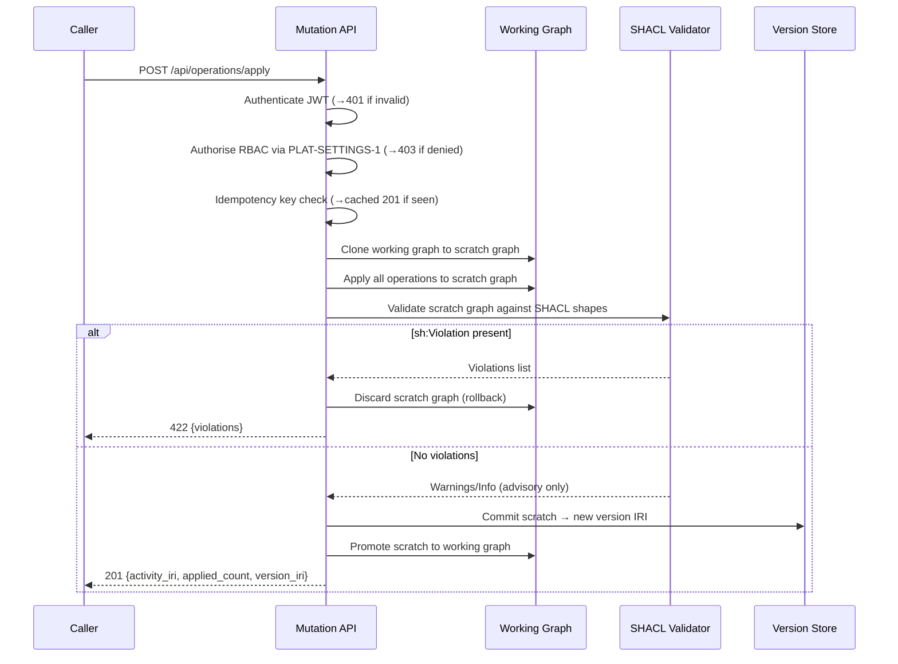

Engine spec: [constitution-engine.md](../../../constitution-engine.md)
Contracts: [contracts.md](../../../../contracts.md)

## Story

As a business modeller, I need every ontology or instance mutation to pass SHACL validation
before it is committed, so the knowledge graph is always in a conformant, queryable state and
no structural errors can accumulate silently.

## Acceptance Criteria

| ID | Criterion (EARS) |
|---|---|
| AC-001-01 | WHEN a valid `POST /api/operations/apply` request is received, THE SYSTEM SHALL clone the working graph to a scratch graph, apply all operations atomically, run SHACL shapes, and — if no `sh:Violation` is found — commit the scratch graph as a new version, returning `201 {activity_iri, applied_count, version_iri}`. |
| AC-001-02 | WHEN SHACL evaluation yields one or more `sh:Violation` results, THE SYSTEM SHALL discard the scratch graph and return `422 {violations:[{focus_node, path, severity, message}]}`. |
| AC-001-03 | WHEN SHACL evaluation yields only `sh:Warning` or `sh:Info` results, THE SYSTEM SHALL commit the change and include advisories in the `201` response body. |
| AC-001-04 | WHEN a request carries an `idempotency_key` already seen within 24 hours, THE SYSTEM SHALL return the original `201` response body without re-applying operations. |
| AC-001-05 | WHEN an `add_node` operation has the same case-insensitive label and kind as an existing node in the same tenant graph, THE SYSTEM SHALL reject the batch with `409 {existing_iri}`. |
| AC-001-06 | WHEN an `update_node` operation names only a subset of properties, THE SYSTEM SHALL retract only the named properties and assert new values, leaving all other triples (position, colour, domain annotations) unchanged. |
| AC-001-07 | WHEN a request carries no valid JWT or an expired JWT, THE SYSTEM SHALL return `401` before any graph operation. |
| AC-001-08 | WHEN a valid JWT belongs to a principal whose role lacks write permission per PLAT-SETTINGS-1, THE SYSTEM SHALL return `403`. |
| AC-001-09 | WHEN a valid JWT for tenant A is used, THE SYSTEM SHALL never read or write tenant B named graphs. |
| AC-001-10 | WHEN any error occurs at any stage of clone→validate→commit, THE SYSTEM SHALL ensure the working graph is bit-for-bit identical to its pre-request state. |

## API Contracts

Mutation pipeline implements **CE-WRITE-1** — see [contracts.md](../../../../contracts.md).
Do not restate request/response shapes here; cite the contract ID only.

## Diagram



## Design Decisions

| Decision | Rationale | Source |
|---|---|---|
| Single validated mutation entry point | Prevents validation bypass; structural safety constraint, not optional. | engine spec §Key Decisions, E6-S1 |
| Clone-then-validate-then-commit | Guarantees atomicity; the scratch graph is discarded on violation with zero graph side-effects. | engine spec §Key Decisions |
| SHACL runs with `inference='none'` | Avoids open-world/closed-world confusion between OWL reasoning and SHACL enforcement. | engine spec decision B3 (Polikoff rule) |
| Partial-update: retract only named predicates | Preserves display and annotation triples the caller did not include. Prevents inadvertent data loss. | engine spec decision B2 |
| `sh:Violation` → 422, advisories → 201 | Mirrors HTTP semantics; violations are blocking errors, warnings are informational. | engine spec E6-S2 ACs |
| Idempotency via 24h key window | Safe retry under network failure; 24h is sufficient for all UI-driven retry loops. | contracts.md CE-WRITE-1 |
| OWL class graph and SHACL shapes graph are separate named graphs | `weave:graph/ontology` for OWL, `weave:graph/shapes` for SHACL; validator queries only the shapes graph. | engine spec decision B3 |

## Test Requirements

| Layer | Scenario | AC |
|---|---|---|
| Unit | SHACL evaluator flags `sh:Violation`, passes `sh:Warning` and `sh:Info` correctly | AC-001-02, AC-001-03 |
| Unit | Partial-update retract/assert leaves untouched predicates intact in scratch graph | AC-001-06 |
| Unit | Idempotency key lookup returns cached response without re-applying | AC-001-04 |
| Unit | Case-insensitive duplicate label+kind detection per tenant | AC-001-05 |
| Integration | Full clone→SHACL→commit cycle against Oxigraph dev store | AC-001-01, AC-001-10 |
| Integration | `401` on missing/expired JWT | AC-001-07 |
| Integration | `403` on authenticated but unauthorised role | AC-001-08 |
| Integration | Cross-tenant isolation: tenant A JWT cannot write tenant B named graph | AC-001-09 |
| E2E | Modeller submits valid mutation via UI → graph reflects change | AC-001-01 |
| E2E | Modeller submits SHACL-violating mutation → 422 surfaced in UI | AC-001-02 |

## Dependencies

- **blocked_by**: PLAT-SETTINGS-1 provisioned (RBAC matrix, tenant named-graph routing)
- **unlocks**: TASK-002 (provenance wraps commits produced here), TASK-003 (public contract faces),
  TASK-004 (ontology authoring uses this pipeline), TASK-005 (instance mutations use this pipeline),
  TASK-006 (authoring surfaces call this pipeline)

## Cost Estimate

**XL** — this is the foundational safety spine; every subsequent task depends on it.

## DoR Checklist

- [ ] PLAT-SETTINGS-1 RBAC matrix defined and accessible via API
- [ ] Oxigraph reachable in CI environment
- [ ] BPMO SHACL shape files checked in and versioned
- [ ] CE-WRITE-1 contract frozen (contracts.md)
- [ ] Multi-tenant named-graph routing strategy confirmed (OQ-04 resolved or provisional decision recorded)
- [ ] Acceptance criteria signed off by PO

## DoD Checklist

- [ ] All ACs pass (unit + integration + E2E)
- [ ] Every `sh:Violation` in the BPMO shape test suite is blocked
- [ ] Partial-update round-trip preserves untouched triples (verified in integration test)
- [ ] Idempotency key dedup verified under concurrent requests
- [ ] Cross-tenant isolation test passes in integration suite
- [ ] No hardcoded credentials; secrets via AWS Secrets Manager only
- [ ] OpenAPI schema generated and matches CE-WRITE-1 shapes in contracts.md
- [ ] Rollback verified: injected failure at each stage leaves working graph unchanged
- [ ] CloudWatch metric emitted per mutation outcome (success / violation / error)

## Implementation Hints

**Hardest path**: atomicity across clone→validate→commit. The validator must receive the
*post-operation* scratch graph, not the pre-operation working graph. Run SHACL after all
operations in the batch are applied, never interleaved per-operation.

**Partial-update retract step** is the most error-prone logic. Light pseudocode for the
retract phase only:

```
for each update_op in operations:
    for each (predicate, _) in update_op.properties:
        SPARQL UPDATE: DELETE { ?s predicate ?o } WHERE { ?s predicate ?o . FILTER(?s = focus_node) }
    for each (predicate, new_value) in update_op.properties:
        SPARQL UPDATE: INSERT DATA { focus_node predicate new_value }
    # Predicates NOT named in update_op.properties: untouched
```

**SHACL shape loading**: shapes graph must be loaded into the validator at startup and
refreshed when shapes are updated. Do not reload on every request — cache with ETL-style
invalidation.

**OWL/SHACL graph separation**: `weave:graph/ontology` holds class hierarchy; `weave:graph/shapes`
holds SHACL shapes. The validator queries only `weave:graph/shapes`. Mixing them breaks the
Polikoff rule and corrupts OWL reasoning.
