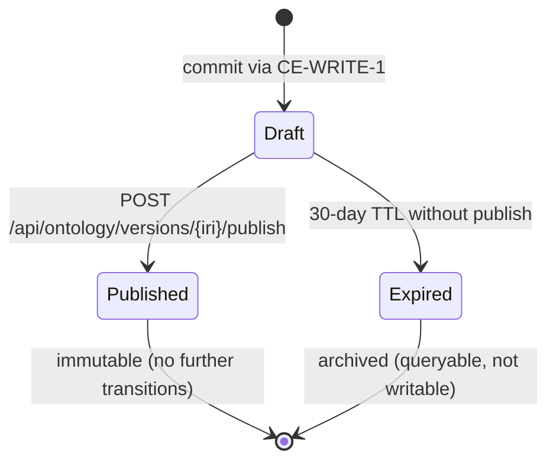

Engine spec: [constitution-engine.md](../../../constitution-engine.md)
Contracts: [contracts.md](../../../../contracts.md)

## Story

As an enterprise architect, I need every graph change to carry a PROV-O provenance record and
progress through a draft→published lifecycle, so I can trace who approved any version and
replay or audit the model's history with confidence.

## Acceptance Criteria

### E9-S1 — PROV-O Provenance + Audit

| ID | Criterion (EARS) |
|---|---|
| AC-002-01 | WHEN a mutation commits successfully via CE-WRITE-1, THE SYSTEM SHALL append a `prov:Activity` record to `weave:graph/prov` containing: `prov:wasAssociatedWith` (LLM agent IRI from PLAT-IDENTITY-1), `prov:wasStartedBy` (approving human IRI from PLAT-IDENTITY-1), `prov:generated` (new version IRI), `prov:used` (source version IRI), `prov:startedAtTime`, `prov:endedAtTime`. |
| AC-002-02 | WHEN a commit occurs, THE SYSTEM SHALL emit one PLAT-AUDIT-1 event with fields `{seq, ts, actor_principal_iri, engine:"constitution", event_type, target_iri, diff_summary, signature}` — see [contracts.md](../../../../contracts.md) for the canonical shape. |
| AC-002-03 | WHEN the provenance graph is queried after a failed mutation attempt, THE SYSTEM SHALL contain no `prov:Activity` record for that attempt. |
| AC-002-04 | WHEN the PLAT-AUDIT-1 sink is unavailable, THE SYSTEM SHALL still commit the graph change and queue the audit event for retry; the mutation MUST NOT be rolled back. |
| AC-002-05 | WHEN a principal IRI is resolved via PLAT-IDENTITY-1, THE SYSTEM SHALL use the canonical IRI for both the LLM agent and the approving human; never fabricate or abbreviate IRIs. |

### E9-S2 — Draft→Published Lifecycle

| ID | Criterion (EARS) |
|---|---|
| AC-002-06 | WHEN a mutation commits, THE SYSTEM SHALL assign the resulting snapshot a draft version IRI (e.g., `weave:version/{uuid}/draft`) and persist it as the new working state. |
| AC-002-07 | WHEN an authorised principal calls `POST /api/ontology/versions/{version_iri}/publish`, THE SYSTEM SHALL transition the draft to a published version IRI (e.g., `weave:version/{uuid}`), immutable thereafter. |
| AC-002-08 | WHEN `?version=latest` is specified on any read endpoint, THE SYSTEM SHALL resolve it to the newest published version IRI, not a draft. |
| AC-002-09 | WHEN a published version is requested for update, THE SYSTEM SHALL reject with `409 {message:"version is published and immutable"}`. |
| AC-002-10 | WHEN a draft version is abandoned (not published within 30 days), THE SYSTEM SHALL mark it `weave:status/expired`; expired drafts are excluded from `?version=latest` resolution. |

### E9-S3 — Version History and Diff

| ID | Criterion (EARS) |
|---|---|
| AC-002-11 | WHEN `GET /api/ontology/versions` is called, THE SYSTEM SHALL return a paginated list of version records `{version_iri, status, created_at, published_at, actor_iri}` newest-first. |
| AC-002-12 | WHEN `GET /api/ontology/diff?from={iri}&to={iri}` is called, THE SYSTEM SHALL return server-computed `{added:[Triple], removed:[Triple], modified:[{before, after}]}` including edge modifications. |
| AC-002-13 | WHEN `from` and `to` in a diff request refer to the same version IRI, THE SYSTEM SHALL return `{added:[], removed:[], modified:[]}`. |
| AC-002-14 | WHEN a diff is requested for a version IRI that does not exist, THE SYSTEM SHALL return `404`. |

## API Contracts

Implements **CE-DIFF-1** and **CE-VERSION-1**. Emits to **PLAT-AUDIT-1**.
Identity resolution via **PLAT-IDENTITY-1**.
See [contracts.md](../../../../contracts.md) for all canonical shapes — do not restate here.

## Diagram



## Design Decisions

| Decision | Rationale | Source |
|---|---|---|
| PROV-O records in a separate named graph `weave:graph/prov` | Keeps provenance queryable via SPARQL without polluting the ontology graph. | engine spec §E9 |
| LLM identified as `prov:SoftwareAgent`, human as `prov:Person` | Preserves W3C PROV-O semantics; auditors can distinguish automated from human changes. | engine spec §E9-S1 |
| Draft before publish; `?version=latest` resolves to newest published | Draft state allows review before exposure to downstream engines; published = stable contract. | engine spec §E9-S2 |
| Version IRIs are immutable once published | Immutability is required for audit integrity and reproducibility; any change must create a new version. | engine spec §Key Decisions |
| PLAT-AUDIT-1 emit is best-effort (non-blocking on commit) | The graph is the source of truth; audit sink availability must not block model authors. | engine spec §NFR Reliability |
| Diff is server-computed, not client-derived | Ensures diff semantics include edge modifications and are consistent regardless of client. | contracts.md CE-DIFF-1 |

## Test Requirements

| Layer | Scenario | AC |
|---|---|---|
| Unit | PROV-O record correctly formed for LLM agent + human principal | AC-002-01, AC-002-05 |
| Unit | Draft version IRI assigned on commit; published IRI on publish call | AC-002-06, AC-002-07 |
| Unit | `?version=latest` resolves to newest published, not draft | AC-002-08 |
| Unit | Diff returns empty result when `from == to` | AC-002-13 |
| Unit | 30-day TTL expiry marks draft as `weave:status/expired` | AC-002-10 |
| Integration | Provenance graph contains correct triples after commit (query `weave:graph/prov`) | AC-002-01 |
| Integration | No provenance record written on failed mutation | AC-002-03 |
| Integration | PLAT-AUDIT-1 event emitted after successful commit | AC-002-02 |
| Integration | Commit succeeds even when PLAT-AUDIT-1 sink is stubbed to fail | AC-002-04 |
| Integration | Diff endpoint returns correct added/removed/modified for known change | AC-002-12 |
| Integration | `404` on diff for non-existent version IRI | AC-002-14 |
| E2E | Modeller publishes a draft; published version appears in version list | AC-002-07, AC-002-11 |
| E2E | Attempt to mutate a published version returns 409 | AC-002-09 |

## Dependencies

- **blocked_by**: TASK-001 (commits originate from the SHACL validation pipeline)
- **unlocks**: TASK-003 (CE-READ-1 version endpoints reference published versions from here),
  TASK-004 (ontology modelling operates on draft→published lifecycle)

## Cost Estimate

**L** — three stories with non-trivial PROV-O graph semantics; diff computation requires
careful triple-level comparison.

## DoR Checklist

- [ ] TASK-001 complete (commit path produces version IRIs)
- [ ] PLAT-IDENTITY-1 returns canonical principal IRIs for LLM agent and human approver
- [ ] PLAT-AUDIT-1 sink available (real or stub) in integration environment
- [ ] PROV-O namespace prefixes agreed and committed to BPMO ontology prefix declaration
- [ ] Draft/published IRI naming scheme confirmed and documented

## DoD Checklist

- [ ] All ACs pass (unit + integration + E2E)
- [ ] PROV-O graph populated correctly after every successful commit
- [ ] No provenance record on failed mutations (verified by graph query)
- [ ] PLAT-AUDIT-1 events delivered or queued (never silently dropped)
- [ ] Published version IRIs are immutable (write attempt returns 409)
- [ ] Diff endpoint tested against regressions on known change sets
- [ ] `?version=latest` resolution tested with multiple published versions present
- [ ] No PII or secrets logged (provenance records may include IRI but not JWT payload)

## Implementation Hints

**PROV-O graph insertion** should occur inside the same transaction as the commit, not after.
If the version is committed but the PROV-O write fails, the graph state is inconsistent.
Use SPARQL UPDATE with an explicit graph target:

```
INSERT DATA {
  GRAPH <weave:graph/prov> {
    <activity_iri> a prov:Activity ;
        prov:wasAssociatedWith <llm_agent_iri> ;
        prov:wasStartedBy     <human_iri> ;
        prov:generated        <new_version_iri> ;
        prov:used             <source_version_iri> ;
        prov:startedAtTime    "..."^^xsd:dateTime ;
        prov:endedAtTime      "..."^^xsd:dateTime .
  }
}
```

**Diff algorithm**: query the two version snapshots with SPARQL. Find triples in version A not
in version B (removed), triples in B not in A (added). For `modified`, match by subject+predicate
and compare objects. Edges (`weave:relatesTo`, etc.) must be included in the diff query.

**Draft TTL expiry**: implement as a background job (Lambda cron or FastAPI startup task)
that marks drafts older than 30 days. Do not expire drafts inline on read — latency impact
and race conditions.
