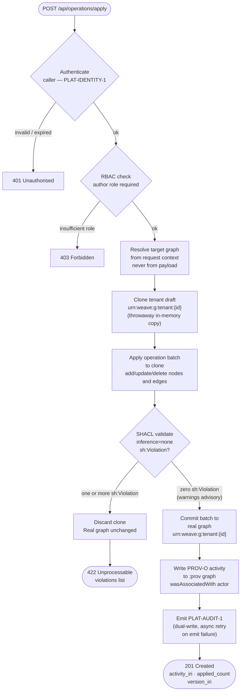
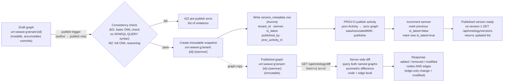
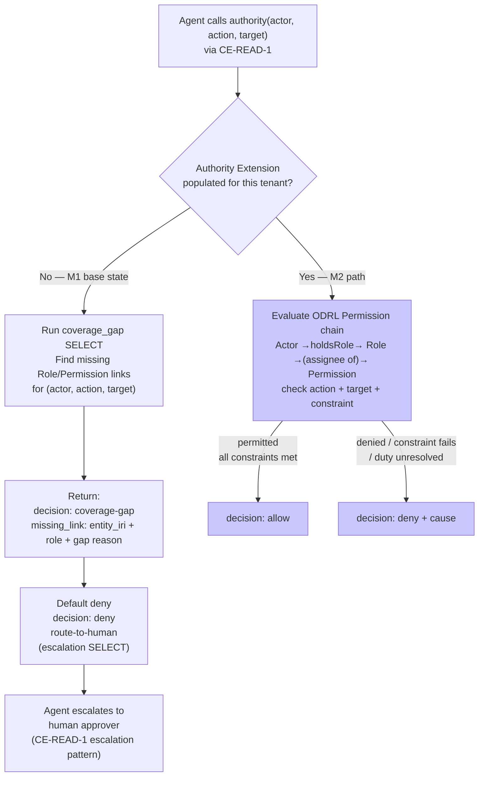
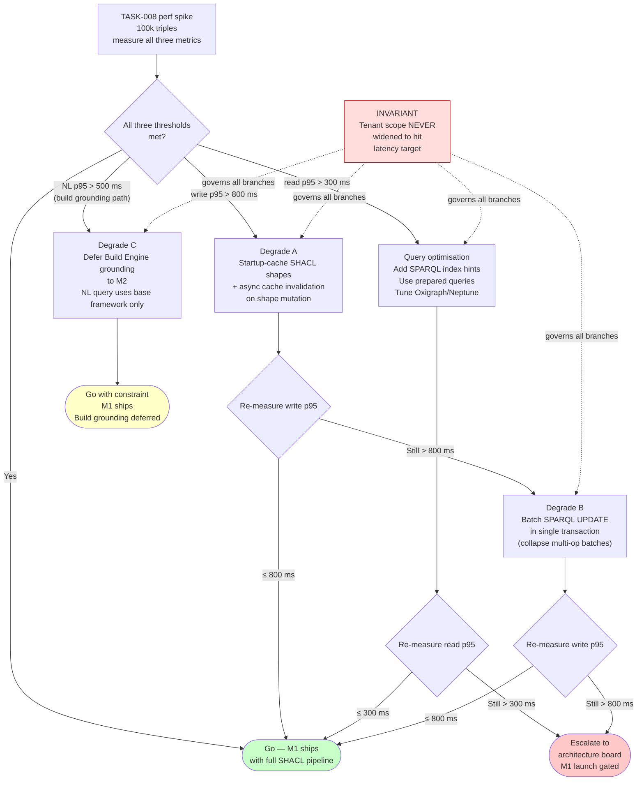

# Constitution Engine — Business Process (M1)

**Graph edges:**

- Engine spec: [constitution-engine.md](../../../constitution-engine.md)
- Data model (sibling): [data-model.md](./data-model.md)
- Contracts (canonical): [contracts.md](../../../../contracts.md)
- ADR-001 (tenant isolation): [ADR-001-tenant-isolation.md](../../../../decisions/ADR-001-tenant-isolation.md)
- ADR-002 (authority extension): [ADR-002-authority-extension.md](../../../../decisions/ADR-002-authority-extension.md)
- Standards: [api-conventions.md](../../../../../../standards/api-conventions.md) ·
  [rbac-multi-tenancy.md](../../../../../../standards/rbac-multi-tenancy.md) ·
  [audit-immutability.md](../../../../../../standards/audit-immutability.md) ·
  [observability.md](../../../../../../standards/observability.md)

---

## Overview

This document specifies the operational flows that animate the CE data model. Each flow is
described with a Mermaid diagram and concise prose constraints; implementation detail lives in
task briefs.

**M1 flows covered:**

1. Model-write — mutate the tenant knowledge graph via CE-WRITE-1 (validate-before-commit).
2. Version and diff — publish immutable snapshots; compute server-side diffs (CE-VERSION-1, CE-DIFF-1).
3. NL-query path — natural-language question → LLM-generated SPARQL → same rewriter → paginated results.
4. Agent-grounding degrade — `authority()` honest degrade when Authority Extension is absent.
5. [TASK-008 perf-spike degrade contingency](#task-008-perf-spike-degrade-contingency) — decision
   path for handling latency/throughput threshold failures without widening tenant scope.

**Error envelope, pagination, and status-code conventions** (422/403/429/404) are defined once in
[api-conventions.md](../../../../../../standards/api-conventions.md). This document references them
but does not restate the schemas.

---

## Model-Write Flow

Covers `CE-WRITE-1` — the single mutation entry point. See
[contracts.md §CE-WRITE-1](../../../../contracts.md).

### Flowchart



**Invariants (each is testable):**

- Tenant graph is resolved from the authenticated request context. A payload referencing another
  tenant's graph is rejected 403 before reaching the clone step.
- `inference='none'` on every SHACL call — grep-enforced in CI (decision B1).
- Clone discarded on any exception; no partial writes reach the real graph.
- `sh:Warning` and `sh:Info` advisory results never block the commit. They are surfaced in the
  response alongside the 201 (CE-WRITE-1 contract).
- PROV-O stamp and PLAT-AUDIT-1 emit are both required on commit. An audit emit failure retries
  asynchronously; a commit is never marked "audited" before a successful emit
  ([audit-immutability.md](../../../../../../standards/audit-immutability.md)).
- `CE-WRITE-1` is the only write path to the RDF store. SPARQL Update is not exposed. Connector
  ingest jobs call `CE-WRITE-1` (with service-principal identity). There is no direct-store bypass.

### State Machine: Proposed Write

The state machine below covers a single `CE-WRITE-1` call from submission to resolution. The tenant
draft graph (`urn:weave:g:tenant:{id}`) is the persistent mutable state between commits.

```mermaid
stateDiagram-v2
    [*] --> Pending : CE-WRITE-1 received
    Pending --> Validating : clone draft; apply ops to clone
    Validating --> Committed : zero sh:Violation\ncommit to real graph
    Validating --> Rejected : sh:Violation found\nclone discarded
    Committed --> [*] : 201 + activity_iri\nPROV-O stamp + PLAT-AUDIT-1 emit
    Rejected --> [*] : 422 + violations list\nreal graph unchanged
```



**Note on `sh:Warning` / `sh:Info`:** both transition to `Committed` (no blocking). Their payloads
are included in the 201 body under a `warnings` key. See CE-WRITE-1 in contracts.md.

---

## Version and Diff Flow

Covers CE-VERSION-1 (version metadata) and CE-DIFF-1 (server-side diff). The tenant draft graph
is the mutable accumulation of commits. A publish event freezes the draft into an immutable snapshot.

### Flowchart



**Immutability guarantee:** once published, `urn:weave:g:tenant:{id}:v{semver}` is read-only. No
CE-WRITE-1 call targets a published version. A PUT/PATCH on a version IRI is rejected 405. The
`sha256_digest` in `snapshot_pointer` (Aurora) enables optional tamper-audit.

**Version-lag (CE-VERSION-1):** canonical lag = count of published versions strictly between a
consumer's pinned version and `is_latest`. Computed server-side from `version_metadata`; consumers
never reimplement. Default stale threshold = lag ≥ 2 (tunable via PLAT-SETTINGS-1).

**Diff semantics:** a predicate added or removed between two existing nodes appears as
`"kind": "modified"` on the source node, not only as `added`/`removed` triple entries. Consumers
should inspect the `modified` payload for edge-level changes.

---

## NL-Query Path

Covers `POST /api/query/nl` from CE-READ-1. The NL path is NOT a separate code path from the
typed-SPARQL path. The LLM-generated query passes through the **identical** rewriting middleware
and SELECT-only / SERVICE-blocked sanitizer ([data-model.md §query-path-and-tenant-isolation](./data-model.md)).

### Sequence diagram

```mermaid
sequenceDiagram
    participant C as Client
    participant CE as CE API Layer
    participant LLM as LLM (claude-sonnet-4-6)
    participant RW as Rewriting middleware
    participant STORE as RDF Store

    C->>CE: POST /api/query/nl { nl: "list all automated processes..." }
    CE->>LLM: ontology schema context + nl text + SELECT-only instruction
    LLM-->>CE: generated SPARQL SELECT ...
    Note over CE,LLM: LLM is instructed to generate SELECT only;<br/>no UPDATE, INSERT, DELETE, SERVICE
    CE->>RW: validate(generated_query, tenant_id)
    Note over RW: Same rewriter / validator as hand-typed SPARQL.<br/>No SSRF bypass. One code path.
    RW->>RW: inject FROM urn:weave:g:framework
    RW->>RW: inject FROM urn:weave:g:tenant:{id}
    RW->>RW: SELECT-only check
    RW->>RW: SERVICE keyword check (blocked)
    alt rejected (unscoped / non-SELECT / SERVICE)
        RW-->>CE: reject (fail-closed)
        CE-->>C: 422 { code: invalid_query, generated_query: "..." }
    else valid
        RW->>STORE: SELECT ... FROM urn:weave:g:framework FROM urn:weave:g:tenant:{id}
        STORE-->>RW: result rows (cursor-paginated)
        RW-->>CE: paginated result set
        CE-->>C: 200 { results: [...], next_cursor: "...", generated_query: "..." }
    end
```

**Key constraints:**

- The LLM receives the BPMO framework schema (class and predicate IRIs) as context so generated
  queries reference real IRIs, not hallucinated ones.
- A generated non-SELECT statement (detected by the rewriter) returns 422 with `generated_query`
  for diagnostics. The caller can surface this to the user.
- Pagination (`next_cursor`) is cursor-based, consistent with api-conventions.md. No row-count limit
  silently truncates; the caller pages until exhausted.
- `?version=<semver|latest>` is supported on NL queries. The rewriter resolves the version IRI and
  binds the appropriate named graph (same path as typed SPARQL).
- The PROV-O stamp for an NL-originated query is written to the `:prov` graph only if the query
  triggered a write (not applicable for read-only queries). LLM authoring is tracked via
  `prov:SoftwareAgent` on any write activity, not on reads.
- **SSRF:** `SERVICE` keyword is blocked before the store sees the query. Blocked queries are
  logged (no content of the query is sent to an external endpoint).

---

## Agent-Grounding Degrade

Covers CE-READ-1's `authority()` semantic function and the M1 honest degrade path. The Authority
Extension (ODRL module) is M2; the degrade behaviour is M1.

### Flowchart



Blue-filled states are M2 only. The M1 path (white) ships unconditionally.

**M1 `coverage_gap()` behaviour — testable invariants:**

- Empty result (`authority()` returns nothing) NEVER means "permitted." It always resolves to
  `decision: coverage-gap` with explicit missing-link detail, followed by `decision: deny`.
- An explicit deny triple in the graph (`odrl:Prohibition`) overrides any inferred permit, even in M2.
- `automatable=false` on the target Process/Activity → route-to-human without calling `authority()`.
- `automatable` absent (null) → treated as `false` (fail-safe default per FR-009).

**Agent identity:** agents act under a service-principal `weave:Actor` holding a least-privilege
`weave:Role` (ONT-4 split). Identity IRI comes from PLAT-IDENTITY-1. In M1, that Actor/Role pair
has no ODRL Permission attached — hence `coverage-gap` on every authority check. The tenant
populates Permissions as part of M2 onboarding.

---

## TASK-008 Perf-Spike Degrade Contingency

The TASK-008 performance spike (100k-triple baseline) gates M1 launch. This section defines the
decision path when a threshold is not met. The generating step (SHACL-validate→commit) is
preserved in all degrade options. **Tenant isolation is never widened to hit a latency target.**
That constraint is inviolable.

**Go/no-go thresholds (100k triples — M1 gating):**

| Metric | Threshold | Measured at |
|---|---|---|
| Write p95 (`CE-WRITE-1` single op) | ≤ 800 ms | 100k triples |
| Read p95 (paginated SPARQL SELECT) | ≤ 300 ms | 100k triples |
| NL query p95 (`POST /api/query/nl`) | ≤ 500 ms | 100k triples |
| 500k-triple load | Measured but not gating M1 launch | — |

### Decision flowchart



### Degrade state machine

```mermaid
stateDiagram-v2
    [*] --> SpikeRunning
    SpikeRunning --> GoThreshold : all metrics pass
    SpikeRunning --> WriteFail : write p95 > 800ms
    SpikeRunning --> ReadFail : read p95 > 300ms
    SpikeRunning --> NLFail : NL p95 > 500ms

    WriteFail --> DegradeA_Applied : apply shape cache
    DegradeA_Applied --> GoThreshold : write p95 ≤ 800ms
    DegradeA_Applied --> DegradeB_Applied : still failing
    DegradeB_Applied --> GoThreshold : write p95 ≤ 800ms
    DegradeB_Applied --> Escalated : still failing

    ReadFail --> QueryOptimised : add indexes + prepared queries
    QueryOptimised --> GoThreshold : read p95 ≤ 300ms
    QueryOptimised --> Escalated : still failing

    NLFail --> DegradeC_Applied : defer Build grounding to M2
    DegradeC_Applied --> GoWithConstraint : NL p95 ≤ 500ms on base framework

    GoThreshold --> [*] : M1 launches; full pipeline
    GoWithConstraint --> [*] : M1 launches; Build grounding M2
    Escalated --> [*] : M1 gated; arch board reviews

    note right of DegradeA_Applied
        SHACL shapes cached at startup.
        Cache invalidated asynchronously
        on any sh:NodeShape mutation.
        Validate-before-commit pipeline
        preserved unchanged.
    end note

    note right of DegradeB_Applied
        Multi-op batch collapsed to
        single SPARQL UPDATE transaction.
        Clone-validate-commit invariant
        preserved; only the batch
        boundary changes.
    end note

    note right of DegradeC_Applied
        Build Engine grounding
        (agent uses tenant + framework only).
        No cross-tenant reads.
        Tenant isolation inviolate.
    end note
```



**Invariant statement (non-negotiable):**

> No degrade option — A, B, or C — may widen the query scope to include another tenant's graph.
> The `urn:weave:g:framework` + `urn:weave:g:tenant:{id}` graph pair is the ceiling.
> Performance is sacrificed before isolation. If no degrade preserves both M1 launch and the
> isolation invariant, the launch is escalated, not the scope.

---

## Deferred (M2+)

The following flows are **explicitly out of scope for M1.** They extend the degrade paths defined
above and require the Authority Extension module (ADR-002 M2 phase).

| Flow | M1 anchor | M2+ addition |
|---|---|---|
| Full `authority()` evaluation | `decision: coverage-gap + deny` (all cases) | Resolve Actor →holdsRole→ Role →(assignee of)→ Permission; evaluate ODRL constraints |
| `escalation()` with deadlines | `escalation()` SELECT returns open gaps | `escalatesTo`, `escalationDeadline` ODRL Duty evaluation; CE-EVENT-1 fires on overdue |
| HITL approval routing | Route-to-human on deny (synchronous block) | Event-driven: ODRL Duty "obtain human approval" triggers workflow; automatable=true gate |
| `authorityLevel` ordered scheme | Not evaluated (no ordered collection present) | `skos:OrderedCollection` read ≺ author ≺ publish ≺ admin; RBAC boundary reads ontology level |
| NL mutation (AI-proposed writes) | LLM generates SELECT only (read path) | LLM-proposed write ops submitted to CE-WRITE-1 with human-in-loop approval PROV-O duty |
| Inferred named graph population | Inferred graph IRI defined; graph not populated | At publish time: run OWL reasoning; materialise inferred triples; label with `prov:wasDerivedFrom` |
| CE-BRAND-1 brand conformance | Brand individuals storable via CE-WRITE-1 | `GET /api/brand/tokens` projection; VoiceRule conformance gate; CE-METRICS-1 brand score |
| CE-FUNCTION-1 function registry | Registry schema defined in contracts.md | Populated + queryable; typed SDK bindings generated by Build Engine |
