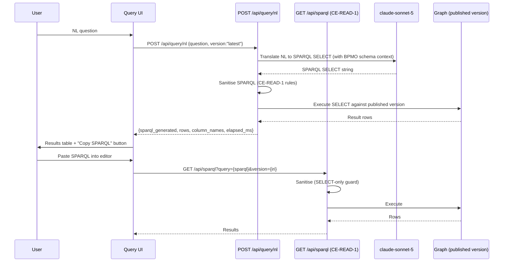

Engine spec: [constitution-engine.md](../../../constitution-engine.md)
Contracts: [contracts.md](../../../../contracts.md)

## Story

As a business analyst, I need to ask questions about the company model in plain language —
or write SPARQL directly — and get structured answers, so that I can verify the model is
accurate and find gaps without needing a developer.

## Scope

Covers EPIC-007 stories E7-S1 (NL→SELECT query) and E7-S2 (SPARQL editor and
`coverage_gap` pattern). The `authority()` and `escalation()` agent-grounding patterns
are **M2 and explicitly out of scope** for this task. E7-S4 (full agent grounding) is
also M2.

## Acceptance Criteria

### E7-S1 — NL→SELECT Query (the "wow" demo)

| ID | Criterion (EARS) |
|---|---|
| AC-007-01 | WHEN a user submits a natural language question via `POST /api/query/nl`, THE SYSTEM SHALL translate it to a valid SPARQL SELECT query, execute it against the latest published graph, and return `{sparql_generated, rows:[...], column_names, elapsed_ms}`. |
| AC-007-02 | WHEN the generated SPARQL contains UPDATE, INSERT, DELETE, or SERVICE clauses, THE SYSTEM SHALL refuse to execute it, regenerate the query, or return `400 {error:"prohibited_clause"}`. |
| AC-007-03 | WHEN the NL query returns more than 1000 rows, THE SYSTEM SHALL paginate and include `next_page` in the response. |
| AC-007-04 | WHEN the NL question is unanswerable from the graph (e.g., asks for data not in the model), THE SYSTEM SHALL return `{rows:[], explanation:"The model does not contain..."}` rather than an empty result with no context. |
| AC-007-05 | WHEN the translation fails (model returns invalid SPARQL), THE SYSTEM SHALL return `400 {error:"translation_failed", nl_question:...}` and not surface the raw SPARQL error. |
| AC-007-06 | WHEN `POST /api/query/nl` is called, THE SYSTEM SHALL resolve `?version=latest` to the newest published version before executing the query. |
| AC-007-07 | WHEN a request carries no valid JWT, THE SYSTEM SHALL return `401`. |
| AC-007-08 | WHEN the response includes `sparql_generated`, THE SYSTEM SHALL display it in the UI so the analyst can inspect and copy the SPARQL for the SPARQL editor. |

### E7-S2 — SPARQL Editor and coverage_gap

| ID | Criterion (EARS) |
|---|---|
| AC-007-09 | WHEN a user writes and executes a SELECT query in the SPARQL editor UI, THE SYSTEM SHALL submit it to `GET /api/sparql` (CE-READ-1) and render results in a table. |
| AC-007-10 | WHEN a SELECT query is executed, THE SYSTEM SHALL validate it through the CE-READ-1 SPARQL sanitiser (no UPDATE/INSERT/DELETE/SERVICE) before execution. |
| AC-007-11 | WHEN a SPARQL query targets a specific `?version`, THE SYSTEM SHALL execute against that version snapshot, not the latest. |
| AC-007-12 | WHEN the `coverage_gap(process)` query pattern is submitted, THE SYSTEM SHALL return explicit gap rows for every process step not covered by at least one activity or system, with columns `{process_iri, step_iri, step_label, gap_reason}`. |
| AC-007-13 | WHEN a coverage_gap query returns zero rows, THE SYSTEM SHALL confirm `{rows:[], message:"No coverage gaps found"}`. |
| AC-007-14 | WHEN a user is in the SPARQL editor, THE SYSTEM SHALL offer a "Explain this query" button that calls the AI with the SPARQL text and returns a plain-language explanation. |

## API Contracts

- **CE-READ-1** — `POST /api/query/nl` (NL translation + execution) and `GET /api/sparql`
  (direct SPARQL execution). See [contracts.md](../../../../contracts.md).
- The SPARQL sanitiser from TASK-003 is reused — not re-implemented.

## Diagram



## Design Decisions

| Decision | Rationale | Source |
|---|---|---|
| NL→SELECT always executes against latest published version by default | Draft versions are mutable; analysts query stable published state. | engine spec E7-S1, contracts.md CE-READ-1 |
| Generated SPARQL returned to caller alongside results | Transparency; analysts can verify and refine the translation; seed for SPARQL editor. | engine spec E7-S1, AC-007-08 |
| `coverage_gap(process)` ships in M1 as a named SELECT pattern | It is the core "gap analysis" proof-of-value; a stored query avoids requiring analysts to write SPARQL. | contracts.md CE-READ-1 |
| `authority()` and `escalation()` patterns deferred to M2 | Those patterns require Build Engine integration (agent grounding) which is not yet built. | engine spec E7 scope |
| NL translation uses claude-sonnet-5 with BPMO schema context | Sonnet has sufficient capability for SPARQL translation; BPMO kind list + relationship types injected into context. | CLAUDE.md stack |
| Explanation of generated SPARQL is a separate LLM call | Keeps the query path synchronous; explanation is optional/on-demand and can be slow. | engine spec E11-S3 spirit |

## Test Requirements

| Layer | Scenario | AC |
|---|---|---|
| Unit | SPARQL sanitiser blocks UPDATE/INSERT/DELETE/SERVICE in NL-generated query | AC-007-02 |
| Unit | `coverage_gap(process)` returns explicit gap rows for a seeded graph with gaps | AC-007-12 |
| Unit | `coverage_gap(process)` returns zero rows for a fully-covered graph | AC-007-13 |
| Unit | Unanswerable question returns explanation string, not empty result | AC-007-04 |
| Unit | Translation failure returns `400 {error:"translation_failed"}` | AC-007-05 |
| Integration | `POST /api/query/nl` returns `sparql_generated + rows` for known question on hammerbarn dataset | AC-007-01 |
| Integration | `?version=latest` resolved to newest published version | AC-007-06 |
| Integration | `401` on unauthenticated NL query request | AC-007-07 |
| Integration | Paginated result: >1000 rows returns `next_page` | AC-007-03 |
| Integration | SPARQL editor: version-pinned query returns that version's snapshot | AC-007-11 |
| Integration | "Explain this query" returns plain-language explanation | AC-007-14 |
| E2E | Analyst asks "What processes does the Customer domain own?" → correct rows | AC-007-01 |
| E2E | Analyst runs coverage_gap → gap rows displayed with process + step labels | AC-007-12 |
| E2E | Analyst copies generated SPARQL to editor → executes directly → same results | AC-007-08, AC-007-09 |

## Dependencies

- **blocked_by**: TASK-003 (CE-READ-1 SPARQL endpoint and sanitiser must exist; the
  `POST /api/query/nl` endpoint lives under CE-READ-1)
- **unlocks**: nothing — terminal M1 query task. Build Engine M1 grounding calls depend on
  SPIKE-CE-PERF-1 load test (out of scope here; flagged as scope ambiguity)

## Cost Estimate

**L** — NL translation with LLM latency management, SPARQL sanitiser reuse, coverage_gap
pattern implementation, and the SPARQL editor UI with result rendering.

## DoR Checklist

- [ ] TASK-003 complete (CE-READ-1 `GET /api/sparql` endpoint stable)
- [ ] claude-sonnet-5 prompt template for NL→SPARQL agreed and tested offline
- [ ] BPMO schema context injection strategy defined (which triples injected into LLM context)
- [ ] Hammerbarn seed dataset populated with at least one process coverage gap
- [ ] `coverage_gap(process)` SELECT pattern reviewed and finalised in contracts.md

## DoD Checklist

- [ ] All ACs pass (unit + integration + E2E)
- [ ] NL→SPARQL tested on hammerbarn dataset with at least 10 representative questions
- [ ] `coverage_gap(process)` verified on graph with known gaps and on gap-free graph
- [ ] Generated SPARQL always returned in response (not only on error)
- [ ] SPARQL sanitiser blocks all prohibited clauses in NL-generated output (not only UI-submitted)
- [ ] Unanswerable question detection tested with at least 3 out-of-scope questions
- [ ] NL question text NOT logged at INFO level or above (contains business-sensitive intent)
- [ ] `elapsed_ms` included in response; p95 < 5s for NL→SELECT on hammerbarn dataset

## Implementation Hints

**NL→SPARQL translation**: inject into the LLM prompt: (1) the BPMO kind list with IRIs,
(2) the 9 relationship types with IRIs, (3) the user's question. Instruct the model to
output ONLY the SPARQL SELECT string with no markdown fencing. Parse and sanitise the
output before executing. If parse fails, return `translation_failed`.

**BPMO context compression**: do not inject all triples — inject only the kind+relationship
schema. The full instance data is too large. If the question contains entity names, resolve
them to IRIs via CE-READ-1 before injecting.

**`coverage_gap(process)` pattern** (reference SELECT for implementer):

```sparql
SELECT ?process_iri ?step_iri ?step_label ?gap_reason
WHERE {
  ?process_iri a weave:Process ;
               weave:hasStep ?step_iri .
  ?step_iri rdfs:label ?step_label .
  FILTER NOT EXISTS {
    { ?step_iri weave:performedBy ?actor . }
    UNION
    { ?step_iri weave:supportedBy ?system . }
  }
  BIND("No actor or system assigned" AS ?gap_reason)
}
```

Implement this as a named stored query invoked by a short-hand parameter (e.g.,
`?pattern=coverage_gap_process`) on `GET /api/sparql`, not as a hard-coded API endpoint.
This keeps it within the CE-READ-1 surface and avoids a separate route.
