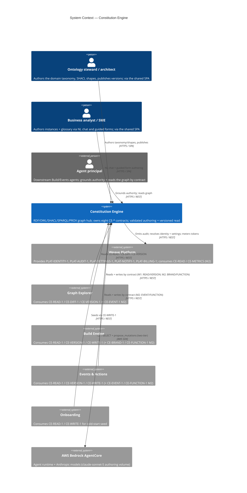
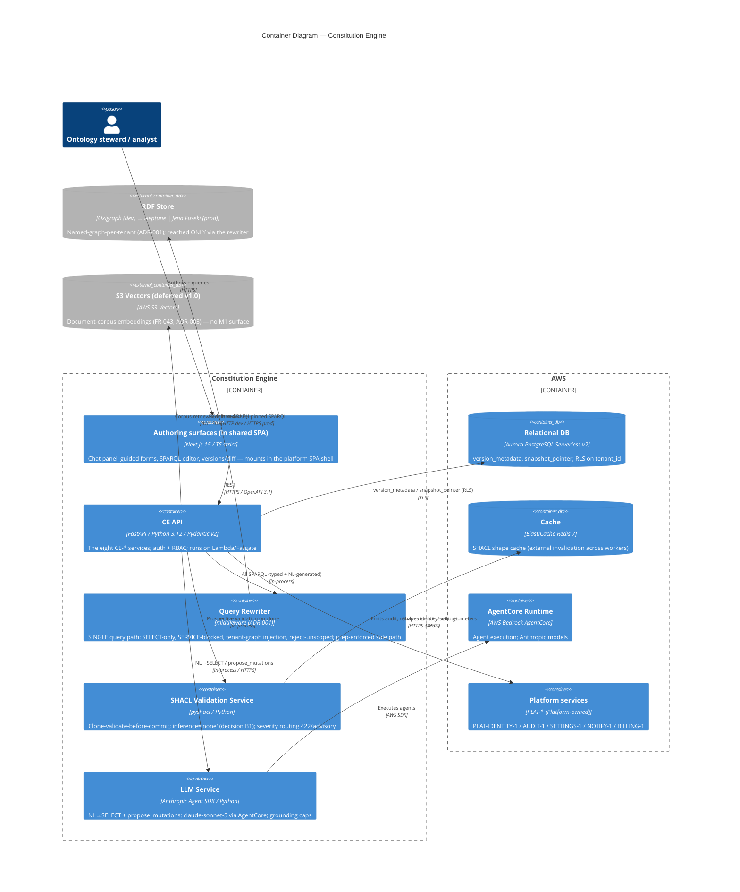
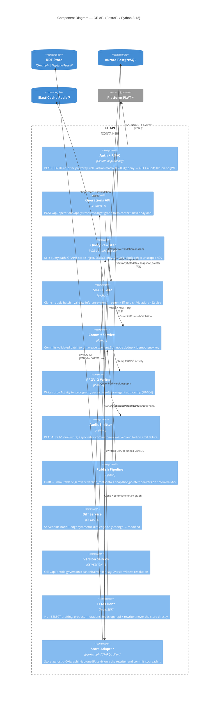
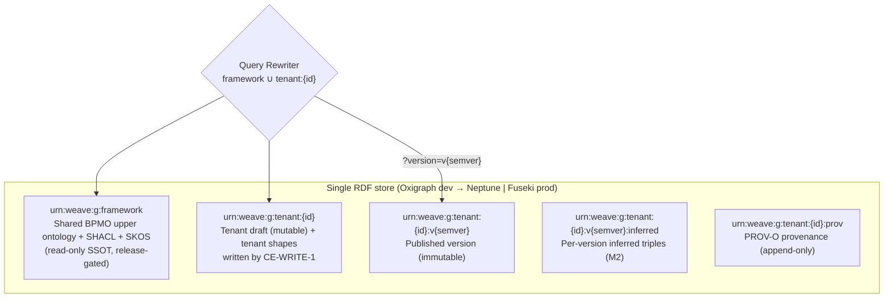

# Architecture: Constitution Engine

## Overview

The Constitution Engine is Weave's model layer and the **inter-engine contract hub**: it owns and
publishes eight `CE-*` contracts (`CE-READ-1`, `CE-WRITE-1`, `CE-DIFF-1`, `CE-VERSION-1` shipping at
M1, plus `CE-EVENT-1`, `CE-BRAND-1`, `CE-METRICS-1`, `CE-FUNCTION-1` landing M2+). Every other engine
(Build, Events & Actions, Graph Explorer) plus Platform and Onboarding read the business graph only
through these contracts — if CE is wrong, nothing generated downstream can be right. This document
covers C4 Levels 1–3; Level 4 (code) is deferred to `arch-class` and the implementation. The engine
holds an RDF/OWL knowledge graph (OWL 2 DL, Turtle canonical) validated by SHACL, provenance-tracked
with PROV-O, and queried by SPARQL 1.1 SELECT-only. The RDF store progression is **Oxigraph (dev/test)
→ Neptune | Jena Fuseki (prod)** — the production choice is deferred to OQ-02, so the store sits behind
a thin adapter and every component stays store-agnostic. The AI boundary is Anthropic Agent SDK → AWS
Bedrock AgentCore; the two-tier model policy routes generation and NL-to-SELECT authoring volume to
`claude-sonnet-5`. Per ADR-001, tenant isolation is enforced by **one named-graph-per-tenant scheme
behind a single fail-closed query rewriter** — the correctness of tenant separation concentrates in
that one choke point, which is grep-enforced as the sole query path.

## C4 Model

### Level 1: System Context

CE is the *provider* hub: Explorer, Build, Events, Platform, and Onboarding all call inward by contract
ID, never inventing endpoints. CE itself calls outward only to the five `PLAT-*` services it consumes
(identity, audit, settings, notify, billing) and to Bedrock AgentCore. The RDF store is a CE-internal
concern and appears at L2, not here — at context level the meaningful boundary is that the business
graph is reachable *only* through the `CE-*` surface.

### Level 2: Container

Container notes:

- **Authoring surfaces** are the CE slice of the *single* Weave SPA — the chat panel, guided forms,
  SPARQL editor, and versions/diff views mount inside the platform shell (weave-platform arch); CE
  owns its secondary navigation, not the chrome.
- **CE API** is one deployable exposing the eight `CE-*` service groups behind one auth+RBAC layer.
- **Query Rewriter** is the single query path (ADR-001): every SPARQL string — user-typed or
  LLM-generated — passes through it; no code issues a raw store query (grep-enforced).
- **SHACL Validation Service** always validates a throwaway clone with `inference='none'` (decision
  B1) before any commit reaches the real graph.
- **RDF store progression** (Oxigraph dev → Neptune | Jena Fuseki prod, OQ-02) is one shared store
  with named-graph-per-tenant isolation; it is store-agnostic behind the rewriter's adapter.
- **S3 Vectors** is drawn dashed — the document-corpus companion store (FR-043, ADR-003) has no M1
  surface; it lands v1.0 and is strictly read-side.

### Level 3: Component — CE API write & publish path

The CE API is the L3 target: it concentrates the architectural risk — the validate-before-commit
mutation gate, the single query rewriter, the PROV-O + PLAT-AUDIT-1 dual write, and the immutable
publish pipeline all live here. The authoring SPA and LLM service are structurally conventional.

Component notes: 12 components — at the ≤ 12 cap. Every write runs
`auth_mw → ops_api → shacl_gate → commit_svc → prov_writer → audit_emit`; every read runs
`auth_mw → rewriter → store_adapter`. Only `rewriter` and `commit_svc` reach `store_adapter`, and only
`store_adapter` knows the store URL — two choke points, each with one test surface (the
unscoped-query-rejection test and the clone-discard test). `llm_client` never touches the store: its
SPARQL passes the rewriter and its mutations pass `ops_api`, so the NL path inherits every gate.

## Named-Graph Topology

The named-graph scheme is the isolation contract (ADR-001, data-model.md §Named-Graph Scheme). It is
canonical and binding on every engine; the rewriter reads `framework ∪ tenant:{id}` and nothing else.

| Named graph | IRI pattern | Mutable | Written by | Read by |
|---|---|---|---|---|
| Shared BPMO framework | `urn:weave:g:framework` | No (release-gated) | Weave release only | All tenants (read-only) |
| Tenant draft + shapes | `urn:weave:g:tenant:{id}` | Yes | CE-WRITE-1 + connector path | That tenant only |
| Tenant published version | `urn:weave:g:tenant:{id}:v{semver}` | No (immutable) | Publish pipeline | That tenant only |
| Tenant inferred (per version) | `urn:weave:g:tenant:{id}:v{semver}:inferred` | No | Publish-time reasoner (M2) | That tenant only |
| Tenant provenance | `urn:weave:g:tenant:{id}:prov` | Append-only | Every CE-WRITE-1 commit | That tenant + audit layer |

A default read binds `framework ∪ tenant:{id}` (the mutable draft); a `?version=<semver>` read binds
`framework ∪ tenant:{id}:v{semver}` instead. A query naming another tenant's graph, or none where
scope is required, is rejected — never silently broadened. The connector write-path derives the target
graph from request context, not payload; a payload naming another tenant is 403 + audited.

## Design Decisions

Adversarial critic pass run before writing this table; the five mandatory challenges appear as D1–D5,
CE-specific challenges as D6–D9. Program-level ADRs live in
[`../../../decisions/`](../../../decisions/) (ADR-001 tenant isolation, ADR-002 authority extension).

| # | Decision | Rationale | Alternatives Rejected | Critic Challenge | Response |
|---|----------|-----------|----------------------|-----------------|---------|
| D1 | RDF store sits behind a thin store adapter; only the rewriter and commit service reach it | Prod store (Neptune vs Fuseki) is deferred (OQ-02); every component must stay store-agnostic so the choice is a config change, not a rewrite | Bake Oxigraph client calls throughout the services (couples the whole engine to the dev store) | "Where is the RDF boundary — does store choice leak into business logic?" | The adapter is the only code that knows a store URL; contract-client tests run identically against Oxigraph and a Testcontainers store (ADR-001) |
| D2 | Validate-before-commit runs clone → SHACL → commit synchronously inside one request; any exception before `store.commit` leaves the real graph untouched | The clone is throwaway, so a Lambda cold-start stall or process death mid-batch cannot leave a partial write — the real graph only mutates on the final atomic commit | Apply ops to the live graph then roll back on violation (a died process leaves half-applied triples) | "What if the Lambda dies mid-SPARQL-write?" | All-or-nothing on the clone (FR-004); a batch with one `sh:Violation` commits nothing; commit is the last step and is atomic per store transaction |
| D3 | Multi-tenancy is enforced at ONE fail-closed query rewriter, not per-service or per-query | One choke point is auditable and grep-enforceable; correctness of tenant separation lives in a single testable component (ADR-001) | Per-service scope injection, or trusting each query author to add the GRAPH clause (one miss = cross-tenant leak) | "Where is multi-tenancy actually enforced, and what is the blast radius of a miss?" | Deny-by-default (unscoped ⇒ reject 400); the rewriter is the sole query path (grep-enforced); property/fuzz tests treat it as a security gate (ADR-001) |
| D4 | LLM/agent grounding is capped: NL→SELECT results and propose_mutations run through the same rewriter + SHACL gate; agents receive a ≤200-node SELECT window and ≤50-node chat context | The model never writes unvalidated triples and never sees the whole tenant graph; token blast radius and hallucinated-IRI risk are bounded to the grounded window | Feed the agent the full graph and trust generated SPARQL/mutations directly | "What is the token/authority blast radius of the LLM path?" | The NL path is not a separate code path and not an SSRF bypass; generated SPARQL hits the identical SELECT-only + SERVICE-blocked validator (ADR-001, CE-READ-1); mutations pass CE-WRITE-1 |
| D5 | Prod store unavailable → CE fails closed on writes and reads; no degraded local store, no cross-tenant widening | A stale or bypassed store risks serving wrong model state to downstream generation, which is worse than unavailability; the TASK-008 degrade plan preserves the generate step but never widens scope | Fall back to a per-instance in-memory store (drifts from source of truth; loses isolation guarantees) | "What happens when Neptune/Fuseki is unavailable?" | 503 on the affected surface; retries with backoff; isolation is never traded for latency — if no degrade preserves both launch and isolation the launch is escalated (business-process.md TASK-008) |
| D6 | A single rewriter validates every SPARQL string regardless of origin, rather than scoping per service or per caller | One validator between any SPARQL and the store means one place to test SSRF + SELECT-only + tenant scope; NL, typed, and system queries share it | Separate NL-query sanitiser and typed-query sanitiser (two code paths, two SSRF surfaces to keep in sync) | "Does the NL surface bypass the SPARQL guard?" | Exactly one SELECT-only + SERVICE-blocked validator exists; a CI test asserts the NL path routes through it (CE-READ-1, ADR-001) |
| D7 | SHACL validation runs with `inference='none'` at M1 | Glossary term and OWL class are one punned resource (decision B1); the validation gate must not depend on OWL inference, keeping it deterministic and fast | Run SHACL with RDFS/OWL inference (fragile, slower, ties the gate to reasoner completeness) | "Is the validation gate sound without inference?" | Punning (B1) makes DL-completeness not load-bearing on the gate; `inference='none'` is grep-enforced on every SHACL call (data-model.md) |
| D8 | Published versions are immutable named graphs; any write to a `:v{semver}` graph is rejected 405 | Downstream engines pin to a published version; silent mutation of a pinned version breaks Build artefacts and Events automations | Allow in-place edits to published versions with a changelog (defeats version pinning) | "What actually stops a published version from being mutated?" | CE-WRITE-1 targets only the draft graph; a PUT/PATCH on a version IRI is 405; `sha256_digest` in snapshot_pointer enables tamper-audit (FR-008, business-process.md) |
| D9 | M1 ships the honest authority degrade (`coverage_gap` + deny), not full `authority()` | The base 13-kind BPMO cannot express permission/authority-level; overselling `authority()` would ground agents on absent data (ADR-002) | Return an implicit allow when no permission is modelled (silent over-permission — a security failure) | "Does M1 `authority()` lie about what it can resolve?" | Empty result never means permitted; it resolves to `coverage-gap` with explicit missing-link rows, then `deny`/route-to-human; explicit deny overrides (ADR-002, FR-036) |

## Invariants

All invariants are EARS-notated and each maps to at least one release-gate test.

- **Tenancy (read):** WHEN any SPARQL query is processed THE SYSTEM SHALL scope it to
  `framework ∪ tenant:{id}` for the authenticated principal, and a query issued in tenant A's context
  SHALL return zero rows from tenant B's data (cross-tenant read release gate, ADR-001).
- **Tenancy (write):** WHEN a CE-WRITE-1 payload names a graph other than the request-context tenant
  THE SYSTEM SHALL reject it with HTTP 403 and audit the attempt before any clone is created.
- **Scoped SPARQL:** WHEN an unscoped query, a non-SELECT statement, or one using `SERVICE` reaches the
  rewriter THE SYSTEM SHALL reject it (HTTP 400 unscoped / SSRF-blocked) before the store sees it —
  never silently broaden (ADR-001, FR-010/FR-019).
- **Validate-before-commit:** WHEN an operation batch produces one or more `sh:Violation` on the clone
  THE SYSTEM SHALL return HTTP 422 with the violations and leave the real graph byte-identical; only a
  zero-violation batch commits (FR-004/FR-005).
- **Provenance:** WHEN any batch commits THE SYSTEM SHALL write a PROV-O `prov:Activity` to the `:prov`
  graph attributing the acting principal IRI and authoring-agent kind (person/software-agent) before
  the write is reported successful (FR-006).
- **Audit dual-write:** WHEN any batch commits THE SYSTEM SHALL emit a matching PLAT-AUDIT-1 entry; a
  failed emit is retried asynchronously and the commit is NEVER recorded as audited until emit succeeds
  (FR-006).
- **Version immutability:** WHEN any write targets a published `urn:weave:g:tenant:{id}:v{semver}` graph
  THE SYSTEM SHALL reject it with HTTP 405, and every prior `v{semver}` graph SHALL remain byte-identical
  after a new publish (FR-008).
- **Auth:** WHEN an unauthenticated request reaches any endpoint THE SYSTEM SHALL return HTTP 401 and log
  it; WHEN an authenticated principal lacks the required action level THE SYSTEM SHALL return HTTP 403
  AND append an audit entry (FR-031/FR-032).
- **Dev/prod parity:** WHEN running in the test environment THE SYSTEM SHALL use LocalStack for AWS
  services and an in-memory pyoxigraph store for graph access — no real cloud calls in tests (Plugin
  Law F).
- **Authority degrade (M1):** WHEN `authority(actor, action, target)` is called and the Authority
  Extension is unpopulated THE SYSTEM SHALL return `coverage-gap` with explicit `{entity_iri,
  missing_link}` rows and default unstated permission to `deny`/route-to-human — an empty result SHALL
  NEVER mean permitted (ADR-002, FR-036).

## Quality Attributes

Two scopes are presented. The **PRD §2.2 targets** are configurable defaults, SPIKE-gated by
SPIKE-CE-PERF-1 before downstream engines build against CE. The **TASK-008 internal budgets**
(business-process.md §Perf-Spike) are the go/no-go thresholds measured at a 100k-triple seeded store;
they gate M1 launch. Both are cross-referenced so a reader sees the contractual surface and the
launch gate together.

| Attribute | Target | Scope / source | Measurement | Risk if missed |
|-----------|--------|----------------|-------------|----------------|
| SPARQL SELECT (≤ 3 patterns) | p95 < 500 ms @ 10k–500k triples | PRD §2.2 (OQ-13, SPIKE-gated) | Locust + trace in CI | Downstream engines build on an unproven read latency |
| Read p95 (paginated SELECT) | ≤ 300 ms @ 100k triples | TASK-008 go/no-go (M1 gate) | Perf spike, seeded store | M1 launch gated (business-process.md degrade path) |
| Write p95 (CE-WRITE-1 single op) | ≤ 800 ms @ 100k triples | TASK-008 go/no-go (M1 gate) | Perf spike, seeded store | M1 launch gated; Degrade A/B applied before escalation |
| NL query p95 (POST /api/query/nl) | ≤ 500 ms @ 100k triples | TASK-008 go/no-go (M1 gate) | Perf spike, seeded store | Build grounding deferred to M2 (Degrade C) |
| Chat AI response | p95 < 5 s (first token < 1 s) | PRD §2.2 (post-spike tunable) | Streamed-response trace in CI | NL authoring feels unresponsive |
| SHACL prospective validation | < 2 s single-entity mutation | PRD §2.2 (re-derive vs shapes size) | Integration timing | Authoring commit feels slow |
| Publish (snapshot + check + PROV-O) | < 30 s up to 500k triples | PRD §2.2 (reasoner budget 30 s) | Integration timing | Version cut blocks the author |
| Cross-tenant isolation | zero rows cross-tenant; unscoped rejected | ADR-001 (M1 release gate) | Seeded two-tenant test | Worst-case breach; contract-ending |
| Availability | 99.9% monthly | PRD | CloudWatch alarms | Pilot-client SLA breach |
| Mutation coverage | ≥ 70% | Plugin Law C / testing-strategy | mutmut / Stryker in CI | Silent regressions in isolation/validation logic |
| Line/branch coverage | ≥ 80% | testing-strategy | pytest-cov / v8 in CI | Untested write-path branches |

---

*Generated by Weave arch-c4 skill. Review and approve before task decomposition.*
