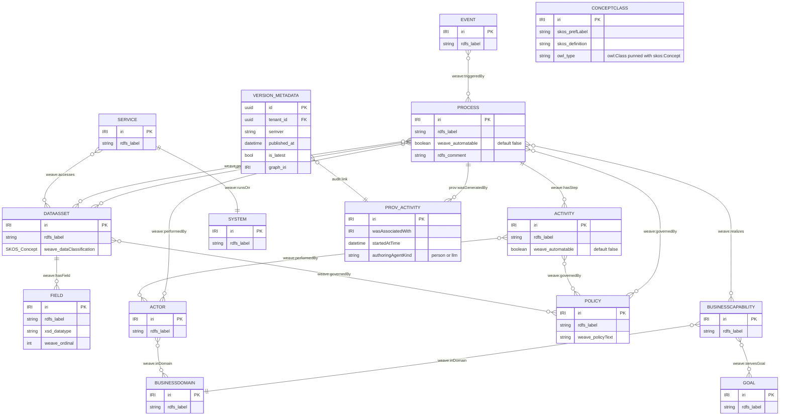
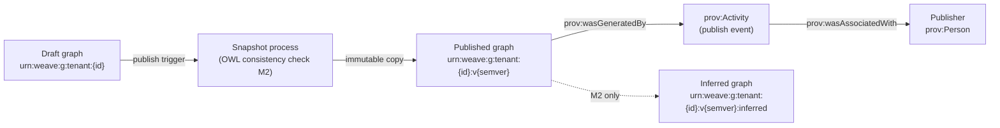
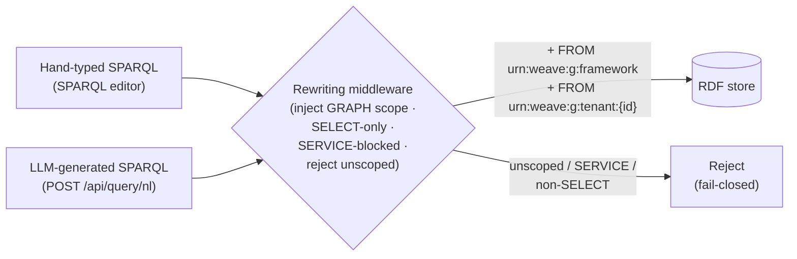

# Constitution Engine — Data Model (M1)

**Graph edges:**

- Engine spec: [constitution-engine.md](../../../constitution-engine.md)
- Contracts (canonical): [contracts.md](../../../../contracts.md)
- ADR-001 (tenant isolation): [ADR-001-tenant-isolation.md](../../../../decisions/ADR-001-tenant-isolation.md)
- ADR-002 (authority extension): [ADR-002-authority-extension.md](../../../../decisions/ADR-002-authority-extension.md)
- Standards: [rbac-multi-tenancy.md](../../../../../../standards/rbac-multi-tenancy.md) ·
  [semantic-web.md](../../../../../../standards/semantic-web.md) ·
  [audit-immutability.md](../../../../../../standards/audit-immutability.md)

---

## Overview

The Constitution Engine's primary datastore is an RDF knowledge graph, not a relational schema.
Every domain entity (BPMO kind, SHACL shape, provenance record, version snapshot) is expressed as
named triples partitioned into tenant-isolated named graphs. Aurora PostgreSQL plays a thin supporting
role: it holds version metadata rows and snapshot pointers that the REST layer joins against without
issuing SPARQL.

This document specifies:

1. The named-graph scheme (isolation contract — ADR-001).
2. The 13 BPMO kinds as OWL classes with their key predicates (RDF/OWL mapping).
3. The SHACL validation layer and the validate-before-commit pattern.
4. PROV-O provenance entities.
5. Version and snapshot entities (CE-VERSION-1, CE-DIFF-1).
6. The single query path (rewriter → isolation invariant).
7. The Actor → holdsRole → Role split (ONT-4) and M1 authority degrade.
8. ONT-6: is-a hierarchy disambiguation.
9. The minimal Aurora layer (version metadata, snapshot pointers).

M1 surface: CE-READ-1 / CE-WRITE-1 / CE-DIFF-1 / CE-VERSION-1 spine + NL→SELECT.
M2+ items are collected in the Deferred section at the end.

---

## Named-Graph Scheme

The graph scheme is the isolation contract. It is canonical and binding on every engine.
Source: [ADR-001](../../../../decisions/ADR-001-tenant-isolation.md).

> **IRI-scheme note (arch assumption).** ADR-001 defines three graphs. Published-version and
> inferred graphs (FR-008, FR-028) extend that scheme coherently: `urn:weave:g:tenant:{id}` is the
> mutable draft/working graph; published snapshots carry `:v{semver}`; per-version inferred triples
> carry `:v{semver}:inferred`. The rewriter always reads `framework ∪ tenant:{id}`; a pinned
> `?version=<semver>` query binds `framework ∪ tenant:{id}:v{semver}` instead. Confirm in the
> production-store decision (OQ-02).

| Named graph | IRI pattern | Mutable | Written by | Read by |
|---|---|---|---|---|
| Shared BPMO framework | `urn:weave:g:framework` | No (release-gated) | Weave release only | All tenants (read-only) |
| Tenant draft (working) | `urn:weave:g:tenant:{id}` | Yes | `CE-WRITE-1` + connector path | That tenant only |
| Tenant published version | `urn:weave:g:tenant:{id}:v{semver}` | No (immutable) | Publish pipeline | That tenant only |
| Tenant inferred (per version) | `urn:weave:g:tenant:{id}:v{semver}:inferred` | No | Publish-time reasoner | That tenant only |
| Tenant provenance | `urn:weave:g:tenant:{id}:prov` | Append-only | Every CE-WRITE-1 commit | That tenant + audit layer |

**Framework graph is the SSOT** for the BPMO upper ontology, SHACL framework shapes, and SKOS
concept-scheme scaffolding. Tenant graphs extend it; they never copy or redefine it.

**Cross-tenant invariant:** no query — with or without an explicit `GRAPH` clause — may return
another tenant's triples. Test contract: see [rbac-multi-tenancy.md §cross-tenant-read
test](../../../../../../standards/rbac-multi-tenancy.md).

**Connector-write isolation:** a connector ingest job carries the request-context tenant ID;
CE-WRITE-1 derives the target graph (`urn:weave:g:tenant:{id}`) from the request context, not from
the payload. A payload naming another tenant's graph is rejected with HTTP 403 and audited.

---

## BPMO Conceptual Model (erDiagram)

The diagram shows the 13 BPMO kinds and their key structural relationships. Predicates are listed in
the next section; cardinality notation here is conceptual, not a relational key constraint.



---

## BPMO Kinds — OWL Class Mapping

All 13 kinds live in `urn:weave:g:framework` as `owl:Class` declarations. Tenant-created subclasses
and instances live in `urn:weave:g:tenant:{id}`.

| BPMO Kind | OWL class IRI | ArchiMate layer | Punned with | Key `rdfs:` / SHACL properties |
|---|---|---|---|---|
| Process | `weave:Process` | Business | — | `rdfs:label`, `weave:automatable`, `rdfs:comment` |
| Activity | `weave:Activity` | Business | — | `rdfs:label`, `weave:automatable`; `rdfs:subClassOf weave:Process` optional |
| Event | `weave:Event` | Business | — | `rdfs:label`, `weave:eventType` (SKOS) |
| DataAsset | `weave:DataAsset` | Application/Data | — | `rdfs:label`, `weave:dataClassification` |
| Field | `weave:Field` | Application/Data | — | `rdfs:label`, `xsd:datatype`, `weave:ordinal` |
| System | `weave:System` | Technology | — | `rdfs:label`, `rdfs:comment` |
| Service | `weave:Service` | Application | — | `rdfs:label`, `rdfs:comment` |
| BusinessCapability | `weave:BusinessCapability` | Strategy | — | `rdfs:label`, `rdfs:comment` |
| BusinessDomain | `weave:BusinessDomain` | Business | — | `rdfs:label`, `rdfs:comment` |
| Policy | `weave:Policy` | Motivation | — | `rdfs:label`, `weave:policyText`, `weave:complianceRef` |
| Goal | `weave:Goal` | Motivation | — | `rdfs:label`, `weave:goalStatement` |
| Actor | `weave:Actor` | Business | — | `rdfs:label`, `weave:actorType` (SKOS) |
| Concept / Class | `weave:ConceptClass` | All | `skos:Concept` (decision B1) | `skos:prefLabel`, `skos:definition`, `skos:altLabel`, `skos:broader` |

**Punning rule (decision B1):** `weave:ConceptClass` (and any client-defined subclass that is also a
glossary term) carries both `owl:Class` and `skos:Concept` as its `rdf:type`. A single URI is the
structural class and its business-glossary term. No separate linking property. SHACL validation runs
with `inference='none'` so DL-completeness is not load-bearing on the validation gate.
See [semantic-web.md §class-concept-identity](../../../../../../standards/semantic-web.md).

**`weave:automatable`** is a `owl:DatatypeProperty`, range `xsd:boolean`, default `false`. Its
SHACL shape (`weave:AutomatableShape`) lives in the tenant's shapes graph, owned and enforced by CE.
Events reads it as a safety hinge for `EA-AUTOMATION-1` — absent ⟹ route-to-human.

**`weave:dataClassification`** is an `owl:ObjectProperty` whose range is the
`weave:DataClassificationScheme` SKOS concept scheme (`public / internal / confidential / restricted`).
Aligned to DPV via `skos:exactMatch` (ADR-002 data-classification direction); full DPV import deferred.

---

## BPMO Relationship Predicates

All predicates are `owl:ObjectProperty` declarations in `urn:weave:g:framework`.

| Predicate IRI | Domain | Range | Inverse | ArchiMate rel |
|---|---|---|---|---|
| `weave:hasStep` | `weave:Process` | `weave:Activity` | `weave:stepOf` | Composition |
| `weave:precedes` *(added v1 — E12-S2 step ordering)* | `weave:Activity` | `weave:Activity` | `weave:follows` | Flow (BPMN `sequenceFlow`) |
| `weave:performedBy` | `weave:Process` or `weave:Activity` | `weave:Actor` | `weave:performs` | Assignment |
| `weave:consumes` | `weave:Process` or `weave:Activity` | `weave:DataAsset` | `weave:consumedBy` | Access |
| `weave:produces` | `weave:Process` or `weave:Activity` | `weave:DataAsset` | `weave:producedBy` | Access |
| `weave:triggeredBy` | `weave:Process` | `weave:Event` | `weave:triggers` | Triggering |
| `weave:realizes` | `weave:Process` | `weave:BusinessCapability` | `weave:realizedBy` | Realization |
| `weave:servesGoal` | `weave:BusinessCapability` | `weave:Goal` | `weave:goalServedBy` | Influence |
| `weave:inDomain` | `weave:BusinessCapability` or `weave:Actor` | `weave:BusinessDomain` | `weave:hasMember` | Association |
| `weave:governedBy` | `weave:Process` or `weave:DataAsset` or `weave:Activity` | `weave:Policy` | `weave:governs` | Association |
| `weave:runsOn` | `weave:Service` | `weave:System` | `weave:hosts` | Serving |
| `weave:accesses` | `weave:Service` | `weave:DataAsset` | `weave:accessedBy` | — (modelled directly; ArchiMate `Access` imports map to consumes/produces — v1-delta §3) |
| `weave:dependsOn` | `weave:Process` or `weave:Service` | `weave:Service` or `weave:System` | — | Association |
| `weave:hasField` | `weave:DataAsset` | `weave:Field` | `weave:fieldOf` | Composition |
| `weave:hasCapability` | `weave:BusinessDomain` | `weave:BusinessCapability` | `weave:inDomain` | Aggregation |
| `weave:describes` | Any | Any | — | Association |
| `weave:partOf` | Any | Any | `weave:hasPart` | Composition |
| `skos:broader` | `skos:Concept` | `skos:Concept` | `skos:narrower` | Navigational (see ONT-6) |
| `skos:related` | `skos:Concept` | `skos:Concept` | `skos:related` | Associative |

**`governedBy` → `Policy` semantics:** a `Policy` individual holds human-readable `weave:policyText`.
It is a *described* rule, not a machine-evaluable constraint. SHACL shapes are the machine-enforceable
constraint layer. Consumers MUST NOT assume machine-enforceable authority from a `governedBy` edge
alone (see CE-READ-1 in [contracts.md](../../../../contracts.md)).

---

## RDF/OWL Mapping

This section maps each domain concept to its W3C vocabulary term. Reuses open vocabulary; no invented
term where a standard exists (ADR-002 principle).

| Domain concept | Maps to | Vocabulary | Notes |
|---|---|---|---|
| BPMO kind (structural type) | `owl:Class` | OWL 2 DL | In `urn:weave:g:framework` |
| BPMO kind (business glossary term) | `skos:Concept` | SKOS | Punned on same IRI (B1) |
| Relationship predicate | `owl:ObjectProperty` | OWL 2 DL | In `urn:weave:g:framework` |
| Data property | `owl:DatatypeProperty` | OWL 2 DL | In `urn:weave:g:framework` |
| SHACL node shape | `sh:NodeShape` | SHACL | In tenant shapes graph |
| SHACL property shape | `sh:PropertyShape` | SHACL | In tenant shapes graph |
| Authoring activity | `prov:Activity` | PROV-O | In `urn:weave:g:tenant:{id}:prov` |
| Authoring agent (human) | `prov:Person` | PROV-O | Via `prov:wasAssociatedWith` |
| Authoring agent (LLM) | `prov:SoftwareAgent` | PROV-O | Via `prov:wasAssociatedWith` |
| Authored/mutated entity | `prov:Entity` | PROV-O | Via `prov:wasGeneratedBy` |
| Published version graph | `owl:Ontology` (optional) | OWL | IRI = `urn:weave:g:tenant:{id}:v{semver}` |
| Data classification level | `skos:Concept` in `weave:DataClassificationScheme` | SKOS + DPV | `skos:exactMatch` to DPV term |
| Business vocabulary term | `skos:Concept` in `weave:BusinessGlossaryScheme` | SKOS | One `prefLabel` per language |
| Role (ONT-4 split, M1 structural) | `weave:Role` | OWL / Weave | `weave:holdsRole (Actor → Role)` |

**Turtle prefix conventions** (canonical — see [semantic-web.md](../../../../../../standards/semantic-web.md)):

```turtle
@prefix weave: <https://weave.io/ontology/> .
@prefix sh:    <http://www.w3.org/ns/shacl#> .
@prefix prov:  <http://www.w3.org/ns/prov#> .
@prefix skos:  <http://www.w3.org/2004/02/skos/core#> .
@prefix owl:   <http://www.w3.org/2002/07/owl#> .
@prefix rdfs:  <http://www.w3.org/2000/01/rdf-schema#> .
@prefix xsd:   <http://www.w3.org/2001/XMLSchema#> .
```

---

## SHACL Validation Layer

SHACL is the closed-world data-quality gate. OWL 2 DL carries open-world class semantics; SHACL
enforces cardinality, datatype, and structural constraints. These never duplicate each other
("Polikoff rule", CE PRD §7).

### Shape locations

| Shape set | Graph location | Who writes | Scope |
|---|---|---|---|
| Framework shapes (BPMO base) | `urn:weave:g:framework` | Weave release | All tenants |
| Tenant custom shapes | `urn:weave:g:tenant:{id}` (shapes subgraph) | `CE-WRITE-1` (author-shapes role) | That tenant only |

Tenant custom shapes MUST NOT affect any other tenant. A cross-tenant shape-leak test is a required
release gate. See [rbac-multi-tenancy.md](../../../../../../standards/rbac-multi-tenancy.md).

Shape cache invalidation is **external** (Redis/ElastiCache) so a shape added on one worker is
effective on all workers on the next request.

### Severity routing

| SHACL severity | HTTP response | Effect on graph |
|---|---|---|
| `sh:Violation` | 422 Unprocessable Entity | Graph unchanged |
| `sh:Warning` | 200/201 (advisory) | Commit proceeds; warnings surfaced |
| `sh:Info` | 200/201 (advisory) | Commit proceeds; info surfaced |

### Validate-before-commit pattern

This is the core mutation invariant for CE-WRITE-1 (FR-003, FR-004). It is the single most
complex mechanism in the data layer.

```
# Illustrative — not prescriptive. Logic is engine-internal, not a public API.
def apply_operations(ops, actor, target_graph, shapes_graphs):
    clone = store.clone(target_graph)          # throwaway copy
    clone.apply_batch(ops)                     # mutate the clone
    report = shacl.validate(
        data_graph=clone,
        shapes_graphs=shapes_graphs,
        inference='none'                       # B1: inference disabled on validation gate
    )
    if report.has_violation():
        raise Http422(violations=report.violations)   # real graph unchanged
    store.commit(target_graph, ops)            # only reached if zero sh:Violation
    prov.stamp(actor, ops, target_graph)       # PROV-O activity in :prov graph
    audit.emit(actor, ops, target_graph)       # PLAT-AUDIT-1 append
```

**Key invariants** (every line is testable):

- `inference='none'` on every SHACL gate call (decision B1; grep-enforced).
- Clone is throwaway: any exception before `store.commit` leaves the real graph untouched.
- PROV-O stamp and PLAT-AUDIT-1 emit both happen on commit; a failed audit emit is retried and
  logged; a commit is never recorded as audited when its emit failed (FR-006).
- The legacy `POST /api/llm/mutate` auto-apply path is forbidden; CI asserts it is absent.

**Node identity and dedup:** `CE-WRITE-1` resolves new-node `ref` labels to real IRIs within the
same batch. Duplicate-IRI creates (case-insensitive `label + kind` match) reuse the existing node;
they are not an error. Callers may supply an idempotency key.

---

## PROV-O Provenance

Every commit produces a provenance record in `urn:weave:g:tenant:{id}:prov`. PROV-O records are
append-only — deletion is not an available operation for any principal, including admin. Reference:
[audit-immutability.md](../../../../../../standards/audit-immutability.md).

**Core PROV-O entities per commit:**

| PROV-O entity | Type | Key predicates |
|---|---|---|
| Activity | `prov:Activity` | `prov:startedAtTime`, `prov:endedAtTime`, `prov:wasAssociatedWith` |
| Human approver | `prov:Person` | Identity IRI from PLAT-IDENTITY-1 |
| LLM authoring agent | `prov:SoftwareAgent` | `prov:wasAssociatedWith` on the activity |
| Mutated entity | `prov:Entity` | `prov:wasGeneratedBy` → the activity |
| Source document (ingest) | `prov:Entity` | `prov:used` → the activity (FR-038) |

**Dual-write requirement (FR-006):** every commit that writes to PROV-O also emits an entry to
`PLAT-AUDIT-1` (platform immutable log). The PROV-O record is the semantic-model provenance; the
PLAT-AUDIT-1 entry is the platform-level tamper-evident log. They are two complementary records,
not alternatives. Audit emit failure is retried; a commit is never recorded as audited on failure.

**Human-vs-AI authorship distinction:**

- LLM-proposed operations: `prov:wasAssociatedWith` → a `prov:SoftwareAgent` IRI.
- Human approver: a second `prov:wasAssociatedWith` → `prov:Person` IRI from PLAT-IDENTITY-1.
- A commit that was AI-proposed and human-approved records both agents on the same activity.

---

## Version and Snapshot Entities

Supports CE-VERSION-1 (version metadata) and CE-DIFF-1 (server-side diff).

### Draft → published lifecycle



Published graphs are immutable. After `v1.3.0` is published, every `v1.x.x` graph is byte-identical
to its pre-publish state (FR-008). The publish pipeline writes to `version_metadata` (Aurora) and
produces a PROV-O publish activity.

### CE-DIFF-1 computation

`GET /api/ontology/diff?from=v1&to=v2` is computed server-side by querying both named graphs and
computing the symmetric difference at node and edge level. An edge-only change (predicate added or
removed between two existing nodes) appears as a `modified` entry, not only as `added`/`removed`.

### CE-VERSION-1 canonical lag

Canonical version-lag = count of published versions strictly between a consumer's pinned version IRI
and the current `is_latest`. Consumers read this from `GET /api/ontology/versions`; they never
re-implement the computation. "Stale" threshold default = lag ≥ 2 (tunable via PLAT-SETTINGS-1).

---

## Query Path and Tenant Isolation

### Single rewriter — the only query path

Every SPARQL string — regardless of origin (user-typed, LLM-generated via `POST /api/query/nl`,
system-internal, connector-triggered) — passes through a single rewriting middleware before reaching
the store. No code may issue a raw store query. This invariant is grep-enforced in CI (ADR-001).



**NL→SELECT invariant:** the LLM-generated SPARQL query is NOT a separate code path and does NOT
bypass SSRF protection. It passes through the identical rewriter/validator as a hand-typed query.
There is exactly one SELECT-only + SERVICE-blocked validator between any SPARQL string and the
store. See [CE-READ-1 note in contracts.md](../../../../contracts.md).

### SPARQL surface constraints

See [rbac-multi-tenancy.md §RDF layer](../../../../../../standards/rbac-multi-tenancy.md) for the
full enforcement contract. Summary:

- SELECT-only: UPDATE / INSERT / DELETE rejected before reaching the store.
- `SERVICE` keyword blocked (SSRF vector) — rejected before reaching the store.
- Paginated: no silent row cap; `page` parameter drives cursor-based pagination.
- Writes never go through SPARQL Update; they go only through `CE-WRITE-1`.

### `?version=` binding

A `?version=<semver|latest>` query parameter binds the query's default graph to
`urn:weave:g:tenant:{id}:v{semver}` (plus `framework`). `version=latest` resolves to the newest
published version at query time. Unknown version → 404 (never a silent fall-through to draft).

---

## Actor → holdsRole → Role Split (ONT-4)

Source: [ADR-002](../../../../decisions/ADR-002-authority-extension.md).

The base BPMO `weave:Actor` conflated *who* with *the role they act in*. ONT-4 introduces `weave:Role`
and the predicate `weave:holdsRole`, so the authority chain is resolvable:

```
weave:Actor —weave:holdsRole→ weave:Role —(odrl:assignee of)→ odrl:Permission —(odrl:target)→ resource
```

**M1 structural model:**

| OWL entity | IRI | Lives in | Purpose |
|---|---|---|---|
| `weave:Actor` | `weave:Actor` | `urn:weave:g:framework` | A person, role-holder, or service-account identity |
| `weave:Role` | `weave:Role` | `urn:weave:g:framework` | The role an actor acts in (new — ONT-4) |
| `weave:holdsRole` | `weave:holdsRole` | `urn:weave:g:framework` | `Actor → Role` predicate |

Clients populate `Actor` and `Role` instances in their tenant graph. The full ODRL permission chain
(`odrl:Permission`, `odrl:action`, `odrl:target`, `odrl:constraint`) is the Authority Extension
module — **deferred post-v1** ([ADR-013](../decisions/ADR-013.md); program ADR-002 fixes the
vocabulary direction, its M2 build phasing is superseded). The binding points (where the extension
plugs in) are defined here; the module itself is in the Deferred section.

### Honest authority degrade (M1/M2 standing behaviour)

While the Authority Extension is not populated (always, until post-v1 — ADR-013),
`authority(actor, action, target)` degrades:

1. It returns `decision: "coverage-gap"` with explicit `{ entity_iri, missing_link }` rows for every
   required link that is absent in the graph.
2. Unstated permission resolves to `decision: "deny"` / route-to-human.
3. `decision: "permit"` is unreachable — the base BPMO cannot express a permission. (Explicit-deny
   override arrives with the post-v1 extension's `odrl:Prohibition`; until then it is vacuous.)
4. An empty result NEVER means "permitted" — the API contract guarantees a `coverage-gap` or `deny`.

The `coverage_gap` SELECT ships M1 (default invocation `(Process, [performedBy, governedBy])`, per
CE-READ-1). M2 ships base-links `authority()` / `escalation()` at this degrade (m2/tasks/TASK-010);
extension-resolved authority (Role/Permission chains, deadlines) is post-v1 (ADR-013). Reference:
[CE-READ-1 — contracts.md §authority scope](../../../../contracts.md).

---

## ONT-6 — Is-a Hierarchy: rdfs:subClassOf vs skos:broader

> **ONT-6:** An agent, reasoner, or traversal query that asks "is X a kind of Y?" MUST use
> `rdfs:subClassOf` as the formal is-a axis, NOT `skos:broader`.

| Predicate | Semantics | Who uses it | Example |
|---|---|---|---|
| `rdfs:subClassOf` | Formal, transitive, set-theoretic containment. Every instance of a subclass is an instance of the superclass. Used by OWL reasoning, SHACL `sh:targetClass` inheritance, and agent graph-traversal queries. | OWL reasoner, SHACL engine, CE query patterns, SDK type generation (BE-SDK-1) | `weave:ContractReview rdfs:subClassOf weave:Process` |
| `skos:broader` | Navigational / thematic hierarchy. Asserts one concept is "broader in scope" than another, but carries no formal set-membership semantics. Used for glossary browsing and concept-scheme navigation only. | UI hierarchy trees, SKOS concept-scheme navigation | `weave:ContractReview skos:broader weave:LegalProcess` |

**Rule:** a client MUST NOT use `skos:broader` to express "is a subtype of" in an OWL class
hierarchy. Adding `skos:broader` does not make instances of a class instances of the broader concept
class under OWL semantics.

**Punning note (B1):** a punned resource (`owl:Class` + `skos:Concept`) may carry both
`rdfs:subClassOf` (structural) and `skos:broader` (navigational). These are orthogonal; they need
not agree. See [semantic-web.md §SKOS](../../../../../../standards/semantic-web.md).

---

## Aurora Minimal Layer

Aurora PostgreSQL holds only what SPARQL cannot efficiently join or what the REST layer needs without
a graph query. All tenant-scoped Aurora tables carry `tenant_id` with row-level-security enforced at
the base query layer (never ad-hoc per query). See
[rbac-multi-tenancy.md §Aurora](../../../../../../standards/rbac-multi-tenancy.md).

### version_metadata

Holds one row per published version per tenant. The source of truth for `GET /api/ontology/versions`
and the version-lag computation (CE-VERSION-1).

| Column | Type | Constraints | Description |
|---|---|---|---|
| `id` | UUID | PK, auto | Internal row identifier |
| `tenant_id` | UUID | FK, NOT NULL, RLS | Tenant isolation key |
| `semver` | text | NOT NULL, unique per tenant | e.g. `1.2.0` |
| `version_iri` | text | NOT NULL | `urn:weave:g:tenant:{id}:v{semver}` |
| `published_at` | timestamptz | NOT NULL | Wall-clock publish time |
| `is_latest` | boolean | NOT NULL, default false | At most one true per tenant |
| `published_by` | text | NOT NULL | PLAT-IDENTITY-1 principal IRI |
| `prov_activity_iri` | text | NOT NULL | The PROV-O publish activity IRI |

**Indexes:** `(tenant_id, is_latest)` for `?version=latest` resolution; `(tenant_id, semver)` for
version lookups.

### snapshot_pointer

Holds one row per named graph produced by a publish (data, inferred). Used by the publish pipeline
to track what was written and to validate immutability.

| Column | Type | Constraints | Description |
|---|---|---|---|
| `id` | UUID | PK, auto | Internal row identifier |
| `tenant_id` | UUID | FK, NOT NULL, RLS | Tenant isolation key |
| `version_id` | UUID | FK → version_metadata.id | Which published version |
| `graph_iri` | text | NOT NULL | Full IRI of the named graph |
| `graph_kind` | text | NOT NULL | `data` / `inferred` / `prov` |
| `triple_count` | bigint | NOT NULL | Size at publish time (for diff diagnostics) |
| `sha256_digest` | text | NULL | Optional integrity digest for immutability audit |

**RLS note:** both tables enforce `tenant_id = current_setting('weave.tenant_id')` at the database
level, in addition to the application-layer scope injection. A missing `tenant_id` in the query
context causes the predicate to evaluate to NULL, returning zero rows (fail-closed).

---

## Deferred (M2+)

The following are **explicitly out of scope for M1**. They bind to the structural binding points
defined above but are not implemented until M2 or later.

| Entity / capability | Placeholder in M1 | M2+ specification |
|---|---|---|
| **ODRL Permission / Prohibition / Duty module** (Authority Extension) — **post-v1, ADR-013** | `Actor→holdsRole→Role` split exists; `odrl:assignee` binding point defined | Full ODRL 2.2 permission/duty graph; extension-resolved `authority()` (permit reachable, explicit-deny override) |
| **`authorityLevel` SKOS ordered collection** — **post-v1, ADR-013** | `weave:DataClassificationScheme` exists | `skos:OrderedCollection` of `read ≺ author ≺ publish ≺ admin`; RBAC boundary reads ontology-derived levels |
| **HITL triggers / escalation deadlines** — **post-v1, ADR-013** | `weave:automatable` boolean + `escalation()` SELECT | `odrl:Duty` "obtain human approval"; `escalatesTo`, `escalationDeadline`, `triggeredByStep` properties |
| **OWL inference materialisation** | Consistency check at publish (FR-007, M1) | Per-version inferred named graphs; inferred triples labelled as `prov:wasDerivedFrom` |
| **CE-BRAND-1 brand individuals** | Brand content storable via CE-WRITE-1 | `GET /api/brand/tokens` projection + `VoiceRule` conformance gate |
| **CE-FUNCTION-1 function registry** | Registry schema defined in contracts.md | Populated + queryable; typed SDK bindings generated |
| **CE-METRICS-1 aggregate metrics** | Basic count queries available | `GET /api/metrics/ontology` endpoint live |
| **R2RML / RML ingest mapping layer** | Materialised-copy write path exists (CE-WRITE-1) | Mapping authoring, storage, execution engine (FR-041) |
| **Virtual-graph SPARQL→SQL federation** | Explicitly out of v1 scope (OQ-17) | Pending ADR — do not implement in M1 |
