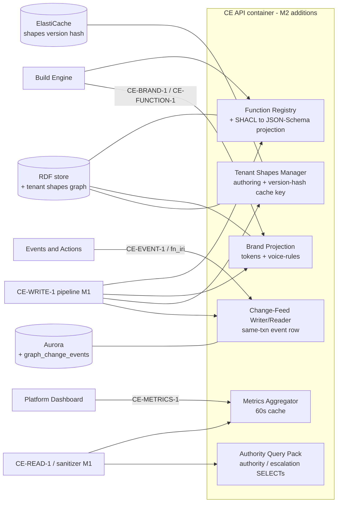

# Constitution Engine — M2 Tech-Spec Delta

**Scope rule:** this document contains ONLY what changes from M1. `architecture.md`,
`data-model.md`, `business-process.md`, and `testing-strategy.md` remain authoritative for
everything not restated here. Contract shapes are canonical in
[`contracts.md`](../../../contracts.md) — this delta cites them, never redefines them.
Decisions: [ADR-008](../decisions/ADR-008.md) (CE-EVENT-1 transport),
[ADR-009](../decisions/ADR-009.md) (CE-FUNCTION-1 typing model).

## 1. Performance thresholds — OQ-13 CLOSED

SPIKE-CE-PERF-1 (CE-TASK-008, done) plus the standing `ce-perf` CI gate confirm the M1 budgets on
a seeded store. Latest main-branch measurement: **write p95 717 ms** (≤ 800 ms budget) after the
metric-emit fix (commits `f49d9c4`, `21e448c`).

| Metric | 10k triples | 100k triples | 500k triples | Status |
|---|---|---|---|---|
| CE-WRITE-1 single-op p95 | ≤ 800 ms | ≤ 800 ms | ≤ 2000 ms | Confirmed (CI-gated) |
| Paginated SELECT p95 (worst query) | ≤ 300 ms | ≤ 300 ms | ≤ 1000 ms | Confirmed (CI-gated) |
| NL query p95 | ≤ 500 ms | ≤ 500 ms | — | M1 gate measurement |

- The PRD §2.2 "UNVERIFIED (OQ-13)" tags are resolved: thresholds hold at 10k–100k; 500k runs at
  the relaxed thresholds above (benchmark `THRESHOLDS_MS`). The SHACL shapes-graph-size figure is
  re-derived per §3 (tenant shapes merge adds shapes; the < 2 s prospective-validation budget is
  re-asserted by an M2 perf case with governance shapes loaded).
- **Human sign-off** for the spike rides the M1 program gate (currently AMEND). Build tasks must
  not start until that gate is green; this delta and M2 decomposition are unaffected.

## 2. Named-graph delta (extends data-model.md §graph table)

One new named graph; everything else unchanged.

| Graph | IRI | Mutable | Written by | Visible to |
|---|---|---|---|---|
| Tenant governance shapes | `urn:weave:g:tenant:{id}:shapes` | Yes | CE-WRITE-1 (shape ops) | That tenant only |

- Framework SHACL shapes stay in `urn:weave:g:framework` (release-gated). Validation merges
  framework shapes + the tenant's shapes graph — never another tenant's (ADR-001 fail-closed
  query-rewriting applies to the shapes graph exactly as to data graphs).
- New M2 individuals and where they live: SKOS glossary punned class+concept resources,
  brand/voice individuals, and `weave:Function` registry individuals all live in the tenant draft
  graph `urn:weave:g:tenant:{id}` (published via the existing version pipeline). Tenant-authored
  `sh:NodeShape`/`sh:PropertyShape` live in the shapes graph above.

## 3. Tenant-scoped governance shapes (EPIC-005)

- **Authoring path:** NL description → AI-generated `sh:NodeShape`/`sh:PropertyShape` → human
  review → CE-WRITE-1 commit into the tenant shapes graph with PROV-O (LLM extractor + human
  approver). No second mutation path.
- **Enforcement:** the validate-before-commit pipeline (M1, EPIC-006) now loads
  framework shapes ∪ tenant shapes. Severity semantics unchanged (`sh:Violation` blocks 422;
  `sh:Warning`/`sh:Info` advisory).
- **Cross-worker cache invalidation (FR-025):** validation caches key on
  `(tenant_id, shapes_graph_version_hash)`. A shape commit bumps the hash (one Redis/ElastiCache
  key per tenant); every worker's next validation misses the stale key — no pub/sub, no broadcast.
  <!-- ponytail: version-keyed cache, not pub/sub invalidation; upgrade to pub/sub only if
       hash-lookup-per-validation ever shows in the perf trace -->
- **Security sub-gate:** the cross-tenant shape-leak test (tenant-A shape must not affect
  tenant-B commits) is a release-gating integration test, same rank as ADR-001's isolation test.
- `weave:automatable` (SS-EA-4): shipped as one framework-defined `owl:DatatypeProperty` +
  `weave:AutomatableShape` enforced from the tenant shapes graph; default absent ⟹
  route-to-human. Data model already specifies it (data-model.md §BPMO data properties) — M2 only
  turns the shape on.

## 4. CE-BRAND-1 projection (EPIC-004)

- Brand standards and VoiceRules are governed RDF individuals in the tenant graph (a
  brand-standard class + `weave:VoiceRule` individuals), written via CE-WRITE-1, SHACL-validated,
  PROV-O-stamped, versioned with the graph.
- `GET /api/brand/tokens` and `GET /api/brand/voice-rules` are **derived projections** computed
  from the individuals — same derivation rule as the CE-FUNCTION-1 JSON Schema (§6): derived on
  read (cacheable by graph version), never hand-edited, never stored as a second source of truth.
- An individual that fails its SHACL shape is blocked at commit (422) and therefore can never
  appear in a projection; the projection code does not re-filter.
- Conformance score formula and pass bar are canonical in contracts.md (CE-BRAND-1) — the gate
  itself is Build's to run; CE only serves the rules.
- E4-S2 AI VoiceRule extraction is Should-Have; manual form entry is the Must floor. AI
  unavailable ⟹ 503 on the extraction surface only, forms stay live.

## 5. CE-EVENT-1 change-feed (ADR-008)

Aurora table `graph_change_events` (tenant RLS, same pattern as `ontology_versions`):

| Column | Type | Constraints |
|---|---|---|
| `seq` | bigint | per-tenant monotonic (PK with `tenant_id`) |
| `tenant_id` | UUID | FK, NOT NULL, RLS |
| `change_type` | text | `added\|updated\|deleted\|constraint-violated` |
| `entity_iri` | text | NOT NULL |
| `version_iri` | text | NULLABLE — real CE-VERSION-1 IRI on publish events; **null on draft commits** (version IRIs and graph IRIs are different namespaces; a dereferenced `version_iri` must never yield a draft graph IRI) |
| `last_published_version` | text | NULLABLE — last published CE-VERSION-1 IRI at event time; null if the tenant has never published |
| `actor` | text | PLAT-IDENTITY-1 principal IRI |
| `ts` | timestamptz | NOT NULL |

- Row written **in the same transaction** as the CE-WRITE-1 commit. Exception:
  `constraint-violated` (the mutation rolled back) writes in its own transaction — the one place
  same-txn does not apply.
- `GET /api/events?since_seq={n}&limit={m}` → ordered events + `latest_seq`; aged-out cursor
  (retention 30 d, tunable) ⟹ `410 Gone`, re-baseline via CE-READ-1.
- Append-only enforced at the DB level (no UPDATE/DELETE grants), mirroring PLAT-AUDIT-1's
  constraint style. This feed is **not** the audit log — PLAT-AUDIT-1 remains the system of
  record; the feed is a consumer-delivery surface with finite retention.

## 6. CE-FUNCTION-1 registry (ADR-009)

- RDF model: `weave:Function` individual in the tenant graph; parameters/return reference BPMO
  kind IRIs + optional `sh:NodeShape`. Defined/revised via CE-WRITE-1 only.
- CE owns the **signature-subset SHACL→JSON-Schema converter** (not a general translator).
  `GET /api/functions/{iri}` returns RDF-level signature + derived JSON Schema;
  `GET /api/functions` returns the list shape incl. `status` and `breaking` (contracts.md).
- Versioning = CE-VERSION-1 (no per-function lineage); immutable-in-place + fail-closed breaking
  taxonomy per ADR-009; `breaking:true` means "this version vs the previous published version".
- **Mandatory test:** projection round-trip — for each seeded function, the derived JSON Schema
  accepts exactly the node set its SHACL shape accepts (positive + negative fixtures).
- M2 = surface complete; nothing about executing a function is M2 (pinned in contracts.md).

## 7. CE-METRICS-1 + full validation report

- `GET /api/metrics/ontology` → shape per contracts.md (`entity_count_by_kind, latest_version,
  draft_published_delta, shacl_errors_by_severity, owl_inconsistencies`). Implementation: SPARQL
  aggregate SELECTs + Aurora version rows, cached 60 s per tenant (stale metrics are harmless;
  the dashboard is not a consistency surface). `owl_inconsistencies` reports the publish-time
  reasoner result stored with the version — no live reasoning. **Until the post-v1 reasoner
  ships (EPIC-008) no producer for this metric exists**: serve an explicit
  `{ "pending": true }`-style not-computed marker (same honesty rule contracts.md pins for
  `shacl_errors_by_severity`) — never zeros, which would read as "no inconsistencies".
- `GET /api/validate` (FR-027) → full tenant-scoped SHACL report (violations/warnings/info) for a
  named version or draft; bad version ⟹ 404; no JWT ⟹ 401.

## 8. Agent-grounding authority patterns (E7-S4 — M2 base-links descope, ADR-013)

- Two shipped, parameterised, named SELECT patterns over CE-READ-1 (no new contract):
  `authority(actor, action, target)` and `escalation(process)` (query skeletons ported from obpm
  `mi-agent-model.ttl`), answering from the **base links only** — `governedBy` / `performedBy` /
  `accesses` — and Policy individuals. **No ODRL/Authority-Extension resolution in M2**
  ([ADR-013](../decisions/ADR-013.md)): permission chains, explicit-deny override,
  `authorityLevel`, and escalation deadlines are post-v1.
- Safety semantics (load-bearing): responses use the CE-READ-1 convention
  `{ rows, decision: "permit"|"deny"|"coverage-gap" }`; unstated permission ⟹ **deny /
  route-to-human** (default, tunable per tenant/domain via the PLAT-SETTINGS-1 cascade); missing
  required link ⟹ explicit coverage-gap rows `{ entity_iri, missing_link }`, never an empty
  result readable as "permitted". **In M2 `decision` is never `"permit"`** — the base BPMO
  cannot express a permission. Same fail-closed family as M1's `coverage_gap` (default
  invocation `(Process, [performedBy, governedBy])`) — extend that implementation, do not
  fork it.
- Patterns run through the existing SELECT-only/`SERVICE`-blocked/paginated sanitizer (B3) —
  one guardrail, shared.
- The framework competency-question set (FR-037) ships as named queries over the same surface;
  onboarding flags a client with < 2 declared domain competency questions.

## 9. Endpoint targets (Arch Law 2) and page targets (Arch Law 3)

All at 100k-triple seeded store, measured like §1.

| New M2 endpoint | p95 target |
|---|---|
| `GET /api/events` | ≤ 200 ms (indexed Aurora range scan) |
| `GET /api/functions` | ≤ 300 ms |
| `GET /api/functions/{iri}` | ≤ 400 ms (includes projection derivation, cacheable by version) |
| `GET /api/brand/tokens` · `GET /api/brand/voice-rules` | ≤ 400 ms (same derivation rule) |
| `GET /api/metrics/ontology` | ≤ 500 ms cold / ≤ 100 ms cached |
| `GET /api/validate` (full report) | ≤ 2 s **at 10k triples** (see note) |
| Authority/escalation SELECTs | ≤ 500 ms (SPARQL SELECT budget, §1) |

> **`GET /api/validate` perf ceiling — 10k, not 100k (ADR-026, HITL-approved 2026-07-11).** Full SHACL
> validation is `pyshacl`-bound: at a true 100k-triple draft the endpoint measures ~2.3 s (rdflib parse
> ~0.9 s + `pyshacl.validate()` ~1.2 s, the latter irreducible at this layer — `pyshacl` requires the
> parsed graph, so CE-007's SPARQL-count trick does not apply). This differs from CE-WRITE-1's single-op
> 100k budget (a bulk PUT, no validation). The M2 gating scale for `/api/validate` is therefore **10k
> triples** (mirrors ADR-004's write-path finding that 10k is the real M1/M2 gating scale); ≤ 2 s holds
> at 10k. Full-report ≤ 2 s at 100k needs incremental/streaming SHACL validation → **deferred post-v1**.

New M2 pages (glossary, brand & voice, rules & policies) inherit the M1 Lighthouse gate
(testing-strategy.md): performance ≥ 90, accessibility ≥ 95, best practices ≥ 90, initial JS
≤ 200 KB gzipped.

## 10. Component delta (Arch Law 5)

New M2 components inside the existing API container — everything else in `architecture.md` C4 is
unchanged.

## 11. Invariants delta (feeds `invariants.md`, Arch Law 10)

- Registry/brand JSON projections are derived, never hand-edited — verify-by:
  no POST/PUT route for `/api/functions*` or `/api/brand/*` in the OpenAPI/router table; grep
  router files for write verbs.
- CE-EVENT-1 event row written in the same DB transaction as the commit — verify-by: grep the
  CE-WRITE-1 commit path for the event insert inside the transaction scope.
- No per-function version lineage — verify-by: grep registry code/schemas for a function-local
  semver field (must be absent; `version_iri` only).
- Event `version_iri` never carries a draft graph IRI — draft events carry `version_iri: null` +
  `last_published_version` — verify-by: change-feed test asserting a draft-commit event has null
  `version_iri`.
- Tenant shapes are loaded only from `urn:weave:g:tenant:{id}:shapes` + framework graph —
  verify-by: grep the validation loader for the shapes-graph IRI template.
- Unstated authority resolves to deny/route-to-human; authority responses use the CE-READ-1
  `{ rows, decision }` convention and `decision: "permit"` is unreachable in M2 (ADR-013) —
  verify-by: deny-default test on an unmodelled permission + permit-unreachable branch test.
- `graph_change_events` has no UPDATE/DELETE grant — verify-by: grep the migration for the grant/
  trigger statements.
