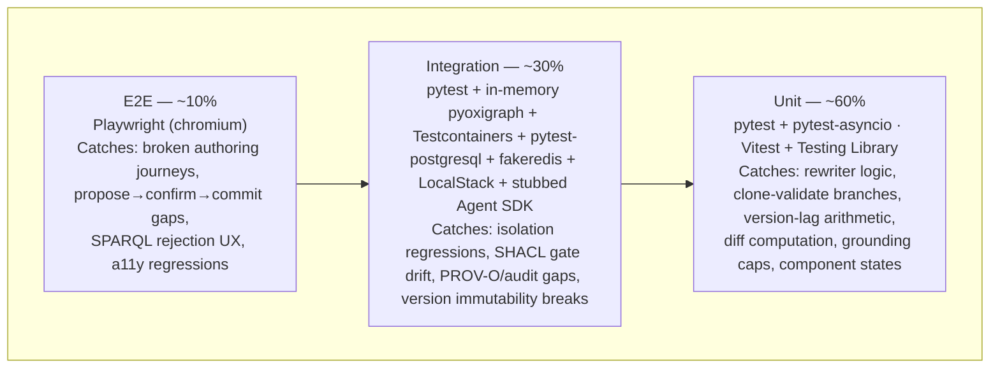

# Testing Strategy: Constitution Engine

## 1. Testing Pyramid Overview



| Layer | Tools | Coverage target | Mutation gate | Run in CI |
|-------|-------|-----------------|---------------|-----------|
| Unit | pytest + pytest-asyncio · Vitest + @testing-library/react | ≥ 80% (shared line target) | ≥ 60% (mutmut / Stryker) | Every push |
| Integration | pytest + pyoxigraph + Testcontainers + pytest-postgresql + fakeredis + LocalStack | contributes to shared ≥ 80% | N/A (fake-infra non-determinism) | Every push |
| E2E | Playwright (chromium) | Authoring critical paths + release-gate journeys | N/A | PR merge gate |

The CE **cross-cutting release gates** (SELECT-only rejection, cross-tenant zero rows, SHACL 422,
PROV-O completeness, immutable-version 405 — architecture.md §Invariants, ADR-001) each exist at BOTH
the integration layer (fast, per-push) and the E2E layer (assembled-app proof, merge gate). The CE
authoring UI is the chat panel, guided forms, and SPARQL editor surfaced inside the shared SPA, so
Vitest covers the CE-owned components while Python covers the graph engine.

## 2. Unit Test Strategy

### Python (CE API)

```text
packages/ce-api/tests/unit/
├── test_query_rewriter.py       # GRAPH-scope inject, SELECT-only, SERVICE-block, reject-unscoped
├── test_shacl_pipeline.py       # clone→validate→commit; inference='none'; severity routing 422
├── test_version_lifecycle.py    # draft→publish, is_latest bump, immutability, version-lag
├── test_diff.py                 # node + edge symmetric diff; edge-only change → modified
├── test_nl_to_select_grounding.py  # NL→SELECT routes through the one validator; grounding caps
├── test_prov_audit.py           # PROV-O activity shape; PLAT-AUDIT-1 dual-write + retry
└── conftest.py                  # shared fixtures (in-memory store, fake clock, factories)
```

- Framework: `pytest` + `pytest-asyncio` (async FastAPI handlers); `anyio` backend
- Coverage: `pytest-cov` with `--cov-fail-under=80`
- Mutation: `mutmut run` — CI fails below 60%
- Naming: `test_<function>_<scenario>_<expected_outcome>`
- Mocks: `pytest-mock` at I/O boundaries only (store adapter, LLM client, PLAT-* clients) — never mock
  the rewriter, the SHACL gate, or the diff computation; those are the point of the tests

```python
@pytest.mark.asyncio
async def test_rewriter_rejects_service_keyword_before_store(rewriter):
    query = "SELECT ?p WHERE { SERVICE <http://evil> { ?p a weave:Process } }"
    with pytest.raises(UnscopedOrUnsafeQuery) as err:
        rewriter.validate(query, tenant_id="A")
    assert err.value.code == "service_blocked"  # never reaches the store adapter
```

### TypeScript (CE authoring surfaces in the shared SPA)

```text
packages/frontend/src/constitution/
└── <feature>/
    └── __tests__/
        ├── ChatPanel.test.tsx        # persistent mount, 503 offline state, op-list default view
        ├── OperationReview.test.tsx   # plain-English summary before commit; raw-Turtle on demand
        ├── SparqlEditor.test.tsx      # SELECT-only client hint, SERVICE rejection state render
        └── VersionDiff.test.tsx       # added/removed/modified rendering; edge-only change shown
```

- Framework: `Vitest` (`jsdom`) + `@testing-library/react`
- Coverage: `@vitest/coverage-v8` — `--coverage.thresholds.lines=80`
- Mutation: Stryker with `@stryker-mutator/vitest-runner` — threshold ≥ 60%
- Naming: `should <expected behaviour> when <condition>`
- Mocks: `vi.mock()` at module boundaries; `msw` for HTTP; never mock rendering or pure functions

```typescript
it('should show the plain-English operation list, not raw Turtle, by default (FR-002)', async () => {
  render(<OperationReview proposal={SAMPLE_PROPOSAL} />);
  expect(await screen.findByText(/add process “invoice approval”/i)).toBeInTheDocument();
  expect(screen.queryByText(/@prefix weave:/i)).not.toBeInTheDocument();
});
```

### AC-to-test mapping (cross-cutting release gates)

| AC ID | EARS scenario | Test file | Test name |
|-------|---------------|-----------|-----------|
| FR-010/019 | WHEN a non-SELECT or SERVICE query reaches the rewriter THEN THE SYSTEM SHALL reject it before the store | `test_query_rewriter.py` | `test_non_select_rejected_before_store` |
| ADR-001 iso | WHEN a query runs in tenant A's context THEN THE SYSTEM SHALL return zero rows from tenant B's data | `test_query_rewriter.py` | `test_scoped_query_returns_zero_foreign_rows` |
| FR-004/005 | WHEN a batch produces one sh:Violation THEN THE SYSTEM SHALL commit nothing and return 422 | `test_shacl_pipeline.py` | `test_violation_commits_nothing_returns_422` |
| FR-006 | WHEN a batch commits THEN THE SYSTEM SHALL write PROV-O AND emit PLAT-AUDIT-1 | `test_prov_audit.py` | `test_commit_writes_prov_and_emits_audit` |
| FR-008 | WHEN a write targets a published version THEN THE SYSTEM SHALL reject it 405 | `test_version_lifecycle.py` | `test_write_to_published_version_returns_405` |
| ADR-002 | WHEN authority() is called with no Authority Extension THEN THE SYSTEM SHALL return coverage-gap + deny | `test_nl_to_select_grounding.py` | `test_authority_degrades_coverage_gap_then_deny` |

Remaining task-level ACs are mapped in each task brief's AC-to-Test Mapping table (the briefs are the
per-task source of truth; this table carries the cross-cutting gates).

## 3. Integration Test Strategy

Integration tests verify contracts between components against faked infrastructure — never real cloud
accounts (Law F).

### Infrastructure fakes

| Service | Dev/test fake | How to start |
|---------|---------------|--------------|
| RDF store (canonical CE fixture) | `pyoxigraph` `Store()` in-memory; Testcontainers Oxigraph image for full SPARQL 1.1-compliance runs | `rdf_store` fixture |
| Aurora PostgreSQL (version_metadata, snapshot_pointer) | `pytest-postgresql` fixture (RLS policies applied in migration fixtures) | auto-provisioned per session |
| ElastiCache Redis (SHACL shape cache) | `fakeredis` | `fakeredis.FakeAsyncRedis()` fixture |
| Cognito / Secrets Manager / SQS (PLAT-* emission) | LocalStack via Docker Compose | `docker compose -f tests/integration/docker-compose.test.yml up localstack` |
| Bedrock / AgentCore (NL→SELECT, propose_mutations) | stubbed Agent SDK transport — no real model calls; NL→SELECT quality evals live in `docs/standards/testing-agents.md` lane | `agent_transport` fixture |

The canonical CE store fixture is **in-memory pyoxigraph** — fast, ephemeral, destroyed per test. A
smaller Testcontainers Oxigraph tier runs the SPARQL-compliance and rewriter fuzz suites where the
in-memory store's SPARQL surface is not authoritative. No test issues a real model call; the stubbed
Agent SDK transport returns fixture SPARQL/mutations so the rewriter and SHACL gate — not the model —
are what the integration layer exercises.

```python
@pytest.fixture
def rdf_store():
    from pyoxigraph import Store
    return Store()  # ephemeral; destroyed after test
```

### Directory layout

```text
packages/ce-api/tests/integration/
├── conftest.py                    # pyoxigraph, pytest-postgresql (with RLS), fakeredis, LocalStack, agent-stub fixtures
├── docker-compose.test.yml
├── test_write_path.py             # clone→SHACL→commit→PROV-O→PLAT-AUDIT-1 end to end (201 + 422 paths)
├── test_cross_tenant_isolation.py # two seeded tenants; scoped + unscoped + connector-write cases (release gate)
├── test_query_rewriter.py         # unscoped/SERVICE/non-SELECT → rejected; NL query shares the one validator
├── test_version_publish.py        # publish → immutable :v{semver}; 405 on write; version-lag; diff both graphs
├── test_shacl_shape_isolation.py  # tenant-A custom shape never affects a tenant-B commit (FR-025)
├── test_prov_audit_dualwrite.py   # PROV-O + PLAT-AUDIT-1 on commit; audit-emit retry; never-audited-on-failure
└── test_nl_to_select.py           # stubbed model draft → rewriter → paginated rows; 422 on generated non-SELECT
```

### Fixture patterns

```python
@pytest.fixture(scope="session")
def localstack_endpoint():
    return os.getenv("LOCALSTACK_ENDPOINT", "http://localhost:4566")

@pytest.fixture
def agent_transport():
    # returns fixture SPARQL/mutations; NO real model call in the pyramid
    return StubAgentTransport(nl_to_select=NL_SELECT_FIXTURE, mutations=PROPOSE_FIXTURE)

@pytest.fixture
def two_tenant_seed(rdf_store):
    seed_framework(rdf_store)                 # urn:weave:g:framework (BPMO)
    seed_tenant(rdf_store, "A"); seed_tenant(rdf_store, "B")
    return rdf_store
```

### Must cover

- The full write path: clone → SHACL (`inference='none'`) → commit → PROV-O → PLAT-AUDIT-1 (201 and
  422 branches, warning/info advisory pass-through)
- Cross-tenant isolation: scoped read returns zero foreign rows; unscoped query rejected; connector
  write targeting another tenant's graph rejected 403 (ADR-001 release gate)
- Query rewriter: SELECT-only, SERVICE-blocked, reject-unscoped — and the NL-generated query routes
  through the identical validator (no SSRF bypass)
- Version lifecycle: publish snapshot immutable, 405 on write to a version, version-lag from Aurora,
  CE-DIFF-1 node + edge diff across two version graphs
- PROV-O + PLAT-AUDIT-1 dual-write, audit-emit retry, and the never-audited-on-failure invariant
- SHACL shape isolation: a tenant's custom shape never affects another tenant's commit
- Shape-cache invalidation across workers (Redis-backed)

### Must NOT

- Call real AWS endpoints or real Bedrock models (no real credentials or region endpoints anywhere)
- Share state between tests (ephemeral pyoxigraph + Postgres/Redis per test)
- Test UI rendering (unit or E2E territory)

## 4. E2E Test Strategy

Framework: Playwright (TypeScript), against the locally started assembled app (`TEST_BASE_URL`, default
`http://localhost:3000`), LocalStack-backed API, in-memory graph seeded via a test-only endpoint.

```text
tests/e2e/
├── playwright.config.ts           # baseURL from env; workers: CI ? 1 : 4; artifacts on failure
├── fixtures/
│   ├── auth.fixture.ts            # authenticated page per role (steward, analyst, viewer)
│   └── seed.fixture.ts            # BPMO framework + two-tenant graph seed
├── chat-authoring.spec.ts         # NL propose → plain-English review → confirm → SHACL pass → commit
├── forms-authoring.spec.ts        # guided form create/edit; partial-update preserves untouched props
├── sparql-editor.spec.ts          # SELECT runs + paginates; UPDATE/SERVICE show rejection state
├── validation-reject.spec.ts      # a mutation violating SHACL surfaces 422 violations, no commit
├── version-diff.spec.ts           # publish a version; diff shows added/removed/modified incl. edges
└── isolation.spec.ts              # tenant-A UI never renders tenant-B data (release gate)
```

| AC ID | EARS scenario | Spec file | Status |
|-------|---------------|-----------|--------|
| FR-002 | WHEN an AI proposes a mutation THEN THE SYSTEM SHALL show a plain-English op-list before commit | `chat-authoring.spec.ts` | Planned |
| FR-005 | WHEN a proposed change violates a shape THEN THE SYSTEM SHALL show 422 violations and commit nothing | `validation-reject.spec.ts` | Planned |
| FR-019 | WHEN a user submits UPDATE or SERVICE in the editor THEN THE SYSTEM SHALL reject it pre-execution | `sparql-editor.spec.ts` | Planned |
| FR-013 | WHEN two versions are diffed THEN THE SYSTEM SHALL show node AND edge modifications | `version-diff.spec.ts` | Planned |
| ADR-001 | WHEN a tenant-A user browses any screen THEN THE SYSTEM SHALL render zero tenant-B artefacts | `isolation.spec.ts` | Planned |

Minimum scenarios (always required): happy path (NL propose → confirm → commit → query the new entity),
auth guard (unauthenticated → login redirect), error state (AI unavailable → 503 while forms, browse,
and SPARQL stay live). Accessibility: axe-core assertions run inside the E2E suite on the WCAG-gated
screens (chat panel, guided forms, query screen) — zero violations is a release gate (PRD §2.2).

CI gate: E2E runs on the PR merge gate only; unit + integration run every push. `ui_verify.sh --full`
(cross-screen reachability + a11y) runs at epic close per the implement loop and consumes this same
Playwright install.

## 5. Test Data Management

| Layer | Strategy | Rationale |
|-------|----------|-----------|
| Unit | Inline factories (`make_process`, `make_op`, `make_prov_activity`) | Fast, deterministic, no I/O |
| Integration | pyoxigraph seeded per test + BPMO framework fixture + golden two-tenant seed | Isolation is itself under test — seeds must be per-test |
| E2E | Playwright `seed.fixture.ts` calling a test-only seed endpoint (disabled outside test env) | Reproducible starting state |

The **BPMO framework-graph fixture** loads `urn:weave:g:framework` (the 13 kinds, predicates, base
SHACL + SKOS scaffolding) so tests exercise real class/predicate IRIs, not hand-invented ones. The
**golden two-tenant seed** populates tenant A and tenant B with overlapping labels so cross-tenant and
shape-isolation tests have a foreign row to (fail to) find.

```python
def make_op(op_type="add_node", kind="Process", label="Invoice Approval", ref="n1", **overrides):
    return Op(op_type=op_type, kind=kind, label=label, ref=ref, **overrides)
```

```typescript
export const makeProposal = (overrides: Partial<Proposal> = {}): Proposal => ({
  operations: [{ op: "add_node", kind: "Process", label: "Invoice Approval", ref: "n1" }],
  actor: `urn:weave:principal:${crypto.randomUUID()}`,
  ...overrides,
});
```

Prohibited: shared mutable test graphs/databases; hardcoded IRIs/UUIDs; production data snapshots
(synthetic only — Law F); secrets or PII in fixtures (fake values via `faker`); asserting on wall-clock
time (inject `FIXED_CLOCK` — PROV-O timestamps and version ordering depend on deterministic times).

## 6. Performance and Load Testing

CE exposes public read/write API endpoints and serves the authoring surfaces — this section applies.
The write and NL budgets are the TASK-008 go/no-go thresholds (business-process.md §Perf-Spike),
measured at a **100k-triple seeded store**; they gate M1 launch.

| Endpoint pattern | Method | P50 target | P95 target | P99 target |
|-----------------|--------|-----------|-----------|-----------|
| `/api/sparql` (CE-READ-1, ≤ 3 patterns) | GET | < 150ms | < 500ms (PRD §2.2) | < 800ms |
| `/api/sparql` (paginated SELECT) | GET | < 120ms | < 300ms (TASK-008 gate @100k) | < 500ms |
| `/api/operations/apply` (CE-WRITE-1 single op) | POST | < 300ms | < 800ms (TASK-008 gate @100k) | < 1200ms |
| `/api/query/nl` (NL→SELECT) | POST | < 250ms | < 500ms (TASK-008 gate @100k) | < 900ms |
| `/api/ontology/types` (CE-READ-1) | GET | < 50ms | < 150ms | < 300ms |

Load tool: `locust`, in the `performance` CI workflow (the SPIKE-CE-PERF-1 spike + any PR touching a
hot-path endpoint — the query rewriter and the CE-WRITE-1 SHACL gate are the hot paths: every read and
write crosses them). The spike seeds 10k–500k triples; 100k is the M1 gate, 500k is measured but not
gating. If a threshold fails, the degrade path (Degrade A shape-cache, Degrade B batch-collapse,
Degrade C defer Build grounding) is applied before escalation — and no degrade ever widens tenant
scope (business-process.md invariant).

```python
class ConstitutionUser(HttpUser):
    wait_time = between(1, 3)

    @task(3)
    def read_processes(self):
        self.client.get("/api/sparql?version=latest&page=1",
                        params={"query": "SELECT ?p WHERE { ?p a weave:Process }"})

    @task(1)
    def apply_mutation(self):
        self.client.post("/api/operations/apply", json=SINGLE_OP_FIXTURE)
```

| Lighthouse metric (authoring surfaces) | Target |
|--------|--------|
| Performance score | ≥ 90 |
| Accessibility score | ≥ 95 |
| Best practices score | ≥ 90 |
| Initial JS bundle (gzipped) | ≤ 200KB |

Lighthouse runs on every PR modifying a CE page component or layout; the chat/query/forms WCAG 2.1 AA
gate is asserted via axe-core in the E2E lane, with locust guarding the API-side latency budget.

---

*Generated by Weave arch-quality skill. Review and approve before task decomposition.*
